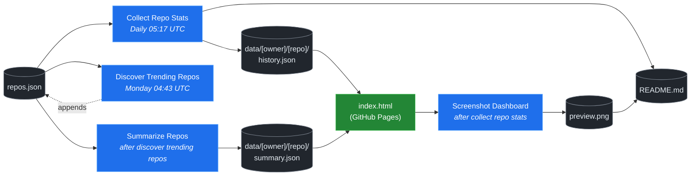

# 🚀 Rising Repos Tracker

> Automatically tracks daily GitHub stats (stars, forks, issues, velocity) for rising open source repos.

[](https://www.telosignal.com/)


**[→ View Live Dashboard](https://patrick-creates.github.io/rising-repos-tracker/)**

Built and maintained by [Telosignal](https://www.telosignal.com/).


<!-- AUTOGEN-STATS-START -->
## 📊 Current snapshot

> Auto-updated daily — last refreshed 2026-08-31

| Metric | Value |
|---|---|
| Repos tracked | **187** |
| Total stars | **9,114,874** |
| Total forks | **1,349,471** |
| Fastest growing | **ponytail** (+997.4/day) |

### 🔥 Top 5 by velocity

| # | Repo | Stars | Stars/day |
|---|---|---:|---:|
| 1 | [DietrichGebert/ponytail](https://github.com/DietrichGebert/ponytail) | 117,839 | +997.4 |
| 2 | [bojieli/ai-agent-book](https://github.com/bojieli/ai-agent-book) | 43,834 | +854.3 |
| 3 | [diegosouzapw/OmniRoute](https://github.com/diegosouzapw/OmniRoute) | 58,967 | +836.0 |
| 4 | [NousResearch/hermes-agent](https://github.com/NousResearch/hermes-agent) | 238,737 | +824.5 |
| 5 | [stablyai/orca](https://github.com/stablyai/orca) | 57,944 | +810.0 |

### 🆕 Recently added

- [WenyuChiou/awesome-agentic-ai-zh](https://github.com/WenyuChiou/awesome-agentic-ai-zh) — added 2026-08-31 — A trilingual (繁中 / English / 简中) learning roadmap for agentic AI: from LLM basics to multi-agent systems, with 240+ curated resources and hands-on examples. 中文 AI agent 學習地圖。
- [virgiliojr94/book-to-skill](https://github.com/virgiliojr94/book-to-skill) — added 2026-08-24 — Turn any technical book PDF into a Claude Code skill — ready to study, reference, and use while you work.
- [guillaumemeyer/watermarks-remover](https://github.com/guillaumemeyer/watermarks-remover) — added 2026-08-24 — Strip multi-vendor AI provenance marks: Unicode text hygiene, statistical rewrite hooks, and C2PA/metadata from PNG/JPEG/SVG/PDF/DOCX/HTML/MD
<!-- AUTOGEN-STATS-END -->

<!-- AUTOGEN-DIAGRAM-START -->
## 🔄 How it works


```mermaid
graph LR
    repos[("repos.json")]:::data
    history[("data/[owner]/[repo]/<br/>history.json")]:::data
    summary[("data/[owner]/[repo]/<br/>summary.json")]:::data
    readme[("README.md")]:::data
    preview[("preview.png")]:::data
    dashboard["index.html<br/>(GitHub Pages)"]:::output
    collect_yml["Collect Repo Stats<br/><i>Daily 05:17 UTC</i>"]:::workflow
    discover_yml["Discover Trending Repos<br/><i>Monday 04:43 UTC</i>"]:::workflow
    screenshot_yml["Screenshot Dashboard<br/><i>after collect repo stats</i>"]:::workflow
    summarize_yml["Summarize Repos<br/><i>after discover trending repos</i>"]:::workflow
    repos --> collect_yml
    collect_yml --> history
    collect_yml --> readme
    repos --> discover_yml
    discover_yml -.->|appends| repos
    dashboard --> screenshot_yml
    screenshot_yml --> preview
    repos --> summarize_yml
    summarize_yml --> summary
    history --> dashboard
    summary --> dashboard
    preview --> readme
    classDef workflow fill:#1f6feb,stroke:#58a6ff,color:#fff
    classDef data fill:#21262d,stroke:#7d8590,color:#e6edf3
    classDef output fill:#238636,stroke:#3fb950,color:#fff
```
<!-- AUTOGEN-DIAGRAM-END -->

<!-- AUTOGEN-WORKFLOWS-START -->
## ⚙️ Workflows

| File | Schedule | Name |
|---|---|---|
| `collect.yml` | Daily 05:17 UTC | Collect Repo Stats |
| `discover.yml` | Monday 04:43 UTC | Discover Trending Repos |
| `screenshot.yml` | After Collect Repo Stats | Screenshot Dashboard |
| `summarize.yml` | After Discover Trending Repos | Summarize Repos |

> All workflows commit results directly back to the repo. Schedules are best-effort — GitHub Actions cron can drift by a few minutes.
<!-- AUTOGEN-WORKFLOWS-END -->

<!-- AUTOGEN-REPOS-START -->
## 📋 All tracked repos

| Repo | Stars | Forks | Stars/day |
|---|---:|---:|---:|
| [openclaw/openclaw](https://github.com/openclaw/openclaw) | 388,188 | 81,492 | +152.0 |
| [obra/superpowers](https://github.com/obra/superpowers) | 279,877 | 25,087 | +632.9 |
| [affaan-m/ECC](https://github.com/affaan-m/ECC) | 244,930 | 37,009 | +537.8 |
| [affaan-m/everything-claude-code](https://github.com/affaan-m/everything-claude-code) | 244,929 | 37,009 | +580.7 |
| [NousResearch/hermes-agent](https://github.com/NousResearch/hermes-agent) | 238,737 | 48,663 | +824.5 |
| [Significant-Gravitas/AutoGPT](https://github.com/Significant-Gravitas/AutoGPT) | 187,027 | 46,045 | +25.0 |
| [microsoft/markitdown](https://github.com/microsoft/markitdown) | 177,303 | 13,037 | +493.6 |
| [f/prompts.chat](https://github.com/f/prompts.chat) | 168,299 | 21,696 | +55.7 |
| [langgenius/dify](https://github.com/langgenius/dify) | 153,987 | 24,326 | +116.0 |
| [open-webui/open-webui](https://github.com/open-webui/open-webui) | 150,477 | 21,970 | +123.5 |
| [langchain-ai/langchain](https://github.com/langchain-ai/langchain) | 145,331 | 24,251 | +79.1 |
| [github/spec-kit](https://github.com/github/spec-kit) | 132,434 | 11,925 | +314.3 |
| [farion1231/cc-switch](https://github.com/farion1231/cc-switch) | 130,337 | 8,949 | +536.1 |
| [nextlevelbuilder/ui-ux-pro-max-skill](https://github.com/nextlevelbuilder/ui-ux-pro-max-skill) | 123,379 | 13,204 | +413.5 |
| [microsoft/generative-ai-for-beginners](https://github.com/microsoft/generative-ai-for-beginners) | 118,860 | 62,651 | +73.7 |
| [DietrichGebert/ponytail](https://github.com/DietrichGebert/ponytail) | 117,839 | 6,423 | +997.4 |
| [Graphify-Labs/graphify](https://github.com/Graphify-Labs/graphify) | 112,843 | 10,980 | +461.3 |
| [JuliusBrussee/caveman](https://github.com/JuliusBrussee/caveman) | 101,968 | 5,933 | +385.3 |
| [nexu-io/open-design](https://github.com/nexu-io/open-design) | 92,956 | 10,723 | +464.6 |
| [thedotmack/claude-mem](https://github.com/thedotmack/claude-mem) | 92,714 | 8,157 | +157.6 |
| [ruvnet/RuView](https://github.com/ruvnet/RuView) | 92,152 | 12,236 | +267.9 |
| [vllm-project/vllm](https://github.com/vllm-project/vllm) | 90,575 | 21,468 | +97.2 |
| [ChatGPTNextWeb/NextChat](https://github.com/ChatGPTNextWeb/NextChat) | 88,675 | 59,166 | +6.1 |
| [OpenHands/OpenHands](https://github.com/OpenHands/OpenHands) | 85,736 | 11,230 | +112.4 |
| [koala73/worldmonitor](https://github.com/koala73/worldmonitor) | 85,151 | 12,817 | +293.2 |
| [Leonxlnx/taste-skill](https://github.com/Leonxlnx/taste-skill) | 82,707 | 5,658 | +574.7 |
| [lobehub/lobehub](https://github.com/lobehub/lobehub) | 82,121 | 15,839 | +46.6 |
| [rtk-ai/rtk](https://github.com/rtk-ai/rtk) | 78,014 | 4,916 | +270.8 |
| [dair-ai/Prompt-Engineering-Guide](https://github.com/dair-ai/Prompt-Engineering-Guide) | 77,928 | 8,558 | +30.7 |
| [Panniantong/Agent-Reach](https://github.com/Panniantong/Agent-Reach) | 76,944 | 6,587 | +636.5 |
| [datawhalechina/hello-agents](https://github.com/datawhalechina/hello-agents) | 75,750 | 9,412 | +239.0 |
| [shareAI-lab/learn-claude-code](https://github.com/shareAI-lab/learn-claude-code) | 75,727 | 12,212 | +139.5 |
| [openai/openai-cookbook](https://github.com/openai/openai-cookbook) | 75,637 | 12,790 | +19.3 |
| [unslothai/unsloth](https://github.com/unslothai/unsloth) | 75,320 | 6,832 | +103.0 |
| [ComposioHQ/awesome-claude-skills](https://github.com/ComposioHQ/awesome-claude-skills) | 74,117 | 8,490 | +130.8 |
| [santifer/career-ops](https://github.com/santifer/career-ops) | 69,534 | 13,146 | +231.3 |
| [code-yeongyu/oh-my-openagent](https://github.com/code-yeongyu/oh-my-openagent) | 68,547 | 5,621 | +97.3 |
| [headroomlabs-ai/headroom](https://github.com/headroomlabs-ai/headroom) | 68,156 | 5,284 | +317.9 |
| [chopratejas/headroom](https://github.com/chopratejas/headroom) | 68,155 | 5,284 | +519.4 |
| [Fission-AI/OpenSpec](https://github.com/Fission-AI/OpenSpec) | 66,788 | 4,601 | +171.4 |
| [xtekky/gpt4free](https://github.com/xtekky/gpt4free) | 66,618 | 13,513 | +3.6 |
| [shanraisshan/claude-code-best-practice](https://github.com/shanraisshan/claude-code-best-practice) | 65,415 | 6,515 | +113.5 |
| [ZhuLinsen/daily_stock_analysis](https://github.com/ZhuLinsen/daily_stock_analysis) | 64,374 | 53,983 | +260.6 |
| [asgeirtj/system_prompts_leaks](https://github.com/asgeirtj/system_prompts_leaks) | 63,868 | 10,492 | +223.6 |
| [tw93/Pake](https://github.com/tw93/Pake) | 61,183 | 12,577 | +118.1 |
| [mvanhorn/last30days-skill](https://github.com/mvanhorn/last30days-skill) | 60,745 | 5,307 | +334.2 |
| [usestrix/strix](https://github.com/usestrix/strix) | 59,621 | 6,520 | +372.6 |
| [diegosouzapw/OmniRoute](https://github.com/diegosouzapw/OmniRoute) | 58,967 | 8,187 | +836.0 |
| [MemPalace/mempalace](https://github.com/MemPalace/mempalace) | 58,748 | 7,541 | +60.5 |
| [stablyai/orca](https://github.com/stablyai/orca) | 57,944 | 3,948 | +810.0 |
| [BerriAI/litellm](https://github.com/BerriAI/litellm) | 57,662 | 11,039 | +97.8 |
| [FlowiseAI/Flowise](https://github.com/FlowiseAI/Flowise) | 55,400 | 24,969 | +23.8 |
| [calesthio/OpenMontage](https://github.com/calesthio/OpenMontage) | 54,847 | 6,847 | +428.5 |
| [ggml-org/whisper.cpp](https://github.com/ggml-org/whisper.cpp) | 53,323 | 6,123 | +33.3 |
| [hesreallyhim/awesome-claude-code](https://github.com/hesreallyhim/awesome-claude-code) | 53,272 | 4,641 | +87.4 |
| [jamiepine/voicebox](https://github.com/jamiepine/voicebox) | 51,930 | 6,470 | +251.7 |
| [rohitg00/ai-engineering-from-scratch](https://github.com/rohitg00/ai-engineering-from-scratch) | 51,486 | 8,907 | +276.1 |
| [ChromeDevTools/chrome-devtools-mcp](https://github.com/ChromeDevTools/chrome-devtools-mcp) | 50,248 | 3,535 | +98.7 |
| [router-for-me/CLIProxyAPI](https://github.com/router-for-me/CLIProxyAPI) | 49,590 | 7,580 | +151.5 |
| [Aider-AI/aider](https://github.com/Aider-AI/aider) | 48,620 | 4,905 | +34.8 |
| [kepano/obsidian-skills](https://github.com/kepano/obsidian-skills) | 47,568 | 3,416 | +150.4 |
| [HKUDS/nanobot](https://github.com/HKUDS/nanobot) | 47,567 | 8,393 | +46.5 |
| [elder-plinius/CL4R1T4S](https://github.com/elder-plinius/CL4R1T4S) | 47,243 | 9,558 | +108.5 |
| [QuantumNous/new-api](https://github.com/QuantumNous/new-api) | 46,885 | 11,157 | +117.6 |
| [zhayujie/CowAgent](https://github.com/zhayujie/CowAgent) | 46,736 | 10,327 | +20.8 |
| [coreyhaines31/marketingskills](https://github.com/coreyhaines31/marketingskills) | 46,238 | 7,220 | +162.6 |
| [sickn33/antigravity-awesome-skills](https://github.com/sickn33/antigravity-awesome-skills) | 45,742 | 6,690 | +72.1 |
| [sickn33/agentic-awesome-skills](https://github.com/sickn33/agentic-awesome-skills) | 45,742 | 6,690 | +55.1 |
| [Imbad0202/academic-research-skills](https://github.com/Imbad0202/academic-research-skills) | 44,372 | 3,520 | +133.7 |
| [bojieli/ai-agent-book](https://github.com/bojieli/ai-agent-book) | 43,834 | 4,824 | +854.3 |
| [heygen-com/hyperframes](https://github.com/heygen-com/hyperframes) | 43,294 | 4,159 | +211.1 |
| [danny-avila/LibreChat](https://github.com/danny-avila/LibreChat) | 42,642 | 8,827 | +52.8 |
| [chatboxai/chatbox](https://github.com/chatboxai/chatbox) | 41,623 | 4,219 | +15.5 |
| [chatanywhere/GPT_API_free](https://github.com/chatanywhere/GPT_API_free) | 41,522 | 2,707 | +34.3 |
| [DeusData/codebase-memory-mcp](https://github.com/DeusData/codebase-memory-mcp) | 41,415 | 3,373 | +329.9 |
| [Hmbown/CodeWhale](https://github.com/Hmbown/CodeWhale) | 40,876 | 3,536 | +63.3 |
| [langchain-ai/langgraph](https://github.com/langchain-ai/langgraph) | 40,776 | 6,875 | +76.5 |
| [AstrBotDevs/AstrBot](https://github.com/AstrBotDevs/AstrBot) | 39,843 | 2,858 | +68.7 |
| [mindsdb/mindshub](https://github.com/mindsdb/mindshub) | 39,667 | 6,239 | +5.4 |
| [wshobson/agents](https://github.com/wshobson/agents) | 39,292 | 4,191 | +34.2 |
| [Yeachan-Heo/oh-my-claudecode](https://github.com/Yeachan-Heo/oh-my-claudecode) | 38,913 | 3,491 | +41.7 |
| [MadsLorentzen/ai-job-search](https://github.com/MadsLorentzen/ai-job-search) | 38,823 | 13,162 | +351.8 |
| [google/langextract](https://github.com/google/langextract) | 38,514 | 2,706 | +20.0 |
| [github/awesome-copilot](https://github.com/github/awesome-copilot) | 38,473 | 4,858 | +47.6 |
| [songquanpeng/one-api](https://github.com/songquanpeng/one-api) | 36,659 | 6,843 | +25.0 |
| [PDFMathTranslate/PDFMathTranslate](https://github.com/PDFMathTranslate/PDFMathTranslate) | 36,520 | 3,266 | +25.6 |
| [anthropics/claude-plugins-official](https://github.com/anthropics/claude-plugins-official) | 35,685 | 3,978 | +73.3 |
| [esengine/DeepSeek-Reasonix](https://github.com/esengine/DeepSeek-Reasonix) | 35,284 | 2,359 | +187.6 |
| [agentscope-ai/QwenPaw](https://github.com/agentscope-ai/QwenPaw) | 34,728 | 3,048 | +220.1 |
| [volcengine/OpenViking](https://github.com/volcengine/OpenViking) | 34,602 | 2,643 | +110.4 |
| [AlexsJones/llmfit](https://github.com/AlexsJones/llmfit) | 34,577 | 2,166 | +83.3 |
| [ogulcancelik/herdr](https://github.com/ogulcancelik/herdr) | 33,894 | 2,481 | +383.9 |
| [herdrdev/herdr](https://github.com/herdrdev/herdr) | 33,894 | 2,481 | +360.9 |
| [JCodesMore/ai-website-cloner-template](https://github.com/JCodesMore/ai-website-cloner-template) | 33,486 | 4,889 | +214.2 |
| [zeroclaw-labs/zeroclaw](https://github.com/zeroclaw-labs/zeroclaw) | 32,683 | 4,923 | +11.1 |
| [iOfficeAI/AionUi](https://github.com/iOfficeAI/AionUi) | 32,457 | 3,334 | +56.1 |
| [HKUDS/Vibe-Trading](https://github.com/HKUDS/Vibe-Trading) | 32,152 | 5,255 | +276.4 |
| [mukul975/Anthropic-Cybersecurity-Skills](https://github.com/mukul975/Anthropic-Cybersecurity-Skills) | 31,771 | 3,828 | +195.0 |
| [tirth8205/code-review-graph](https://github.com/tirth8205/code-review-graph) | 31,034 | 2,826 | +162.6 |
| [Gitlawb/openclaude](https://github.com/Gitlawb/openclaude) | 30,915 | 8,920 | +30.5 |
| [googleworkspace/cli](https://github.com/googleworkspace/cli) | 30,661 | 1,798 | +43.3 |
| [iOfficeAI/OfficeCLI](https://github.com/iOfficeAI/OfficeCLI) | 29,574 | 2,012 | +378.2 |
| [p-e-w/heretic](https://github.com/p-e-w/heretic) | 29,420 | 3,225 | +64.9 |
| [alibaba/page-agent](https://github.com/alibaba/page-agent) | 28,915 | 2,594 | +134.5 |
| [voideditor/void](https://github.com/voideditor/void) | 28,819 | 2,648 | +0.2 |
| [jackwener/OpenCLI](https://github.com/jackwener/OpenCLI) | 28,766 | 2,824 | +59.1 |
| [langchain-ai/deepagents](https://github.com/langchain-ai/deepagents) | 28,756 | 4,037 | +54.8 |
| [can1357/oh-my-pi](https://github.com/can1357/oh-my-pi) | 28,629 | 2,857 | +209.0 |
| [BloopAI/vibe-kanban](https://github.com/BloopAI/vibe-kanban) | 27,964 | 2,999 | +13.8 |
| [rohitg00/agentmemory](https://github.com/rohitg00/agentmemory) | 27,836 | 2,402 | +71.6 |
| [jarrodwatts/claude-hud](https://github.com/jarrodwatts/claude-hud) | 27,742 | 1,283 | +36.3 |
| [virgiliojr94/book-to-skill](https://github.com/virgiliojr94/book-to-skill) | 27,470 | 2,844 | +377.3 |
| [decolua/9router](https://github.com/decolua/9router) | 26,774 | 4,888 | +119.5 |
| [manaflow-ai/cmux](https://github.com/manaflow-ai/cmux) | 26,619 | 2,283 | +46.2 |
| [zai-org/Open-AutoGLM](https://github.com/zai-org/Open-AutoGLM) | 26,128 | 4,022 | +7.9 |
| [TencentCloud/TencentDB-Agent-Memory](https://github.com/TencentCloud/TencentDB-Agent-Memory) | 25,363 | 2,365 | +339.7 |
| [toon-format/toon](https://github.com/toon-format/toon) | 25,281 | 1,123 | +9.3 |
| [winfunc/opcode](https://github.com/winfunc/opcode) | 22,387 | 1,728 | +4.5 |
| [pranshuparmar/witr](https://github.com/pranshuparmar/witr) | 21,962 | 766 | +62.4 |
| [pascalorg/editor](https://github.com/pascalorg/editor) | 21,790 | 2,801 | +25.7 |
| [alibaba/open-code-review](https://github.com/alibaba/open-code-review) | 21,706 | 1,609 | +209.3 |
| [coze-dev/coze-studio](https://github.com/coze-dev/coze-studio) | 21,522 | 3,123 | +6.8 |
| [NirDiamant/agents-towards-production](https://github.com/NirDiamant/agents-towards-production) | 21,352 | 2,837 | +8.5 |
| [jundot/omlx](https://github.com/jundot/omlx) | 21,123 | 1,794 | +58.3 |
| [Tencent/WeKnora](https://github.com/Tencent/WeKnora) | 21,041 | 3,027 | +61.7 |
| [steipete/CodexBar](https://github.com/steipete/CodexBar) | 20,746 | 1,809 | +79.2 |
| [KKKKhazix/khazix-skills](https://github.com/KKKKhazix/khazix-skills) | 20,299 | 2,177 | +67.6 |
| [mksglu/context-mode](https://github.com/mksglu/context-mode) | 20,271 | 1,473 | +36.4 |
| [jnMetaCode/agency-agents-zh](https://github.com/jnMetaCode/agency-agents-zh) | 20,145 | 3,262 | +67.7 |
| [guillaumemeyer/watermarks-remover](https://github.com/guillaumemeyer/watermarks-remover) | 19,593 | 2,275 | +291.6 |
| [tanweai/pua](https://github.com/tanweai/pua) | 19,556 | 1,191 | +17.0 |
| [datawhalechina/easy-vibe](https://github.com/datawhalechina/easy-vibe) | 19,195 | 1,835 | +29.3 |
| [1jehuang/jcode](https://github.com/1jehuang/jcode) | 18,864 | 2,153 | +215.5 |
| [danielmiessler/LifeOS](https://github.com/danielmiessler/LifeOS) | 18,799 | 2,442 | +39.0 |
| [RightNow-AI/openfang](https://github.com/RightNow-AI/openfang) | 18,151 | 2,289 | +4.2 |
| [microsoft/agent-lightning](https://github.com/microsoft/agent-lightning) | 17,934 | 1,575 | +8.1 |
| [nesquena/hermes-webui](https://github.com/nesquena/hermes-webui) | 17,921 | 2,488 | +44.0 |
| [t8y2/dbx](https://github.com/t8y2/dbx) | 17,562 | 1,722 | +163.6 |
| [browser-use/browser-harness](https://github.com/browser-use/browser-harness) | 17,264 | 1,673 | +28.3 |
| [jlcodes99/cockpit-tools](https://github.com/jlcodes99/cockpit-tools) | 16,816 | 1,468 | +64.0 |
| [cft0808/edict](https://github.com/cft0808/edict) | 16,758 | 1,755 | +9.0 |
| [MemoriLabs/Memori](https://github.com/MemoriLabs/Memori) | 16,293 | 3,279 | +13.6 |
| [composio-community/awesome-codex-skills](https://github.com/composio-community/awesome-codex-skills) | 16,142 | 1,574 | +20.6 |
| [xbtlin/ai-berkshire](https://github.com/xbtlin/ai-berkshire) | 16,036 | 2,413 | +93.9 |
| [xpzouying/xiaohongshu-mcp](https://github.com/xpzouying/xiaohongshu-mcp) | 15,566 | 2,288 | +18.3 |
| [Anionex/banana-slides](https://github.com/Anionex/banana-slides) | 15,525 | 1,778 | +5.5 |
| [wanshuiyin/Auto-claude-code-research-in-sleep](https://github.com/wanshuiyin/Auto-claude-code-research-in-sleep) | 15,493 | 1,352 | +43.2 |
| [yusufkaraaslan/Skill_Seekers](https://github.com/yusufkaraaslan/Skill_Seekers) | 14,868 | 1,514 | +9.2 |
| [kyegomez/OpenMythos](https://github.com/kyegomez/OpenMythos) | 14,854 | 3,293 | +10.0 |
| [walkinglabs/learn-harness-engineering](https://github.com/walkinglabs/learn-harness-engineering) | 14,569 | 1,448 | +83.6 |
| [NevaMind-AI/memU](https://github.com/NevaMind-AI/memU) | 14,365 | 1,063 | +6.6 |
| [NanmiCoder/cc-haha](https://github.com/NanmiCoder/cc-haha) | 14,253 | 8,545 | +13.5 |
| [superset-sh/superset](https://github.com/superset-sh/superset) | 13,555 | 1,232 | +22.1 |
| [XiaomiMiMo/MiMo-Code](https://github.com/XiaomiMiMo/MiMo-Code) | 12,909 | 1,335 | +29.9 |
| [sirmalloc/ccstatusline](https://github.com/sirmalloc/ccstatusline) | 12,684 | 554 | +22.3 |
| [EverMind-AI/EverOS](https://github.com/EverMind-AI/EverOS) | 12,587 | 910 | +45.6 |
| [ifixai-ai/iFixAi](https://github.com/ifixai-ai/iFixAi) | 11,872 | 1,233 | +176.1 |
| [ConardLi/garden-skills](https://github.com/ConardLi/garden-skills) | 11,855 | 1,458 | +47.8 |
| [0x4m4/hexstrike-ai](https://github.com/0x4m4/hexstrike-ai) | 11,462 | 2,382 | +23.0 |
| [brokermr810/QuantDinger](https://github.com/brokermr810/QuantDinger) | 11,259 | 2,351 | +35.3 |
| [OpenByteInc/QuantDinger](https://github.com/OpenByteInc/QuantDinger) | 11,259 | 2,351 | +34.7 |
| [MemTensor/MemOS](https://github.com/MemTensor/MemOS) | 11,107 | 1,016 | +17.1 |
| [holaboss-ai/holaOS](https://github.com/holaboss-ai/holaOS) | 11,082 | 720 | +193.6 |
| [ValueCell-ai/valuecell](https://github.com/ValueCell-ai/valuecell) | 11,006 | 1,805 | +2.1 |
| [aden-hive/hive](https://github.com/aden-hive/hive) | 10,990 | 5,669 | +6.0 |
| [EKKOLearnAI/hermes-studio](https://github.com/EKKOLearnAI/hermes-studio) | 10,723 | 1,299 | +33.3 |
| [openai/codex-security](https://github.com/openai/codex-security) | 10,293 | 747 | +71.8 |
| [Kuberwastaken/claurst](https://github.com/Kuberwastaken/claurst) | 10,282 | 7,756 | +6.6 |
| [ykdojo/claude-code-tips](https://github.com/ykdojo/claude-code-tips) | 9,981 | 803 | +17.2 |
| [StarTrail-org/PixelRAG](https://github.com/StarTrail-org/PixelRAG) | 9,812 | 840 | +65.9 |
| [getagentseal/codeburn](https://github.com/getagentseal/codeburn) | 9,760 | 776 | +23.0 |
| [frankbria/ralph-claude-code](https://github.com/frankbria/ralph-claude-code) | 9,611 | 722 | +4.5 |
| [EvoMap/evolver](https://github.com/EvoMap/evolver) | 9,030 | 840 | +3.1 |
| [modem-dev/hunk](https://github.com/modem-dev/hunk) | 8,944 | 281 | +45.7 |
| [iflytek/astron-agent](https://github.com/iflytek/astron-agent) | 8,892 | 867 | +5.0 |
| [MiroMindAI/MiroThinker](https://github.com/MiroMindAI/MiroThinker) | 8,361 | 644 | +0.6 |
| [mmulet/term.everything](https://github.com/mmulet/term.everything) | 8,085 | 194 | +1.1 |
| [ValueCell-ai/ClawX](https://github.com/ValueCell-ai/ClawX) | 7,600 | 1,142 | +1.2 |
| [1weiho/open-slide](https://github.com/1weiho/open-slide) | 7,327 | 519 | +57.6 |
| [opensquilla/opensquilla](https://github.com/opensquilla/opensquilla) | 6,818 | 539 | +14.5 |
| [steipete/summarize](https://github.com/steipete/summarize) | 6,587 | 441 | +3.6 |
| [WenyuChiou/awesome-agentic-ai-zh](https://github.com/WenyuChiou/awesome-agentic-ai-zh) | 6,551 | 881 | +55.5 |
| [Andyyyy64/whichllm](https://github.com/Andyyyy64/whichllm) | 6,536 | 357 | +15.9 |
| [Arthur-Ficial/apfel](https://github.com/Arthur-Ficial/apfel) | 6,336 | 243 | +4.5 |
| [microsoft/fara](https://github.com/microsoft/fara) | 6,165 | 604 | +3.4 |
| [UfoMiao/zcf](https://github.com/UfoMiao/zcf) | 6,079 | 420 | +0.2 |
| [re4/LibreCode](https://github.com/re4/LibreCode) | 85 | 5 | — |
<!-- AUTOGEN-REPOS-END -->

---

## What it does

- Collects daily snapshots of stars, forks, watchers and open issues for every tracked repo
- Discovers new trending repos automatically every Monday using the GitHub Search API
- Generates AI summaries (use cases, similar tools, tags) for each tracked repo via GitHub Models
- Stores all history as plain JSON — no database, no backend
- Renders a live dashboard via GitHub Pages — updates daily, zero maintenance

## Tracked repos

Data lives in [`data/`](./data) — one folder per repo, one `history.json` per entry.  
The full watch list is in [`repos.json`](./repos.json).

## Fork & use it for yourself

This is my personal tracker — the watch list reflects what I find interesting. If you want to track different repos, the best path is to **fork this repo and run your own**.

### Setup

1. Fork this repo to your account
2. Replace the contents of [`repos.json`](./repos.json) with the repos you want to track (or just leave one entry — `discover.yml` will auto-add more every Monday)
3. Go to **Settings → Pages** and enable GitHub Pages from the `main` branch
4. Go to **Actions** and run **Collect Repo Stats** once manually to seed your first data point
5. Your dashboard will be live at `https://YOUR-USERNAME.github.io/rising-repos-tracker/`

That's it — daily collection and weekly discovery run automatically on schedule. Zero ongoing maintenance.

### Customizing what gets discovered

Edit [`scripts/discover.js`](./scripts/discover.js) to change:

- `MIN_STARS` — minimum star threshold for candidates
- `MAX_AGE_DAYS` — how recent a repo must be
- `MAX_NEW_REPOS` — how many to add per discovery run
- The `queries` array — GitHub Search API queries that define what "trending" means to you

### Adding a repo manually

Just edit `repos.json` directly:

```json
{
  "owner": "OWNER",
  "repo": "REPO",
  "added": "YYYY-MM-DD",
  "notes": "why you're tracking this"
}
```

The next daily collect run picks it up automatically.

## Stack

- **GitHub Actions** — scheduling and automation
- **GitHub Pages** — dashboard hosting
- **GitHub API** — data source
- **GitHub Models** — free AI summaries (gpt-4o-mini)
- **Chart.js** — star growth visualization
- **Mermaid** — architecture diagram (rendered by GitHub)
- No dependencies, no build step, no database

## License

MIT
