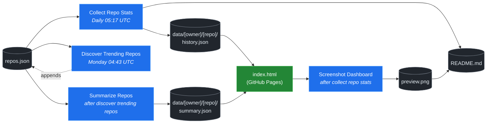

# 🚀 Rising Repos Tracker

> Automatically tracks daily GitHub stats (stars, forks, issues, velocity) for rising open source repos.

[](https://www.telosignal.com/)


**[→ View Live Dashboard](https://patrick-creates.github.io/rising-repos-tracker/)**

Built and maintained by [Telosignal](https://www.telosignal.com/).


<!-- AUTOGEN-STATS-START -->
## 📊 Current snapshot

> Auto-updated daily — last refreshed 2026-07-28

| Metric | Value |
|---|---|
| Repos tracked | **175** |
| Total stars | **8,265,431** |
| Total forks | **1,238,816** |
| Fastest growing | **ai-agent-book** (+1950.8/day) |

### 🔥 Top 5 by velocity

| # | Repo | Stars | Stars/day |
|---|---|---:|---:|
| 1 | [bojieli/ai-agent-book](https://github.com/bojieli/ai-agent-book) | 23,559 | +1950.8 |
| 2 | [DietrichGebert/ponytail](https://github.com/DietrichGebert/ponytail) | 90,559 | +1181.7 |
| 3 | [NousResearch/hermes-agent](https://github.com/NousResearch/hermes-agent) | 221,582 | +967.6 |
| 4 | [diegosouzapw/OmniRoute](https://github.com/diegosouzapw/OmniRoute) | 32,448 | +922.5 |
| 5 | [stablyai/orca](https://github.com/stablyai/orca) | 31,175 | +845.1 |

### 🆕 Recently added

- [Graphify-Labs/graphify](https://github.com/Graphify-Labs/graphify) — added 2026-07-27 — Turn any codebase, with its docs, SQL schemas, configs, and PDFs, into a queryable knowledge graph. A /graphify skill for Claude Code, Cursor, Codex, and Gemini CLI: local deterministic AST parsing, every edge explained, no vector store.
- [Imbad0202/academic-research-skills](https://github.com/Imbad0202/academic-research-skills) — added 2026-07-27 — Academic Research Skills for Claude Code: research → write → review → revise → finalize
- [Anionex/banana-slides](https://github.com/Anionex/banana-slides) — added 2026-07-27 — 一个基于nano banana pro🍌的原生AI PPT生成应用，迈向＂Vibe PPT＂; 支持上传任意模板图片，上传任意素材&智能解析，一句话/大纲/页面描述自动生成PPT，口头修改指定区域、一键导出可编辑ppt - An AI-native slides generator based on nano banana pro🍌
<!-- AUTOGEN-STATS-END -->

<!-- AUTOGEN-DIAGRAM-START -->
## 🔄 How it works


```mermaid
graph LR
    repos[("repos.json")]:::data
    history[("data/[owner]/[repo]/<br/>history.json")]:::data
    summary[("data/[owner]/[repo]/<br/>summary.json")]:::data
    readme[("README.md")]:::data
    preview[("preview.png")]:::data
    dashboard["index.html<br/>(GitHub Pages)"]:::output
    collect_yml["Collect Repo Stats<br/><i>Daily 05:17 UTC</i>"]:::workflow
    discover_yml["Discover Trending Repos<br/><i>Monday 04:43 UTC</i>"]:::workflow
    screenshot_yml["Screenshot Dashboard<br/><i>after collect repo stats</i>"]:::workflow
    summarize_yml["Summarize Repos<br/><i>after discover trending repos</i>"]:::workflow
    repos --> collect_yml
    collect_yml --> history
    collect_yml --> readme
    repos --> discover_yml
    discover_yml -.->|appends| repos
    dashboard --> screenshot_yml
    screenshot_yml --> preview
    repos --> summarize_yml
    summarize_yml --> summary
    history --> dashboard
    summary --> dashboard
    preview --> readme
    classDef workflow fill:#1f6feb,stroke:#58a6ff,color:#fff
    classDef data fill:#21262d,stroke:#7d8590,color:#e6edf3
    classDef output fill:#238636,stroke:#3fb950,color:#fff
```
<!-- AUTOGEN-DIAGRAM-END -->

<!-- AUTOGEN-WORKFLOWS-START -->
## ⚙️ Workflows

| File | Schedule | Name |
|---|---|---|
| `collect.yml` | Daily 05:17 UTC | Collect Repo Stats |
| `discover.yml` | Monday 04:43 UTC | Discover Trending Repos |
| `screenshot.yml` | After Collect Repo Stats | Screenshot Dashboard |
| `summarize.yml` | After Discover Trending Repos | Summarize Repos |

> All workflows commit results directly back to the repo. Schedules are best-effort — GitHub Actions cron can drift by a few minutes.
<!-- AUTOGEN-WORKFLOWS-END -->

<!-- AUTOGEN-REPOS-START -->
## 📋 All tracked repos

| Repo | Stars | Forks | Stars/day |
|---|---:|---:|---:|
| [openclaw/openclaw](https://github.com/openclaw/openclaw) | 384,385 | 80,751 | +169.9 |
| [obra/superpowers](https://github.com/obra/superpowers) | 262,327 | 23,424 | +743.1 |
| [affaan-m/everything-claude-code](https://github.com/affaan-m/everything-claude-code) | 234,335 | 35,712 | +701.1 |
| [affaan-m/ECC](https://github.com/affaan-m/ECC) | 234,335 | 35,712 | +657.9 |
| [NousResearch/hermes-agent](https://github.com/NousResearch/hermes-agent) | 221,582 | 42,343 | +967.6 |
| [Significant-Gravitas/AutoGPT](https://github.com/Significant-Gravitas/AutoGPT) | 185,727 | 46,066 | +19.0 |
| [microsoft/markitdown](https://github.com/microsoft/markitdown) | 169,597 | 12,257 | +613.0 |
| [f/prompts.chat](https://github.com/f/prompts.chat) | 166,461 | 21,502 | +56.4 |
| [langgenius/dify](https://github.com/langgenius/dify) | 150,510 | 23,717 | +122.2 |
| [open-webui/open-webui](https://github.com/open-webui/open-webui) | 147,017 | 21,374 | +133.2 |
| [langchain-ai/langchain](https://github.com/langchain-ai/langchain) | 142,764 | 23,762 | +80.6 |
| [github/spec-kit](https://github.com/github/spec-kit) | 124,205 | 11,086 | +346.6 |
| [farion1231/cc-switch](https://github.com/farion1231/cc-switch) | 121,853 | 8,204 | +673.4 |
| [microsoft/generative-ai-for-beginners](https://github.com/microsoft/generative-ai-for-beginners) | 113,616 | 60,980 | +37.7 |
| [nextlevelbuilder/ui-ux-pro-max-skill](https://github.com/nextlevelbuilder/ui-ux-pro-max-skill) | 110,911 | 11,823 | +434.4 |
| [Graphify-Labs/graphify](https://github.com/Graphify-Labs/graphify) | 97,343 | 9,432 | +645.0 |
| [JuliusBrussee/caveman](https://github.com/JuliusBrussee/caveman) | 93,646 | 5,346 | +452.6 |
| [DietrichGebert/ponytail](https://github.com/DietrichGebert/ponytail) | 90,559 | 4,983 | +1181.7 |
| [thedotmack/claude-mem](https://github.com/thedotmack/claude-mem) | 88,792 | 7,716 | +176.5 |
| [ChatGPTNextWeb/NextChat](https://github.com/ChatGPTNextWeb/NextChat) | 88,567 | 59,370 | +7.5 |
| [vllm-project/vllm](https://github.com/vllm-project/vllm) | 87,413 | 19,954 | +99.1 |
| [ruvnet/RuView](https://github.com/ruvnet/RuView) | 87,062 | 11,581 | +330.8 |
| [OpenHands/OpenHands](https://github.com/OpenHands/OpenHands) | 82,359 | 10,552 | +118.7 |
| [nexu-io/open-design](https://github.com/nexu-io/open-design) | 82,071 | 9,486 | +533.8 |
| [lobehub/lobehub](https://github.com/lobehub/lobehub) | 80,911 | 15,723 | +51.5 |
| [dair-ai/Prompt-Engineering-Guide](https://github.com/dair-ai/Prompt-Engineering-Guide) | 77,085 | 8,471 | +33.6 |
| [koala73/worldmonitor](https://github.com/koala73/worldmonitor) | 75,551 | 11,316 | +298.4 |
| [openai/openai-cookbook](https://github.com/openai/openai-cookbook) | 74,951 | 12,679 | +18.9 |
| [rtk-ai/rtk](https://github.com/rtk-ai/rtk) | 73,584 | 4,599 | +338.1 |
| [shareAI-lab/learn-claude-code](https://github.com/shareAI-lab/learn-claude-code) | 72,451 | 11,752 | +160.2 |
| [ComposioHQ/awesome-claude-skills](https://github.com/ComposioHQ/awesome-claude-skills) | 71,121 | 7,985 | +151.2 |
| [datawhalechina/hello-agents](https://github.com/datawhalechina/hello-agents) | 69,080 | 8,606 | +259.4 |
| [unslothai/unsloth](https://github.com/unslothai/unsloth) | 69,005 | 6,212 | +63.5 |
| [Leonxlnx/taste-skill](https://github.com/Leonxlnx/taste-skill) | 68,402 | 4,726 | +666.5 |
| [code-yeongyu/oh-my-openagent](https://github.com/code-yeongyu/oh-my-openagent) | 66,698 | 5,435 | +117.9 |
| [xtekky/gpt4free](https://github.com/xtekky/gpt4free) | 66,499 | 13,531 | +3.6 |
| [shanraisshan/claude-code-best-practice](https://github.com/shanraisshan/claude-code-best-practice) | 63,614 | 6,333 | +142.5 |
| [Fission-AI/OpenSpec](https://github.com/Fission-AI/OpenSpec) | 62,868 | 4,347 | +198.3 |
| [chopratejas/headroom](https://github.com/chopratejas/headroom) | 62,846 | 4,761 | +806.6 |
| [headroomlabs-ai/headroom](https://github.com/headroomlabs-ai/headroom) | 62,846 | 4,761 | +470.6 |
| [santifer/career-ops](https://github.com/santifer/career-ops) | 61,913 | 12,183 | +234.7 |
| [Panniantong/Agent-Reach](https://github.com/Panniantong/Agent-Reach) | 61,338 | 4,968 | +757.2 |
| [asgeirtj/system_prompts_leaks](https://github.com/asgeirtj/system_prompts_leaks) | 61,023 | 9,967 | +290.7 |
| [tw93/Pake](https://github.com/tw93/Pake) | 60,275 | 12,249 | +161.9 |
| [ZhuLinsen/daily_stock_analysis](https://github.com/ZhuLinsen/daily_stock_analysis) | 59,333 | 50,824 | +320.2 |
| [MemPalace/mempalace](https://github.com/MemPalace/mempalace) | 57,817 | 7,438 | +76.3 |
| [FlowiseAI/Flowise](https://github.com/FlowiseAI/Flowise) | 54,984 | 24,770 | +29.4 |
| [BerriAI/litellm](https://github.com/BerriAI/litellm) | 54,885 | 10,136 | +105.6 |
| [mvanhorn/last30days-skill](https://github.com/mvanhorn/last30days-skill) | 54,378 | 4,703 | +434.1 |
| [ggml-org/whisper.cpp](https://github.com/ggml-org/whisper.cpp) | 52,369 | 5,906 | +35.8 |
| [hesreallyhim/awesome-claude-code](https://github.com/hesreallyhim/awesome-claude-code) | 51,117 | 4,451 | +98.9 |
| [Aider-AI/aider](https://github.com/Aider-AI/aider) | 47,745 | 4,778 | +39.2 |
| [ChromeDevTools/chrome-devtools-mcp](https://github.com/ChromeDevTools/chrome-devtools-mcp) | 47,720 | 3,225 | +110.4 |
| [jamiepine/voicebox](https://github.com/jamiepine/voicebox) | 47,102 | 5,778 | +317.2 |
| [elder-plinius/CL4R1T4S](https://github.com/elder-plinius/CL4R1T4S) | 46,461 | 9,482 | +176.0 |
| [HKUDS/nanobot](https://github.com/HKUDS/nanobot) | 46,318 | 8,201 | +51.2 |
| [zhayujie/CowAgent](https://github.com/zhayujie/CowAgent) | 46,170 | 10,285 | +22.7 |
| [router-for-me/CLIProxyAPI](https://github.com/router-for-me/CLIProxyAPI) | 45,262 | 7,046 | +164.3 |
| [usestrix/strix](https://github.com/usestrix/strix) | 45,098 | 4,718 | +340.1 |
| [rohitg00/ai-engineering-from-scratch](https://github.com/rohitg00/ai-engineering-from-scratch) | 44,371 | 7,488 | +315.9 |
| [sickn33/antigravity-awesome-skills](https://github.com/sickn33/antigravity-awesome-skills) | 44,048 | 6,500 | +83.9 |
| [sickn33/agentic-awesome-skills](https://github.com/sickn33/agentic-awesome-skills) | 44,048 | 6,500 | +67.1 |
| [QuantumNous/new-api](https://github.com/QuantumNous/new-api) | 43,625 | 10,172 | +129.2 |
| [kepano/obsidian-skills](https://github.com/kepano/obsidian-skills) | 43,500 | 3,097 | +168.7 |
| [calesthio/OpenMontage](https://github.com/calesthio/OpenMontage) | 42,898 | 5,171 | +518.9 |
| [coreyhaines31/marketingskills](https://github.com/coreyhaines31/marketingskills) | 42,017 | 6,621 | +185.6 |
| [danny-avila/LibreChat](https://github.com/danny-avila/LibreChat) | 41,368 | 8,523 | +60.9 |
| [chatboxai/chatbox](https://github.com/chatboxai/chatbox) | 41,169 | 4,164 | +16.5 |
| [Hmbown/CodeWhale](https://github.com/Hmbown/CodeWhale) | 40,183 | 3,469 | +86.1 |
| [Imbad0202/academic-research-skills](https://github.com/Imbad0202/academic-research-skills) | 39,836 | 3,193 | +142.0 |
| [mindsdb/mindshub](https://github.com/mindsdb/mindshub) | 39,501 | 6,225 | +6.7 |
| [chatanywhere/GPT_API_free](https://github.com/chatanywhere/GPT_API_free) | 39,207 | 2,675 | +16.4 |
| [wshobson/agents](https://github.com/wshobson/agents) | 38,313 | 4,098 | +37.1 |
| [langchain-ai/langgraph](https://github.com/langchain-ai/langgraph) | 38,303 | 6,445 | +80.1 |
| [AstrBotDevs/AstrBot](https://github.com/AstrBotDevs/AstrBot) | 38,213 | 2,715 | +81.1 |
| [heygen-com/hyperframes](https://github.com/heygen-com/hyperframes) | 38,193 | 3,600 | +252.6 |
| [Yeachan-Heo/oh-my-claudecode](https://github.com/Yeachan-Heo/oh-my-claudecode) | 38,125 | 3,435 | +51.6 |
| [google/langextract](https://github.com/google/langextract) | 37,907 | 2,629 | +21.1 |
| [github/awesome-copilot](https://github.com/github/awesome-copilot) | 37,126 | 4,654 | +51.9 |
| [DeusData/codebase-memory-mcp](https://github.com/DeusData/codebase-memory-mcp) | 36,021 | 2,815 | +530.7 |
| [songquanpeng/one-api](https://github.com/songquanpeng/one-api) | 36,007 | 6,758 | +28.1 |
| [PDFMathTranslate/PDFMathTranslate](https://github.com/PDFMathTranslate/PDFMathTranslate) | 35,825 | 3,191 | +28.3 |
| [anthropics/claude-plugins-official](https://github.com/anthropics/claude-plugins-official) | 32,764 | 3,688 | +65.8 |
| [diegosouzapw/OmniRoute](https://github.com/diegosouzapw/OmniRoute) | 32,448 | 4,201 | +922.5 |
| [zeroclaw-labs/zeroclaw](https://github.com/zeroclaw-labs/zeroclaw) | 32,418 | 4,846 | +13.0 |
| [stablyai/orca](https://github.com/stablyai/orca) | 31,175 | 2,206 | +845.1 |
| [iOfficeAI/AionUi](https://github.com/iOfficeAI/AionUi) | 30,968 | 3,109 | +63.5 |
| [AlexsJones/llmfit](https://github.com/AlexsJones/llmfit) | 30,835 | 1,876 | +67.3 |
| [JCodesMore/ai-website-cloner-template](https://github.com/JCodesMore/ai-website-cloner-template) | 30,408 | 4,374 | +312.0 |
| [Gitlawb/openclaude](https://github.com/Gitlawb/openclaude) | 30,395 | 8,897 | +39.6 |
| [googleworkspace/cli](https://github.com/googleworkspace/cli) | 30,033 | 1,753 | +58.2 |
| [agentscope-ai/QwenPaw](https://github.com/agentscope-ai/QwenPaw) | 29,346 | 2,877 | +269.0 |
| [voideditor/void](https://github.com/voideditor/void) | 28,875 | 2,600 | +1.2 |
| [HKUDS/Vibe-Trading](https://github.com/HKUDS/Vibe-Trading) | 28,163 | 4,566 | +462.9 |
| [alibaba/page-agent](https://github.com/alibaba/page-agent) | 28,034 | 2,465 | +220.4 |
| [esengine/DeepSeek-Reasonix](https://github.com/esengine/DeepSeek-Reasonix) | 27,928 | 1,798 | +168.0 |
| [MadsLorentzen/ai-job-search](https://github.com/MadsLorentzen/ai-job-search) | 27,769 | 9,089 | +412.4 |
| [BloopAI/vibe-kanban](https://github.com/BloopAI/vibe-kanban) | 27,559 | 2,920 | +14.9 |
| [volcengine/OpenViking](https://github.com/volcengine/OpenViking) | 27,529 | 2,156 | +44.0 |
| [jackwener/OpenCLI](https://github.com/jackwener/OpenCLI) | 27,304 | 2,686 | +70.1 |
| [tirth8205/code-review-graph](https://github.com/tirth8205/code-review-graph) | 27,117 | 2,511 | +200.1 |
| [langchain-ai/deepagents](https://github.com/langchain-ai/deepagents) | 26,890 | 3,764 | +54.7 |
| [jarrodwatts/claude-hud](https://github.com/jarrodwatts/claude-hud) | 26,876 | 1,245 | +43.7 |
| [p-e-w/heretic](https://github.com/p-e-w/heretic) | 26,860 | 2,914 | +57.8 |
| [mukul975/Anthropic-Cybersecurity-Skills](https://github.com/mukul975/Anthropic-Cybersecurity-Skills) | 26,756 | 3,244 | +239.8 |
| [rohitg00/agentmemory](https://github.com/rohitg00/agentmemory) | 25,899 | 2,157 | +81.5 |
| [zai-org/Open-AutoGLM](https://github.com/zai-org/Open-AutoGLM) | 25,895 | 4,017 | +8.7 |
| [manaflow-ai/cmux](https://github.com/manaflow-ai/cmux) | 25,237 | 2,089 | +58.7 |
| [toon-format/toon](https://github.com/toon-format/toon) | 25,008 | 1,110 | +10.2 |
| [decolua/9router](https://github.com/decolua/9router) | 23,846 | 4,065 | +145.9 |
| [bojieli/ai-agent-book](https://github.com/bojieli/ai-agent-book) | 23,559 | 2,387 | +1950.8 |
| [iOfficeAI/OfficeCLI](https://github.com/iOfficeAI/OfficeCLI) | 22,739 | 1,532 | +651.9 |
| [winfunc/opcode](https://github.com/winfunc/opcode) | 22,251 | 1,716 | +4.9 |
| [ogulcancelik/herdr](https://github.com/ogulcancelik/herdr) | 21,658 | 1,454 | +421.0 |
| [coze-dev/coze-studio](https://github.com/coze-dev/coze-studio) | 21,272 | 3,089 | +6.5 |
| [NirDiamant/agents-towards-production](https://github.com/NirDiamant/agents-towards-production) | 21,194 | 2,816 | +11.2 |
| [can1357/oh-my-pi](https://github.com/can1357/oh-my-pi) | 20,330 | 1,900 | +175.9 |
| [mksglu/context-mode](https://github.com/mksglu/context-mode) | 19,392 | 1,373 | +44.7 |
| [steipete/CodexBar](https://github.com/steipete/CodexBar) | 19,203 | 1,592 | +111.1 |
| [tanweai/pua](https://github.com/tanweai/pua) | 19,074 | 1,157 | +19.3 |
| [Tencent/WeKnora](https://github.com/Tencent/WeKnora) | 19,022 | 2,676 | +63.5 |
| [datawhalechina/easy-vibe](https://github.com/datawhalechina/easy-vibe) | 18,574 | 1,767 | +38.0 |
| [KKKKhazix/khazix-skills](https://github.com/KKKKhazix/khazix-skills) | 18,523 | 2,066 | +133.1 |
| [jnMetaCode/agency-agents-zh](https://github.com/jnMetaCode/agency-agents-zh) | 18,436 | 3,067 | +84.2 |
| [pranshuparmar/witr](https://github.com/pranshuparmar/witr) | 18,331 | 579 | +10.3 |
| [jundot/omlx](https://github.com/jundot/omlx) | 18,244 | 1,557 | +37.5 |
| [RightNow-AI/openfang](https://github.com/RightNow-AI/openfang) | 18,067 | 2,283 | +5.6 |
| [microsoft/agent-lightning](https://github.com/microsoft/agent-lightning) | 17,427 | 1,525 | +2.7 |
| [danielmiessler/LifeOS](https://github.com/danielmiessler/LifeOS) | 17,035 | 2,305 | +26.9 |
| [nesquena/hermes-webui](https://github.com/nesquena/hermes-webui) | 16,635 | 2,253 | +49.9 |
| [browser-use/browser-harness](https://github.com/browser-use/browser-harness) | 16,305 | 1,543 | +28.5 |
| [cft0808/edict](https://github.com/cft0808/edict) | 16,278 | 1,708 | +5.0 |
| [MemoriLabs/Memori](https://github.com/MemoriLabs/Memori) | 15,668 | 2,883 | +9.0 |
| [Anionex/banana-slides](https://github.com/Anionex/banana-slides) | 15,342 | 1,768 | +9.0 |
| [alibaba/open-code-review](https://github.com/alibaba/open-code-review) | 15,186 | 1,023 | +236.3 |
| [xpzouying/xiaohongshu-mcp](https://github.com/xpzouying/xiaohongshu-mcp) | 14,894 | 2,197 | +16.9 |
| [kyegomez/OpenMythos](https://github.com/kyegomez/OpenMythos) | 14,763 | 3,299 | +16.9 |
| [yusufkaraaslan/Skill_Seekers](https://github.com/yusufkaraaslan/Skill_Seekers) | 14,578 | 1,479 | +9.8 |
| [xbtlin/ai-berkshire](https://github.com/xbtlin/ai-berkshire) | 14,517 | 2,038 | +170.0 |
| [NevaMind-AI/memU](https://github.com/NevaMind-AI/memU) | 14,093 | 1,047 | +5.4 |
| [wanshuiyin/Auto-claude-code-research-in-sleep](https://github.com/wanshuiyin/Auto-claude-code-research-in-sleep) | 13,948 | 1,247 | +40.5 |
| [superset-sh/superset](https://github.com/superset-sh/superset) | 12,635 | 1,129 | +16.4 |
| [XiaomiMiMo/MiMo-Code](https://github.com/XiaomiMiMo/MiMo-Code) | 12,505 | 1,274 | +51.1 |
| [1jehuang/jcode](https://github.com/1jehuang/jcode) | 12,348 | 1,359 | +269.5 |
| [t8y2/dbx](https://github.com/t8y2/dbx) | 12,116 | 1,152 | +279.0 |
| [sirmalloc/ccstatusline](https://github.com/sirmalloc/ccstatusline) | 12,047 | 528 | +26.4 |
| [EverMind-AI/EverOS](https://github.com/EverMind-AI/EverOS) | 11,600 | 871 | +65.0 |
| [ValueCell-ai/valuecell](https://github.com/ValueCell-ai/valuecell) | 10,953 | 1,815 | +2.8 |
| [aden-hive/hive](https://github.com/aden-hive/hive) | 10,782 | 5,668 | +5.9 |
| [walkinglabs/learn-harness-engineering](https://github.com/walkinglabs/learn-harness-engineering) | 10,777 | 1,175 | +40.5 |
| [0x4m4/hexstrike-ai](https://github.com/0x4m4/hexstrike-ai) | 10,540 | 2,190 | +18.3 |
| [MemTensor/MemOS](https://github.com/MemTensor/MemOS) | 10,416 | 953 | +13.4 |
| [Kuberwastaken/claurst](https://github.com/Kuberwastaken/claurst) | 10,147 | 7,777 | +9.7 |
| [brokermr810/QuantDinger](https://github.com/brokermr810/QuantDinger) | 10,063 | 2,108 | +35.5 |
| [OpenByteInc/QuantDinger](https://github.com/OpenByteInc/QuantDinger) | 10,063 | 2,108 | +32.6 |
| [ConardLi/garden-skills](https://github.com/ConardLi/garden-skills) | 9,849 | 1,302 | +30.4 |
| [frankbria/ralph-claude-code](https://github.com/frankbria/ralph-claude-code) | 9,568 | 729 | +6.0 |
| [EKKOLearnAI/hermes-studio](https://github.com/EKKOLearnAI/hermes-studio) | 9,545 | 1,166 | +31.1 |
| [ykdojo/claude-code-tips](https://github.com/ykdojo/claude-code-tips) | 9,460 | 748 | +20.1 |
| [iflytek/astron-agent](https://github.com/iflytek/astron-agent) | 9,389 | 875 | +35.4 |
| [TencentCloud/TencentDB-Agent-Memory](https://github.com/TencentCloud/TencentDB-Agent-Memory) | 9,326 | 890 | +40.5 |
| [getagentseal/codeburn](https://github.com/getagentseal/codeburn) | 8,975 | 705 | +22.9 |
| [EvoMap/evolver](https://github.com/EvoMap/evolver) | 8,881 | 823 | +1.2 |
| [MiroMindAI/MiroThinker](https://github.com/MiroMindAI/MiroThinker) | 8,357 | 645 | +1.4 |
| [mmulet/term.everything](https://github.com/mmulet/term.everything) | 8,051 | 192 | +1.3 |
| [modem-dev/hunk](https://github.com/modem-dev/hunk) | 7,827 | 224 | +74.8 |
| [ValueCell-ai/ClawX](https://github.com/ValueCell-ai/ClawX) | 7,556 | 1,128 | +1.0 |
| [StarTrail-org/PixelRAG](https://github.com/StarTrail-org/PixelRAG) | 7,388 | 617 | +53.5 |
| [steipete/summarize](https://github.com/steipete/summarize) | 6,489 | 439 | +5.3 |
| [opensquilla/opensquilla](https://github.com/opensquilla/opensquilla) | 6,380 | 484 | +21.4 |
| [Arthur-Ficial/apfel](https://github.com/Arthur-Ficial/apfel) | 6,206 | 238 | +6.1 |
| [UfoMiao/zcf](https://github.com/UfoMiao/zcf) | 6,081 | 424 | +0.7 |
| [microsoft/fara](https://github.com/microsoft/fara) | 6,073 | 591 | +4.9 |
| [Andyyyy64/whichllm](https://github.com/Andyyyy64/whichllm) | 6,026 | 320 | +19.9 |
| [re4/LibreCode](https://github.com/re4/LibreCode) | 78 | 4 | — |
<!-- AUTOGEN-REPOS-END -->

---

## What it does

- Collects daily snapshots of stars, forks, watchers and open issues for every tracked repo
- Discovers new trending repos automatically every Monday using the GitHub Search API
- Generates AI summaries (use cases, similar tools, tags) for each tracked repo via GitHub Models
- Stores all history as plain JSON — no database, no backend
- Renders a live dashboard via GitHub Pages — updates daily, zero maintenance

## Tracked repos

Data lives in [`data/`](./data) — one folder per repo, one `history.json` per entry.  
The full watch list is in [`repos.json`](./repos.json).

## Fork & use it for yourself

This is my personal tracker — the watch list reflects what I find interesting. If you want to track different repos, the best path is to **fork this repo and run your own**.

### Setup

1. Fork this repo to your account
2. Replace the contents of [`repos.json`](./repos.json) with the repos you want to track (or just leave one entry — `discover.yml` will auto-add more every Monday)
3. Go to **Settings → Pages** and enable GitHub Pages from the `main` branch
4. Go to **Actions** and run **Collect Repo Stats** once manually to seed your first data point
5. Your dashboard will be live at `https://YOUR-USERNAME.github.io/rising-repos-tracker/`

That's it — daily collection and weekly discovery run automatically on schedule. Zero ongoing maintenance.

### Customizing what gets discovered

Edit [`scripts/discover.js`](./scripts/discover.js) to change:

- `MIN_STARS` — minimum star threshold for candidates
- `MAX_AGE_DAYS` — how recent a repo must be
- `MAX_NEW_REPOS` — how many to add per discovery run
- The `queries` array — GitHub Search API queries that define what "trending" means to you

### Adding a repo manually

Just edit `repos.json` directly:

```json
{
  "owner": "OWNER",
  "repo": "REPO",
  "added": "YYYY-MM-DD",
  "notes": "why you're tracking this"
}
```

The next daily collect run picks it up automatically.

## Stack

- **GitHub Actions** — scheduling and automation
- **GitHub Pages** — dashboard hosting
- **GitHub API** — data source
- **GitHub Models** — free AI summaries (gpt-4o-mini)
- **Chart.js** — star growth visualization
- **Mermaid** — architecture diagram (rendered by GitHub)
- No dependencies, no build step, no database

## License

MIT
