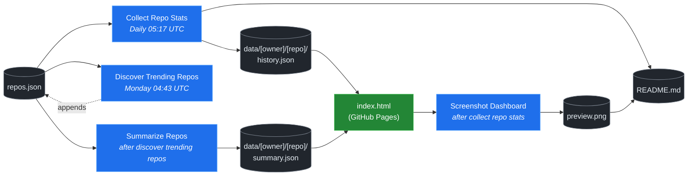

# 🚀 Rising Repos Tracker

> Automatically tracks daily GitHub stats (stars, forks, issues, velocity) for rising open source repos.

[](https://www.telosignal.com/)


**[→ View Live Dashboard](https://patrick-creates.github.io/rising-repos-tracker/)**

Built and maintained by [Telosignal](https://www.telosignal.com/).


<!-- AUTOGEN-STATS-START -->
## 📊 Current snapshot

> Auto-updated daily — last refreshed 2026-09-22

| Metric | Value |
|---|---|
| Repos tracked | **201** |
| Total stars | **9,877,263** |
| Total forks | **1,441,116** |
| Fastest growing | **ponytail** (+1043.5/day) |

### 🔥 Top 5 by velocity

| # | Repo | Stars | Stars/day |
|---|---|---:|---:|
| 1 | [DietrichGebert/ponytail](https://github.com/DietrichGebert/ponytail) | 144,023 | +1043.5 |
| 2 | [debpalash/VoiceStudio](https://github.com/debpalash/VoiceStudio) | 34,064 | +923.0 |
| 3 | [stablyai/orca](https://github.com/stablyai/orca) | 75,084 | +801.3 |
| 4 | [NousResearch/hermes-agent](https://github.com/NousResearch/hermes-agent) | 247,927 | +756.7 |
| 5 | [diegosouzapw/OmniRoute](https://github.com/diegosouzapw/OmniRoute) | 69,095 | +730.0 |

### 🆕 Recently added

- [genspark-ai/genoffice](https://github.com/genspark-ai/genoffice) — added 2026-09-21 — Free, open-source AI Office suite: Docs, Sheets, Slides, PDF, Markdown and HTML editors with a built-in AI agent, plus a `genoffice` CLI and agent skill so Claude Code, Codex and Cursor can create and edit real .docx/.xlsx/.pptx files locally. Bring your own key. macOS, Windows & Linux.
- [tech-leads-club/agent-skills](https://github.com/tech-leads-club/agent-skills) — added 2026-09-21 — The secure, validated skill registry for professional AI coding agents. Extend Antigravity, Claude Code, Cursor, Copilot and more with absolute confidence.
- [every-app/open-seo](https://github.com/every-app/open-seo) — added 2026-09-14 — Open source alternative to Semrush and Ahrefs
<!-- AUTOGEN-STATS-END -->

<!-- AUTOGEN-DIAGRAM-START -->
## 🔄 How it works


```mermaid
graph LR
    repos[("repos.json")]:::data
    history[("data/[owner]/[repo]/<br/>history.json")]:::data
    summary[("data/[owner]/[repo]/<br/>summary.json")]:::data
    readme[("README.md")]:::data
    preview[("preview.png")]:::data
    dashboard["index.html<br/>(GitHub Pages)"]:::output
    collect_yml["Collect Repo Stats<br/><i>Daily 05:17 UTC</i>"]:::workflow
    discover_yml["Discover Trending Repos<br/><i>Monday 04:43 UTC</i>"]:::workflow
    screenshot_yml["Screenshot Dashboard<br/><i>after collect repo stats</i>"]:::workflow
    summarize_yml["Summarize Repos<br/><i>after discover trending repos</i>"]:::workflow
    repos --> collect_yml
    collect_yml --> history
    collect_yml --> readme
    repos --> discover_yml
    discover_yml -.->|appends| repos
    dashboard --> screenshot_yml
    screenshot_yml --> preview
    repos --> summarize_yml
    summarize_yml --> summary
    history --> dashboard
    summary --> dashboard
    preview --> readme
    classDef workflow fill:#1f6feb,stroke:#58a6ff,color:#fff
    classDef data fill:#21262d,stroke:#7d8590,color:#e6edf3
    classDef output fill:#238636,stroke:#3fb950,color:#fff
```
<!-- AUTOGEN-DIAGRAM-END -->

<!-- AUTOGEN-WORKFLOWS-START -->
## ⚙️ Workflows

| File | Schedule | Name |
|---|---|---|
| `collect.yml` | Daily 05:17 UTC | Collect Repo Stats |
| `discover.yml` | Monday 04:43 UTC | Discover Trending Repos |
| `screenshot.yml` | After Collect Repo Stats | Screenshot Dashboard |
| `summarize.yml` | After Discover Trending Repos | Summarize Repos |

> All workflows commit results directly back to the repo. Schedules are best-effort — GitHub Actions cron can drift by a few minutes.
<!-- AUTOGEN-WORKFLOWS-END -->

<!-- AUTOGEN-REPOS-START -->
## 📋 All tracked repos

| Repo | Stars | Forks | Stars/day |
|---|---:|---:|---:|
| [openclaw/openclaw](https://github.com/openclaw/openclaw) | 390,236 | 82,085 | +142.2 |
| [obra/superpowers](https://github.com/obra/superpowers) | 289,946 | 25,942 | +591.0 |
| [affaan-m/everything-claude-code](https://github.com/affaan-m/everything-claude-code) | 264,972 | 39,589 | +635.8 |
| [affaan-m/ECC](https://github.com/affaan-m/ECC) | 264,972 | 39,589 | +606.2 |
| [NousResearch/hermes-agent](https://github.com/NousResearch/hermes-agent) | 247,927 | 52,247 | +756.7 |
| [Significant-Gravitas/AutoGPT](https://github.com/Significant-Gravitas/AutoGPT) | 187,486 | 46,004 | +24.3 |
| [microsoft/markitdown](https://github.com/microsoft/markitdown) | 186,320 | 13,730 | +479.6 |
| [f/prompts.chat](https://github.com/f/prompts.chat) | 170,948 | 21,969 | +66.5 |
| [langgenius/dify](https://github.com/langgenius/dify) | 156,841 | 24,721 | +118.3 |
| [open-webui/open-webui](https://github.com/open-webui/open-webui) | 152,791 | 22,355 | +120.4 |
| [langchain-ai/langchain](https://github.com/langchain-ai/langchain) | 146,851 | 24,566 | +77.4 |
| [DietrichGebert/ponytail](https://github.com/DietrichGebert/ponytail) | 144,023 | 7,712 | +1043.5 |
| [github/spec-kit](https://github.com/github/spec-kit) | 138,304 | 12,394 | +306.4 |
| [farion1231/cc-switch](https://github.com/farion1231/cc-switch) | 134,056 | 9,260 | +472.5 |
| [nextlevelbuilder/ui-ux-pro-max-skill](https://github.com/nextlevelbuilder/ui-ux-pro-max-skill) | 129,713 | 13,812 | +392.6 |
| [Graphify-Labs/graphify](https://github.com/Graphify-Labs/graphify) | 120,345 | 11,619 | +414.9 |
| [microsoft/generative-ai-for-beginners](https://github.com/microsoft/generative-ai-for-beginners) | 120,262 | 63,310 | +72.0 |
| [JuliusBrussee/caveman](https://github.com/JuliusBrussee/caveman) | 107,261 | 6,211 | +360.2 |
| [nexu-io/open-design](https://github.com/nexu-io/open-design) | 97,554 | 11,329 | +420.3 |
| [ruvnet/RuView](https://github.com/ruvnet/RuView) | 94,726 | 12,541 | +240.3 |
| [thedotmack/claude-mem](https://github.com/thedotmack/claude-mem) | 94,442 | 8,349 | +144.4 |
| [vllm-project/vllm](https://github.com/vllm-project/vllm) | 92,409 | 22,504 | +94.9 |
| [Leonxlnx/taste-skill](https://github.com/Leonxlnx/taste-skill) | 89,171 | 6,070 | +520.0 |
| [ChatGPTNextWeb/NextChat](https://github.com/ChatGPTNextWeb/NextChat) | 88,802 | 59,012 | +6.0 |
| [OpenHands/OpenHands](https://github.com/OpenHands/OpenHands) | 88,790 | 11,680 | +117.0 |
| [koala73/worldmonitor](https://github.com/koala73/worldmonitor) | 87,200 | 13,266 | +258.5 |
| [Panniantong/Agent-Reach](https://github.com/Panniantong/Agent-Reach) | 84,590 | 7,429 | +576.5 |
| [lobehub/lobehub](https://github.com/lobehub/lobehub) | 82,748 | 15,909 | +43.6 |
| [rtk-ai/rtk](https://github.com/rtk-ai/rtk) | 81,384 | 5,152 | +250.4 |
| [datawhalechina/hello-agents](https://github.com/datawhalechina/hello-agents) | 80,408 | 10,004 | +234.2 |
| [dair-ai/Prompt-Engineering-Guide](https://github.com/dair-ai/Prompt-Engineering-Guide) | 78,540 | 8,632 | +30.2 |
| [shareAI-lab/learn-claude-code](https://github.com/shareAI-lab/learn-claude-code) | 77,415 | 12,451 | +128.6 |
| [unslothai/unsloth](https://github.com/unslothai/unsloth) | 76,562 | 7,003 | +95.0 |
| [openai/openai-cookbook](https://github.com/openai/openai-cookbook) | 76,118 | 12,887 | +19.8 |
| [ComposioHQ/awesome-claude-skills](https://github.com/ComposioHQ/awesome-claude-skills) | 75,468 | 8,748 | +118.7 |
| [stablyai/orca](https://github.com/stablyai/orca) | 75,084 | 4,909 | +801.3 |
| [chopratejas/headroom](https://github.com/chopratejas/headroom) | 73,455 | 5,659 | +457.5 |
| [headroomlabs-ai/headroom](https://github.com/headroomlabs-ai/headroom) | 73,455 | 5,659 | +299.5 |
| [santifer/career-ops](https://github.com/santifer/career-ops) | 72,390 | 13,619 | +213.7 |
| [career-ops-hq/career-ops](https://github.com/career-ops-hq/career-ops) | 72,390 | 13,619 | +133.9 |
| [Fission-AI/OpenSpec](https://github.com/Fission-AI/OpenSpec) | 69,820 | 4,782 | +165.6 |
| [code-yeongyu/oh-my-openagent](https://github.com/code-yeongyu/oh-my-openagent) | 69,278 | 5,709 | +86.2 |
| [diegosouzapw/OmniRoute](https://github.com/diegosouzapw/OmniRoute) | 69,095 | 9,781 | +730.0 |
| [asgeirtj/system_prompts_leaks](https://github.com/asgeirtj/system_prompts_leaks) | 68,039 | 11,048 | +217.7 |
| [xtekky/gpt4free](https://github.com/xtekky/gpt4free) | 66,715 | 13,504 | +3.7 |
| [shanraisshan/claude-code-best-practice](https://github.com/shanraisshan/claude-code-best-practice) | 66,220 | 6,581 | +100.2 |
| [ZhuLinsen/daily_stock_analysis](https://github.com/ZhuLinsen/daily_stock_analysis) | 65,476 | 54,731 | +222.0 |
| [usestrix/strix](https://github.com/usestrix/strix) | 64,107 | 7,009 | +339.8 |
| [mvanhorn/last30days-skill](https://github.com/mvanhorn/last30days-skill) | 62,609 | 5,451 | +282.4 |
| [tw93/Pake](https://github.com/tw93/Pake) | 61,592 | 12,694 | +100.9 |
| [calesthio/OpenMontage](https://github.com/calesthio/OpenMontage) | 60,799 | 7,726 | +387.6 |
| [BerriAI/litellm](https://github.com/BerriAI/litellm) | 59,382 | 11,658 | +94.4 |
| [MemPalace/mempalace](https://github.com/MemPalace/mempalace) | 59,215 | 7,566 | +53.7 |
| [FlowiseAI/Flowise](https://github.com/FlowiseAI/Flowise) | 55,476 | 25,039 | +20.3 |
| [jamiepine/voicebox](https://github.com/jamiepine/voicebox) | 55,425 | 6,912 | +233.7 |
| [rohitg00/ai-engineering-from-scratch](https://github.com/rohitg00/ai-engineering-from-scratch) | 55,201 | 9,717 | +255.2 |
| [hesreallyhim/awesome-claude-code](https://github.com/hesreallyhim/awesome-claude-code) | 54,423 | 4,745 | +81.3 |
| [ggml-org/whisper.cpp](https://github.com/ggml-org/whisper.cpp) | 53,853 | 6,187 | +31.7 |
| [router-for-me/CLIProxyAPI](https://github.com/router-for-me/CLIProxyAPI) | 52,800 | 7,971 | +150.5 |
| [ChromeDevTools/chrome-devtools-mcp](https://github.com/ChromeDevTools/chrome-devtools-mcp) | 52,463 | 4,391 | +99.0 |
| [heygen-com/hyperframes](https://github.com/heygen-com/hyperframes) | 52,235 | 4,766 | +251.6 |
| [coreyhaines31/marketingskills](https://github.com/coreyhaines31/marketingskills) | 51,153 | 7,741 | +174.5 |
| [elder-plinius/CL4R1T4S](https://github.com/elder-plinius/CL4R1T4S) | 50,114 | 10,287 | +113.4 |
| [bojieli/ai-agent-book](https://github.com/bojieli/ai-agent-book) | 49,934 | 5,594 | +656.0 |
| [Aider-AI/aider](https://github.com/Aider-AI/aider) | 49,112 | 4,984 | +32.7 |
| [Imbad0202/academic-research-skills](https://github.com/Imbad0202/academic-research-skills) | 49,095 | 3,808 | +164.9 |
| [kepano/obsidian-skills](https://github.com/kepano/obsidian-skills) | 48,730 | 3,472 | +131.4 |
| [QuantumNous/new-api](https://github.com/QuantumNous/new-api) | 48,663 | 11,686 | +110.9 |
| [HKUDS/nanobot](https://github.com/HKUDS/nanobot) | 48,476 | 8,569 | +45.6 |
| [zhayujie/CowAgent](https://github.com/zhayujie/CowAgent) | 47,073 | 10,369 | +19.8 |
| [sickn33/antigravity-awesome-skills](https://github.com/sickn33/antigravity-awesome-skills) | 46,756 | 6,808 | +67.3 |
| [sickn33/agentic-awesome-skills](https://github.com/sickn33/agentic-awesome-skills) | 46,756 | 6,808 | +52.3 |
| [K-Dense-AI/scientific-agent-skills](https://github.com/K-Dense-AI/scientific-agent-skills) | 46,030 | 4,175 | +170.3 |
| [danny-avila/LibreChat](https://github.com/danny-avila/LibreChat) | 44,612 | 9,163 | +59.5 |
| [DeusData/codebase-memory-mcp](https://github.com/DeusData/codebase-memory-mcp) | 44,085 | 3,602 | +275.9 |
| [MadsLorentzen/ai-job-search](https://github.com/MadsLorentzen/ai-job-search) | 43,611 | 15,001 | +310.3 |
| [chatanywhere/GPT_API_free](https://github.com/chatanywhere/GPT_API_free) | 43,022 | 2,730 | +40.5 |
| [langchain-ai/langgraph](https://github.com/langchain-ai/langgraph) | 42,122 | 7,118 | +72.8 |
| [chatboxai/chatbox](https://github.com/chatboxai/chatbox) | 41,829 | 4,256 | +14.4 |
| [Hmbown/CodeWhale](https://github.com/Hmbown/CodeWhale) | 41,028 | 3,564 | +53.0 |
| [Hmbown/Codewhale](https://github.com/Hmbown/Codewhale) | 41,028 | 3,564 | +7.5 |
| [AstrBotDevs/AstrBot](https://github.com/AstrBotDevs/AstrBot) | 40,820 | 2,954 | +64.0 |
| [ogulcancelik/herdr](https://github.com/ogulcancelik/herdr) | 40,138 | 3,039 | +355.7 |
| [herdrdev/herdr](https://github.com/herdrdev/herdr) | 40,138 | 3,039 | +327.0 |
| [tinyhumansai/openhuman](https://github.com/tinyhumansai/openhuman) | 40,026 | 3,951 | +35.8 |
| [wshobson/agents](https://github.com/wshobson/agents) | 39,865 | 4,249 | +32.7 |
| [mindsdb/mindshub](https://github.com/mindsdb/mindshub) | 39,763 | 6,244 | +5.1 |
| [alibaba/open-code-review](https://github.com/alibaba/open-code-review) | 39,478 | 2,830 | +378.1 |
| [Yeachan-Heo/oh-my-claudecode](https://github.com/Yeachan-Heo/oh-my-claudecode) | 39,297 | 3,512 | +37.3 |
| [github/awesome-copilot](https://github.com/github/awesome-copilot) | 39,265 | 4,991 | +45.5 |
| [google/langextract](https://github.com/google/langextract) | 38,642 | 2,704 | +17.4 |
| [volcengine/OpenViking](https://github.com/volcengine/OpenViking) | 38,399 | 2,986 | +123.3 |
| [PDFMathTranslate/PDFMathTranslate](https://github.com/PDFMathTranslate/PDFMathTranslate) | 37,143 | 3,333 | +26.1 |
| [songquanpeng/one-api](https://github.com/songquanpeng/one-api) | 36,985 | 6,868 | +23.1 |
| [AlexsJones/llmfit](https://github.com/AlexsJones/llmfit) | 36,966 | 2,347 | +88.2 |
| [anthropics/claude-plugins-official](https://github.com/anthropics/claude-plugins-official) | 36,611 | 4,119 | +67.3 |
| [esengine/DeepSeek-Reasonix](https://github.com/esengine/DeepSeek-Reasonix) | 35,674 | 2,416 | +152.3 |
| [agentscope-ai/QwenPaw](https://github.com/agentscope-ai/QwenPaw) | 35,203 | 3,120 | +176.0 |
| [JCodesMore/ai-website-cloner-template](https://github.com/JCodesMore/ai-website-cloner-template) | 34,767 | 5,068 | +179.5 |
| [debpalash/VoiceStudio](https://github.com/debpalash/VoiceStudio) | 34,064 | 4,004 | +923.0 |
| [HKUDS/Vibe-Trading](https://github.com/HKUDS/Vibe-Trading) | 33,820 | 5,511 | +224.5 |
| [Gitlawb/openclaude](https://github.com/Gitlawb/openclaude) | 33,478 | 9,100 | +47.3 |
| [mukul975/Anthropic-Cybersecurity-Skills](https://github.com/mukul975/Anthropic-Cybersecurity-Skills) | 33,155 | 4,020 | +163.4 |
| [iOfficeAI/AionUi](https://github.com/iOfficeAI/AionUi) | 33,032 | 3,427 | +50.3 |
| [zeroclaw-labs/zeroclaw](https://github.com/zeroclaw-labs/zeroclaw) | 32,857 | 4,952 | +10.5 |
| [can1357/oh-my-pi](https://github.com/can1357/oh-my-pi) | 32,499 | 3,448 | +201.1 |
| [p-e-w/heretic](https://github.com/p-e-w/heretic) | 32,139 | 3,611 | +77.0 |
| [virgiliojr94/book-to-skill](https://github.com/virgiliojr94/book-to-skill) | 31,915 | 3,309 | +244.3 |
| [tirth8205/code-review-graph](https://github.com/tirth8205/code-review-graph) | 31,700 | 2,895 | +133.2 |
| [googleworkspace/cli](https://github.com/googleworkspace/cli) | 31,093 | 1,848 | +38.7 |
| [iOfficeAI/OfficeCLI](https://github.com/iOfficeAI/OfficeCLI) | 31,003 | 2,117 | +289.8 |
| [langchain-ai/deepagents](https://github.com/langchain-ai/deepagents) | 29,639 | 4,169 | +51.7 |
| [decolua/9router](https://github.com/decolua/9router) | 29,564 | 5,538 | +121.1 |
| [jackwener/OpenCLI](https://github.com/jackwener/OpenCLI) | 29,559 | 2,888 | +54.3 |
| [alibaba/page-agent](https://github.com/alibaba/page-agent) | 29,163 | 2,619 | +107.1 |
| [voideditor/void](https://github.com/voideditor/void) | 28,794 | 2,651 | — |
| [Tencent/WeKnora](https://github.com/Tencent/WeKnora) | 28,752 | 3,867 | +125.9 |
| [rohitg00/agentmemory](https://github.com/rohitg00/agentmemory) | 28,700 | 2,491 | +64.9 |
| [BloopAI/vibe-kanban](https://github.com/BloopAI/vibe-kanban) | 28,159 | 3,015 | +12.8 |
| [jarrodwatts/claude-hud](https://github.com/jarrodwatts/claude-hud) | 28,097 | 1,301 | +32.1 |
| [manaflow-ai/cmux](https://github.com/manaflow-ai/cmux) | 27,319 | 2,385 | +41.7 |
| [TencentCloud/TencentDB-Agent-Memory](https://github.com/TencentCloud/TencentDB-Agent-Memory) | 27,136 | 2,600 | +259.4 |
| [zai-org/Open-AutoGLM](https://github.com/zai-org/Open-AutoGLM) | 26,282 | 4,036 | +7.7 |
| [toon-format/toon](https://github.com/toon-format/toon) | 25,407 | 1,124 | +8.6 |
| [pascalorg/editor](https://github.com/pascalorg/editor) | 24,233 | 3,013 | +69.4 |
| [mksglu/context-mode](https://github.com/mksglu/context-mode) | 23,924 | 1,721 | +65.2 |
| [guillaumemeyer/watermarks-remover](https://github.com/guillaumemeyer/watermarks-remover) | 22,555 | 2,607 | +172.5 |
| [pranshuparmar/witr](https://github.com/pranshuparmar/witr) | 22,449 | 786 | +52.0 |
| [winfunc/opcode](https://github.com/winfunc/opcode) | 22,403 | 1,721 | +3.8 |
| [jundot/omlx](https://github.com/jundot/omlx) | 21,983 | 1,902 | +54.6 |
| [steipete/CodexBar](https://github.com/steipete/CodexBar) | 21,729 | 1,984 | +70.9 |
| [coze-dev/coze-studio](https://github.com/coze-dev/coze-studio) | 21,635 | 3,118 | +6.5 |
| [NirDiamant/agents-towards-production](https://github.com/NirDiamant/agents-towards-production) | 21,484 | 2,851 | +8.0 |
| [KKKKhazix/khazix-skills](https://github.com/KKKKhazix/khazix-skills) | 20,872 | 2,212 | +53.3 |
| [jnMetaCode/agency-agents-zh](https://github.com/jnMetaCode/agency-agents-zh) | 20,866 | 3,373 | +59.3 |
| [t8y2/dbx](https://github.com/t8y2/dbx) | 20,441 | 1,981 | +150.9 |
| [1jehuang/jcode](https://github.com/1jehuang/jcode) | 20,007 | 2,320 | +164.8 |
| [every-app/open-seo](https://github.com/every-app/open-seo) | 19,953 | 2,570 | +162.1 |
| [tanweai/pua](https://github.com/tanweai/pua) | 19,679 | 1,200 | +14.5 |
| [datawhalechina/easy-vibe](https://github.com/datawhalechina/easy-vibe) | 19,502 | 1,868 | +25.9 |
| [danielmiessler/LifeOS](https://github.com/danielmiessler/LifeOS) | 19,088 | 2,473 | +32.8 |
| [nesquena/hermes-webui](https://github.com/nesquena/hermes-webui) | 18,512 | 2,619 | +39.9 |
| [microsoft/agent-lightning](https://github.com/microsoft/agent-lightning) | 18,432 | 1,630 | +11.3 |
| [RightNow-AI/openfang](https://github.com/RightNow-AI/openfang) | 18,210 | 2,291 | +3.9 |
| [jlcodes99/cockpit-tools](https://github.com/jlcodes99/cockpit-tools) | 18,175 | 1,604 | +62.9 |
| [NVIDIA/SkillSpector](https://github.com/NVIDIA/SkillSpector) | 18,036 | 1,562 | +112.0 |
| [browser-use/browser-harness](https://github.com/browser-use/browser-harness) | 18,009 | 1,759 | +29.8 |
| [AgriciDaniel/claude-seo](https://github.com/AgriciDaniel/claude-seo) | 17,407 | 2,543 | +65.3 |
| [cft0808/edict](https://github.com/cft0808/edict) | 16,905 | 1,766 | +8.5 |
| [MemoriLabs/Memori](https://github.com/MemoriLabs/Memori) | 16,892 | 3,548 | +16.8 |
| [composio-community/awesome-codex-skills](https://github.com/composio-community/awesome-codex-skills) | 16,587 | 1,631 | +20.4 |
| [wanshuiyin/Auto-claude-code-research-in-sleep](https://github.com/wanshuiyin/Auto-claude-code-research-in-sleep) | 16,489 | 1,402 | +43.7 |
| [xbtlin/ai-berkshire](https://github.com/xbtlin/ai-berkshire) | 16,480 | 2,461 | +73.1 |
| [xpzouying/xiaohongshu-mcp](https://github.com/xpzouying/xiaohongshu-mcp) | 15,921 | 2,348 | +17.8 |
| [walkinglabs/learn-harness-engineering](https://github.com/walkinglabs/learn-harness-engineering) | 15,694 | 1,581 | +74.5 |
| [ifixai-ai/iFixAi](https://github.com/ifixai-ai/iFixAi) | 15,673 | 1,337 | +174.4 |
| [Anionex/banana-slides](https://github.com/Anionex/banana-slides) | 15,645 | 1,788 | +5.5 |
| [yusufkaraaslan/Skill_Seekers](https://github.com/yusufkaraaslan/Skill_Seekers) | 15,018 | 1,533 | +8.6 |
| [kyegomez/OpenMythos](https://github.com/kyegomez/OpenMythos) | 14,908 | 3,296 | +8.2 |
| [NanmiCoder/cc-haha](https://github.com/NanmiCoder/cc-haha) | 14,674 | 8,582 | +16.0 |
| [superset-sh/superset](https://github.com/superset-sh/superset) | 14,477 | 1,297 | +27.3 |
| [NevaMind-AI/memU](https://github.com/NevaMind-AI/memU) | 14,422 | 1,071 | +5.7 |
| [XiaomiMiMo/MiMo-Code](https://github.com/XiaomiMiMo/MiMo-Code) | 13,338 | 1,379 | +27.2 |
| [EverMind-AI/EverOS](https://github.com/EverMind-AI/EverOS) | 13,125 | 924 | +40.1 |
| [sirmalloc/ccstatusline](https://github.com/sirmalloc/ccstatusline) | 12,977 | 575 | +20.0 |
| [ConardLi/garden-skills](https://github.com/ConardLi/garden-skills) | 12,567 | 1,513 | +43.4 |
| [0x4m4/hexstrike-ai](https://github.com/0x4m4/hexstrike-ai) | 12,039 | 2,464 | +23.9 |
| [brokermr810/QuantDinger](https://github.com/brokermr810/QuantDinger) | 11,975 | 2,458 | +34.5 |
| [OpenByteInc/QuantDinger](https://github.com/OpenByteInc/QuantDinger) | 11,975 | 2,458 | +34.0 |
| [MemTensor/MemOS](https://github.com/MemTensor/MemOS) | 11,525 | 1,054 | +17.6 |
| [holaboss-ai/holaOS](https://github.com/holaboss-ai/holaOS) | 11,347 | 724 | +82.7 |
| [EKKOLearnAI/hermes-studio](https://github.com/EKKOLearnAI/hermes-studio) | 11,170 | 1,369 | +29.6 |
| [getagentseal/codeburn](https://github.com/getagentseal/codeburn) | 11,158 | 851 | +34.4 |
| [aden-hive/hive](https://github.com/aden-hive/hive) | 11,062 | 5,660 | +5.3 |
| [ValueCell-ai/valuecell](https://github.com/ValueCell-ai/valuecell) | 11,010 | 1,803 | +1.6 |
| [openai/codex-security](https://github.com/openai/codex-security) | 10,820 | 808 | +50.8 |
| [Kuberwastaken/claurst](https://github.com/Kuberwastaken/claurst) | 10,304 | 7,733 | +5.2 |
| [ykdojo/claude-code-tips](https://github.com/ykdojo/claude-code-tips) | 10,124 | 817 | +14.2 |
| [StarTrail-org/PixelRAG](https://github.com/StarTrail-org/PixelRAG) | 10,060 | 864 | +48.9 |
| [frankbria/ralph-claude-code](https://github.com/frankbria/ralph-claude-code) | 9,642 | 721 | +4.0 |
| [modem-dev/hunk](https://github.com/modem-dev/hunk) | 9,354 | 306 | +37.3 |
| [EvoMap/evolver](https://github.com/EvoMap/evolver) | 9,111 | 847 | +3.3 |
| [iflytek/astron-agent](https://github.com/iflytek/astron-agent) | 9,024 | 891 | +5.3 |
| [trailhq/Graft](https://github.com/trailhq/Graft) | 8,981 | 820 | +174.0 |
| [MiroMindAI/MiroThinker](https://github.com/MiroMindAI/MiroThinker) | 8,416 | 647 | +1.2 |
| [dataelement/dsh-desktop](https://github.com/dataelement/dsh-desktop) | 8,373 | 350 | +269.9 |
| [mmulet/term.everything](https://github.com/mmulet/term.everything) | 8,099 | 195 | +1.0 |
| [1weiho/open-slide](https://github.com/1weiho/open-slide) | 7,635 | 549 | +35.3 |
| [ValueCell-ai/ClawX](https://github.com/ValueCell-ai/ClawX) | 7,610 | 1,142 | +1.0 |
| [genspark-ai/genoffice](https://github.com/genspark-ai/genoffice) | 7,476 | 971 | +86.0 |
| [rorkai/App-Store-Connect-CLI](https://github.com/rorkai/App-Store-Connect-CLI) | 7,328 | 618 | +28.7 |
| [WenyuChiou/awesome-agentic-ai-zh](https://github.com/WenyuChiou/awesome-agentic-ai-zh) | 7,137 | 970 | +26.6 |
| [opensquilla/opensquilla](https://github.com/opensquilla/opensquilla) | 7,043 | 570 | +13.0 |
| [TokenRhythm/opensquilla](https://github.com/TokenRhythm/opensquilla) | 7,043 | 570 | +5.0 |
| [Andyyyy64/whichllm](https://github.com/Andyyyy64/whichllm) | 6,671 | 372 | +12.6 |
| [steipete/summarize](https://github.com/steipete/summarize) | 6,647 | 445 | +3.3 |
| [tech-leads-club/agent-skills](https://github.com/tech-leads-club/agent-skills) | 6,621 | 546 | +50.0 |
| [Arthur-Ficial/apfel](https://github.com/Arthur-Ficial/apfel) | 6,431 | 245 | +4.5 |
| [microsoft/fara](https://github.com/microsoft/fara) | 6,191 | 602 | +2.7 |
| [UfoMiao/zcf](https://github.com/UfoMiao/zcf) | 6,083 | 422 | +0.2 |
| [re4/LibreCode](https://github.com/re4/LibreCode) | 89 | 5 | — |
<!-- AUTOGEN-REPOS-END -->

---

## What it does

- Collects daily snapshots of stars, forks, watchers and open issues for every tracked repo
- Discovers new trending repos automatically every Monday using the GitHub Search API
- Generates AI summaries (use cases, similar tools, tags) for each tracked repo via GitHub Models
- Stores all history as plain JSON — no database, no backend
- Renders a live dashboard via GitHub Pages — updates daily, zero maintenance

## Tracked repos

Data lives in [`data/`](./data) — one folder per repo, one `history.json` per entry.  
The full watch list is in [`repos.json`](./repos.json).

## Fork & use it for yourself

This is my personal tracker — the watch list reflects what I find interesting. If you want to track different repos, the best path is to **fork this repo and run your own**.

### Setup

1. Fork this repo to your account
2. Replace the contents of [`repos.json`](./repos.json) with the repos you want to track (or just leave one entry — `discover.yml` will auto-add more every Monday)
3. Go to **Settings → Pages** and enable GitHub Pages from the `main` branch
4. Go to **Actions** and run **Collect Repo Stats** once manually to seed your first data point
5. Your dashboard will be live at `https://YOUR-USERNAME.github.io/rising-repos-tracker/`

That's it — daily collection and weekly discovery run automatically on schedule. Zero ongoing maintenance.

### Customizing what gets discovered

Edit [`scripts/discover.js`](./scripts/discover.js) to change:

- `MIN_STARS` — minimum star threshold for candidates
- `MAX_AGE_DAYS` — how recent a repo must be
- `MAX_NEW_REPOS` — how many to add per discovery run
- The `queries` array — GitHub Search API queries that define what "trending" means to you

### Adding a repo manually

Just edit `repos.json` directly:

```json
{
  "owner": "OWNER",
  "repo": "REPO",
  "added": "YYYY-MM-DD",
  "notes": "why you're tracking this"
}
```

The next daily collect run picks it up automatically.

## Stack

- **GitHub Actions** — scheduling and automation
- **GitHub Pages** — dashboard hosting
- **GitHub API** — data source
- **GitHub Models** — free AI summaries (gpt-4o-mini)
- **Chart.js** — star growth visualization
- **Mermaid** — architecture diagram (rendered by GitHub)
- No dependencies, no build step, no database

## License

MIT
