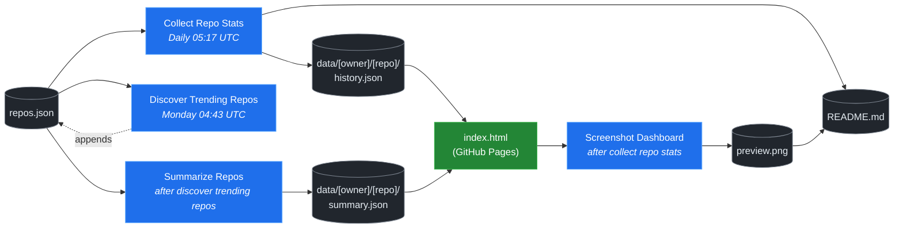

# 🚀 Rising Repos Tracker

> Automatically tracks daily GitHub stats (stars, forks, issues, velocity) for rising open source repos.

[](https://www.telosignal.com/)


**[→ View Live Dashboard](https://patrick-creates.github.io/rising-repos-tracker/)**

Built and maintained by [Telosignal](https://www.telosignal.com/).


<!-- AUTOGEN-STATS-START -->
## 📊 Current snapshot

> Auto-updated daily — last refreshed 2026-09-18

| Metric | Value |
|---|---|
| Repos tracked | **199** |
| Total stars | **9,792,804** |
| Total forks | **1,430,390** |
| Fastest growing | **VoiceStudio** (+1130.5/day) |

### 🔥 Top 5 by velocity

| # | Repo | Stars | Stars/day |
|---|---|---:|---:|
| 1 | [debpalash/VoiceStudio](https://github.com/debpalash/VoiceStudio) | 32,655 | +1130.5 |
| 2 | [DietrichGebert/ponytail](https://github.com/DietrichGebert/ponytail) | 141,677 | +1064.3 |
| 3 | [stablyai/orca](https://github.com/stablyai/orca) | 71,454 | +795.6 |
| 4 | [NousResearch/hermes-agent](https://github.com/NousResearch/hermes-agent) | 246,705 | +770.8 |
| 5 | [diegosouzapw/OmniRoute](https://github.com/diegosouzapw/OmniRoute) | 67,619 | +749.6 |

### 🆕 Recently added

- [every-app/open-seo](https://github.com/every-app/open-seo) — added 2026-09-14 — Open source alternative to Semrush and Ahrefs
- [NVIDIA/SkillSpector](https://github.com/NVIDIA/SkillSpector) — added 2026-09-14 — Security scanner for AI agent skills. Detect vulnerabilities, malicious patterns, security risks, prompt injection, data exfiltration, and supply-chain risks in Claude Code, Codex, and MCP skills before you install them.
- [AgriciDaniel/claude-seo](https://github.com/AgriciDaniel/claude-seo) — added 2026-09-14 — Universal SEO skill for Claude Code. 25 sub-skills + 18 sub-agents covering technical SEO, E-E-A-T, schema, GEO/AEO, backlinks, local SEO, maps intelligence, semantic clustering, e-commerce SEO, international SEO, Google APIs, and PDF/Excel reporting. Optional DataForSEO, Firecrawl, and Banana extensions.
<!-- AUTOGEN-STATS-END -->

<!-- AUTOGEN-DIAGRAM-START -->
## 🔄 How it works


```mermaid
graph LR
    repos[("repos.json")]:::data
    history[("data/[owner]/[repo]/<br/>history.json")]:::data
    summary[("data/[owner]/[repo]/<br/>summary.json")]:::data
    readme[("README.md")]:::data
    preview[("preview.png")]:::data
    dashboard["index.html<br/>(GitHub Pages)"]:::output
    collect_yml["Collect Repo Stats<br/><i>Daily 05:17 UTC</i>"]:::workflow
    discover_yml["Discover Trending Repos<br/><i>Monday 04:43 UTC</i>"]:::workflow
    screenshot_yml["Screenshot Dashboard<br/><i>after collect repo stats</i>"]:::workflow
    summarize_yml["Summarize Repos<br/><i>after discover trending repos</i>"]:::workflow
    repos --> collect_yml
    collect_yml --> history
    collect_yml --> readme
    repos --> discover_yml
    discover_yml -.->|appends| repos
    dashboard --> screenshot_yml
    screenshot_yml --> preview
    repos --> summarize_yml
    summarize_yml --> summary
    history --> dashboard
    summary --> dashboard
    preview --> readme
    classDef workflow fill:#1f6feb,stroke:#58a6ff,color:#fff
    classDef data fill:#21262d,stroke:#7d8590,color:#e6edf3
    classDef output fill:#238636,stroke:#3fb950,color:#fff
```
<!-- AUTOGEN-DIAGRAM-END -->

<!-- AUTOGEN-WORKFLOWS-START -->
## ⚙️ Workflows

| File | Schedule | Name |
|---|---|---|
| `collect.yml` | Daily 05:17 UTC | Collect Repo Stats |
| `discover.yml` | Monday 04:43 UTC | Discover Trending Repos |
| `screenshot.yml` | After Collect Repo Stats | Screenshot Dashboard |
| `summarize.yml` | After Discover Trending Repos | Summarize Repos |

> All workflows commit results directly back to the repo. Schedules are best-effort — GitHub Actions cron can drift by a few minutes.
<!-- AUTOGEN-WORKFLOWS-END -->

<!-- AUTOGEN-REPOS-START -->
## 📋 All tracked repos

| Repo | Stars | Forks | Stars/day |
|---|---:|---:|---:|
| [openclaw/openclaw](https://github.com/openclaw/openclaw) | 390,027 | 81,998 | +145.0 |
| [obra/superpowers](https://github.com/obra/superpowers) | 288,302 | 25,782 | +599.1 |
| [affaan-m/everything-claude-code](https://github.com/affaan-m/everything-claude-code) | 261,465 | 39,136 | +628.3 |
| [affaan-m/ECC](https://github.com/affaan-m/ECC) | 261,465 | 39,136 | +596.9 |
| [NousResearch/hermes-agent](https://github.com/NousResearch/hermes-agent) | 246,705 | 51,692 | +770.8 |
| [Significant-Gravitas/AutoGPT](https://github.com/Significant-Gravitas/AutoGPT) | 187,426 | 46,004 | +24.6 |
| [microsoft/markitdown](https://github.com/microsoft/markitdown) | 185,269 | 13,636 | +486.4 |
| [f/prompts.chat](https://github.com/f/prompts.chat) | 170,628 | 21,932 | +66.1 |
| [langgenius/dify](https://github.com/langgenius/dify) | 156,254 | 24,675 | +117.4 |
| [open-webui/open-webui](https://github.com/open-webui/open-webui) | 152,453 | 22,306 | +121.6 |
| [langchain-ai/langchain](https://github.com/langchain-ai/langchain) | 146,581 | 24,509 | +77.7 |
| [DietrichGebert/ponytail](https://github.com/DietrichGebert/ponytail) | 141,677 | 7,593 | +1064.3 |
| [github/spec-kit](https://github.com/github/spec-kit) | 137,712 | 12,334 | +311.3 |
| [farion1231/cc-switch](https://github.com/farion1231/cc-switch) | 133,501 | 9,209 | +483.4 |
| [nextlevelbuilder/ui-ux-pro-max-skill](https://github.com/nextlevelbuilder/ui-ux-pro-max-skill) | 128,654 | 13,717 | +396.6 |
| [microsoft/generative-ai-for-beginners](https://github.com/microsoft/generative-ai-for-beginners) | 119,995 | 63,171 | +72.2 |
| [Graphify-Labs/graphify](https://github.com/Graphify-Labs/graphify) | 119,181 | 11,524 | +424.2 |
| [JuliusBrussee/caveman](https://github.com/JuliusBrussee/caveman) | 106,429 | 6,167 | +365.2 |
| [nexu-io/open-design](https://github.com/nexu-io/open-design) | 96,863 | 11,259 | +428.4 |
| [ruvnet/RuView](https://github.com/ruvnet/RuView) | 94,356 | 12,489 | +245.4 |
| [thedotmack/claude-mem](https://github.com/thedotmack/claude-mem) | 94,160 | 8,310 | +146.7 |
| [vllm-project/vllm](https://github.com/vllm-project/vllm) | 92,084 | 22,365 | +95.3 |
| [ChatGPTNextWeb/NextChat](https://github.com/ChatGPTNextWeb/NextChat) | 88,782 | 59,054 | +6.1 |
| [OpenHands/OpenHands](https://github.com/OpenHands/OpenHands) | 88,384 | 11,609 | +117.5 |
| [Leonxlnx/taste-skill](https://github.com/Leonxlnx/taste-skill) | 88,111 | 5,997 | +529.3 |
| [koala73/worldmonitor](https://github.com/koala73/worldmonitor) | 86,863 | 13,173 | +264.2 |
| [Panniantong/Agent-Reach](https://github.com/Panniantong/Agent-Reach) | 82,965 | 7,258 | +583.2 |
| [lobehub/lobehub](https://github.com/lobehub/lobehub) | 82,581 | 15,896 | +43.6 |
| [rtk-ai/rtk](https://github.com/rtk-ai/rtk) | 80,881 | 5,130 | +254.5 |
| [datawhalechina/hello-agents](https://github.com/datawhalechina/hello-agents) | 79,739 | 9,909 | +236.4 |
| [dair-ai/Prompt-Engineering-Guide](https://github.com/dair-ai/Prompt-Engineering-Guide) | 78,431 | 8,626 | +30.3 |
| [shareAI-lab/learn-claude-code](https://github.com/shareAI-lab/learn-claude-code) | 77,108 | 12,399 | +130.3 |
| [unslothai/unsloth](https://github.com/unslothai/unsloth) | 76,351 | 6,963 | +96.3 |
| [openai/openai-cookbook](https://github.com/openai/openai-cookbook) | 76,046 | 12,876 | +19.8 |
| [ComposioHQ/awesome-claude-skills](https://github.com/ComposioHQ/awesome-claude-skills) | 75,260 | 8,713 | +120.9 |
| [chopratejas/headroom](https://github.com/chopratejas/headroom) | 72,862 | 5,601 | +470.5 |
| [headroomlabs-ai/headroom](https://github.com/headroomlabs-ai/headroom) | 72,862 | 5,601 | +306.4 |
| [santifer/career-ops](https://github.com/santifer/career-ops) | 71,994 | 13,569 | +217.5 |
| [career-ops-hq/career-ops](https://github.com/career-ops-hq/career-ops) | 71,994 | 13,570 | +146.5 |
| [stablyai/orca](https://github.com/stablyai/orca) | 71,454 | 4,677 | +795.6 |
| [code-yeongyu/oh-my-openagent](https://github.com/code-yeongyu/oh-my-openagent) | 69,180 | 5,690 | +88.2 |
| [Fission-AI/OpenSpec](https://github.com/Fission-AI/OpenSpec) | 69,034 | 4,736 | +164.6 |
| [diegosouzapw/OmniRoute](https://github.com/diegosouzapw/OmniRoute) | 67,619 | 9,521 | +749.6 |
| [asgeirtj/system_prompts_leaks](https://github.com/asgeirtj/system_prompts_leaks) | 67,404 | 10,957 | +219.7 |
| [xtekky/gpt4free](https://github.com/xtekky/gpt4free) | 66,697 | 13,506 | +3.7 |
| [shanraisshan/claude-code-best-practice](https://github.com/shanraisshan/claude-code-best-practice) | 66,074 | 6,551 | +102.2 |
| [ZhuLinsen/daily_stock_analysis](https://github.com/ZhuLinsen/daily_stock_analysis) | 65,235 | 54,591 | +227.6 |
| [usestrix/strix](https://github.com/usestrix/strix) | 63,434 | 6,929 | +346.1 |
| [mvanhorn/last30days-skill](https://github.com/mvanhorn/last30days-skill) | 62,265 | 5,423 | +290.1 |
| [tw93/Pake](https://github.com/tw93/Pake) | 61,503 | 12,671 | +103.4 |
| [calesthio/OpenMontage](https://github.com/calesthio/OpenMontage) | 59,839 | 7,554 | +394.9 |
| [MemPalace/mempalace](https://github.com/MemPalace/mempalace) | 59,144 | 7,565 | +54.8 |
| [BerriAI/litellm](https://github.com/BerriAI/litellm) | 59,059 | 11,548 | +94.9 |
| [FlowiseAI/Flowise](https://github.com/FlowiseAI/Flowise) | 55,465 | 25,031 | +20.9 |
| [jamiepine/voicebox](https://github.com/jamiepine/voicebox) | 55,022 | 6,844 | +238.5 |
| [rohitg00/ai-engineering-from-scratch](https://github.com/rohitg00/ai-engineering-from-scratch) | 54,942 | 9,649 | +262.2 |
| [hesreallyhim/awesome-claude-code](https://github.com/hesreallyhim/awesome-claude-code) | 54,244 | 4,723 | +82.5 |
| [ggml-org/whisper.cpp](https://github.com/ggml-org/whisper.cpp) | 53,743 | 6,172 | +31.8 |
| [router-for-me/CLIProxyAPI](https://github.com/router-for-me/CLIProxyAPI) | 52,377 | 7,905 | +152.0 |
| [ChromeDevTools/chrome-devtools-mcp](https://github.com/ChromeDevTools/chrome-devtools-mcp) | 52,250 | 4,055 | +100.5 |
| [heygen-com/hyperframes](https://github.com/heygen-com/hyperframes) | 51,213 | 4,665 | +251.5 |
| [coreyhaines31/marketingskills](https://github.com/coreyhaines31/marketingskills) | 50,764 | 7,693 | +177.3 |
| [elder-plinius/CL4R1T4S](https://github.com/elder-plinius/CL4R1T4S) | 50,009 | 10,268 | +117.0 |
| [Aider-AI/aider](https://github.com/Aider-AI/aider) | 49,036 | 4,972 | +33.1 |
| [Imbad0202/academic-research-skills](https://github.com/Imbad0202/academic-research-skills) | 48,596 | 3,775 | +168.0 |
| [kepano/obsidian-skills](https://github.com/kepano/obsidian-skills) | 48,538 | 3,456 | +134.4 |
| [bojieli/ai-agent-book](https://github.com/bojieli/ai-agent-book) | 48,469 | 5,421 | +675.3 |
| [QuantumNous/new-api](https://github.com/QuantumNous/new-api) | 48,381 | 11,583 | +112.3 |
| [HKUDS/nanobot](https://github.com/HKUDS/nanobot) | 48,308 | 8,539 | +45.8 |
| [zhayujie/CowAgent](https://github.com/zhayujie/CowAgent) | 47,025 | 10,364 | +20.1 |
| [sickn33/antigravity-awesome-skills](https://github.com/sickn33/antigravity-awesome-skills) | 46,552 | 6,786 | +67.9 |
| [sickn33/agentic-awesome-skills](https://github.com/sickn33/agentic-awesome-skills) | 46,552 | 6,786 | +52.4 |
| [K-Dense-AI/scientific-agent-skills](https://github.com/K-Dense-AI/scientific-agent-skills) | 45,442 | 4,123 | +178.7 |
| [danny-avila/LibreChat](https://github.com/danny-avila/LibreChat) | 44,277 | 9,101 | +58.7 |
| [DeusData/codebase-memory-mcp](https://github.com/DeusData/codebase-memory-mcp) | 43,720 | 3,559 | +285.1 |
| [MadsLorentzen/ai-job-search](https://github.com/MadsLorentzen/ai-job-search) | 43,209 | 14,837 | +322.8 |
| [chatanywhere/GPT_API_free](https://github.com/chatanywhere/GPT_API_free) | 42,784 | 2,724 | +39.9 |
| [langchain-ai/langgraph](https://github.com/langchain-ai/langgraph) | 41,873 | 7,073 | +73.3 |
| [chatboxai/chatbox](https://github.com/chatboxai/chatbox) | 41,801 | 4,253 | +14.7 |
| [Hmbown/CodeWhale](https://github.com/Hmbown/CodeWhale) | 41,000 | 3,562 | +54.6 |
| [Hmbown/Codewhale](https://github.com/Hmbown/Codewhale) | 41,000 | 3,562 | +7.6 |
| [AstrBotDevs/AstrBot](https://github.com/AstrBotDevs/AstrBot) | 40,652 | 2,928 | +64.8 |
| [tinyhumansai/openhuman](https://github.com/tinyhumansai/openhuman) | 39,867 | 3,931 | +34.4 |
| [wshobson/agents](https://github.com/wshobson/agents) | 39,771 | 4,241 | +33.1 |
| [mindsdb/mindshub](https://github.com/mindsdb/mindshub) | 39,747 | 6,240 | +5.2 |
| [ogulcancelik/herdr](https://github.com/ogulcancelik/herdr) | 39,347 | 2,962 | +364.2 |
| [herdrdev/herdr](https://github.com/herdrdev/herdr) | 39,347 | 2,962 | +338.2 |
| [Yeachan-Heo/oh-my-claudecode](https://github.com/Yeachan-Heo/oh-my-claudecode) | 39,238 | 3,509 | +38.1 |
| [github/awesome-copilot](https://github.com/github/awesome-copilot) | 39,131 | 4,972 | +45.9 |
| [google/langextract](https://github.com/google/langextract) | 38,614 | 2,704 | +17.8 |
| [volcengine/OpenViking](https://github.com/volcengine/OpenViking) | 37,956 | 2,940 | +123.8 |
| [PDFMathTranslate/PDFMathTranslate](https://github.com/PDFMathTranslate/PDFMathTranslate) | 37,049 | 3,326 | +26.2 |
| [songquanpeng/one-api](https://github.com/songquanpeng/one-api) | 36,948 | 6,869 | +23.6 |
| [AlexsJones/llmfit](https://github.com/AlexsJones/llmfit) | 36,754 | 2,330 | +89.5 |
| [anthropics/claude-plugins-official](https://github.com/anthropics/claude-plugins-official) | 36,459 | 4,088 | +68.3 |
| [alibaba/open-code-review](https://github.com/alibaba/open-code-review) | 35,994 | 2,562 | +351.4 |
| [esengine/DeepSeek-Reasonix](https://github.com/esengine/DeepSeek-Reasonix) | 35,597 | 2,401 | +157.6 |
| [agentscope-ai/QwenPaw](https://github.com/agentscope-ai/QwenPaw) | 35,081 | 3,116 | +182.1 |
| [JCodesMore/ai-website-cloner-template](https://github.com/JCodesMore/ai-website-cloner-template) | 34,584 | 5,043 | +185.2 |
| [HKUDS/Vibe-Trading](https://github.com/HKUDS/Vibe-Trading) | 33,635 | 5,490 | +233.3 |
| [Gitlawb/openclaude](https://github.com/Gitlawb/openclaude) | 33,401 | 9,089 | +48.3 |
| [mukul975/Anthropic-Cybersecurity-Skills](https://github.com/mukul975/Anthropic-Cybersecurity-Skills) | 32,939 | 3,984 | +168.4 |
| [iOfficeAI/AionUi](https://github.com/iOfficeAI/AionUi) | 32,931 | 3,403 | +51.2 |
| [zeroclaw-labs/zeroclaw](https://github.com/zeroclaw-labs/zeroclaw) | 32,830 | 4,946 | +10.6 |
| [debpalash/VoiceStudio](https://github.com/debpalash/VoiceStudio) | 32,655 | 3,875 | +1130.5 |
| [p-e-w/heretic](https://github.com/p-e-w/heretic) | 31,740 | 3,547 | +76.2 |
| [can1357/oh-my-pi](https://github.com/can1357/oh-my-pi) | 31,739 | 3,349 | +201.6 |
| [tirth8205/code-review-graph](https://github.com/tirth8205/code-review-graph) | 31,571 | 2,871 | +137.4 |
| [virgiliojr94/book-to-skill](https://github.com/virgiliojr94/book-to-skill) | 31,085 | 3,224 | +250.2 |
| [googleworkspace/cli](https://github.com/googleworkspace/cli) | 31,045 | 1,841 | +39.7 |
| [iOfficeAI/OfficeCLI](https://github.com/iOfficeAI/OfficeCLI) | 30,794 | 2,098 | +302.7 |
| [langchain-ai/deepagents](https://github.com/langchain-ai/deepagents) | 29,543 | 4,145 | +52.8 |
| [jackwener/OpenCLI](https://github.com/jackwener/OpenCLI) | 29,424 | 2,874 | +55.1 |
| [decolua/9router](https://github.com/decolua/9router) | 29,235 | 5,393 | +122.8 |
| [alibaba/page-agent](https://github.com/alibaba/page-agent) | 29,115 | 2,607 | +111.1 |
| [voideditor/void](https://github.com/voideditor/void) | 28,801 | 2,652 | — |
| [rohitg00/agentmemory](https://github.com/rohitg00/agentmemory) | 28,574 | 2,473 | +66.2 |
| [BloopAI/vibe-kanban](https://github.com/BloopAI/vibe-kanban) | 28,120 | 3,014 | +12.9 |
| [jarrodwatts/claude-hud](https://github.com/jarrodwatts/claude-hud) | 28,035 | 1,301 | +32.8 |
| [manaflow-ai/cmux](https://github.com/manaflow-ai/cmux) | 27,224 | 2,373 | +42.8 |
| [TencentCloud/TencentDB-Agent-Memory](https://github.com/TencentCloud/TencentDB-Agent-Memory) | 26,923 | 2,554 | +271.7 |
| [Tencent/WeKnora](https://github.com/Tencent/WeKnora) | 26,722 | 3,599 | +109.8 |
| [zai-org/Open-AutoGLM](https://github.com/zai-org/Open-AutoGLM) | 26,258 | 4,035 | +7.8 |
| [toon-format/toon](https://github.com/toon-format/toon) | 25,394 | 1,122 | +8.8 |
| [pascalorg/editor](https://github.com/pascalorg/editor) | 24,054 | 2,988 | +71.9 |
| [mksglu/context-mode](https://github.com/mksglu/context-mode) | 23,455 | 1,688 | +63.0 |
| [winfunc/opcode](https://github.com/winfunc/opcode) | 22,407 | 1,720 | +3.9 |
| [pranshuparmar/witr](https://github.com/pranshuparmar/witr) | 22,382 | 781 | +53.7 |
| [guillaumemeyer/watermarks-remover](https://github.com/guillaumemeyer/watermarks-remover) | 22,268 | 2,572 | +188.6 |
| [jundot/omlx](https://github.com/jundot/omlx) | 21,861 | 1,891 | +55.0 |
| [coze-dev/coze-studio](https://github.com/coze-dev/coze-studio) | 21,609 | 3,117 | +6.5 |
| [steipete/CodexBar](https://github.com/steipete/CodexBar) | 21,596 | 1,960 | +72.6 |
| [NirDiamant/agents-towards-production](https://github.com/NirDiamant/agents-towards-production) | 21,474 | 2,849 | +8.2 |
| [KKKKhazix/khazix-skills](https://github.com/KKKKhazix/khazix-skills) | 20,786 | 2,206 | +55.5 |
| [jnMetaCode/agency-agents-zh](https://github.com/jnMetaCode/agency-agents-zh) | 20,781 | 3,354 | +61.1 |
| [t8y2/dbx](https://github.com/t8y2/dbx) | 20,031 | 1,948 | +154.6 |
| [1jehuang/jcode](https://github.com/1jehuang/jcode) | 19,863 | 2,297 | +172.5 |
| [tanweai/pua](https://github.com/tanweai/pua) | 19,660 | 1,198 | +14.9 |
| [datawhalechina/easy-vibe](https://github.com/datawhalechina/easy-vibe) | 19,456 | 1,865 | +26.5 |
| [every-app/open-seo](https://github.com/every-app/open-seo) | 19,130 | 2,462 | +118.5 |
| [danielmiessler/LifeOS](https://github.com/danielmiessler/LifeOS) | 19,056 | 2,467 | +34.0 |
| [nesquena/hermes-webui](https://github.com/nesquena/hermes-webui) | 18,429 | 2,596 | +40.8 |
| [microsoft/agent-lightning](https://github.com/microsoft/agent-lightning) | 18,324 | 1,613 | +10.7 |
| [RightNow-AI/openfang](https://github.com/RightNow-AI/openfang) | 18,199 | 2,289 | +3.9 |
| [jlcodes99/cockpit-tools](https://github.com/jlcodes99/cockpit-tools) | 17,916 | 1,581 | +62.7 |
| [NVIDIA/SkillSpector](https://github.com/NVIDIA/SkillSpector) | 17,687 | 1,516 | +136.8 |
| [browser-use/browser-harness](https://github.com/browser-use/browser-harness) | 17,668 | 1,730 | +27.0 |
| [AgriciDaniel/claude-seo](https://github.com/AgriciDaniel/claude-seo) | 17,130 | 2,510 | +61.3 |
| [cft0808/edict](https://github.com/cft0808/edict) | 16,904 | 1,769 | +8.9 |
| [MemoriLabs/Memori](https://github.com/MemoriLabs/Memori) | 16,793 | 3,489 | +16.5 |
| [composio-community/awesome-codex-skills](https://github.com/composio-community/awesome-codex-skills) | 16,524 | 1,629 | +20.8 |
| [xbtlin/ai-berkshire](https://github.com/xbtlin/ai-berkshire) | 16,427 | 2,452 | +76.4 |
| [wanshuiyin/Auto-claude-code-research-in-sleep](https://github.com/wanshuiyin/Auto-claude-code-research-in-sleep) | 16,308 | 1,388 | +43.6 |
| [xpzouying/xiaohongshu-mcp](https://github.com/xpzouying/xiaohongshu-mcp) | 15,851 | 2,332 | +17.8 |
| [Anionex/banana-slides](https://github.com/Anionex/banana-slides) | 15,625 | 1,785 | +5.5 |
| [ifixai-ai/iFixAi](https://github.com/ifixai-ai/iFixAi) | 15,401 | 1,337 | +185.3 |
| [walkinglabs/learn-harness-engineering](https://github.com/walkinglabs/learn-harness-engineering) | 15,351 | 1,534 | +73.9 |
| [yusufkaraaslan/Skill_Seekers](https://github.com/yusufkaraaslan/Skill_Seekers) | 14,996 | 1,527 | +8.8 |
| [kyegomez/OpenMythos](https://github.com/kyegomez/OpenMythos) | 14,903 | 3,295 | +8.5 |
| [NanmiCoder/cc-haha](https://github.com/NanmiCoder/cc-haha) | 14,608 | 8,570 | +15.9 |
| [NevaMind-AI/memU](https://github.com/NevaMind-AI/memU) | 14,413 | 1,069 | +5.8 |
| [superset-sh/superset](https://github.com/superset-sh/superset) | 14,363 | 1,277 | +27.2 |
| [XiaomiMiMo/MiMo-Code](https://github.com/XiaomiMiMo/MiMo-Code) | 13,177 | 1,360 | +26.6 |
| [EverMind-AI/EverOS](https://github.com/EverMind-AI/EverOS) | 13,045 | 924 | +41.1 |
| [sirmalloc/ccstatusline](https://github.com/sirmalloc/ccstatusline) | 12,933 | 569 | +20.4 |
| [ConardLi/garden-skills](https://github.com/ConardLi/garden-skills) | 12,496 | 1,508 | +44.8 |
| [0x4m4/hexstrike-ai](https://github.com/0x4m4/hexstrike-ai) | 11,948 | 2,450 | +23.9 |
| [brokermr810/QuantDinger](https://github.com/brokermr810/QuantDinger) | 11,714 | 2,429 | +32.9 |
| [OpenByteInc/QuantDinger](https://github.com/OpenByteInc/QuantDinger) | 11,714 | 2,429 | +31.9 |
| [MemTensor/MemOS](https://github.com/MemTensor/MemOS) | 11,444 | 1,044 | +17.5 |
| [holaboss-ai/holaOS](https://github.com/holaboss-ai/holaOS) | 11,317 | 722 | +92.1 |
| [EKKOLearnAI/hermes-studio](https://github.com/EKKOLearnAI/hermes-studio) | 11,121 | 1,359 | +30.6 |
| [getagentseal/codeburn](https://github.com/getagentseal/codeburn) | 11,068 | 841 | +35.1 |
| [aden-hive/hive](https://github.com/aden-hive/hive) | 11,054 | 5,664 | +5.5 |
| [ValueCell-ai/valuecell](https://github.com/ValueCell-ai/valuecell) | 11,006 | 1,801 | +1.7 |
| [openai/codex-security](https://github.com/openai/codex-security) | 10,765 | 797 | +54.0 |
| [Kuberwastaken/claurst](https://github.com/Kuberwastaken/claurst) | 10,305 | 7,738 | +5.4 |
| [ykdojo/claude-code-tips](https://github.com/ykdojo/claude-code-tips) | 10,108 | 815 | +14.7 |
| [StarTrail-org/PixelRAG](https://github.com/StarTrail-org/PixelRAG) | 9,985 | 857 | +50.7 |
| [frankbria/ralph-claude-code](https://github.com/frankbria/ralph-claude-code) | 9,637 | 719 | +4.1 |
| [modem-dev/hunk](https://github.com/modem-dev/hunk) | 9,327 | 302 | +39.1 |
| [EvoMap/evolver](https://github.com/EvoMap/evolver) | 9,101 | 846 | +3.3 |
| [iflytek/astron-agent](https://github.com/iflytek/astron-agent) | 9,029 | 886 | +5.7 |
| [trailhq/Graft](https://github.com/trailhq/Graft) | 8,478 | 768 | +222.3 |
| [MiroMindAI/MiroThinker](https://github.com/MiroMindAI/MiroThinker) | 8,408 | 646 | +1.1 |
| [mmulet/term.everything](https://github.com/mmulet/term.everything) | 8,099 | 194 | +1.0 |
| [ValueCell-ai/ClawX](https://github.com/ValueCell-ai/ClawX) | 7,619 | 1,142 | +1.2 |
| [1weiho/open-slide](https://github.com/1weiho/open-slide) | 7,607 | 547 | +38.2 |
| [dataelement/dsh-desktop](https://github.com/dataelement/dsh-desktop) | 7,364 | 320 | +287.5 |
| [rorkai/App-Store-Connect-CLI](https://github.com/rorkai/App-Store-Connect-CLI) | 7,272 | 612 | +34.0 |
| [WenyuChiou/awesome-agentic-ai-zh](https://github.com/WenyuChiou/awesome-agentic-ai-zh) | 7,074 | 960 | +29.1 |
| [opensquilla/opensquilla](https://github.com/opensquilla/opensquilla) | 7,025 | 566 | +13.6 |
| [TokenRhythm/opensquilla](https://github.com/TokenRhythm/opensquilla) | 7,025 | 566 | +5.2 |
| [Andyyyy64/whichllm](https://github.com/Andyyyy64/whichllm) | 6,657 | 367 | +13.2 |
| [steipete/summarize](https://github.com/steipete/summarize) | 6,628 | 445 | +3.3 |
| [Arthur-Ficial/apfel](https://github.com/Arthur-Ficial/apfel) | 6,412 | 246 | +4.4 |
| [microsoft/fara](https://github.com/microsoft/fara) | 6,180 | 604 | +2.7 |
| [UfoMiao/zcf](https://github.com/UfoMiao/zcf) | 6,082 | 420 | +0.2 |
| [re4/LibreCode](https://github.com/re4/LibreCode) | 88 | 5 | — |
<!-- AUTOGEN-REPOS-END -->

---

## What it does

- Collects daily snapshots of stars, forks, watchers and open issues for every tracked repo
- Discovers new trending repos automatically every Monday using the GitHub Search API
- Generates AI summaries (use cases, similar tools, tags) for each tracked repo via GitHub Models
- Stores all history as plain JSON — no database, no backend
- Renders a live dashboard via GitHub Pages — updates daily, zero maintenance

## Tracked repos

Data lives in [`data/`](./data) — one folder per repo, one `history.json` per entry.  
The full watch list is in [`repos.json`](./repos.json).

## Fork & use it for yourself

This is my personal tracker — the watch list reflects what I find interesting. If you want to track different repos, the best path is to **fork this repo and run your own**.

### Setup

1. Fork this repo to your account
2. Replace the contents of [`repos.json`](./repos.json) with the repos you want to track (or just leave one entry — `discover.yml` will auto-add more every Monday)
3. Go to **Settings → Pages** and enable GitHub Pages from the `main` branch
4. Go to **Actions** and run **Collect Repo Stats** once manually to seed your first data point
5. Your dashboard will be live at `https://YOUR-USERNAME.github.io/rising-repos-tracker/`

That's it — daily collection and weekly discovery run automatically on schedule. Zero ongoing maintenance.

### Customizing what gets discovered

Edit [`scripts/discover.js`](./scripts/discover.js) to change:

- `MIN_STARS` — minimum star threshold for candidates
- `MAX_AGE_DAYS` — how recent a repo must be
- `MAX_NEW_REPOS` — how many to add per discovery run
- The `queries` array — GitHub Search API queries that define what "trending" means to you

### Adding a repo manually

Just edit `repos.json` directly:

```json
{
  "owner": "OWNER",
  "repo": "REPO",
  "added": "YYYY-MM-DD",
  "notes": "why you're tracking this"
}
```

The next daily collect run picks it up automatically.

## Stack

- **GitHub Actions** — scheduling and automation
- **GitHub Pages** — dashboard hosting
- **GitHub API** — data source
- **GitHub Models** — free AI summaries (gpt-4o-mini)
- **Chart.js** — star growth visualization
- **Mermaid** — architecture diagram (rendered by GitHub)
- No dependencies, no build step, no database

## License

MIT
