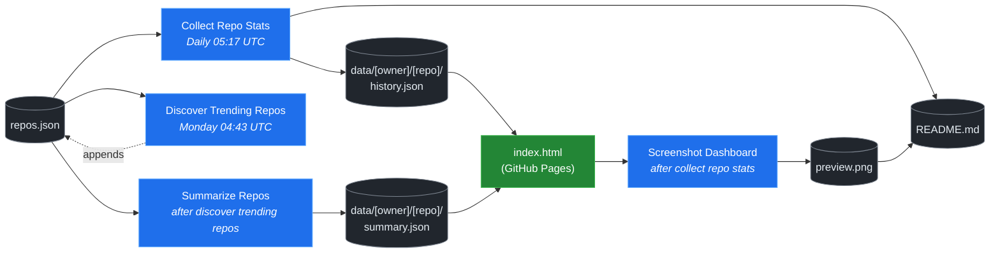

# 🚀 Rising Repos Tracker

> Automatically tracks daily GitHub stats (stars, forks, issues, velocity) for rising open source repos.

[](https://www.telosignal.com/)


**[→ View Live Dashboard](https://patrick-creates.github.io/rising-repos-tracker/)**

Built and maintained by [Telosignal](https://www.telosignal.com/).


<!-- AUTOGEN-STATS-START -->
## 📊 Current snapshot

> Auto-updated daily — last refreshed 2026-07-30

| Metric | Value |
|---|---|
| Repos tracked | **175** |
| Total stars | **8,313,815** |
| Total forks | **1,245,093** |
| Fastest growing | **ai-agent-book** (+1883.5/day) |

### 🔥 Top 5 by velocity

| # | Repo | Stars | Stars/day |
|---|---|---:|---:|
| 1 | [bojieli/ai-agent-book](https://github.com/bojieli/ai-agent-book) | 26,788 | +1883.5 |
| 2 | [DietrichGebert/ponytail](https://github.com/DietrichGebert/ponytail) | 91,930 | +1155.6 |
| 3 | [NousResearch/hermes-agent](https://github.com/NousResearch/hermes-agent) | 222,514 | +954.7 |
| 4 | [diegosouzapw/OmniRoute](https://github.com/diegosouzapw/OmniRoute) | 34,411 | +927.5 |
| 5 | [stablyai/orca](https://github.com/stablyai/orca) | 33,193 | +858.8 |

### 🆕 Recently added

- [Graphify-Labs/graphify](https://github.com/Graphify-Labs/graphify) — added 2026-07-27 — Turn any codebase, with its docs, SQL schemas, configs, and PDFs, into a queryable knowledge graph. A /graphify skill for Claude Code, Cursor, Codex, and Gemini CLI: local deterministic AST parsing, every edge explained, no vector store.
- [Imbad0202/academic-research-skills](https://github.com/Imbad0202/academic-research-skills) — added 2026-07-27 — Academic Research Skills for Claude Code: research → write → review → revise → finalize
- [Anionex/banana-slides](https://github.com/Anionex/banana-slides) — added 2026-07-27 — 一个基于nano banana pro🍌的原生AI PPT生成应用，迈向＂Vibe PPT＂; 支持上传任意模板图片，上传任意素材&智能解析，一句话/大纲/页面描述自动生成PPT，口头修改指定区域、一键导出可编辑ppt - An AI-native slides generator based on nano banana pro🍌
<!-- AUTOGEN-STATS-END -->

<!-- AUTOGEN-DIAGRAM-START -->
## 🔄 How it works


```mermaid
graph LR
    repos[("repos.json")]:::data
    history[("data/[owner]/[repo]/<br/>history.json")]:::data
    summary[("data/[owner]/[repo]/<br/>summary.json")]:::data
    readme[("README.md")]:::data
    preview[("preview.png")]:::data
    dashboard["index.html<br/>(GitHub Pages)"]:::output
    collect_yml["Collect Repo Stats<br/><i>Daily 05:17 UTC</i>"]:::workflow
    discover_yml["Discover Trending Repos<br/><i>Monday 04:43 UTC</i>"]:::workflow
    screenshot_yml["Screenshot Dashboard<br/><i>after collect repo stats</i>"]:::workflow
    summarize_yml["Summarize Repos<br/><i>after discover trending repos</i>"]:::workflow
    repos --> collect_yml
    collect_yml --> history
    collect_yml --> readme
    repos --> discover_yml
    discover_yml -.->|appends| repos
    dashboard --> screenshot_yml
    screenshot_yml --> preview
    repos --> summarize_yml
    summarize_yml --> summary
    history --> dashboard
    summary --> dashboard
    preview --> readme
    classDef workflow fill:#1f6feb,stroke:#58a6ff,color:#fff
    classDef data fill:#21262d,stroke:#7d8590,color:#e6edf3
    classDef output fill:#238636,stroke:#3fb950,color:#fff
```
<!-- AUTOGEN-DIAGRAM-END -->

<!-- AUTOGEN-WORKFLOWS-START -->
## ⚙️ Workflows

| File | Schedule | Name |
|---|---|---|
| `collect.yml` | Daily 05:17 UTC | Collect Repo Stats |
| `discover.yml` | Monday 04:43 UTC | Discover Trending Repos |
| `screenshot.yml` | After Collect Repo Stats | Screenshot Dashboard |
| `summarize.yml` | After Discover Trending Repos | Summarize Repos |

> All workflows commit results directly back to the repo. Schedules are best-effort — GitHub Actions cron can drift by a few minutes.
<!-- AUTOGEN-WORKFLOWS-END -->

<!-- AUTOGEN-REPOS-START -->
## 📋 All tracked repos

| Repo | Stars | Forks | Stars/day |
|---|---:|---:|---:|
| [openclaw/openclaw](https://github.com/openclaw/openclaw) | 384,533 | 80,819 | +167.5 |
| [obra/superpowers](https://github.com/obra/superpowers) | 263,552 | 23,531 | +736.2 |
| [affaan-m/everything-claude-code](https://github.com/affaan-m/everything-claude-code) | 235,823 | 35,894 | +702.2 |
| [affaan-m/ECC](https://github.com/affaan-m/ECC) | 235,823 | 35,894 | +660.5 |
| [NousResearch/hermes-agent](https://github.com/NousResearch/hermes-agent) | 222,514 | 42,702 | +954.7 |
| [Significant-Gravitas/AutoGPT](https://github.com/Significant-Gravitas/AutoGPT) | 185,743 | 46,068 | +18.7 |
| [microsoft/markitdown](https://github.com/microsoft/markitdown) | 170,146 | 12,320 | +604.3 |
| [f/prompts.chat](https://github.com/f/prompts.chat) | 166,517 | 21,509 | +55.7 |
| [langgenius/dify](https://github.com/langgenius/dify) | 150,775 | 23,760 | +122.4 |
| [open-webui/open-webui](https://github.com/open-webui/open-webui) | 147,292 | 21,409 | +133.3 |
| [langchain-ai/langchain](https://github.com/langchain-ai/langchain) | 142,960 | 23,800 | +81.1 |
| [github/spec-kit](https://github.com/github/spec-kit) | 124,542 | 11,121 | +342.1 |
| [farion1231/cc-switch](https://github.com/farion1231/cc-switch) | 122,395 | 8,266 | +662.3 |
| [microsoft/generative-ai-for-beginners](https://github.com/microsoft/generative-ai-for-beginners) | 113,703 | 61,039 | +37.8 |
| [nextlevelbuilder/ui-ux-pro-max-skill](https://github.com/nextlevelbuilder/ui-ux-pro-max-skill) | 111,598 | 11,907 | +432.1 |
| [Graphify-Labs/graphify](https://github.com/Graphify-Labs/graphify) | 98,678 | 9,572 | +660.0 |
| [JuliusBrussee/caveman](https://github.com/JuliusBrussee/caveman) | 94,449 | 5,405 | +451.2 |
| [DietrichGebert/ponytail](https://github.com/DietrichGebert/ponytail) | 91,930 | 5,062 | +1155.6 |
| [thedotmack/claude-mem](https://github.com/thedotmack/claude-mem) | 89,009 | 7,739 | +174.7 |
| [ChatGPTNextWeb/NextChat](https://github.com/ChatGPTNextWeb/NextChat) | 88,567 | 59,358 | +7.3 |
| [vllm-project/vllm](https://github.com/vllm-project/vllm) | 87,647 | 20,037 | +99.5 |
| [ruvnet/RuView](https://github.com/ruvnet/RuView) | 87,600 | 11,634 | +328.9 |
| [nexu-io/open-design](https://github.com/nexu-io/open-design) | 82,630 | 9,559 | +526.8 |
| [OpenHands/OpenHands](https://github.com/OpenHands/OpenHands) | 82,569 | 10,598 | +118.3 |
| [lobehub/lobehub](https://github.com/lobehub/lobehub) | 80,969 | 15,726 | +50.9 |
| [dair-ai/Prompt-Engineering-Guide](https://github.com/dair-ai/Prompt-Engineering-Guide) | 77,129 | 8,477 | +33.3 |
| [koala73/worldmonitor](https://github.com/koala73/worldmonitor) | 76,667 | 11,441 | +305.5 |
| [openai/openai-cookbook](https://github.com/openai/openai-cookbook) | 74,998 | 12,684 | +19.0 |
| [rtk-ai/rtk](https://github.com/rtk-ai/rtk) | 73,919 | 4,626 | +333.4 |
| [shareAI-lab/learn-claude-code](https://github.com/shareAI-lab/learn-claude-code) | 72,704 | 11,793 | +159.3 |
| [ComposioHQ/awesome-claude-skills](https://github.com/ComposioHQ/awesome-claude-skills) | 71,305 | 8,006 | +149.5 |
| [datawhalechina/hello-agents](https://github.com/datawhalechina/hello-agents) | 69,535 | 8,670 | +258.6 |
| [unslothai/unsloth](https://github.com/unslothai/unsloth) | 69,164 | 6,233 | +63.9 |
| [Leonxlnx/taste-skill](https://github.com/Leonxlnx/taste-skill) | 69,127 | 4,778 | +656.2 |
| [code-yeongyu/oh-my-openagent](https://github.com/code-yeongyu/oh-my-openagent) | 66,807 | 5,455 | +116.2 |
| [xtekky/gpt4free](https://github.com/xtekky/gpt4free) | 66,515 | 13,535 | +3.8 |
| [shanraisshan/claude-code-best-practice](https://github.com/shanraisshan/claude-code-best-practice) | 63,728 | 6,342 | +140.1 |
| [headroomlabs-ai/headroom](https://github.com/headroomlabs-ai/headroom) | 63,276 | 4,802 | +457.2 |
| [chopratejas/headroom](https://github.com/chopratejas/headroom) | 63,275 | 4,802 | +780.3 |
| [Fission-AI/OpenSpec](https://github.com/Fission-AI/OpenSpec) | 63,135 | 4,367 | +196.5 |
| [Panniantong/Agent-Reach](https://github.com/Panniantong/Agent-Reach) | 62,588 | 5,110 | +752.1 |
| [santifer/career-ops](https://github.com/santifer/career-ops) | 62,213 | 12,237 | +232.4 |
| [asgeirtj/system_prompts_leaks](https://github.com/asgeirtj/system_prompts_leaks) | 61,400 | 10,039 | +287.9 |
| [tw93/Pake](https://github.com/tw93/Pake) | 60,322 | 12,265 | +158.1 |
| [ZhuLinsen/daily_stock_analysis](https://github.com/ZhuLinsen/daily_stock_analysis) | 59,566 | 50,988 | +314.0 |
| [MemPalace/mempalace](https://github.com/MemPalace/mempalace) | 57,877 | 7,446 | +75.0 |
| [mvanhorn/last30days-skill](https://github.com/mvanhorn/last30days-skill) | 55,173 | 4,765 | +432.7 |
| [BerriAI/litellm](https://github.com/BerriAI/litellm) | 55,070 | 10,191 | +105.2 |
| [FlowiseAI/Flowise](https://github.com/FlowiseAI/Flowise) | 55,027 | 24,789 | +29.1 |
| [ggml-org/whisper.cpp](https://github.com/ggml-org/whisper.cpp) | 52,425 | 5,938 | +35.6 |
| [hesreallyhim/awesome-claude-code](https://github.com/hesreallyhim/awesome-claude-code) | 51,295 | 4,462 | +98.6 |
| [ChromeDevTools/chrome-devtools-mcp](https://github.com/ChromeDevTools/chrome-devtools-mcp) | 47,865 | 3,251 | +109.3 |
| [Aider-AI/aider](https://github.com/Aider-AI/aider) | 47,797 | 4,786 | +38.8 |
| [jamiepine/voicebox](https://github.com/jamiepine/voicebox) | 47,416 | 5,821 | +311.8 |
| [elder-plinius/CL4R1T4S](https://github.com/elder-plinius/CL4R1T4S) | 46,535 | 9,490 | +169.9 |
| [HKUDS/nanobot](https://github.com/HKUDS/nanobot) | 46,396 | 8,212 | +50.9 |
| [zhayujie/CowAgent](https://github.com/zhayujie/CowAgent) | 46,210 | 10,286 | +22.7 |
| [usestrix/strix](https://github.com/usestrix/strix) | 45,696 | 4,786 | +338.7 |
| [router-for-me/CLIProxyAPI](https://github.com/router-for-me/CLIProxyAPI) | 45,566 | 7,078 | +164.0 |
| [rohitg00/ai-engineering-from-scratch](https://github.com/rohitg00/ai-engineering-from-scratch) | 45,006 | 7,641 | +316.0 |
| [sickn33/antigravity-awesome-skills](https://github.com/sickn33/antigravity-awesome-skills) | 44,155 | 6,502 | +83.0 |
| [sickn33/agentic-awesome-skills](https://github.com/sickn33/agentic-awesome-skills) | 44,155 | 6,502 | +65.5 |
| [calesthio/OpenMontage](https://github.com/calesthio/OpenMontage) | 44,015 | 5,306 | +521.4 |
| [QuantumNous/new-api](https://github.com/QuantumNous/new-api) | 43,841 | 10,263 | +128.5 |
| [kepano/obsidian-skills](https://github.com/kepano/obsidian-skills) | 43,659 | 3,113 | +165.7 |
| [coreyhaines31/marketingskills](https://github.com/coreyhaines31/marketingskills) | 42,356 | 6,673 | +185.1 |
| [danny-avila/LibreChat](https://github.com/danny-avila/LibreChat) | 41,438 | 8,537 | +60.1 |
| [chatboxai/chatbox](https://github.com/chatboxai/chatbox) | 41,198 | 4,169 | +16.5 |
| [Hmbown/CodeWhale](https://github.com/Hmbown/CodeWhale) | 40,228 | 3,474 | +84.2 |
| [Imbad0202/academic-research-skills](https://github.com/Imbad0202/academic-research-skills) | 40,137 | 3,210 | +147.7 |
| [mindsdb/mindshub](https://github.com/mindsdb/mindshub) | 39,506 | 6,228 | +6.2 |
| [chatanywhere/GPT_API_free](https://github.com/chatanywhere/GPT_API_free) | 39,364 | 2,677 | +18.3 |
| [heygen-com/hyperframes](https://github.com/heygen-com/hyperframes) | 38,708 | 3,645 | +252.8 |
| [langchain-ai/langgraph](https://github.com/langchain-ai/langgraph) | 38,479 | 6,479 | +80.5 |
| [wshobson/agents](https://github.com/wshobson/agents) | 38,363 | 4,104 | +36.8 |
| [AstrBotDevs/AstrBot](https://github.com/AstrBotDevs/AstrBot) | 38,328 | 2,730 | +80.3 |
| [Yeachan-Heo/oh-my-claudecode](https://github.com/Yeachan-Heo/oh-my-claudecode) | 38,184 | 3,440 | +50.9 |
| [google/langextract](https://github.com/google/langextract) | 37,926 | 2,633 | +20.8 |
| [github/awesome-copilot](https://github.com/github/awesome-copilot) | 37,221 | 4,669 | +51.7 |
| [DeusData/codebase-memory-mcp](https://github.com/DeusData/codebase-memory-mcp) | 36,531 | 2,856 | +512.9 |
| [songquanpeng/one-api](https://github.com/songquanpeng/one-api) | 36,051 | 6,761 | +27.9 |
| [PDFMathTranslate/PDFMathTranslate](https://github.com/PDFMathTranslate/PDFMathTranslate) | 35,858 | 3,202 | +27.9 |
| [diegosouzapw/OmniRoute](https://github.com/diegosouzapw/OmniRoute) | 34,411 | 4,445 | +927.5 |
| [stablyai/orca](https://github.com/stablyai/orca) | 33,193 | 2,333 | +858.8 |
| [anthropics/claude-plugins-official](https://github.com/anthropics/claude-plugins-official) | 32,849 | 3,702 | +65.1 |
| [zeroclaw-labs/zeroclaw](https://github.com/zeroclaw-labs/zeroclaw) | 32,443 | 4,851 | +13.0 |
| [iOfficeAI/AionUi](https://github.com/iOfficeAI/AionUi) | 31,096 | 3,128 | +63.5 |
| [AlexsJones/llmfit](https://github.com/AlexsJones/llmfit) | 30,911 | 1,883 | +66.3 |
| [agentscope-ai/QwenPaw](https://github.com/agentscope-ai/QwenPaw) | 30,602 | 2,901 | +285.0 |
| [JCodesMore/ai-website-cloner-template](https://github.com/JCodesMore/ai-website-cloner-template) | 30,584 | 4,388 | +302.0 |
| [Gitlawb/openclaude](https://github.com/Gitlawb/openclaude) | 30,432 | 8,909 | +38.9 |
| [googleworkspace/cli](https://github.com/googleworkspace/cli) | 30,068 | 1,756 | +56.8 |
| [voideditor/void](https://github.com/voideditor/void) | 28,872 | 2,602 | +1.1 |
| [HKUDS/Vibe-Trading](https://github.com/HKUDS/Vibe-Trading) | 28,628 | 4,629 | +448.1 |
| [MadsLorentzen/ai-job-search](https://github.com/MadsLorentzen/ai-job-search) | 28,626 | 9,455 | +414.3 |
| [alibaba/page-agent](https://github.com/alibaba/page-agent) | 28,180 | 2,473 | +213.8 |
| [esengine/DeepSeek-Reasonix](https://github.com/esengine/DeepSeek-Reasonix) | 28,027 | 1,806 | +163.5 |
| [tirth8205/code-review-graph](https://github.com/tirth8205/code-review-graph) | 27,672 | 2,561 | +203.5 |
| [volcengine/OpenViking](https://github.com/volcengine/OpenViking) | 27,647 | 2,169 | +44.6 |
| [BloopAI/vibe-kanban](https://github.com/BloopAI/vibe-kanban) | 27,583 | 2,929 | +14.8 |
| [jackwener/OpenCLI](https://github.com/jackwener/OpenCLI) | 27,422 | 2,694 | +69.7 |
| [langchain-ai/deepagents](https://github.com/langchain-ai/deepagents) | 26,990 | 3,779 | +54.5 |
| [jarrodwatts/claude-hud](https://github.com/jarrodwatts/claude-hud) | 26,952 | 1,250 | +43.5 |
| [p-e-w/heretic](https://github.com/p-e-w/heretic) | 26,927 | 2,917 | +56.8 |
| [mukul975/Anthropic-Cybersecurity-Skills](https://github.com/mukul975/Anthropic-Cybersecurity-Skills) | 26,922 | 3,264 | +231.6 |
| [bojieli/ai-agent-book](https://github.com/bojieli/ai-agent-book) | 26,788 | 2,812 | +1883.5 |
| [rohitg00/agentmemory](https://github.com/rohitg00/agentmemory) | 25,982 | 2,167 | +79.9 |
| [zai-org/Open-AutoGLM](https://github.com/zai-org/Open-AutoGLM) | 25,910 | 4,021 | +8.6 |
| [manaflow-ai/cmux](https://github.com/manaflow-ai/cmux) | 25,350 | 2,110 | +58.5 |
| [toon-format/toon](https://github.com/toon-format/toon) | 25,022 | 1,111 | +10.1 |
| [decolua/9router](https://github.com/decolua/9router) | 24,065 | 4,150 | +144.3 |
| [iOfficeAI/OfficeCLI](https://github.com/iOfficeAI/OfficeCLI) | 23,359 | 1,568 | +623.4 |
| [ogulcancelik/herdr](https://github.com/ogulcancelik/herdr) | 22,482 | 1,525 | +420.2 |
| [winfunc/opcode](https://github.com/winfunc/opcode) | 22,328 | 1,719 | +6.2 |
| [coze-dev/coze-studio](https://github.com/coze-dev/coze-studio) | 21,288 | 3,091 | +6.5 |
| [NirDiamant/agents-towards-production](https://github.com/NirDiamant/agents-towards-production) | 21,207 | 2,813 | +11.0 |
| [can1357/oh-my-pi](https://github.com/can1357/oh-my-pi) | 20,646 | 1,947 | +175.0 |
| [mksglu/context-mode](https://github.com/mksglu/context-mode) | 19,466 | 1,385 | +44.4 |
| [steipete/CodexBar](https://github.com/steipete/CodexBar) | 19,325 | 1,610 | +108.5 |
| [Tencent/WeKnora](https://github.com/Tencent/WeKnora) | 19,135 | 2,706 | +63.2 |
| [tanweai/pua](https://github.com/tanweai/pua) | 19,123 | 1,159 | +19.5 |
| [KKKKhazix/khazix-skills](https://github.com/KKKKhazix/khazix-skills) | 18,756 | 2,083 | +129.8 |
| [datawhalechina/easy-vibe](https://github.com/datawhalechina/easy-vibe) | 18,615 | 1,767 | +37.2 |
| [jnMetaCode/agency-agents-zh](https://github.com/jnMetaCode/agency-agents-zh) | 18,522 | 3,079 | +82.0 |
| [pranshuparmar/witr](https://github.com/pranshuparmar/witr) | 18,352 | 579 | +10.3 |
| [jundot/omlx](https://github.com/jundot/omlx) | 18,308 | 1,564 | +37.2 |
| [RightNow-AI/openfang](https://github.com/RightNow-AI/openfang) | 18,065 | 2,285 | +5.3 |
| [microsoft/agent-lightning](https://github.com/microsoft/agent-lightning) | 17,429 | 1,526 | +2.6 |
| [danielmiessler/LifeOS](https://github.com/danielmiessler/LifeOS) | 17,086 | 2,313 | +26.8 |
| [nesquena/hermes-webui](https://github.com/nesquena/hermes-webui) | 16,709 | 2,278 | +49.2 |
| [browser-use/browser-harness](https://github.com/browser-use/browser-harness) | 16,342 | 1,548 | +27.8 |
| [cft0808/edict](https://github.com/cft0808/edict) | 16,291 | 1,711 | +5.1 |
| [alibaba/open-code-review](https://github.com/alibaba/open-code-review) | 16,255 | 1,099 | +261.2 |
| [MemoriLabs/Memori](https://github.com/MemoriLabs/Memori) | 15,670 | 2,886 | +8.6 |
| [Anionex/banana-slides](https://github.com/Anionex/banana-slides) | 15,354 | 1,769 | +7.0 |
| [xpzouying/xiaohongshu-mcp](https://github.com/xpzouying/xiaohongshu-mcp) | 14,975 | 2,204 | +18.1 |
| [kyegomez/OpenMythos](https://github.com/kyegomez/OpenMythos) | 14,769 | 3,300 | +16.2 |
| [xbtlin/ai-berkshire](https://github.com/xbtlin/ai-berkshire) | 14,721 | 2,081 | +164.3 |
| [yusufkaraaslan/Skill_Seekers](https://github.com/yusufkaraaslan/Skill_Seekers) | 14,631 | 1,486 | +10.7 |
| [NevaMind-AI/memU](https://github.com/NevaMind-AI/memU) | 14,155 | 1,053 | +6.7 |
| [wanshuiyin/Auto-claude-code-research-in-sleep](https://github.com/wanshuiyin/Auto-claude-code-research-in-sleep) | 14,023 | 1,250 | +40.3 |
| [1jehuang/jcode](https://github.com/1jehuang/jcode) | 13,675 | 1,500 | +315.9 |
| [superset-sh/superset](https://github.com/superset-sh/superset) | 12,673 | 1,136 | +16.5 |
| [XiaomiMiMo/MiMo-Code](https://github.com/XiaomiMiMo/MiMo-Code) | 12,550 | 1,281 | +49.2 |
| [t8y2/dbx](https://github.com/t8y2/dbx) | 12,491 | 1,206 | +218.0 |
| [sirmalloc/ccstatusline](https://github.com/sirmalloc/ccstatusline) | 12,103 | 532 | +26.5 |
| [EverMind-AI/EverOS](https://github.com/EverMind-AI/EverOS) | 11,672 | 872 | +63.1 |
| [ValueCell-ai/valuecell](https://github.com/ValueCell-ai/valuecell) | 10,954 | 1,815 | +2.6 |
| [walkinglabs/learn-harness-engineering](https://github.com/walkinglabs/learn-harness-engineering) | 10,841 | 1,177 | +39.8 |
| [aden-hive/hive](https://github.com/aden-hive/hive) | 10,807 | 5,666 | +6.3 |
| [0x4m4/hexstrike-ai](https://github.com/0x4m4/hexstrike-ai) | 10,606 | 2,209 | +19.2 |
| [MemTensor/MemOS](https://github.com/MemTensor/MemOS) | 10,447 | 958 | +13.5 |
| [Kuberwastaken/claurst](https://github.com/Kuberwastaken/claurst) | 10,154 | 7,777 | +9.3 |
| [brokermr810/QuantDinger](https://github.com/brokermr810/QuantDinger) | 10,122 | 2,124 | +35.0 |
| [OpenByteInc/QuantDinger](https://github.com/OpenByteInc/QuantDinger) | 10,122 | 2,124 | +32.0 |
| [ConardLi/garden-skills](https://github.com/ConardLi/garden-skills) | 9,916 | 1,306 | +30.6 |
| [EKKOLearnAI/hermes-studio](https://github.com/EKKOLearnAI/hermes-studio) | 9,583 | 1,174 | +30.1 |
| [frankbria/ralph-claude-code](https://github.com/frankbria/ralph-claude-code) | 9,567 | 728 | +5.8 |
| [ykdojo/claude-code-tips](https://github.com/ykdojo/claude-code-tips) | 9,482 | 748 | +19.4 |
| [TencentCloud/TencentDB-Agent-Memory](https://github.com/TencentCloud/TencentDB-Agent-Memory) | 9,402 | 902 | +40.2 |
| [iflytek/astron-agent](https://github.com/iflytek/astron-agent) | 9,390 | 875 | +32.5 |
| [getagentseal/codeburn](https://github.com/getagentseal/codeburn) | 9,027 | 709 | +23.2 |
| [EvoMap/evolver](https://github.com/EvoMap/evolver) | 8,885 | 823 | +1.3 |
| [MiroMindAI/MiroThinker](https://github.com/MiroMindAI/MiroThinker) | 8,360 | 644 | +1.4 |
| [StarTrail-org/PixelRAG](https://github.com/StarTrail-org/PixelRAG) | 8,062 | 676 | +86.9 |
| [mmulet/term.everything](https://github.com/mmulet/term.everything) | 8,052 | 192 | +1.2 |
| [modem-dev/hunk](https://github.com/modem-dev/hunk) | 7,944 | 230 | +72.9 |
| [ValueCell-ai/ClawX](https://github.com/ValueCell-ai/ClawX) | 7,561 | 1,131 | +1.2 |
| [steipete/summarize](https://github.com/steipete/summarize) | 6,496 | 438 | +5.1 |
| [opensquilla/opensquilla](https://github.com/opensquilla/opensquilla) | 6,407 | 484 | +19.8 |
| [Arthur-Ficial/apfel](https://github.com/Arthur-Ficial/apfel) | 6,224 | 238 | +6.4 |
| [microsoft/fara](https://github.com/microsoft/fara) | 6,097 | 596 | +5.8 |
| [UfoMiao/zcf](https://github.com/UfoMiao/zcf) | 6,079 | 425 | +0.5 |
| [Andyyyy64/whichllm](https://github.com/Andyyyy64/whichllm) | 6,054 | 320 | +18.7 |
| [re4/LibreCode](https://github.com/re4/LibreCode) | 77 | 4 | — |
<!-- AUTOGEN-REPOS-END -->

---

## What it does

- Collects daily snapshots of stars, forks, watchers and open issues for every tracked repo
- Discovers new trending repos automatically every Monday using the GitHub Search API
- Generates AI summaries (use cases, similar tools, tags) for each tracked repo via GitHub Models
- Stores all history as plain JSON — no database, no backend
- Renders a live dashboard via GitHub Pages — updates daily, zero maintenance

## Tracked repos

Data lives in [`data/`](./data) — one folder per repo, one `history.json` per entry.  
The full watch list is in [`repos.json`](./repos.json).

## Fork & use it for yourself

This is my personal tracker — the watch list reflects what I find interesting. If you want to track different repos, the best path is to **fork this repo and run your own**.

### Setup

1. Fork this repo to your account
2. Replace the contents of [`repos.json`](./repos.json) with the repos you want to track (or just leave one entry — `discover.yml` will auto-add more every Monday)
3. Go to **Settings → Pages** and enable GitHub Pages from the `main` branch
4. Go to **Actions** and run **Collect Repo Stats** once manually to seed your first data point
5. Your dashboard will be live at `https://YOUR-USERNAME.github.io/rising-repos-tracker/`

That's it — daily collection and weekly discovery run automatically on schedule. Zero ongoing maintenance.

### Customizing what gets discovered

Edit [`scripts/discover.js`](./scripts/discover.js) to change:

- `MIN_STARS` — minimum star threshold for candidates
- `MAX_AGE_DAYS` — how recent a repo must be
- `MAX_NEW_REPOS` — how many to add per discovery run
- The `queries` array — GitHub Search API queries that define what "trending" means to you

### Adding a repo manually

Just edit `repos.json` directly:

```json
{
  "owner": "OWNER",
  "repo": "REPO",
  "added": "YYYY-MM-DD",
  "notes": "why you're tracking this"
}
```

The next daily collect run picks it up automatically.

## Stack

- **GitHub Actions** — scheduling and automation
- **GitHub Pages** — dashboard hosting
- **GitHub API** — data source
- **GitHub Models** — free AI summaries (gpt-4o-mini)
- **Chart.js** — star growth visualization
- **Mermaid** — architecture diagram (rendered by GitHub)
- No dependencies, no build step, no database

## License

MIT
