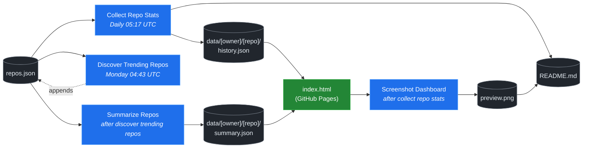

# 🚀 Rising Repos Tracker

> Automatically tracks daily GitHub stats (stars, forks, issues, velocity) for rising open source repos.

[](https://www.telosignal.com/)


**[→ View Live Dashboard](https://patrick-creates.github.io/rising-repos-tracker/)**

Built and maintained by [Telosignal](https://www.telosignal.com/).


<!-- AUTOGEN-STATS-START -->
## 📊 Current snapshot

> Auto-updated daily — last refreshed 2026-08-08

| Metric | Value |
|---|---|
| Repos tracked | **179** |
| Total stars | **8,568,699** |
| Total forks | **1,282,232** |
| Fastest growing | **ai-agent-book** (+1393.1/day) |

### 🔥 Top 5 by velocity

| # | Repo | Stars | Stars/day |
|---|---|---:|---:|
| 1 | [bojieli/ai-agent-book](https://github.com/bojieli/ai-agent-book) | 34,422 | +1393.1 |
| 2 | [DietrichGebert/ponytail](https://github.com/DietrichGebert/ponytail) | 98,395 | +1071.8 |
| 3 | [diegosouzapw/OmniRoute](https://github.com/diegosouzapw/OmniRoute) | 42,729 | +926.6 |
| 4 | [NousResearch/hermes-agent](https://github.com/NousResearch/hermes-agent) | 227,162 | +909.4 |
| 5 | [stablyai/orca](https://github.com/stablyai/orca) | 39,795 | +824.6 |

### 🆕 Recently added

- [herdrdev/herdr](https://github.com/herdrdev/herdr) — added 2026-08-03 — the runtime your coding agents live on
- [composio-community/awesome-codex-skills](https://github.com/composio-community/awesome-codex-skills) — added 2026-08-03 — A curated list of practical Codex skills for automating workflows across the Codex CLI and API.
- [NanmiCoder/cc-haha](https://github.com/NanmiCoder/cc-haha) — added 2026-08-03 — Local-first cross-platform desktop workspace for Claude Code / agents: multi-agent, Git worktrees, code diffs, skill marketplace, multi-model, Computer Use, task-aware desktop pets, with WeChat, Feishu, DingTalk, Telegram, WhatsApp and H5 access.
<!-- AUTOGEN-STATS-END -->

<!-- AUTOGEN-DIAGRAM-START -->
## 🔄 How it works


```mermaid
graph LR
    repos[("repos.json")]:::data
    history[("data/[owner]/[repo]/<br/>history.json")]:::data
    summary[("data/[owner]/[repo]/<br/>summary.json")]:::data
    readme[("README.md")]:::data
    preview[("preview.png")]:::data
    dashboard["index.html<br/>(GitHub Pages)"]:::output
    collect_yml["Collect Repo Stats<br/><i>Daily 05:17 UTC</i>"]:::workflow
    discover_yml["Discover Trending Repos<br/><i>Monday 04:43 UTC</i>"]:::workflow
    screenshot_yml["Screenshot Dashboard<br/><i>after collect repo stats</i>"]:::workflow
    summarize_yml["Summarize Repos<br/><i>after discover trending repos</i>"]:::workflow
    repos --> collect_yml
    collect_yml --> history
    collect_yml --> readme
    repos --> discover_yml
    discover_yml -.->|appends| repos
    dashboard --> screenshot_yml
    screenshot_yml --> preview
    repos --> summarize_yml
    summarize_yml --> summary
    history --> dashboard
    summary --> dashboard
    preview --> readme
    classDef workflow fill:#1f6feb,stroke:#58a6ff,color:#fff
    classDef data fill:#21262d,stroke:#7d8590,color:#e6edf3
    classDef output fill:#238636,stroke:#3fb950,color:#fff
```
<!-- AUTOGEN-DIAGRAM-END -->

<!-- AUTOGEN-WORKFLOWS-START -->
## ⚙️ Workflows

| File | Schedule | Name |
|---|---|---|
| `collect.yml` | Daily 05:17 UTC | Collect Repo Stats |
| `discover.yml` | Monday 04:43 UTC | Discover Trending Repos |
| `screenshot.yml` | After Collect Repo Stats | Screenshot Dashboard |
| `summarize.yml` | After Discover Trending Repos | Summarize Repos |

> All workflows commit results directly back to the repo. Schedules are best-effort — GitHub Actions cron can drift by a few minutes.
<!-- AUTOGEN-WORKFLOWS-END -->

<!-- AUTOGEN-REPOS-START -->
## 📋 All tracked repos

| Repo | Stars | Forks | Stars/day |
|---|---:|---:|---:|
| [openclaw/openclaw](https://github.com/openclaw/openclaw) | 385,514 | 81,030 | +161.4 |
| [obra/superpowers](https://github.com/obra/superpowers) | 268,865 | 24,008 | +708.3 |
| [affaan-m/everything-claude-code](https://github.com/affaan-m/everything-claude-code) | 238,624 | 36,237 | +661.8 |
| [affaan-m/ECC](https://github.com/affaan-m/ECC) | 238,624 | 36,237 | +618.6 |
| [NousResearch/hermes-agent](https://github.com/NousResearch/hermes-agent) | 227,162 | 44,445 | +909.4 |
| [Significant-Gravitas/AutoGPT](https://github.com/Significant-Gravitas/AutoGPT) | 186,370 | 46,062 | +24.0 |
| [microsoft/markitdown](https://github.com/microsoft/markitdown) | 172,264 | 12,546 | +566.2 |
| [f/prompts.chat](https://github.com/f/prompts.chat) | 166,871 | 21,539 | +54.0 |
| [langgenius/dify](https://github.com/langgenius/dify) | 151,751 | 23,949 | +121.0 |
| [open-webui/open-webui](https://github.com/open-webui/open-webui) | 148,195 | 21,564 | +129.9 |
| [langchain-ai/langchain](https://github.com/langchain-ai/langchain) | 143,664 | 23,933 | +80.8 |
| [github/spec-kit](https://github.com/github/spec-kit) | 125,804 | 11,231 | +321.2 |
| [farion1231/cc-switch](https://github.com/farion1231/cc-switch) | 125,516 | 8,539 | +627.7 |
| [microsoft/generative-ai-for-beginners](https://github.com/microsoft/generative-ai-for-beginners) | 116,967 | 61,808 | +71.4 |
| [nextlevelbuilder/ui-ux-pro-max-skill](https://github.com/nextlevelbuilder/ui-ux-pro-max-skill) | 114,535 | 12,271 | +421.2 |
| [Graphify-Labs/graphify](https://github.com/Graphify-Labs/graphify) | 104,091 | 10,107 | +616.1 |
| [DietrichGebert/ponytail](https://github.com/DietrichGebert/ponytail) | 98,395 | 5,403 | +1071.8 |
| [JuliusBrussee/caveman](https://github.com/JuliusBrussee/caveman) | 96,746 | 5,563 | +429.7 |
| [thedotmack/claude-mem](https://github.com/thedotmack/claude-mem) | 90,015 | 7,838 | +168.2 |
| [ruvnet/RuView](https://github.com/ruvnet/RuView) | 88,873 | 11,826 | +306.4 |
| [ChatGPTNextWeb/NextChat](https://github.com/ChatGPTNextWeb/NextChat) | 88,592 | 59,317 | +6.8 |
| [vllm-project/vllm](https://github.com/vllm-project/vllm) | 88,489 | 20,422 | +98.9 |
| [nexu-io/open-design](https://github.com/nexu-io/open-design) | 84,430 | 9,848 | +490.9 |
| [OpenHands/OpenHands](https://github.com/OpenHands/OpenHands) | 83,420 | 10,770 | +115.7 |
| [lobehub/lobehub](https://github.com/lobehub/lobehub) | 81,407 | 15,782 | +50.7 |
| [koala73/worldmonitor](https://github.com/koala73/worldmonitor) | 79,737 | 11,911 | +309.4 |
| [dair-ai/Prompt-Engineering-Guide](https://github.com/dair-ai/Prompt-Engineering-Guide) | 77,342 | 8,499 | +32.2 |
| [rtk-ai/rtk](https://github.com/rtk-ai/rtk) | 75,211 | 4,735 | +312.6 |
| [openai/openai-cookbook](https://github.com/openai/openai-cookbook) | 75,165 | 12,700 | +19.0 |
| [Leonxlnx/taste-skill](https://github.com/Leonxlnx/taste-skill) | 73,962 | 5,068 | +640.4 |
| [shareAI-lab/learn-claude-code](https://github.com/shareAI-lab/learn-claude-code) | 73,532 | 11,921 | +151.9 |
| [ComposioHQ/awesome-claude-skills](https://github.com/ComposioHQ/awesome-claude-skills) | 72,039 | 8,170 | +142.1 |
| [datawhalechina/hello-agents](https://github.com/datawhalechina/hello-agents) | 71,589 | 8,917 | +255.2 |
| [unslothai/unsloth](https://github.com/unslothai/unsloth) | 69,699 | 6,290 | +63.4 |
| [Panniantong/Agent-Reach](https://github.com/Panniantong/Agent-Reach) | 68,435 | 5,753 | +737.0 |
| [code-yeongyu/oh-my-openagent](https://github.com/code-yeongyu/oh-my-openagent) | 67,471 | 5,503 | +111.5 |
| [xtekky/gpt4free](https://github.com/xtekky/gpt4free) | 66,529 | 13,528 | +3.5 |
| [chopratejas/headroom](https://github.com/chopratejas/headroom) | 65,429 | 4,987 | +690.1 |
| [headroomlabs-ai/headroom](https://github.com/headroomlabs-ai/headroom) | 65,429 | 4,987 | +415.4 |
| [Fission-AI/OpenSpec](https://github.com/Fission-AI/OpenSpec) | 64,238 | 4,427 | +188.4 |
| [shanraisshan/claude-code-best-practice](https://github.com/shanraisshan/claude-code-best-practice) | 64,150 | 6,375 | +129.9 |
| [santifer/career-ops](https://github.com/santifer/career-ops) | 63,185 | 12,459 | +218.8 |
| [asgeirtj/system_prompts_leaks](https://github.com/asgeirtj/system_prompts_leaks) | 62,535 | 10,278 | +270.1 |
| [ZhuLinsen/daily_stock_analysis](https://github.com/ZhuLinsen/daily_stock_analysis) | 60,529 | 51,699 | +289.2 |
| [tw93/Pake](https://github.com/tw93/Pake) | 60,509 | 12,329 | +143.0 |
| [MemPalace/mempalace](https://github.com/MemPalace/mempalace) | 58,205 | 7,482 | +70.8 |
| [mvanhorn/last30days-skill](https://github.com/mvanhorn/last30days-skill) | 57,626 | 5,001 | +409.1 |
| [BerriAI/litellm](https://github.com/BerriAI/litellm) | 55,846 | 10,407 | +103.1 |
| [FlowiseAI/Flowise](https://github.com/FlowiseAI/Flowise) | 55,247 | 24,869 | +28.6 |
| [ggml-org/whisper.cpp](https://github.com/ggml-org/whisper.cpp) | 52,677 | 6,038 | +34.8 |
| [hesreallyhim/awesome-claude-code](https://github.com/hesreallyhim/awesome-claude-code) | 51,873 | 4,527 | +94.9 |
| [jamiepine/voicebox](https://github.com/jamiepine/voicebox) | 49,728 | 6,140 | +304.5 |
| [usestrix/strix](https://github.com/usestrix/strix) | 49,707 | 5,287 | +352.9 |
| [ChromeDevTools/chrome-devtools-mcp](https://github.com/ChromeDevTools/chrome-devtools-mcp) | 48,726 | 3,386 | +107.8 |
| [Aider-AI/aider](https://github.com/Aider-AI/aider) | 48,042 | 4,828 | +37.6 |
| [elder-plinius/CL4R1T4S](https://github.com/elder-plinius/CL4R1T4S) | 46,797 | 9,518 | +146.4 |
| [HKUDS/nanobot](https://github.com/HKUDS/nanobot) | 46,758 | 8,273 | +49.7 |
| [router-for-me/CLIProxyAPI](https://github.com/router-for-me/CLIProxyAPI) | 46,502 | 7,214 | +156.8 |
| [zhayujie/CowAgent](https://github.com/zhayujie/CowAgent) | 46,404 | 10,302 | +22.5 |
| [rohitg00/ai-engineering-from-scratch](https://github.com/rohitg00/ai-engineering-from-scratch) | 46,251 | 8,004 | +292.5 |
| [calesthio/OpenMontage](https://github.com/calesthio/OpenMontage) | 45,985 | 5,682 | +453.4 |
| [QuantumNous/new-api](https://github.com/QuantumNous/new-api) | 44,641 | 10,533 | +123.8 |
| [sickn33/antigravity-awesome-skills](https://github.com/sickn33/antigravity-awesome-skills) | 44,615 | 6,550 | +79.2 |
| [sickn33/agentic-awesome-skills](https://github.com/sickn33/agentic-awesome-skills) | 44,615 | 6,550 | +60.5 |
| [kepano/obsidian-skills](https://github.com/kepano/obsidian-skills) | 44,390 | 3,172 | +154.5 |
| [coreyhaines31/marketingskills](https://github.com/coreyhaines31/marketingskills) | 43,477 | 6,848 | +177.0 |
| [diegosouzapw/OmniRoute](https://github.com/diegosouzapw/OmniRoute) | 42,729 | 5,694 | +926.6 |
| [danny-avila/LibreChat](https://github.com/danny-avila/LibreChat) | 41,780 | 8,632 | +57.5 |
| [chatboxai/chatbox](https://github.com/chatboxai/chatbox) | 41,366 | 4,192 | +16.7 |
| [Imbad0202/academic-research-skills](https://github.com/Imbad0202/academic-research-skills) | 41,324 | 3,291 | +135.8 |
| [Hmbown/CodeWhale](https://github.com/Hmbown/CodeWhale) | 40,545 | 3,510 | +78.3 |
| [heygen-com/hyperframes](https://github.com/heygen-com/hyperframes) | 39,989 | 3,804 | +236.5 |
| [chatanywhere/GPT_API_free](https://github.com/chatanywhere/GPT_API_free) | 39,932 | 2,682 | +23.7 |
| [stablyai/orca](https://github.com/stablyai/orca) | 39,795 | 2,794 | +824.6 |
| [mindsdb/mindshub](https://github.com/mindsdb/mindshub) | 39,529 | 6,223 | +4.9 |
| [langchain-ai/langgraph](https://github.com/langchain-ai/langgraph) | 39,165 | 6,584 | +79.7 |
| [AstrBotDevs/AstrBot](https://github.com/AstrBotDevs/AstrBot) | 38,805 | 2,779 | +76.7 |
| [wshobson/agents](https://github.com/wshobson/agents) | 38,605 | 4,119 | +35.6 |
| [Yeachan-Heo/oh-my-claudecode](https://github.com/Yeachan-Heo/oh-my-claudecode) | 38,428 | 3,458 | +48.1 |
| [DeusData/codebase-memory-mcp](https://github.com/DeusData/codebase-memory-mcp) | 38,096 | 3,033 | +436.6 |
| [google/langextract](https://github.com/google/langextract) | 37,995 | 2,650 | +19.2 |
| [github/awesome-copilot](https://github.com/github/awesome-copilot) | 37,568 | 4,730 | +50.2 |
| [songquanpeng/one-api](https://github.com/songquanpeng/one-api) | 36,253 | 6,788 | +27.2 |
| [PDFMathTranslate/PDFMathTranslate](https://github.com/PDFMathTranslate/PDFMathTranslate) | 36,020 | 3,219 | +26.7 |
| [bojieli/ai-agent-book](https://github.com/bojieli/ai-agent-book) | 34,422 | 3,712 | +1393.1 |
| [agentscope-ai/QwenPaw](https://github.com/agentscope-ai/QwenPaw) | 34,242 | 2,960 | +304.9 |
| [anthropics/claude-plugins-official](https://github.com/anthropics/claude-plugins-official) | 33,257 | 3,755 | +62.4 |
| [esengine/DeepSeek-Reasonix](https://github.com/esengine/DeepSeek-Reasonix) | 32,938 | 2,124 | +219.9 |
| [zeroclaw-labs/zeroclaw](https://github.com/zeroclaw-labs/zeroclaw) | 32,527 | 4,878 | +12.5 |
| [iOfficeAI/AionUi](https://github.com/iOfficeAI/AionUi) | 31,685 | 3,229 | +63.8 |
| [AlexsJones/llmfit](https://github.com/AlexsJones/llmfit) | 31,244 | 1,917 | +62.4 |
| [JCodesMore/ai-website-cloner-template](https://github.com/JCodesMore/ai-website-cloner-template) | 31,187 | 4,497 | +262.9 |
| [MadsLorentzen/ai-job-search](https://github.com/MadsLorentzen/ai-job-search) | 30,736 | 10,478 | +352.0 |
| [Gitlawb/openclaude](https://github.com/Gitlawb/openclaude) | 30,564 | 8,900 | +35.7 |
| [HKUDS/Vibe-Trading](https://github.com/HKUDS/Vibe-Trading) | 30,273 | 4,876 | +388.4 |
| [googleworkspace/cli](https://github.com/googleworkspace/cli) | 30,258 | 1,772 | +52.1 |
| [tirth8205/code-review-graph](https://github.com/tirth8205/code-review-graph) | 29,369 | 2,697 | +201.0 |
| [voideditor/void](https://github.com/voideditor/void) | 28,860 | 2,610 | +0.8 |
| [alibaba/page-agent](https://github.com/alibaba/page-agent) | 28,505 | 2,518 | +184.2 |
| [volcengine/OpenViking](https://github.com/volcengine/OpenViking) | 28,067 | 2,212 | +44.9 |
| [jackwener/OpenCLI](https://github.com/jackwener/OpenCLI) | 27,885 | 2,744 | +67.0 |
| [BloopAI/vibe-kanban](https://github.com/BloopAI/vibe-kanban) | 27,701 | 2,942 | +14.6 |
| [langchain-ai/deepagents](https://github.com/langchain-ai/deepagents) | 27,497 | 3,838 | +54.8 |
| [mukul975/Anthropic-Cybersecurity-Skills](https://github.com/mukul975/Anthropic-Cybersecurity-Skills) | 27,448 | 3,321 | +198.4 |
| [jarrodwatts/claude-hud](https://github.com/jarrodwatts/claude-hud) | 27,220 | 1,265 | +41.5 |
| [p-e-w/heretic](https://github.com/p-e-w/heretic) | 27,187 | 2,944 | +52.7 |
| [rohitg00/agentmemory](https://github.com/rohitg00/agentmemory) | 26,724 | 2,272 | +80.3 |
| [iOfficeAI/OfficeCLI](https://github.com/iOfficeAI/OfficeCLI) | 26,595 | 1,800 | +551.5 |
| [zai-org/Open-AutoGLM](https://github.com/zai-org/Open-AutoGLM) | 25,965 | 4,019 | +8.2 |
| [manaflow-ai/cmux](https://github.com/manaflow-ai/cmux) | 25,749 | 2,172 | +53.6 |
| [ogulcancelik/herdr](https://github.com/ogulcancelik/herdr) | 25,680 | 1,807 | +402.5 |
| [herdrdev/herdr](https://github.com/herdrdev/herdr) | 25,680 | 1,807 | +378.2 |
| [toon-format/toon](https://github.com/toon-format/toon) | 25,111 | 1,113 | +10.1 |
| [decolua/9router](https://github.com/decolua/9router) | 24,938 | 4,426 | +136.4 |
| [can1357/oh-my-pi](https://github.com/can1357/oh-my-pi) | 22,821 | 2,171 | +187.8 |
| [winfunc/opcode](https://github.com/winfunc/opcode) | 22,362 | 1,724 | +5.9 |
| [coze-dev/coze-studio](https://github.com/coze-dev/coze-studio) | 21,402 | 3,111 | +7.4 |
| [NirDiamant/agents-towards-production](https://github.com/NirDiamant/agents-towards-production) | 21,257 | 2,816 | +10.2 |
| [pranshuparmar/witr](https://github.com/pranshuparmar/witr) | 19,874 | 647 | +46.0 |
| [steipete/CodexBar](https://github.com/steipete/CodexBar) | 19,776 | 1,662 | +97.3 |
| [mksglu/context-mode](https://github.com/mksglu/context-mode) | 19,703 | 1,414 | +41.4 |
| [alibaba/open-code-review](https://github.com/alibaba/open-code-review) | 19,610 | 1,363 | +291.6 |
| [Tencent/WeKnora](https://github.com/Tencent/WeKnora) | 19,513 | 2,792 | +59.6 |
| [KKKKhazix/khazix-skills](https://github.com/KKKKhazix/khazix-skills) | 19,366 | 2,123 | +100.4 |
| [tanweai/pua](https://github.com/tanweai/pua) | 19,289 | 1,175 | +19.3 |
| [jnMetaCode/agency-agents-zh](https://github.com/jnMetaCode/agency-agents-zh) | 18,966 | 3,115 | +75.7 |
| [datawhalechina/easy-vibe](https://github.com/datawhalechina/easy-vibe) | 18,802 | 1,788 | +34.5 |
| [jundot/omlx](https://github.com/jundot/omlx) | 18,516 | 1,598 | +34.9 |
| [RightNow-AI/openfang](https://github.com/RightNow-AI/openfang) | 18,084 | 2,282 | +4.8 |
| [TencentCloud/TencentDB-Agent-Memory](https://github.com/TencentCloud/TencentDB-Agent-Memory) | 17,645 | 1,584 | +343.3 |
| [microsoft/agent-lightning](https://github.com/microsoft/agent-lightning) | 17,457 | 1,529 | +2.7 |
| [danielmiessler/LifeOS](https://github.com/danielmiessler/LifeOS) | 17,260 | 2,335 | +25.4 |
| [nesquena/hermes-webui](https://github.com/nesquena/hermes-webui) | 17,089 | 2,334 | +47.9 |
| [browser-use/browser-harness](https://github.com/browser-use/browser-harness) | 16,566 | 1,569 | +27.2 |
| [1jehuang/jcode](https://github.com/1jehuang/jcode) | 16,382 | 1,840 | +310.7 |
| [cft0808/edict](https://github.com/cft0808/edict) | 16,340 | 1,710 | +5.1 |
| [MemoriLabs/Memori](https://github.com/MemoriLabs/Memori) | 15,694 | 2,891 | +7.5 |
| [composio-community/awesome-codex-skills](https://github.com/composio-community/awesome-codex-skills) | 15,691 | 1,523 | +25.2 |
| [Anionex/banana-slides](https://github.com/Anionex/banana-slides) | 15,427 | 1,776 | +7.8 |
| [xbtlin/ai-berkshire](https://github.com/xbtlin/ai-berkshire) | 15,200 | 2,245 | +134.0 |
| [xpzouying/xiaohongshu-mcp](https://github.com/xpzouying/xiaohongshu-mcp) | 15,126 | 2,229 | +17.9 |
| [kyegomez/OpenMythos](https://github.com/kyegomez/OpenMythos) | 14,785 | 3,296 | +13.4 |
| [yusufkaraaslan/Skill_Seekers](https://github.com/yusufkaraaslan/Skill_Seekers) | 14,724 | 1,499 | +10.6 |
| [wanshuiyin/Auto-claude-code-research-in-sleep](https://github.com/wanshuiyin/Auto-claude-code-research-in-sleep) | 14,389 | 1,279 | +40.4 |
| [NevaMind-AI/memU](https://github.com/NevaMind-AI/memU) | 14,269 | 1,054 | +7.9 |
| [NanmiCoder/cc-haha](https://github.com/NanmiCoder/cc-haha) | 13,992 | 8,532 | +23.2 |
| [t8y2/dbx](https://github.com/t8y2/dbx) | 13,674 | 1,403 | +153.1 |
| [superset-sh/superset](https://github.com/superset-sh/superset) | 12,817 | 1,170 | +16.4 |
| [XiaomiMiMo/MiMo-Code](https://github.com/XiaomiMiMo/MiMo-Code) | 12,682 | 1,295 | +41.5 |
| [sirmalloc/ccstatusline](https://github.com/sirmalloc/ccstatusline) | 12,290 | 537 | +25.3 |
| [EverMind-AI/EverOS](https://github.com/EverMind-AI/EverOS) | 11,866 | 885 | +53.8 |
| [walkinglabs/learn-harness-engineering](https://github.com/walkinglabs/learn-harness-engineering) | 11,077 | 1,201 | +36.1 |
| [ValueCell-ai/valuecell](https://github.com/ValueCell-ai/valuecell) | 10,962 | 1,814 | +2.3 |
| [aden-hive/hive](https://github.com/aden-hive/hive) | 10,885 | 5,674 | +6.8 |
| [0x4m4/hexstrike-ai](https://github.com/0x4m4/hexstrike-ai) | 10,871 | 2,271 | +21.5 |
| [MemTensor/MemOS](https://github.com/MemTensor/MemOS) | 10,643 | 984 | +15.4 |
| [brokermr810/QuantDinger](https://github.com/brokermr810/QuantDinger) | 10,371 | 2,179 | +33.0 |
| [OpenByteInc/QuantDinger](https://github.com/OpenByteInc/QuantDinger) | 10,371 | 2,179 | +29.9 |
| [Kuberwastaken/claurst](https://github.com/Kuberwastaken/claurst) | 10,199 | 7,783 | +8.3 |
| [ConardLi/garden-skills](https://github.com/ConardLi/garden-skills) | 10,151 | 1,339 | +29.4 |
| [EKKOLearnAI/hermes-studio](https://github.com/EKKOLearnAI/hermes-studio) | 9,851 | 1,210 | +30.0 |
| [frankbria/ralph-claude-code](https://github.com/frankbria/ralph-claude-code) | 9,590 | 723 | +5.5 |
| [ykdojo/claude-code-tips](https://github.com/ykdojo/claude-code-tips) | 9,566 | 760 | +16.6 |
| [StarTrail-org/PixelRAG](https://github.com/StarTrail-org/PixelRAG) | 9,345 | 795 | +106.2 |
| [openai/codex-security](https://github.com/openai/codex-security) | 9,285 | 639 | +200.6 |
| [iflytek/astron-agent](https://github.com/iflytek/astron-agent) | 9,242 | 873 | +19.2 |
| [getagentseal/codeburn](https://github.com/getagentseal/codeburn) | 9,197 | 722 | +22.0 |
| [EvoMap/evolver](https://github.com/EvoMap/evolver) | 8,952 | 829 | +2.9 |
| [MiroMindAI/MiroThinker](https://github.com/MiroMindAI/MiroThinker) | 8,367 | 644 | +1.2 |
| [modem-dev/hunk](https://github.com/modem-dev/hunk) | 8,162 | 239 | +56.0 |
| [mmulet/term.everything](https://github.com/mmulet/term.everything) | 8,060 | 192 | +1.1 |
| [ValueCell-ai/ClawX](https://github.com/ValueCell-ai/ClawX) | 7,574 | 1,134 | +1.3 |
| [opensquilla/opensquilla](https://github.com/opensquilla/opensquilla) | 6,576 | 509 | +19.3 |
| [steipete/summarize](https://github.com/steipete/summarize) | 6,531 | 440 | +4.7 |
| [Arthur-Ficial/apfel](https://github.com/Arthur-Ficial/apfel) | 6,260 | 239 | +5.6 |
| [Andyyyy64/whichllm](https://github.com/Andyyyy64/whichllm) | 6,165 | 327 | +15.7 |
| [microsoft/fara](https://github.com/microsoft/fara) | 6,133 | 599 | +5.2 |
| [UfoMiao/zcf](https://github.com/UfoMiao/zcf) | 6,076 | 425 | +0.2 |
| [re4/LibreCode](https://github.com/re4/LibreCode) | 82 | 4 | — |
<!-- AUTOGEN-REPOS-END -->

---

## What it does

- Collects daily snapshots of stars, forks, watchers and open issues for every tracked repo
- Discovers new trending repos automatically every Monday using the GitHub Search API
- Generates AI summaries (use cases, similar tools, tags) for each tracked repo via GitHub Models
- Stores all history as plain JSON — no database, no backend
- Renders a live dashboard via GitHub Pages — updates daily, zero maintenance

## Tracked repos

Data lives in [`data/`](./data) — one folder per repo, one `history.json` per entry.  
The full watch list is in [`repos.json`](./repos.json).

## Fork & use it for yourself

This is my personal tracker — the watch list reflects what I find interesting. If you want to track different repos, the best path is to **fork this repo and run your own**.

### Setup

1. Fork this repo to your account
2. Replace the contents of [`repos.json`](./repos.json) with the repos you want to track (or just leave one entry — `discover.yml` will auto-add more every Monday)
3. Go to **Settings → Pages** and enable GitHub Pages from the `main` branch
4. Go to **Actions** and run **Collect Repo Stats** once manually to seed your first data point
5. Your dashboard will be live at `https://YOUR-USERNAME.github.io/rising-repos-tracker/`

That's it — daily collection and weekly discovery run automatically on schedule. Zero ongoing maintenance.

### Customizing what gets discovered

Edit [`scripts/discover.js`](./scripts/discover.js) to change:

- `MIN_STARS` — minimum star threshold for candidates
- `MAX_AGE_DAYS` — how recent a repo must be
- `MAX_NEW_REPOS` — how many to add per discovery run
- The `queries` array — GitHub Search API queries that define what "trending" means to you

### Adding a repo manually

Just edit `repos.json` directly:

```json
{
  "owner": "OWNER",
  "repo": "REPO",
  "added": "YYYY-MM-DD",
  "notes": "why you're tracking this"
}
```

The next daily collect run picks it up automatically.

## Stack

- **GitHub Actions** — scheduling and automation
- **GitHub Pages** — dashboard hosting
- **GitHub API** — data source
- **GitHub Models** — free AI summaries (gpt-4o-mini)
- **Chart.js** — star growth visualization
- **Mermaid** — architecture diagram (rendered by GitHub)
- No dependencies, no build step, no database

## License

MIT
