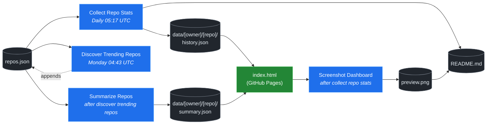

# 🚀 Rising Repos Tracker

> Automatically tracks daily GitHub stats (stars, forks, issues, velocity) for rising open source repos.

[](https://www.telosignal.com/)


**[→ View Live Dashboard](https://patrick-creates.github.io/rising-repos-tracker/)**

Built and maintained by [Telosignal](https://www.telosignal.com/).


<!-- AUTOGEN-STATS-START -->
## 📊 Current snapshot

> Auto-updated daily — last refreshed 2026-08-25

| Metric | Value |
|---|---|
| Repos tracked | **186** |
| Total stars | **8,987,102** |
| Total forks | **1,333,089** |
| Fastest growing | **ponytail** (+967.8/day) |

### 🔥 Top 5 by velocity

| # | Repo | Stars | Stars/day |
|---|---|---:|---:|
| 1 | [DietrichGebert/ponytail](https://github.com/DietrichGebert/ponytail) | 109,955 | +967.8 |
| 2 | [bojieli/ai-agent-book](https://github.com/bojieli/ai-agent-book) | 41,902 | +943.0 |
| 3 | [diegosouzapw/OmniRoute](https://github.com/diegosouzapw/OmniRoute) | 54,565 | +848.3 |
| 4 | [NousResearch/hermes-agent](https://github.com/NousResearch/hermes-agent) | 235,962 | +845.4 |
| 5 | [stablyai/orca](https://github.com/stablyai/orca) | 53,002 | +808.4 |

### 🆕 Recently added

- [virgiliojr94/book-to-skill](https://github.com/virgiliojr94/book-to-skill) — added 2026-08-24 — Turn any technical book PDF into a Claude Code skill — ready to study, reference, and use while you work.
- [guillaumemeyer/watermarks-remover](https://github.com/guillaumemeyer/watermarks-remover) — added 2026-08-24 — Strip multi-vendor AI provenance marks: Unicode text hygiene, statistical rewrite hooks, and C2PA/metadata from PNG/JPEG/SVG/PDF/DOCX/HTML/MD
- [holaboss-ai/holaOS](https://github.com/holaboss-ai/holaOS) — added 2026-08-17 — Open-source All in One AI agent workspace. Run any agent — Claude Code, Codex — across your tools (100+ integrations + MCP), apps, browser, and files, with shared memory. Built-in models or BYOK.
<!-- AUTOGEN-STATS-END -->

<!-- AUTOGEN-DIAGRAM-START -->
## 🔄 How it works


```mermaid
graph LR
    repos[("repos.json")]:::data
    history[("data/[owner]/[repo]/<br/>history.json")]:::data
    summary[("data/[owner]/[repo]/<br/>summary.json")]:::data
    readme[("README.md")]:::data
    preview[("preview.png")]:::data
    dashboard["index.html<br/>(GitHub Pages)"]:::output
    collect_yml["Collect Repo Stats<br/><i>Daily 05:17 UTC</i>"]:::workflow
    discover_yml["Discover Trending Repos<br/><i>Monday 04:43 UTC</i>"]:::workflow
    screenshot_yml["Screenshot Dashboard<br/><i>after collect repo stats</i>"]:::workflow
    summarize_yml["Summarize Repos<br/><i>after discover trending repos</i>"]:::workflow
    repos --> collect_yml
    collect_yml --> history
    collect_yml --> readme
    repos --> discover_yml
    discover_yml -.->|appends| repos
    dashboard --> screenshot_yml
    screenshot_yml --> preview
    repos --> summarize_yml
    summarize_yml --> summary
    history --> dashboard
    summary --> dashboard
    preview --> readme
    classDef workflow fill:#1f6feb,stroke:#58a6ff,color:#fff
    classDef data fill:#21262d,stroke:#7d8590,color:#e6edf3
    classDef output fill:#238636,stroke:#3fb950,color:#fff
```
<!-- AUTOGEN-DIAGRAM-END -->

<!-- AUTOGEN-WORKFLOWS-START -->
## ⚙️ Workflows

| File | Schedule | Name |
|---|---|---|
| `collect.yml` | Daily 05:17 UTC | Collect Repo Stats |
| `discover.yml` | Monday 04:43 UTC | Discover Trending Repos |
| `screenshot.yml` | After Collect Repo Stats | Screenshot Dashboard |
| `summarize.yml` | After Discover Trending Repos | Summarize Repos |

> All workflows commit results directly back to the repo. Schedules are best-effort — GitHub Actions cron can drift by a few minutes.
<!-- AUTOGEN-WORKFLOWS-END -->

<!-- AUTOGEN-REPOS-START -->
## 📋 All tracked repos

| Repo | Stars | Forks | Stars/day |
|---|---:|---:|---:|
| [openclaw/openclaw](https://github.com/openclaw/openclaw) | 387,486 | 81,350 | +154.0 |
| [obra/superpowers](https://github.com/obra/superpowers) | 277,193 | 24,800 | +650.3 |
| [affaan-m/everything-claude-code](https://github.com/affaan-m/everything-claude-code) | 242,973 | 36,769 | +595.4 |
| [affaan-m/ECC](https://github.com/affaan-m/ECC) | 242,973 | 36,769 | +551.6 |
| [NousResearch/hermes-agent](https://github.com/NousResearch/hermes-agent) | 235,962 | 47,605 | +845.4 |
| [Significant-Gravitas/AutoGPT](https://github.com/Significant-Gravitas/AutoGPT) | 186,852 | 46,048 | +24.7 |
| [microsoft/markitdown](https://github.com/microsoft/markitdown) | 176,076 | 12,911 | +510.3 |
| [f/prompts.chat](https://github.com/f/prompts.chat) | 167,869 | 21,666 | +54.8 |
| [langgenius/dify](https://github.com/langgenius/dify) | 153,419 | 24,242 | +117.3 |
| [open-webui/open-webui](https://github.com/open-webui/open-webui) | 149,826 | 21,856 | +124.4 |
| [langchain-ai/langchain](https://github.com/langchain-ai/langchain) | 144,933 | 24,154 | +79.8 |
| [github/spec-kit](https://github.com/github/spec-kit) | 131,202 | 11,783 | +320.6 |
| [farion1231/cc-switch](https://github.com/farion1231/cc-switch) | 129,232 | 8,858 | +557.5 |
| [nextlevelbuilder/ui-ux-pro-max-skill](https://github.com/nextlevelbuilder/ui-ux-pro-max-skill) | 120,644 | 12,949 | +411.1 |
| [microsoft/generative-ai-for-beginners](https://github.com/microsoft/generative-ai-for-beginners) | 118,500 | 62,479 | +74.5 |
| [Graphify-Labs/graphify](https://github.com/Graphify-Labs/graphify) | 110,188 | 10,723 | +465.2 |
| [DietrichGebert/ponytail](https://github.com/DietrichGebert/ponytail) | 109,955 | 6,059 | +967.8 |
| [JuliusBrussee/caveman](https://github.com/JuliusBrussee/caveman) | 100,737 | 5,852 | +396.2 |
| [thedotmack/claude-mem](https://github.com/thedotmack/claude-mem) | 91,745 | 8,047 | +157.4 |
| [ruvnet/RuView](https://github.com/ruvnet/RuView) | 91,529 | 12,156 | +278.7 |
| [nexu-io/open-design](https://github.com/nexu-io/open-design) | 91,174 | 10,504 | +474.7 |
| [vllm-project/vllm](https://github.com/vllm-project/vllm) | 89,930 | 21,152 | +96.6 |
| [ChatGPTNextWeb/NextChat](https://github.com/ChatGPTNextWeb/NextChat) | 88,646 | 59,205 | +6.2 |
| [OpenHands/OpenHands](https://github.com/OpenHands/OpenHands) | 85,007 | 11,104 | +111.9 |
| [koala73/worldmonitor](https://github.com/koala73/worldmonitor) | 84,067 | 12,578 | +300.0 |
| [lobehub/lobehub](https://github.com/lobehub/lobehub) | 81,976 | 15,823 | +47.9 |
| [Leonxlnx/taste-skill](https://github.com/Leonxlnx/taste-skill) | 80,183 | 5,494 | +585.5 |
| [dair-ai/Prompt-Engineering-Guide](https://github.com/dair-ai/Prompt-Engineering-Guide) | 77,767 | 8,543 | +31.0 |
| [rtk-ai/rtk](https://github.com/rtk-ai/rtk) | 77,311 | 4,861 | +280.1 |
| [openai/openai-cookbook](https://github.com/openai/openai-cookbook) | 75,531 | 12,766 | +19.4 |
| [shareAI-lab/learn-claude-code](https://github.com/shareAI-lab/learn-claude-code) | 75,206 | 12,139 | +142.7 |
| [Panniantong/Agent-Reach](https://github.com/Panniantong/Agent-Reach) | 74,925 | 6,390 | +659.6 |
| [unslothai/unsloth](https://github.com/unslothai/unsloth) | 74,649 | 6,751 | +102.5 |
| [datawhalechina/hello-agents](https://github.com/datawhalechina/hello-agents) | 74,616 | 9,265 | +242.0 |
| [ComposioHQ/awesome-claude-skills](https://github.com/ComposioHQ/awesome-claude-skills) | 73,189 | 8,397 | +129.3 |
| [code-yeongyu/oh-my-openagent](https://github.com/code-yeongyu/oh-my-openagent) | 68,332 | 5,589 | +101.1 |
| [santifer/career-ops](https://github.com/santifer/career-ops) | 68,186 | 12,942 | +231.7 |
| [chopratejas/headroom](https://github.com/chopratejas/headroom) | 67,467 | 5,201 | +553.6 |
| [headroomlabs-ai/headroom](https://github.com/headroomlabs-ai/headroom) | 67,467 | 5,201 | +336.9 |
| [xtekky/gpt4free](https://github.com/xtekky/gpt4free) | 66,597 | 13,512 | +3.6 |
| [Fission-AI/OpenSpec](https://github.com/Fission-AI/OpenSpec) | 66,136 | 4,551 | +175.2 |
| [shanraisshan/claude-code-best-practice](https://github.com/shanraisshan/claude-code-best-practice) | 64,975 | 6,462 | +115.9 |
| [ZhuLinsen/daily_stock_analysis](https://github.com/ZhuLinsen/daily_stock_analysis) | 63,804 | 53,607 | +271.4 |
| [asgeirtj/system_prompts_leaks](https://github.com/asgeirtj/system_prompts_leaks) | 63,505 | 10,409 | +233.5 |
| [tw93/Pake](https://github.com/tw93/Pake) | 61,067 | 12,528 | +124.1 |
| [mvanhorn/last30days-skill](https://github.com/mvanhorn/last30days-skill) | 59,203 | 5,180 | +340.2 |
| [MemPalace/mempalace](https://github.com/MemPalace/mempalace) | 58,613 | 7,517 | +62.8 |
| [usestrix/strix](https://github.com/usestrix/strix) | 57,847 | 6,285 | +378.1 |
| [BerriAI/litellm](https://github.com/BerriAI/litellm) | 57,190 | 10,869 | +99.0 |
| [FlowiseAI/Flowise](https://github.com/FlowiseAI/Flowise) | 55,390 | 24,948 | +25.2 |
| [diegosouzapw/OmniRoute](https://github.com/diegosouzapw/OmniRoute) | 54,565 | 7,469 | +848.3 |
| [ggml-org/whisper.cpp](https://github.com/ggml-org/whisper.cpp) | 53,151 | 6,094 | +33.6 |
| [stablyai/orca](https://github.com/stablyai/orca) | 53,002 | 3,664 | +808.4 |
| [hesreallyhim/awesome-claude-code](https://github.com/hesreallyhim/awesome-claude-code) | 52,941 | 4,622 | +89.4 |
| [jamiepine/voicebox](https://github.com/jamiepine/voicebox) | 51,366 | 6,408 | +262.9 |
| [calesthio/OpenMontage](https://github.com/calesthio/OpenMontage) | 50,136 | 6,298 | +391.0 |
| [ChromeDevTools/chrome-devtools-mcp](https://github.com/ChromeDevTools/chrome-devtools-mcp) | 49,667 | 3,482 | +98.8 |
| [router-for-me/CLIProxyAPI](https://github.com/router-for-me/CLIProxyAPI) | 48,666 | 7,489 | +151.3 |
| [Aider-AI/aider](https://github.com/Aider-AI/aider) | 48,468 | 4,877 | +35.4 |
| [rohitg00/ai-engineering-from-scratch](https://github.com/rohitg00/ai-engineering-from-scratch) | 48,406 | 8,510 | +259.3 |
| [HKUDS/nanobot](https://github.com/HKUDS/nanobot) | 47,360 | 8,360 | +47.3 |
| [kepano/obsidian-skills](https://github.com/kepano/obsidian-skills) | 47,204 | 3,389 | +156.7 |
| [elder-plinius/CL4R1T4S](https://github.com/elder-plinius/CL4R1T4S) | 47,136 | 9,557 | +116.1 |
| [zhayujie/CowAgent](https://github.com/zhayujie/CowAgent) | 46,661 | 10,328 | +21.3 |
| [QuantumNous/new-api](https://github.com/QuantumNous/new-api) | 46,182 | 10,969 | +117.7 |
| [coreyhaines31/marketingskills](https://github.com/coreyhaines31/marketingskills) | 45,515 | 7,131 | +165.6 |
| [sickn33/antigravity-awesome-skills](https://github.com/sickn33/antigravity-awesome-skills) | 45,358 | 6,647 | +72.6 |
| [sickn33/agentic-awesome-skills](https://github.com/sickn33/agentic-awesome-skills) | 45,358 | 6,647 | +53.9 |
| [Imbad0202/academic-research-skills](https://github.com/Imbad0202/academic-research-skills) | 43,596 | 3,461 | +134.6 |
| [heygen-com/hyperframes](https://github.com/heygen-com/hyperframes) | 42,508 | 4,074 | +217.3 |
| [danny-avila/LibreChat](https://github.com/danny-avila/LibreChat) | 42,422 | 8,792 | +53.8 |
| [bojieli/ai-agent-book](https://github.com/bojieli/ai-agent-book) | 41,902 | 4,628 | +943.0 |
| [chatboxai/chatbox](https://github.com/chatboxai/chatbox) | 41,552 | 4,206 | +15.7 |
| [chatanywhere/GPT_API_free](https://github.com/chatanywhere/GPT_API_free) | 41,055 | 2,698 | +31.5 |
| [Hmbown/CodeWhale](https://github.com/Hmbown/CodeWhale) | 40,842 | 3,534 | +67.1 |
| [DeusData/codebase-memory-mcp](https://github.com/DeusData/codebase-memory-mcp) | 40,456 | 3,268 | +347.8 |
| [langchain-ai/langgraph](https://github.com/langchain-ai/langgraph) | 40,397 | 6,810 | +77.8 |
| [mindsdb/mindshub](https://github.com/mindsdb/mindshub) | 39,638 | 6,235 | +5.5 |
| [AstrBotDevs/AstrBot](https://github.com/AstrBotDevs/AstrBot) | 39,572 | 2,836 | +70.4 |
| [wshobson/agents](https://github.com/wshobson/agents) | 39,098 | 4,171 | +34.4 |
| [Yeachan-Heo/oh-my-claudecode](https://github.com/Yeachan-Heo/oh-my-claudecode) | 38,780 | 3,478 | +43.0 |
| [google/langextract](https://github.com/google/langextract) | 38,484 | 2,705 | +21.0 |
| [github/awesome-copilot](https://github.com/github/awesome-copilot) | 38,211 | 4,827 | +47.9 |
| [songquanpeng/one-api](https://github.com/songquanpeng/one-api) | 36,563 | 6,828 | +25.6 |
| [PDFMathTranslate/PDFMathTranslate](https://github.com/PDFMathTranslate/PDFMathTranslate) | 36,346 | 3,241 | +25.3 |
| [esengine/DeepSeek-Reasonix](https://github.com/esengine/DeepSeek-Reasonix) | 35,131 | 2,338 | +200.1 |
| [agentscope-ai/QwenPaw](https://github.com/agentscope-ai/QwenPaw) | 34,421 | 3,030 | +234.4 |
| [MadsLorentzen/ai-job-search](https://github.com/MadsLorentzen/ai-job-search) | 34,310 | 11,933 | +296.0 |
| [anthropics/claude-plugins-official](https://github.com/anthropics/claude-plugins-official) | 33,928 | 3,862 | +57.8 |
| [AlexsJones/llmfit](https://github.com/AlexsJones/llmfit) | 33,904 | 2,121 | +81.2 |
| [volcengine/OpenViking](https://github.com/volcengine/OpenViking) | 33,057 | 2,518 | +99.1 |
| [JCodesMore/ai-website-cloner-template](https://github.com/JCodesMore/ai-website-cloner-template) | 33,048 | 4,817 | +226.1 |
| [zeroclaw-labs/zeroclaw](https://github.com/zeroclaw-labs/zeroclaw) | 32,647 | 4,909 | +11.4 |
| [iOfficeAI/AionUi](https://github.com/iOfficeAI/AionUi) | 32,258 | 3,314 | +57.8 |
| [ogulcancelik/herdr](https://github.com/ogulcancelik/herdr) | 32,144 | 2,303 | +394.9 |
| [herdrdev/herdr](https://github.com/herdrdev/herdr) | 32,144 | 2,303 | +379.8 |
| [HKUDS/Vibe-Trading](https://github.com/HKUDS/Vibe-Trading) | 31,653 | 5,148 | +296.8 |
| [mukul975/Anthropic-Cybersecurity-Skills](https://github.com/mukul975/Anthropic-Cybersecurity-Skills) | 31,020 | 3,695 | +201.5 |
| [Gitlawb/openclaude](https://github.com/Gitlawb/openclaude) | 30,819 | 8,919 | +31.6 |
| [tirth8205/code-review-graph](https://github.com/tirth8205/code-review-graph) | 30,798 | 2,803 | +173.0 |
| [googleworkspace/cli](https://github.com/googleworkspace/cli) | 30,547 | 1,788 | +45.0 |
| [iOfficeAI/OfficeCLI](https://github.com/iOfficeAI/OfficeCLI) | 29,182 | 1,991 | +415.7 |
| [voideditor/void](https://github.com/voideditor/void) | 28,829 | 2,635 | +0.3 |
| [alibaba/page-agent](https://github.com/alibaba/page-agent) | 28,817 | 2,576 | +144.5 |
| [jackwener/OpenCLI](https://github.com/jackwener/OpenCLI) | 28,530 | 2,804 | +60.6 |
| [langchain-ai/deepagents](https://github.com/langchain-ai/deepagents) | 28,399 | 3,975 | +54.4 |
| [p-e-w/heretic](https://github.com/p-e-w/heretic) | 28,097 | 3,046 | +52.9 |
| [BloopAI/vibe-kanban](https://github.com/BloopAI/vibe-kanban) | 27,907 | 2,988 | +14.1 |
| [jarrodwatts/claude-hud](https://github.com/jarrodwatts/claude-hud) | 27,620 | 1,278 | +37.6 |
| [rohitg00/agentmemory](https://github.com/rohitg00/agentmemory) | 27,375 | 2,340 | +71.2 |
| [can1357/oh-my-pi](https://github.com/can1357/oh-my-pi) | 27,228 | 2,665 | +206.8 |
| [manaflow-ai/cmux](https://github.com/manaflow-ai/cmux) | 26,425 | 2,254 | +48.1 |
| [decolua/9router](https://github.com/decolua/9router) | 26,249 | 4,744 | +122.2 |
| [zai-org/Open-AutoGLM](https://github.com/zai-org/Open-AutoGLM) | 26,081 | 4,020 | +7.9 |
| [virgiliojr94/book-to-skill](https://github.com/virgiliojr94/book-to-skill) | 25,308 | 2,626 | +479.0 |
| [toon-format/toon](https://github.com/toon-format/toon) | 25,246 | 1,120 | +9.6 |
| [TencentCloud/TencentDB-Agent-Memory](https://github.com/TencentCloud/TencentDB-Agent-Memory) | 24,303 | 2,237 | +362.4 |
| [winfunc/opcode](https://github.com/winfunc/opcode) | 22,388 | 1,728 | +4.9 |
| [pascalorg/editor](https://github.com/pascalorg/editor) | 21,693 | 2,784 | +29.5 |
| [pranshuparmar/witr](https://github.com/pranshuparmar/witr) | 21,682 | 756 | +64.0 |
| [coze-dev/coze-studio](https://github.com/coze-dev/coze-studio) | 21,499 | 3,120 | +7.1 |
| [alibaba/open-code-review](https://github.com/alibaba/open-code-review) | 21,352 | 1,565 | +227.3 |
| [NirDiamant/agents-towards-production](https://github.com/NirDiamant/agents-towards-production) | 21,328 | 2,834 | +8.9 |
| [jundot/omlx](https://github.com/jundot/omlx) | 20,568 | 1,738 | +55.4 |
| [Tencent/WeKnora](https://github.com/Tencent/WeKnora) | 20,561 | 2,950 | +60.1 |
| [steipete/CodexBar](https://github.com/steipete/CodexBar) | 20,545 | 1,772 | +83.5 |
| [mksglu/context-mode](https://github.com/mksglu/context-mode) | 20,126 | 1,456 | +37.4 |
| [KKKKhazix/khazix-skills](https://github.com/KKKKhazix/khazix-skills) | 20,035 | 2,158 | +71.6 |
| [jnMetaCode/agency-agents-zh](https://github.com/jnMetaCode/agency-agents-zh) | 19,887 | 3,231 | +70.0 |
| [tanweai/pua](https://github.com/tanweai/pua) | 19,495 | 1,188 | +17.6 |
| [datawhalechina/easy-vibe](https://github.com/datawhalechina/easy-vibe) | 19,093 | 1,828 | +30.3 |
| [danielmiessler/LifeOS](https://github.com/danielmiessler/LifeOS) | 18,722 | 2,436 | +41.5 |
| [1jehuang/jcode](https://github.com/1jehuang/jcode) | 18,481 | 2,080 | +236.7 |
| [RightNow-AI/openfang](https://github.com/RightNow-AI/openfang) | 18,134 | 2,286 | +4.3 |
| [guillaumemeyer/watermarks-remover](https://github.com/guillaumemeyer/watermarks-remover) | 17,995 | 2,075 | +443.0 |
| [microsoft/agent-lightning](https://github.com/microsoft/agent-lightning) | 17,748 | 1,563 | +6.2 |
| [nesquena/hermes-webui](https://github.com/nesquena/hermes-webui) | 17,700 | 2,449 | +44.7 |
| [browser-use/browser-harness](https://github.com/browser-use/browser-harness) | 17,121 | 1,643 | +28.8 |
| [t8y2/dbx](https://github.com/t8y2/dbx) | 16,473 | 1,615 | +159.9 |
| [jlcodes99/cockpit-tools](https://github.com/jlcodes99/cockpit-tools) | 16,448 | 1,448 | +65.1 |
| [cft0808/edict](https://github.com/cft0808/edict) | 16,398 | 1,719 | +4.7 |
| [MemoriLabs/Memori](https://github.com/MemoriLabs/Memori) | 16,214 | 3,235 | +13.6 |
| [composio-community/awesome-codex-skills](https://github.com/composio-community/awesome-codex-skills) | 16,030 | 1,564 | +21.1 |
| [xbtlin/ai-berkshire](https://github.com/xbtlin/ai-berkshire) | 15,847 | 2,367 | +101.4 |
| [Anionex/banana-slides](https://github.com/Anionex/banana-slides) | 15,498 | 1,774 | +5.7 |
| [xpzouying/xiaohongshu-mcp](https://github.com/xpzouying/xiaohongshu-mcp) | 15,463 | 2,280 | +18.4 |
| [wanshuiyin/Auto-claude-code-research-in-sleep](https://github.com/wanshuiyin/Auto-claude-code-research-in-sleep) | 15,129 | 1,328 | +41.3 |
| [yusufkaraaslan/Skill_Seekers](https://github.com/yusufkaraaslan/Skill_Seekers) | 14,815 | 1,513 | +9.2 |
| [kyegomez/OpenMythos](https://github.com/kyegomez/OpenMythos) | 14,803 | 3,295 | +10.1 |
| [NevaMind-AI/memU](https://github.com/NevaMind-AI/memU) | 14,342 | 1,062 | +6.9 |
| [NanmiCoder/cc-haha](https://github.com/NanmiCoder/cc-haha) | 14,207 | 8,543 | +15.0 |
| [walkinglabs/learn-harness-engineering](https://github.com/walkinglabs/learn-harness-engineering) | 14,065 | 1,398 | +83.6 |
| [superset-sh/superset](https://github.com/superset-sh/superset) | 13,322 | 1,219 | +20.4 |
| [XiaomiMiMo/MiMo-Code](https://github.com/XiaomiMiMo/MiMo-Code) | 12,865 | 1,324 | +32.3 |
| [sirmalloc/ccstatusline](https://github.com/sirmalloc/ccstatusline) | 12,558 | 548 | +22.4 |
| [EverMind-AI/EverOS](https://github.com/EverMind-AI/EverOS) | 12,405 | 904 | +47.2 |
| [0x4m4/hexstrike-ai](https://github.com/0x4m4/hexstrike-ai) | 11,345 | 2,367 | +23.4 |
| [ifixai-ai/iFixAi](https://github.com/ifixai-ai/iFixAi) | 11,257 | 1,142 | +205.6 |
| [brokermr810/QuantDinger](https://github.com/brokermr810/QuantDinger) | 11,063 | 2,323 | +35.6 |
| [OpenByteInc/QuantDinger](https://github.com/OpenByteInc/QuantDinger) | 11,063 | 2,323 | +35.0 |
| [ValueCell-ai/valuecell](https://github.com/ValueCell-ai/valuecell) | 11,004 | 1,808 | +2.3 |
| [aden-hive/hive](https://github.com/aden-hive/hive) | 10,961 | 5,670 | +6.1 |
| [MemTensor/MemOS](https://github.com/MemTensor/MemOS) | 10,957 | 1,004 | +16.3 |
| [holaboss-ai/holaOS](https://github.com/holaboss-ai/holaOS) | 10,787 | 713 | +302.0 |
| [ConardLi/garden-skills](https://github.com/ConardLi/garden-skills) | 10,601 | 1,375 | +28.4 |
| [EKKOLearnAI/hermes-studio](https://github.com/EKKOLearnAI/hermes-studio) | 10,582 | 1,285 | +34.4 |
| [Kuberwastaken/claurst](https://github.com/Kuberwastaken/claurst) | 10,269 | 7,762 | +7.1 |
| [openai/codex-security](https://github.com/openai/codex-security) | 10,147 | 724 | +84.8 |
| [ykdojo/claude-code-tips](https://github.com/ykdojo/claude-code-tips) | 9,905 | 795 | +17.8 |
| [StarTrail-org/PixelRAG](https://github.com/StarTrail-org/PixelRAG) | 9,699 | 828 | +72.4 |
| [getagentseal/codeburn](https://github.com/getagentseal/codeburn) | 9,631 | 766 | +23.2 |
| [frankbria/ralph-claude-code](https://github.com/frankbria/ralph-claude-code) | 9,608 | 721 | +4.8 |
| [EvoMap/evolver](https://github.com/EvoMap/evolver) | 8,996 | 839 | +2.8 |
| [iflytek/astron-agent](https://github.com/iflytek/astron-agent) | 8,947 | 859 | +6.7 |
| [modem-dev/hunk](https://github.com/modem-dev/hunk) | 8,723 | 269 | +46.9 |
| [MiroMindAI/MiroThinker](https://github.com/MiroMindAI/MiroThinker) | 8,360 | 642 | +0.7 |
| [mmulet/term.everything](https://github.com/mmulet/term.everything) | 8,081 | 194 | +1.2 |
| [ValueCell-ai/ClawX](https://github.com/ValueCell-ai/ClawX) | 7,597 | 1,143 | +1.3 |
| [1weiho/open-slide](https://github.com/1weiho/open-slide) | 6,918 | 495 | +53.3 |
| [opensquilla/opensquilla](https://github.com/opensquilla/opensquilla) | 6,661 | 523 | +12.6 |
| [steipete/summarize](https://github.com/steipete/summarize) | 6,572 | 441 | +3.8 |
| [Andyyyy64/whichllm](https://github.com/Andyyyy64/whichllm) | 6,467 | 353 | +16.7 |
| [Arthur-Ficial/apfel](https://github.com/Arthur-Ficial/apfel) | 6,315 | 242 | +4.7 |
| [microsoft/fara](https://github.com/microsoft/fara) | 6,149 | 599 | +3.5 |
| [UfoMiao/zcf](https://github.com/UfoMiao/zcf) | 6,078 | 421 | +0.2 |
| [re4/LibreCode](https://github.com/re4/LibreCode) | 85 | 5 | — |
<!-- AUTOGEN-REPOS-END -->

---

## What it does

- Collects daily snapshots of stars, forks, watchers and open issues for every tracked repo
- Discovers new trending repos automatically every Monday using the GitHub Search API
- Generates AI summaries (use cases, similar tools, tags) for each tracked repo via GitHub Models
- Stores all history as plain JSON — no database, no backend
- Renders a live dashboard via GitHub Pages — updates daily, zero maintenance

## Tracked repos

Data lives in [`data/`](./data) — one folder per repo, one `history.json` per entry.  
The full watch list is in [`repos.json`](./repos.json).

## Fork & use it for yourself

This is my personal tracker — the watch list reflects what I find interesting. If you want to track different repos, the best path is to **fork this repo and run your own**.

### Setup

1. Fork this repo to your account
2. Replace the contents of [`repos.json`](./repos.json) with the repos you want to track (or just leave one entry — `discover.yml` will auto-add more every Monday)
3. Go to **Settings → Pages** and enable GitHub Pages from the `main` branch
4. Go to **Actions** and run **Collect Repo Stats** once manually to seed your first data point
5. Your dashboard will be live at `https://YOUR-USERNAME.github.io/rising-repos-tracker/`

That's it — daily collection and weekly discovery run automatically on schedule. Zero ongoing maintenance.

### Customizing what gets discovered

Edit [`scripts/discover.js`](./scripts/discover.js) to change:

- `MIN_STARS` — minimum star threshold for candidates
- `MAX_AGE_DAYS` — how recent a repo must be
- `MAX_NEW_REPOS` — how many to add per discovery run
- The `queries` array — GitHub Search API queries that define what "trending" means to you

### Adding a repo manually

Just edit `repos.json` directly:

```json
{
  "owner": "OWNER",
  "repo": "REPO",
  "added": "YYYY-MM-DD",
  "notes": "why you're tracking this"
}
```

The next daily collect run picks it up automatically.

## Stack

- **GitHub Actions** — scheduling and automation
- **GitHub Pages** — dashboard hosting
- **GitHub API** — data source
- **GitHub Models** — free AI summaries (gpt-4o-mini)
- **Chart.js** — star growth visualization
- **Mermaid** — architecture diagram (rendered by GitHub)
- No dependencies, no build step, no database

## License

MIT
