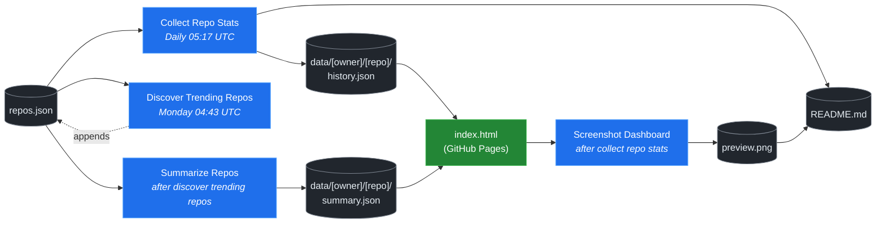

# 🚀 Rising Repos Tracker

> Automatically tracks daily GitHub stats (stars, forks, issues, velocity) for rising open source repos.

[](https://www.telosignal.com/)


**[→ View Live Dashboard](https://patrick-creates.github.io/rising-repos-tracker/)**

Built and maintained by [Telosignal](https://www.telosignal.com/).


<!-- AUTOGEN-STATS-START -->
## 📊 Current snapshot

> Auto-updated daily — last refreshed 2026-09-05

| Metric | Value |
|---|---|
| Repos tracked | **187** |
| Total stars | **9,211,498** |
| Total forks | **1,361,362** |
| Fastest growing | **ponytail** (+1051.4/day) |

### 🔥 Top 5 by velocity

| # | Repo | Stars | Stars/day |
|---|---|---:|---:|
| 1 | [DietrichGebert/ponytail](https://github.com/DietrichGebert/ponytail) | 126,877 | +1051.4 |
| 2 | [NousResearch/hermes-agent](https://github.com/NousResearch/hermes-agent) | 241,684 | +814.3 |
| 3 | [stablyai/orca](https://github.com/stablyai/orca) | 61,912 | +808.7 |
| 4 | [diegosouzapw/OmniRoute](https://github.com/diegosouzapw/OmniRoute) | 61,391 | +807.2 |
| 5 | [bojieli/ai-agent-book](https://github.com/bojieli/ai-agent-book) | 44,771 | +783.4 |

### 🆕 Recently added

- [WenyuChiou/awesome-agentic-ai-zh](https://github.com/WenyuChiou/awesome-agentic-ai-zh) — added 2026-08-31 — A trilingual (繁中 / English / 简中) learning roadmap for agentic AI: from LLM basics to multi-agent systems, with 240+ curated resources and hands-on examples. 中文 AI agent 學習地圖。
- [virgiliojr94/book-to-skill](https://github.com/virgiliojr94/book-to-skill) — added 2026-08-24 — Turn any technical book PDF into a Claude Code skill — ready to study, reference, and use while you work.
- [guillaumemeyer/watermarks-remover](https://github.com/guillaumemeyer/watermarks-remover) — added 2026-08-24 — Strip multi-vendor AI provenance marks: Unicode text hygiene, statistical rewrite hooks, and C2PA/metadata from PNG/JPEG/SVG/PDF/DOCX/HTML/MD
<!-- AUTOGEN-STATS-END -->

<!-- AUTOGEN-DIAGRAM-START -->
## 🔄 How it works


```mermaid
graph LR
    repos[("repos.json")]:::data
    history[("data/[owner]/[repo]/<br/>history.json")]:::data
    summary[("data/[owner]/[repo]/<br/>summary.json")]:::data
    readme[("README.md")]:::data
    preview[("preview.png")]:::data
    dashboard["index.html<br/>(GitHub Pages)"]:::output
    collect_yml["Collect Repo Stats<br/><i>Daily 05:17 UTC</i>"]:::workflow
    discover_yml["Discover Trending Repos<br/><i>Monday 04:43 UTC</i>"]:::workflow
    screenshot_yml["Screenshot Dashboard<br/><i>after collect repo stats</i>"]:::workflow
    summarize_yml["Summarize Repos<br/><i>after discover trending repos</i>"]:::workflow
    repos --> collect_yml
    collect_yml --> history
    collect_yml --> readme
    repos --> discover_yml
    discover_yml -.->|appends| repos
    dashboard --> screenshot_yml
    screenshot_yml --> preview
    repos --> summarize_yml
    summarize_yml --> summary
    history --> dashboard
    summary --> dashboard
    preview --> readme
    classDef workflow fill:#1f6feb,stroke:#58a6ff,color:#fff
    classDef data fill:#21262d,stroke:#7d8590,color:#e6edf3
    classDef output fill:#238636,stroke:#3fb950,color:#fff
```
<!-- AUTOGEN-DIAGRAM-END -->

<!-- AUTOGEN-WORKFLOWS-START -->
## ⚙️ Workflows

| File | Schedule | Name |
|---|---|---|
| `collect.yml` | Daily 05:17 UTC | Collect Repo Stats |
| `discover.yml` | Monday 04:43 UTC | Discover Trending Repos |
| `screenshot.yml` | After Collect Repo Stats | Screenshot Dashboard |
| `summarize.yml` | After Discover Trending Repos | Summarize Repos |

> All workflows commit results directly back to the repo. Schedules are best-effort — GitHub Actions cron can drift by a few minutes.
<!-- AUTOGEN-WORKFLOWS-END -->

<!-- AUTOGEN-REPOS-START -->
## 📋 All tracked repos

| Repo | Stars | Forks | Stars/day |
|---|---:|---:|---:|
| [openclaw/openclaw](https://github.com/openclaw/openclaw) | 388,913 | 81,703 | +151.7 |
| [obra/superpowers](https://github.com/obra/superpowers) | 281,893 | 25,248 | +617.5 |
| [affaan-m/everything-claude-code](https://github.com/affaan-m/everything-claude-code) | 248,873 | 37,501 | +589.8 |
| [affaan-m/ECC](https://github.com/affaan-m/ECC) | 248,873 | 37,501 | +549.9 |
| [NousResearch/hermes-agent](https://github.com/NousResearch/hermes-agent) | 241,684 | 49,609 | +814.3 |
| [Significant-Gravitas/AutoGPT](https://github.com/Significant-Gravitas/AutoGPT) | 187,138 | 46,042 | +24.8 |
| [microsoft/markitdown](https://github.com/microsoft/markitdown) | 178,238 | 13,130 | +480.3 |
| [f/prompts.chat](https://github.com/f/prompts.chat) | 169,360 | 21,790 | +62.5 |
| [langgenius/dify](https://github.com/langgenius/dify) | 154,488 | 24,421 | +115.3 |
| [open-webui/open-webui](https://github.com/open-webui/open-webui) | 150,990 | 22,067 | +122.6 |
| [langchain-ai/langchain](https://github.com/langchain-ai/langchain) | 145,677 | 24,324 | +78.6 |
| [github/spec-kit](https://github.com/github/spec-kit) | 133,541 | 12,020 | +310.3 |
| [farion1231/cc-switch](https://github.com/farion1231/cc-switch) | 131,137 | 9,019 | +519.0 |
| [DietrichGebert/ponytail](https://github.com/DietrichGebert/ponytail) | 126,877 | 6,796 | +1051.4 |
| [nextlevelbuilder/ui-ux-pro-max-skill](https://github.com/nextlevelbuilder/ui-ux-pro-max-skill) | 125,105 | 13,401 | +410.5 |
| [microsoft/generative-ai-for-beginners](https://github.com/microsoft/generative-ai-for-beginners) | 119,181 | 62,776 | +73.3 |
| [Graphify-Labs/graphify](https://github.com/Graphify-Labs/graphify) | 114,861 | 11,147 | +454.1 |
| [JuliusBrussee/caveman](https://github.com/JuliusBrussee/caveman) | 103,699 | 6,007 | +383.5 |
| [nexu-io/open-design](https://github.com/nexu-io/open-design) | 94,163 | 10,863 | +454.4 |
| [thedotmack/claude-mem](https://github.com/thedotmack/claude-mem) | 93,241 | 8,191 | +155.3 |
| [ruvnet/RuView](https://github.com/ruvnet/RuView) | 92,514 | 12,270 | +258.5 |
| [vllm-project/vllm](https://github.com/vllm-project/vllm) | 91,005 | 21,728 | +96.7 |
| [ChatGPTNextWeb/NextChat](https://github.com/ChatGPTNextWeb/NextChat) | 88,713 | 59,126 | +6.1 |
| [OpenHands/OpenHands](https://github.com/OpenHands/OpenHands) | 86,214 | 11,310 | +111.7 |
| [koala73/worldmonitor](https://github.com/koala73/worldmonitor) | 85,588 | 12,922 | +283.8 |
| [Leonxlnx/taste-skill](https://github.com/Leonxlnx/taste-skill) | 84,453 | 5,780 | +562.9 |
| [lobehub/lobehub](https://github.com/lobehub/lobehub) | 82,248 | 15,854 | +45.7 |
| [rtk-ai/rtk](https://github.com/rtk-ai/rtk) | 78,635 | 4,967 | +264.2 |
| [Panniantong/Agent-Reach](https://github.com/Panniantong/Agent-Reach) | 78,102 | 6,730 | +613.8 |
| [dair-ai/Prompt-Engineering-Guide](https://github.com/dair-ai/Prompt-Engineering-Guide) | 78,023 | 8,574 | +30.2 |
| [datawhalechina/hello-agents](https://github.com/datawhalechina/hello-agents) | 77,072 | 9,594 | +240.1 |
| [shareAI-lab/learn-claude-code](https://github.com/shareAI-lab/learn-claude-code) | 76,093 | 12,255 | +136.5 |
| [openai/openai-cookbook](https://github.com/openai/openai-cookbook) | 75,757 | 12,802 | +19.5 |
| [unslothai/unsloth](https://github.com/unslothai/unsloth) | 75,645 | 6,875 | +101.3 |
| [ComposioHQ/awesome-claude-skills](https://github.com/ComposioHQ/awesome-claude-skills) | 74,495 | 8,567 | +128.2 |
| [santifer/career-ops](https://github.com/santifer/career-ops) | 70,172 | 13,290 | +226.6 |
| [chopratejas/headroom](https://github.com/chopratejas/headroom) | 68,969 | 5,348 | +497.6 |
| [headroomlabs-ai/headroom](https://github.com/headroomlabs-ai/headroom) | 68,969 | 5,348 | +307.5 |
| [code-yeongyu/oh-my-openagent](https://github.com/code-yeongyu/oh-my-openagent) | 68,709 | 5,641 | +94.4 |
| [Fission-AI/OpenSpec](https://github.com/Fission-AI/OpenSpec) | 67,343 | 4,632 | +168.7 |
| [xtekky/gpt4free](https://github.com/xtekky/gpt4free) | 66,640 | 13,508 | +3.6 |
| [shanraisshan/claude-code-best-practice](https://github.com/shanraisshan/claude-code-best-practice) | 65,618 | 6,530 | +110.2 |
| [ZhuLinsen/daily_stock_analysis](https://github.com/ZhuLinsen/daily_stock_analysis) | 64,636 | 54,177 | +250.5 |
| [asgeirtj/system_prompts_leaks](https://github.com/asgeirtj/system_prompts_leaks) | 64,194 | 10,530 | +216.4 |
| [stablyai/orca](https://github.com/stablyai/orca) | 61,912 | 4,136 | +808.7 |
| [diegosouzapw/OmniRoute](https://github.com/diegosouzapw/OmniRoute) | 61,391 | 8,545 | +807.2 |
| [tw93/Pake](https://github.com/tw93/Pake) | 61,290 | 12,608 | +113.7 |
| [mvanhorn/last30days-skill](https://github.com/mvanhorn/last30days-skill) | 61,276 | 5,352 | +321.4 |
| [usestrix/strix](https://github.com/usestrix/strix) | 60,631 | 6,634 | +363.8 |
| [MemPalace/mempalace](https://github.com/MemPalace/mempalace) | 58,847 | 7,546 | +58.6 |
| [BerriAI/litellm](https://github.com/BerriAI/litellm) | 58,072 | 11,186 | +97.1 |
| [calesthio/OpenMontage](https://github.com/calesthio/OpenMontage) | 56,193 | 7,032 | +416.8 |
| [FlowiseAI/Flowise](https://github.com/FlowiseAI/Flowise) | 55,423 | 24,979 | +22.9 |
| [hesreallyhim/awesome-claude-code](https://github.com/hesreallyhim/awesome-claude-code) | 53,539 | 4,667 | +85.9 |
| [ggml-org/whisper.cpp](https://github.com/ggml-org/whisper.cpp) | 53,457 | 6,131 | +33.0 |
| [rohitg00/ai-engineering-from-scratch](https://github.com/rohitg00/ai-engineering-from-scratch) | 52,438 | 9,117 | +271.6 |
| [jamiepine/voicebox](https://github.com/jamiepine/voicebox) | 52,349 | 6,526 | +243.0 |
| [ChromeDevTools/chrome-devtools-mcp](https://github.com/ChromeDevTools/chrome-devtools-mcp) | 50,968 | 3,572 | +100.8 |
| [router-for-me/CLIProxyAPI](https://github.com/router-for-me/CLIProxyAPI) | 50,514 | 7,684 | +153.1 |
| [elder-plinius/CL4R1T4S](https://github.com/elder-plinius/CL4R1T4S) | 48,993 | 10,088 | +123.2 |
| [Aider-AI/aider](https://github.com/Aider-AI/aider) | 48,753 | 4,918 | +34.5 |
| [kepano/obsidian-skills](https://github.com/kepano/obsidian-skills) | 47,879 | 3,425 | +145.8 |
| [HKUDS/nanobot](https://github.com/HKUDS/nanobot) | 47,723 | 8,425 | +45.8 |
| [QuantumNous/new-api](https://github.com/QuantumNous/new-api) | 47,335 | 11,297 | +116.3 |
| [coreyhaines31/marketingskills](https://github.com/coreyhaines31/marketingskills) | 46,928 | 7,314 | +161.4 |
| [zhayujie/CowAgent](https://github.com/zhayujie/CowAgent) | 46,781 | 10,339 | +20.2 |
| [Imbad0202/academic-research-skills](https://github.com/Imbad0202/academic-research-skills) | 46,354 | 3,639 | +166.5 |
| [sickn33/antigravity-awesome-skills](https://github.com/sickn33/antigravity-awesome-skills) | 45,999 | 6,722 | +71.1 |
| [sickn33/agentic-awesome-skills](https://github.com/sickn33/agentic-awesome-skills) | 45,999 | 6,722 | +54.8 |
| [bojieli/ai-agent-book](https://github.com/bojieli/ai-agent-book) | 44,771 | 4,954 | +783.4 |
| [heygen-com/hyperframes](https://github.com/heygen-com/hyperframes) | 44,053 | 4,216 | +207.8 |
| [danny-avila/LibreChat](https://github.com/danny-avila/LibreChat) | 42,834 | 8,868 | +52.1 |
| [DeusData/codebase-memory-mcp](https://github.com/DeusData/codebase-memory-mcp) | 42,268 | 3,447 | +318.2 |
| [chatanywhere/GPT_API_free](https://github.com/chatanywhere/GPT_API_free) | 41,829 | 2,715 | +35.7 |
| [chatboxai/chatbox](https://github.com/chatboxai/chatbox) | 41,651 | 4,225 | +15.0 |
| [langchain-ai/langgraph](https://github.com/langchain-ai/langgraph) | 41,078 | 6,938 | +75.4 |
| [Hmbown/CodeWhale](https://github.com/Hmbown/CodeWhale) | 40,917 | 3,545 | +60.7 |
| [MadsLorentzen/ai-job-search](https://github.com/MadsLorentzen/ai-job-search) | 40,810 | 13,896 | +356.1 |
| [AstrBotDevs/AstrBot](https://github.com/AstrBotDevs/AstrBot) | 40,022 | 2,872 | +67.0 |
| [mindsdb/mindshub](https://github.com/mindsdb/mindshub) | 39,696 | 6,238 | +5.5 |
| [wshobson/agents](https://github.com/wshobson/agents) | 39,428 | 4,203 | +33.9 |
| [Yeachan-Heo/oh-my-claudecode](https://github.com/Yeachan-Heo/oh-my-claudecode) | 39,014 | 3,495 | +40.7 |
| [github/awesome-copilot](https://github.com/github/awesome-copilot) | 38,653 | 4,887 | +47.1 |
| [google/langextract](https://github.com/google/langextract) | 38,542 | 2,706 | +19.3 |
| [songquanpeng/one-api](https://github.com/songquanpeng/one-api) | 36,740 | 6,848 | +24.6 |
| [PDFMathTranslate/PDFMathTranslate](https://github.com/PDFMathTranslate/PDFMathTranslate) | 36,710 | 3,297 | +26.2 |
| [anthropics/claude-plugins-official](https://github.com/anthropics/claude-plugins-official) | 35,922 | 4,015 | +72.0 |
| [volcengine/OpenViking](https://github.com/volcengine/OpenViking) | 35,572 | 2,714 | +115.1 |
| [ogulcancelik/herdr](https://github.com/ogulcancelik/herdr) | 35,415 | 2,595 | +377.3 |
| [herdrdev/herdr](https://github.com/herdrdev/herdr) | 35,415 | 2,595 | +352.3 |
| [esengine/DeepSeek-Reasonix](https://github.com/esengine/DeepSeek-Reasonix) | 35,396 | 2,367 | +178.3 |
| [agentscope-ai/QwenPaw](https://github.com/agentscope-ai/QwenPaw) | 34,913 | 3,063 | +209.0 |
| [AlexsJones/llmfit](https://github.com/AlexsJones/llmfit) | 34,897 | 2,192 | +82.3 |
| [JCodesMore/ai-website-cloner-template](https://github.com/JCodesMore/ai-website-cloner-template) | 33,862 | 4,950 | +205.7 |
| [zeroclaw-labs/zeroclaw](https://github.com/zeroclaw-labs/zeroclaw) | 32,733 | 4,932 | +11.0 |
| [Gitlawb/openclaude](https://github.com/Gitlawb/openclaude) | 32,633 | 9,055 | +46.9 |
| [iOfficeAI/AionUi](https://github.com/iOfficeAI/AionUi) | 32,581 | 3,352 | +54.5 |
| [HKUDS/Vibe-Trading](https://github.com/HKUDS/Vibe-Trading) | 32,472 | 5,303 | +260.8 |
| [mukul975/Anthropic-Cybersecurity-Skills](https://github.com/mukul975/Anthropic-Cybersecurity-Skills) | 32,194 | 3,883 | +187.6 |
| [tirth8205/code-review-graph](https://github.com/tirth8205/code-review-graph) | 31,188 | 2,843 | +154.6 |
| [googleworkspace/cli](https://github.com/googleworkspace/cli) | 30,744 | 1,803 | +41.9 |
| [p-e-w/heretic](https://github.com/p-e-w/heretic) | 30,506 | 3,375 | +73.4 |
| [iOfficeAI/OfficeCLI](https://github.com/iOfficeAI/OfficeCLI) | 29,872 | 2,034 | +352.0 |
| [can1357/oh-my-pi](https://github.com/can1357/oh-my-pi) | 29,580 | 3,000 | +207.8 |
| [langchain-ai/deepagents](https://github.com/langchain-ai/deepagents) | 29,015 | 4,075 | +54.6 |
| [alibaba/page-agent](https://github.com/alibaba/page-agent) | 28,992 | 2,599 | +127.2 |
| [jackwener/OpenCLI](https://github.com/jackwener/OpenCLI) | 28,985 | 2,848 | +58.3 |
| [voideditor/void](https://github.com/voideditor/void) | 28,813 | 2,645 | +0.1 |
| [virgiliojr94/book-to-skill](https://github.com/virgiliojr94/book-to-skill) | 28,599 | 2,967 | +314.2 |
| [rohitg00/agentmemory](https://github.com/rohitg00/agentmemory) | 28,035 | 2,424 | +69.8 |
| [BloopAI/vibe-kanban](https://github.com/BloopAI/vibe-kanban) | 28,015 | 3,002 | +13.6 |
| [jarrodwatts/claude-hud](https://github.com/jarrodwatts/claude-hud) | 27,829 | 1,290 | +35.3 |
| [decolua/9router](https://github.com/decolua/9router) | 27,125 | 4,981 | +116.5 |
| [manaflow-ai/cmux](https://github.com/manaflow-ai/cmux) | 26,799 | 2,314 | +45.2 |
| [zai-org/Open-AutoGLM](https://github.com/zai-org/Open-AutoGLM) | 26,163 | 4,026 | +7.9 |
| [TencentCloud/TencentDB-Agent-Memory](https://github.com/TencentCloud/TencentDB-Agent-Memory) | 25,940 | 2,420 | +318.9 |
| [toon-format/toon](https://github.com/toon-format/toon) | 25,325 | 1,119 | +9.3 |
| [winfunc/opcode](https://github.com/winfunc/opcode) | 22,394 | 1,725 | +4.4 |
| [pranshuparmar/witr](https://github.com/pranshuparmar/witr) | 22,098 | 772 | +59.8 |
| [alibaba/open-code-review](https://github.com/alibaba/open-code-review) | 21,938 | 1,632 | +195.9 |
| [pascalorg/editor](https://github.com/pascalorg/editor) | 21,875 | 2,817 | +24.0 |
| [coze-dev/coze-studio](https://github.com/coze-dev/coze-studio) | 21,544 | 3,114 | +6.7 |
| [jundot/omlx](https://github.com/jundot/omlx) | 21,420 | 1,827 | +58.4 |
| [NirDiamant/agents-towards-production](https://github.com/NirDiamant/agents-towards-production) | 21,410 | 2,845 | +8.7 |
| [Tencent/WeKnora](https://github.com/Tencent/WeKnora) | 21,384 | 3,093 | +62.1 |
| [steipete/CodexBar](https://github.com/steipete/CodexBar) | 20,947 | 1,845 | +76.6 |
| [guillaumemeyer/watermarks-remover](https://github.com/guillaumemeyer/watermarks-remover) | 20,659 | 2,388 | +258.9 |
| [KKKKhazix/khazix-skills](https://github.com/KKKKhazix/khazix-skills) | 20,431 | 2,192 | +63.3 |
| [mksglu/context-mode](https://github.com/mksglu/context-mode) | 20,375 | 1,483 | +35.5 |
| [jnMetaCode/agency-agents-zh](https://github.com/jnMetaCode/agency-agents-zh) | 20,304 | 3,286 | +65.3 |
| [tanweai/pua](https://github.com/tanweai/pua) | 19,592 | 1,196 | +16.4 |
| [datawhalechina/easy-vibe](https://github.com/datawhalechina/easy-vibe) | 19,271 | 1,847 | +28.4 |
| [1jehuang/jcode](https://github.com/1jehuang/jcode) | 19,128 | 2,200 | +200.4 |
| [danielmiessler/LifeOS](https://github.com/danielmiessler/LifeOS) | 18,889 | 2,454 | +37.6 |
| [RightNow-AI/openfang](https://github.com/RightNow-AI/openfang) | 18,164 | 2,293 | +4.1 |
| [nesquena/hermes-webui](https://github.com/nesquena/hermes-webui) | 18,086 | 2,528 | +43.3 |
| [t8y2/dbx](https://github.com/t8y2/dbx) | 18,059 | 1,770 | +155.6 |
| [microsoft/agent-lightning](https://github.com/microsoft/agent-lightning) | 17,993 | 1,579 | +8.3 |
| [browser-use/browser-harness](https://github.com/browser-use/browser-harness) | 17,384 | 1,689 | +28.0 |
| [jlcodes99/cockpit-tools](https://github.com/jlcodes99/cockpit-tools) | 17,076 | 1,500 | +61.7 |
| [cft0808/edict](https://github.com/cft0808/edict) | 16,837 | 1,764 | +9.5 |
| [MemoriLabs/Memori](https://github.com/MemoriLabs/Memori) | 16,412 | 3,333 | +14.3 |
| [composio-community/awesome-codex-skills](https://github.com/composio-community/awesome-codex-skills) | 16,249 | 1,589 | +20.7 |
| [xbtlin/ai-berkshire](https://github.com/xbtlin/ai-berkshire) | 16,181 | 2,424 | +88.6 |
| [wanshuiyin/Auto-claude-code-research-in-sleep](https://github.com/wanshuiyin/Auto-claude-code-research-in-sleep) | 15,742 | 1,370 | +43.6 |
| [xpzouying/xiaohongshu-mcp](https://github.com/xpzouying/xiaohongshu-mcp) | 15,645 | 2,297 | +18.1 |
| [Anionex/banana-slides](https://github.com/Anionex/banana-slides) | 15,549 | 1,782 | +5.4 |
| [yusufkaraaslan/Skill_Seekers](https://github.com/yusufkaraaslan/Skill_Seekers) | 14,916 | 1,516 | +9.2 |
| [kyegomez/OpenMythos](https://github.com/kyegomez/OpenMythos) | 14,882 | 3,292 | +9.7 |
| [walkinglabs/learn-harness-engineering](https://github.com/walkinglabs/learn-harness-engineering) | 14,827 | 1,479 | +81.0 |
| [NevaMind-AI/memU](https://github.com/NevaMind-AI/memU) | 14,380 | 1,066 | +6.4 |
| [NanmiCoder/cc-haha](https://github.com/NanmiCoder/cc-haha) | 14,283 | 8,541 | +12.3 |
| [superset-sh/superset](https://github.com/superset-sh/superset) | 13,759 | 1,248 | +23.5 |
| [ifixai-ai/iFixAi](https://github.com/ifixai-ai/iFixAi) | 12,956 | 1,278 | +184.0 |
| [XiaomiMiMo/MiMo-Code](https://github.com/XiaomiMiMo/MiMo-Code) | 12,950 | 1,337 | +28.3 |
| [sirmalloc/ccstatusline](https://github.com/sirmalloc/ccstatusline) | 12,772 | 558 | +21.9 |
| [EverMind-AI/EverOS](https://github.com/EverMind-AI/EverOS) | 12,710 | 913 | +44.0 |
| [ConardLi/garden-skills](https://github.com/ConardLi/garden-skills) | 12,176 | 1,475 | +49.1 |
| [0x4m4/hexstrike-ai](https://github.com/0x4m4/hexstrike-ai) | 11,554 | 2,400 | +22.7 |
| [brokermr810/QuantDinger](https://github.com/brokermr810/QuantDinger) | 11,350 | 2,361 | +33.9 |
| [OpenByteInc/QuantDinger](https://github.com/OpenByteInc/QuantDinger) | 11,350 | 2,361 | +32.9 |
| [MemTensor/MemOS](https://github.com/MemTensor/MemOS) | 11,194 | 1,023 | +17.2 |
| [holaboss-ai/holaOS](https://github.com/holaboss-ai/holaOS) | 11,140 | 721 | +145.7 |
| [aden-hive/hive](https://github.com/aden-hive/hive) | 11,018 | 5,666 | +6.0 |
| [ValueCell-ai/valuecell](https://github.com/ValueCell-ai/valuecell) | 11,005 | 1,804 | +2.0 |
| [EKKOLearnAI/hermes-studio](https://github.com/EKKOLearnAI/hermes-studio) | 10,862 | 1,314 | +32.8 |
| [getagentseal/codeburn](https://github.com/getagentseal/codeburn) | 10,850 | 809 | +39.0 |
| [openai/codex-security](https://github.com/openai/codex-security) | 10,381 | 752 | +63.6 |
| [Kuberwastaken/claurst](https://github.com/Kuberwastaken/claurst) | 10,290 | 7,752 | +6.2 |
| [ykdojo/claude-code-tips](https://github.com/ykdojo/claude-code-tips) | 10,035 | 810 | +16.7 |
| [StarTrail-org/PixelRAG](https://github.com/StarTrail-org/PixelRAG) | 9,875 | 846 | +60.9 |
| [frankbria/ralph-claude-code](https://github.com/frankbria/ralph-claude-code) | 9,622 | 720 | +4.4 |
| [modem-dev/hunk](https://github.com/modem-dev/hunk) | 9,102 | 283 | +44.4 |
| [EvoMap/evolver](https://github.com/EvoMap/evolver) | 9,084 | 843 | +3.8 |
| [iflytek/astron-agent](https://github.com/iflytek/astron-agent) | 8,906 | 868 | +4.9 |
| [MiroMindAI/MiroThinker](https://github.com/MiroMindAI/MiroThinker) | 8,364 | 643 | +0.6 |
| [mmulet/term.everything](https://github.com/mmulet/term.everything) | 8,091 | 194 | +1.1 |
| [ValueCell-ai/ClawX](https://github.com/ValueCell-ai/ClawX) | 7,607 | 1,144 | +1.2 |
| [1weiho/open-slide](https://github.com/1weiho/open-slide) | 7,391 | 528 | +49.0 |
| [opensquilla/opensquilla](https://github.com/opensquilla/opensquilla) | 6,923 | 556 | +15.2 |
| [WenyuChiou/awesome-agentic-ai-zh](https://github.com/WenyuChiou/awesome-agentic-ai-zh) | 6,665 | 900 | +22.8 |
| [steipete/summarize](https://github.com/steipete/summarize) | 6,598 | 445 | +3.5 |
| [Andyyyy64/whichllm](https://github.com/Andyyyy64/whichllm) | 6,577 | 359 | +15.1 |
| [Arthur-Ficial/apfel](https://github.com/Arthur-Ficial/apfel) | 6,347 | 244 | +4.3 |
| [microsoft/fara](https://github.com/microsoft/fara) | 6,170 | 603 | +3.2 |
| [UfoMiao/zcf](https://github.com/UfoMiao/zcf) | 6,084 | 422 | +0.3 |
| [re4/LibreCode](https://github.com/re4/LibreCode) | 87 | 5 | — |
<!-- AUTOGEN-REPOS-END -->

---

## What it does

- Collects daily snapshots of stars, forks, watchers and open issues for every tracked repo
- Discovers new trending repos automatically every Monday using the GitHub Search API
- Generates AI summaries (use cases, similar tools, tags) for each tracked repo via GitHub Models
- Stores all history as plain JSON — no database, no backend
- Renders a live dashboard via GitHub Pages — updates daily, zero maintenance

## Tracked repos

Data lives in [`data/`](./data) — one folder per repo, one `history.json` per entry.  
The full watch list is in [`repos.json`](./repos.json).

## Fork & use it for yourself

This is my personal tracker — the watch list reflects what I find interesting. If you want to track different repos, the best path is to **fork this repo and run your own**.

### Setup

1. Fork this repo to your account
2. Replace the contents of [`repos.json`](./repos.json) with the repos you want to track (or just leave one entry — `discover.yml` will auto-add more every Monday)
3. Go to **Settings → Pages** and enable GitHub Pages from the `main` branch
4. Go to **Actions** and run **Collect Repo Stats** once manually to seed your first data point
5. Your dashboard will be live at `https://YOUR-USERNAME.github.io/rising-repos-tracker/`

That's it — daily collection and weekly discovery run automatically on schedule. Zero ongoing maintenance.

### Customizing what gets discovered

Edit [`scripts/discover.js`](./scripts/discover.js) to change:

- `MIN_STARS` — minimum star threshold for candidates
- `MAX_AGE_DAYS` — how recent a repo must be
- `MAX_NEW_REPOS` — how many to add per discovery run
- The `queries` array — GitHub Search API queries that define what "trending" means to you

### Adding a repo manually

Just edit `repos.json` directly:

```json
{
  "owner": "OWNER",
  "repo": "REPO",
  "added": "YYYY-MM-DD",
  "notes": "why you're tracking this"
}
```

The next daily collect run picks it up automatically.

## Stack

- **GitHub Actions** — scheduling and automation
- **GitHub Pages** — dashboard hosting
- **GitHub API** — data source
- **GitHub Models** — free AI summaries (gpt-4o-mini)
- **Chart.js** — star growth visualization
- **Mermaid** — architecture diagram (rendered by GitHub)
- No dependencies, no build step, no database

## License

MIT
