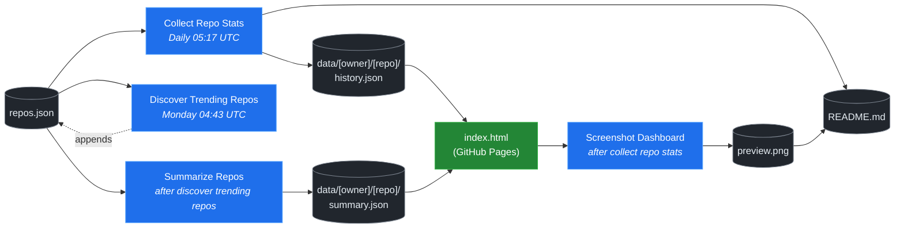

# 🚀 Rising Repos Tracker

> Automatically tracks daily GitHub stats (stars, forks, issues, velocity) for rising open source repos.

[](https://www.telosignal.com/)


**[→ View Live Dashboard](https://patrick-creates.github.io/rising-repos-tracker/)**

Built and maintained by [Telosignal](https://www.telosignal.com/).


<!-- AUTOGEN-STATS-START -->
## 📊 Current snapshot

> Auto-updated daily — last refreshed 2026-08-05

| Metric | Value |
|---|---|
| Repos tracked | **179** |
| Total stars | **8,505,116** |
| Total forks | **1,274,116** |
| Fastest growing | **ai-agent-book** (+1519.1/day) |

### 🔥 Top 5 by velocity

| # | Repo | Stars | Stars/day |
|---|---|---:|---:|
| 1 | [bojieli/ai-agent-book](https://github.com/bojieli/ai-agent-book) | 32,258 | +1519.1 |
| 2 | [DietrichGebert/ponytail](https://github.com/DietrichGebert/ponytail) | 96,203 | +1095.1 |
| 3 | [diegosouzapw/OmniRoute](https://github.com/diegosouzapw/OmniRoute) | 40,002 | +928.3 |
| 4 | [NousResearch/hermes-agent](https://github.com/NousResearch/hermes-agent) | 225,688 | +924.3 |
| 5 | [stablyai/orca](https://github.com/stablyai/orca) | 37,691 | +836.9 |

### 🆕 Recently added

- [herdrdev/herdr](https://github.com/herdrdev/herdr) — added 2026-08-03 — the runtime your coding agents live on
- [composio-community/awesome-codex-skills](https://github.com/composio-community/awesome-codex-skills) — added 2026-08-03 — A curated list of practical Codex skills for automating workflows across the Codex CLI and API.
- [NanmiCoder/cc-haha](https://github.com/NanmiCoder/cc-haha) — added 2026-08-03 — Local-first cross-platform desktop workspace for Claude Code / agents: multi-agent, Git worktrees, code diffs, skill marketplace, multi-model, Computer Use, task-aware desktop pets, with WeChat, Feishu, DingTalk, Telegram, WhatsApp and H5 access.
<!-- AUTOGEN-STATS-END -->

<!-- AUTOGEN-DIAGRAM-START -->
## 🔄 How it works


```mermaid
graph LR
    repos[("repos.json")]:::data
    history[("data/[owner]/[repo]/<br/>history.json")]:::data
    summary[("data/[owner]/[repo]/<br/>summary.json")]:::data
    readme[("README.md")]:::data
    preview[("preview.png")]:::data
    dashboard["index.html<br/>(GitHub Pages)"]:::output
    collect_yml["Collect Repo Stats<br/><i>Daily 05:17 UTC</i>"]:::workflow
    discover_yml["Discover Trending Repos<br/><i>Monday 04:43 UTC</i>"]:::workflow
    screenshot_yml["Screenshot Dashboard<br/><i>after collect repo stats</i>"]:::workflow
    summarize_yml["Summarize Repos<br/><i>after discover trending repos</i>"]:::workflow
    repos --> collect_yml
    collect_yml --> history
    collect_yml --> readme
    repos --> discover_yml
    discover_yml -.->|appends| repos
    dashboard --> screenshot_yml
    screenshot_yml --> preview
    repos --> summarize_yml
    summarize_yml --> summary
    history --> dashboard
    summary --> dashboard
    preview --> readme
    classDef workflow fill:#1f6feb,stroke:#58a6ff,color:#fff
    classDef data fill:#21262d,stroke:#7d8590,color:#e6edf3
    classDef output fill:#238636,stroke:#3fb950,color:#fff
```
<!-- AUTOGEN-DIAGRAM-END -->

<!-- AUTOGEN-WORKFLOWS-START -->
## ⚙️ Workflows

| File | Schedule | Name |
|---|---|---|
| `collect.yml` | Daily 05:17 UTC | Collect Repo Stats |
| `discover.yml` | Monday 04:43 UTC | Discover Trending Repos |
| `screenshot.yml` | After Collect Repo Stats | Screenshot Dashboard |
| `summarize.yml` | After Discover Trending Repos | Summarize Repos |

> All workflows commit results directly back to the repo. Schedules are best-effort — GitHub Actions cron can drift by a few minutes.
<!-- AUTOGEN-WORKFLOWS-END -->

<!-- AUTOGEN-REPOS-START -->
## 📋 All tracked repos

| Repo | Stars | Forks | Stars/day |
|---|---:|---:|---:|
| [openclaw/openclaw](https://github.com/openclaw/openclaw) | 385,184 | 80,969 | +163.3 |
| [obra/superpowers](https://github.com/obra/superpowers) | 266,756 | 23,848 | +708.6 |
| [affaan-m/everything-claude-code](https://github.com/affaan-m/everything-claude-code) | 237,803 | 36,122 | +675.7 |
| [affaan-m/ECC](https://github.com/affaan-m/ECC) | 237,803 | 36,122 | +633.0 |
| [NousResearch/hermes-agent](https://github.com/NousResearch/hermes-agent) | 225,688 | 43,859 | +924.3 |
| [Significant-Gravitas/AutoGPT](https://github.com/Significant-Gravitas/AutoGPT) | 185,824 | 46,050 | +18.4 |
| [microsoft/markitdown](https://github.com/microsoft/markitdown) | 171,563 | 12,492 | +578.0 |
| [f/prompts.chat](https://github.com/f/prompts.chat) | 166,757 | 21,534 | +54.6 |
| [langgenius/dify](https://github.com/langgenius/dify) | 151,395 | 23,900 | +121.1 |
| [open-webui/open-webui](https://github.com/open-webui/open-webui) | 147,892 | 21,511 | +131.0 |
| [langchain-ai/langchain](https://github.com/langchain-ai/langchain) | 143,459 | 23,895 | +81.2 |
| [github/spec-kit](https://github.com/github/spec-kit) | 125,368 | 11,201 | +327.5 |
| [farion1231/cc-switch](https://github.com/farion1231/cc-switch) | 124,551 | 8,451 | +639.3 |
| [microsoft/generative-ai-for-beginners](https://github.com/microsoft/generative-ai-for-beginners) | 116,479 | 61,601 | +68.2 |
| [nextlevelbuilder/ui-ux-pro-max-skill](https://github.com/nextlevelbuilder/ui-ux-pro-max-skill) | 113,585 | 12,144 | +424.9 |
| [Graphify-Labs/graphify](https://github.com/Graphify-Labs/graphify) | 102,704 | 9,967 | +667.3 |
| [DietrichGebert/ponytail](https://github.com/DietrichGebert/ponytail) | 96,203 | 5,279 | +1095.1 |
| [JuliusBrussee/caveman](https://github.com/JuliusBrussee/caveman) | 95,908 | 5,509 | +435.4 |
| [thedotmack/claude-mem](https://github.com/thedotmack/claude-mem) | 89,632 | 7,805 | +169.7 |
| [ChatGPTNextWeb/NextChat](https://github.com/ChatGPTNextWeb/NextChat) | 88,590 | 59,336 | +7.0 |
| [ruvnet/RuView](https://github.com/ruvnet/RuView) | 88,557 | 11,779 | +314.8 |
| [vllm-project/vllm](https://github.com/vllm-project/vllm) | 88,226 | 20,305 | +99.3 |
| [nexu-io/open-design](https://github.com/nexu-io/open-design) | 83,766 | 9,727 | +501.2 |
| [OpenHands/OpenHands](https://github.com/OpenHands/OpenHands) | 83,148 | 10,719 | +116.7 |
| [lobehub/lobehub](https://github.com/lobehub/lobehub) | 81,280 | 15,767 | +51.0 |
| [koala73/worldmonitor](https://github.com/koala73/worldmonitor) | 78,927 | 11,793 | +310.9 |
| [dair-ai/Prompt-Engineering-Guide](https://github.com/dair-ai/Prompt-Engineering-Guide) | 77,271 | 8,491 | +32.5 |
| [openai/openai-cookbook](https://github.com/openai/openai-cookbook) | 75,107 | 12,694 | +19.0 |
| [rtk-ai/rtk](https://github.com/rtk-ai/rtk) | 74,792 | 4,702 | +319.2 |
| [shareAI-lab/learn-claude-code](https://github.com/shareAI-lab/learn-claude-code) | 73,267 | 11,888 | +154.3 |
| [Leonxlnx/taste-skill](https://github.com/Leonxlnx/taste-skill) | 72,126 | 4,948 | +641.7 |
| [ComposioHQ/awesome-claude-skills](https://github.com/ComposioHQ/awesome-claude-skills) | 71,818 | 8,119 | +144.7 |
| [datawhalechina/hello-agents](https://github.com/datawhalechina/hello-agents) | 70,913 | 8,833 | +256.4 |
| [unslothai/unsloth](https://github.com/unslothai/unsloth) | 69,591 | 6,279 | +64.4 |
| [code-yeongyu/oh-my-openagent](https://github.com/code-yeongyu/oh-my-openagent) | 67,263 | 5,489 | +113.1 |
| [Panniantong/Agent-Reach](https://github.com/Panniantong/Agent-Reach) | 66,650 | 5,526 | +744.4 |
| [xtekky/gpt4free](https://github.com/xtekky/gpt4free) | 66,525 | 13,534 | +3.6 |
| [chopratejas/headroom](https://github.com/chopratejas/headroom) | 64,874 | 4,935 | +719.8 |
| [headroomlabs-ai/headroom](https://github.com/headroomlabs-ai/headroom) | 64,874 | 4,935 | +431.2 |
| [shanraisshan/claude-code-best-practice](https://github.com/shanraisshan/claude-code-best-practice) | 64,020 | 6,373 | +133.2 |
| [Fission-AI/OpenSpec](https://github.com/Fission-AI/OpenSpec) | 63,843 | 4,407 | +190.6 |
| [santifer/career-ops](https://github.com/santifer/career-ops) | 62,831 | 12,382 | +222.6 |
| [asgeirtj/system_prompts_leaks](https://github.com/asgeirtj/system_prompts_leaks) | 62,341 | 10,229 | +277.9 |
| [tw93/Pake](https://github.com/tw93/Pake) | 60,463 | 12,317 | +147.9 |
| [ZhuLinsen/daily_stock_analysis](https://github.com/ZhuLinsen/daily_stock_analysis) | 60,119 | 51,442 | +295.6 |
| [MemPalace/mempalace](https://github.com/MemPalace/mempalace) | 58,081 | 7,465 | +71.9 |
| [mvanhorn/last30days-skill](https://github.com/mvanhorn/last30days-skill) | 57,294 | 4,947 | +424.5 |
| [BerriAI/litellm](https://github.com/BerriAI/litellm) | 55,586 | 10,330 | +103.8 |
| [FlowiseAI/Flowise](https://github.com/FlowiseAI/Flowise) | 55,167 | 24,836 | +28.7 |
| [ggml-org/whisper.cpp](https://github.com/ggml-org/whisper.cpp) | 52,586 | 6,022 | +34.9 |
| [hesreallyhim/awesome-claude-code](https://github.com/hesreallyhim/awesome-claude-code) | 51,681 | 4,501 | +96.0 |
| [jamiepine/voicebox](https://github.com/jamiepine/voicebox) | 49,242 | 6,052 | +311.1 |
| [usestrix/strix](https://github.com/usestrix/strix) | 48,545 | 5,123 | +351.3 |
| [ChromeDevTools/chrome-devtools-mcp](https://github.com/ChromeDevTools/chrome-devtools-mcp) | 48,544 | 3,357 | +109.6 |
| [Aider-AI/aider](https://github.com/Aider-AI/aider) | 47,948 | 4,818 | +37.8 |
| [elder-plinius/CL4R1T4S](https://github.com/elder-plinius/CL4R1T4S) | 46,696 | 9,513 | +153.0 |
| [HKUDS/nanobot](https://github.com/HKUDS/nanobot) | 46,640 | 8,252 | +50.1 |
| [zhayujie/CowAgent](https://github.com/zhayujie/CowAgent) | 46,328 | 10,295 | +22.4 |
| [router-for-me/CLIProxyAPI](https://github.com/router-for-me/CLIProxyAPI) | 46,216 | 7,185 | +159.3 |
| [rohitg00/ai-engineering-from-scratch](https://github.com/rohitg00/ai-engineering-from-scratch) | 45,967 | 7,923 | +301.6 |
| [calesthio/OpenMontage](https://github.com/calesthio/OpenMontage) | 45,188 | 5,569 | +468.6 |
| [sickn33/antigravity-awesome-skills](https://github.com/sickn33/antigravity-awesome-skills) | 44,464 | 6,533 | +80.4 |
| [sickn33/agentic-awesome-skills](https://github.com/sickn33/agentic-awesome-skills) | 44,464 | 6,533 | +61.8 |
| [QuantumNous/new-api](https://github.com/QuantumNous/new-api) | 44,381 | 10,439 | +125.3 |
| [kepano/obsidian-skills](https://github.com/kepano/obsidian-skills) | 44,116 | 3,150 | +157.4 |
| [coreyhaines31/marketingskills](https://github.com/coreyhaines31/marketingskills) | 43,041 | 6,780 | +178.5 |
| [danny-avila/LibreChat](https://github.com/danny-avila/LibreChat) | 41,681 | 8,600 | +58.5 |
| [chatboxai/chatbox](https://github.com/chatboxai/chatbox) | 41,318 | 4,185 | +16.7 |
| [Imbad0202/academic-research-skills](https://github.com/Imbad0202/academic-research-skills) | 40,951 | 3,267 | +139.7 |
| [Hmbown/CodeWhale](https://github.com/Hmbown/CodeWhale) | 40,466 | 3,497 | +80.5 |
| [diegosouzapw/OmniRoute](https://github.com/diegosouzapw/OmniRoute) | 40,002 | 5,282 | +928.3 |
| [chatanywhere/GPT_API_free](https://github.com/chatanywhere/GPT_API_free) | 39,748 | 2,677 | +22.1 |
| [heygen-com/hyperframes](https://github.com/heygen-com/hyperframes) | 39,541 | 3,739 | +241.0 |
| [mindsdb/mindshub](https://github.com/mindsdb/mindshub) | 39,517 | 6,224 | +5.0 |
| [langchain-ai/langgraph](https://github.com/langchain-ai/langgraph) | 38,928 | 6,556 | +79.7 |
| [AstrBotDevs/AstrBot](https://github.com/AstrBotDevs/AstrBot) | 38,615 | 2,763 | +77.3 |
| [wshobson/agents](https://github.com/wshobson/agents) | 38,502 | 4,116 | +35.6 |
| [Yeachan-Heo/oh-my-claudecode](https://github.com/Yeachan-Heo/oh-my-claudecode) | 38,346 | 3,454 | +48.9 |
| [google/langextract](https://github.com/google/langextract) | 37,974 | 2,644 | +19.7 |
| [stablyai/orca](https://github.com/stablyai/orca) | 37,691 | 2,663 | +836.9 |
| [DeusData/codebase-memory-mcp](https://github.com/DeusData/codebase-memory-mcp) | 37,522 | 2,983 | +456.5 |
| [github/awesome-copilot](https://github.com/github/awesome-copilot) | 37,458 | 4,708 | +50.7 |
| [songquanpeng/one-api](https://github.com/songquanpeng/one-api) | 36,202 | 6,779 | +27.7 |
| [PDFMathTranslate/PDFMathTranslate](https://github.com/PDFMathTranslate/PDFMathTranslate) | 35,961 | 3,212 | +27.0 |
| [agentscope-ai/QwenPaw](https://github.com/agentscope-ai/QwenPaw) | 33,169 | 2,942 | +301.8 |
| [anthropics/claude-plugins-official](https://github.com/anthropics/claude-plugins-official) | 33,082 | 3,735 | +62.6 |
| [zeroclaw-labs/zeroclaw](https://github.com/zeroclaw-labs/zeroclaw) | 32,510 | 4,869 | +12.8 |
| [bojieli/ai-agent-book](https://github.com/bojieli/ai-agent-book) | 32,258 | 3,448 | +1519.1 |
| [iOfficeAI/AionUi](https://github.com/iOfficeAI/AionUi) | 31,442 | 3,183 | +63.0 |
| [AlexsJones/llmfit](https://github.com/AlexsJones/llmfit) | 31,142 | 1,909 | +63.7 |
| [esengine/DeepSeek-Reasonix](https://github.com/esengine/DeepSeek-Reasonix) | 31,057 | 1,997 | +198.8 |
| [JCodesMore/ai-website-cloner-template](https://github.com/JCodesMore/ai-website-cloner-template) | 31,002 | 4,464 | +274.7 |
| [Gitlawb/openclaude](https://github.com/Gitlawb/openclaude) | 30,520 | 8,898 | +36.7 |
| [googleworkspace/cli](https://github.com/googleworkspace/cli) | 30,205 | 1,766 | +53.6 |
| [MadsLorentzen/ai-job-search](https://github.com/MadsLorentzen/ai-job-search) | 29,817 | 10,111 | +358.0 |
| [HKUDS/Vibe-Trading](https://github.com/HKUDS/Vibe-Trading) | 29,708 | 4,787 | +404.6 |
| [voideditor/void](https://github.com/voideditor/void) | 28,861 | 2,606 | +0.9 |
| [tirth8205/code-review-graph](https://github.com/tirth8205/code-review-graph) | 28,540 | 2,649 | +196.6 |
| [alibaba/page-agent](https://github.com/alibaba/page-agent) | 28,442 | 2,513 | +193.8 |
| [volcengine/OpenViking](https://github.com/volcengine/OpenViking) | 27,935 | 2,195 | +44.9 |
| [jackwener/OpenCLI](https://github.com/jackwener/OpenCLI) | 27,732 | 2,727 | +67.8 |
| [BloopAI/vibe-kanban](https://github.com/BloopAI/vibe-kanban) | 27,668 | 2,937 | +14.7 |
| [langchain-ai/deepagents](https://github.com/langchain-ai/deepagents) | 27,340 | 3,821 | +54.9 |
| [mukul975/Anthropic-Cybersecurity-Skills](https://github.com/mukul975/Anthropic-Cybersecurity-Skills) | 27,296 | 3,299 | +208.5 |
| [p-e-w/heretic](https://github.com/p-e-w/heretic) | 27,121 | 2,932 | +54.3 |
| [jarrodwatts/claude-hud](https://github.com/jarrodwatts/claude-hud) | 27,109 | 1,258 | +41.7 |
| [rohitg00/agentmemory](https://github.com/rohitg00/agentmemory) | 26,562 | 2,249 | +81.7 |
| [zai-org/Open-AutoGLM](https://github.com/zai-org/Open-AutoGLM) | 25,952 | 4,017 | +8.4 |
| [manaflow-ai/cmux](https://github.com/manaflow-ai/cmux) | 25,612 | 2,147 | +54.6 |
| [iOfficeAI/OfficeCLI](https://github.com/iOfficeAI/OfficeCLI) | 25,600 | 1,716 | +573.4 |
| [toon-format/toon](https://github.com/toon-format/toon) | 25,075 | 1,112 | +10.0 |
| [decolua/9router](https://github.com/decolua/9router) | 24,684 | 4,338 | +139.5 |
| [herdrdev/herdr](https://github.com/herdrdev/herdr) | 24,478 | 1,710 | +344.5 |
| [ogulcancelik/herdr](https://github.com/ogulcancelik/herdr) | 24,477 | 1,710 | +402.7 |
| [winfunc/opcode](https://github.com/winfunc/opcode) | 22,351 | 1,722 | +6.0 |
| [can1357/oh-my-pi](https://github.com/can1357/oh-my-pi) | 21,991 | 2,088 | +181.7 |
| [coze-dev/coze-studio](https://github.com/coze-dev/coze-studio) | 21,330 | 3,099 | +6.6 |
| [NirDiamant/agents-towards-production](https://github.com/NirDiamant/agents-towards-production) | 21,238 | 2,817 | +10.4 |
| [steipete/CodexBar](https://github.com/steipete/CodexBar) | 19,660 | 1,643 | +101.3 |
| [mksglu/context-mode](https://github.com/mksglu/context-mode) | 19,633 | 1,403 | +42.5 |
| [Tencent/WeKnora](https://github.com/Tencent/WeKnora) | 19,378 | 2,758 | +60.5 |
| [tanweai/pua](https://github.com/tanweai/pua) | 19,214 | 1,170 | +19.0 |
| [KKKKhazix/khazix-skills](https://github.com/KKKKhazix/khazix-skills) | 19,163 | 2,111 | +106.6 |
| [alibaba/open-code-review](https://github.com/alibaba/open-code-review) | 18,915 | 1,284 | +297.6 |
| [jnMetaCode/agency-agents-zh](https://github.com/jnMetaCode/agency-agents-zh) | 18,811 | 3,104 | +77.4 |
| [datawhalechina/easy-vibe](https://github.com/datawhalechina/easy-vibe) | 18,753 | 1,778 | +35.5 |
| [pranshuparmar/witr](https://github.com/pranshuparmar/witr) | 18,637 | 596 | +16.4 |
| [jundot/omlx](https://github.com/jundot/omlx) | 18,453 | 1,587 | +35.7 |
| [RightNow-AI/openfang](https://github.com/RightNow-AI/openfang) | 18,076 | 2,283 | +4.9 |
| [microsoft/agent-lightning](https://github.com/microsoft/agent-lightning) | 17,451 | 1,528 | +2.7 |
| [danielmiessler/LifeOS](https://github.com/danielmiessler/LifeOS) | 17,156 | 2,321 | +24.8 |
| [nesquena/hermes-webui](https://github.com/nesquena/hermes-webui) | 16,962 | 2,318 | +48.3 |
| [browser-use/browser-harness](https://github.com/browser-use/browser-harness) | 16,486 | 1,563 | +27.2 |
| [cft0808/edict](https://github.com/cft0808/edict) | 16,324 | 1,709 | +5.1 |
| [1jehuang/jcode](https://github.com/1jehuang/jcode) | 15,948 | 1,758 | +332.3 |
| [MemoriLabs/Memori](https://github.com/MemoriLabs/Memori) | 15,680 | 2,881 | +7.7 |
| [composio-community/awesome-codex-skills](https://github.com/composio-community/awesome-codex-skills) | 15,610 | 1,511 | +22.5 |
| [Anionex/banana-slides](https://github.com/Anionex/banana-slides) | 15,387 | 1,776 | +6.0 |
| [xpzouying/xiaohongshu-mcp](https://github.com/xpzouying/xiaohongshu-mcp) | 15,076 | 2,212 | +17.9 |
| [xbtlin/ai-berkshire](https://github.com/xbtlin/ai-berkshire) | 15,023 | 2,203 | +141.5 |
| [kyegomez/OpenMythos](https://github.com/kyegomez/OpenMythos) | 14,777 | 3,295 | +14.1 |
| [yusufkaraaslan/Skill_Seekers](https://github.com/yusufkaraaslan/Skill_Seekers) | 14,701 | 1,489 | +10.8 |
| [TencentCloud/TencentDB-Agent-Memory](https://github.com/TencentCloud/TencentDB-Agent-Memory) | 14,300 | 1,315 | +242.7 |
| [wanshuiyin/Auto-claude-code-research-in-sleep](https://github.com/wanshuiyin/Auto-claude-code-research-in-sleep) | 14,262 | 1,260 | +40.2 |
| [NevaMind-AI/memU](https://github.com/NevaMind-AI/memU) | 14,257 | 1,055 | +8.1 |
| [NanmiCoder/cc-haha](https://github.com/NanmiCoder/cc-haha) | 13,916 | 8,523 | +20.0 |
| [t8y2/dbx](https://github.com/t8y2/dbx) | 13,267 | 1,347 | +158.9 |
| [superset-sh/superset](https://github.com/superset-sh/superset) | 12,778 | 1,158 | +16.7 |
| [XiaomiMiMo/MiMo-Code](https://github.com/XiaomiMiMo/MiMo-Code) | 12,644 | 1,292 | +43.8 |
| [sirmalloc/ccstatusline](https://github.com/sirmalloc/ccstatusline) | 12,232 | 535 | +25.7 |
| [EverMind-AI/EverOS](https://github.com/EverMind-AI/EverOS) | 11,820 | 879 | +56.9 |
| [walkinglabs/learn-harness-engineering](https://github.com/walkinglabs/learn-harness-engineering) | 11,007 | 1,194 | +37.4 |
| [ValueCell-ai/valuecell](https://github.com/ValueCell-ai/valuecell) | 10,959 | 1,812 | +2.4 |
| [aden-hive/hive](https://github.com/aden-hive/hive) | 10,859 | 5,673 | +6.7 |
| [0x4m4/hexstrike-ai](https://github.com/0x4m4/hexstrike-ai) | 10,813 | 2,252 | +21.7 |
| [MemTensor/MemOS](https://github.com/MemTensor/MemOS) | 10,594 | 976 | +15.3 |
| [brokermr810/QuantDinger](https://github.com/brokermr810/QuantDinger) | 10,264 | 2,151 | +32.7 |
| [OpenByteInc/QuantDinger](https://github.com/OpenByteInc/QuantDinger) | 10,264 | 2,151 | +28.9 |
| [Kuberwastaken/claurst](https://github.com/Kuberwastaken/claurst) | 10,178 | 7,787 | +8.4 |
| [ConardLi/garden-skills](https://github.com/ConardLi/garden-skills) | 10,062 | 1,329 | +29.4 |
| [EKKOLearnAI/hermes-studio](https://github.com/EKKOLearnAI/hermes-studio) | 9,757 | 1,199 | +29.9 |
| [frankbria/ralph-claude-code](https://github.com/frankbria/ralph-claude-code) | 9,584 | 725 | +5.6 |
| [ykdojo/claude-code-tips](https://github.com/ykdojo/claude-code-tips) | 9,545 | 756 | +17.6 |
| [iflytek/astron-agent](https://github.com/iflytek/astron-agent) | 9,287 | 873 | +22.6 |
| [StarTrail-org/PixelRAG](https://github.com/StarTrail-org/PixelRAG) | 9,139 | 776 | +111.0 |
| [getagentseal/codeburn](https://github.com/getagentseal/codeburn) | 9,137 | 717 | +22.2 |
| [EvoMap/evolver](https://github.com/EvoMap/evolver) | 8,934 | 827 | +2.6 |
| [openai/codex-security](https://github.com/openai/codex-security) | 8,554 | 592 | +136.0 |
| [MiroMindAI/MiroThinker](https://github.com/MiroMindAI/MiroThinker) | 8,365 | 644 | +1.3 |
| [modem-dev/hunk](https://github.com/modem-dev/hunk) | 8,093 | 235 | +60.3 |
| [mmulet/term.everything](https://github.com/mmulet/term.everything) | 8,057 | 192 | +1.1 |
| [ValueCell-ai/ClawX](https://github.com/ValueCell-ai/ClawX) | 7,565 | 1,130 | +1.0 |
| [opensquilla/opensquilla](https://github.com/opensquilla/opensquilla) | 6,529 | 498 | +20.0 |
| [steipete/summarize](https://github.com/steipete/summarize) | 6,514 | 439 | +4.5 |
| [Arthur-Ficial/apfel](https://github.com/Arthur-Ficial/apfel) | 6,253 | 240 | +6.0 |
| [Andyyyy64/whichllm](https://github.com/Andyyyy64/whichllm) | 6,136 | 325 | +16.8 |
| [microsoft/fara](https://github.com/microsoft/fara) | 6,120 | 598 | +5.3 |
| [UfoMiao/zcf](https://github.com/UfoMiao/zcf) | 6,076 | 425 | +0.3 |
| [re4/LibreCode](https://github.com/re4/LibreCode) | 81 | 4 | — |
<!-- AUTOGEN-REPOS-END -->

---

## What it does

- Collects daily snapshots of stars, forks, watchers and open issues for every tracked repo
- Discovers new trending repos automatically every Monday using the GitHub Search API
- Generates AI summaries (use cases, similar tools, tags) for each tracked repo via GitHub Models
- Stores all history as plain JSON — no database, no backend
- Renders a live dashboard via GitHub Pages — updates daily, zero maintenance

## Tracked repos

Data lives in [`data/`](./data) — one folder per repo, one `history.json` per entry.  
The full watch list is in [`repos.json`](./repos.json).

## Fork & use it for yourself

This is my personal tracker — the watch list reflects what I find interesting. If you want to track different repos, the best path is to **fork this repo and run your own**.

### Setup

1. Fork this repo to your account
2. Replace the contents of [`repos.json`](./repos.json) with the repos you want to track (or just leave one entry — `discover.yml` will auto-add more every Monday)
3. Go to **Settings → Pages** and enable GitHub Pages from the `main` branch
4. Go to **Actions** and run **Collect Repo Stats** once manually to seed your first data point
5. Your dashboard will be live at `https://YOUR-USERNAME.github.io/rising-repos-tracker/`

That's it — daily collection and weekly discovery run automatically on schedule. Zero ongoing maintenance.

### Customizing what gets discovered

Edit [`scripts/discover.js`](./scripts/discover.js) to change:

- `MIN_STARS` — minimum star threshold for candidates
- `MAX_AGE_DAYS` — how recent a repo must be
- `MAX_NEW_REPOS` — how many to add per discovery run
- The `queries` array — GitHub Search API queries that define what "trending" means to you

### Adding a repo manually

Just edit `repos.json` directly:

```json
{
  "owner": "OWNER",
  "repo": "REPO",
  "added": "YYYY-MM-DD",
  "notes": "why you're tracking this"
}
```

The next daily collect run picks it up automatically.

## Stack

- **GitHub Actions** — scheduling and automation
- **GitHub Pages** — dashboard hosting
- **GitHub API** — data source
- **GitHub Models** — free AI summaries (gpt-4o-mini)
- **Chart.js** — star growth visualization
- **Mermaid** — architecture diagram (rendered by GitHub)
- No dependencies, no build step, no database

## License

MIT
