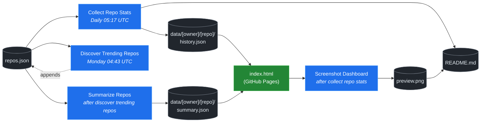

# 🚀 Rising Repos Tracker

> Automatically tracks daily GitHub stats (stars, forks, issues, velocity) for rising open source repos.

[](https://www.telosignal.com/)


**[→ View Live Dashboard](https://patrick-creates.github.io/rising-repos-tracker/)**

Built and maintained by [Telosignal](https://www.telosignal.com/).


<!-- AUTOGEN-STATS-START -->
## 📊 Current snapshot

> Auto-updated daily — last refreshed 2026-09-07

| Metric | Value |
|---|---|
| Repos tracked | **194** |
| Total stars | **9,476,823** |
| Total forks | **1,394,247** |
| Fastest growing | **ponytail** (+1067.7/day) |

### 🔥 Top 5 by velocity

| # | Repo | Stars | Stars/day |
|---|---|---:|---:|
| 1 | [DietrichGebert/ponytail](https://github.com/DietrichGebert/ponytail) | 130,232 | +1067.7 |
| 2 | [NousResearch/hermes-agent](https://github.com/NousResearch/hermes-agent) | 242,821 | +810.1 |
| 3 | [stablyai/orca](https://github.com/stablyai/orca) | 63,131 | +802.3 |
| 4 | [diegosouzapw/OmniRoute](https://github.com/diegosouzapw/OmniRoute) | 62,217 | +794.7 |
| 5 | [bojieli/ai-agent-book](https://github.com/bojieli/ai-agent-book) | 45,058 | +757.2 |

### 🆕 Recently added

- [career-ops-hq/career-ops](https://github.com/career-ops-hq/career-ops) — added 2026-09-07 — Open-source AI job search: scan job portals, evaluate listings into a structured A-H report with a global 1-5 score, tailor your CV, track applications — runs locally in your AI coding CLI (Claude Code, Codex, OpenCode, Antigravity…)
- [K-Dense-AI/scientific-agent-skills](https://github.com/K-Dense-AI/scientific-agent-skills) — added 2026-09-07 — Turn any AI agent into an AI Scientist. The #1 Agent Skills library for science, used by 190,000+ scientists worldwide. 165 ready-to-use validated skills plus 100+ scientific databases covering biology, chemistry, medicine, and drug discovery. Compatible with Cursor, Claude Code, Codex, Pi, Antigravity, and the open Agent Skills standard.
- [Hmbown/Codewhale](https://github.com/Hmbown/Codewhale) — added 2026-09-07 — Open-source coding agent for your terminal, built in Rust and on a journey of continuous community improvement. Issues and PRs welcome.
<!-- AUTOGEN-STATS-END -->

<!-- AUTOGEN-DIAGRAM-START -->
## 🔄 How it works


```mermaid
graph LR
    repos[("repos.json")]:::data
    history[("data/[owner]/[repo]/<br/>history.json")]:::data
    summary[("data/[owner]/[repo]/<br/>summary.json")]:::data
    readme[("README.md")]:::data
    preview[("preview.png")]:::data
    dashboard["index.html<br/>(GitHub Pages)"]:::output
    collect_yml["Collect Repo Stats<br/><i>Daily 05:17 UTC</i>"]:::workflow
    discover_yml["Discover Trending Repos<br/><i>Monday 04:43 UTC</i>"]:::workflow
    screenshot_yml["Screenshot Dashboard<br/><i>after collect repo stats</i>"]:::workflow
    summarize_yml["Summarize Repos<br/><i>after discover trending repos</i>"]:::workflow
    repos --> collect_yml
    collect_yml --> history
    collect_yml --> readme
    repos --> discover_yml
    discover_yml -.->|appends| repos
    dashboard --> screenshot_yml
    screenshot_yml --> preview
    repos --> summarize_yml
    summarize_yml --> summary
    history --> dashboard
    summary --> dashboard
    preview --> readme
    classDef workflow fill:#1f6feb,stroke:#58a6ff,color:#fff
    classDef data fill:#21262d,stroke:#7d8590,color:#e6edf3
    classDef output fill:#238636,stroke:#3fb950,color:#fff
```
<!-- AUTOGEN-DIAGRAM-END -->

<!-- AUTOGEN-WORKFLOWS-START -->
## ⚙️ Workflows

| File | Schedule | Name |
|---|---|---|
| `collect.yml` | Daily 05:17 UTC | Collect Repo Stats |
| `discover.yml` | Monday 04:43 UTC | Discover Trending Repos |
| `screenshot.yml` | After Collect Repo Stats | Screenshot Dashboard |
| `summarize.yml` | After Discover Trending Repos | Summarize Repos |

> All workflows commit results directly back to the repo. Schedules are best-effort — GitHub Actions cron can drift by a few minutes.
<!-- AUTOGEN-WORKFLOWS-END -->

<!-- AUTOGEN-REPOS-START -->
## 📋 All tracked repos

| Repo | Stars | Forks | Stars/day |
|---|---:|---:|---:|
| [openclaw/openclaw](https://github.com/openclaw/openclaw) | 389,085 | 81,758 | +150.5 |
| [obra/superpowers](https://github.com/obra/superpowers) | 282,613 | 25,326 | +610.9 |
| [affaan-m/everything-claude-code](https://github.com/affaan-m/everything-claude-code) | 252,186 | 37,857 | +608.0 |
| [affaan-m/ECC](https://github.com/affaan-m/ECC) | 252,186 | 37,857 | +571.0 |
| [NousResearch/hermes-agent](https://github.com/NousResearch/hermes-agent) | 242,821 | 49,944 | +810.1 |
| [Significant-Gravitas/AutoGPT](https://github.com/Significant-Gravitas/AutoGPT) | 187,178 | 46,039 | +24.8 |
| [microsoft/markitdown](https://github.com/microsoft/markitdown) | 179,150 | 13,202 | +479.8 |
| [f/prompts.chat](https://github.com/f/prompts.chat) | 169,543 | 21,809 | +63.0 |
| [langgenius/dify](https://github.com/langgenius/dify) | 154,708 | 24,458 | +115.2 |
| [open-webui/open-webui](https://github.com/open-webui/open-webui) | 151,190 | 22,104 | +122.2 |
| [langchain-ai/langchain](https://github.com/langchain-ai/langchain) | 145,842 | 24,362 | +78.7 |
| [github/spec-kit](https://github.com/github/spec-kit) | 133,790 | 12,040 | +307.1 |
| [farion1231/cc-switch](https://github.com/farion1231/cc-switch) | 131,475 | 9,053 | +512.8 |
| [DietrichGebert/ponytail](https://github.com/DietrichGebert/ponytail) | 130,232 | 6,978 | +1067.7 |
| [nextlevelbuilder/ui-ux-pro-max-skill](https://github.com/nextlevelbuilder/ui-ux-pro-max-skill) | 125,655 | 13,443 | +408.2 |
| [microsoft/generative-ai-for-beginners](https://github.com/microsoft/generative-ai-for-beginners) | 119,322 | 62,833 | +73.2 |
| [Graphify-Labs/graphify](https://github.com/Graphify-Labs/graphify) | 115,475 | 11,211 | +447.1 |
| [JuliusBrussee/caveman](https://github.com/JuliusBrussee/caveman) | 104,018 | 6,032 | +379.5 |
| [nexu-io/open-design](https://github.com/nexu-io/open-design) | 94,572 | 10,928 | +450.0 |
| [thedotmack/claude-mem](https://github.com/thedotmack/claude-mem) | 93,375 | 8,201 | +153.8 |
| [ruvnet/RuView](https://github.com/ruvnet/RuView) | 92,679 | 12,293 | +255.1 |
| [vllm-project/vllm](https://github.com/vllm-project/vllm) | 91,147 | 21,835 | +96.3 |
| [ChatGPTNextWeb/NextChat](https://github.com/ChatGPTNextWeb/NextChat) | 88,715 | 59,129 | +6.1 |
| [OpenHands/OpenHands](https://github.com/OpenHands/OpenHands) | 86,412 | 11,338 | +111.4 |
| [koala73/worldmonitor](https://github.com/koala73/worldmonitor) | 85,738 | 12,946 | +280.1 |
| [Leonxlnx/taste-skill](https://github.com/Leonxlnx/taste-skill) | 85,004 | 5,825 | +557.1 |
| [lobehub/lobehub](https://github.com/lobehub/lobehub) | 82,284 | 15,861 | +45.2 |
| [rtk-ai/rtk](https://github.com/rtk-ai/rtk) | 79,184 | 5,011 | +264.3 |
| [Panniantong/Agent-Reach](https://github.com/Panniantong/Agent-Reach) | 78,523 | 6,762 | +604.9 |
| [dair-ai/Prompt-Engineering-Guide](https://github.com/dair-ai/Prompt-Engineering-Guide) | 78,073 | 8,575 | +30.1 |
| [datawhalechina/hello-agents](https://github.com/datawhalechina/hello-agents) | 77,467 | 9,625 | +239.3 |
| [shareAI-lab/learn-claude-code](https://github.com/shareAI-lab/learn-claude-code) | 76,247 | 12,266 | +135.4 |
| [openai/openai-cookbook](https://github.com/openai/openai-cookbook) | 75,816 | 12,821 | +19.7 |
| [unslothai/unsloth](https://github.com/unslothai/unsloth) | 75,749 | 6,896 | +100.4 |
| [ComposioHQ/awesome-claude-skills](https://github.com/ComposioHQ/awesome-claude-skills) | 74,614 | 8,598 | +127.0 |
| [santifer/career-ops](https://github.com/santifer/career-ops) | 70,382 | 13,316 | +224.4 |
| [career-ops-hq/career-ops](https://github.com/career-ops-hq/career-ops) | 70,382 | 13,316 | +454.1 |
| [headroomlabs-ai/headroom](https://github.com/headroomlabs-ai/headroom) | 69,209 | 5,365 | +302.7 |
| [chopratejas/headroom](https://github.com/chopratejas/headroom) | 69,208 | 5,365 | +488.6 |
| [code-yeongyu/oh-my-openagent](https://github.com/code-yeongyu/oh-my-openagent) | 68,773 | 5,649 | +93.3 |
| [Fission-AI/OpenSpec](https://github.com/Fission-AI/OpenSpec) | 67,506 | 4,643 | +167.1 |
| [xtekky/gpt4free](https://github.com/xtekky/gpt4free) | 66,650 | 13,515 | +3.7 |
| [shanraisshan/claude-code-best-practice](https://github.com/shanraisshan/claude-code-best-practice) | 65,708 | 6,529 | +109.0 |
| [ZhuLinsen/daily_stock_analysis](https://github.com/ZhuLinsen/daily_stock_analysis) | 64,731 | 54,262 | +246.6 |
| [asgeirtj/system_prompts_leaks](https://github.com/asgeirtj/system_prompts_leaks) | 64,306 | 10,554 | +213.6 |
| [stablyai/orca](https://github.com/stablyai/orca) | 63,131 | 4,207 | +802.3 |
| [diegosouzapw/OmniRoute](https://github.com/diegosouzapw/OmniRoute) | 62,217 | 8,693 | +794.7 |
| [mvanhorn/last30days-skill](https://github.com/mvanhorn/last30days-skill) | 61,484 | 5,371 | +316.6 |
| [tw93/Pake](https://github.com/tw93/Pake) | 61,328 | 12,626 | +112.0 |
| [usestrix/strix](https://github.com/usestrix/strix) | 61,017 | 6,675 | +360.3 |
| [MemPalace/mempalace](https://github.com/MemPalace/mempalace) | 58,895 | 7,546 | +58.0 |
| [BerriAI/litellm](https://github.com/BerriAI/litellm) | 58,199 | 11,228 | +96.5 |
| [calesthio/OpenMontage](https://github.com/calesthio/OpenMontage) | 56,478 | 7,102 | +409.0 |
| [FlowiseAI/Flowise](https://github.com/FlowiseAI/Flowise) | 55,428 | 24,978 | +22.6 |
| [hesreallyhim/awesome-claude-code](https://github.com/hesreallyhim/awesome-claude-code) | 53,632 | 4,670 | +85.2 |
| [ggml-org/whisper.cpp](https://github.com/ggml-org/whisper.cpp) | 53,488 | 6,135 | +32.7 |
| [rohitg00/ai-engineering-from-scratch](https://github.com/rohitg00/ai-engineering-from-scratch) | 52,694 | 9,188 | +268.7 |
| [jamiepine/voicebox](https://github.com/jamiepine/voicebox) | 52,469 | 6,542 | +239.3 |
| [ChromeDevTools/chrome-devtools-mcp](https://github.com/ChromeDevTools/chrome-devtools-mcp) | 51,242 | 3,599 | +101.4 |
| [router-for-me/CLIProxyAPI](https://github.com/router-for-me/CLIProxyAPI) | 50,807 | 7,720 | +153.0 |
| [elder-plinius/CL4R1T4S](https://github.com/elder-plinius/CL4R1T4S) | 49,113 | 10,107 | +121.7 |
| [Aider-AI/aider](https://github.com/Aider-AI/aider) | 48,808 | 4,928 | +34.3 |
| [kepano/obsidian-skills](https://github.com/kepano/obsidian-skills) | 47,967 | 3,430 | +143.7 |
| [HKUDS/nanobot](https://github.com/HKUDS/nanobot) | 47,830 | 8,444 | +46.0 |
| [coreyhaines31/marketingskills](https://github.com/coreyhaines31/marketingskills) | 47,775 | 7,409 | +166.7 |
| [QuantumNous/new-api](https://github.com/QuantumNous/new-api) | 47,498 | 11,350 | +115.6 |
| [zhayujie/CowAgent](https://github.com/zhayujie/CowAgent) | 46,801 | 10,342 | +20.1 |
| [Imbad0202/academic-research-skills](https://github.com/Imbad0202/academic-research-skills) | 46,706 | 3,655 | +167.0 |
| [sickn33/antigravity-awesome-skills](https://github.com/sickn33/antigravity-awesome-skills) | 46,088 | 6,738 | +70.6 |
| [sickn33/agentic-awesome-skills](https://github.com/sickn33/agentic-awesome-skills) | 46,088 | 6,738 | +54.4 |
| [bojieli/ai-agent-book](https://github.com/bojieli/ai-agent-book) | 45,058 | 4,991 | +757.2 |
| [heygen-com/hyperframes](https://github.com/heygen-com/hyperframes) | 44,567 | 4,259 | +208.9 |
| [K-Dense-AI/scientific-agent-skills](https://github.com/K-Dense-AI/scientific-agent-skills) | 43,476 | 3,955 | +135.0 |
| [danny-avila/LibreChat](https://github.com/danny-avila/LibreChat) | 42,882 | 8,880 | +51.6 |
| [DeusData/codebase-memory-mcp](https://github.com/DeusData/codebase-memory-mcp) | 42,524 | 3,471 | +312.8 |
| [chatanywhere/GPT_API_free](https://github.com/chatanywhere/GPT_API_free) | 41,983 | 2,716 | +36.4 |
| [chatboxai/chatbox](https://github.com/chatboxai/chatbox) | 41,675 | 4,233 | +15.0 |
| [langchain-ai/langgraph](https://github.com/langchain-ai/langgraph) | 41,170 | 6,952 | +74.7 |
| [MadsLorentzen/ai-job-search](https://github.com/MadsLorentzen/ai-job-search) | 41,136 | 14,055 | +349.2 |
| [Hmbown/CodeWhale](https://github.com/Hmbown/CodeWhale) | 40,916 | 3,546 | +59.5 |
| [Hmbown/Codewhale](https://github.com/Hmbown/Codewhale) | 40,916 | 3,546 | +177.9 |
| [AstrBotDevs/AstrBot](https://github.com/AstrBotDevs/AstrBot) | 40,141 | 2,882 | +66.9 |
| [mindsdb/mindshub](https://github.com/mindsdb/mindshub) | 39,703 | 6,239 | +5.4 |
| [tinyhumansai/openhuman](https://github.com/tinyhumansai/openhuman) | 39,489 | 3,894 | +197.4 |
| [wshobson/agents](https://github.com/wshobson/agents) | 39,465 | 4,211 | +33.6 |
| [Yeachan-Heo/oh-my-claudecode](https://github.com/Yeachan-Heo/oh-my-claudecode) | 39,042 | 3,499 | +40.2 |
| [github/awesome-copilot](https://github.com/github/awesome-copilot) | 38,715 | 4,904 | +46.8 |
| [google/langextract](https://github.com/google/langextract) | 38,543 | 2,704 | +18.9 |
| [songquanpeng/one-api](https://github.com/songquanpeng/one-api) | 36,768 | 6,854 | +24.4 |
| [PDFMathTranslate/PDFMathTranslate](https://github.com/PDFMathTranslate/PDFMathTranslate) | 36,752 | 3,301 | +26.1 |
| [anthropics/claude-plugins-official](https://github.com/anthropics/claude-plugins-official) | 36,000 | 4,027 | +71.3 |
| [ogulcancelik/herdr](https://github.com/ogulcancelik/herdr) | 35,958 | 2,640 | +374.0 |
| [herdrdev/herdr](https://github.com/herdrdev/herdr) | 35,958 | 2,640 | +347.7 |
| [volcengine/OpenViking](https://github.com/volcengine/OpenViking) | 35,874 | 2,736 | +115.9 |
| [esengine/DeepSeek-Reasonix](https://github.com/esengine/DeepSeek-Reasonix) | 35,434 | 2,375 | +174.8 |
| [agentscope-ai/QwenPaw](https://github.com/agentscope-ai/QwenPaw) | 34,999 | 3,070 | +205.0 |
| [AlexsJones/llmfit](https://github.com/AlexsJones/llmfit) | 34,996 | 2,202 | +81.6 |
| [JCodesMore/ai-website-cloner-template](https://github.com/JCodesMore/ai-website-cloner-template) | 33,976 | 4,965 | +202.2 |
| [HKUDS/Vibe-Trading](https://github.com/HKUDS/Vibe-Trading) | 32,906 | 5,359 | +259.5 |
| [Gitlawb/openclaude](https://github.com/Gitlawb/openclaude) | 32,880 | 9,062 | +48.4 |
| [zeroclaw-labs/zeroclaw](https://github.com/zeroclaw-labs/zeroclaw) | 32,738 | 4,932 | +10.8 |
| [iOfficeAI/AionUi](https://github.com/iOfficeAI/AionUi) | 32,643 | 3,356 | +54.0 |
| [mukul975/Anthropic-Cybersecurity-Skills](https://github.com/mukul975/Anthropic-Cybersecurity-Skills) | 32,331 | 3,899 | +184.5 |
| [tirth8205/code-review-graph](https://github.com/tirth8205/code-review-graph) | 31,228 | 2,843 | +151.4 |
| [p-e-w/heretic](https://github.com/p-e-w/heretic) | 30,779 | 3,409 | +74.8 |
| [googleworkspace/cli](https://github.com/googleworkspace/cli) | 30,765 | 1,803 | +41.3 |
| [iOfficeAI/OfficeCLI](https://github.com/iOfficeAI/OfficeCLI) | 30,174 | 2,062 | +345.7 |
| [can1357/oh-my-pi](https://github.com/can1357/oh-my-pi) | 29,932 | 3,047 | +207.0 |
| [langchain-ai/deepagents](https://github.com/langchain-ai/deepagents) | 29,093 | 4,085 | +54.3 |
| [jackwener/OpenCLI](https://github.com/jackwener/OpenCLI) | 29,048 | 2,848 | +57.7 |
| [alibaba/page-agent](https://github.com/alibaba/page-agent) | 29,002 | 2,601 | +124.3 |
| [virgiliojr94/book-to-skill](https://github.com/virgiliojr94/book-to-skill) | 28,885 | 3,000 | +289.7 |
| [voideditor/void](https://github.com/voideditor/void) | 28,810 | 2,649 | +0.1 |
| [rohitg00/agentmemory](https://github.com/rohitg00/agentmemory) | 28,115 | 2,434 | +69.1 |
| [BloopAI/vibe-kanban](https://github.com/BloopAI/vibe-kanban) | 28,027 | 2,999 | +13.4 |
| [jarrodwatts/claude-hud](https://github.com/jarrodwatts/claude-hud) | 27,861 | 1,293 | +34.8 |
| [decolua/9router](https://github.com/decolua/9router) | 27,316 | 5,019 | +116.0 |
| [manaflow-ai/cmux](https://github.com/manaflow-ai/cmux) | 26,858 | 2,323 | +44.7 |
| [zai-org/Open-AutoGLM](https://github.com/zai-org/Open-AutoGLM) | 26,180 | 4,029 | +7.9 |
| [TencentCloud/TencentDB-Agent-Memory](https://github.com/TencentCloud/TencentDB-Agent-Memory) | 26,049 | 2,431 | +309.5 |
| [toon-format/toon](https://github.com/toon-format/toon) | 25,330 | 1,118 | +9.2 |
| [winfunc/opcode](https://github.com/winfunc/opcode) | 22,394 | 1,724 | +4.3 |
| [pranshuparmar/witr](https://github.com/pranshuparmar/witr) | 22,117 | 772 | +58.4 |
| [alibaba/open-code-review](https://github.com/alibaba/open-code-review) | 22,026 | 1,641 | +191.1 |
| [pascalorg/editor](https://github.com/pascalorg/editor) | 22,012 | 2,842 | +27.2 |
| [Tencent/WeKnora](https://github.com/Tencent/WeKnora) | 21,660 | 3,136 | +63.9 |
| [coze-dev/coze-studio](https://github.com/coze-dev/coze-studio) | 21,554 | 3,115 | +6.7 |
| [jundot/omlx](https://github.com/jundot/omlx) | 21,492 | 1,833 | +57.9 |
| [NirDiamant/agents-towards-production](https://github.com/NirDiamant/agents-towards-production) | 21,420 | 2,844 | +8.6 |
| [guillaumemeyer/watermarks-remover](https://github.com/guillaumemeyer/watermarks-remover) | 21,120 | 2,432 | +254.9 |
| [steipete/CodexBar](https://github.com/steipete/CodexBar) | 21,032 | 1,855 | +75.7 |
| [mksglu/context-mode](https://github.com/mksglu/context-mode) | 20,514 | 1,512 | +36.3 |
| [KKKKhazix/khazix-skills](https://github.com/KKKKhazix/khazix-skills) | 20,482 | 2,189 | +61.7 |
| [jnMetaCode/agency-agents-zh](https://github.com/jnMetaCode/agency-agents-zh) | 20,362 | 3,293 | +64.4 |
| [debpalash/VoiceStudio](https://github.com/debpalash/VoiceStudio) | 20,219 | 2,551 | +134.7 |
| [tanweai/pua](https://github.com/tanweai/pua) | 19,595 | 1,195 | +16.1 |
| [datawhalechina/easy-vibe](https://github.com/datawhalechina/easy-vibe) | 19,299 | 1,849 | +28.1 |
| [1jehuang/jcode](https://github.com/1jehuang/jcode) | 19,260 | 2,214 | +195.6 |
| [danielmiessler/LifeOS](https://github.com/danielmiessler/LifeOS) | 18,918 | 2,453 | +37.0 |
| [t8y2/dbx](https://github.com/t8y2/dbx) | 18,187 | 1,781 | +151.2 |
| [RightNow-AI/openfang](https://github.com/RightNow-AI/openfang) | 18,166 | 2,293 | +4.0 |
| [nesquena/hermes-webui](https://github.com/nesquena/hermes-webui) | 18,133 | 2,540 | +42.8 |
| [microsoft/agent-lightning](https://github.com/microsoft/agent-lightning) | 18,006 | 1,579 | +8.3 |
| [browser-use/browser-harness](https://github.com/browser-use/browser-harness) | 17,411 | 1,695 | +27.6 |
| [jlcodes99/cockpit-tools](https://github.com/jlcodes99/cockpit-tools) | 17,205 | 1,518 | +61.9 |
| [cft0808/edict](https://github.com/cft0808/edict) | 16,847 | 1,764 | +9.3 |
| [MemoriLabs/Memori](https://github.com/MemoriLabs/Memori) | 16,469 | 3,353 | +14.6 |
| [composio-community/awesome-codex-skills](https://github.com/composio-community/awesome-codex-skills) | 16,299 | 1,593 | +21.0 |
| [xbtlin/ai-berkshire](https://github.com/xbtlin/ai-berkshire) | 16,219 | 2,427 | +86.4 |
| [wanshuiyin/Auto-claude-code-research-in-sleep](https://github.com/wanshuiyin/Auto-claude-code-research-in-sleep) | 15,826 | 1,372 | +43.6 |
| [xpzouying/xiaohongshu-mcp](https://github.com/xpzouying/xiaohongshu-mcp) | 15,680 | 2,303 | +18.1 |
| [Anionex/banana-slides](https://github.com/Anionex/banana-slides) | 15,558 | 1,785 | +5.4 |
| [yusufkaraaslan/Skill_Seekers](https://github.com/yusufkaraaslan/Skill_Seekers) | 14,926 | 1,517 | +9.1 |
| [walkinglabs/learn-harness-engineering](https://github.com/walkinglabs/learn-harness-engineering) | 14,905 | 1,484 | +79.7 |
| [kyegomez/OpenMythos](https://github.com/kyegomez/OpenMythos) | 14,888 | 3,292 | +9.5 |
| [NevaMind-AI/memU](https://github.com/NevaMind-AI/memU) | 14,387 | 1,063 | +6.3 |
| [NanmiCoder/cc-haha](https://github.com/NanmiCoder/cc-haha) | 14,290 | 8,538 | +11.8 |
| [superset-sh/superset](https://github.com/superset-sh/superset) | 13,839 | 1,251 | +24.0 |
| [ifixai-ai/iFixAi](https://github.com/ifixai-ai/iFixAi) | 13,125 | 1,283 | +176.9 |
| [XiaomiMiMo/MiMo-Code](https://github.com/XiaomiMiMo/MiMo-Code) | 12,958 | 1,337 | +27.6 |
| [sirmalloc/ccstatusline](https://github.com/sirmalloc/ccstatusline) | 12,793 | 559 | +21.6 |
| [EverMind-AI/EverOS](https://github.com/EverMind-AI/EverOS) | 12,754 | 911 | +43.4 |
| [ConardLi/garden-skills](https://github.com/ConardLi/garden-skills) | 12,227 | 1,479 | +48.3 |
| [0x4m4/hexstrike-ai](https://github.com/0x4m4/hexstrike-ai) | 11,583 | 2,402 | +22.5 |
| [brokermr810/QuantDinger](https://github.com/brokermr810/QuantDinger) | 11,390 | 2,370 | +33.4 |
| [OpenByteInc/QuantDinger](https://github.com/OpenByteInc/QuantDinger) | 11,390 | 2,370 | +32.4 |
| [MemTensor/MemOS](https://github.com/MemTensor/MemOS) | 11,218 | 1,029 | +17.0 |
| [holaboss-ai/holaOS](https://github.com/holaboss-ai/holaOS) | 11,172 | 721 | +133.4 |
| [aden-hive/hive](https://github.com/aden-hive/hive) | 11,021 | 5,666 | +5.8 |
| [ValueCell-ai/valuecell](https://github.com/ValueCell-ai/valuecell) | 11,004 | 1,802 | +1.9 |
| [EKKOLearnAI/hermes-studio](https://github.com/EKKOLearnAI/hermes-studio) | 10,906 | 1,315 | +32.5 |
| [getagentseal/codeburn](https://github.com/getagentseal/codeburn) | 10,879 | 816 | +38.2 |
| [openai/codex-security](https://github.com/openai/codex-security) | 10,547 | 768 | +64.7 |
| [Kuberwastaken/claurst](https://github.com/Kuberwastaken/claurst) | 10,291 | 7,750 | +6.1 |
| [ykdojo/claude-code-tips](https://github.com/ykdojo/claude-code-tips) | 10,048 | 810 | +16.4 |
| [StarTrail-org/PixelRAG](https://github.com/StarTrail-org/PixelRAG) | 9,891 | 851 | +59.0 |
| [frankbria/ralph-claude-code](https://github.com/frankbria/ralph-claude-code) | 9,624 | 720 | +4.4 |
| [modem-dev/hunk](https://github.com/modem-dev/hunk) | 9,149 | 285 | +43.6 |
| [EvoMap/evolver](https://github.com/EvoMap/evolver) | 9,094 | 844 | +3.8 |
| [iflytek/astron-agent](https://github.com/iflytek/astron-agent) | 8,938 | 871 | +5.2 |
| [MiroMindAI/MiroThinker](https://github.com/MiroMindAI/MiroThinker) | 8,366 | 643 | +0.6 |
| [mmulet/term.everything](https://github.com/mmulet/term.everything) | 8,093 | 195 | +1.1 |
| [ValueCell-ai/ClawX](https://github.com/ValueCell-ai/ClawX) | 7,615 | 1,145 | +1.3 |
| [1weiho/open-slide](https://github.com/1weiho/open-slide) | 7,439 | 531 | +47.2 |
| [opensquilla/opensquilla](https://github.com/opensquilla/opensquilla) | 6,968 | 557 | +15.5 |
| [TokenRhythm/opensquilla](https://github.com/TokenRhythm/opensquilla) | 6,968 | 557 | +56.6 |
| [rorkai/App-Store-Connect-CLI](https://github.com/rorkai/App-Store-Connect-CLI) | 6,898 | 576 | +30.1 |
| [WenyuChiou/awesome-agentic-ai-zh](https://github.com/WenyuChiou/awesome-agentic-ai-zh) | 6,698 | 907 | +21.0 |
| [steipete/summarize](https://github.com/steipete/summarize) | 6,599 | 445 | +3.4 |
| [Andyyyy64/whichllm](https://github.com/Andyyyy64/whichllm) | 6,597 | 361 | +14.9 |
| [Arthur-Ficial/apfel](https://github.com/Arthur-Ficial/apfel) | 6,352 | 244 | +4.2 |
| [microsoft/fara](https://github.com/microsoft/fara) | 6,171 | 603 | +3.1 |
| [UfoMiao/zcf](https://github.com/UfoMiao/zcf) | 6,081 | 422 | +0.2 |
| [re4/LibreCode](https://github.com/re4/LibreCode) | 87 | 5 | — |
<!-- AUTOGEN-REPOS-END -->

---

## What it does

- Collects daily snapshots of stars, forks, watchers and open issues for every tracked repo
- Discovers new trending repos automatically every Monday using the GitHub Search API
- Generates AI summaries (use cases, similar tools, tags) for each tracked repo via GitHub Models
- Stores all history as plain JSON — no database, no backend
- Renders a live dashboard via GitHub Pages — updates daily, zero maintenance

## Tracked repos

Data lives in [`data/`](./data) — one folder per repo, one `history.json` per entry.  
The full watch list is in [`repos.json`](./repos.json).

## Fork & use it for yourself

This is my personal tracker — the watch list reflects what I find interesting. If you want to track different repos, the best path is to **fork this repo and run your own**.

### Setup

1. Fork this repo to your account
2. Replace the contents of [`repos.json`](./repos.json) with the repos you want to track (or just leave one entry — `discover.yml` will auto-add more every Monday)
3. Go to **Settings → Pages** and enable GitHub Pages from the `main` branch
4. Go to **Actions** and run **Collect Repo Stats** once manually to seed your first data point
5. Your dashboard will be live at `https://YOUR-USERNAME.github.io/rising-repos-tracker/`

That's it — daily collection and weekly discovery run automatically on schedule. Zero ongoing maintenance.

### Customizing what gets discovered

Edit [`scripts/discover.js`](./scripts/discover.js) to change:

- `MIN_STARS` — minimum star threshold for candidates
- `MAX_AGE_DAYS` — how recent a repo must be
- `MAX_NEW_REPOS` — how many to add per discovery run
- The `queries` array — GitHub Search API queries that define what "trending" means to you

### Adding a repo manually

Just edit `repos.json` directly:

```json
{
  "owner": "OWNER",
  "repo": "REPO",
  "added": "YYYY-MM-DD",
  "notes": "why you're tracking this"
}
```

The next daily collect run picks it up automatically.

## Stack

- **GitHub Actions** — scheduling and automation
- **GitHub Pages** — dashboard hosting
- **GitHub API** — data source
- **GitHub Models** — free AI summaries (gpt-4o-mini)
- **Chart.js** — star growth visualization
- **Mermaid** — architecture diagram (rendered by GitHub)
- No dependencies, no build step, no database

## License

MIT
