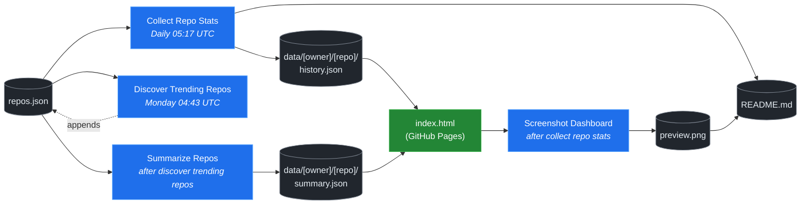

# 🚀 Rising Repos Tracker

> Automatically tracks daily GitHub stats (stars, forks, issues, velocity) for rising open source repos.

[](https://www.telosignal.com/)


**[→ View Live Dashboard](https://patrick-creates.github.io/rising-repos-tracker/)**

Built and maintained by [Telosignal](https://www.telosignal.com/).


<!-- AUTOGEN-STATS-START -->
## 📊 Current snapshot

> Auto-updated daily — last refreshed 2026-08-30

| Metric | Value |
|---|---|
| Repos tracked | **186** |
| Total stars | **9,088,527** |
| Total forks | **1,346,100** |
| Fastest growing | **ponytail** (+995.6/day) |

### 🔥 Top 5 by velocity

| # | Repo | Stars | Stars/day |
|---|---|---:|---:|
| 1 | [DietrichGebert/ponytail](https://github.com/DietrichGebert/ponytail) | 116,712 | +995.6 |
| 2 | [bojieli/ai-agent-book](https://github.com/bojieli/ai-agent-book) | 43,522 | +867.5 |
| 3 | [diegosouzapw/OmniRoute](https://github.com/diegosouzapw/OmniRoute) | 58,310 | +839.2 |
| 4 | [NousResearch/hermes-agent](https://github.com/NousResearch/hermes-agent) | 238,282 | +827.9 |
| 5 | [stablyai/orca](https://github.com/stablyai/orca) | 57,000 | +807.6 |

### 🆕 Recently added

- [virgiliojr94/book-to-skill](https://github.com/virgiliojr94/book-to-skill) — added 2026-08-24 — Turn any technical book PDF into a Claude Code skill — ready to study, reference, and use while you work.
- [guillaumemeyer/watermarks-remover](https://github.com/guillaumemeyer/watermarks-remover) — added 2026-08-24 — Strip multi-vendor AI provenance marks: Unicode text hygiene, statistical rewrite hooks, and C2PA/metadata from PNG/JPEG/SVG/PDF/DOCX/HTML/MD
- [holaboss-ai/holaOS](https://github.com/holaboss-ai/holaOS) — added 2026-08-17 — Open-source All in One AI agent workspace. Run any agent — Claude Code, Codex — across your tools (100+ integrations + MCP), apps, browser, and files, with shared memory. Built-in models or BYOK.
<!-- AUTOGEN-STATS-END -->

<!-- AUTOGEN-DIAGRAM-START -->
## 🔄 How it works


```mermaid
graph LR
    repos[("repos.json")]:::data
    history[("data/[owner]/[repo]/<br/>history.json")]:::data
    summary[("data/[owner]/[repo]/<br/>summary.json")]:::data
    readme[("README.md")]:::data
    preview[("preview.png")]:::data
    dashboard["index.html<br/>(GitHub Pages)"]:::output
    collect_yml["Collect Repo Stats<br/><i>Daily 05:17 UTC</i>"]:::workflow
    discover_yml["Discover Trending Repos<br/><i>Monday 04:43 UTC</i>"]:::workflow
    screenshot_yml["Screenshot Dashboard<br/><i>after collect repo stats</i>"]:::workflow
    summarize_yml["Summarize Repos<br/><i>after discover trending repos</i>"]:::workflow
    repos --> collect_yml
    collect_yml --> history
    collect_yml --> readme
    repos --> discover_yml
    discover_yml -.->|appends| repos
    dashboard --> screenshot_yml
    screenshot_yml --> preview
    repos --> summarize_yml
    summarize_yml --> summary
    history --> dashboard
    summary --> dashboard
    preview --> readme
    classDef workflow fill:#1f6feb,stroke:#58a6ff,color:#fff
    classDef data fill:#21262d,stroke:#7d8590,color:#e6edf3
    classDef output fill:#238636,stroke:#3fb950,color:#fff
```
<!-- AUTOGEN-DIAGRAM-END -->

<!-- AUTOGEN-WORKFLOWS-START -->
## ⚙️ Workflows

| File | Schedule | Name |
|---|---|---|
| `collect.yml` | Daily 05:17 UTC | Collect Repo Stats |
| `discover.yml` | Monday 04:43 UTC | Discover Trending Repos |
| `screenshot.yml` | After Collect Repo Stats | Screenshot Dashboard |
| `summarize.yml` | After Discover Trending Repos | Summarize Repos |

> All workflows commit results directly back to the repo. Schedules are best-effort — GitHub Actions cron can drift by a few minutes.
<!-- AUTOGEN-WORKFLOWS-END -->

<!-- AUTOGEN-REPOS-START -->
## 📋 All tracked repos

| Repo | Stars | Forks | Stars/day |
|---|---:|---:|---:|
| [openclaw/openclaw](https://github.com/openclaw/openclaw) | 388,045 | 81,471 | +152.1 |
| [obra/superpowers](https://github.com/obra/superpowers) | 279,513 | 25,038 | +636.8 |
| [affaan-m/everything-claude-code](https://github.com/affaan-m/everything-claude-code) | 244,448 | 36,957 | +581.7 |
| [affaan-m/ECC](https://github.com/affaan-m/ECC) | 244,448 | 36,957 | +538.3 |
| [NousResearch/hermes-agent](https://github.com/NousResearch/hermes-agent) | 238,282 | 48,481 | +827.9 |
| [Significant-Gravitas/AutoGPT](https://github.com/Significant-Gravitas/AutoGPT) | 186,997 | 46,048 | +24.9 |
| [microsoft/markitdown](https://github.com/microsoft/markitdown) | 177,101 | 13,021 | +496.3 |
| [f/prompts.chat](https://github.com/f/prompts.chat) | 168,194 | 21,685 | +55.2 |
| [langgenius/dify](https://github.com/langgenius/dify) | 153,875 | 24,316 | +116.1 |
| [open-webui/open-webui](https://github.com/open-webui/open-webui) | 150,391 | 21,958 | +123.8 |
| [langchain-ai/langchain](https://github.com/langchain-ai/langchain) | 145,270 | 24,248 | +79.2 |
| [github/spec-kit](https://github.com/github/spec-kit) | 132,250 | 11,901 | +315.5 |
| [farion1231/cc-switch](https://github.com/farion1231/cc-switch) | 130,143 | 8,929 | +539.4 |
| [nextlevelbuilder/ui-ux-pro-max-skill](https://github.com/nextlevelbuilder/ui-ux-pro-max-skill) | 123,080 | 13,179 | +414.6 |
| [microsoft/generative-ai-for-beginners](https://github.com/microsoft/generative-ai-for-beginners) | 118,781 | 62,618 | +73.7 |
| [DietrichGebert/ponytail](https://github.com/DietrichGebert/ponytail) | 116,712 | 6,374 | +995.6 |
| [Graphify-Labs/graphify](https://github.com/Graphify-Labs/graphify) | 112,427 | 10,944 | +462.6 |
| [JuliusBrussee/caveman](https://github.com/JuliusBrussee/caveman) | 101,798 | 5,922 | +387.4 |
| [nexu-io/open-design](https://github.com/nexu-io/open-design) | 92,714 | 10,687 | +466.7 |
| [thedotmack/claude-mem](https://github.com/thedotmack/claude-mem) | 92,611 | 8,154 | +158.1 |
| [ruvnet/RuView](https://github.com/ruvnet/RuView) | 92,050 | 12,220 | +269.7 |
| [vllm-project/vllm](https://github.com/vllm-project/vllm) | 90,459 | 21,422 | +97.0 |
| [ChatGPTNextWeb/NextChat](https://github.com/ChatGPTNextWeb/NextChat) | 88,667 | 59,171 | +6.1 |
| [OpenHands/OpenHands](https://github.com/OpenHands/OpenHands) | 85,605 | 11,212 | +112.2 |
| [koala73/worldmonitor](https://github.com/koala73/worldmonitor) | 84,981 | 12,782 | +294.4 |
| [Leonxlnx/taste-skill](https://github.com/Leonxlnx/taste-skill) | 82,294 | 5,639 | +576.5 |
| [lobehub/lobehub](https://github.com/lobehub/lobehub) | 82,095 | 15,839 | +46.8 |
| [dair-ai/Prompt-Engineering-Guide](https://github.com/dair-ai/Prompt-Engineering-Guide) | 77,887 | 8,557 | +30.6 |
| [rtk-ai/rtk](https://github.com/rtk-ai/rtk) | 77,870 | 4,906 | +272.0 |
| [Panniantong/Agent-Reach](https://github.com/Panniantong/Agent-Reach) | 76,655 | 6,555 | +640.7 |
| [shareAI-lab/learn-claude-code](https://github.com/shareAI-lab/learn-claude-code) | 75,644 | 12,194 | +140.1 |
| [openai/openai-cookbook](https://github.com/openai/openai-cookbook) | 75,618 | 12,786 | +19.3 |
| [datawhalechina/hello-agents](https://github.com/datawhalechina/hello-agents) | 75,554 | 9,395 | +239.4 |
| [unslothai/unsloth](https://github.com/unslothai/unsloth) | 75,218 | 6,827 | +103.1 |
| [ComposioHQ/awesome-claude-skills](https://github.com/ComposioHQ/awesome-claude-skills) | 74,034 | 8,475 | +131.2 |
| [santifer/career-ops](https://github.com/santifer/career-ops) | 69,362 | 13,108 | +231.9 |
| [code-yeongyu/oh-my-openagent](https://github.com/code-yeongyu/oh-my-openagent) | 68,514 | 5,614 | +97.9 |
| [chopratejas/headroom](https://github.com/chopratejas/headroom) | 68,053 | 5,275 | +524.9 |
| [headroomlabs-ai/headroom](https://github.com/headroomlabs-ai/headroom) | 68,053 | 5,275 | +321.0 |
| [Fission-AI/OpenSpec](https://github.com/Fission-AI/OpenSpec) | 66,671 | 4,591 | +172.0 |
| [xtekky/gpt4free](https://github.com/xtekky/gpt4free) | 66,617 | 13,514 | +3.6 |
| [shanraisshan/claude-code-best-practice](https://github.com/shanraisshan/claude-code-best-practice) | 65,372 | 6,517 | +114.2 |
| [ZhuLinsen/daily_stock_analysis](https://github.com/ZhuLinsen/daily_stock_analysis) | 64,306 | 53,916 | +262.5 |
| [asgeirtj/system_prompts_leaks](https://github.com/asgeirtj/system_prompts_leaks) | 63,824 | 10,468 | +225.4 |
| [tw93/Pake](https://github.com/tw93/Pake) | 61,154 | 12,568 | +119.0 |
| [mvanhorn/last30days-skill](https://github.com/mvanhorn/last30days-skill) | 60,265 | 5,285 | +332.5 |
| [usestrix/strix](https://github.com/usestrix/strix) | 59,379 | 6,476 | +374.1 |
| [MemPalace/mempalace](https://github.com/MemPalace/mempalace) | 58,739 | 7,540 | +61.0 |
| [diegosouzapw/OmniRoute](https://github.com/diegosouzapw/OmniRoute) | 58,310 | 8,061 | +839.2 |
| [BerriAI/litellm](https://github.com/BerriAI/litellm) | 57,577 | 11,016 | +98.0 |
| [stablyai/orca](https://github.com/stablyai/orca) | 57,000 | 3,882 | +807.6 |
| [FlowiseAI/Flowise](https://github.com/FlowiseAI/Flowise) | 55,399 | 24,965 | +24.0 |
| [calesthio/OpenMontage](https://github.com/calesthio/OpenMontage) | 54,353 | 6,736 | +427.5 |
| [ggml-org/whisper.cpp](https://github.com/ggml-org/whisper.cpp) | 53,294 | 6,110 | +33.3 |
| [hesreallyhim/awesome-claude-code](https://github.com/hesreallyhim/awesome-claude-code) | 53,210 | 4,635 | +87.6 |
| [jamiepine/voicebox](https://github.com/jamiepine/voicebox) | 51,841 | 6,454 | +253.5 |
| [rohitg00/ai-engineering-from-scratch](https://github.com/rohitg00/ai-engineering-from-scratch) | 51,107 | 8,850 | +274.9 |
| [ChromeDevTools/chrome-devtools-mcp](https://github.com/ChromeDevTools/chrome-devtools-mcp) | 50,184 | 3,520 | +99.0 |
| [router-for-me/CLIProxyAPI](https://github.com/router-for-me/CLIProxyAPI) | 49,299 | 7,558 | +150.1 |
| [Aider-AI/aider](https://github.com/Aider-AI/aider) | 48,599 | 4,900 | +35.0 |
| [HKUDS/nanobot](https://github.com/HKUDS/nanobot) | 47,530 | 8,387 | +46.6 |
| [kepano/obsidian-skills](https://github.com/kepano/obsidian-skills) | 47,515 | 3,413 | +151.5 |
| [elder-plinius/CL4R1T4S](https://github.com/elder-plinius/CL4R1T4S) | 47,213 | 9,558 | +109.5 |
| [QuantumNous/new-api](https://github.com/QuantumNous/new-api) | 46,777 | 11,127 | +117.7 |
| [zhayujie/CowAgent](https://github.com/zhayujie/CowAgent) | 46,723 | 10,327 | +20.8 |
| [coreyhaines31/marketingskills](https://github.com/coreyhaines31/marketingskills) | 46,108 | 7,208 | +163.0 |
| [sickn33/antigravity-awesome-skills](https://github.com/sickn33/antigravity-awesome-skills) | 45,681 | 6,683 | +72.2 |
| [sickn33/agentic-awesome-skills](https://github.com/sickn33/agentic-awesome-skills) | 45,681 | 6,683 | +55.0 |
| [Imbad0202/academic-research-skills](https://github.com/Imbad0202/academic-research-skills) | 44,216 | 3,507 | +133.0 |
| [bojieli/ai-agent-book](https://github.com/bojieli/ai-agent-book) | 43,522 | 4,794 | +867.5 |
| [heygen-com/hyperframes](https://github.com/heygen-com/hyperframes) | 43,110 | 4,152 | +211.4 |
| [danny-avila/LibreChat](https://github.com/danny-avila/LibreChat) | 42,614 | 8,818 | +53.0 |
| [chatboxai/chatbox](https://github.com/chatboxai/chatbox) | 41,610 | 4,218 | +15.5 |
| [chatanywhere/GPT_API_free](https://github.com/chatanywhere/GPT_API_free) | 41,434 | 2,707 | +33.8 |
| [DeusData/codebase-memory-mcp](https://github.com/DeusData/codebase-memory-mcp) | 41,207 | 3,358 | +331.9 |
| [Hmbown/CodeWhale](https://github.com/Hmbown/CodeWhale) | 40,860 | 3,536 | +63.8 |
| [langchain-ai/langgraph](https://github.com/langchain-ai/langgraph) | 40,700 | 6,862 | +76.5 |
| [AstrBotDevs/AstrBot](https://github.com/AstrBotDevs/AstrBot) | 39,794 | 2,853 | +68.9 |
| [mindsdb/mindshub](https://github.com/mindsdb/mindshub) | 39,660 | 6,237 | +5.4 |
| [wshobson/agents](https://github.com/wshobson/agents) | 39,257 | 4,190 | +34.2 |
| [Yeachan-Heo/oh-my-claudecode](https://github.com/Yeachan-Heo/oh-my-claudecode) | 38,890 | 3,490 | +41.9 |
| [google/langextract](https://github.com/google/langextract) | 38,508 | 2,705 | +20.1 |
| [github/awesome-copilot](https://github.com/github/awesome-copilot) | 38,434 | 4,853 | +47.7 |
| [MadsLorentzen/ai-job-search](https://github.com/MadsLorentzen/ai-job-search) | 38,256 | 12,986 | +347.4 |
| [songquanpeng/one-api](https://github.com/songquanpeng/one-api) | 36,646 | 6,840 | +25.1 |
| [PDFMathTranslate/PDFMathTranslate](https://github.com/PDFMathTranslate/PDFMathTranslate) | 36,482 | 3,260 | +25.4 |
| [anthropics/claude-plugins-official](https://github.com/anthropics/claude-plugins-official) | 35,556 | 3,966 | +72.7 |
| [esengine/DeepSeek-Reasonix](https://github.com/esengine/DeepSeek-Reasonix) | 35,251 | 2,359 | +189.5 |
| [agentscope-ai/QwenPaw](https://github.com/agentscope-ai/QwenPaw) | 34,681 | 3,046 | +222.4 |
| [AlexsJones/llmfit](https://github.com/AlexsJones/llmfit) | 34,520 | 2,164 | +83.5 |
| [volcengine/OpenViking](https://github.com/volcengine/OpenViking) | 34,381 | 2,623 | +109.1 |
| [ogulcancelik/herdr](https://github.com/ogulcancelik/herdr) | 33,511 | 2,446 | +383.9 |
| [herdrdev/herdr](https://github.com/herdrdev/herdr) | 33,511 | 2,446 | +360.1 |
| [JCodesMore/ai-website-cloner-template](https://github.com/JCodesMore/ai-website-cloner-template) | 33,385 | 4,877 | +215.7 |
| [zeroclaw-labs/zeroclaw](https://github.com/zeroclaw-labs/zeroclaw) | 32,678 | 4,921 | +11.1 |
| [iOfficeAI/AionUi](https://github.com/iOfficeAI/AionUi) | 32,422 | 3,329 | +56.4 |
| [HKUDS/Vibe-Trading](https://github.com/HKUDS/Vibe-Trading) | 32,086 | 5,238 | +279.8 |
| [mukul975/Anthropic-Cybersecurity-Skills](https://github.com/mukul975/Anthropic-Cybersecurity-Skills) | 31,659 | 3,810 | +196.2 |
| [tirth8205/code-review-graph](https://github.com/tirth8205/code-review-graph) | 31,006 | 2,824 | +164.4 |
| [Gitlawb/openclaude](https://github.com/Gitlawb/openclaude) | 30,890 | 8,924 | +30.6 |
| [googleworkspace/cli](https://github.com/googleworkspace/cli) | 30,647 | 1,797 | +43.7 |
| [iOfficeAI/OfficeCLI](https://github.com/iOfficeAI/OfficeCLI) | 29,511 | 2,007 | +383.9 |
| [alibaba/page-agent](https://github.com/alibaba/page-agent) | 28,904 | 2,591 | +136.1 |
| [p-e-w/heretic](https://github.com/p-e-w/heretic) | 28,870 | 3,179 | +59.0 |
| [voideditor/void](https://github.com/voideditor/void) | 28,818 | 2,644 | +0.1 |
| [jackwener/OpenCLI](https://github.com/jackwener/OpenCLI) | 28,727 | 2,821 | +59.4 |
| [langchain-ai/deepagents](https://github.com/langchain-ai/deepagents) | 28,716 | 4,029 | +55.0 |
| [can1357/oh-my-pi](https://github.com/can1357/oh-my-pi) | 28,384 | 2,832 | +208.5 |
| [BloopAI/vibe-kanban](https://github.com/BloopAI/vibe-kanban) | 27,953 | 2,998 | +13.8 |
| [rohitg00/agentmemory](https://github.com/rohitg00/agentmemory) | 27,761 | 2,397 | +71.5 |
| [jarrodwatts/claude-hud](https://github.com/jarrodwatts/claude-hud) | 27,728 | 1,282 | +36.6 |
| [virgiliojr94/book-to-skill](https://github.com/virgiliojr94/book-to-skill) | 27,158 | 2,815 | +388.2 |
| [decolua/9router](https://github.com/decolua/9router) | 26,664 | 4,854 | +119.6 |
| [manaflow-ai/cmux](https://github.com/manaflow-ai/cmux) | 26,594 | 2,279 | +46.6 |
| [zai-org/Open-AutoGLM](https://github.com/zai-org/Open-AutoGLM) | 26,122 | 4,021 | +8.0 |
| [toon-format/toon](https://github.com/toon-format/toon) | 25,274 | 1,123 | +9.4 |
| [TencentCloud/TencentDB-Agent-Memory](https://github.com/TencentCloud/TencentDB-Agent-Memory) | 25,216 | 2,352 | +343.7 |
| [winfunc/opcode](https://github.com/winfunc/opcode) | 22,384 | 1,728 | +4.6 |
| [pranshuparmar/witr](https://github.com/pranshuparmar/witr) | 21,920 | 763 | +62.7 |
| [pascalorg/editor](https://github.com/pascalorg/editor) | 21,762 | 2,793 | +25.6 |
| [alibaba/open-code-review](https://github.com/alibaba/open-code-review) | 21,642 | 1,599 | +211.9 |
| [coze-dev/coze-studio](https://github.com/coze-dev/coze-studio) | 21,513 | 3,123 | +6.8 |
| [NirDiamant/agents-towards-production](https://github.com/NirDiamant/agents-towards-production) | 21,348 | 2,838 | +8.6 |
| [jundot/omlx](https://github.com/jundot/omlx) | 20,988 | 1,783 | +57.3 |
| [Tencent/WeKnora](https://github.com/Tencent/WeKnora) | 20,926 | 3,011 | +61.0 |
| [steipete/CodexBar](https://github.com/steipete/CodexBar) | 20,718 | 1,802 | +79.9 |
| [KKKKhazix/khazix-skills](https://github.com/KKKKhazix/khazix-skills) | 20,268 | 2,173 | +68.5 |
| [mksglu/context-mode](https://github.com/mksglu/context-mode) | 20,246 | 1,474 | +36.6 |
| [jnMetaCode/agency-agents-zh](https://github.com/jnMetaCode/agency-agents-zh) | 20,105 | 3,257 | +68.1 |
| [tanweai/pua](https://github.com/tanweai/pua) | 19,548 | 1,191 | +17.1 |
| [guillaumemeyer/watermarks-remover](https://github.com/guillaumemeyer/watermarks-remover) | 19,338 | 2,256 | +297.7 |
| [datawhalechina/easy-vibe](https://github.com/datawhalechina/easy-vibe) | 19,179 | 1,833 | +29.4 |
| [1jehuang/jcode](https://github.com/1jehuang/jcode) | 18,805 | 2,147 | +218.8 |
| [danielmiessler/LifeOS](https://github.com/danielmiessler/LifeOS) | 18,795 | 2,441 | +39.6 |
| [RightNow-AI/openfang](https://github.com/RightNow-AI/openfang) | 18,148 | 2,288 | +4.2 |
| [microsoft/agent-lightning](https://github.com/microsoft/agent-lightning) | 17,917 | 1,573 | +8.0 |
| [nesquena/hermes-webui](https://github.com/nesquena/hermes-webui) | 17,882 | 2,482 | +44.1 |
| [t8y2/dbx](https://github.com/t8y2/dbx) | 17,449 | 1,699 | +165.1 |
| [browser-use/browser-harness](https://github.com/browser-use/browser-harness) | 17,235 | 1,670 | +28.3 |
| [jlcodes99/cockpit-tools](https://github.com/jlcodes99/cockpit-tools) | 16,763 | 1,464 | +64.5 |
| [cft0808/edict](https://github.com/cft0808/edict) | 16,748 | 1,750 | +9.0 |
| [MemoriLabs/Memori](https://github.com/MemoriLabs/Memori) | 16,277 | 3,273 | +13.5 |
| [composio-community/awesome-codex-skills](https://github.com/composio-community/awesome-codex-skills) | 16,119 | 1,572 | +20.5 |
| [xbtlin/ai-berkshire](https://github.com/xbtlin/ai-berkshire) | 15,993 | 2,400 | +94.8 |
| [xpzouying/xiaohongshu-mcp](https://github.com/xpzouying/xiaohongshu-mcp) | 15,549 | 2,287 | +18.3 |
| [Anionex/banana-slides](https://github.com/Anionex/banana-slides) | 15,520 | 1,778 | +5.5 |
| [wanshuiyin/Auto-claude-code-research-in-sleep](https://github.com/wanshuiyin/Auto-claude-code-research-in-sleep) | 15,457 | 1,347 | +43.3 |
| [yusufkaraaslan/Skill_Seekers](https://github.com/yusufkaraaslan/Skill_Seekers) | 14,860 | 1,515 | +9.2 |
| [kyegomez/OpenMythos](https://github.com/kyegomez/OpenMythos) | 14,854 | 3,295 | +10.1 |
| [walkinglabs/learn-harness-engineering](https://github.com/walkinglabs/learn-harness-engineering) | 14,512 | 1,439 | +84.1 |
| [NevaMind-AI/memU](https://github.com/NevaMind-AI/memU) | 14,361 | 1,063 | +6.7 |
| [NanmiCoder/cc-haha](https://github.com/NanmiCoder/cc-haha) | 14,248 | 8,545 | +13.8 |
| [superset-sh/superset](https://github.com/superset-sh/superset) | 13,500 | 1,230 | +21.6 |
| [XiaomiMiMo/MiMo-Code](https://github.com/XiaomiMiMo/MiMo-Code) | 12,903 | 1,335 | +30.3 |
| [sirmalloc/ccstatusline](https://github.com/sirmalloc/ccstatusline) | 12,664 | 553 | +22.3 |
| [EverMind-AI/EverOS](https://github.com/EverMind-AI/EverOS) | 12,557 | 908 | +45.8 |
| [ConardLi/garden-skills](https://github.com/ConardLi/garden-skills) | 11,700 | 1,452 | +45.8 |
| [ifixai-ai/iFixAi](https://github.com/ifixai-ai/iFixAi) | 11,525 | 1,223 | +167.6 |
| [0x4m4/hexstrike-ai](https://github.com/0x4m4/hexstrike-ai) | 11,444 | 2,382 | +23.1 |
| [brokermr810/QuantDinger](https://github.com/brokermr810/QuantDinger) | 11,224 | 2,344 | +35.3 |
| [OpenByteInc/QuantDinger](https://github.com/OpenByteInc/QuantDinger) | 11,224 | 2,344 | +34.7 |
| [MemTensor/MemOS](https://github.com/MemTensor/MemOS) | 11,085 | 1,013 | +17.1 |
| [holaboss-ai/holaOS](https://github.com/holaboss-ai/holaOS) | 11,043 | 718 | +205.5 |
| [ValueCell-ai/valuecell](https://github.com/ValueCell-ai/valuecell) | 11,006 | 1,807 | +2.2 |
| [aden-hive/hive](https://github.com/aden-hive/hive) | 10,985 | 5,669 | +6.0 |
| [EKKOLearnAI/hermes-studio](https://github.com/EKKOLearnAI/hermes-studio) | 10,693 | 1,294 | +33.3 |
| [Kuberwastaken/claurst](https://github.com/Kuberwastaken/claurst) | 10,281 | 7,757 | +6.7 |
| [openai/codex-security](https://github.com/openai/codex-security) | 10,272 | 746 | +73.7 |
| [ykdojo/claude-code-tips](https://github.com/ykdojo/claude-code-tips) | 9,974 | 802 | +17.4 |
| [StarTrail-org/PixelRAG](https://github.com/StarTrail-org/PixelRAG) | 9,792 | 837 | +66.8 |
| [getagentseal/codeburn](https://github.com/getagentseal/codeburn) | 9,724 | 773 | +22.8 |
| [frankbria/ralph-claude-code](https://github.com/frankbria/ralph-claude-code) | 9,610 | 722 | +4.6 |
| [EvoMap/evolver](https://github.com/EvoMap/evolver) | 9,023 | 840 | +3.1 |
| [modem-dev/hunk](https://github.com/modem-dev/hunk) | 8,924 | 281 | +46.2 |
| [iflytek/astron-agent](https://github.com/iflytek/astron-agent) | 8,892 | 866 | +5.1 |
| [MiroMindAI/MiroThinker](https://github.com/MiroMindAI/MiroThinker) | 8,362 | 644 | +0.7 |
| [mmulet/term.everything](https://github.com/mmulet/term.everything) | 8,083 | 194 | +1.1 |
| [ValueCell-ai/ClawX](https://github.com/ValueCell-ai/ClawX) | 7,599 | 1,142 | +1.2 |
| [1weiho/open-slide](https://github.com/1weiho/open-slide) | 7,300 | 517 | +59.1 |
| [opensquilla/opensquilla](https://github.com/opensquilla/opensquilla) | 6,783 | 535 | +14.0 |
| [steipete/summarize](https://github.com/steipete/summarize) | 6,585 | 442 | +3.6 |
| [Andyyyy64/whichllm](https://github.com/Andyyyy64/whichllm) | 6,524 | 358 | +16.0 |
| [Arthur-Ficial/apfel](https://github.com/Arthur-Ficial/apfel) | 6,335 | 243 | +4.6 |
| [microsoft/fara](https://github.com/microsoft/fara) | 6,165 | 604 | +3.5 |
| [UfoMiao/zcf](https://github.com/UfoMiao/zcf) | 6,079 | 420 | +0.2 |
| [re4/LibreCode](https://github.com/re4/LibreCode) | 85 | 5 | — |
<!-- AUTOGEN-REPOS-END -->

---

## What it does

- Collects daily snapshots of stars, forks, watchers and open issues for every tracked repo
- Discovers new trending repos automatically every Monday using the GitHub Search API
- Generates AI summaries (use cases, similar tools, tags) for each tracked repo via GitHub Models
- Stores all history as plain JSON — no database, no backend
- Renders a live dashboard via GitHub Pages — updates daily, zero maintenance

## Tracked repos

Data lives in [`data/`](./data) — one folder per repo, one `history.json` per entry.  
The full watch list is in [`repos.json`](./repos.json).

## Fork & use it for yourself

This is my personal tracker — the watch list reflects what I find interesting. If you want to track different repos, the best path is to **fork this repo and run your own**.

### Setup

1. Fork this repo to your account
2. Replace the contents of [`repos.json`](./repos.json) with the repos you want to track (or just leave one entry — `discover.yml` will auto-add more every Monday)
3. Go to **Settings → Pages** and enable GitHub Pages from the `main` branch
4. Go to **Actions** and run **Collect Repo Stats** once manually to seed your first data point
5. Your dashboard will be live at `https://YOUR-USERNAME.github.io/rising-repos-tracker/`

That's it — daily collection and weekly discovery run automatically on schedule. Zero ongoing maintenance.

### Customizing what gets discovered

Edit [`scripts/discover.js`](./scripts/discover.js) to change:

- `MIN_STARS` — minimum star threshold for candidates
- `MAX_AGE_DAYS` — how recent a repo must be
- `MAX_NEW_REPOS` — how many to add per discovery run
- The `queries` array — GitHub Search API queries that define what "trending" means to you

### Adding a repo manually

Just edit `repos.json` directly:

```json
{
  "owner": "OWNER",
  "repo": "REPO",
  "added": "YYYY-MM-DD",
  "notes": "why you're tracking this"
}
```

The next daily collect run picks it up automatically.

## Stack

- **GitHub Actions** — scheduling and automation
- **GitHub Pages** — dashboard hosting
- **GitHub API** — data source
- **GitHub Models** — free AI summaries (gpt-4o-mini)
- **Chart.js** — star growth visualization
- **Mermaid** — architecture diagram (rendered by GitHub)
- No dependencies, no build step, no database

## License

MIT
