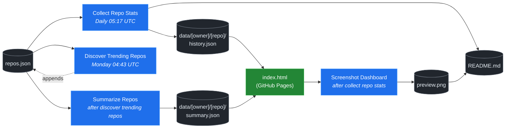

# 🚀 Rising Repos Tracker

> Automatically tracks daily GitHub stats (stars, forks, issues, velocity) for rising open source repos.

[](https://www.telosignal.com/)


**[→ View Live Dashboard](https://patrick-creates.github.io/rising-repos-tracker/)**

Built and maintained by [Telosignal](https://www.telosignal.com/).


<!-- AUTOGEN-STATS-START -->
## 📊 Current snapshot

> Auto-updated daily — last refreshed 2026-08-20

| Metric | Value |
|---|---|
| Repos tracked | **184** |
| Total stars | **8,854,977** |
| Total forks | **1,317,212** |
| Fastest growing | **ai-agent-book** (+1027.3/day) |

### 🔥 Top 5 by velocity

| # | Repo | Stars | Stars/day |
|---|---|---:|---:|
| 1 | [bojieli/ai-agent-book](https://github.com/bojieli/ai-agent-book) | 39,798 | +1027.3 |
| 2 | [DietrichGebert/ponytail](https://github.com/DietrichGebert/ponytail) | 106,181 | +985.8 |
| 3 | [diegosouzapw/OmniRoute](https://github.com/diegosouzapw/OmniRoute) | 51,384 | +871.8 |
| 4 | [NousResearch/hermes-agent](https://github.com/NousResearch/hermes-agent) | 233,167 | +859.8 |
| 5 | [stablyai/orca](https://github.com/stablyai/orca) | 49,344 | +816.9 |

### 🆕 Recently added

- [holaboss-ai/holaOS](https://github.com/holaboss-ai/holaOS) — added 2026-08-17 — Open-source All in One AI agent workspace. Run any agent — Claude Code, Codex — across your tools (100+ integrations + MCP), apps, browser, and files, with shared memory. Built-in models or BYOK.
- [pascalorg/editor](https://github.com/pascalorg/editor) — added 2026-08-10 — Create and share 3D architectural projects.
- [jlcodes99/cockpit-tools](https://github.com/jlcodes99/cockpit-tools) — added 2026-08-10 —  🚀 通用 AI IDE 账号管理工具：支持 Antigravity / Codex / GitHub Copilot / Windsurf / Kiro / Cursor / Gemini-cli / CodeBuddy，多账号切换、配额监控、自动唤醒与多开实例管理。 🚀 Universal AI IDE account manager for Antigravity / Codex / GitHub Copilot / Windsurf / Kiro / Cursor / Gemini-cli / CodeBuddy, with multi-account switching, quota monitoring, wake-up automation, and multi-insta
<!-- AUTOGEN-STATS-END -->

<!-- AUTOGEN-DIAGRAM-START -->
## 🔄 How it works


```mermaid
graph LR
    repos[("repos.json")]:::data
    history[("data/[owner]/[repo]/<br/>history.json")]:::data
    summary[("data/[owner]/[repo]/<br/>summary.json")]:::data
    readme[("README.md")]:::data
    preview[("preview.png")]:::data
    dashboard["index.html<br/>(GitHub Pages)"]:::output
    collect_yml["Collect Repo Stats<br/><i>Daily 05:17 UTC</i>"]:::workflow
    discover_yml["Discover Trending Repos<br/><i>Monday 04:43 UTC</i>"]:::workflow
    screenshot_yml["Screenshot Dashboard<br/><i>after collect repo stats</i>"]:::workflow
    summarize_yml["Summarize Repos<br/><i>after discover trending repos</i>"]:::workflow
    repos --> collect_yml
    collect_yml --> history
    collect_yml --> readme
    repos --> discover_yml
    discover_yml -.->|appends| repos
    dashboard --> screenshot_yml
    screenshot_yml --> preview
    repos --> summarize_yml
    summarize_yml --> summary
    history --> dashboard
    summary --> dashboard
    preview --> readme
    classDef workflow fill:#1f6feb,stroke:#58a6ff,color:#fff
    classDef data fill:#21262d,stroke:#7d8590,color:#e6edf3
    classDef output fill:#238636,stroke:#3fb950,color:#fff
```
<!-- AUTOGEN-DIAGRAM-END -->

<!-- AUTOGEN-WORKFLOWS-START -->
## ⚙️ Workflows

| File | Schedule | Name |
|---|---|---|
| `collect.yml` | Daily 05:17 UTC | Collect Repo Stats |
| `discover.yml` | Monday 04:43 UTC | Discover Trending Repos |
| `screenshot.yml` | After Collect Repo Stats | Screenshot Dashboard |
| `summarize.yml` | After Discover Trending Repos | Summarize Repos |

> All workflows commit results directly back to the repo. Schedules are best-effort — GitHub Actions cron can drift by a few minutes.
<!-- AUTOGEN-WORKFLOWS-END -->

<!-- AUTOGEN-REPOS-START -->
## 📋 All tracked repos

| Repo | Stars | Forks | Stars/day |
|---|---:|---:|---:|
| [openclaw/openclaw](https://github.com/openclaw/openclaw) | 386,822 | 81,261 | +155.1 |
| [obra/superpowers](https://github.com/obra/superpowers) | 274,424 | 24,567 | +658.4 |
| [affaan-m/everything-claude-code](https://github.com/affaan-m/everything-claude-code) | 241,228 | 36,575 | +607.9 |
| [affaan-m/ECC](https://github.com/affaan-m/ECC) | 241,228 | 36,575 | +563.2 |
| [NousResearch/hermes-agent](https://github.com/NousResearch/hermes-agent) | 233,167 | 46,658 | +859.8 |
| [Significant-Gravitas/AutoGPT](https://github.com/Significant-Gravitas/AutoGPT) | 186,690 | 46,049 | +24.3 |
| [microsoft/markitdown](https://github.com/microsoft/markitdown) | 174,757 | 12,776 | +522.7 |
| [f/prompts.chat](https://github.com/f/prompts.chat) | 167,602 | 21,641 | +54.8 |
| [langgenius/dify](https://github.com/langgenius/dify) | 152,961 | 24,155 | +118.5 |
| [open-webui/open-webui](https://github.com/open-webui/open-webui) | 149,303 | 21,776 | +125.4 |
| [langchain-ai/langchain](https://github.com/langchain-ai/langchain) | 144,597 | 24,086 | +80.4 |
| [github/spec-kit](https://github.com/github/spec-kit) | 130,362 | 11,705 | +328.3 |
| [farion1231/cc-switch](https://github.com/farion1231/cc-switch) | 128,364 | 8,785 | +577.9 |
| [nextlevelbuilder/ui-ux-pro-max-skill](https://github.com/nextlevelbuilder/ui-ux-pro-max-skill) | 118,321 | 12,719 | +408.4 |
| [microsoft/generative-ai-for-beginners](https://github.com/microsoft/generative-ai-for-beginners) | 118,144 | 62,310 | +74.7 |
| [Graphify-Labs/graphify](https://github.com/Graphify-Labs/graphify) | 108,421 | 10,521 | +488.5 |
| [DietrichGebert/ponytail](https://github.com/DietrichGebert/ponytail) | 106,181 | 5,867 | +985.8 |
| [JuliusBrussee/caveman](https://github.com/JuliusBrussee/caveman) | 99,275 | 5,761 | +401.7 |
| [thedotmack/claude-mem](https://github.com/thedotmack/claude-mem) | 91,283 | 7,982 | +160.6 |
| [ruvnet/RuView](https://github.com/ruvnet/RuView) | 91,010 | 12,093 | +288.7 |
| [vllm-project/vllm](https://github.com/vllm-project/vllm) | 89,490 | 20,942 | +97.0 |
| [nexu-io/open-design](https://github.com/nexu-io/open-design) | 89,434 | 10,318 | +481.5 |
| [ChatGPTNextWeb/NextChat](https://github.com/ChatGPTNextWeb/NextChat) | 88,628 | 59,223 | +6.3 |
| [OpenHands/OpenHands](https://github.com/OpenHands/OpenHands) | 84,525 | 11,011 | +112.7 |
| [koala73/worldmonitor](https://github.com/koala73/worldmonitor) | 83,289 | 12,429 | +307.7 |
| [lobehub/lobehub](https://github.com/lobehub/lobehub) | 81,832 | 15,806 | +48.8 |
| [Leonxlnx/taste-skill](https://github.com/Leonxlnx/taste-skill) | 78,303 | 5,354 | +598.6 |
| [dair-ai/Prompt-Engineering-Guide](https://github.com/dair-ai/Prompt-Engineering-Guide) | 77,612 | 8,529 | +31.0 |
| [rtk-ai/rtk](https://github.com/rtk-ai/rtk) | 76,720 | 4,826 | +288.7 |
| [openai/openai-cookbook](https://github.com/openai/openai-cookbook) | 75,371 | 12,743 | +18.7 |
| [shareAI-lab/learn-claude-code](https://github.com/shareAI-lab/learn-claude-code) | 74,719 | 12,074 | +145.1 |
| [unslothai/unsloth](https://github.com/unslothai/unsloth) | 73,931 | 6,677 | +100.3 |
| [datawhalechina/hello-agents](https://github.com/datawhalechina/hello-agents) | 73,835 | 9,171 | +246.5 |
| [Panniantong/Agent-Reach](https://github.com/Panniantong/Agent-Reach) | 73,165 | 6,228 | +680.7 |
| [ComposioHQ/awesome-claude-skills](https://github.com/ComposioHQ/awesome-claude-skills) | 72,841 | 8,331 | +132.5 |
| [code-yeongyu/oh-my-openagent](https://github.com/code-yeongyu/oh-my-openagent) | 68,141 | 5,566 | +104.4 |
| [chopratejas/headroom](https://github.com/chopratejas/headroom) | 66,918 | 5,151 | +587.2 |
| [headroomlabs-ai/headroom](https://github.com/headroomlabs-ai/headroom) | 66,918 | 5,151 | +356.2 |
| [xtekky/gpt4free](https://github.com/xtekky/gpt4free) | 66,569 | 13,516 | +3.5 |
| [santifer/career-ops](https://github.com/santifer/career-ops) | 65,965 | 12,760 | +220.4 |
| [Fission-AI/OpenSpec](https://github.com/Fission-AI/OpenSpec) | 65,578 | 4,519 | +178.6 |
| [shanraisshan/claude-code-best-practice](https://github.com/shanraisshan/claude-code-best-practice) | 64,762 | 6,441 | +119.8 |
| [ZhuLinsen/daily_stock_analysis](https://github.com/ZhuLinsen/daily_stock_analysis) | 63,420 | 53,290 | +282.5 |
| [asgeirtj/system_prompts_leaks](https://github.com/asgeirtj/system_prompts_leaks) | 63,215 | 10,384 | +242.9 |
| [tw93/Pake](https://github.com/tw93/Pake) | 60,911 | 12,486 | +129.1 |
| [mvanhorn/last30days-skill](https://github.com/mvanhorn/last30days-skill) | 58,751 | 5,130 | +357.3 |
| [MemPalace/mempalace](https://github.com/MemPalace/mempalace) | 58,479 | 7,501 | +64.7 |
| [BerriAI/litellm](https://github.com/BerriAI/litellm) | 56,794 | 10,738 | +100.1 |
| [usestrix/strix](https://github.com/usestrix/strix) | 55,791 | 5,973 | +376.0 |
| [FlowiseAI/Flowise](https://github.com/FlowiseAI/Flowise) | 55,384 | 24,934 | +26.4 |
| [ggml-org/whisper.cpp](https://github.com/ggml-org/whisper.cpp) | 53,043 | 6,082 | +34.2 |
| [hesreallyhim/awesome-claude-code](https://github.com/hesreallyhim/awesome-claude-code) | 52,671 | 4,600 | +91.2 |
| [diegosouzapw/OmniRoute](https://github.com/diegosouzapw/OmniRoute) | 51,384 | 6,991 | +871.8 |
| [jamiepine/voicebox](https://github.com/jamiepine/voicebox) | 50,900 | 6,340 | +273.5 |
| [ChromeDevTools/chrome-devtools-mcp](https://github.com/ChromeDevTools/chrome-devtools-mcp) | 49,450 | 3,450 | +101.8 |
| [stablyai/orca](https://github.com/stablyai/orca) | 49,344 | 3,405 | +816.9 |
| [calesthio/OpenMontage](https://github.com/calesthio/OpenMontage) | 49,019 | 6,139 | +407.1 |
| [Aider-AI/aider](https://github.com/Aider-AI/aider) | 48,337 | 4,862 | +35.9 |
| [router-for-me/CLIProxyAPI](https://github.com/router-for-me/CLIProxyAPI) | 47,996 | 7,400 | +152.3 |
| [rohitg00/ai-engineering-from-scratch](https://github.com/rohitg00/ai-engineering-from-scratch) | 47,231 | 8,298 | +260.9 |
| [HKUDS/nanobot](https://github.com/HKUDS/nanobot) | 47,197 | 8,333 | +48.1 |
| [elder-plinius/CL4R1T4S](https://github.com/elder-plinius/CL4R1T4S) | 47,045 | 9,549 | +123.5 |
| [kepano/obsidian-skills](https://github.com/kepano/obsidian-skills) | 46,833 | 3,365 | +161.9 |
| [zhayujie/CowAgent](https://github.com/zhayujie/CowAgent) | 46,582 | 10,321 | +21.6 |
| [QuantumNous/new-api](https://github.com/QuantumNous/new-api) | 45,664 | 10,824 | +118.5 |
| [sickn33/antigravity-awesome-skills](https://github.com/sickn33/antigravity-awesome-skills) | 45,158 | 6,611 | +74.5 |
| [sickn33/agentic-awesome-skills](https://github.com/sickn33/agentic-awesome-skills) | 45,158 | 6,611 | +55.7 |
| [coreyhaines31/marketingskills](https://github.com/coreyhaines31/marketingskills) | 44,959 | 7,061 | +169.0 |
| [Imbad0202/academic-research-skills](https://github.com/Imbad0202/academic-research-skills) | 43,070 | 3,420 | +140.7 |
| [danny-avila/LibreChat](https://github.com/danny-avila/LibreChat) | 42,256 | 8,748 | +55.0 |
| [heygen-com/hyperframes](https://github.com/heygen-com/hyperframes) | 41,740 | 4,004 | +221.6 |
| [chatboxai/chatbox](https://github.com/chatboxai/chatbox) | 41,481 | 4,207 | +15.8 |
| [Hmbown/CodeWhale](https://github.com/Hmbown/CodeWhale) | 40,826 | 3,533 | +70.8 |
| [chatanywhere/GPT_API_free](https://github.com/chatanywhere/GPT_API_free) | 40,732 | 2,693 | +29.6 |
| [langchain-ai/langgraph](https://github.com/langchain-ai/langgraph) | 40,062 | 6,744 | +78.7 |
| [bojieli/ai-agent-book](https://github.com/bojieli/ai-agent-book) | 39,798 | 4,382 | +1027.3 |
| [mindsdb/mindshub](https://github.com/mindsdb/mindshub) | 39,614 | 6,230 | +5.6 |
| [DeusData/codebase-memory-mcp](https://github.com/DeusData/codebase-memory-mcp) | 39,608 | 3,182 | +365.0 |
| [AstrBotDevs/AstrBot](https://github.com/AstrBotDevs/AstrBot) | 39,406 | 2,815 | +72.7 |
| [wshobson/agents](https://github.com/wshobson/agents) | 38,937 | 4,148 | +34.5 |
| [Yeachan-Heo/oh-my-claudecode](https://github.com/Yeachan-Heo/oh-my-claudecode) | 38,676 | 3,474 | +44.3 |
| [google/langextract](https://github.com/google/langextract) | 38,446 | 2,697 | +21.7 |
| [github/awesome-copilot](https://github.com/github/awesome-copilot) | 38,032 | 4,804 | +48.6 |
| [songquanpeng/one-api](https://github.com/songquanpeng/one-api) | 36,486 | 6,820 | +26.2 |
| [PDFMathTranslate/PDFMathTranslate](https://github.com/PDFMathTranslate/PDFMathTranslate) | 36,229 | 3,232 | +25.5 |
| [esengine/DeepSeek-Reasonix](https://github.com/esengine/DeepSeek-Reasonix) | 34,888 | 2,315 | +210.4 |
| [agentscope-ai/QwenPaw](https://github.com/agentscope-ai/QwenPaw) | 34,150 | 3,008 | +248.1 |
| [anthropics/claude-plugins-official](https://github.com/anthropics/claude-plugins-official) | 33,714 | 3,829 | +58.8 |
| [AlexsJones/llmfit](https://github.com/AlexsJones/llmfit) | 33,114 | 2,052 | +76.4 |
| [zeroclaw-labs/zeroclaw](https://github.com/zeroclaw-labs/zeroclaw) | 32,622 | 4,902 | +11.8 |
| [JCodesMore/ai-website-cloner-template](https://github.com/JCodesMore/ai-website-cloner-template) | 32,491 | 4,731 | +234.8 |
| [MadsLorentzen/ai-job-search](https://github.com/MadsLorentzen/ai-job-search) | 32,428 | 11,403 | +285.4 |
| [iOfficeAI/AionUi](https://github.com/iOfficeAI/AionUi) | 32,126 | 3,290 | +59.7 |
| [HKUDS/Vibe-Trading](https://github.com/HKUDS/Vibe-Trading) | 31,301 | 5,085 | +318.5 |
| [Gitlawb/openclaude](https://github.com/Gitlawb/openclaude) | 30,772 | 8,919 | +33.0 |
| [ogulcancelik/herdr](https://github.com/ogulcancelik/herdr) | 30,742 | 2,194 | +407.7 |
| [herdrdev/herdr](https://github.com/herdrdev/herdr) | 30,742 | 2,194 | +409.0 |
| [tirth8205/code-review-graph](https://github.com/tirth8205/code-review-graph) | 30,593 | 2,786 | +183.0 |
| [googleworkspace/cli](https://github.com/googleworkspace/cli) | 30,467 | 1,782 | +46.9 |
| [volcengine/OpenViking](https://github.com/volcengine/OpenViking) | 30,452 | 2,354 | +70.2 |
| [mukul975/Anthropic-Cybersecurity-Skills](https://github.com/mukul975/Anthropic-Cybersecurity-Skills) | 30,006 | 3,554 | +201.4 |
| [iOfficeAI/OfficeCLI](https://github.com/iOfficeAI/OfficeCLI) | 28,882 | 1,963 | +455.2 |
| [voideditor/void](https://github.com/voideditor/void) | 28,833 | 2,633 | +0.3 |
| [alibaba/page-agent](https://github.com/alibaba/page-agent) | 28,759 | 2,570 | +154.6 |
| [jackwener/OpenCLI](https://github.com/jackwener/OpenCLI) | 28,363 | 2,786 | +62.5 |
| [langchain-ai/deepagents](https://github.com/langchain-ai/deepagents) | 27,967 | 3,912 | +52.2 |
| [p-e-w/heretic](https://github.com/p-e-w/heretic) | 27,876 | 3,017 | +53.5 |
| [BloopAI/vibe-kanban](https://github.com/BloopAI/vibe-kanban) | 27,857 | 2,977 | +14.3 |
| [jarrodwatts/claude-hud](https://github.com/jarrodwatts/claude-hud) | 27,503 | 1,277 | +38.5 |
| [rohitg00/agentmemory](https://github.com/rohitg00/agentmemory) | 27,194 | 2,325 | +73.5 |
| [manaflow-ai/cmux](https://github.com/manaflow-ai/cmux) | 26,262 | 2,240 | +50.2 |
| [zai-org/Open-AutoGLM](https://github.com/zai-org/Open-AutoGLM) | 26,049 | 4,020 | +8.0 |
| [can1357/oh-my-pi](https://github.com/can1357/oh-my-pi) | 25,925 | 2,496 | +202.2 |
| [decolua/9router](https://github.com/decolua/9router) | 25,868 | 4,637 | +125.7 |
| [toon-format/toon](https://github.com/toon-format/toon) | 25,208 | 1,118 | +9.8 |
| [TencentCloud/TencentDB-Agent-Memory](https://github.com/TencentCloud/TencentDB-Agent-Memory) | 23,290 | 2,137 | +383.5 |
| [winfunc/opcode](https://github.com/winfunc/opcode) | 22,382 | 1,729 | +5.2 |
| [pascalorg/editor](https://github.com/pascalorg/editor) | 21,584 | 2,770 | +33.4 |
| [pranshuparmar/witr](https://github.com/pranshuparmar/witr) | 21,580 | 752 | +68.2 |
| [coze-dev/coze-studio](https://github.com/coze-dev/coze-studio) | 21,476 | 3,120 | +7.2 |
| [NirDiamant/agents-towards-production](https://github.com/NirDiamant/agents-towards-production) | 21,312 | 2,827 | +9.3 |
| [alibaba/open-code-review](https://github.com/alibaba/open-code-review) | 20,902 | 1,500 | +242.6 |
| [steipete/CodexBar](https://github.com/steipete/CodexBar) | 20,356 | 1,747 | +87.3 |
| [Tencent/WeKnora](https://github.com/Tencent/WeKnora) | 20,090 | 2,897 | +57.5 |
| [mksglu/context-mode](https://github.com/mksglu/context-mode) | 19,996 | 1,438 | +38.3 |
| [jundot/omlx](https://github.com/jundot/omlx) | 19,897 | 1,696 | +49.5 |
| [KKKKhazix/khazix-skills](https://github.com/KKKKhazix/khazix-skills) | 19,859 | 2,151 | +77.5 |
| [jnMetaCode/agency-agents-zh](https://github.com/jnMetaCode/agency-agents-zh) | 19,628 | 3,201 | +71.6 |
| [tanweai/pua](https://github.com/tanweai/pua) | 19,467 | 1,188 | +18.5 |
| [datawhalechina/easy-vibe](https://github.com/datawhalechina/easy-vibe) | 19,009 | 1,822 | +31.3 |
| [danielmiessler/LifeOS](https://github.com/danielmiessler/LifeOS) | 18,621 | 2,422 | +43.3 |
| [RightNow-AI/openfang](https://github.com/RightNow-AI/openfang) | 18,125 | 2,285 | +4.5 |
| [1jehuang/jcode](https://github.com/1jehuang/jcode) | 18,036 | 2,029 | +256.1 |
| [microsoft/agent-lightning](https://github.com/microsoft/agent-lightning) | 17,528 | 1,546 | +3.3 |
| [nesquena/hermes-webui](https://github.com/nesquena/hermes-webui) | 17,511 | 2,418 | +45.3 |
| [browser-use/browser-harness](https://github.com/browser-use/browser-harness) | 16,811 | 1,601 | +25.6 |
| [cft0808/edict](https://github.com/cft0808/edict) | 16,385 | 1,719 | +4.9 |
| [jlcodes99/cockpit-tools](https://github.com/jlcodes99/cockpit-tools) | 16,193 | 1,429 | +72.1 |
| [MemoriLabs/Memori](https://github.com/MemoriLabs/Memori) | 16,124 | 3,186 | +13.2 |
| [t8y2/dbx](https://github.com/t8y2/dbx) | 15,959 | 1,572 | +171.8 |
| [composio-community/awesome-codex-skills](https://github.com/composio-community/awesome-codex-skills) | 15,940 | 1,554 | +22.1 |
| [xbtlin/ai-berkshire](https://github.com/xbtlin/ai-berkshire) | 15,709 | 2,345 | +109.6 |
| [Anionex/banana-slides](https://github.com/Anionex/banana-slides) | 15,480 | 1,773 | +6.1 |
| [xpzouying/xiaohongshu-mcp](https://github.com/xpzouying/xiaohongshu-mcp) | 15,367 | 2,269 | +18.3 |
| [wanshuiyin/Auto-claude-code-research-in-sleep](https://github.com/wanshuiyin/Auto-claude-code-research-in-sleep) | 14,916 | 1,310 | +41.2 |
| [kyegomez/OpenMythos](https://github.com/kyegomez/OpenMythos) | 14,798 | 3,294 | +10.9 |
| [yusufkaraaslan/Skill_Seekers](https://github.com/yusufkaraaslan/Skill_Seekers) | 14,786 | 1,508 | +9.5 |
| [NevaMind-AI/memU](https://github.com/NevaMind-AI/memU) | 14,325 | 1,062 | +7.2 |
| [NanmiCoder/cc-haha](https://github.com/NanmiCoder/cc-haha) | 14,166 | 8,538 | +17.1 |
| [superset-sh/superset](https://github.com/superset-sh/superset) | 13,112 | 1,201 | +18.3 |
| [XiaomiMiMo/MiMo-Code](https://github.com/XiaomiMiMo/MiMo-Code) | 12,805 | 1,313 | +34.3 |
| [walkinglabs/learn-harness-engineering](https://github.com/walkinglabs/learn-harness-engineering) | 12,803 | 1,322 | +64.8 |
| [sirmalloc/ccstatusline](https://github.com/sirmalloc/ccstatusline) | 12,481 | 545 | +23.1 |
| [EverMind-AI/EverOS](https://github.com/EverMind-AI/EverOS) | 12,222 | 898 | +48.2 |
| [0x4m4/hexstrike-ai](https://github.com/0x4m4/hexstrike-ai) | 11,216 | 2,348 | +23.2 |
| [ValueCell-ai/valuecell](https://github.com/ValueCell-ai/valuecell) | 11,003 | 1,811 | +2.5 |
| [ifixai-ai/iFixAi](https://github.com/ifixai-ai/iFixAi) | 10,994 | 979 | +282.1 |
| [aden-hive/hive](https://github.com/aden-hive/hive) | 10,931 | 5,671 | +6.1 |
| [brokermr810/QuantDinger](https://github.com/brokermr810/QuantDinger) | 10,858 | 2,292 | +35.0 |
| [OpenByteInc/QuantDinger](https://github.com/OpenByteInc/QuantDinger) | 10,858 | 2,292 | +34.1 |
| [MemTensor/MemOS](https://github.com/MemTensor/MemOS) | 10,821 | 998 | +15.3 |
| [EKKOLearnAI/hermes-studio](https://github.com/EKKOLearnAI/hermes-studio) | 10,443 | 1,274 | +35.2 |
| [ConardLi/garden-skills](https://github.com/ConardLi/garden-skills) | 10,442 | 1,362 | +28.0 |
| [Kuberwastaken/claurst](https://github.com/Kuberwastaken/claurst) | 10,252 | 7,770 | +7.4 |
| [holaboss-ai/holaOS](https://github.com/holaboss-ai/holaOS) | 10,234 | 711 | +621.0 |
| [openai/codex-security](https://github.com/openai/codex-security) | 9,990 | 705 | +100.5 |
| [ykdojo/claude-code-tips](https://github.com/ykdojo/claude-code-tips) | 9,814 | 784 | +17.7 |
| [StarTrail-org/PixelRAG](https://github.com/StarTrail-org/PixelRAG) | 9,626 | 823 | +80.0 |
| [frankbria/ralph-claude-code](https://github.com/frankbria/ralph-claude-code) | 9,604 | 723 | +5.0 |
| [getagentseal/codeburn](https://github.com/getagentseal/codeburn) | 9,557 | 764 | +24.1 |
| [EvoMap/evolver](https://github.com/EvoMap/evolver) | 8,983 | 837 | +2.8 |
| [iflytek/astron-agent](https://github.com/iflytek/astron-agent) | 8,963 | 858 | +7.8 |
| [modem-dev/hunk](https://github.com/modem-dev/hunk) | 8,625 | 262 | +50.5 |
| [MiroMindAI/MiroThinker](https://github.com/MiroMindAI/MiroThinker) | 8,358 | 641 | +0.7 |
| [mmulet/term.everything](https://github.com/mmulet/term.everything) | 8,081 | 194 | +1.3 |
| [ValueCell-ai/ClawX](https://github.com/ValueCell-ai/ClawX) | 7,597 | 1,143 | +1.5 |
| [opensquilla/opensquilla](https://github.com/opensquilla/opensquilla) | 6,621 | 519 | +13.3 |
| [1weiho/open-slide](https://github.com/1weiho/open-slide) | 6,585 | 473 | +46.7 |
| [steipete/summarize](https://github.com/steipete/summarize) | 6,566 | 440 | +4.1 |
| [Andyyyy64/whichllm](https://github.com/Andyyyy64/whichllm) | 6,361 | 345 | +15.9 |
| [Arthur-Ficial/apfel](https://github.com/Arthur-Ficial/apfel) | 6,304 | 242 | +5.0 |
| [microsoft/fara](https://github.com/microsoft/fara) | 6,143 | 601 | +3.8 |
| [UfoMiao/zcf](https://github.com/UfoMiao/zcf) | 6,078 | 423 | +0.2 |
| [re4/LibreCode](https://github.com/re4/LibreCode) | 83 | 5 | — |
<!-- AUTOGEN-REPOS-END -->

---

## What it does

- Collects daily snapshots of stars, forks, watchers and open issues for every tracked repo
- Discovers new trending repos automatically every Monday using the GitHub Search API
- Generates AI summaries (use cases, similar tools, tags) for each tracked repo via GitHub Models
- Stores all history as plain JSON — no database, no backend
- Renders a live dashboard via GitHub Pages — updates daily, zero maintenance

## Tracked repos

Data lives in [`data/`](./data) — one folder per repo, one `history.json` per entry.  
The full watch list is in [`repos.json`](./repos.json).

## Fork & use it for yourself

This is my personal tracker — the watch list reflects what I find interesting. If you want to track different repos, the best path is to **fork this repo and run your own**.

### Setup

1. Fork this repo to your account
2. Replace the contents of [`repos.json`](./repos.json) with the repos you want to track (or just leave one entry — `discover.yml` will auto-add more every Monday)
3. Go to **Settings → Pages** and enable GitHub Pages from the `main` branch
4. Go to **Actions** and run **Collect Repo Stats** once manually to seed your first data point
5. Your dashboard will be live at `https://YOUR-USERNAME.github.io/rising-repos-tracker/`

That's it — daily collection and weekly discovery run automatically on schedule. Zero ongoing maintenance.

### Customizing what gets discovered

Edit [`scripts/discover.js`](./scripts/discover.js) to change:

- `MIN_STARS` — minimum star threshold for candidates
- `MAX_AGE_DAYS` — how recent a repo must be
- `MAX_NEW_REPOS` — how many to add per discovery run
- The `queries` array — GitHub Search API queries that define what "trending" means to you

### Adding a repo manually

Just edit `repos.json` directly:

```json
{
  "owner": "OWNER",
  "repo": "REPO",
  "added": "YYYY-MM-DD",
  "notes": "why you're tracking this"
}
```

The next daily collect run picks it up automatically.

## Stack

- **GitHub Actions** — scheduling and automation
- **GitHub Pages** — dashboard hosting
- **GitHub API** — data source
- **GitHub Models** — free AI summaries (gpt-4o-mini)
- **Chart.js** — star growth visualization
- **Mermaid** — architecture diagram (rendered by GitHub)
- No dependencies, no build step, no database

## License

MIT
