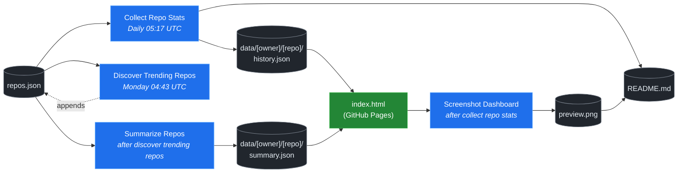

# 🚀 Rising Repos Tracker

> Automatically tracks daily GitHub stats (stars, forks, issues, velocity) for rising open source repos.

[](https://www.telosignal.com/)


**[→ View Live Dashboard](https://patrick-creates.github.io/rising-repos-tracker/)**

Built and maintained by [Telosignal](https://www.telosignal.com/).


<!-- AUTOGEN-STATS-START -->
## 📊 Current snapshot

> Auto-updated daily — last refreshed 2026-09-08

| Metric | Value |
|---|---|
| Repos tracked | **194** |
| Total stars | **9,504,765** |
| Total forks | **1,396,991** |
| Fastest growing | **ponytail** (+1070.7/day) |

### 🔥 Top 5 by velocity

| # | Repo | Stars | Stars/day |
|---|---|---:|---:|
| 1 | [DietrichGebert/ponytail](https://github.com/DietrichGebert/ponytail) | 131,534 | +1070.7 |
| 2 | [NousResearch/hermes-agent](https://github.com/NousResearch/hermes-agent) | 243,206 | +806.4 |
| 3 | [stablyai/orca](https://github.com/stablyai/orca) | 63,869 | +801.3 |
| 4 | [diegosouzapw/OmniRoute](https://github.com/diegosouzapw/OmniRoute) | 62,689 | +789.6 |
| 5 | [debpalash/VoiceStudio](https://github.com/debpalash/VoiceStudio) | 21,006 | +787.0 |

### 🆕 Recently added

- [career-ops-hq/career-ops](https://github.com/career-ops-hq/career-ops) — added 2026-09-07 — Open-source AI job search: scan job portals, evaluate listings into a structured A-H report with a global 1-5 score, tailor your CV, track applications — runs locally in your AI coding CLI (Claude Code, Codex, OpenCode, Antigravity…)
- [K-Dense-AI/scientific-agent-skills](https://github.com/K-Dense-AI/scientific-agent-skills) — added 2026-09-07 — Turn any AI agent into an AI Scientist. The #1 Agent Skills library for science, used by 190,000+ scientists worldwide. 165 ready-to-use validated skills plus 100+ scientific databases covering biology, chemistry, medicine, and drug discovery. Compatible with Cursor, Claude Code, Codex, Pi, Antigravity, and the open Agent Skills standard.
- [Hmbown/Codewhale](https://github.com/Hmbown/Codewhale) — added 2026-09-07 — Open-source coding agent for your terminal, built in Rust and on a journey of continuous community improvement. Issues and PRs welcome.
<!-- AUTOGEN-STATS-END -->

<!-- AUTOGEN-DIAGRAM-START -->
## 🔄 How it works


```mermaid
graph LR
    repos[("repos.json")]:::data
    history[("data/[owner]/[repo]/<br/>history.json")]:::data
    summary[("data/[owner]/[repo]/<br/>summary.json")]:::data
    readme[("README.md")]:::data
    preview[("preview.png")]:::data
    dashboard["index.html<br/>(GitHub Pages)"]:::output
    collect_yml["Collect Repo Stats<br/><i>Daily 05:17 UTC</i>"]:::workflow
    discover_yml["Discover Trending Repos<br/><i>Monday 04:43 UTC</i>"]:::workflow
    screenshot_yml["Screenshot Dashboard<br/><i>after collect repo stats</i>"]:::workflow
    summarize_yml["Summarize Repos<br/><i>after discover trending repos</i>"]:::workflow
    repos --> collect_yml
    collect_yml --> history
    collect_yml --> readme
    repos --> discover_yml
    discover_yml -.->|appends| repos
    dashboard --> screenshot_yml
    screenshot_yml --> preview
    repos --> summarize_yml
    summarize_yml --> summary
    history --> dashboard
    summary --> dashboard
    preview --> readme
    classDef workflow fill:#1f6feb,stroke:#58a6ff,color:#fff
    classDef data fill:#21262d,stroke:#7d8590,color:#e6edf3
    classDef output fill:#238636,stroke:#3fb950,color:#fff
```
<!-- AUTOGEN-DIAGRAM-END -->

<!-- AUTOGEN-WORKFLOWS-START -->
## ⚙️ Workflows

| File | Schedule | Name |
|---|---|---|
| `collect.yml` | Daily 05:17 UTC | Collect Repo Stats |
| `discover.yml` | Monday 04:43 UTC | Discover Trending Repos |
| `screenshot.yml` | After Collect Repo Stats | Screenshot Dashboard |
| `summarize.yml` | After Discover Trending Repos | Summarize Repos |

> All workflows commit results directly back to the repo. Schedules are best-effort — GitHub Actions cron can drift by a few minutes.
<!-- AUTOGEN-WORKFLOWS-END -->

<!-- AUTOGEN-REPOS-START -->
## 📋 All tracked repos

| Repo | Stars | Forks | Stars/day |
|---|---:|---:|---:|
| [openclaw/openclaw](https://github.com/openclaw/openclaw) | 389,185 | 81,777 | +150.1 |
| [obra/superpowers](https://github.com/obra/superpowers) | 283,002 | 25,360 | +608.0 |
| [affaan-m/everything-claude-code](https://github.com/affaan-m/everything-claude-code) | 253,454 | 38,015 | +613.6 |
| [affaan-m/ECC](https://github.com/affaan-m/ECC) | 253,454 | 38,016 | +577.6 |
| [NousResearch/hermes-agent](https://github.com/NousResearch/hermes-agent) | 243,206 | 50,101 | +806.4 |
| [Significant-Gravitas/AutoGPT](https://github.com/Significant-Gravitas/AutoGPT) | 187,196 | 46,036 | +24.7 |
| [microsoft/markitdown](https://github.com/microsoft/markitdown) | 181,131 | 13,306 | +492.6 |
| [f/prompts.chat](https://github.com/f/prompts.chat) | 169,632 | 21,822 | +63.2 |
| [langgenius/dify](https://github.com/langgenius/dify) | 154,955 | 24,477 | +116.4 |
| [open-webui/open-webui](https://github.com/open-webui/open-webui) | 151,295 | 22,121 | +122.1 |
| [langchain-ai/langchain](https://github.com/langchain-ai/langchain) | 145,919 | 24,372 | +78.7 |
| [github/spec-kit](https://github.com/github/spec-kit) | 134,008 | 12,058 | +306.3 |
| [farion1231/cc-switch](https://github.com/farion1231/cc-switch) | 131,659 | 9,067 | +509.9 |
| [DietrichGebert/ponytail](https://github.com/DietrichGebert/ponytail) | 131,534 | 7,047 | +1070.7 |
| [nextlevelbuilder/ui-ux-pro-max-skill](https://github.com/nextlevelbuilder/ui-ux-pro-max-skill) | 125,949 | 13,471 | +407.3 |
| [microsoft/generative-ai-for-beginners](https://github.com/microsoft/generative-ai-for-beginners) | 119,385 | 62,870 | +73.2 |
| [Graphify-Labs/graphify](https://github.com/Graphify-Labs/graphify) | 115,843 | 11,238 | +445.2 |
| [JuliusBrussee/caveman](https://github.com/JuliusBrussee/caveman) | 104,241 | 6,050 | +378.1 |
| [nexu-io/open-design](https://github.com/nexu-io/open-design) | 94,813 | 10,958 | +448.1 |
| [thedotmack/claude-mem](https://github.com/thedotmack/claude-mem) | 93,444 | 8,209 | +153.1 |
| [ruvnet/RuView](https://github.com/ruvnet/RuView) | 92,773 | 12,309 | +253.6 |
| [vllm-project/vllm](https://github.com/vllm-project/vllm) | 91,228 | 21,887 | +96.1 |
| [ChatGPTNextWeb/NextChat](https://github.com/ChatGPTNextWeb/NextChat) | 88,718 | 59,117 | +6.0 |
| [OpenHands/OpenHands](https://github.com/OpenHands/OpenHands) | 86,792 | 11,370 | +113.8 |
| [koala73/worldmonitor](https://github.com/koala73/worldmonitor) | 85,811 | 12,967 | +278.3 |
| [Leonxlnx/taste-skill](https://github.com/Leonxlnx/taste-skill) | 85,294 | 5,842 | +554.4 |
| [lobehub/lobehub](https://github.com/lobehub/lobehub) | 82,311 | 15,858 | +45.0 |
| [rtk-ai/rtk](https://github.com/rtk-ai/rtk) | 79,381 | 5,023 | +263.7 |
| [Panniantong/Agent-Reach](https://github.com/Panniantong/Agent-Reach) | 78,730 | 6,784 | +600.6 |
| [dair-ai/Prompt-Engineering-Guide](https://github.com/dair-ai/Prompt-Engineering-Guide) | 78,097 | 8,575 | +30.1 |
| [datawhalechina/hello-agents](https://github.com/datawhalechina/hello-agents) | 77,690 | 9,654 | +239.2 |
| [shareAI-lab/learn-claude-code](https://github.com/shareAI-lab/learn-claude-code) | 76,318 | 12,278 | +134.9 |
| [openai/openai-cookbook](https://github.com/openai/openai-cookbook) | 75,846 | 12,825 | +19.8 |
| [unslothai/unsloth](https://github.com/unslothai/unsloth) | 75,801 | 6,899 | +100.0 |
| [ComposioHQ/awesome-claude-skills](https://github.com/ComposioHQ/awesome-claude-skills) | 74,656 | 8,610 | +126.3 |
| [santifer/career-ops](https://github.com/santifer/career-ops) | 70,496 | 13,327 | +223.5 |
| [career-ops-hq/career-ops](https://github.com/career-ops-hq/career-ops) | 70,496 | 13,327 | +114.0 |
| [chopratejas/headroom](https://github.com/chopratejas/headroom) | 70,428 | 5,415 | +497.2 |
| [headroomlabs-ai/headroom](https://github.com/headroomlabs-ai/headroom) | 70,428 | 5,415 | +314.4 |
| [code-yeongyu/oh-my-openagent](https://github.com/code-yeongyu/oh-my-openagent) | 68,806 | 5,651 | +92.7 |
| [Fission-AI/OpenSpec](https://github.com/Fission-AI/OpenSpec) | 67,620 | 4,646 | +166.7 |
| [xtekky/gpt4free](https://github.com/xtekky/gpt4free) | 66,658 | 13,514 | +3.7 |
| [shanraisshan/claude-code-best-practice](https://github.com/shanraisshan/claude-code-best-practice) | 65,752 | 6,530 | +108.4 |
| [ZhuLinsen/daily_stock_analysis](https://github.com/ZhuLinsen/daily_stock_analysis) | 64,772 | 54,285 | +244.7 |
| [asgeirtj/system_prompts_leaks](https://github.com/asgeirtj/system_prompts_leaks) | 64,406 | 10,574 | +212.6 |
| [stablyai/orca](https://github.com/stablyai/orca) | 63,869 | 4,234 | +801.3 |
| [diegosouzapw/OmniRoute](https://github.com/diegosouzapw/OmniRoute) | 62,689 | 8,762 | +789.6 |
| [mvanhorn/last30days-skill](https://github.com/mvanhorn/last30days-skill) | 61,575 | 5,380 | +314.2 |
| [tw93/Pake](https://github.com/tw93/Pake) | 61,340 | 12,628 | +111.2 |
| [usestrix/strix](https://github.com/usestrix/strix) | 61,190 | 6,697 | +358.4 |
| [MemPalace/mempalace](https://github.com/MemPalace/mempalace) | 58,925 | 7,549 | +57.7 |
| [BerriAI/litellm](https://github.com/BerriAI/litellm) | 58,269 | 11,272 | +96.3 |
| [calesthio/OpenMontage](https://github.com/calesthio/OpenMontage) | 56,625 | 7,124 | +405.3 |
| [FlowiseAI/Flowise](https://github.com/FlowiseAI/Flowise) | 55,431 | 24,980 | +22.4 |
| [hesreallyhim/awesome-claude-code](https://github.com/hesreallyhim/awesome-claude-code) | 53,679 | 4,681 | +84.8 |
| [ggml-org/whisper.cpp](https://github.com/ggml-org/whisper.cpp) | 53,521 | 6,136 | +32.7 |
| [rohitg00/ai-engineering-from-scratch](https://github.com/rohitg00/ai-engineering-from-scratch) | 52,999 | 9,263 | +269.1 |
| [jamiepine/voicebox](https://github.com/jamiepine/voicebox) | 52,601 | 6,559 | +238.2 |
| [ChromeDevTools/chrome-devtools-mcp](https://github.com/ChromeDevTools/chrome-devtools-mcp) | 51,328 | 3,614 | +101.3 |
| [router-for-me/CLIProxyAPI](https://github.com/router-for-me/CLIProxyAPI) | 50,958 | 7,733 | +153.0 |
| [elder-plinius/CL4R1T4S](https://github.com/elder-plinius/CL4R1T4S) | 49,169 | 10,119 | +120.9 |
| [Aider-AI/aider](https://github.com/Aider-AI/aider) | 48,827 | 4,931 | +34.2 |
| [coreyhaines31/marketingskills](https://github.com/coreyhaines31/marketingskills) | 48,417 | 7,463 | +171.5 |
| [kepano/obsidian-skills](https://github.com/kepano/obsidian-skills) | 48,017 | 3,434 | +142.8 |
| [HKUDS/nanobot](https://github.com/HKUDS/nanobot) | 47,877 | 8,451 | +46.0 |
| [QuantumNous/new-api](https://github.com/QuantumNous/new-api) | 47,592 | 11,375 | +115.4 |
| [heygen-com/hyperframes](https://github.com/heygen-com/hyperframes) | 47,145 | 4,368 | +234.6 |
| [Imbad0202/academic-research-skills](https://github.com/Imbad0202/academic-research-skills) | 46,942 | 3,670 | +168.6 |
| [zhayujie/CowAgent](https://github.com/zhayujie/CowAgent) | 46,829 | 10,345 | +20.1 |
| [sickn33/antigravity-awesome-skills](https://github.com/sickn33/antigravity-awesome-skills) | 46,144 | 6,742 | +70.4 |
| [sickn33/agentic-awesome-skills](https://github.com/sickn33/agentic-awesome-skills) | 46,144 | 6,742 | +54.4 |
| [bojieli/ai-agent-book](https://github.com/bojieli/ai-agent-book) | 45,225 | 5,022 | +745.4 |
| [K-Dense-AI/scientific-agent-skills](https://github.com/K-Dense-AI/scientific-agent-skills) | 43,743 | 3,978 | +267.0 |
| [danny-avila/LibreChat](https://github.com/danny-avila/LibreChat) | 42,918 | 8,894 | +51.4 |
| [DeusData/codebase-memory-mcp](https://github.com/DeusData/codebase-memory-mcp) | 42,629 | 3,483 | +309.8 |
| [chatanywhere/GPT_API_free](https://github.com/chatanywhere/GPT_API_free) | 42,065 | 2,718 | +36.9 |
| [chatboxai/chatbox](https://github.com/chatboxai/chatbox) | 41,691 | 4,238 | +15.0 |
| [MadsLorentzen/ai-job-search](https://github.com/MadsLorentzen/ai-job-search) | 41,311 | 14,153 | +346.1 |
| [langchain-ai/langgraph](https://github.com/langchain-ai/langgraph) | 41,242 | 6,963 | +74.6 |
| [Hmbown/CodeWhale](https://github.com/Hmbown/CodeWhale) | 40,932 | 3,552 | +59.1 |
| [Hmbown/Codewhale](https://github.com/Hmbown/Codewhale) | 40,932 | 3,552 | +16.0 |
| [AstrBotDevs/AstrBot](https://github.com/AstrBotDevs/AstrBot) | 40,201 | 2,889 | +66.8 |
| [mindsdb/mindshub](https://github.com/mindsdb/mindshub) | 39,711 | 6,239 | +5.4 |
| [tinyhumansai/openhuman](https://github.com/tinyhumansai/openhuman) | 39,508 | 3,895 | +19.0 |
| [wshobson/agents](https://github.com/wshobson/agents) | 39,490 | 4,214 | +33.5 |
| [Yeachan-Heo/oh-my-claudecode](https://github.com/Yeachan-Heo/oh-my-claudecode) | 39,051 | 3,498 | +39.9 |
| [github/awesome-copilot](https://github.com/github/awesome-copilot) | 38,759 | 4,908 | +46.7 |
| [google/langextract](https://github.com/google/langextract) | 38,547 | 2,703 | +18.8 |
| [songquanpeng/one-api](https://github.com/songquanpeng/one-api) | 36,779 | 6,852 | +24.2 |
| [PDFMathTranslate/PDFMathTranslate](https://github.com/PDFMathTranslate/PDFMathTranslate) | 36,776 | 3,305 | +26.1 |
| [ogulcancelik/herdr](https://github.com/ogulcancelik/herdr) | 36,383 | 2,665 | +374.8 |
| [herdrdev/herdr](https://github.com/herdrdev/herdr) | 36,383 | 2,665 | +349.8 |
| [anthropics/claude-plugins-official](https://github.com/anthropics/claude-plugins-official) | 36,034 | 4,035 | +70.9 |
| [volcengine/OpenViking](https://github.com/volcengine/OpenViking) | 36,013 | 2,746 | +116.1 |
| [esengine/DeepSeek-Reasonix](https://github.com/esengine/DeepSeek-Reasonix) | 35,452 | 2,379 | +173.1 |
| [AlexsJones/llmfit](https://github.com/AlexsJones/llmfit) | 35,055 | 2,205 | +81.4 |
| [agentscope-ai/QwenPaw](https://github.com/agentscope-ai/QwenPaw) | 35,049 | 3,076 | +203.2 |
| [JCodesMore/ai-website-cloner-template](https://github.com/JCodesMore/ai-website-cloner-template) | 34,029 | 4,977 | +200.4 |
| [HKUDS/Vibe-Trading](https://github.com/HKUDS/Vibe-Trading) | 33,029 | 5,387 | +257.6 |
| [Gitlawb/openclaude](https://github.com/Gitlawb/openclaude) | 32,987 | 9,067 | +49.0 |
| [zeroclaw-labs/zeroclaw](https://github.com/zeroclaw-labs/zeroclaw) | 32,743 | 4,932 | +10.8 |
| [iOfficeAI/AionUi](https://github.com/iOfficeAI/AionUi) | 32,676 | 3,363 | +53.8 |
| [mukul975/Anthropic-Cybersecurity-Skills](https://github.com/mukul975/Anthropic-Cybersecurity-Skills) | 32,394 | 3,909 | +183.0 |
| [tirth8205/code-review-graph](https://github.com/tirth8205/code-review-graph) | 31,251 | 2,843 | +149.8 |
| [p-e-w/heretic](https://github.com/p-e-w/heretic) | 30,875 | 3,430 | +75.0 |
| [googleworkspace/cli](https://github.com/googleworkspace/cli) | 30,781 | 1,802 | +41.0 |
| [iOfficeAI/OfficeCLI](https://github.com/iOfficeAI/OfficeCLI) | 30,285 | 2,067 | +342.0 |
| [can1357/oh-my-pi](https://github.com/can1357/oh-my-pi) | 30,096 | 3,079 | +206.4 |
| [langchain-ai/deepagents](https://github.com/langchain-ai/deepagents) | 29,143 | 4,091 | +54.2 |
| [jackwener/OpenCLI](https://github.com/jackwener/OpenCLI) | 29,091 | 2,851 | +57.5 |
| [virgiliojr94/book-to-skill](https://github.com/virgiliojr94/book-to-skill) | 29,056 | 3,025 | +281.8 |
| [alibaba/page-agent](https://github.com/alibaba/page-agent) | 29,009 | 2,600 | +123.0 |
| [voideditor/void](https://github.com/voideditor/void) | 28,809 | 2,650 | +0.0 |
| [rohitg00/agentmemory](https://github.com/rohitg00/agentmemory) | 28,155 | 2,439 | +68.8 |
| [BloopAI/vibe-kanban](https://github.com/BloopAI/vibe-kanban) | 28,036 | 3,004 | +13.4 |
| [jarrodwatts/claude-hud](https://github.com/jarrodwatts/claude-hud) | 27,869 | 1,293 | +34.6 |
| [decolua/9router](https://github.com/decolua/9router) | 27,850 | 5,067 | +120.9 |
| [manaflow-ai/cmux](https://github.com/manaflow-ai/cmux) | 26,897 | 2,330 | +44.6 |
| [zai-org/Open-AutoGLM](https://github.com/zai-org/Open-AutoGLM) | 26,189 | 4,030 | +7.9 |
| [TencentCloud/TencentDB-Agent-Memory](https://github.com/TencentCloud/TencentDB-Agent-Memory) | 26,151 | 2,449 | +305.8 |
| [toon-format/toon](https://github.com/toon-format/toon) | 25,337 | 1,118 | +9.1 |
| [pascalorg/editor](https://github.com/pascalorg/editor) | 22,564 | 2,877 | +45.3 |
| [winfunc/opcode](https://github.com/winfunc/opcode) | 22,395 | 1,725 | +4.2 |
| [pranshuparmar/witr](https://github.com/pranshuparmar/witr) | 22,130 | 773 | +57.7 |
| [alibaba/open-code-review](https://github.com/alibaba/open-code-review) | 22,081 | 1,646 | +189.0 |
| [Tencent/WeKnora](https://github.com/Tencent/WeKnora) | 21,798 | 3,149 | +64.8 |
| [coze-dev/coze-studio](https://github.com/coze-dev/coze-studio) | 21,561 | 3,116 | +6.7 |
| [jundot/omlx](https://github.com/jundot/omlx) | 21,516 | 1,836 | +57.5 |
| [NirDiamant/agents-towards-production](https://github.com/NirDiamant/agents-towards-production) | 21,426 | 2,844 | +8.6 |
| [guillaumemeyer/watermarks-remover](https://github.com/guillaumemeyer/watermarks-remover) | 21,310 | 2,453 | +250.5 |
| [mksglu/context-mode](https://github.com/mksglu/context-mode) | 21,147 | 1,533 | +43.3 |
| [steipete/CodexBar](https://github.com/steipete/CodexBar) | 21,080 | 1,862 | +75.3 |
| [debpalash/VoiceStudio](https://github.com/debpalash/VoiceStudio) | 21,006 | 2,616 | +787.0 |
| [KKKKhazix/khazix-skills](https://github.com/KKKKhazix/khazix-skills) | 20,514 | 2,190 | +61.1 |
| [jnMetaCode/agency-agents-zh](https://github.com/jnMetaCode/agency-agents-zh) | 20,391 | 3,298 | +63.9 |
| [tanweai/pua](https://github.com/tanweai/pua) | 19,599 | 1,195 | +15.9 |
| [1jehuang/jcode](https://github.com/1jehuang/jcode) | 19,325 | 2,221 | +193.3 |
| [datawhalechina/easy-vibe](https://github.com/datawhalechina/easy-vibe) | 19,315 | 1,852 | +27.9 |
| [danielmiessler/LifeOS](https://github.com/danielmiessler/LifeOS) | 18,933 | 2,454 | +36.8 |
| [t8y2/dbx](https://github.com/t8y2/dbx) | 18,273 | 1,794 | +149.7 |
| [RightNow-AI/openfang](https://github.com/RightNow-AI/openfang) | 18,170 | 2,293 | +4.0 |
| [nesquena/hermes-webui](https://github.com/nesquena/hermes-webui) | 18,170 | 2,551 | +42.7 |
| [microsoft/agent-lightning](https://github.com/microsoft/agent-lightning) | 18,026 | 1,579 | +8.4 |
| [browser-use/browser-harness](https://github.com/browser-use/browser-harness) | 17,420 | 1,697 | +27.3 |
| [jlcodes99/cockpit-tools](https://github.com/jlcodes99/cockpit-tools) | 17,298 | 1,527 | +63.0 |
| [cft0808/edict](https://github.com/cft0808/edict) | 16,851 | 1,764 | +9.3 |
| [MemoriLabs/Memori](https://github.com/MemoriLabs/Memori) | 16,494 | 3,356 | +14.8 |
| [composio-community/awesome-codex-skills](https://github.com/composio-community/awesome-codex-skills) | 16,315 | 1,597 | +20.8 |
| [xbtlin/ai-berkshire](https://github.com/xbtlin/ai-berkshire) | 16,237 | 2,427 | +85.3 |
| [wanshuiyin/Auto-claude-code-research-in-sleep](https://github.com/wanshuiyin/Auto-claude-code-research-in-sleep) | 15,857 | 1,373 | +43.4 |
| [xpzouying/xiaohongshu-mcp](https://github.com/xpzouying/xiaohongshu-mcp) | 15,692 | 2,307 | +18.0 |
| [Anionex/banana-slides](https://github.com/Anionex/banana-slides) | 15,563 | 1,784 | +5.3 |
| [walkinglabs/learn-harness-engineering](https://github.com/walkinglabs/learn-harness-engineering) | 14,957 | 1,489 | +79.3 |
| [yusufkaraaslan/Skill_Seekers](https://github.com/yusufkaraaslan/Skill_Seekers) | 14,934 | 1,519 | +9.1 |
| [kyegomez/OpenMythos](https://github.com/kyegomez/OpenMythos) | 14,892 | 3,293 | +9.4 |
| [NevaMind-AI/memU](https://github.com/NevaMind-AI/memU) | 14,391 | 1,064 | +6.3 |
| [NanmiCoder/cc-haha](https://github.com/NanmiCoder/cc-haha) | 14,300 | 8,542 | +11.8 |
| [superset-sh/superset](https://github.com/superset-sh/superset) | 13,913 | 1,254 | +24.7 |
| [ifixai-ai/iFixAi](https://github.com/ifixai-ai/iFixAi) | 13,258 | 1,288 | +175.3 |
| [XiaomiMiMo/MiMo-Code](https://github.com/XiaomiMiMo/MiMo-Code) | 12,964 | 1,338 | +27.3 |
| [sirmalloc/ccstatusline](https://github.com/sirmalloc/ccstatusline) | 12,799 | 561 | +21.4 |
| [EverMind-AI/EverOS](https://github.com/EverMind-AI/EverOS) | 12,779 | 912 | +43.2 |
| [ConardLi/garden-skills](https://github.com/ConardLi/garden-skills) | 12,252 | 1,481 | +48.0 |
| [0x4m4/hexstrike-ai](https://github.com/0x4m4/hexstrike-ai) | 11,651 | 2,411 | +23.1 |
| [brokermr810/QuantDinger](https://github.com/brokermr810/QuantDinger) | 11,413 | 2,376 | +33.3 |
| [OpenByteInc/QuantDinger](https://github.com/OpenByteInc/QuantDinger) | 11,413 | 2,376 | +32.2 |
| [MemTensor/MemOS](https://github.com/MemTensor/MemOS) | 11,228 | 1,030 | +16.9 |
| [holaboss-ai/holaOS](https://github.com/holaboss-ai/holaOS) | 11,180 | 721 | +127.7 |
| [aden-hive/hive](https://github.com/aden-hive/hive) | 11,020 | 5,666 | +5.7 |
| [ValueCell-ai/valuecell](https://github.com/ValueCell-ai/valuecell) | 11,003 | 1,802 | +1.8 |
| [EKKOLearnAI/hermes-studio](https://github.com/EKKOLearnAI/hermes-studio) | 10,936 | 1,317 | +32.4 |
| [getagentseal/codeburn](https://github.com/getagentseal/codeburn) | 10,897 | 816 | +37.9 |
| [openai/codex-security](https://github.com/openai/codex-security) | 10,566 | 769 | +63.4 |
| [Kuberwastaken/claurst](https://github.com/Kuberwastaken/claurst) | 10,292 | 7,750 | +6.0 |
| [ykdojo/claude-code-tips](https://github.com/ykdojo/claude-code-tips) | 10,055 | 810 | +16.2 |
| [StarTrail-org/PixelRAG](https://github.com/StarTrail-org/PixelRAG) | 9,901 | 852 | +58.2 |
| [frankbria/ralph-claude-code](https://github.com/frankbria/ralph-claude-code) | 9,623 | 720 | +4.3 |
| [modem-dev/hunk](https://github.com/modem-dev/hunk) | 9,165 | 286 | +43.2 |
| [EvoMap/evolver](https://github.com/EvoMap/evolver) | 9,101 | 844 | +3.8 |
| [iflytek/astron-agent](https://github.com/iflytek/astron-agent) | 8,949 | 873 | +5.3 |
| [MiroMindAI/MiroThinker](https://github.com/MiroMindAI/MiroThinker) | 8,368 | 643 | +0.7 |
| [mmulet/term.everything](https://github.com/mmulet/term.everything) | 8,095 | 195 | +1.1 |
| [ValueCell-ai/ClawX](https://github.com/ValueCell-ai/ClawX) | 7,613 | 1,145 | +1.3 |
| [1weiho/open-slide](https://github.com/1weiho/open-slide) | 7,462 | 531 | +46.3 |
| [rorkai/App-Store-Connect-CLI](https://github.com/rorkai/App-Store-Connect-CLI) | 7,033 | 587 | +135.0 |
| [opensquilla/opensquilla](https://github.com/opensquilla/opensquilla) | 6,983 | 558 | +15.5 |
| [TokenRhythm/opensquilla](https://github.com/TokenRhythm/opensquilla) | 6,983 | 558 | +15.0 |
| [WenyuChiou/awesome-agentic-ai-zh](https://github.com/WenyuChiou/awesome-agentic-ai-zh) | 6,713 | 911 | +20.3 |
| [steipete/summarize](https://github.com/steipete/summarize) | 6,600 | 445 | +3.3 |
| [Andyyyy64/whichllm](https://github.com/Andyyyy64/whichllm) | 6,598 | 361 | +14.6 |
| [Arthur-Ficial/apfel](https://github.com/Arthur-Ficial/apfel) | 6,357 | 243 | +4.2 |
| [microsoft/fara](https://github.com/microsoft/fara) | 6,171 | 603 | +3.0 |
| [UfoMiao/zcf](https://github.com/UfoMiao/zcf) | 6,081 | 422 | +0.2 |
| [re4/LibreCode](https://github.com/re4/LibreCode) | 87 | 5 | — |
<!-- AUTOGEN-REPOS-END -->

---

## What it does

- Collects daily snapshots of stars, forks, watchers and open issues for every tracked repo
- Discovers new trending repos automatically every Monday using the GitHub Search API
- Generates AI summaries (use cases, similar tools, tags) for each tracked repo via GitHub Models
- Stores all history as plain JSON — no database, no backend
- Renders a live dashboard via GitHub Pages — updates daily, zero maintenance

## Tracked repos

Data lives in [`data/`](./data) — one folder per repo, one `history.json` per entry.  
The full watch list is in [`repos.json`](./repos.json).

## Fork & use it for yourself

This is my personal tracker — the watch list reflects what I find interesting. If you want to track different repos, the best path is to **fork this repo and run your own**.

### Setup

1. Fork this repo to your account
2. Replace the contents of [`repos.json`](./repos.json) with the repos you want to track (or just leave one entry — `discover.yml` will auto-add more every Monday)
3. Go to **Settings → Pages** and enable GitHub Pages from the `main` branch
4. Go to **Actions** and run **Collect Repo Stats** once manually to seed your first data point
5. Your dashboard will be live at `https://YOUR-USERNAME.github.io/rising-repos-tracker/`

That's it — daily collection and weekly discovery run automatically on schedule. Zero ongoing maintenance.

### Customizing what gets discovered

Edit [`scripts/discover.js`](./scripts/discover.js) to change:

- `MIN_STARS` — minimum star threshold for candidates
- `MAX_AGE_DAYS` — how recent a repo must be
- `MAX_NEW_REPOS` — how many to add per discovery run
- The `queries` array — GitHub Search API queries that define what "trending" means to you

### Adding a repo manually

Just edit `repos.json` directly:

```json
{
  "owner": "OWNER",
  "repo": "REPO",
  "added": "YYYY-MM-DD",
  "notes": "why you're tracking this"
}
```

The next daily collect run picks it up automatically.

## Stack

- **GitHub Actions** — scheduling and automation
- **GitHub Pages** — dashboard hosting
- **GitHub API** — data source
- **GitHub Models** — free AI summaries (gpt-4o-mini)
- **Chart.js** — star growth visualization
- **Mermaid** — architecture diagram (rendered by GitHub)
- No dependencies, no build step, no database

## License

MIT
