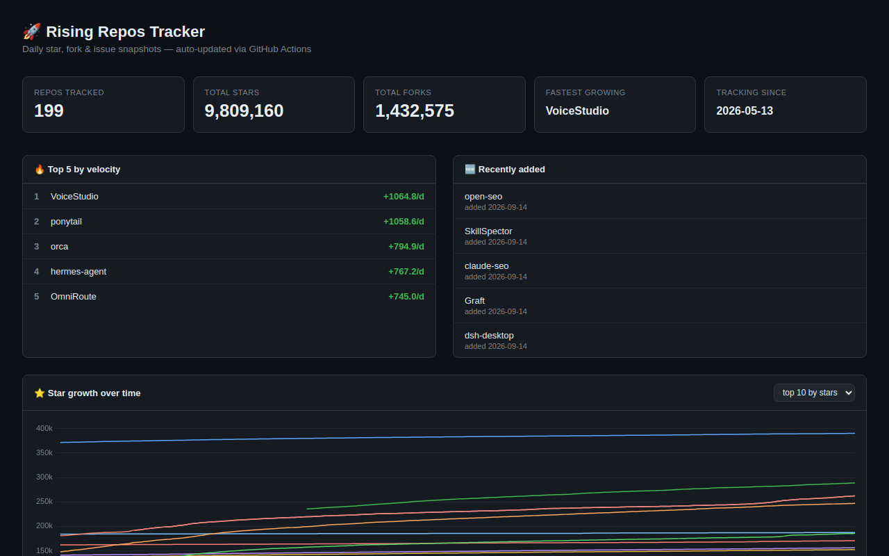
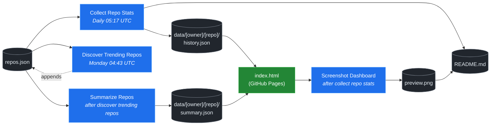

# 🚀 Rising Repos Tracker

> Automatically tracks daily GitHub stats (stars, forks, issues, velocity) for rising open source repos.

[](https://www.telosignal.com/)


**[→ View Live Dashboard](https://patrick-creates.github.io/rising-repos-tracker/)**

Built and maintained by [Telosignal](https://www.telosignal.com/).



<!-- AUTOGEN-STATS-START -->
## 📊 Current snapshot

> Auto-updated daily — last refreshed 2026-08-16

| Metric | Value |
|---|---|
| Repos tracked | **183** |
| Total stars | **8,765,343** |
| Total forks | **1,307,098** |
| Fastest growing | **ai-agent-book** (+1100.3/day) |

### 🔥 Top 5 by velocity

| # | Repo | Stars | Stars/day |
|---|---|---:|---:|
| 1 | [bojieli/ai-agent-book](https://github.com/bojieli/ai-agent-book) | 37,661 | +1100.3 |
| 2 | [DietrichGebert/ponytail](https://github.com/DietrichGebert/ponytail) | 103,484 | +1008.5 |
| 3 | [diegosouzapw/OmniRoute](https://github.com/diegosouzapw/OmniRoute) | 48,683 | +891.0 |
| 4 | [NousResearch/hermes-agent](https://github.com/NousResearch/hermes-agent) | 231,166 | +875.0 |
| 5 | [stablyai/orca](https://github.com/stablyai/orca) | 46,212 | +820.2 |

### 🆕 Recently added

- [pascalorg/editor](https://github.com/pascalorg/editor) — added 2026-08-10 — Create and share 3D architectural projects.
- [jlcodes99/cockpit-tools](https://github.com/jlcodes99/cockpit-tools) — added 2026-08-10 —  🚀 通用 AI IDE 账号管理工具：支持 Antigravity / Codex / GitHub Copilot / Windsurf / Kiro / Cursor / Gemini-cli / CodeBuddy，多账号切换、配额监控、自动唤醒与多开实例管理。 🚀 Universal AI IDE account manager for Antigravity / Codex / GitHub Copilot / Windsurf / Kiro / Cursor / Gemini-cli / CodeBuddy, with multi-account switching, quota monitoring, wake-up automation, and multi-insta
- [ifixai-ai/iFixAi](https://github.com/ifixai-ai/iFixAi) — added 2026-08-10 — Independent Auditing of AI Agents. Run by human or the agent itself, to answer the most crucial question in the AI Agent Economy. Is the agent doing what is supposed to do? With iFixAi you can have this answer in less than 120 seconds.
<!-- AUTOGEN-STATS-END -->

<!-- AUTOGEN-DIAGRAM-START -->
## 🔄 How it works


```mermaid
graph LR
    repos[("repos.json")]:::data
    history[("data/[owner]/[repo]/<br/>history.json")]:::data
    summary[("data/[owner]/[repo]/<br/>summary.json")]:::data
    readme[("README.md")]:::data
    preview[("preview.png")]:::data
    dashboard["index.html<br/>(GitHub Pages)"]:::output
    collect_yml["Collect Repo Stats<br/><i>Daily 05:17 UTC</i>"]:::workflow
    discover_yml["Discover Trending Repos<br/><i>Monday 04:43 UTC</i>"]:::workflow
    screenshot_yml["Screenshot Dashboard<br/><i>after collect repo stats</i>"]:::workflow
    summarize_yml["Summarize Repos<br/><i>after discover trending repos</i>"]:::workflow
    repos --> collect_yml
    collect_yml --> history
    collect_yml --> readme
    repos --> discover_yml
    discover_yml -.->|appends| repos
    dashboard --> screenshot_yml
    screenshot_yml --> preview
    repos --> summarize_yml
    summarize_yml --> summary
    history --> dashboard
    summary --> dashboard
    preview --> readme
    classDef workflow fill:#1f6feb,stroke:#58a6ff,color:#fff
    classDef data fill:#21262d,stroke:#7d8590,color:#e6edf3
    classDef output fill:#238636,stroke:#3fb950,color:#fff
```
<!-- AUTOGEN-DIAGRAM-END -->

<!-- AUTOGEN-WORKFLOWS-START -->
## ⚙️ Workflows

| File | Schedule | Name |
|---|---|---|
| `collect.yml` | Daily 05:17 UTC | Collect Repo Stats |
| `discover.yml` | Monday 04:43 UTC | Discover Trending Repos |
| `screenshot.yml` | After Collect Repo Stats | Screenshot Dashboard |
| `summarize.yml` | After Discover Trending Repos | Summarize Repos |

> All workflows commit results directly back to the repo. Schedules are best-effort — GitHub Actions cron can drift by a few minutes.
<!-- AUTOGEN-WORKFLOWS-END -->

<!-- AUTOGEN-REPOS-START -->
## 📋 All tracked repos

| Repo | Stars | Forks | Stars/day |
|---|---:|---:|---:|
| [openclaw/openclaw](https://github.com/openclaw/openclaw) | 386,424 | 81,210 | +157.4 |
| [obra/superpowers](https://github.com/obra/superpowers) | 272,555 | 24,373 | +672.3 |
| [affaan-m/everything-claude-code](https://github.com/affaan-m/everything-claude-code) | 240,328 | 36,469 | +624.0 |
| [affaan-m/ECC](https://github.com/affaan-m/ECC) | 240,328 | 36,469 | +579.5 |
| [NousResearch/hermes-agent](https://github.com/NousResearch/hermes-agent) | 231,166 | 45,926 | +875.0 |
| [Significant-Gravitas/AutoGPT](https://github.com/Significant-Gravitas/AutoGPT) | 186,629 | 46,067 | +24.7 |
| [microsoft/markitdown](https://github.com/microsoft/markitdown) | 173,956 | 12,709 | +536.3 |
| [f/prompts.chat](https://github.com/f/prompts.chat) | 167,240 | 21,588 | +53.3 |
| [langgenius/dify](https://github.com/langgenius/dify) | 152,563 | 24,082 | +119.3 |
| [open-webui/open-webui](https://github.com/open-webui/open-webui) | 148,889 | 21,678 | +126.3 |
| [langchain-ai/langchain](https://github.com/langchain-ai/langchain) | 144,308 | 24,024 | +80.8 |
| [github/spec-kit](https://github.com/github/spec-kit) | 129,281 | 11,558 | +330.7 |
| [farion1231/cc-switch](https://github.com/farion1231/cc-switch) | 127,460 | 8,704 | +593.5 |
| [microsoft/generative-ai-for-beginners](https://github.com/microsoft/generative-ai-for-beginners) | 117,818 | 62,164 | +74.4 |
| [nextlevelbuilder/ui-ux-pro-max-skill](https://github.com/nextlevelbuilder/ui-ux-pro-max-skill) | 117,096 | 12,596 | +412.7 |
| [Graphify-Labs/graphify](https://github.com/Graphify-Labs/graphify) | 106,790 | 10,389 | +504.6 |
| [DietrichGebert/ponytail](https://github.com/DietrichGebert/ponytail) | 103,484 | 5,692 | +1008.5 |
| [JuliusBrussee/caveman](https://github.com/JuliusBrussee/caveman) | 98,420 | 5,689 | +410.1 |
| [thedotmack/claude-mem](https://github.com/thedotmack/claude-mem) | 90,849 | 7,934 | +162.8 |
| [ruvnet/RuView](https://github.com/ruvnet/RuView) | 90,302 | 12,005 | +294.1 |
| [vllm-project/vllm](https://github.com/vllm-project/vllm) | 89,149 | 20,746 | +97.5 |
| [ChatGPTNextWeb/NextChat](https://github.com/ChatGPTNextWeb/NextChat) | 88,612 | 59,250 | +6.4 |
| [nexu-io/open-design](https://github.com/nexu-io/open-design) | 87,063 | 10,124 | +476.5 |
| [OpenHands/OpenHands](https://github.com/OpenHands/OpenHands) | 84,153 | 10,923 | +113.6 |
| [koala73/worldmonitor](https://github.com/koala73/worldmonitor) | 82,197 | 12,275 | +309.2 |
| [lobehub/lobehub](https://github.com/lobehub/lobehub) | 81,720 | 15,809 | +49.7 |
| [dair-ai/Prompt-Engineering-Guide](https://github.com/dair-ai/Prompt-Engineering-Guide) | 77,498 | 8,515 | +31.1 |
| [Leonxlnx/taste-skill](https://github.com/Leonxlnx/taste-skill) | 76,897 | 5,261 | +611.6 |
| [rtk-ai/rtk](https://github.com/rtk-ai/rtk) | 76,246 | 4,795 | +296.3 |
| [openai/openai-cookbook](https://github.com/openai/openai-cookbook) | 75,247 | 12,725 | +18.2 |
| [shareAI-lab/learn-claude-code](https://github.com/shareAI-lab/learn-claude-code) | 74,326 | 12,035 | +147.2 |
| [datawhalechina/hello-agents](https://github.com/datawhalechina/hello-agents) | 73,123 | 9,108 | +249.6 |
| [ComposioHQ/awesome-claude-skills](https://github.com/ComposioHQ/awesome-claude-skills) | 72,571 | 8,273 | +135.4 |
| [unslothai/unsloth](https://github.com/unslothai/unsloth) | 72,147 | 6,503 | +85.0 |
| [Panniantong/Agent-Reach](https://github.com/Panniantong/Agent-Reach) | 72,083 | 6,126 | +704.4 |
| [code-yeongyu/oh-my-openagent](https://github.com/code-yeongyu/oh-my-openagent) | 67,926 | 5,550 | +106.6 |
| [xtekky/gpt4free](https://github.com/xtekky/gpt4free) | 66,554 | 13,523 | +3.5 |
| [chopratejas/headroom](https://github.com/chopratejas/headroom) | 66,469 | 5,103 | +617.8 |
| [headroomlabs-ai/headroom](https://github.com/headroomlabs-ai/headroom) | 66,469 | 5,103 | +373.9 |
| [Fission-AI/OpenSpec](https://github.com/Fission-AI/OpenSpec) | 65,020 | 4,483 | +180.4 |
| [shanraisshan/claude-code-best-practice](https://github.com/shanraisshan/claude-code-best-practice) | 64,544 | 6,412 | +122.7 |
| [santifer/career-ops](https://github.com/santifer/career-ops) | 63,971 | 12,603 | +208.1 |
| [ZhuLinsen/daily_stock_analysis](https://github.com/ZhuLinsen/daily_stock_analysis) | 62,985 | 52,969 | +290.9 |
| [asgeirtj/system_prompts_leaks](https://github.com/asgeirtj/system_prompts_leaks) | 62,976 | 10,337 | +251.0 |
| [tw93/Pake](https://github.com/tw93/Pake) | 60,737 | 12,437 | +132.9 |
| [MemPalace/mempalace](https://github.com/MemPalace/mempalace) | 58,400 | 7,498 | +66.7 |
| [mvanhorn/last30days-skill](https://github.com/mvanhorn/last30days-skill) | 58,313 | 5,065 | +371.6 |
| [BerriAI/litellm](https://github.com/BerriAI/litellm) | 56,433 | 10,617 | +100.5 |
| [FlowiseAI/Flowise](https://github.com/FlowiseAI/Flowise) | 55,375 | 24,904 | +27.5 |
| [ggml-org/whisper.cpp](https://github.com/ggml-org/whisper.cpp) | 52,923 | 6,072 | +34.4 |
| [usestrix/strix](https://github.com/usestrix/strix) | 52,805 | 5,662 | +356.5 |
| [hesreallyhim/awesome-claude-code](https://github.com/hesreallyhim/awesome-claude-code) | 52,393 | 4,583 | +92.2 |
| [jamiepine/voicebox](https://github.com/jamiepine/voicebox) | 50,509 | 6,266 | +282.7 |
| [ChromeDevTools/chrome-devtools-mcp](https://github.com/ChromeDevTools/chrome-devtools-mcp) | 49,233 | 3,430 | +103.9 |
| [diegosouzapw/OmniRoute](https://github.com/diegosouzapw/OmniRoute) | 48,683 | 6,624 | +891.0 |
| [Aider-AI/aider](https://github.com/Aider-AI/aider) | 48,253 | 4,845 | +36.6 |
| [calesthio/OpenMontage](https://github.com/calesthio/OpenMontage) | 48,239 | 6,035 | +424.8 |
| [router-for-me/CLIProxyAPI](https://github.com/router-for-me/CLIProxyAPI) | 47,388 | 7,336 | +152.3 |
| [HKUDS/nanobot](https://github.com/HKUDS/nanobot) | 47,047 | 8,310 | +48.5 |
| [elder-plinius/CL4R1T4S](https://github.com/elder-plinius/CL4R1T4S) | 46,951 | 9,541 | +130.0 |
| [rohitg00/ai-engineering-from-scratch](https://github.com/rohitg00/ai-engineering-from-scratch) | 46,841 | 8,193 | +269.4 |
| [zhayujie/CowAgent](https://github.com/zhayujie/CowAgent) | 46,519 | 10,315 | +21.8 |
| [kepano/obsidian-skills](https://github.com/kepano/obsidian-skills) | 46,329 | 3,320 | +163.8 |
| [stablyai/orca](https://github.com/stablyai/orca) | 46,212 | 3,235 | +820.2 |
| [QuantumNous/new-api](https://github.com/QuantumNous/new-api) | 45,243 | 10,704 | +119.1 |
| [sickn33/antigravity-awesome-skills](https://github.com/sickn33/antigravity-awesome-skills) | 45,002 | 6,582 | +76.2 |
| [sickn33/agentic-awesome-skills](https://github.com/sickn33/agentic-awesome-skills) | 45,002 | 6,582 | +57.6 |
| [coreyhaines31/marketingskills](https://github.com/coreyhaines31/marketingskills) | 44,423 | 6,975 | +170.9 |
| [Imbad0202/academic-research-skills](https://github.com/Imbad0202/academic-research-skills) | 42,617 | 3,393 | +146.2 |
| [danny-avila/LibreChat](https://github.com/danny-avila/LibreChat) | 42,074 | 8,706 | +55.5 |
| [chatboxai/chatbox](https://github.com/chatboxai/chatbox) | 41,450 | 4,198 | +16.2 |
| [heygen-com/hyperframes](https://github.com/heygen-com/hyperframes) | 41,119 | 3,931 | +225.5 |
| [Hmbown/CodeWhale](https://github.com/Hmbown/CodeWhale) | 40,809 | 3,529 | +74.0 |
| [chatanywhere/GPT_API_free](https://github.com/chatanywhere/GPT_API_free) | 40,379 | 2,689 | +26.8 |
| [langchain-ai/langgraph](https://github.com/langchain-ai/langgraph) | 39,761 | 6,686 | +78.9 |
| [mindsdb/mindshub](https://github.com/mindsdb/mindshub) | 39,583 | 6,230 | +5.4 |
| [AstrBotDevs/AstrBot](https://github.com/AstrBotDevs/AstrBot) | 39,227 | 2,802 | +74.2 |
| [DeusData/codebase-memory-mcp](https://github.com/DeusData/codebase-memory-mcp) | 39,053 | 3,122 | +383.8 |
| [wshobson/agents](https://github.com/wshobson/agents) | 38,843 | 4,138 | +35.0 |
| [Yeachan-Heo/oh-my-claudecode](https://github.com/Yeachan-Heo/oh-my-claudecode) | 38,579 | 3,465 | +45.2 |
| [google/langextract](https://github.com/google/langextract) | 38,396 | 2,693 | +22.2 |
| [github/awesome-copilot](https://github.com/github/awesome-copilot) | 37,895 | 4,779 | +49.3 |
| [bojieli/ai-agent-book](https://github.com/bojieli/ai-agent-book) | 37,661 | 4,140 | +1100.3 |
| [songquanpeng/one-api](https://github.com/songquanpeng/one-api) | 36,393 | 6,800 | +26.3 |
| [PDFMathTranslate/PDFMathTranslate](https://github.com/PDFMathTranslate/PDFMathTranslate) | 36,174 | 3,229 | +26.0 |
| [esengine/DeepSeek-Reasonix](https://github.com/esengine/DeepSeek-Reasonix) | 34,627 | 2,298 | +218.9 |
| [agentscope-ai/QwenPaw](https://github.com/agentscope-ai/QwenPaw) | 33,771 | 2,999 | +258.0 |
| [anthropics/claude-plugins-official](https://github.com/anthropics/claude-plugins-official) | 33,555 | 3,806 | +59.8 |
| [zeroclaw-labs/zeroclaw](https://github.com/zeroclaw-labs/zeroclaw) | 32,591 | 4,892 | +12.0 |
| [JCodesMore/ai-website-cloner-template](https://github.com/JCodesMore/ai-website-cloner-template) | 32,048 | 4,668 | +242.8 |
| [iOfficeAI/AionUi](https://github.com/iOfficeAI/AionUi) | 32,024 | 3,282 | +61.5 |
| [MadsLorentzen/ai-job-search](https://github.com/MadsLorentzen/ai-job-search) | 31,853 | 11,082 | +302.1 |
| [AlexsJones/llmfit](https://github.com/AlexsJones/llmfit) | 31,776 | 1,973 | +62.8 |
| [HKUDS/Vibe-Trading](https://github.com/HKUDS/Vibe-Trading) | 30,949 | 5,020 | +337.7 |
| [Gitlawb/openclaude](https://github.com/Gitlawb/openclaude) | 30,664 | 8,907 | +33.3 |
| [googleworkspace/cli](https://github.com/googleworkspace/cli) | 30,405 | 1,782 | +48.5 |
| [tirth8205/code-review-graph](https://github.com/tirth8205/code-review-graph) | 30,284 | 2,770 | +189.8 |
| [ogulcancelik/herdr](https://github.com/ogulcancelik/herdr) | 29,544 | 2,096 | +418.2 |
| [herdrdev/herdr](https://github.com/herdrdev/herdr) | 29,544 | 2,096 | +442.7 |
| [voideditor/void](https://github.com/voideditor/void) | 28,840 | 2,625 | +0.5 |
| [alibaba/page-agent](https://github.com/alibaba/page-agent) | 28,636 | 2,550 | +162.5 |
| [volcengine/OpenViking](https://github.com/volcengine/OpenViking) | 28,507 | 2,257 | +46.1 |
| [iOfficeAI/OfficeCLI](https://github.com/iOfficeAI/OfficeCLI) | 28,449 | 1,929 | +489.1 |
| [jackwener/OpenCLI](https://github.com/jackwener/OpenCLI) | 28,217 | 2,772 | +64.0 |
| [mukul975/Anthropic-Cybersecurity-Skills](https://github.com/mukul975/Anthropic-Cybersecurity-Skills) | 27,874 | 3,382 | +177.3 |
| [BloopAI/vibe-kanban](https://github.com/BloopAI/vibe-kanban) | 27,814 | 2,965 | +14.5 |
| [langchain-ai/deepagents](https://github.com/langchain-ai/deepagents) | 27,802 | 3,881 | +52.9 |
| [p-e-w/heretic](https://github.com/p-e-w/heretic) | 27,669 | 2,994 | +53.6 |
| [jarrodwatts/claude-hud](https://github.com/jarrodwatts/claude-hud) | 27,413 | 1,271 | +39.5 |
| [rohitg00/agentmemory](https://github.com/rohitg00/agentmemory) | 27,059 | 2,311 | +75.9 |
| [manaflow-ai/cmux](https://github.com/manaflow-ai/cmux) | 26,100 | 2,219 | +51.3 |
| [zai-org/Open-AutoGLM](https://github.com/zai-org/Open-AutoGLM) | 26,020 | 4,015 | +8.1 |
| [decolua/9router](https://github.com/decolua/9router) | 25,521 | 4,557 | +128.2 |
| [toon-format/toon](https://github.com/toon-format/toon) | 25,164 | 1,114 | +9.7 |
| [can1357/oh-my-pi](https://github.com/can1357/oh-my-pi) | 25,083 | 2,420 | +201.6 |
| [winfunc/opcode](https://github.com/winfunc/opcode) | 22,369 | 1,726 | +5.3 |
| [TencentCloud/TencentDB-Agent-Memory](https://github.com/TencentCloud/TencentDB-Agent-Memory) | 22,024 | 2,018 | +391.4 |
| [pranshuparmar/witr](https://github.com/pranshuparmar/witr) | 21,461 | 749 | +71.4 |
| [coze-dev/coze-studio](https://github.com/coze-dev/coze-studio) | 21,454 | 3,117 | +7.3 |
| [pascalorg/editor](https://github.com/pascalorg/editor) | 21,410 | 2,744 | +26.7 |
| [NirDiamant/agents-towards-production](https://github.com/NirDiamant/agents-towards-production) | 21,286 | 2,823 | +9.4 |
| [alibaba/open-code-review](https://github.com/alibaba/open-code-review) | 20,553 | 1,456 | +257.7 |
| [steipete/CodexBar](https://github.com/steipete/CodexBar) | 20,141 | 1,719 | +89.8 |
| [Tencent/WeKnora](https://github.com/Tencent/WeKnora) | 19,905 | 2,862 | +58.3 |
| [mksglu/context-mode](https://github.com/mksglu/context-mode) | 19,891 | 1,431 | +39.1 |
| [KKKKhazix/khazix-skills](https://github.com/KKKKhazix/khazix-skills) | 19,708 | 2,146 | +83.3 |
| [jnMetaCode/agency-agents-zh](https://github.com/jnMetaCode/agency-agents-zh) | 19,483 | 3,180 | +74.1 |
| [tanweai/pua](https://github.com/tanweai/pua) | 19,432 | 1,181 | +19.1 |
| [datawhalechina/easy-vibe](https://github.com/datawhalechina/easy-vibe) | 18,954 | 1,813 | +32.5 |
| [jundot/omlx](https://github.com/jundot/omlx) | 18,755 | 1,630 | +34.2 |
| [danielmiessler/LifeOS](https://github.com/danielmiessler/LifeOS) | 18,538 | 2,416 | +44.9 |
| [RightNow-AI/openfang](https://github.com/RightNow-AI/openfang) | 18,114 | 2,282 | +4.6 |
| [1jehuang/jcode](https://github.com/1jehuang/jcode) | 17,663 | 1,989 | +275.2 |
| [microsoft/agent-lightning](https://github.com/microsoft/agent-lightning) | 17,486 | 1,540 | +2.8 |
| [nesquena/hermes-webui](https://github.com/nesquena/hermes-webui) | 17,376 | 2,388 | +46.1 |
| [browser-use/browser-harness](https://github.com/browser-use/browser-harness) | 16,711 | 1,588 | +25.7 |
| [cft0808/edict](https://github.com/cft0808/edict) | 16,375 | 1,717 | +5.0 |
| [MemoriLabs/Memori](https://github.com/MemoriLabs/Memori) | 16,130 | 3,195 | +14.3 |
| [composio-community/awesome-codex-skills](https://github.com/composio-community/awesome-codex-skills) | 15,859 | 1,541 | +22.6 |
| [jlcodes99/cockpit-tools](https://github.com/jlcodes99/cockpit-tools) | 15,833 | 1,401 | +60.2 |
| [xbtlin/ai-berkshire](https://github.com/xbtlin/ai-berkshire) | 15,585 | 2,313 | +117.3 |
| [Anionex/banana-slides](https://github.com/Anionex/banana-slides) | 15,473 | 1,773 | +7.0 |
| [xpzouying/xiaohongshu-mcp](https://github.com/xpzouying/xiaohongshu-mcp) | 15,270 | 2,252 | +17.9 |
| [t8y2/dbx](https://github.com/t8y2/dbx) | 15,017 | 1,512 | +159.0 |
| [kyegomez/OpenMythos](https://github.com/kyegomez/OpenMythos) | 14,796 | 3,291 | +11.7 |
| [yusufkaraaslan/Skill_Seekers](https://github.com/yusufkaraaslan/Skill_Seekers) | 14,768 | 1,505 | +9.9 |
| [wanshuiyin/Auto-claude-code-research-in-sleep](https://github.com/wanshuiyin/Auto-claude-code-research-in-sleep) | 14,733 | 1,297 | +40.8 |
| [NevaMind-AI/memU](https://github.com/NevaMind-AI/memU) | 14,317 | 1,059 | +7.6 |
| [NanmiCoder/cc-haha](https://github.com/NanmiCoder/cc-haha) | 14,133 | 8,535 | +19.8 |
| [superset-sh/superset](https://github.com/superset-sh/superset) | 12,943 | 1,196 | +16.3 |
| [XiaomiMiMo/MiMo-Code](https://github.com/XiaomiMiMo/MiMo-Code) | 12,752 | 1,304 | +36.0 |
| [sirmalloc/ccstatusline](https://github.com/sirmalloc/ccstatusline) | 12,429 | 546 | +23.9 |
| [EverMind-AI/EverOS](https://github.com/EverMind-AI/EverOS) | 12,038 | 892 | +48.4 |
| [walkinglabs/learn-harness-engineering](https://github.com/walkinglabs/learn-harness-engineering) | 11,416 | 1,236 | +37.3 |
| [0x4m4/hexstrike-ai](https://github.com/0x4m4/hexstrike-ai) | 11,046 | 2,315 | +21.6 |
| [ValueCell-ai/valuecell](https://github.com/ValueCell-ai/valuecell) | 10,999 | 1,815 | +2.6 |
| [aden-hive/hive](https://github.com/aden-hive/hive) | 10,914 | 5,670 | +6.3 |
| [MemTensor/MemOS](https://github.com/MemTensor/MemOS) | 10,727 | 994 | +14.6 |
| [brokermr810/QuantDinger](https://github.com/brokermr810/QuantDinger) | 10,706 | 2,255 | +34.7 |
| [OpenByteInc/QuantDinger](https://github.com/OpenByteInc/QuantDinger) | 10,706 | 2,255 | +33.5 |
| [ConardLi/garden-skills](https://github.com/ConardLi/garden-skills) | 10,336 | 1,356 | +28.2 |
| [EKKOLearnAI/hermes-studio](https://github.com/EKKOLearnAI/hermes-studio) | 10,289 | 1,252 | +34.9 |
| [Kuberwastaken/claurst](https://github.com/Kuberwastaken/claurst) | 10,248 | 7,776 | +8.0 |
| [openai/codex-security](https://github.com/openai/codex-security) | 9,866 | 690 | +121.8 |
| [ykdojo/claude-code-tips](https://github.com/ykdojo/claude-code-tips) | 9,669 | 770 | +15.9 |
| [frankbria/ralph-claude-code](https://github.com/frankbria/ralph-claude-code) | 9,604 | 722 | +5.2 |
| [StarTrail-org/PixelRAG](https://github.com/StarTrail-org/PixelRAG) | 9,546 | 815 | +87.1 |
| [getagentseal/codeburn](https://github.com/getagentseal/codeburn) | 9,408 | 746 | +22.9 |
| [iflytek/astron-agent](https://github.com/iflytek/astron-agent) | 9,175 | 886 | +13.8 |
| [EvoMap/evolver](https://github.com/EvoMap/evolver) | 8,977 | 835 | +3.0 |
| [ifixai-ai/iFixAi](https://github.com/ifixai-ai/iFixAi) | 8,685 | 847 | +85.3 |
| [modem-dev/hunk](https://github.com/modem-dev/hunk) | 8,435 | 250 | +50.9 |
| [MiroMindAI/MiroThinker](https://github.com/MiroMindAI/MiroThinker) | 8,369 | 642 | +1.0 |
| [mmulet/term.everything](https://github.com/mmulet/term.everything) | 8,080 | 194 | +1.4 |
| [ValueCell-ai/ClawX](https://github.com/ValueCell-ai/ClawX) | 7,596 | 1,142 | +1.6 |
| [opensquilla/opensquilla](https://github.com/opensquilla/opensquilla) | 6,556 | 522 | +12.9 |
| [steipete/summarize](https://github.com/steipete/summarize) | 6,552 | 440 | +4.2 |
| [1weiho/open-slide](https://github.com/1weiho/open-slide) | 6,502 | 466 | +64.0 |
| [Arthur-Ficial/apfel](https://github.com/Arthur-Ficial/apfel) | 6,295 | 241 | +5.3 |
| [Andyyyy64/whichllm](https://github.com/Andyyyy64/whichllm) | 6,273 | 339 | +15.0 |
| [microsoft/fara](https://github.com/microsoft/fara) | 6,142 | 601 | +4.2 |
| [UfoMiao/zcf](https://github.com/UfoMiao/zcf) | 6,076 | 423 | +0.2 |
| [re4/LibreCode](https://github.com/re4/LibreCode) | 84 | 5 | — |
<!-- AUTOGEN-REPOS-END -->

---

## What it does

- Collects daily snapshots of stars, forks, watchers and open issues for every tracked repo
- Discovers new trending repos automatically every Monday using the GitHub Search API
- Generates AI summaries (use cases, similar tools, tags) for each tracked repo via GitHub Models
- Stores all history as plain JSON — no database, no backend
- Renders a live dashboard via GitHub Pages — updates daily, zero maintenance

## Tracked repos

Data lives in [`data/`](./data) — one folder per repo, one `history.json` per entry.  
The full watch list is in [`repos.json`](./repos.json).

## Fork & use it for yourself

This is my personal tracker — the watch list reflects what I find interesting. If you want to track different repos, the best path is to **fork this repo and run your own**.

### Setup

1. Fork this repo to your account
2. Replace the contents of [`repos.json`](./repos.json) with the repos you want to track (or just leave one entry — `discover.yml` will auto-add more every Monday)
3. Go to **Settings → Pages** and enable GitHub Pages from the `main` branch
4. Go to **Actions** and run **Collect Repo Stats** once manually to seed your first data point
5. Your dashboard will be live at `https://YOUR-USERNAME.github.io/rising-repos-tracker/`

That's it — daily collection and weekly discovery run automatically on schedule. Zero ongoing maintenance.

### Customizing what gets discovered

Edit [`scripts/discover.js`](./scripts/discover.js) to change:

- `MIN_STARS` — minimum star threshold for candidates
- `MAX_AGE_DAYS` — how recent a repo must be
- `MAX_NEW_REPOS` — how many to add per discovery run
- The `queries` array — GitHub Search API queries that define what "trending" means to you

### Adding a repo manually

Just edit `repos.json` directly:

```json
{
  "owner": "OWNER",
  "repo": "REPO",
  "added": "YYYY-MM-DD",
  "notes": "why you're tracking this"
}
```

The next daily collect run picks it up automatically.

## Stack

- **GitHub Actions** — scheduling and automation
- **GitHub Pages** — dashboard hosting
- **GitHub API** — data source
- **GitHub Models** — free AI summaries (gpt-4o-mini)
- **Chart.js** — star growth visualization
- **Mermaid** — architecture diagram (rendered by GitHub)
- No dependencies, no build step, no database

## License

MIT
