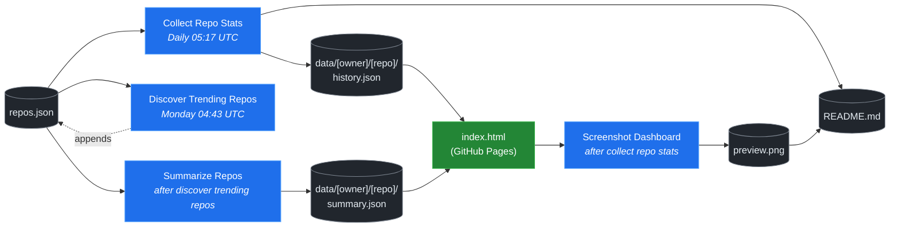

# 🚀 Rising Repos Tracker

> Automatically tracks daily GitHub stats (stars, forks, issues, velocity) for rising open source repos.

[](https://www.telosignal.com/)


**[→ View Live Dashboard](https://patrick-creates.github.io/rising-repos-tracker/)**

Built and maintained by [Telosignal](https://www.telosignal.com/).


<!-- AUTOGEN-STATS-START -->
## 📊 Current snapshot

> Auto-updated daily — last refreshed 2026-07-27

| Metric | Value |
|---|---|
| Repos tracked | **175** |
| Total stars | **8,241,297** |
| Total forks | **1,236,034** |
| Fastest growing | **ai-agent-book** (+1996.7/day) |

### 🔥 Top 5 by velocity

| # | Repo | Stars | Stars/day |
|---|---|---:|---:|
| 1 | [bojieli/ai-agent-book](https://github.com/bojieli/ai-agent-book) | 21,930 | +1996.7 |
| 2 | [DietrichGebert/ponytail](https://github.com/DietrichGebert/ponytail) | 90,052 | +1200.9 |
| 3 | [NousResearch/hermes-agent](https://github.com/NousResearch/hermes-agent) | 221,121 | +974.3 |
| 4 | [diegosouzapw/OmniRoute](https://github.com/diegosouzapw/OmniRoute) | 31,465 | +919.7 |
| 5 | [Graphify-Labs/graphify](https://github.com/Graphify-Labs/graphify) | 96,698 | +848.0 |

### 🆕 Recently added

- [Graphify-Labs/graphify](https://github.com/Graphify-Labs/graphify) — added 2026-07-27 — Turn any codebase, with its docs, SQL schemas, configs, and PDFs, into a queryable knowledge graph. A /graphify skill for Claude Code, Cursor, Codex, and Gemini CLI: local deterministic AST parsing, every edge explained, no vector store.
- [Imbad0202/academic-research-skills](https://github.com/Imbad0202/academic-research-skills) — added 2026-07-27 — Academic Research Skills for Claude Code: research → write → review → revise → finalize
- [Anionex/banana-slides](https://github.com/Anionex/banana-slides) — added 2026-07-27 — 一个基于nano banana pro🍌的原生AI PPT生成应用，迈向＂Vibe PPT＂; 支持上传任意模板图片，上传任意素材&智能解析，一句话/大纲/页面描述自动生成PPT，口头修改指定区域、一键导出可编辑ppt - An AI-native slides generator based on nano banana pro🍌
<!-- AUTOGEN-STATS-END -->

<!-- AUTOGEN-DIAGRAM-START -->
## 🔄 How it works


```mermaid
graph LR
    repos[("repos.json")]:::data
    history[("data/[owner]/[repo]/<br/>history.json")]:::data
    summary[("data/[owner]/[repo]/<br/>summary.json")]:::data
    readme[("README.md")]:::data
    preview[("preview.png")]:::data
    dashboard["index.html<br/>(GitHub Pages)"]:::output
    collect_yml["Collect Repo Stats<br/><i>Daily 05:17 UTC</i>"]:::workflow
    discover_yml["Discover Trending Repos<br/><i>Monday 04:43 UTC</i>"]:::workflow
    screenshot_yml["Screenshot Dashboard<br/><i>after collect repo stats</i>"]:::workflow
    summarize_yml["Summarize Repos<br/><i>after discover trending repos</i>"]:::workflow
    repos --> collect_yml
    collect_yml --> history
    collect_yml --> readme
    repos --> discover_yml
    discover_yml -.->|appends| repos
    dashboard --> screenshot_yml
    screenshot_yml --> preview
    repos --> summarize_yml
    summarize_yml --> summary
    history --> dashboard
    summary --> dashboard
    preview --> readme
    classDef workflow fill:#1f6feb,stroke:#58a6ff,color:#fff
    classDef data fill:#21262d,stroke:#7d8590,color:#e6edf3
    classDef output fill:#238636,stroke:#3fb950,color:#fff
```
<!-- AUTOGEN-DIAGRAM-END -->

<!-- AUTOGEN-WORKFLOWS-START -->
## ⚙️ Workflows

| File | Schedule | Name |
|---|---|---|
| `collect.yml` | Daily 05:17 UTC | Collect Repo Stats |
| `discover.yml` | Monday 04:43 UTC | Discover Trending Repos |
| `screenshot.yml` | After Collect Repo Stats | Screenshot Dashboard |
| `summarize.yml` | After Discover Trending Repos | Summarize Repos |

> All workflows commit results directly back to the repo. Schedules are best-effort — GitHub Actions cron can drift by a few minutes.
<!-- AUTOGEN-WORKFLOWS-END -->

<!-- AUTOGEN-REPOS-START -->
## 📋 All tracked repos

| Repo | Stars | Forks | Stars/day |
|---|---:|---:|---:|
| [openclaw/openclaw](https://github.com/openclaw/openclaw) | 384,279 | 80,736 | +170.8 |
| [obra/superpowers](https://github.com/obra/superpowers) | 261,805 | 23,378 | +749.4 |
| [affaan-m/everything-claude-code](https://github.com/affaan-m/everything-claude-code) | 233,791 | 35,640 | +703.2 |
| [affaan-m/ECC](https://github.com/affaan-m/ECC) | 233,791 | 35,640 | +659.7 |
| [NousResearch/hermes-agent](https://github.com/NousResearch/hermes-agent) | 221,121 | 42,189 | +974.3 |
| [Significant-Gravitas/AutoGPT](https://github.com/Significant-Gravitas/AutoGPT) | 185,702 | 46,066 | +18.9 |
| [microsoft/markitdown](https://github.com/microsoft/markitdown) | 169,313 | 12,243 | +617.4 |
| [f/prompts.chat](https://github.com/f/prompts.chat) | 166,410 | 21,498 | +56.5 |
| [langgenius/dify](https://github.com/langgenius/dify) | 150,375 | 23,691 | +122.0 |
| [open-webui/open-webui](https://github.com/open-webui/open-webui) | 146,871 | 21,347 | +133.1 |
| [langchain-ai/langchain](https://github.com/langchain-ai/langchain) | 142,660 | 23,756 | +80.3 |
| [github/spec-kit](https://github.com/github/spec-kit) | 124,008 | 11,070 | +348.6 |
| [farion1231/cc-switch](https://github.com/farion1231/cc-switch) | 121,548 | 8,182 | +678.6 |
| [microsoft/generative-ai-for-beginners](https://github.com/microsoft/generative-ai-for-beginners) | 113,546 | 60,961 | +37.3 |
| [nextlevelbuilder/ui-ux-pro-max-skill](https://github.com/nextlevelbuilder/ui-ux-pro-max-skill) | 110,566 | 11,791 | +435.6 |
| [Graphify-Labs/graphify](https://github.com/Graphify-Labs/graphify) | 96,698 | 9,369 | +848.0 |
| [JuliusBrussee/caveman](https://github.com/JuliusBrussee/caveman) | 93,329 | 5,327 | +454.5 |
| [DietrichGebert/ponytail](https://github.com/DietrichGebert/ponytail) | 90,052 | 4,956 | +1200.9 |
| [thedotmack/claude-mem](https://github.com/thedotmack/claude-mem) | 88,670 | 7,707 | +177.2 |
| [ChatGPTNextWeb/NextChat](https://github.com/ChatGPTNextWeb/NextChat) | 88,558 | 59,371 | +7.4 |
| [vllm-project/vllm](https://github.com/vllm-project/vllm) | 87,280 | 19,904 | +98.6 |
| [ruvnet/RuView](https://github.com/ruvnet/RuView) | 86,753 | 11,542 | +331.1 |
| [OpenHands/OpenHands](https://github.com/OpenHands/OpenHands) | 82,253 | 10,526 | +118.9 |
| [nexu-io/open-design](https://github.com/nexu-io/open-design) | 81,832 | 9,460 | +538.0 |
| [lobehub/lobehub](https://github.com/lobehub/lobehub) | 80,850 | 15,710 | +51.4 |
| [dair-ai/Prompt-Engineering-Guide](https://github.com/dair-ai/Prompt-Engineering-Guide) | 77,060 | 8,469 | +33.7 |
| [koala73/worldmonitor](https://github.com/koala73/worldmonitor) | 75,038 | 11,267 | +295.3 |
| [openai/openai-cookbook](https://github.com/openai/openai-cookbook) | 74,924 | 12,672 | +18.8 |
| [rtk-ai/rtk](https://github.com/rtk-ai/rtk) | 73,408 | 4,590 | +340.4 |
| [shareAI-lab/learn-claude-code](https://github.com/shareAI-lab/learn-claude-code) | 72,351 | 11,739 | +161.1 |
| [ComposioHQ/awesome-claude-skills](https://github.com/ComposioHQ/awesome-claude-skills) | 70,991 | 7,965 | +151.5 |
| [unslothai/unsloth](https://github.com/unslothai/unsloth) | 68,946 | 6,206 | +63.5 |
| [datawhalechina/hello-agents](https://github.com/datawhalechina/hello-agents) | 68,863 | 8,578 | +260.0 |
| [Leonxlnx/taste-skill](https://github.com/Leonxlnx/taste-skill) | 68,069 | 4,708 | +672.4 |
| [code-yeongyu/oh-my-openagent](https://github.com/code-yeongyu/oh-my-openagent) | 66,645 | 5,429 | +118.8 |
| [xtekky/gpt4free](https://github.com/xtekky/gpt4free) | 66,489 | 13,528 | +3.5 |
| [shanraisshan/claude-code-best-practice](https://github.com/shanraisshan/claude-code-best-practice) | 63,553 | 6,332 | +143.6 |
| [Fission-AI/OpenSpec](https://github.com/Fission-AI/OpenSpec) | 62,716 | 4,339 | +199.0 |
| [chopratejas/headroom](https://github.com/chopratejas/headroom) | 62,675 | 4,741 | +821.7 |
| [headroomlabs-ai/headroom](https://github.com/headroomlabs-ai/headroom) | 62,675 | 4,741 | +479.2 |
| [santifer/career-ops](https://github.com/santifer/career-ops) | 61,753 | 12,162 | +235.8 |
| [Panniantong/Agent-Reach](https://github.com/Panniantong/Agent-Reach) | 61,117 | 4,957 | +768.2 |
| [asgeirtj/system_prompts_leaks](https://github.com/asgeirtj/system_prompts_leaks) | 60,820 | 9,939 | +291.9 |
| [tw93/Pake](https://github.com/tw93/Pake) | 60,248 | 12,232 | +163.8 |
| [ZhuLinsen/daily_stock_analysis](https://github.com/ZhuLinsen/daily_stock_analysis) | 59,167 | 50,700 | +322.7 |
| [MemPalace/mempalace](https://github.com/MemPalace/mempalace) | 57,778 | 7,440 | +76.8 |
| [FlowiseAI/Flowise](https://github.com/FlowiseAI/Flowise) | 54,955 | 24,764 | +29.4 |
| [BerriAI/litellm](https://github.com/BerriAI/litellm) | 54,807 | 10,106 | +106.0 |
| [mvanhorn/last30days-skill](https://github.com/mvanhorn/last30days-skill) | 53,897 | 4,681 | +433.2 |
| [ggml-org/whisper.cpp](https://github.com/ggml-org/whisper.cpp) | 52,336 | 5,903 | +35.9 |
| [hesreallyhim/awesome-claude-code](https://github.com/hesreallyhim/awesome-claude-code) | 51,033 | 4,449 | +99.1 |
| [Aider-AI/aider](https://github.com/Aider-AI/aider) | 47,719 | 4,775 | +39.4 |
| [ChromeDevTools/chrome-devtools-mcp](https://github.com/ChromeDevTools/chrome-devtools-mcp) | 47,673 | 3,218 | +111.3 |
| [jamiepine/voicebox](https://github.com/jamiepine/voicebox) | 46,969 | 5,764 | +320.5 |
| [elder-plinius/CL4R1T4S](https://github.com/elder-plinius/CL4R1T4S) | 46,393 | 9,468 | +178.6 |
| [HKUDS/nanobot](https://github.com/HKUDS/nanobot) | 46,283 | 8,195 | +51.5 |
| [zhayujie/CowAgent](https://github.com/zhayujie/CowAgent) | 46,146 | 10,282 | +22.7 |
| [router-for-me/CLIProxyAPI](https://github.com/router-for-me/CLIProxyAPI) | 45,127 | 7,030 | +164.8 |
| [usestrix/strix](https://github.com/usestrix/strix) | 44,734 | 4,663 | +339.7 |
| [rohitg00/ai-engineering-from-scratch](https://github.com/rohitg00/ai-engineering-from-scratch) | 43,982 | 7,405 | +314.6 |
| [sickn33/antigravity-awesome-skills](https://github.com/sickn33/antigravity-awesome-skills) | 43,979 | 6,491 | +84.1 |
| [sickn33/agentic-awesome-skills](https://github.com/sickn33/agentic-awesome-skills) | 43,979 | 6,491 | +66.9 |
| [QuantumNous/new-api](https://github.com/QuantumNous/new-api) | 43,539 | 10,151 | +129.9 |
| [kepano/obsidian-skills](https://github.com/kepano/obsidian-skills) | 43,429 | 3,093 | +170.4 |
| [calesthio/OpenMontage](https://github.com/calesthio/OpenMontage) | 42,564 | 5,109 | +525.5 |
| [coreyhaines31/marketingskills](https://github.com/coreyhaines31/marketingskills) | 41,868 | 6,596 | +186.3 |
| [danny-avila/LibreChat](https://github.com/danny-avila/LibreChat) | 41,316 | 8,509 | +61.1 |
| [chatboxai/chatbox](https://github.com/chatboxai/chatbox) | 41,155 | 4,162 | +16.6 |
| [Hmbown/CodeWhale](https://github.com/Hmbown/CodeWhale) | 40,148 | 3,466 | +87.0 |
| [Imbad0202/academic-research-skills](https://github.com/Imbad0202/academic-research-skills) | 39,694 | 3,184 | +262.8 |
| [mindsdb/mindshub](https://github.com/mindsdb/mindshub) | 39,498 | 6,224 | +6.9 |
| [chatanywhere/GPT_API_free](https://github.com/chatanywhere/GPT_API_free) | 39,114 | 2,672 | +15.2 |
| [wshobson/agents](https://github.com/wshobson/agents) | 38,275 | 4,097 | +37.1 |
| [langchain-ai/langgraph](https://github.com/langchain-ai/langgraph) | 38,234 | 6,431 | +80.4 |
| [AstrBotDevs/AstrBot](https://github.com/AstrBotDevs/AstrBot) | 38,169 | 2,706 | +81.8 |
| [Yeachan-Heo/oh-my-claudecode](https://github.com/Yeachan-Heo/oh-my-claudecode) | 38,105 | 3,434 | +52.1 |
| [heygen-com/hyperframes](https://github.com/heygen-com/hyperframes) | 37,919 | 3,578 | +252.2 |
| [google/langextract](https://github.com/google/langextract) | 37,876 | 2,626 | +21.0 |
| [github/awesome-copilot](https://github.com/github/awesome-copilot) | 37,081 | 4,650 | +52.0 |
| [songquanpeng/one-api](https://github.com/songquanpeng/one-api) | 35,987 | 6,757 | +28.2 |
| [PDFMathTranslate/PDFMathTranslate](https://github.com/PDFMathTranslate/PDFMathTranslate) | 35,808 | 3,190 | +28.5 |
| [DeusData/codebase-memory-mcp](https://github.com/DeusData/codebase-memory-mcp) | 35,731 | 2,789 | +539.3 |
| [anthropics/claude-plugins-official](https://github.com/anthropics/claude-plugins-official) | 32,718 | 3,676 | +66.2 |
| [zeroclaw-labs/zeroclaw](https://github.com/zeroclaw-labs/zeroclaw) | 32,406 | 4,844 | +13.0 |
| [diegosouzapw/OmniRoute](https://github.com/diegosouzapw/OmniRoute) | 31,465 | 4,072 | +919.7 |
| [iOfficeAI/AionUi](https://github.com/iOfficeAI/AionUi) | 30,912 | 3,107 | +63.6 |
| [AlexsJones/llmfit](https://github.com/AlexsJones/llmfit) | 30,731 | 1,874 | +66.6 |
| [Gitlawb/openclaude](https://github.com/Gitlawb/openclaude) | 30,363 | 8,892 | +39.8 |
| [JCodesMore/ai-website-cloner-template](https://github.com/JCodesMore/ai-website-cloner-template) | 30,310 | 4,366 | +317.1 |
| [stablyai/orca](https://github.com/stablyai/orca) | 30,194 | 2,134 | +838.6 |
| [googleworkspace/cli](https://github.com/googleworkspace/cli) | 30,022 | 1,753 | +59.0 |
| [voideditor/void](https://github.com/voideditor/void) | 28,877 | 2,601 | +1.3 |
| [agentscope-ai/QwenPaw](https://github.com/agentscope-ai/QwenPaw) | 28,561 | 2,863 | +256.7 |
| [alibaba/page-agent](https://github.com/alibaba/page-agent) | 27,943 | 2,462 | +223.5 |
| [HKUDS/Vibe-Trading](https://github.com/HKUDS/Vibe-Trading) | 27,932 | 4,540 | +471.2 |
| [esengine/DeepSeek-Reasonix](https://github.com/esengine/DeepSeek-Reasonix) | 27,861 | 1,788 | +170.1 |
| [BloopAI/vibe-kanban](https://github.com/BloopAI/vibe-kanban) | 27,541 | 2,918 | +14.8 |
| [MadsLorentzen/ai-job-search](https://github.com/MadsLorentzen/ai-job-search) | 27,429 | 8,947 | +417.6 |
| [volcengine/OpenViking](https://github.com/volcengine/OpenViking) | 27,343 | 2,144 | +41.1 |
| [jackwener/OpenCLI](https://github.com/jackwener/OpenCLI) | 27,256 | 2,688 | +70.5 |
| [langchain-ai/deepagents](https://github.com/langchain-ai/deepagents) | 26,845 | 3,754 | +54.9 |
| [jarrodwatts/claude-hud](https://github.com/jarrodwatts/claude-hud) | 26,842 | 1,243 | +43.9 |
| [p-e-w/heretic](https://github.com/p-e-w/heretic) | 26,806 | 2,915 | +57.8 |
| [tirth8205/code-review-graph](https://github.com/tirth8205/code-review-graph) | 26,768 | 2,492 | +196.5 |
| [mukul975/Anthropic-Cybersecurity-Skills](https://github.com/mukul975/Anthropic-Cybersecurity-Skills) | 26,677 | 3,237 | +244.4 |
| [zai-org/Open-AutoGLM](https://github.com/zai-org/Open-AutoGLM) | 25,880 | 4,012 | +8.5 |
| [rohitg00/agentmemory](https://github.com/rohitg00/agentmemory) | 25,842 | 2,150 | +82.0 |
| [manaflow-ai/cmux](https://github.com/manaflow-ai/cmux) | 25,187 | 2,087 | +59.4 |
| [toon-format/toon](https://github.com/toon-format/toon) | 25,001 | 1,110 | +10.3 |
| [decolua/9router](https://github.com/decolua/9router) | 23,696 | 4,030 | +145.8 |
| [iOfficeAI/OfficeCLI](https://github.com/iOfficeAI/OfficeCLI) | 22,502 | 1,513 | +671.7 |
| [winfunc/opcode](https://github.com/winfunc/opcode) | 22,229 | 1,714 | +4.6 |
| [bojieli/ai-agent-book](https://github.com/bojieli/ai-agent-book) | 21,930 | 2,195 | +1996.7 |
| [coze-dev/coze-studio](https://github.com/coze-dev/coze-studio) | 21,267 | 3,088 | +6.5 |
| [NirDiamant/agents-towards-production](https://github.com/NirDiamant/agents-towards-production) | 21,184 | 2,814 | +11.2 |
| [ogulcancelik/herdr](https://github.com/ogulcancelik/herdr) | 21,163 | 1,424 | +417.4 |
| [can1357/oh-my-pi](https://github.com/can1357/oh-my-pi) | 20,048 | 1,876 | +172.9 |
| [mksglu/context-mode](https://github.com/mksglu/context-mode) | 19,351 | 1,367 | +44.8 |
| [steipete/CodexBar](https://github.com/steipete/CodexBar) | 19,140 | 1,585 | +112.5 |
| [tanweai/pua](https://github.com/tanweai/pua) | 19,055 | 1,156 | +19.3 |
| [Tencent/WeKnora](https://github.com/Tencent/WeKnora) | 18,973 | 2,660 | +63.8 |
| [datawhalechina/easy-vibe](https://github.com/datawhalechina/easy-vibe) | 18,552 | 1,766 | +38.4 |
| [jnMetaCode/agency-agents-zh](https://github.com/jnMetaCode/agency-agents-zh) | 18,388 | 3,065 | +85.2 |
| [pranshuparmar/witr](https://github.com/pranshuparmar/witr) | 18,322 | 579 | +10.4 |
| [KKKKhazix/khazix-skills](https://github.com/KKKKhazix/khazix-skills) | 18,232 | 2,043 | +110.6 |
| [jundot/omlx](https://github.com/jundot/omlx) | 18,205 | 1,556 | +37.5 |
| [RightNow-AI/openfang](https://github.com/RightNow-AI/openfang) | 18,063 | 2,281 | +5.6 |
| [microsoft/agent-lightning](https://github.com/microsoft/agent-lightning) | 17,427 | 1,526 | +2.8 |
| [danielmiessler/LifeOS](https://github.com/danielmiessler/LifeOS) | 16,965 | 2,299 | +25.7 |
| [nesquena/hermes-webui](https://github.com/nesquena/hermes-webui) | 16,598 | 2,237 | +50.3 |
| [browser-use/browser-harness](https://github.com/browser-use/browser-harness) | 16,283 | 1,542 | +28.7 |
| [cft0808/edict](https://github.com/cft0808/edict) | 16,277 | 1,709 | +5.1 |
| [MemoriLabs/Memori](https://github.com/MemoriLabs/Memori) | 15,669 | 2,884 | +9.3 |
| [Anionex/banana-slides](https://github.com/Anionex/banana-slides) | 15,333 | 1,767 | +64.2 |
| [xpzouying/xiaohongshu-mcp](https://github.com/xpzouying/xiaohongshu-mcp) | 14,871 | 2,196 | +16.7 |
| [kyegomez/OpenMythos](https://github.com/kyegomez/OpenMythos) | 14,763 | 3,301 | +17.4 |
| [yusufkaraaslan/Skill_Seekers](https://github.com/yusufkaraaslan/Skill_Seekers) | 14,573 | 1,480 | +9.9 |
| [xbtlin/ai-berkshire](https://github.com/xbtlin/ai-berkshire) | 14,330 | 2,030 | +169.2 |
| [alibaba/open-code-review](https://github.com/alibaba/open-code-review) | 14,248 | 963 | +202.9 |
| [NevaMind-AI/memU](https://github.com/NevaMind-AI/memU) | 14,063 | 1,042 | +4.7 |
| [wanshuiyin/Auto-claude-code-research-in-sleep](https://github.com/wanshuiyin/Auto-claude-code-research-in-sleep) | 13,913 | 1,245 | +40.7 |
| [superset-sh/superset](https://github.com/superset-sh/superset) | 12,624 | 1,126 | +16.6 |
| [XiaomiMiMo/MiMo-Code](https://github.com/XiaomiMiMo/MiMo-Code) | 12,481 | 1,271 | +52.0 |
| [sirmalloc/ccstatusline](https://github.com/sirmalloc/ccstatusline) | 12,029 | 529 | +26.8 |
| [t8y2/dbx](https://github.com/t8y2/dbx) | 11,837 | 1,134 | +132.9 |
| [1jehuang/jcode](https://github.com/1jehuang/jcode) | 11,741 | 1,306 | +245.4 |
| [EverMind-AI/EverOS](https://github.com/EverMind-AI/EverOS) | 11,570 | 868 | +66.3 |
| [ValueCell-ai/valuecell](https://github.com/ValueCell-ai/valuecell) | 10,949 | 1,815 | +2.8 |
| [aden-hive/hive](https://github.com/aden-hive/hive) | 10,774 | 5,668 | +5.8 |
| [walkinglabs/learn-harness-engineering](https://github.com/walkinglabs/learn-harness-engineering) | 10,745 | 1,171 | +41.0 |
| [0x4m4/hexstrike-ai](https://github.com/0x4m4/hexstrike-ai) | 10,513 | 2,185 | +18.0 |
| [MemTensor/MemOS](https://github.com/MemTensor/MemOS) | 10,398 | 950 | +13.3 |
| [Kuberwastaken/claurst](https://github.com/Kuberwastaken/claurst) | 10,143 | 7,778 | +9.9 |
| [brokermr810/QuantDinger](https://github.com/brokermr810/QuantDinger) | 10,032 | 2,104 | +35.7 |
| [OpenByteInc/QuantDinger](https://github.com/OpenByteInc/QuantDinger) | 10,032 | 2,104 | +32.9 |
| [ConardLi/garden-skills](https://github.com/ConardLi/garden-skills) | 9,825 | 1,299 | +30.7 |
| [frankbria/ralph-claude-code](https://github.com/frankbria/ralph-claude-code) | 9,567 | 730 | +6.1 |
| [EKKOLearnAI/hermes-studio](https://github.com/EKKOLearnAI/hermes-studio) | 9,518 | 1,166 | +31.3 |
| [ykdojo/claude-code-tips](https://github.com/ykdojo/claude-code-tips) | 9,453 | 749 | +20.8 |
| [iflytek/astron-agent](https://github.com/iflytek/astron-agent) | 9,390 | 874 | +37.1 |
| [TencentCloud/TencentDB-Agent-Memory](https://github.com/TencentCloud/TencentDB-Agent-Memory) | 9,311 | 888 | +42.4 |
| [getagentseal/codeburn](https://github.com/getagentseal/codeburn) | 8,951 | 701 | +22.9 |
| [EvoMap/evolver](https://github.com/EvoMap/evolver) | 8,888 | 824 | +1.6 |
| [MiroMindAI/MiroThinker](https://github.com/MiroMindAI/MiroThinker) | 8,354 | 646 | +1.3 |
| [mmulet/term.everything](https://github.com/mmulet/term.everything) | 8,050 | 192 | +1.4 |
| [modem-dev/hunk](https://github.com/modem-dev/hunk) | 7,778 | 222 | +76.6 |
| [ValueCell-ai/ClawX](https://github.com/ValueCell-ai/ClawX) | 7,553 | 1,128 | +0.9 |
| [StarTrail-org/PixelRAG](https://github.com/StarTrail-org/PixelRAG) | 7,315 | 607 | +52.1 |
| [steipete/summarize](https://github.com/steipete/summarize) | 6,485 | 440 | +5.4 |
| [opensquilla/opensquilla](https://github.com/opensquilla/opensquilla) | 6,368 | 480 | +22.7 |
| [Arthur-Ficial/apfel](https://github.com/Arthur-Ficial/apfel) | 6,202 | 237 | +6.2 |
| [UfoMiao/zcf](https://github.com/UfoMiao/zcf) | 6,080 | 424 | +0.7 |
| [microsoft/fara](https://github.com/microsoft/fara) | 6,053 | 591 | +3.9 |
| [Andyyyy64/whichllm](https://github.com/Andyyyy64/whichllm) | 6,015 | 318 | +21.1 |
| [re4/LibreCode](https://github.com/re4/LibreCode) | 79 | 4 | — |
<!-- AUTOGEN-REPOS-END -->

---

## What it does

- Collects daily snapshots of stars, forks, watchers and open issues for every tracked repo
- Discovers new trending repos automatically every Monday using the GitHub Search API
- Generates AI summaries (use cases, similar tools, tags) for each tracked repo via GitHub Models
- Stores all history as plain JSON — no database, no backend
- Renders a live dashboard via GitHub Pages — updates daily, zero maintenance

## Tracked repos

Data lives in [`data/`](./data) — one folder per repo, one `history.json` per entry.  
The full watch list is in [`repos.json`](./repos.json).

## Fork & use it for yourself

This is my personal tracker — the watch list reflects what I find interesting. If you want to track different repos, the best path is to **fork this repo and run your own**.

### Setup

1. Fork this repo to your account
2. Replace the contents of [`repos.json`](./repos.json) with the repos you want to track (or just leave one entry — `discover.yml` will auto-add more every Monday)
3. Go to **Settings → Pages** and enable GitHub Pages from the `main` branch
4. Go to **Actions** and run **Collect Repo Stats** once manually to seed your first data point
5. Your dashboard will be live at `https://YOUR-USERNAME.github.io/rising-repos-tracker/`

That's it — daily collection and weekly discovery run automatically on schedule. Zero ongoing maintenance.

### Customizing what gets discovered

Edit [`scripts/discover.js`](./scripts/discover.js) to change:

- `MIN_STARS` — minimum star threshold for candidates
- `MAX_AGE_DAYS` — how recent a repo must be
- `MAX_NEW_REPOS` — how many to add per discovery run
- The `queries` array — GitHub Search API queries that define what "trending" means to you

### Adding a repo manually

Just edit `repos.json` directly:

```json
{
  "owner": "OWNER",
  "repo": "REPO",
  "added": "YYYY-MM-DD",
  "notes": "why you're tracking this"
}
```

The next daily collect run picks it up automatically.

## Stack

- **GitHub Actions** — scheduling and automation
- **GitHub Pages** — dashboard hosting
- **GitHub API** — data source
- **GitHub Models** — free AI summaries (gpt-4o-mini)
- **Chart.js** — star growth visualization
- **Mermaid** — architecture diagram (rendered by GitHub)
- No dependencies, no build step, no database

## License

MIT
