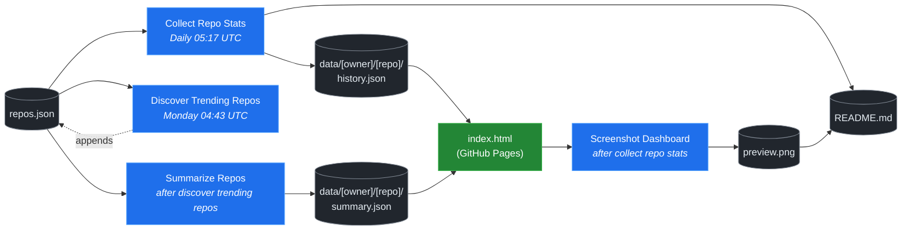

# 🚀 Rising Repos Tracker

> Automatically tracks daily GitHub stats (stars, forks, issues, velocity) for rising open source repos.

[](https://www.telosignal.com/)


**[→ View Live Dashboard](https://patrick-creates.github.io/rising-repos-tracker/)**

Built and maintained by [Telosignal](https://www.telosignal.com/).


<!-- AUTOGEN-STATS-START -->
## 📊 Current snapshot

> Auto-updated daily — last refreshed 2026-09-25

| Metric | Value |
|---|---|
| Repos tracked | **201** |
| Total stars | **9,931,223** |
| Total forks | **1,447,914** |
| Fastest growing | **ponytail** (+1028.2/day) |

### 🔥 Top 5 by velocity

| # | Repo | Stars | Stars/day |
|---|---|---:|---:|
| 1 | [DietrichGebert/ponytail](https://github.com/DietrichGebert/ponytail) | 145,694 | +1028.2 |
| 2 | [debpalash/VoiceStudio](https://github.com/debpalash/VoiceStudio) | 35,335 | +839.8 |
| 3 | [stablyai/orca](https://github.com/stablyai/orca) | 77,842 | +805.7 |
| 4 | [NousResearch/hermes-agent](https://github.com/NousResearch/hermes-agent) | 248,812 | +746.4 |
| 5 | [diegosouzapw/OmniRoute](https://github.com/diegosouzapw/OmniRoute) | 70,033 | +714.6 |

### 🆕 Recently added

- [genspark-ai/genoffice](https://github.com/genspark-ai/genoffice) — added 2026-09-21 — Free, open-source AI Office suite: Docs, Sheets, Slides, PDF, Markdown and HTML editors with a built-in AI agent, plus a `genoffice` CLI and agent skill so Claude Code, Codex and Cursor can create and edit real .docx/.xlsx/.pptx files locally. Bring your own key. macOS, Windows & Linux.
- [tech-leads-club/agent-skills](https://github.com/tech-leads-club/agent-skills) — added 2026-09-21 — The secure, validated skill registry for professional AI coding agents. Extend Antigravity, Claude Code, Cursor, Copilot and more with absolute confidence.
- [every-app/open-seo](https://github.com/every-app/open-seo) — added 2026-09-14 — Open source alternative to Semrush and Ahrefs
<!-- AUTOGEN-STATS-END -->

<!-- AUTOGEN-DIAGRAM-START -->
## 🔄 How it works


```mermaid
graph LR
    repos[("repos.json")]:::data
    history[("data/[owner]/[repo]/<br/>history.json")]:::data
    summary[("data/[owner]/[repo]/<br/>summary.json")]:::data
    readme[("README.md")]:::data
    preview[("preview.png")]:::data
    dashboard["index.html<br/>(GitHub Pages)"]:::output
    collect_yml["Collect Repo Stats<br/><i>Daily 05:17 UTC</i>"]:::workflow
    discover_yml["Discover Trending Repos<br/><i>Monday 04:43 UTC</i>"]:::workflow
    screenshot_yml["Screenshot Dashboard<br/><i>after collect repo stats</i>"]:::workflow
    summarize_yml["Summarize Repos<br/><i>after discover trending repos</i>"]:::workflow
    repos --> collect_yml
    collect_yml --> history
    collect_yml --> readme
    repos --> discover_yml
    discover_yml -.->|appends| repos
    dashboard --> screenshot_yml
    screenshot_yml --> preview
    repos --> summarize_yml
    summarize_yml --> summary
    history --> dashboard
    summary --> dashboard
    preview --> readme
    classDef workflow fill:#1f6feb,stroke:#58a6ff,color:#fff
    classDef data fill:#21262d,stroke:#7d8590,color:#e6edf3
    classDef output fill:#238636,stroke:#3fb950,color:#fff
```
<!-- AUTOGEN-DIAGRAM-END -->

<!-- AUTOGEN-WORKFLOWS-START -->
## ⚙️ Workflows

| File | Schedule | Name |
|---|---|---|
| `collect.yml` | Daily 05:17 UTC | Collect Repo Stats |
| `discover.yml` | Monday 04:43 UTC | Discover Trending Repos |
| `screenshot.yml` | After Collect Repo Stats | Screenshot Dashboard |
| `summarize.yml` | After Discover Trending Repos | Summarize Repos |

> All workflows commit results directly back to the repo. Schedules are best-effort — GitHub Actions cron can drift by a few minutes.
<!-- AUTOGEN-WORKFLOWS-END -->

<!-- AUTOGEN-REPOS-START -->
## 📋 All tracked repos

| Repo | Stars | Forks | Stars/day |
|---|---:|---:|---:|
| [openclaw/openclaw](https://github.com/openclaw/openclaw) | 390,467 | 82,141 | +140.7 |
| [obra/superpowers](https://github.com/obra/superpowers) | 291,377 | 26,071 | +587.4 |
| [affaan-m/everything-claude-code](https://github.com/affaan-m/everything-claude-code) | 267,155 | 39,918 | +637.8 |
| [affaan-m/ECC](https://github.com/affaan-m/ECC) | 267,155 | 39,918 | +609.2 |
| [NousResearch/hermes-agent](https://github.com/NousResearch/hermes-agent) | 248,812 | 52,701 | +746.4 |
| [Significant-Gravitas/AutoGPT](https://github.com/Significant-Gravitas/AutoGPT) | 187,545 | 45,998 | +24.2 |
| [microsoft/markitdown](https://github.com/microsoft/markitdown) | 186,953 | 13,796 | +473.7 |
| [f/prompts.chat](https://github.com/f/prompts.chat) | 171,217 | 21,992 | +67.0 |
| [langgenius/dify](https://github.com/langgenius/dify) | 157,170 | 24,778 | +118.1 |
| [open-webui/open-webui](https://github.com/open-webui/open-webui) | 153,123 | 22,399 | +120.2 |
| [langchain-ai/langchain](https://github.com/langchain-ai/langchain) | 147,034 | 24,603 | +77.0 |
| [DietrichGebert/ponytail](https://github.com/DietrichGebert/ponytail) | 145,694 | 7,811 | +1028.2 |
| [github/spec-kit](https://github.com/github/spec-kit) | 138,824 | 12,429 | +303.4 |
| [farion1231/cc-switch](https://github.com/farion1231/cc-switch) | 136,676 | 9,315 | +481.8 |
| [nextlevelbuilder/ui-ux-pro-max-skill](https://github.com/nextlevelbuilder/ui-ux-pro-max-skill) | 130,510 | 13,884 | +389.8 |
| [Graphify-Labs/graphify](https://github.com/Graphify-Labs/graphify) | 121,287 | 11,693 | +409.8 |
| [microsoft/generative-ai-for-beginners](https://github.com/microsoft/generative-ai-for-beginners) | 120,514 | 63,416 | +72.3 |
| [JuliusBrussee/caveman](https://github.com/JuliusBrussee/caveman) | 107,770 | 6,241 | +355.8 |
| [nexu-io/open-design](https://github.com/nexu-io/open-design) | 98,030 | 11,377 | +414.3 |
| [ruvnet/RuView](https://github.com/ruvnet/RuView) | 94,976 | 12,563 | +236.4 |
| [thedotmack/claude-mem](https://github.com/thedotmack/claude-mem) | 94,656 | 8,365 | +142.8 |
| [vllm-project/vllm](https://github.com/vllm-project/vllm) | 92,661 | 22,652 | +94.6 |
| [Leonxlnx/taste-skill](https://github.com/Leonxlnx/taste-skill) | 89,986 | 6,128 | +513.6 |
| [OpenHands/OpenHands](https://github.com/OpenHands/OpenHands) | 89,130 | 11,738 | +116.9 |
| [ChatGPTNextWeb/NextChat](https://github.com/ChatGPTNextWeb/NextChat) | 88,810 | 58,983 | +5.9 |
| [koala73/worldmonitor](https://github.com/koala73/worldmonitor) | 87,357 | 13,311 | +253.8 |
| [Panniantong/Agent-Reach](https://github.com/Panniantong/Agent-Reach) | 85,351 | 7,489 | +567.7 |
| [lobehub/lobehub](https://github.com/lobehub/lobehub) | 82,816 | 15,920 | +43.1 |
| [rtk-ai/rtk](https://github.com/rtk-ai/rtk) | 81,687 | 5,169 | +247.0 |
| [datawhalechina/hello-agents](https://github.com/datawhalechina/hello-agents) | 80,803 | 10,048 | +231.9 |
| [dair-ai/Prompt-Engineering-Guide](https://github.com/dair-ai/Prompt-Engineering-Guide) | 78,613 | 8,643 | +30.1 |
| [stablyai/orca](https://github.com/stablyai/orca) | 77,842 | 5,095 | +805.7 |
| [shareAI-lab/learn-claude-code](https://github.com/shareAI-lab/learn-claude-code) | 77,587 | 12,473 | +127.0 |
| [unslothai/unsloth](https://github.com/unslothai/unsloth) | 76,742 | 7,031 | +94.2 |
| [openai/openai-cookbook](https://github.com/openai/openai-cookbook) | 76,178 | 12,892 | +19.8 |
| [ComposioHQ/awesome-claude-skills](https://github.com/ComposioHQ/awesome-claude-skills) | 75,611 | 8,780 | +117.1 |
| [chopratejas/headroom](https://github.com/chopratejas/headroom) | 73,762 | 5,692 | +447.0 |
| [headroomlabs-ai/headroom](https://github.com/headroomlabs-ai/headroom) | 73,762 | 5,692 | +293.3 |
| [career-ops-hq/career-ops](https://github.com/career-ops-hq/career-ops) | 72,679 | 13,666 | +127.6 |
| [santifer/career-ops](https://github.com/santifer/career-ops) | 72,678 | 13,666 | +211.0 |
| [Fission-AI/OpenSpec](https://github.com/Fission-AI/OpenSpec) | 70,281 | 4,809 | +165.3 |
| [diegosouzapw/OmniRoute](https://github.com/diegosouzapw/OmniRoute) | 70,033 | 9,932 | +714.6 |
| [code-yeongyu/oh-my-openagent](https://github.com/code-yeongyu/oh-my-openagent) | 69,395 | 5,715 | +85.1 |
| [asgeirtj/system_prompts_leaks](https://github.com/asgeirtj/system_prompts_leaks) | 68,306 | 11,108 | +214.8 |
| [xtekky/gpt4free](https://github.com/xtekky/gpt4free) | 66,734 | 13,499 | +3.8 |
| [shanraisshan/claude-code-best-practice](https://github.com/shanraisshan/claude-code-best-practice) | 66,321 | 6,595 | +98.6 |
| [ZhuLinsen/daily_stock_analysis](https://github.com/ZhuLinsen/daily_stock_analysis) | 65,631 | 54,820 | +217.8 |
| [usestrix/strix](https://github.com/usestrix/strix) | 64,705 | 7,084 | +336.2 |
| [mvanhorn/last30days-skill](https://github.com/mvanhorn/last30days-skill) | 62,781 | 5,461 | +276.2 |
| [tw93/Pake](https://github.com/tw93/Pake) | 61,722 | 12,711 | +99.6 |
| [calesthio/OpenMontage](https://github.com/calesthio/OpenMontage) | 61,224 | 7,792 | +379.2 |
| [BerriAI/litellm](https://github.com/BerriAI/litellm) | 59,598 | 11,759 | +93.9 |
| [MemPalace/mempalace](https://github.com/MemPalace/mempalace) | 59,268 | 7,566 | +52.8 |
| [rohitg00/ai-engineering-from-scratch](https://github.com/rohitg00/ai-engineering-from-scratch) | 57,020 | 9,974 | +264.3 |
| [jamiepine/voicebox](https://github.com/jamiepine/voicebox) | 55,653 | 6,936 | +229.6 |
| [FlowiseAI/Flowise](https://github.com/FlowiseAI/Flowise) | 55,479 | 25,050 | +19.8 |
| [hesreallyhim/awesome-claude-code](https://github.com/hesreallyhim/awesome-claude-code) | 54,586 | 4,762 | +80.7 |
| [ggml-org/whisper.cpp](https://github.com/ggml-org/whisper.cpp) | 53,918 | 6,193 | +31.5 |
| [router-for-me/CLIProxyAPI](https://github.com/router-for-me/CLIProxyAPI) | 53,163 | 8,022 | +149.7 |
| [heygen-com/hyperframes](https://github.com/heygen-com/hyperframes) | 52,973 | 4,834 | +251.5 |
| [ChromeDevTools/chrome-devtools-mcp](https://github.com/ChromeDevTools/chrome-devtools-mcp) | 52,586 | 4,673 | +97.7 |
| [coreyhaines31/marketingskills](https://github.com/coreyhaines31/marketingskills) | 51,459 | 7,772 | +172.6 |
| [bojieli/ai-agent-book](https://github.com/bojieli/ai-agent-book) | 50,890 | 5,708 | +640.9 |
| [elder-plinius/CL4R1T4S](https://github.com/elder-plinius/CL4R1T4S) | 50,668 | 10,396 | +115.5 |
| [Imbad0202/academic-research-skills](https://github.com/Imbad0202/academic-research-skills) | 49,432 | 3,826 | +162.3 |
| [Aider-AI/aider](https://github.com/Aider-AI/aider) | 49,178 | 4,992 | +32.4 |
| [QuantumNous/new-api](https://github.com/QuantumNous/new-api) | 48,879 | 11,733 | +109.9 |
| [kepano/obsidian-skills](https://github.com/kepano/obsidian-skills) | 48,861 | 3,482 | +129.1 |
| [HKUDS/nanobot](https://github.com/HKUDS/nanobot) | 48,561 | 8,577 | +45.2 |
| [zhayujie/CowAgent](https://github.com/zhayujie/CowAgent) | 47,111 | 10,374 | +19.7 |
| [sickn33/antigravity-awesome-skills](https://github.com/sickn33/antigravity-awesome-skills) | 46,887 | 6,832 | +66.7 |
| [sickn33/agentic-awesome-skills](https://github.com/sickn33/agentic-awesome-skills) | 46,887 | 6,832 | +52.0 |
| [K-Dense-AI/scientific-agent-skills](https://github.com/K-Dense-AI/scientific-agent-skills) | 46,617 | 4,209 | +174.5 |
| [danny-avila/LibreChat](https://github.com/danny-avila/LibreChat) | 44,928 | 9,203 | +60.6 |
| [DeusData/codebase-memory-mcp](https://github.com/DeusData/codebase-memory-mcp) | 44,866 | 3,666 | +275.4 |
| [MadsLorentzen/ai-job-search](https://github.com/MadsLorentzen/ai-job-search) | 43,911 | 15,116 | +301.7 |
| [chatanywhere/GPT_API_free](https://github.com/chatanywhere/GPT_API_free) | 43,176 | 2,732 | +40.8 |
| [langchain-ai/langgraph](https://github.com/langchain-ai/langgraph) | 42,254 | 7,151 | +71.9 |
| [chatboxai/chatbox](https://github.com/chatboxai/chatbox) | 41,855 | 4,259 | +14.3 |
| [alibaba/open-code-review](https://github.com/alibaba/open-code-review) | 41,059 | 2,946 | +383.6 |
| [Hmbown/CodeWhale](https://github.com/Hmbown/CodeWhale) | 41,035 | 3,562 | +51.7 |
| [Hmbown/Codewhale](https://github.com/Hmbown/Codewhale) | 41,035 | 3,562 | +6.6 |
| [AstrBotDevs/AstrBot](https://github.com/AstrBotDevs/AstrBot) | 40,989 | 2,971 | +63.8 |
| [ogulcancelik/herdr](https://github.com/ogulcancelik/herdr) | 40,677 | 3,109 | +349.1 |
| [herdrdev/herdr](https://github.com/herdrdev/herdr) | 40,677 | 3,109 | +318.6 |
| [tinyhumansai/openhuman](https://github.com/tinyhumansai/openhuman) | 40,105 | 3,954 | +34.2 |
| [wshobson/agents](https://github.com/wshobson/agents) | 39,933 | 4,253 | +32.5 |
| [mindsdb/mindshub](https://github.com/mindsdb/mindshub) | 39,770 | 6,247 | +5.0 |
| [github/awesome-copilot](https://github.com/github/awesome-copilot) | 39,380 | 5,010 | +45.3 |
| [Yeachan-Heo/oh-my-claudecode](https://github.com/Yeachan-Heo/oh-my-claudecode) | 39,348 | 3,515 | +36.8 |
| [google/langextract](https://github.com/google/langextract) | 38,811 | 2,716 | +18.3 |
| [volcengine/OpenViking](https://github.com/volcengine/OpenViking) | 38,652 | 3,014 | +122.2 |
| [PDFMathTranslate/PDFMathTranslate](https://github.com/PDFMathTranslate/PDFMathTranslate) | 37,187 | 3,337 | +25.8 |
| [AlexsJones/llmfit](https://github.com/AlexsJones/llmfit) | 37,138 | 2,367 | +87.4 |
| [songquanpeng/one-api](https://github.com/songquanpeng/one-api) | 37,019 | 6,869 | +22.8 |
| [anthropics/claude-plugins-official](https://github.com/anthropics/claude-plugins-official) | 36,734 | 4,147 | +66.6 |
| [esengine/DeepSeek-Reasonix](https://github.com/esengine/DeepSeek-Reasonix) | 35,702 | 2,419 | +148.4 |
| [debpalash/VoiceStudio](https://github.com/debpalash/VoiceStudio) | 35,335 | 4,162 | +839.8 |
| [agentscope-ai/QwenPaw](https://github.com/agentscope-ai/QwenPaw) | 35,283 | 3,127 | +171.6 |
| [JCodesMore/ai-website-cloner-template](https://github.com/JCodesMore/ai-website-cloner-template) | 35,155 | 5,142 | +178.1 |
| [HKUDS/Vibe-Trading](https://github.com/HKUDS/Vibe-Trading) | 34,013 | 5,537 | +219.0 |
| [Gitlawb/openclaude](https://github.com/Gitlawb/openclaude) | 33,523 | 9,103 | +46.4 |
| [mukul975/Anthropic-Cybersecurity-Skills](https://github.com/mukul975/Anthropic-Cybersecurity-Skills) | 33,353 | 4,050 | +160.3 |
| [can1357/oh-my-pi](https://github.com/can1357/oh-my-pi) | 33,244 | 3,526 | +202.6 |
| [iOfficeAI/AionUi](https://github.com/iOfficeAI/AionUi) | 33,113 | 3,437 | +49.7 |
| [zeroclaw-labs/zeroclaw](https://github.com/zeroclaw-labs/zeroclaw) | 32,879 | 4,953 | +10.4 |
| [virgiliojr94/book-to-skill](https://github.com/virgiliojr94/book-to-skill) | 32,347 | 3,367 | +234.9 |
| [p-e-w/heretic](https://github.com/p-e-w/heretic) | 32,330 | 3,631 | +76.7 |
| [tirth8205/code-review-graph](https://github.com/tirth8205/code-review-graph) | 31,779 | 2,905 | +130.0 |
| [iOfficeAI/OfficeCLI](https://github.com/iOfficeAI/OfficeCLI) | 31,220 | 2,135 | +281.8 |
| [googleworkspace/cli](https://github.com/googleworkspace/cli) | 31,148 | 1,852 | +38.2 |
| [Tencent/WeKnora](https://github.com/Tencent/WeKnora) | 29,878 | 4,015 | +133.2 |
| [decolua/9router](https://github.com/decolua/9router) | 29,777 | 5,609 | +119.7 |
| [langchain-ai/deepagents](https://github.com/langchain-ai/deepagents) | 29,760 | 4,181 | +51.4 |
| [jackwener/OpenCLI](https://github.com/jackwener/OpenCLI) | 29,608 | 2,890 | +53.3 |
| [alibaba/page-agent](https://github.com/alibaba/page-agent) | 29,206 | 2,623 | +104.4 |
| [rohitg00/agentmemory](https://github.com/rohitg00/agentmemory) | 28,831 | 2,506 | +64.3 |
| [voideditor/void](https://github.com/voideditor/void) | 28,791 | 2,651 | — |
| [BloopAI/vibe-kanban](https://github.com/BloopAI/vibe-kanban) | 28,189 | 3,024 | +12.8 |
| [jarrodwatts/claude-hud](https://github.com/jarrodwatts/claude-hud) | 28,160 | 1,305 | +31.8 |
| [manaflow-ai/cmux](https://github.com/manaflow-ai/cmux) | 27,399 | 2,406 | +41.1 |
| [TencentCloud/TencentDB-Agent-Memory](https://github.com/TencentCloud/TencentDB-Agent-Memory) | 27,264 | 2,617 | +250.6 |
| [zai-org/Open-AutoGLM](https://github.com/zai-org/Open-AutoGLM) | 26,304 | 4,044 | +7.7 |
| [toon-format/toon](https://github.com/toon-format/toon) | 25,421 | 1,123 | +8.5 |
| [pascalorg/editor](https://github.com/pascalorg/editor) | 24,298 | 3,013 | +66.3 |
| [mksglu/context-mode](https://github.com/mksglu/context-mode) | 24,051 | 1,732 | +64.5 |
| [guillaumemeyer/watermarks-remover](https://github.com/guillaumemeyer/watermarks-remover) | 22,782 | 2,623 | +163.4 |
| [pranshuparmar/witr](https://github.com/pranshuparmar/witr) | 22,498 | 786 | +50.8 |
| [winfunc/opcode](https://github.com/winfunc/opcode) | 22,401 | 1,722 | +3.6 |
| [jundot/omlx](https://github.com/jundot/omlx) | 22,217 | 1,926 | +54.8 |
| [steipete/CodexBar](https://github.com/steipete/CodexBar) | 21,897 | 2,003 | +70.5 |
| [coze-dev/coze-studio](https://github.com/coze-dev/coze-studio) | 21,645 | 3,121 | +6.4 |
| [NirDiamant/agents-towards-production](https://github.com/NirDiamant/agents-towards-production) | 21,490 | 2,852 | +7.9 |
| [every-app/open-seo](https://github.com/every-app/open-seo) | 20,981 | 2,691 | +211.4 |
| [KKKKhazix/khazix-skills](https://github.com/KKKKhazix/khazix-skills) | 20,931 | 2,216 | +51.8 |
| [jnMetaCode/agency-agents-zh](https://github.com/jnMetaCode/agency-agents-zh) | 20,926 | 3,381 | +58.1 |
| [t8y2/dbx](https://github.com/t8y2/dbx) | 20,678 | 2,007 | +147.3 |
| [1jehuang/jcode](https://github.com/1jehuang/jcode) | 20,120 | 2,333 | +159.7 |
| [tanweai/pua](https://github.com/tanweai/pua) | 19,700 | 1,201 | +14.3 |
| [datawhalechina/easy-vibe](https://github.com/datawhalechina/easy-vibe) | 19,543 | 1,871 | +25.5 |
| [danielmiessler/LifeOS](https://github.com/danielmiessler/LifeOS) | 19,132 | 2,478 | +32.3 |
| [nesquena/hermes-webui](https://github.com/nesquena/hermes-webui) | 18,581 | 2,636 | +39.4 |
| [microsoft/agent-lightning](https://github.com/microsoft/agent-lightning) | 18,466 | 1,635 | +11.3 |
| [jlcodes99/cockpit-tools](https://github.com/jlcodes99/cockpit-tools) | 18,355 | 1,624 | +62.7 |
| [NVIDIA/SkillSpector](https://github.com/NVIDIA/SkillSpector) | 18,260 | 1,581 | +101.8 |
| [RightNow-AI/openfang](https://github.com/RightNow-AI/openfang) | 18,210 | 2,289 | +3.8 |
| [browser-use/browser-harness](https://github.com/browser-use/browser-harness) | 18,104 | 1,764 | +29.8 |
| [AgriciDaniel/claude-seo](https://github.com/AgriciDaniel/claude-seo) | 17,639 | 2,588 | +68.5 |
| [MemoriLabs/Memori](https://github.com/MemoriLabs/Memori) | 16,928 | 3,559 | +16.7 |
| [cft0808/edict](https://github.com/cft0808/edict) | 16,912 | 1,765 | +8.3 |
| [composio-community/awesome-codex-skills](https://github.com/composio-community/awesome-codex-skills) | 16,648 | 1,636 | +20.4 |
| [wanshuiyin/Auto-claude-code-research-in-sleep](https://github.com/wanshuiyin/Auto-claude-code-research-in-sleep) | 16,625 | 1,418 | +43.8 |
| [xbtlin/ai-berkshire](https://github.com/xbtlin/ai-berkshire) | 16,531 | 2,470 | +71.0 |
| [xpzouying/xiaohongshu-mcp](https://github.com/xpzouying/xiaohongshu-mcp) | 15,980 | 2,352 | +17.8 |
| [walkinglabs/learn-harness-engineering](https://github.com/walkinglabs/learn-harness-engineering) | 15,951 | 1,611 | +74.9 |
| [ifixai-ai/iFixAi](https://github.com/ifixai-ai/iFixAi) | 15,723 | 1,334 | +164.1 |
| [Anionex/banana-slides](https://github.com/Anionex/banana-slides) | 15,656 | 1,789 | +5.4 |
| [yusufkaraaslan/Skill_Seekers](https://github.com/yusufkaraaslan/Skill_Seekers) | 15,027 | 1,533 | +8.4 |
| [kyegomez/OpenMythos](https://github.com/kyegomez/OpenMythos) | 14,906 | 3,295 | +7.9 |
| [NanmiCoder/cc-haha](https://github.com/NanmiCoder/cc-haha) | 14,708 | 8,584 | +15.7 |
| [superset-sh/superset](https://github.com/superset-sh/superset) | 14,615 | 1,309 | +27.9 |
| [NevaMind-AI/memU](https://github.com/NevaMind-AI/memU) | 14,429 | 1,069 | +5.6 |
| [XiaomiMiMo/MiMo-Code](https://github.com/XiaomiMiMo/MiMo-Code) | 13,472 | 1,397 | +27.8 |
| [EverMind-AI/EverOS](https://github.com/EverMind-AI/EverOS) | 13,186 | 924 | +39.4 |
| [sirmalloc/ccstatusline](https://github.com/sirmalloc/ccstatusline) | 13,022 | 578 | +19.8 |
| [ConardLi/garden-skills](https://github.com/ConardLi/garden-skills) | 12,612 | 1,518 | +42.4 |
| [brokermr810/QuantDinger](https://github.com/brokermr810/QuantDinger) | 12,139 | 2,481 | +35.3 |
| [OpenByteInc/QuantDinger](https://github.com/OpenByteInc/QuantDinger) | 12,139 | 2,481 | +34.9 |
| [0x4m4/hexstrike-ai](https://github.com/0x4m4/hexstrike-ai) | 12,085 | 2,464 | +23.6 |
| [MemTensor/MemOS](https://github.com/MemTensor/MemOS) | 11,574 | 1,058 | +17.6 |
| [holaboss-ai/holaOS](https://github.com/holaboss-ai/holaOS) | 11,390 | 727 | +77.4 |
| [getagentseal/codeburn](https://github.com/getagentseal/codeburn) | 11,228 | 858 | +34.0 |
| [EKKOLearnAI/hermes-studio](https://github.com/EKKOLearnAI/hermes-studio) | 11,188 | 1,374 | +28.7 |
| [aden-hive/hive](https://github.com/aden-hive/hive) | 11,072 | 5,657 | +5.2 |
| [ValueCell-ai/valuecell](https://github.com/ValueCell-ai/valuecell) | 11,024 | 1,804 | +1.7 |
| [openai/codex-security](https://github.com/openai/codex-security) | 10,842 | 815 | +48.3 |
| [Kuberwastaken/claurst](https://github.com/Kuberwastaken/claurst) | 10,311 | 7,733 | +5.1 |
| [ykdojo/claude-code-tips](https://github.com/ykdojo/claude-code-tips) | 10,141 | 816 | +13.9 |
| [StarTrail-org/PixelRAG](https://github.com/StarTrail-org/PixelRAG) | 10,091 | 864 | +47.4 |
| [frankbria/ralph-claude-code](https://github.com/frankbria/ralph-claude-code) | 9,639 | 722 | +3.9 |
| [dataelement/dsh-desktop](https://github.com/dataelement/dsh-desktop) | 9,387 | 376 | +288.5 |
| [modem-dev/hunk](https://github.com/modem-dev/hunk) | 9,386 | 308 | +36.2 |
| [trailhq/Graft](https://github.com/trailhq/Graft) | 9,187 | 840 | +145.3 |
| [EvoMap/evolver](https://github.com/EvoMap/evolver) | 9,119 | 848 | +3.3 |
| [iflytek/astron-agent](https://github.com/iflytek/astron-agent) | 9,043 | 895 | +5.3 |
| [MiroMindAI/MiroThinker](https://github.com/MiroMindAI/MiroThinker) | 8,426 | 647 | +1.2 |
| [mmulet/term.everything](https://github.com/mmulet/term.everything) | 8,101 | 195 | +0.9 |
| [genspark-ai/genoffice](https://github.com/genspark-ai/genoffice) | 7,693 | 998 | +75.8 |
| [1weiho/open-slide](https://github.com/1weiho/open-slide) | 7,651 | 551 | +33.3 |
| [ValueCell-ai/ClawX](https://github.com/ValueCell-ai/ClawX) | 7,606 | 1,143 | +0.9 |
| [rorkai/App-Store-Connect-CLI](https://github.com/rorkai/App-Store-Connect-CLI) | 7,356 | 623 | +25.4 |
| [WenyuChiou/awesome-agentic-ai-zh](https://github.com/WenyuChiou/awesome-agentic-ai-zh) | 7,174 | 975 | +24.9 |
| [opensquilla/opensquilla](https://github.com/opensquilla/opensquilla) | 7,056 | 573 | +12.6 |
| [TokenRhythm/opensquilla](https://github.com/TokenRhythm/opensquilla) | 7,056 | 573 | +4.9 |
| [tech-leads-club/agent-skills](https://github.com/tech-leads-club/agent-skills) | 6,783 | 549 | +53.0 |
| [Andyyyy64/whichllm](https://github.com/Andyyyy64/whichllm) | 6,685 | 373 | +12.2 |
| [steipete/summarize](https://github.com/steipete/summarize) | 6,654 | 444 | +3.3 |
| [Arthur-Ficial/apfel](https://github.com/Arthur-Ficial/apfel) | 6,442 | 244 | +4.4 |
| [microsoft/fara](https://github.com/microsoft/fara) | 6,192 | 603 | +2.6 |
| [UfoMiao/zcf](https://github.com/UfoMiao/zcf) | 6,080 | 423 | +0.1 |
| [re4/LibreCode](https://github.com/re4/LibreCode) | 89 | 5 | — |
<!-- AUTOGEN-REPOS-END -->

---

## What it does

- Collects daily snapshots of stars, forks, watchers and open issues for every tracked repo
- Discovers new trending repos automatically every Monday using the GitHub Search API
- Generates AI summaries (use cases, similar tools, tags) for each tracked repo via GitHub Models
- Stores all history as plain JSON — no database, no backend
- Renders a live dashboard via GitHub Pages — updates daily, zero maintenance

## Tracked repos

Data lives in [`data/`](./data) — one folder per repo, one `history.json` per entry.  
The full watch list is in [`repos.json`](./repos.json).

## Fork & use it for yourself

This is my personal tracker — the watch list reflects what I find interesting. If you want to track different repos, the best path is to **fork this repo and run your own**.

### Setup

1. Fork this repo to your account
2. Replace the contents of [`repos.json`](./repos.json) with the repos you want to track (or just leave one entry — `discover.yml` will auto-add more every Monday)
3. Go to **Settings → Pages** and enable GitHub Pages from the `main` branch
4. Go to **Actions** and run **Collect Repo Stats** once manually to seed your first data point
5. Your dashboard will be live at `https://YOUR-USERNAME.github.io/rising-repos-tracker/`

That's it — daily collection and weekly discovery run automatically on schedule. Zero ongoing maintenance.

### Customizing what gets discovered

Edit [`scripts/discover.js`](./scripts/discover.js) to change:

- `MIN_STARS` — minimum star threshold for candidates
- `MAX_AGE_DAYS` — how recent a repo must be
- `MAX_NEW_REPOS` — how many to add per discovery run
- The `queries` array — GitHub Search API queries that define what "trending" means to you

### Adding a repo manually

Just edit `repos.json` directly:

```json
{
  "owner": "OWNER",
  "repo": "REPO",
  "added": "YYYY-MM-DD",
  "notes": "why you're tracking this"
}
```

The next daily collect run picks it up automatically.

## Stack

- **GitHub Actions** — scheduling and automation
- **GitHub Pages** — dashboard hosting
- **GitHub API** — data source
- **GitHub Models** — free AI summaries (gpt-4o-mini)
- **Chart.js** — star growth visualization
- **Mermaid** — architecture diagram (rendered by GitHub)
- No dependencies, no build step, no database

## License

MIT
