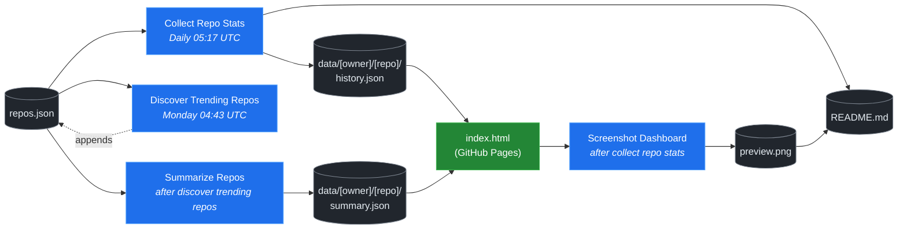

# 🚀 Rising Repos Tracker

> Automatically tracks daily GitHub stats (stars, forks, issues, velocity) for rising open source repos.

[](https://www.telosignal.com/)


**[→ View Live Dashboard](https://patrick-creates.github.io/rising-repos-tracker/)**

Built and maintained by [Telosignal](https://www.telosignal.com/).


<!-- AUTOGEN-STATS-START -->
## 📊 Current snapshot

> Auto-updated daily — last refreshed 2026-08-24

| Metric | Value |
|---|---|
| Repos tracked | **186** |
| Total stars | **8,967,156** |
| Total forks | **1,330,591** |
| Fastest growing | **watermarks-remover** (+1461.6/day) |

### 🔥 Top 5 by velocity

| # | Repo | Stars | Stars/day |
|---|---|---:|---:|
| 1 | [guillaumemeyer/watermarks-remover](https://github.com/guillaumemeyer/watermarks-remover) | 17,552 | +1461.6 |
| 2 | [DietrichGebert/ponytail](https://github.com/DietrichGebert/ponytail) | 108,991 | +967.8 |
| 3 | [bojieli/ai-agent-book](https://github.com/bojieli/ai-agent-book) | 41,373 | +954.9 |
| 4 | [diegosouzapw/OmniRoute](https://github.com/diegosouzapw/OmniRoute) | 53,995 | +853.9 |
| 5 | [NousResearch/hermes-agent](https://github.com/NousResearch/hermes-agent) | 235,186 | +846.0 |

### 🆕 Recently added

- [virgiliojr94/book-to-skill](https://github.com/virgiliojr94/book-to-skill) — added 2026-08-24 — Turn any technical book PDF into a Claude Code skill — ready to study, reference, and use while you work.
- [guillaumemeyer/watermarks-remover](https://github.com/guillaumemeyer/watermarks-remover) — added 2026-08-24 — Strip multi-vendor AI provenance marks: Unicode text hygiene, statistical rewrite hooks, and C2PA/metadata from PNG/JPEG/SVG/PDF/DOCX/HTML/MD
- [holaboss-ai/holaOS](https://github.com/holaboss-ai/holaOS) — added 2026-08-17 — Open-source All in One AI agent workspace. Run any agent — Claude Code, Codex — across your tools (100+ integrations + MCP), apps, browser, and files, with shared memory. Built-in models or BYOK.
<!-- AUTOGEN-STATS-END -->

<!-- AUTOGEN-DIAGRAM-START -->
## 🔄 How it works


```mermaid
graph LR
    repos[("repos.json")]:::data
    history[("data/[owner]/[repo]/<br/>history.json")]:::data
    summary[("data/[owner]/[repo]/<br/>summary.json")]:::data
    readme[("README.md")]:::data
    preview[("preview.png")]:::data
    dashboard["index.html<br/>(GitHub Pages)"]:::output
    collect_yml["Collect Repo Stats<br/><i>Daily 05:17 UTC</i>"]:::workflow
    discover_yml["Discover Trending Repos<br/><i>Monday 04:43 UTC</i>"]:::workflow
    screenshot_yml["Screenshot Dashboard<br/><i>after collect repo stats</i>"]:::workflow
    summarize_yml["Summarize Repos<br/><i>after discover trending repos</i>"]:::workflow
    repos --> collect_yml
    collect_yml --> history
    collect_yml --> readme
    repos --> discover_yml
    discover_yml -.->|appends| repos
    dashboard --> screenshot_yml
    screenshot_yml --> preview
    repos --> summarize_yml
    summarize_yml --> summary
    history --> dashboard
    summary --> dashboard
    preview --> readme
    classDef workflow fill:#1f6feb,stroke:#58a6ff,color:#fff
    classDef data fill:#21262d,stroke:#7d8590,color:#e6edf3
    classDef output fill:#238636,stroke:#3fb950,color:#fff
```
<!-- AUTOGEN-DIAGRAM-END -->

<!-- AUTOGEN-WORKFLOWS-START -->
## ⚙️ Workflows

| File | Schedule | Name |
|---|---|---|
| `collect.yml` | Daily 05:17 UTC | Collect Repo Stats |
| `discover.yml` | Monday 04:43 UTC | Discover Trending Repos |
| `screenshot.yml` | After Collect Repo Stats | Screenshot Dashboard |
| `summarize.yml` | After Discover Trending Repos | Summarize Repos |

> All workflows commit results directly back to the repo. Schedules are best-effort — GitHub Actions cron can drift by a few minutes.
<!-- AUTOGEN-WORKFLOWS-END -->

<!-- AUTOGEN-REPOS-START -->
## 📋 All tracked repos

| Repo | Stars | Forks | Stars/day |
|---|---:|---:|---:|
| [openclaw/openclaw](https://github.com/openclaw/openclaw) | 387,285 | 81,328 | +153.5 |
| [obra/superpowers](https://github.com/obra/superpowers) | 276,766 | 24,759 | +653.8 |
| [affaan-m/everything-claude-code](https://github.com/affaan-m/everything-claude-code) | 242,657 | 36,727 | +598.1 |
| [affaan-m/ECC](https://github.com/affaan-m/ECC) | 242,657 | 36,727 | +554.2 |
| [NousResearch/hermes-agent](https://github.com/NousResearch/hermes-agent) | 235,186 | 47,394 | +846.0 |
| [Significant-Gravitas/AutoGPT](https://github.com/Significant-Gravitas/AutoGPT) | 186,838 | 46,052 | +24.8 |
| [microsoft/markitdown](https://github.com/microsoft/markitdown) | 175,826 | 12,869 | +512.8 |
| [f/prompts.chat](https://github.com/f/prompts.chat) | 167,829 | 21,660 | +54.9 |
| [langgenius/dify](https://github.com/langgenius/dify) | 153,318 | 24,220 | +117.4 |
| [open-webui/open-webui](https://github.com/open-webui/open-webui) | 149,710 | 21,837 | +124.4 |
| [langchain-ai/langchain](https://github.com/langchain-ai/langchain) | 144,859 | 24,146 | +79.8 |
| [github/spec-kit](https://github.com/github/spec-kit) | 130,999 | 11,765 | +321.7 |
| [farion1231/cc-switch](https://github.com/farion1231/cc-switch) | 129,047 | 8,847 | +561.3 |
| [nextlevelbuilder/ui-ux-pro-max-skill](https://github.com/nextlevelbuilder/ui-ux-pro-max-skill) | 120,309 | 12,913 | +411.8 |
| [microsoft/generative-ai-for-beginners](https://github.com/microsoft/generative-ai-for-beginners) | 118,426 | 62,436 | +74.5 |
| [Graphify-Labs/graphify](https://github.com/Graphify-Labs/graphify) | 109,892 | 10,681 | +471.2 |
| [DietrichGebert/ponytail](https://github.com/DietrichGebert/ponytail) | 108,991 | 6,020 | +967.8 |
| [JuliusBrussee/caveman](https://github.com/JuliusBrussee/caveman) | 100,542 | 5,841 | +398.3 |
| [thedotmack/claude-mem](https://github.com/thedotmack/claude-mem) | 91,636 | 8,028 | +157.8 |
| [ruvnet/RuView](https://github.com/ruvnet/RuView) | 91,421 | 12,145 | +280.5 |
| [nexu-io/open-design](https://github.com/nexu-io/open-design) | 90,831 | 10,465 | +476.1 |
| [vllm-project/vllm](https://github.com/vllm-project/vllm) | 89,826 | 21,101 | +96.5 |
| [ChatGPTNextWeb/NextChat](https://github.com/ChatGPTNextWeb/NextChat) | 88,645 | 59,199 | +6.2 |
| [OpenHands/OpenHands](https://github.com/OpenHands/OpenHands) | 84,900 | 11,085 | +111.9 |
| [koala73/worldmonitor](https://github.com/koala73/worldmonitor) | 83,971 | 12,542 | +302.1 |
| [lobehub/lobehub](https://github.com/lobehub/lobehub) | 81,957 | 15,820 | +48.1 |
| [Leonxlnx/taste-skill](https://github.com/Leonxlnx/taste-skill) | 79,773 | 5,463 | +587.6 |
| [dair-ai/Prompt-Engineering-Guide](https://github.com/dair-ai/Prompt-Engineering-Guide) | 77,734 | 8,540 | +30.9 |
| [rtk-ai/rtk](https://github.com/rtk-ai/rtk) | 77,188 | 4,855 | +281.7 |
| [openai/openai-cookbook](https://github.com/openai/openai-cookbook) | 75,509 | 12,760 | +19.4 |
| [shareAI-lab/learn-claude-code](https://github.com/shareAI-lab/learn-claude-code) | 75,057 | 12,115 | +142.7 |
| [Panniantong/Agent-Reach](https://github.com/Panniantong/Agent-Reach) | 74,561 | 6,358 | +663.4 |
| [unslothai/unsloth](https://github.com/unslothai/unsloth) | 74,543 | 6,738 | +102.5 |
| [datawhalechina/hello-agents](https://github.com/datawhalechina/hello-agents) | 74,395 | 9,239 | +242.2 |
| [ComposioHQ/awesome-claude-skills](https://github.com/ComposioHQ/awesome-claude-skills) | 73,119 | 8,384 | +129.9 |
| [code-yeongyu/oh-my-openagent](https://github.com/code-yeongyu/oh-my-openagent) | 68,303 | 5,583 | +101.8 |
| [santifer/career-ops](https://github.com/santifer/career-ops) | 68,004 | 12,930 | +232.2 |
| [chopratejas/headroom](https://github.com/chopratejas/headroom) | 67,314 | 5,190 | +559.3 |
| [headroomlabs-ai/headroom](https://github.com/headroomlabs-ai/headroom) | 67,314 | 5,190 | +339.9 |
| [xtekky/gpt4free](https://github.com/xtekky/gpt4free) | 66,590 | 13,513 | +3.6 |
| [Fission-AI/OpenSpec](https://github.com/Fission-AI/OpenSpec) | 66,017 | 4,541 | +175.8 |
| [shanraisshan/claude-code-best-practice](https://github.com/shanraisshan/claude-code-best-practice) | 64,915 | 6,455 | +116.5 |
| [ZhuLinsen/daily_stock_analysis](https://github.com/ZhuLinsen/daily_stock_analysis) | 63,733 | 53,558 | +273.6 |
| [asgeirtj/system_prompts_leaks](https://github.com/asgeirtj/system_prompts_leaks) | 63,432 | 10,405 | +235.2 |
| [tw93/Pake](https://github.com/tw93/Pake) | 61,033 | 12,521 | +125.0 |
| [mvanhorn/last30days-skill](https://github.com/mvanhorn/last30days-skill) | 59,115 | 5,169 | +343.4 |
| [MemPalace/mempalace](https://github.com/MemPalace/mempalace) | 58,585 | 7,513 | +63.1 |
| [usestrix/strix](https://github.com/usestrix/strix) | 57,496 | 6,234 | +378.4 |
| [BerriAI/litellm](https://github.com/BerriAI/litellm) | 57,103 | 10,841 | +99.1 |
| [FlowiseAI/Flowise](https://github.com/FlowiseAI/Flowise) | 55,385 | 24,947 | +25.4 |
| [diegosouzapw/OmniRoute](https://github.com/diegosouzapw/OmniRoute) | 53,995 | 7,387 | +853.9 |
| [ggml-org/whisper.cpp](https://github.com/ggml-org/whisper.cpp) | 53,123 | 6,088 | +33.6 |
| [hesreallyhim/awesome-claude-code](https://github.com/hesreallyhim/awesome-claude-code) | 52,893 | 4,616 | +89.8 |
| [stablyai/orca](https://github.com/stablyai/orca) | 52,154 | 3,608 | +807.6 |
| [jamiepine/voicebox](https://github.com/jamiepine/voicebox) | 51,253 | 6,392 | +264.7 |
| [calesthio/OpenMontage](https://github.com/calesthio/OpenMontage) | 49,874 | 6,267 | +393.3 |
| [ChromeDevTools/chrome-devtools-mcp](https://github.com/ChromeDevTools/chrome-devtools-mcp) | 49,617 | 3,477 | +99.3 |
| [router-for-me/CLIProxyAPI](https://github.com/router-for-me/CLIProxyAPI) | 48,503 | 7,466 | +151.2 |
| [Aider-AI/aider](https://github.com/Aider-AI/aider) | 48,440 | 4,874 | +35.5 |
| [rohitg00/ai-engineering-from-scratch](https://github.com/rohitg00/ai-engineering-from-scratch) | 47,951 | 8,456 | +257.0 |
| [HKUDS/nanobot](https://github.com/HKUDS/nanobot) | 47,326 | 8,354 | +47.4 |
| [kepano/obsidian-skills](https://github.com/kepano/obsidian-skills) | 47,146 | 3,385 | +157.9 |
| [elder-plinius/CL4R1T4S](https://github.com/elder-plinius/CL4R1T4S) | 47,124 | 9,554 | +117.6 |
| [zhayujie/CowAgent](https://github.com/zhayujie/CowAgent) | 46,642 | 10,324 | +21.3 |
| [QuantumNous/new-api](https://github.com/QuantumNous/new-api) | 46,049 | 10,934 | +117.5 |
| [coreyhaines31/marketingskills](https://github.com/coreyhaines31/marketingskills) | 45,398 | 7,118 | +166.2 |
| [sickn33/antigravity-awesome-skills](https://github.com/sickn33/antigravity-awesome-skills) | 45,322 | 6,636 | +73.0 |
| [sickn33/agentic-awesome-skills](https://github.com/sickn33/agentic-awesome-skills) | 45,322 | 6,636 | +54.3 |
| [Imbad0202/academic-research-skills](https://github.com/Imbad0202/academic-research-skills) | 43,480 | 3,451 | +135.2 |
| [danny-avila/LibreChat](https://github.com/danny-avila/LibreChat) | 42,382 | 8,785 | +54.0 |
| [heygen-com/hyperframes](https://github.com/heygen-com/hyperframes) | 42,355 | 4,057 | +218.1 |
| [chatboxai/chatbox](https://github.com/chatboxai/chatbox) | 41,543 | 4,206 | +15.8 |
| [bojieli/ai-agent-book](https://github.com/bojieli/ai-agent-book) | 41,373 | 4,573 | +954.9 |
| [chatanywhere/GPT_API_free](https://github.com/chatanywhere/GPT_API_free) | 40,997 | 2,700 | +31.2 |
| [Hmbown/CodeWhale](https://github.com/Hmbown/CodeWhale) | 40,830 | 3,536 | +67.7 |
| [langchain-ai/langgraph](https://github.com/langchain-ai/langgraph) | 40,315 | 6,798 | +77.7 |
| [DeusData/codebase-memory-mcp](https://github.com/DeusData/codebase-memory-mcp) | 40,216 | 3,246 | +349.8 |
| [mindsdb/mindshub](https://github.com/mindsdb/mindshub) | 39,637 | 6,234 | +5.6 |
| [AstrBotDevs/AstrBot](https://github.com/AstrBotDevs/AstrBot) | 39,536 | 2,832 | +70.8 |
| [wshobson/agents](https://github.com/wshobson/agents) | 39,061 | 4,164 | +34.3 |
| [Yeachan-Heo/oh-my-claudecode](https://github.com/Yeachan-Heo/oh-my-claudecode) | 38,766 | 3,479 | +43.3 |
| [google/langextract](https://github.com/google/langextract) | 38,477 | 2,702 | +21.1 |
| [github/awesome-copilot](https://github.com/github/awesome-copilot) | 38,172 | 4,820 | +48.0 |
| [songquanpeng/one-api](https://github.com/songquanpeng/one-api) | 36,544 | 6,828 | +25.6 |
| [PDFMathTranslate/PDFMathTranslate](https://github.com/PDFMathTranslate/PDFMathTranslate) | 36,320 | 3,241 | +25.3 |
| [esengine/DeepSeek-Reasonix](https://github.com/esengine/DeepSeek-Reasonix) | 35,086 | 2,332 | +202.1 |
| [agentscope-ai/QwenPaw](https://github.com/agentscope-ai/QwenPaw) | 34,374 | 3,025 | +237.1 |
| [anthropics/claude-plugins-official](https://github.com/anthropics/claude-plugins-official) | 33,897 | 3,851 | +58.2 |
| [AlexsJones/llmfit](https://github.com/AlexsJones/llmfit) | 33,739 | 2,106 | +80.2 |
| [MadsLorentzen/ai-job-search](https://github.com/MadsLorentzen/ai-job-search) | 33,245 | 11,683 | +277.7 |
| [JCodesMore/ai-website-cloner-template](https://github.com/JCodesMore/ai-website-cloner-template) | 32,944 | 4,805 | +227.9 |
| [zeroclaw-labs/zeroclaw](https://github.com/zeroclaw-labs/zeroclaw) | 32,639 | 4,908 | +11.5 |
| [volcengine/OpenViking](https://github.com/volcengine/OpenViking) | 32,607 | 2,488 | +94.5 |
| [iOfficeAI/AionUi](https://github.com/iOfficeAI/AionUi) | 32,231 | 3,309 | +58.1 |
| [ogulcancelik/herdr](https://github.com/ogulcancelik/herdr) | 31,847 | 2,280 | +396.9 |
| [herdrdev/herdr](https://github.com/herdrdev/herdr) | 31,847 | 2,280 | +383.7 |
| [HKUDS/Vibe-Trading](https://github.com/HKUDS/Vibe-Trading) | 31,583 | 5,136 | +300.8 |
| [mukul975/Anthropic-Cybersecurity-Skills](https://github.com/mukul975/Anthropic-Cybersecurity-Skills) | 30,862 | 3,672 | +202.2 |
| [Gitlawb/openclaude](https://github.com/Gitlawb/openclaude) | 30,811 | 8,920 | +31.9 |
| [tirth8205/code-review-graph](https://github.com/tirth8205/code-review-graph) | 30,749 | 2,796 | +174.8 |
| [googleworkspace/cli](https://github.com/googleworkspace/cli) | 30,527 | 1,787 | +45.3 |
| [iOfficeAI/OfficeCLI](https://github.com/iOfficeAI/OfficeCLI) | 29,108 | 1,985 | +422.7 |
| [voideditor/void](https://github.com/voideditor/void) | 28,831 | 2,638 | +0.3 |
| [alibaba/page-agent](https://github.com/alibaba/page-agent) | 28,806 | 2,575 | +146.4 |
| [jackwener/OpenCLI](https://github.com/jackwener/OpenCLI) | 28,503 | 2,797 | +61.1 |
| [langchain-ai/deepagents](https://github.com/langchain-ai/deepagents) | 28,298 | 3,961 | +53.8 |
| [p-e-w/heretic](https://github.com/p-e-w/heretic) | 28,056 | 3,038 | +53.0 |
| [BloopAI/vibe-kanban](https://github.com/BloopAI/vibe-kanban) | 27,900 | 2,985 | +14.2 |
| [jarrodwatts/claude-hud](https://github.com/jarrodwatts/claude-hud) | 27,589 | 1,277 | +37.6 |
| [rohitg00/agentmemory](https://github.com/rohitg00/agentmemory) | 27,329 | 2,337 | +71.5 |
| [can1357/oh-my-pi](https://github.com/can1357/oh-my-pi) | 26,897 | 2,621 | +204.8 |
| [manaflow-ai/cmux](https://github.com/manaflow-ai/cmux) | 26,386 | 2,251 | +48.3 |
| [decolua/9router](https://github.com/decolua/9router) | 26,164 | 4,726 | +122.8 |
| [zai-org/Open-AutoGLM](https://github.com/zai-org/Open-AutoGLM) | 26,073 | 4,020 | +7.9 |
| [toon-format/toon](https://github.com/toon-format/toon) | 25,234 | 1,119 | +9.6 |
| [virgiliojr94/book-to-skill](https://github.com/virgiliojr94/book-to-skill) | 24,829 | 2,596 | +215.7 |
| [TencentCloud/TencentDB-Agent-Memory](https://github.com/TencentCloud/TencentDB-Agent-Memory) | 24,094 | 2,216 | +366.1 |
| [winfunc/opcode](https://github.com/winfunc/opcode) | 22,389 | 1,729 | +5.0 |
| [pascalorg/editor](https://github.com/pascalorg/editor) | 21,672 | 2,781 | +30.1 |
| [pranshuparmar/witr](https://github.com/pranshuparmar/witr) | 21,669 | 756 | +64.9 |
| [coze-dev/coze-studio](https://github.com/coze-dev/coze-studio) | 21,493 | 3,116 | +7.1 |
| [NirDiamant/agents-towards-production](https://github.com/NirDiamant/agents-towards-production) | 21,325 | 2,834 | +9.0 |
| [alibaba/open-code-review](https://github.com/alibaba/open-code-review) | 21,277 | 1,555 | +230.4 |
| [steipete/CodexBar](https://github.com/steipete/CodexBar) | 20,512 | 1,766 | +84.3 |
| [jundot/omlx](https://github.com/jundot/omlx) | 20,467 | 1,734 | +54.8 |
| [Tencent/WeKnora](https://github.com/Tencent/WeKnora) | 20,465 | 2,941 | +59.6 |
| [mksglu/context-mode](https://github.com/mksglu/context-mode) | 20,115 | 1,451 | +37.8 |
| [KKKKhazix/khazix-skills](https://github.com/KKKKhazix/khazix-skills) | 19,996 | 2,158 | +72.5 |
| [jnMetaCode/agency-agents-zh](https://github.com/jnMetaCode/agency-agents-zh) | 19,838 | 3,224 | +70.3 |
| [tanweai/pua](https://github.com/tanweai/pua) | 19,481 | 1,188 | +17.6 |
| [datawhalechina/easy-vibe](https://github.com/datawhalechina/easy-vibe) | 19,070 | 1,827 | +30.4 |
| [danielmiessler/LifeOS](https://github.com/danielmiessler/LifeOS) | 18,697 | 2,437 | +41.8 |
| [1jehuang/jcode](https://github.com/1jehuang/jcode) | 18,377 | 2,072 | +239.8 |
| [RightNow-AI/openfang](https://github.com/RightNow-AI/openfang) | 18,132 | 2,286 | +4.4 |
| [nesquena/hermes-webui](https://github.com/nesquena/hermes-webui) | 17,659 | 2,444 | +44.8 |
| [microsoft/agent-lightning](https://github.com/microsoft/agent-lightning) | 17,627 | 1,558 | +4.5 |
| [guillaumemeyer/watermarks-remover](https://github.com/guillaumemeyer/watermarks-remover) | 17,552 | 2,024 | +1461.6 |
| [browser-use/browser-harness](https://github.com/browser-use/browser-harness) | 17,074 | 1,638 | +28.5 |
| [cft0808/edict](https://github.com/cft0808/edict) | 16,400 | 1,720 | +4.8 |
| [jlcodes99/cockpit-tools](https://github.com/jlcodes99/cockpit-tools) | 16,391 | 1,441 | +65.6 |
| [t8y2/dbx](https://github.com/t8y2/dbx) | 16,351 | 1,609 | +161.2 |
| [MemoriLabs/Memori](https://github.com/MemoriLabs/Memori) | 16,202 | 3,226 | +13.6 |
| [composio-community/awesome-codex-skills](https://github.com/composio-community/awesome-codex-skills) | 16,010 | 1,560 | +21.2 |
| [xbtlin/ai-berkshire](https://github.com/xbtlin/ai-berkshire) | 15,801 | 2,363 | +102.5 |
| [Anionex/banana-slides](https://github.com/Anionex/banana-slides) | 15,495 | 1,773 | +5.8 |
| [xpzouying/xiaohongshu-mcp](https://github.com/xpzouying/xiaohongshu-mcp) | 15,446 | 2,276 | +18.4 |
| [wanshuiyin/Auto-claude-code-research-in-sleep](https://github.com/wanshuiyin/Auto-claude-code-research-in-sleep) | 15,061 | 1,326 | +40.8 |
| [yusufkaraaslan/Skill_Seekers](https://github.com/yusufkaraaslan/Skill_Seekers) | 14,810 | 1,513 | +9.3 |
| [kyegomez/OpenMythos](https://github.com/kyegomez/OpenMythos) | 14,798 | 3,294 | +10.2 |
| [NevaMind-AI/memU](https://github.com/NevaMind-AI/memU) | 14,339 | 1,062 | +7.0 |
| [NanmiCoder/cc-haha](https://github.com/NanmiCoder/cc-haha) | 14,193 | 8,542 | +15.1 |
| [walkinglabs/learn-harness-engineering](https://github.com/walkinglabs/learn-harness-engineering) | 13,924 | 1,390 | +82.4 |
| [superset-sh/superset](https://github.com/superset-sh/superset) | 13,268 | 1,216 | +19.8 |
| [XiaomiMiMo/MiMo-Code](https://github.com/XiaomiMiMo/MiMo-Code) | 12,856 | 1,321 | +32.7 |
| [sirmalloc/ccstatusline](https://github.com/sirmalloc/ccstatusline) | 12,530 | 547 | +22.3 |
| [EverMind-AI/EverOS](https://github.com/EverMind-AI/EverOS) | 12,372 | 904 | +47.4 |
| [0x4m4/hexstrike-ai](https://github.com/0x4m4/hexstrike-ai) | 11,320 | 2,364 | +23.4 |
| [ifixai-ai/iFixAi](https://github.com/ifixai-ai/iFixAi) | 11,257 | 1,141 | +220.3 |
| [brokermr810/QuantDinger](https://github.com/brokermr810/QuantDinger) | 11,017 | 2,317 | +35.4 |
| [OpenByteInc/QuantDinger](https://github.com/OpenByteInc/QuantDinger) | 11,017 | 2,317 | +34.7 |
| [ValueCell-ai/valuecell](https://github.com/ValueCell-ai/valuecell) | 11,003 | 1,809 | +2.3 |
| [aden-hive/hive](https://github.com/aden-hive/hive) | 10,953 | 5,673 | +6.1 |
| [MemTensor/MemOS](https://github.com/MemTensor/MemOS) | 10,943 | 1,004 | +16.4 |
| [holaboss-ai/holaOS](https://github.com/holaboss-ai/holaOS) | 10,728 | 711 | +336.7 |
| [EKKOLearnAI/hermes-studio](https://github.com/EKKOLearnAI/hermes-studio) | 10,548 | 1,286 | +34.4 |
| [ConardLi/garden-skills](https://github.com/ConardLi/garden-skills) | 10,512 | 1,368 | +27.2 |
| [Kuberwastaken/claurst](https://github.com/Kuberwastaken/claurst) | 10,264 | 7,764 | +7.1 |
| [openai/codex-security](https://github.com/openai/codex-security) | 10,122 | 723 | +87.6 |
| [ykdojo/claude-code-tips](https://github.com/ykdojo/claude-code-tips) | 9,869 | 792 | +17.4 |
| [StarTrail-org/PixelRAG](https://github.com/StarTrail-org/PixelRAG) | 9,684 | 827 | +73.8 |
| [getagentseal/codeburn](https://github.com/getagentseal/codeburn) | 9,616 | 766 | +23.4 |
| [frankbria/ralph-claude-code](https://github.com/frankbria/ralph-claude-code) | 9,604 | 721 | +4.8 |
| [EvoMap/evolver](https://github.com/EvoMap/evolver) | 8,992 | 838 | +2.8 |
| [iflytek/astron-agent](https://github.com/iflytek/astron-agent) | 8,947 | 859 | +6.9 |
| [modem-dev/hunk](https://github.com/modem-dev/hunk) | 8,700 | 266 | +47.5 |
| [MiroMindAI/MiroThinker](https://github.com/MiroMindAI/MiroThinker) | 8,360 | 642 | +0.7 |
| [mmulet/term.everything](https://github.com/mmulet/term.everything) | 8,081 | 194 | +1.2 |
| [ValueCell-ai/ClawX](https://github.com/ValueCell-ai/ClawX) | 7,597 | 1,143 | +1.3 |
| [1weiho/open-slide](https://github.com/1weiho/open-slide) | 6,835 | 490 | +51.2 |
| [opensquilla/opensquilla](https://github.com/opensquilla/opensquilla) | 6,651 | 523 | +12.6 |
| [steipete/summarize](https://github.com/steipete/summarize) | 6,572 | 440 | +3.9 |
| [Andyyyy64/whichllm](https://github.com/Andyyyy64/whichllm) | 6,449 | 350 | +16.6 |
| [Arthur-Ficial/apfel](https://github.com/Arthur-Ficial/apfel) | 6,311 | 242 | +4.7 |
| [microsoft/fara](https://github.com/microsoft/fara) | 6,146 | 600 | +3.5 |
| [UfoMiao/zcf](https://github.com/UfoMiao/zcf) | 6,077 | 421 | +0.2 |
| [re4/LibreCode](https://github.com/re4/LibreCode) | 84 | 5 | — |
<!-- AUTOGEN-REPOS-END -->

---

## What it does

- Collects daily snapshots of stars, forks, watchers and open issues for every tracked repo
- Discovers new trending repos automatically every Monday using the GitHub Search API
- Generates AI summaries (use cases, similar tools, tags) for each tracked repo via GitHub Models
- Stores all history as plain JSON — no database, no backend
- Renders a live dashboard via GitHub Pages — updates daily, zero maintenance

## Tracked repos

Data lives in [`data/`](./data) — one folder per repo, one `history.json` per entry.  
The full watch list is in [`repos.json`](./repos.json).

## Fork & use it for yourself

This is my personal tracker — the watch list reflects what I find interesting. If you want to track different repos, the best path is to **fork this repo and run your own**.

### Setup

1. Fork this repo to your account
2. Replace the contents of [`repos.json`](./repos.json) with the repos you want to track (or just leave one entry — `discover.yml` will auto-add more every Monday)
3. Go to **Settings → Pages** and enable GitHub Pages from the `main` branch
4. Go to **Actions** and run **Collect Repo Stats** once manually to seed your first data point
5. Your dashboard will be live at `https://YOUR-USERNAME.github.io/rising-repos-tracker/`

That's it — daily collection and weekly discovery run automatically on schedule. Zero ongoing maintenance.

### Customizing what gets discovered

Edit [`scripts/discover.js`](./scripts/discover.js) to change:

- `MIN_STARS` — minimum star threshold for candidates
- `MAX_AGE_DAYS` — how recent a repo must be
- `MAX_NEW_REPOS` — how many to add per discovery run
- The `queries` array — GitHub Search API queries that define what "trending" means to you

### Adding a repo manually

Just edit `repos.json` directly:

```json
{
  "owner": "OWNER",
  "repo": "REPO",
  "added": "YYYY-MM-DD",
  "notes": "why you're tracking this"
}
```

The next daily collect run picks it up automatically.

## Stack

- **GitHub Actions** — scheduling and automation
- **GitHub Pages** — dashboard hosting
- **GitHub API** — data source
- **GitHub Models** — free AI summaries (gpt-4o-mini)
- **Chart.js** — star growth visualization
- **Mermaid** — architecture diagram (rendered by GitHub)
- No dependencies, no build step, no database

## License

MIT
