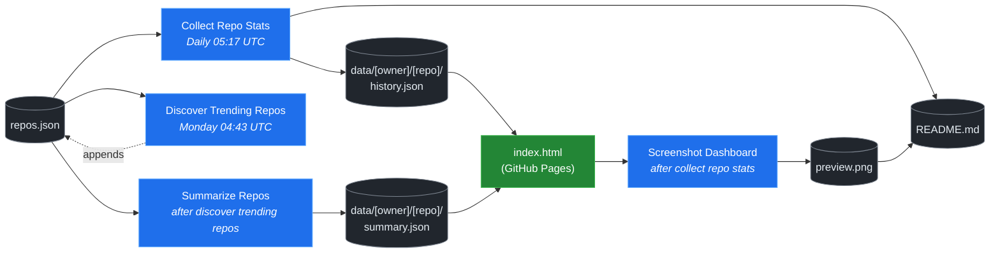

# 🚀 Rising Repos Tracker

> Automatically tracks daily GitHub stats (stars, forks, issues, velocity) for rising open source repos.

[](https://www.telosignal.com/)


**[→ View Live Dashboard](https://patrick-creates.github.io/rising-repos-tracker/)**

Built and maintained by [Telosignal](https://www.telosignal.com/).


<!-- AUTOGEN-STATS-START -->
## 📊 Current snapshot

> Auto-updated daily — last refreshed 2026-08-17

| Metric | Value |
|---|---|
| Repos tracked | **184** |
| Total stars | **8,789,940** |
| Total forks | **1,309,701** |
| Fastest growing | **ai-agent-book** (+1075.5/day) |

### 🔥 Top 5 by velocity

| # | Repo | Stars | Stars/day |
|---|---|---:|---:|
| 1 | [bojieli/ai-agent-book](https://github.com/bojieli/ai-agent-book) | 38,066 | +1075.5 |
| 2 | [DietrichGebert/ponytail](https://github.com/DietrichGebert/ponytail) | 104,246 | +1004.1 |
| 3 | [diegosouzapw/OmniRoute](https://github.com/diegosouzapw/OmniRoute) | 49,298 | +884.4 |
| 4 | [NousResearch/hermes-agent](https://github.com/NousResearch/hermes-agent) | 231,640 | +870.8 |
| 5 | [stablyai/orca](https://github.com/stablyai/orca) | 46,751 | +813.5 |

### 🆕 Recently added

- [holaboss-ai/holaOS](https://github.com/holaboss-ai/holaOS) — added 2026-08-17 — Open-source All in One AI agent workspace. Run any agent — Claude Code, Codex — across your tools (100+ integrations + MCP), apps, browser, and files, with shared memory. Built-in models or BYOK.
- [pascalorg/editor](https://github.com/pascalorg/editor) — added 2026-08-10 — Create and share 3D architectural projects.
- [jlcodes99/cockpit-tools](https://github.com/jlcodes99/cockpit-tools) — added 2026-08-10 —  🚀 通用 AI IDE 账号管理工具：支持 Antigravity / Codex / GitHub Copilot / Windsurf / Kiro / Cursor / Gemini-cli / CodeBuddy，多账号切换、配额监控、自动唤醒与多开实例管理。 🚀 Universal AI IDE account manager for Antigravity / Codex / GitHub Copilot / Windsurf / Kiro / Cursor / Gemini-cli / CodeBuddy, with multi-account switching, quota monitoring, wake-up automation, and multi-insta
<!-- AUTOGEN-STATS-END -->

<!-- AUTOGEN-DIAGRAM-START -->
## 🔄 How it works


```mermaid
graph LR
    repos[("repos.json")]:::data
    history[("data/[owner]/[repo]/<br/>history.json")]:::data
    summary[("data/[owner]/[repo]/<br/>summary.json")]:::data
    readme[("README.md")]:::data
    preview[("preview.png")]:::data
    dashboard["index.html<br/>(GitHub Pages)"]:::output
    collect_yml["Collect Repo Stats<br/><i>Daily 05:17 UTC</i>"]:::workflow
    discover_yml["Discover Trending Repos<br/><i>Monday 04:43 UTC</i>"]:::workflow
    screenshot_yml["Screenshot Dashboard<br/><i>after collect repo stats</i>"]:::workflow
    summarize_yml["Summarize Repos<br/><i>after discover trending repos</i>"]:::workflow
    repos --> collect_yml
    collect_yml --> history
    collect_yml --> readme
    repos --> discover_yml
    discover_yml -.->|appends| repos
    dashboard --> screenshot_yml
    screenshot_yml --> preview
    repos --> summarize_yml
    summarize_yml --> summary
    history --> dashboard
    summary --> dashboard
    preview --> readme
    classDef workflow fill:#1f6feb,stroke:#58a6ff,color:#fff
    classDef data fill:#21262d,stroke:#7d8590,color:#e6edf3
    classDef output fill:#238636,stroke:#3fb950,color:#fff
```
<!-- AUTOGEN-DIAGRAM-END -->

<!-- AUTOGEN-WORKFLOWS-START -->
## ⚙️ Workflows

| File | Schedule | Name |
|---|---|---|
| `collect.yml` | Daily 05:17 UTC | Collect Repo Stats |
| `discover.yml` | Monday 04:43 UTC | Discover Trending Repos |
| `screenshot.yml` | After Collect Repo Stats | Screenshot Dashboard |
| `summarize.yml` | After Discover Trending Repos | Summarize Repos |

> All workflows commit results directly back to the repo. Schedules are best-effort — GitHub Actions cron can drift by a few minutes.
<!-- AUTOGEN-WORKFLOWS-END -->

<!-- AUTOGEN-REPOS-START -->
## 📋 All tracked repos

| Repo | Stars | Forks | Stars/day |
|---|---:|---:|---:|
| [openclaw/openclaw](https://github.com/openclaw/openclaw) | 386,497 | 81,213 | +156.5 |
| [obra/superpowers](https://github.com/obra/superpowers) | 272,889 | 24,402 | +666.3 |
| [affaan-m/everything-claude-code](https://github.com/affaan-m/everything-claude-code) | 240,542 | 36,490 | +619.7 |
| [affaan-m/ECC](https://github.com/affaan-m/ECC) | 240,542 | 36,490 | +575.2 |
| [NousResearch/hermes-agent](https://github.com/NousResearch/hermes-agent) | 231,640 | 46,083 | +870.8 |
| [Significant-Gravitas/AutoGPT](https://github.com/Significant-Gravitas/AutoGPT) | 186,650 | 46,065 | +24.7 |
| [microsoft/markitdown](https://github.com/microsoft/markitdown) | 174,144 | 12,721 | +532.7 |
| [f/prompts.chat](https://github.com/f/prompts.chat) | 167,288 | 21,593 | +53.3 |
| [langgenius/dify](https://github.com/langgenius/dify) | 152,662 | 24,103 | +119.1 |
| [open-webui/open-webui](https://github.com/open-webui/open-webui) | 148,976 | 21,688 | +125.9 |
| [langchain-ai/langchain](https://github.com/langchain-ai/langchain) | 144,369 | 24,027 | +80.6 |
| [github/spec-kit](https://github.com/github/spec-kit) | 129,601 | 11,597 | +330.6 |
| [farion1231/cc-switch](https://github.com/farion1231/cc-switch) | 127,679 | 8,733 | +589.4 |
| [microsoft/generative-ai-for-beginners](https://github.com/microsoft/generative-ai-for-beginners) | 117,894 | 62,203 | +74.4 |
| [nextlevelbuilder/ui-ux-pro-max-skill](https://github.com/nextlevelbuilder/ui-ux-pro-max-skill) | 117,397 | 12,623 | +411.5 |
| [Graphify-Labs/graphify](https://github.com/Graphify-Labs/graphify) | 107,200 | 10,416 | +500.1 |
| [DietrichGebert/ponytail](https://github.com/DietrichGebert/ponytail) | 104,246 | 5,745 | +1004.1 |
| [JuliusBrussee/caveman](https://github.com/JuliusBrussee/caveman) | 98,576 | 5,708 | +407.3 |
| [thedotmack/claude-mem](https://github.com/thedotmack/claude-mem) | 90,929 | 7,942 | +162.0 |
| [ruvnet/RuView](https://github.com/ruvnet/RuView) | 90,398 | 12,014 | +291.7 |
| [vllm-project/vllm](https://github.com/vllm-project/vllm) | 89,220 | 20,791 | +97.3 |
| [ChatGPTNextWeb/NextChat](https://github.com/ChatGPTNextWeb/NextChat) | 88,621 | 59,242 | +6.4 |
| [nexu-io/open-design](https://github.com/nexu-io/open-design) | 87,794 | 10,166 | +479.3 |
| [OpenHands/OpenHands](https://github.com/OpenHands/OpenHands) | 84,251 | 10,941 | +113.4 |
| [koala73/worldmonitor](https://github.com/koala73/worldmonitor) | 82,479 | 12,314 | +308.9 |
| [lobehub/lobehub](https://github.com/lobehub/lobehub) | 81,758 | 15,812 | +49.6 |
| [dair-ai/Prompt-Engineering-Guide](https://github.com/dair-ai/Prompt-Engineering-Guide) | 77,513 | 8,515 | +30.9 |
| [Leonxlnx/taste-skill](https://github.com/Leonxlnx/taste-skill) | 77,173 | 5,278 | +607.3 |
| [rtk-ai/rtk](https://github.com/rtk-ai/rtk) | 76,317 | 4,794 | +293.8 |
| [openai/openai-cookbook](https://github.com/openai/openai-cookbook) | 75,275 | 12,727 | +18.3 |
| [shareAI-lab/learn-claude-code](https://github.com/shareAI-lab/learn-claude-code) | 74,411 | 12,045 | +146.5 |
| [datawhalechina/hello-agents](https://github.com/datawhalechina/hello-agents) | 73,261 | 9,117 | +248.4 |
| [unslothai/unsloth](https://github.com/unslothai/unsloth) | 72,783 | 6,560 | +91.0 |
| [ComposioHQ/awesome-claude-skills](https://github.com/ComposioHQ/awesome-claude-skills) | 72,632 | 8,290 | +134.5 |
| [Panniantong/Agent-Reach](https://github.com/Panniantong/Agent-Reach) | 72,365 | 6,149 | +698.4 |
| [code-yeongyu/oh-my-openagent](https://github.com/code-yeongyu/oh-my-openagent) | 67,975 | 5,549 | +106.0 |
| [chopratejas/headroom](https://github.com/chopratejas/headroom) | 66,557 | 5,111 | +609.4 |
| [headroomlabs-ai/headroom](https://github.com/headroomlabs-ai/headroom) | 66,557 | 5,111 | +368.8 |
| [xtekky/gpt4free](https://github.com/xtekky/gpt4free) | 66,556 | 13,520 | +3.5 |
| [Fission-AI/OpenSpec](https://github.com/Fission-AI/OpenSpec) | 65,110 | 4,487 | +179.4 |
| [shanraisshan/claude-code-best-practice](https://github.com/shanraisshan/claude-code-best-practice) | 64,585 | 6,413 | +121.8 |
| [santifer/career-ops](https://github.com/santifer/career-ops) | 64,117 | 12,628 | +207.4 |
| [ZhuLinsen/daily_stock_analysis](https://github.com/ZhuLinsen/daily_stock_analysis) | 63,064 | 53,042 | +288.4 |
| [asgeirtj/system_prompts_leaks](https://github.com/asgeirtj/system_prompts_leaks) | 63,038 | 10,348 | +248.9 |
| [tw93/Pake](https://github.com/tw93/Pake) | 60,756 | 12,435 | +131.6 |
| [mvanhorn/last30days-skill](https://github.com/mvanhorn/last30days-skill) | 58,422 | 5,078 | +367.9 |
| [MemPalace/mempalace](https://github.com/MemPalace/mempalace) | 58,413 | 7,495 | +66.1 |
| [BerriAI/litellm](https://github.com/BerriAI/litellm) | 56,498 | 10,639 | +100.1 |
| [FlowiseAI/Flowise](https://github.com/FlowiseAI/Flowise) | 55,379 | 24,908 | +27.2 |
| [usestrix/strix](https://github.com/usestrix/strix) | 53,466 | 5,727 | +360.5 |
| [ggml-org/whisper.cpp](https://github.com/ggml-org/whisper.cpp) | 52,947 | 6,073 | +34.3 |
| [hesreallyhim/awesome-claude-code](https://github.com/hesreallyhim/awesome-claude-code) | 52,446 | 4,591 | +91.8 |
| [jamiepine/voicebox](https://github.com/jamiepine/voicebox) | 50,593 | 6,285 | +280.1 |
| [diegosouzapw/OmniRoute](https://github.com/diegosouzapw/OmniRoute) | 49,298 | 6,720 | +884.4 |
| [ChromeDevTools/chrome-devtools-mcp](https://github.com/ChromeDevTools/chrome-devtools-mcp) | 49,273 | 3,432 | +103.2 |
| [calesthio/OpenMontage](https://github.com/calesthio/OpenMontage) | 48,428 | 6,062 | +419.9 |
| [Aider-AI/aider](https://github.com/Aider-AI/aider) | 48,276 | 4,850 | +36.4 |
| [router-for-me/CLIProxyAPI](https://github.com/router-for-me/CLIProxyAPI) | 47,494 | 7,355 | +151.8 |
| [HKUDS/nanobot](https://github.com/HKUDS/nanobot) | 47,076 | 8,318 | +48.3 |
| [elder-plinius/CL4R1T4S](https://github.com/elder-plinius/CL4R1T4S) | 46,977 | 9,543 | +128.3 |
| [rohitg00/ai-engineering-from-scratch](https://github.com/rohitg00/ai-engineering-from-scratch) | 46,956 | 8,214 | +267.4 |
| [stablyai/orca](https://github.com/stablyai/orca) | 46,751 | 3,262 | +813.5 |
| [zhayujie/CowAgent](https://github.com/zhayujie/CowAgent) | 46,530 | 10,316 | +21.7 |
| [kepano/obsidian-skills](https://github.com/kepano/obsidian-skills) | 46,406 | 3,325 | +162.6 |
| [QuantumNous/new-api](https://github.com/QuantumNous/new-api) | 45,305 | 10,727 | +118.4 |
| [sickn33/agentic-awesome-skills](https://github.com/sickn33/agentic-awesome-skills) | 45,041 | 6,589 | +57.1 |
| [sickn33/antigravity-awesome-skills](https://github.com/sickn33/antigravity-awesome-skills) | 45,040 | 6,589 | +75.7 |
| [coreyhaines31/marketingskills](https://github.com/coreyhaines31/marketingskills) | 44,545 | 6,993 | +170.2 |
| [Imbad0202/academic-research-skills](https://github.com/Imbad0202/academic-research-skills) | 42,727 | 3,399 | +144.4 |
| [danny-avila/LibreChat](https://github.com/danny-avila/LibreChat) | 42,115 | 8,715 | +55.3 |
| [chatboxai/chatbox](https://github.com/chatboxai/chatbox) | 41,452 | 4,200 | +16.0 |
| [heygen-com/hyperframes](https://github.com/heygen-com/hyperframes) | 41,267 | 3,944 | +224.4 |
| [Hmbown/CodeWhale](https://github.com/Hmbown/CodeWhale) | 40,823 | 3,532 | +73.3 |
| [chatanywhere/GPT_API_free](https://github.com/chatanywhere/GPT_API_free) | 40,449 | 2,690 | +27.3 |
| [langchain-ai/langgraph](https://github.com/langchain-ai/langgraph) | 39,831 | 6,693 | +78.8 |
| [mindsdb/mindshub](https://github.com/mindsdb/mindshub) | 39,593 | 6,229 | +5.5 |
| [AstrBotDevs/AstrBot](https://github.com/AstrBotDevs/AstrBot) | 39,270 | 2,800 | +73.8 |
| [DeusData/codebase-memory-mcp](https://github.com/DeusData/codebase-memory-mcp) | 39,166 | 3,134 | +378.3 |
| [wshobson/agents](https://github.com/wshobson/agents) | 38,861 | 4,139 | +34.8 |
| [Yeachan-Heo/oh-my-claudecode](https://github.com/Yeachan-Heo/oh-my-claudecode) | 38,602 | 3,467 | +45.0 |
| [google/langextract](https://github.com/google/langextract) | 38,407 | 2,695 | +22.0 |
| [bojieli/ai-agent-book](https://github.com/bojieli/ai-agent-book) | 38,066 | 4,192 | +1075.5 |
| [github/awesome-copilot](https://github.com/github/awesome-copilot) | 37,914 | 4,782 | +48.9 |
| [songquanpeng/one-api](https://github.com/songquanpeng/one-api) | 36,412 | 6,805 | +26.2 |
| [PDFMathTranslate/PDFMathTranslate](https://github.com/PDFMathTranslate/PDFMathTranslate) | 36,188 | 3,230 | +25.9 |
| [esengine/DeepSeek-Reasonix](https://github.com/esengine/DeepSeek-Reasonix) | 34,645 | 2,304 | +216.0 |
| [agentscope-ai/QwenPaw](https://github.com/agentscope-ai/QwenPaw) | 33,788 | 3,003 | +254.1 |
| [anthropics/claude-plugins-official](https://github.com/anthropics/claude-plugins-official) | 33,596 | 3,814 | +59.5 |
| [zeroclaw-labs/zeroclaw](https://github.com/zeroclaw-labs/zeroclaw) | 32,600 | 4,895 | +12.0 |
| [JCodesMore/ai-website-cloner-template](https://github.com/JCodesMore/ai-website-cloner-template) | 32,229 | 4,688 | +241.8 |
| [iOfficeAI/AionUi](https://github.com/iOfficeAI/AionUi) | 32,051 | 3,282 | +61.1 |
| [MadsLorentzen/ai-job-search](https://github.com/MadsLorentzen/ai-job-search) | 31,989 | 11,157 | +297.3 |
| [AlexsJones/llmfit](https://github.com/AlexsJones/llmfit) | 31,938 | 1,983 | +64.1 |
| [HKUDS/Vibe-Trading](https://github.com/HKUDS/Vibe-Trading) | 31,057 | 5,034 | +333.0 |
| [Gitlawb/openclaude](https://github.com/Gitlawb/openclaude) | 30,703 | 8,912 | +33.4 |
| [googleworkspace/cli](https://github.com/googleworkspace/cli) | 30,415 | 1,782 | +48.0 |
| [tirth8205/code-review-graph](https://github.com/tirth8205/code-review-graph) | 30,374 | 2,777 | +188.3 |
| [ogulcancelik/herdr](https://github.com/ogulcancelik/herdr) | 29,825 | 2,120 | +415.0 |
| [herdrdev/herdr](https://github.com/herdrdev/herdr) | 29,825 | 2,120 | +431.1 |
| [voideditor/void](https://github.com/voideditor/void) | 28,838 | 2,627 | +0.4 |
| [volcengine/OpenViking](https://github.com/volcengine/OpenViking) | 28,738 | 2,267 | +48.7 |
| [alibaba/page-agent](https://github.com/alibaba/page-agent) | 28,650 | 2,553 | +160.2 |
| [iOfficeAI/OfficeCLI](https://github.com/iOfficeAI/OfficeCLI) | 28,566 | 1,941 | +480.2 |
| [jackwener/OpenCLI](https://github.com/jackwener/OpenCLI) | 28,252 | 2,776 | +63.6 |
| [mukul975/Anthropic-Cybersecurity-Skills](https://github.com/mukul975/Anthropic-Cybersecurity-Skills) | 28,020 | 3,416 | +176.8 |
| [langchain-ai/deepagents](https://github.com/langchain-ai/deepagents) | 27,832 | 3,886 | +52.5 |
| [BloopAI/vibe-kanban](https://github.com/BloopAI/vibe-kanban) | 27,824 | 2,969 | +14.5 |
| [p-e-w/heretic](https://github.com/p-e-w/heretic) | 27,741 | 3,001 | +53.8 |
| [jarrodwatts/claude-hud](https://github.com/jarrodwatts/claude-hud) | 27,432 | 1,271 | +39.2 |
| [rohitg00/agentmemory](https://github.com/rohitg00/agentmemory) | 27,091 | 2,313 | +75.2 |
| [manaflow-ai/cmux](https://github.com/manaflow-ai/cmux) | 26,128 | 2,223 | +50.6 |
| [zai-org/Open-AutoGLM](https://github.com/zai-org/Open-AutoGLM) | 26,023 | 4,015 | +8.0 |
| [decolua/9router](https://github.com/decolua/9router) | 25,602 | 4,576 | +127.5 |
| [can1357/oh-my-pi](https://github.com/can1357/oh-my-pi) | 25,294 | 2,439 | +201.8 |
| [toon-format/toon](https://github.com/toon-format/toon) | 25,181 | 1,115 | +9.8 |
| [winfunc/opcode](https://github.com/winfunc/opcode) | 22,382 | 1,726 | +5.4 |
| [TencentCloud/TencentDB-Agent-Memory](https://github.com/TencentCloud/TencentDB-Agent-Memory) | 22,338 | 2,039 | +389.1 |
| [pranshuparmar/witr](https://github.com/pranshuparmar/witr) | 21,499 | 752 | +70.8 |
| [coze-dev/coze-studio](https://github.com/coze-dev/coze-studio) | 21,454 | 3,117 | +7.2 |
| [pascalorg/editor](https://github.com/pascalorg/editor) | 21,445 | 2,749 | +27.9 |
| [NirDiamant/agents-towards-production](https://github.com/NirDiamant/agents-towards-production) | 21,293 | 2,822 | +9.4 |
| [alibaba/open-code-review](https://github.com/alibaba/open-code-review) | 20,630 | 1,463 | +253.4 |
| [steipete/CodexBar](https://github.com/steipete/CodexBar) | 20,196 | 1,727 | +89.2 |
| [Tencent/WeKnora](https://github.com/Tencent/WeKnora) | 19,938 | 2,865 | +57.9 |
| [mksglu/context-mode](https://github.com/mksglu/context-mode) | 19,905 | 1,432 | +38.7 |
| [KKKKhazix/khazix-skills](https://github.com/KKKKhazix/khazix-skills) | 19,755 | 2,145 | +82.0 |
| [jnMetaCode/agency-agents-zh](https://github.com/jnMetaCode/agency-agents-zh) | 19,517 | 3,188 | +73.4 |
| [tanweai/pua](https://github.com/tanweai/pua) | 19,439 | 1,181 | +18.9 |
| [datawhalechina/easy-vibe](https://github.com/datawhalechina/easy-vibe) | 18,968 | 1,814 | +32.2 |
| [jundot/omlx](https://github.com/jundot/omlx) | 18,809 | 1,633 | +34.6 |
| [danielmiessler/LifeOS](https://github.com/danielmiessler/LifeOS) | 18,567 | 2,418 | +44.7 |
| [RightNow-AI/openfang](https://github.com/RightNow-AI/openfang) | 18,114 | 2,280 | +4.6 |
| [1jehuang/jcode](https://github.com/1jehuang/jcode) | 17,771 | 1,996 | +270.5 |
| [microsoft/agent-lightning](https://github.com/microsoft/agent-lightning) | 17,488 | 1,541 | +2.8 |
| [nesquena/hermes-webui](https://github.com/nesquena/hermes-webui) | 17,403 | 2,396 | +45.8 |
| [browser-use/browser-harness](https://github.com/browser-use/browser-harness) | 16,728 | 1,591 | +25.5 |
| [cft0808/edict](https://github.com/cft0808/edict) | 16,378 | 1,717 | +5.0 |
| [MemoriLabs/Memori](https://github.com/MemoriLabs/Memori) | 16,130 | 3,193 | +14.1 |
| [jlcodes99/cockpit-tools](https://github.com/jlcodes99/cockpit-tools) | 15,881 | 1,405 | +58.4 |
| [composio-community/awesome-codex-skills](https://github.com/composio-community/awesome-codex-skills) | 15,870 | 1,542 | +21.8 |
| [xbtlin/ai-berkshire](https://github.com/xbtlin/ai-berkshire) | 15,616 | 2,322 | +115.2 |
| [Anionex/banana-slides](https://github.com/Anionex/banana-slides) | 15,475 | 1,773 | +6.8 |
| [xpzouying/xiaohongshu-mcp](https://github.com/xpzouying/xiaohongshu-mcp) | 15,288 | 2,254 | +17.9 |
| [t8y2/dbx](https://github.com/t8y2/dbx) | 15,179 | 1,518 | +159.1 |
| [kyegomez/OpenMythos](https://github.com/kyegomez/OpenMythos) | 14,795 | 3,291 | +11.4 |
| [wanshuiyin/Auto-claude-code-research-in-sleep](https://github.com/wanshuiyin/Auto-claude-code-research-in-sleep) | 14,780 | 1,300 | +40.9 |
| [yusufkaraaslan/Skill_Seekers](https://github.com/yusufkaraaslan/Skill_Seekers) | 14,772 | 1,506 | +9.8 |
| [NevaMind-AI/memU](https://github.com/NevaMind-AI/memU) | 14,313 | 1,059 | +7.4 |
| [NanmiCoder/cc-haha](https://github.com/NanmiCoder/cc-haha) | 14,143 | 8,535 | +19.1 |
| [superset-sh/superset](https://github.com/superset-sh/superset) | 12,973 | 1,197 | +16.6 |
| [XiaomiMiMo/MiMo-Code](https://github.com/XiaomiMiMo/MiMo-Code) | 12,758 | 1,304 | +35.4 |
| [sirmalloc/ccstatusline](https://github.com/sirmalloc/ccstatusline) | 12,436 | 544 | +23.6 |
| [EverMind-AI/EverOS](https://github.com/EverMind-AI/EverOS) | 12,054 | 892 | +47.7 |
| [walkinglabs/learn-harness-engineering](https://github.com/walkinglabs/learn-harness-engineering) | 11,640 | 1,249 | +41.8 |
| [0x4m4/hexstrike-ai](https://github.com/0x4m4/hexstrike-ai) | 11,107 | 2,330 | +22.4 |
| [ValueCell-ai/valuecell](https://github.com/ValueCell-ai/valuecell) | 11,001 | 1,814 | +2.6 |
| [aden-hive/hive](https://github.com/aden-hive/hive) | 10,917 | 5,670 | +6.2 |
| [brokermr810/QuantDinger](https://github.com/brokermr810/QuantDinger) | 10,752 | 2,272 | +35.0 |
| [OpenByteInc/QuantDinger](https://github.com/OpenByteInc/QuantDinger) | 10,752 | 2,272 | +33.9 |
| [MemTensor/MemOS](https://github.com/MemTensor/MemOS) | 10,739 | 993 | +14.5 |
| [ConardLi/garden-skills](https://github.com/ConardLi/garden-skills) | 10,362 | 1,357 | +28.1 |
| [EKKOLearnAI/hermes-studio](https://github.com/EKKOLearnAI/hermes-studio) | 10,342 | 1,257 | +35.3 |
| [Kuberwastaken/claurst](https://github.com/Kuberwastaken/claurst) | 10,248 | 7,773 | +7.8 |
| [openai/codex-security](https://github.com/openai/codex-security) | 9,901 | 695 | +115.6 |
| [ykdojo/claude-code-tips](https://github.com/ykdojo/claude-code-tips) | 9,697 | 776 | +16.2 |
| [frankbria/ralph-claude-code](https://github.com/frankbria/ralph-claude-code) | 9,605 | 722 | +5.1 |
| [StarTrail-org/PixelRAG](https://github.com/StarTrail-org/PixelRAG) | 9,559 | 816 | +85.0 |
| [getagentseal/codeburn](https://github.com/getagentseal/codeburn) | 9,429 | 749 | +22.8 |
| [EvoMap/evolver](https://github.com/EvoMap/evolver) | 8,978 | 835 | +2.9 |
| [iflytek/astron-agent](https://github.com/iflytek/astron-agent) | 8,957 | 860 | +8.3 |
| [ifixai-ai/iFixAi](https://github.com/ifixai-ai/iFixAi) | 8,794 | 849 | +88.7 |
| [modem-dev/hunk](https://github.com/modem-dev/hunk) | 8,464 | 256 | +50.3 |
| [holaboss-ai/holaOS](https://github.com/holaboss-ai/holaOS) | 8,371 | 673 | +56.9 |
| [MiroMindAI/MiroThinker](https://github.com/MiroMindAI/MiroThinker) | 8,358 | 642 | +0.8 |
| [mmulet/term.everything](https://github.com/mmulet/term.everything) | 8,082 | 194 | +1.5 |
| [ValueCell-ai/ClawX](https://github.com/ValueCell-ai/ClawX) | 7,596 | 1,142 | +1.6 |
| [opensquilla/opensquilla](https://github.com/opensquilla/opensquilla) | 6,571 | 524 | +12.9 |
| [steipete/summarize](https://github.com/steipete/summarize) | 6,555 | 441 | +4.1 |
| [1weiho/open-slide](https://github.com/1weiho/open-slide) | 6,523 | 466 | +57.9 |
| [Andyyyy64/whichllm](https://github.com/Andyyyy64/whichllm) | 6,319 | 340 | +16.1 |
| [Arthur-Ficial/apfel](https://github.com/Arthur-Ficial/apfel) | 6,297 | 241 | +5.2 |
| [microsoft/fara](https://github.com/microsoft/fara) | 6,143 | 601 | +4.1 |
| [UfoMiao/zcf](https://github.com/UfoMiao/zcf) | 6,080 | 423 | +0.3 |
| [re4/LibreCode](https://github.com/re4/LibreCode) | 84 | 5 | — |
<!-- AUTOGEN-REPOS-END -->

---

## What it does

- Collects daily snapshots of stars, forks, watchers and open issues for every tracked repo
- Discovers new trending repos automatically every Monday using the GitHub Search API
- Generates AI summaries (use cases, similar tools, tags) for each tracked repo via GitHub Models
- Stores all history as plain JSON — no database, no backend
- Renders a live dashboard via GitHub Pages — updates daily, zero maintenance

## Tracked repos

Data lives in [`data/`](./data) — one folder per repo, one `history.json` per entry.  
The full watch list is in [`repos.json`](./repos.json).

## Fork & use it for yourself

This is my personal tracker — the watch list reflects what I find interesting. If you want to track different repos, the best path is to **fork this repo and run your own**.

### Setup

1. Fork this repo to your account
2. Replace the contents of [`repos.json`](./repos.json) with the repos you want to track (or just leave one entry — `discover.yml` will auto-add more every Monday)
3. Go to **Settings → Pages** and enable GitHub Pages from the `main` branch
4. Go to **Actions** and run **Collect Repo Stats** once manually to seed your first data point
5. Your dashboard will be live at `https://YOUR-USERNAME.github.io/rising-repos-tracker/`

That's it — daily collection and weekly discovery run automatically on schedule. Zero ongoing maintenance.

### Customizing what gets discovered

Edit [`scripts/discover.js`](./scripts/discover.js) to change:

- `MIN_STARS` — minimum star threshold for candidates
- `MAX_AGE_DAYS` — how recent a repo must be
- `MAX_NEW_REPOS` — how many to add per discovery run
- The `queries` array — GitHub Search API queries that define what "trending" means to you

### Adding a repo manually

Just edit `repos.json` directly:

```json
{
  "owner": "OWNER",
  "repo": "REPO",
  "added": "YYYY-MM-DD",
  "notes": "why you're tracking this"
}
```

The next daily collect run picks it up automatically.

## Stack

- **GitHub Actions** — scheduling and automation
- **GitHub Pages** — dashboard hosting
- **GitHub API** — data source
- **GitHub Models** — free AI summaries (gpt-4o-mini)
- **Chart.js** — star growth visualization
- **Mermaid** — architecture diagram (rendered by GitHub)
- No dependencies, no build step, no database

## License

MIT
