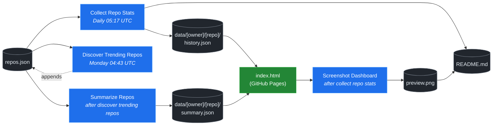

# 🚀 Rising Repos Tracker

> Automatically tracks daily GitHub stats (stars, forks, issues, velocity) for rising open source repos.

[](https://www.telosignal.com/)


**[→ View Live Dashboard](https://patrick-creates.github.io/rising-repos-tracker/)**

Built and maintained by [Telosignal](https://www.telosignal.com/).


<!-- AUTOGEN-STATS-START -->
## 📊 Current snapshot

> Auto-updated daily — last refreshed 2026-08-22

| Metric | Value |
|---|---|
| Repos tracked | **184** |
| Total stars | **8,893,446** |
| Total forks | **1,321,805** |
| Fastest growing | **ai-agent-book** (+994.1/day) |

### 🔥 Top 5 by velocity

| # | Repo | Stars | Stars/day |
|---|---|---:|---:|
| 1 | [bojieli/ai-agent-book](https://github.com/bojieli/ai-agent-book) | 40,757 | +994.1 |
| 2 | [DietrichGebert/ponytail](https://github.com/DietrichGebert/ponytail) | 107,639 | +977.4 |
| 3 | [diegosouzapw/OmniRoute](https://github.com/diegosouzapw/OmniRoute) | 52,800 | +864.9 |
| 4 | [NousResearch/hermes-agent](https://github.com/NousResearch/hermes-agent) | 234,061 | +851.6 |
| 5 | [stablyai/orca](https://github.com/stablyai/orca) | 50,819 | +813.5 |

### 🆕 Recently added

- [holaboss-ai/holaOS](https://github.com/holaboss-ai/holaOS) — added 2026-08-17 — Open-source All in One AI agent workspace. Run any agent — Claude Code, Codex — across your tools (100+ integrations + MCP), apps, browser, and files, with shared memory. Built-in models or BYOK.
- [pascalorg/editor](https://github.com/pascalorg/editor) — added 2026-08-10 — Create and share 3D architectural projects.
- [jlcodes99/cockpit-tools](https://github.com/jlcodes99/cockpit-tools) — added 2026-08-10 —  🚀 通用 AI IDE 账号管理工具：支持 Antigravity / Codex / GitHub Copilot / Windsurf / Kiro / Cursor / Gemini-cli / CodeBuddy，多账号切换、配额监控、自动唤醒与多开实例管理。 🚀 Universal AI IDE account manager for Antigravity / Codex / GitHub Copilot / Windsurf / Kiro / Cursor / Gemini-cli / CodeBuddy, with multi-account switching, quota monitoring, wake-up automation, and multi-insta
<!-- AUTOGEN-STATS-END -->

<!-- AUTOGEN-DIAGRAM-START -->
## 🔄 How it works


```mermaid
graph LR
    repos[("repos.json")]:::data
    history[("data/[owner]/[repo]/<br/>history.json")]:::data
    summary[("data/[owner]/[repo]/<br/>summary.json")]:::data
    readme[("README.md")]:::data
    preview[("preview.png")]:::data
    dashboard["index.html<br/>(GitHub Pages)"]:::output
    collect_yml["Collect Repo Stats<br/><i>Daily 05:17 UTC</i>"]:::workflow
    discover_yml["Discover Trending Repos<br/><i>Monday 04:43 UTC</i>"]:::workflow
    screenshot_yml["Screenshot Dashboard<br/><i>after collect repo stats</i>"]:::workflow
    summarize_yml["Summarize Repos<br/><i>after discover trending repos</i>"]:::workflow
    repos --> collect_yml
    collect_yml --> history
    collect_yml --> readme
    repos --> discover_yml
    discover_yml -.->|appends| repos
    dashboard --> screenshot_yml
    screenshot_yml --> preview
    repos --> summarize_yml
    summarize_yml --> summary
    history --> dashboard
    summary --> dashboard
    preview --> readme
    classDef workflow fill:#1f6feb,stroke:#58a6ff,color:#fff
    classDef data fill:#21262d,stroke:#7d8590,color:#e6edf3
    classDef output fill:#238636,stroke:#3fb950,color:#fff
```
<!-- AUTOGEN-DIAGRAM-END -->

<!-- AUTOGEN-WORKFLOWS-START -->
## ⚙️ Workflows

| File | Schedule | Name |
|---|---|---|
| `collect.yml` | Daily 05:17 UTC | Collect Repo Stats |
| `discover.yml` | Monday 04:43 UTC | Discover Trending Repos |
| `screenshot.yml` | After Collect Repo Stats | Screenshot Dashboard |
| `summarize.yml` | After Discover Trending Repos | Summarize Repos |

> All workflows commit results directly back to the repo. Schedules are best-effort — GitHub Actions cron can drift by a few minutes.
<!-- AUTOGEN-WORKFLOWS-END -->

<!-- AUTOGEN-REPOS-START -->
## 📋 All tracked repos

| Repo | Stars | Forks | Stars/day |
|---|---:|---:|---:|
| [openclaw/openclaw](https://github.com/openclaw/openclaw) | 387,059 | 81,303 | +154.3 |
| [obra/superpowers](https://github.com/obra/superpowers) | 275,747 | 24,655 | +658.5 |
| [affaan-m/everything-claude-code](https://github.com/affaan-m/everything-claude-code) | 241,862 | 36,664 | +602.1 |
| [affaan-m/ECC](https://github.com/affaan-m/ECC) | 241,862 | 36,664 | +557.7 |
| [NousResearch/hermes-agent](https://github.com/NousResearch/hermes-agent) | 234,061 | 47,020 | +851.6 |
| [Significant-Gravitas/AutoGPT](https://github.com/Significant-Gravitas/AutoGPT) | 186,737 | 46,047 | +24.3 |
| [microsoft/markitdown](https://github.com/microsoft/markitdown) | 175,318 | 12,818 | +517.9 |
| [f/prompts.chat](https://github.com/f/prompts.chat) | 167,717 | 21,652 | +54.9 |
| [langgenius/dify](https://github.com/langgenius/dify) | 153,155 | 24,180 | +118.1 |
| [open-webui/open-webui](https://github.com/open-webui/open-webui) | 149,531 | 21,811 | +125.1 |
| [langchain-ai/langchain](https://github.com/langchain-ai/langchain) | 144,743 | 24,113 | +80.3 |
| [github/spec-kit](https://github.com/github/spec-kit) | 130,717 | 11,737 | +325.3 |
| [farion1231/cc-switch](https://github.com/farion1231/cc-switch) | 128,752 | 8,808 | +569.9 |
| [nextlevelbuilder/ui-ux-pro-max-skill](https://github.com/nextlevelbuilder/ui-ux-pro-max-skill) | 119,454 | 12,829 | +411.5 |
| [microsoft/generative-ai-for-beginners](https://github.com/microsoft/generative-ai-for-beginners) | 118,301 | 62,357 | +74.7 |
| [Graphify-Labs/graphify](https://github.com/Graphify-Labs/graphify) | 109,313 | 10,614 | +485.2 |
| [DietrichGebert/ponytail](https://github.com/DietrichGebert/ponytail) | 107,639 | 5,950 | +977.4 |
| [JuliusBrussee/caveman](https://github.com/JuliusBrussee/caveman) | 100,195 | 5,808 | +402.9 |
| [thedotmack/claude-mem](https://github.com/thedotmack/claude-mem) | 91,474 | 8,008 | +159.3 |
| [ruvnet/RuView](https://github.com/ruvnet/RuView) | 91,222 | 12,133 | +284.6 |
| [nexu-io/open-design](https://github.com/nexu-io/open-design) | 90,227 | 10,404 | +479.7 |
| [vllm-project/vllm](https://github.com/vllm-project/vllm) | 89,673 | 21,031 | +96.9 |
| [ChatGPTNextWeb/NextChat](https://github.com/ChatGPTNextWeb/NextChat) | 88,643 | 59,210 | +6.3 |
| [OpenHands/OpenHands](https://github.com/OpenHands/OpenHands) | 84,750 | 11,046 | +112.7 |
| [koala73/worldmonitor](https://github.com/koala73/worldmonitor) | 83,705 | 12,475 | +305.6 |
| [lobehub/lobehub](https://github.com/lobehub/lobehub) | 81,913 | 15,815 | +48.7 |
| [Leonxlnx/taste-skill](https://github.com/Leonxlnx/taste-skill) | 79,055 | 5,399 | +593.2 |
| [dair-ai/Prompt-Engineering-Guide](https://github.com/dair-ai/Prompt-Engineering-Guide) | 77,676 | 8,533 | +31.0 |
| [rtk-ai/rtk](https://github.com/rtk-ai/rtk) | 76,986 | 4,838 | +285.5 |
| [openai/openai-cookbook](https://github.com/openai/openai-cookbook) | 75,465 | 12,752 | +19.3 |
| [shareAI-lab/learn-claude-code](https://github.com/shareAI-lab/learn-claude-code) | 74,914 | 12,094 | +144.1 |
| [unslothai/unsloth](https://github.com/unslothai/unsloth) | 74,298 | 6,717 | +102.1 |
| [datawhalechina/hello-agents](https://github.com/datawhalechina/hello-agents) | 74,144 | 9,209 | +244.6 |
| [Panniantong/Agent-Reach](https://github.com/Panniantong/Agent-Reach) | 73,927 | 6,299 | +672.7 |
| [ComposioHQ/awesome-claude-skills](https://github.com/ComposioHQ/awesome-claude-skills) | 72,985 | 8,359 | +131.2 |
| [code-yeongyu/oh-my-openagent](https://github.com/code-yeongyu/oh-my-openagent) | 68,208 | 5,578 | +102.9 |
| [santifer/career-ops](https://github.com/santifer/career-ops) | 67,547 | 12,877 | +232.3 |
| [chopratejas/headroom](https://github.com/chopratejas/headroom) | 67,127 | 5,175 | +573.0 |
| [headroomlabs-ai/headroom](https://github.com/headroomlabs-ai/headroom) | 67,127 | 5,175 | +347.9 |
| [xtekky/gpt4free](https://github.com/xtekky/gpt4free) | 66,580 | 13,515 | +3.5 |
| [Fission-AI/OpenSpec](https://github.com/Fission-AI/OpenSpec) | 65,854 | 4,530 | +177.8 |
| [shanraisshan/claude-code-best-practice](https://github.com/shanraisshan/claude-code-best-practice) | 64,842 | 6,449 | +118.2 |
| [ZhuLinsen/daily_stock_analysis](https://github.com/ZhuLinsen/daily_stock_analysis) | 63,586 | 53,411 | +278.1 |
| [asgeirtj/system_prompts_leaks](https://github.com/asgeirtj/system_prompts_leaks) | 63,335 | 10,395 | +239.1 |
| [tw93/Pake](https://github.com/tw93/Pake) | 60,970 | 12,505 | +127.0 |
| [mvanhorn/last30days-skill](https://github.com/mvanhorn/last30days-skill) | 58,914 | 5,147 | +349.9 |
| [MemPalace/mempalace](https://github.com/MemPalace/mempalace) | 58,540 | 7,507 | +64.0 |
| [BerriAI/litellm](https://github.com/BerriAI/litellm) | 56,974 | 10,795 | +99.9 |
| [usestrix/strix](https://github.com/usestrix/strix) | 56,804 | 6,119 | +379.2 |
| [FlowiseAI/Flowise](https://github.com/FlowiseAI/Flowise) | 55,384 | 24,936 | +25.9 |
| [ggml-org/whisper.cpp](https://github.com/ggml-org/whisper.cpp) | 53,095 | 6,087 | +34.1 |
| [diegosouzapw/OmniRoute](https://github.com/diegosouzapw/OmniRoute) | 52,800 | 7,193 | +864.9 |
| [hesreallyhim/awesome-claude-code](https://github.com/hesreallyhim/awesome-claude-code) | 52,792 | 4,606 | +90.6 |
| [jamiepine/voicebox](https://github.com/jamiepine/voicebox) | 51,079 | 6,368 | +269.0 |
| [stablyai/orca](https://github.com/stablyai/orca) | 50,819 | 3,508 | +813.5 |
| [ChromeDevTools/chrome-devtools-mcp](https://github.com/ChromeDevTools/chrome-devtools-mcp) | 49,556 | 3,464 | +100.8 |
| [calesthio/OpenMontage](https://github.com/calesthio/OpenMontage) | 49,333 | 6,196 | +397.8 |
| [Aider-AI/aider](https://github.com/Aider-AI/aider) | 48,395 | 4,865 | +35.8 |
| [router-for-me/CLIProxyAPI](https://github.com/router-for-me/CLIProxyAPI) | 48,295 | 7,445 | +152.3 |
| [rohitg00/ai-engineering-from-scratch](https://github.com/rohitg00/ai-engineering-from-scratch) | 47,569 | 8,359 | +258.6 |
| [HKUDS/nanobot](https://github.com/HKUDS/nanobot) | 47,268 | 8,341 | +47.8 |
| [elder-plinius/CL4R1T4S](https://github.com/elder-plinius/CL4R1T4S) | 47,091 | 9,552 | +120.6 |
| [kepano/obsidian-skills](https://github.com/kepano/obsidian-skills) | 47,001 | 3,382 | +160.0 |
| [zhayujie/CowAgent](https://github.com/zhayujie/CowAgent) | 46,629 | 10,319 | +21.6 |
| [QuantumNous/new-api](https://github.com/QuantumNous/new-api) | 45,889 | 10,890 | +118.3 |
| [sickn33/antigravity-awesome-skills](https://github.com/sickn33/antigravity-awesome-skills) | 45,249 | 6,621 | +73.8 |
| [sickn33/agentic-awesome-skills](https://github.com/sickn33/agentic-awesome-skills) | 45,249 | 6,621 | +55.2 |
| [coreyhaines31/marketingskills](https://github.com/coreyhaines31/marketingskills) | 45,208 | 7,095 | +167.9 |
| [Imbad0202/academic-research-skills](https://github.com/Imbad0202/academic-research-skills) | 43,264 | 3,430 | +137.3 |
| [danny-avila/LibreChat](https://github.com/danny-avila/LibreChat) | 42,323 | 8,767 | +54.5 |
| [heygen-com/hyperframes](https://github.com/heygen-com/hyperframes) | 42,004 | 4,025 | +219.2 |
| [chatboxai/chatbox](https://github.com/chatboxai/chatbox) | 41,516 | 4,206 | +15.8 |
| [chatanywhere/GPT_API_free](https://github.com/chatanywhere/GPT_API_free) | 40,868 | 2,696 | +30.5 |
| [Hmbown/CodeWhale](https://github.com/Hmbown/CodeWhale) | 40,835 | 3,537 | +69.3 |
| [bojieli/ai-agent-book](https://github.com/bojieli/ai-agent-book) | 40,757 | 4,486 | +994.1 |
| [langchain-ai/langgraph](https://github.com/langchain-ai/langgraph) | 40,209 | 6,770 | +78.5 |
| [DeusData/codebase-memory-mcp](https://github.com/DeusData/codebase-memory-mcp) | 39,824 | 3,202 | +355.4 |
| [mindsdb/mindshub](https://github.com/mindsdb/mindshub) | 39,626 | 6,233 | +5.6 |
| [AstrBotDevs/AstrBot](https://github.com/AstrBotDevs/AstrBot) | 39,467 | 2,825 | +71.7 |
| [wshobson/agents](https://github.com/wshobson/agents) | 39,011 | 4,152 | +34.6 |
| [Yeachan-Heo/oh-my-claudecode](https://github.com/Yeachan-Heo/oh-my-claudecode) | 38,716 | 3,475 | +43.7 |
| [google/langextract](https://github.com/google/langextract) | 38,466 | 2,699 | +21.5 |
| [github/awesome-copilot](https://github.com/github/awesome-copilot) | 38,112 | 4,815 | +48.4 |
| [songquanpeng/one-api](https://github.com/songquanpeng/one-api) | 36,521 | 6,824 | +26.0 |
| [PDFMathTranslate/PDFMathTranslate](https://github.com/PDFMathTranslate/PDFMathTranslate) | 36,266 | 3,235 | +25.3 |
| [esengine/DeepSeek-Reasonix](https://github.com/esengine/DeepSeek-Reasonix) | 35,020 | 2,325 | +206.6 |
| [agentscope-ai/QwenPaw](https://github.com/agentscope-ai/QwenPaw) | 34,309 | 3,015 | +243.1 |
| [anthropics/claude-plugins-official](https://github.com/anthropics/claude-plugins-official) | 33,802 | 3,844 | +58.4 |
| [AlexsJones/llmfit](https://github.com/AlexsJones/llmfit) | 33,472 | 2,083 | +78.9 |
| [MadsLorentzen/ai-job-search](https://github.com/MadsLorentzen/ai-job-search) | 32,806 | 11,534 | +280.6 |
| [JCodesMore/ai-website-cloner-template](https://github.com/JCodesMore/ai-website-cloner-template) | 32,673 | 4,760 | +230.6 |
| [zeroclaw-labs/zeroclaw](https://github.com/zeroclaw-labs/zeroclaw) | 32,632 | 4,906 | +11.7 |
| [iOfficeAI/AionUi](https://github.com/iOfficeAI/AionUi) | 32,189 | 3,300 | +59.0 |
| [volcengine/OpenViking](https://github.com/volcengine/OpenViking) | 31,750 | 2,428 | +85.6 |
| [ogulcancelik/herdr](https://github.com/ogulcancelik/herdr) | 31,427 | 2,240 | +404.9 |
| [herdrdev/herdr](https://github.com/herdrdev/herdr) | 31,427 | 2,240 | +402.0 |
| [HKUDS/Vibe-Trading](https://github.com/HKUDS/Vibe-Trading) | 31,426 | 5,107 | +309.0 |
| [Gitlawb/openclaude](https://github.com/Gitlawb/openclaude) | 30,791 | 8,917 | +32.4 |
| [tirth8205/code-review-graph](https://github.com/tirth8205/code-review-graph) | 30,680 | 2,793 | +178.9 |
| [mukul975/Anthropic-Cybersecurity-Skills](https://github.com/mukul975/Anthropic-Cybersecurity-Skills) | 30,555 | 3,632 | +203.8 |
| [googleworkspace/cli](https://github.com/googleworkspace/cli) | 30,505 | 1,785 | +46.2 |
| [iOfficeAI/OfficeCLI](https://github.com/iOfficeAI/OfficeCLI) | 29,014 | 1,975 | +438.7 |
| [voideditor/void](https://github.com/voideditor/void) | 28,832 | 2,634 | +0.3 |
| [alibaba/page-agent](https://github.com/alibaba/page-agent) | 28,793 | 2,573 | +150.5 |
| [jackwener/OpenCLI](https://github.com/jackwener/OpenCLI) | 28,440 | 2,790 | +61.9 |
| [langchain-ai/deepagents](https://github.com/langchain-ai/deepagents) | 28,058 | 3,922 | +52.0 |
| [p-e-w/heretic](https://github.com/p-e-w/heretic) | 27,976 | 3,034 | +53.4 |
| [BloopAI/vibe-kanban](https://github.com/BloopAI/vibe-kanban) | 27,883 | 2,980 | +14.3 |
| [jarrodwatts/claude-hud](https://github.com/jarrodwatts/claude-hud) | 27,554 | 1,275 | +38.2 |
| [rohitg00/agentmemory](https://github.com/rohitg00/agentmemory) | 27,256 | 2,331 | +72.4 |
| [can1357/oh-my-pi](https://github.com/can1357/oh-my-pi) | 26,351 | 2,566 | +202.5 |
| [manaflow-ai/cmux](https://github.com/manaflow-ai/cmux) | 26,333 | 2,246 | +49.4 |
| [zai-org/Open-AutoGLM](https://github.com/zai-org/Open-AutoGLM) | 26,066 | 4,021 | +8.1 |
| [decolua/9router](https://github.com/decolua/9router) | 26,026 | 4,693 | +124.3 |
| [toon-format/toon](https://github.com/toon-format/toon) | 25,220 | 1,118 | +9.7 |
| [TencentCloud/TencentDB-Agent-Memory](https://github.com/TencentCloud/TencentDB-Agent-Memory) | 23,711 | 2,188 | +374.8 |
| [winfunc/opcode](https://github.com/winfunc/opcode) | 22,383 | 1,729 | +5.0 |
| [pranshuparmar/witr](https://github.com/pranshuparmar/witr) | 21,632 | 755 | +66.7 |
| [pascalorg/editor](https://github.com/pascalorg/editor) | 21,619 | 2,774 | +30.8 |
| [coze-dev/coze-studio](https://github.com/coze-dev/coze-studio) | 21,490 | 3,118 | +7.2 |
| [NirDiamant/agents-towards-production](https://github.com/NirDiamant/agents-towards-production) | 21,319 | 2,831 | +9.1 |
| [alibaba/open-code-review](https://github.com/alibaba/open-code-review) | 21,088 | 1,531 | +236.2 |
| [steipete/CodexBar](https://github.com/steipete/CodexBar) | 20,443 | 1,760 | +85.9 |
| [Tencent/WeKnora](https://github.com/Tencent/WeKnora) | 20,319 | 2,922 | +59.2 |
| [jundot/omlx](https://github.com/jundot/omlx) | 20,235 | 1,717 | +53.0 |
| [mksglu/context-mode](https://github.com/mksglu/context-mode) | 20,069 | 1,448 | +38.3 |
| [KKKKhazix/khazix-skills](https://github.com/KKKKhazix/khazix-skills) | 19,936 | 2,155 | +75.1 |
| [jnMetaCode/agency-agents-zh](https://github.com/jnMetaCode/agency-agents-zh) | 19,704 | 3,207 | +70.5 |
| [tanweai/pua](https://github.com/tanweai/pua) | 19,477 | 1,186 | +18.1 |
| [datawhalechina/easy-vibe](https://github.com/datawhalechina/easy-vibe) | 19,036 | 1,825 | +30.8 |
| [danielmiessler/LifeOS](https://github.com/danielmiessler/LifeOS) | 18,661 | 2,430 | +42.5 |
| [1jehuang/jcode](https://github.com/1jehuang/jcode) | 18,193 | 2,039 | +247.2 |
| [RightNow-AI/openfang](https://github.com/RightNow-AI/openfang) | 18,126 | 2,287 | +4.4 |
| [nesquena/hermes-webui](https://github.com/nesquena/hermes-webui) | 17,602 | 2,439 | +45.3 |
| [microsoft/agent-lightning](https://github.com/microsoft/agent-lightning) | 17,601 | 1,556 | +4.3 |
| [browser-use/browser-harness](https://github.com/browser-use/browser-harness) | 16,975 | 1,619 | +27.7 |
| [cft0808/edict](https://github.com/cft0808/edict) | 16,394 | 1,721 | +4.9 |
| [jlcodes99/cockpit-tools](https://github.com/jlcodes99/cockpit-tools) | 16,294 | 1,436 | +68.5 |
| [t8y2/dbx](https://github.com/t8y2/dbx) | 16,197 | 1,598 | +167.7 |
| [MemoriLabs/Memori](https://github.com/MemoriLabs/Memori) | 16,187 | 3,219 | +13.8 |
| [composio-community/awesome-codex-skills](https://github.com/composio-community/awesome-codex-skills) | 15,982 | 1,557 | +21.9 |
| [xbtlin/ai-berkshire](https://github.com/xbtlin/ai-berkshire) | 15,747 | 2,356 | +105.7 |
| [Anionex/banana-slides](https://github.com/Anionex/banana-slides) | 15,486 | 1,773 | +5.9 |
| [xpzouying/xiaohongshu-mcp](https://github.com/xpzouying/xiaohongshu-mcp) | 15,418 | 2,271 | +18.5 |
| [wanshuiyin/Auto-claude-code-research-in-sleep](https://github.com/wanshuiyin/Auto-claude-code-research-in-sleep) | 14,991 | 1,319 | +41.1 |
| [kyegomez/OpenMythos](https://github.com/kyegomez/OpenMythos) | 14,800 | 3,292 | +10.6 |
| [yusufkaraaslan/Skill_Seekers](https://github.com/yusufkaraaslan/Skill_Seekers) | 14,794 | 1,507 | +9.3 |
| [NevaMind-AI/memU](https://github.com/NevaMind-AI/memU) | 14,328 | 1,062 | +7.0 |
| [NanmiCoder/cc-haha](https://github.com/NanmiCoder/cc-haha) | 14,183 | 8,542 | +16.2 |
| [walkinglabs/learn-harness-engineering](https://github.com/walkinglabs/learn-harness-engineering) | 13,604 | 1,367 | +79.1 |
| [superset-sh/superset](https://github.com/superset-sh/superset) | 13,206 | 1,206 | +19.4 |
| [XiaomiMiMo/MiMo-Code](https://github.com/XiaomiMiMo/MiMo-Code) | 12,827 | 1,316 | +33.4 |
| [sirmalloc/ccstatusline](https://github.com/sirmalloc/ccstatusline) | 12,509 | 545 | +22.8 |
| [EverMind-AI/EverOS](https://github.com/EverMind-AI/EverOS) | 12,320 | 901 | +48.2 |
| [0x4m4/hexstrike-ai](https://github.com/0x4m4/hexstrike-ai) | 11,272 | 2,357 | +23.4 |
| [ifixai-ai/iFixAi](https://github.com/ifixai-ai/iFixAi) | 11,192 | 1,094 | +251.6 |
| [ValueCell-ai/valuecell](https://github.com/ValueCell-ai/valuecell) | 11,003 | 1,810 | +2.4 |
| [aden-hive/hive](https://github.com/aden-hive/hive) | 10,937 | 5,669 | +6.0 |
| [brokermr810/QuantDinger](https://github.com/brokermr810/QuantDinger) | 10,918 | 2,309 | +34.8 |
| [OpenByteInc/QuantDinger](https://github.com/OpenByteInc/QuantDinger) | 10,918 | 2,309 | +33.8 |
| [MemTensor/MemOS](https://github.com/MemTensor/MemOS) | 10,903 | 1,000 | +16.2 |
| [holaboss-ai/holaOS](https://github.com/holaboss-ai/holaOS) | 10,601 | 710 | +446.0 |
| [EKKOLearnAI/hermes-studio](https://github.com/EKKOLearnAI/hermes-studio) | 10,498 | 1,279 | +34.9 |
| [ConardLi/garden-skills](https://github.com/ConardLi/garden-skills) | 10,485 | 1,365 | +27.7 |
| [Kuberwastaken/claurst](https://github.com/Kuberwastaken/claurst) | 10,260 | 7,765 | +7.3 |
| [openai/codex-security](https://github.com/openai/codex-security) | 10,058 | 717 | +93.5 |
| [ykdojo/claude-code-tips](https://github.com/ykdojo/claude-code-tips) | 9,842 | 789 | +17.6 |
| [StarTrail-org/PixelRAG](https://github.com/StarTrail-org/PixelRAG) | 9,654 | 827 | +76.7 |
| [frankbria/ralph-claude-code](https://github.com/frankbria/ralph-claude-code) | 9,603 | 723 | +4.9 |
| [getagentseal/codeburn](https://github.com/getagentseal/codeburn) | 9,591 | 766 | +23.8 |
| [EvoMap/evolver](https://github.com/EvoMap/evolver) | 8,986 | 837 | +2.8 |
| [iflytek/astron-agent](https://github.com/iflytek/astron-agent) | 8,945 | 858 | +7.1 |
| [modem-dev/hunk](https://github.com/modem-dev/hunk) | 8,671 | 266 | +49.1 |
| [MiroMindAI/MiroThinker](https://github.com/MiroMindAI/MiroThinker) | 8,356 | 642 | +0.6 |
| [mmulet/term.everything](https://github.com/mmulet/term.everything) | 8,080 | 194 | +1.2 |
| [ValueCell-ai/ClawX](https://github.com/ValueCell-ai/ClawX) | 7,595 | 1,143 | +1.4 |
| [opensquilla/opensquilla](https://github.com/opensquilla/opensquilla) | 6,635 | 518 | +12.9 |
| [1weiho/open-slide](https://github.com/1weiho/open-slide) | 6,605 | 477 | +40.6 |
| [steipete/summarize](https://github.com/steipete/summarize) | 6,570 | 441 | +4.0 |
| [Andyyyy64/whichllm](https://github.com/Andyyyy64/whichllm) | 6,389 | 347 | +15.8 |
| [Arthur-Ficial/apfel](https://github.com/Arthur-Ficial/apfel) | 6,307 | 241 | +4.8 |
| [microsoft/fara](https://github.com/microsoft/fara) | 6,144 | 600 | +3.6 |
| [UfoMiao/zcf](https://github.com/UfoMiao/zcf) | 6,078 | 421 | +0.2 |
| [re4/LibreCode](https://github.com/re4/LibreCode) | 84 | 5 | — |
<!-- AUTOGEN-REPOS-END -->

---

## What it does

- Collects daily snapshots of stars, forks, watchers and open issues for every tracked repo
- Discovers new trending repos automatically every Monday using the GitHub Search API
- Generates AI summaries (use cases, similar tools, tags) for each tracked repo via GitHub Models
- Stores all history as plain JSON — no database, no backend
- Renders a live dashboard via GitHub Pages — updates daily, zero maintenance

## Tracked repos

Data lives in [`data/`](./data) — one folder per repo, one `history.json` per entry.  
The full watch list is in [`repos.json`](./repos.json).

## Fork & use it for yourself

This is my personal tracker — the watch list reflects what I find interesting. If you want to track different repos, the best path is to **fork this repo and run your own**.

### Setup

1. Fork this repo to your account
2. Replace the contents of [`repos.json`](./repos.json) with the repos you want to track (or just leave one entry — `discover.yml` will auto-add more every Monday)
3. Go to **Settings → Pages** and enable GitHub Pages from the `main` branch
4. Go to **Actions** and run **Collect Repo Stats** once manually to seed your first data point
5. Your dashboard will be live at `https://YOUR-USERNAME.github.io/rising-repos-tracker/`

That's it — daily collection and weekly discovery run automatically on schedule. Zero ongoing maintenance.

### Customizing what gets discovered

Edit [`scripts/discover.js`](./scripts/discover.js) to change:

- `MIN_STARS` — minimum star threshold for candidates
- `MAX_AGE_DAYS` — how recent a repo must be
- `MAX_NEW_REPOS` — how many to add per discovery run
- The `queries` array — GitHub Search API queries that define what "trending" means to you

### Adding a repo manually

Just edit `repos.json` directly:

```json
{
  "owner": "OWNER",
  "repo": "REPO",
  "added": "YYYY-MM-DD",
  "notes": "why you're tracking this"
}
```

The next daily collect run picks it up automatically.

## Stack

- **GitHub Actions** — scheduling and automation
- **GitHub Pages** — dashboard hosting
- **GitHub API** — data source
- **GitHub Models** — free AI summaries (gpt-4o-mini)
- **Chart.js** — star growth visualization
- **Mermaid** — architecture diagram (rendered by GitHub)
- No dependencies, no build step, no database

## License

MIT
