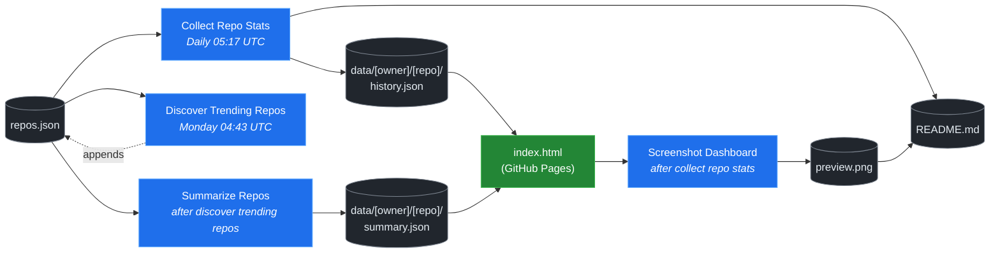

# 🚀 Rising Repos Tracker

> Automatically tracks daily GitHub stats (stars, forks, issues, velocity) for rising open source repos.

[](https://www.telosignal.com/)


**[→ View Live Dashboard](https://patrick-creates.github.io/rising-repos-tracker/)**

Built and maintained by [Telosignal](https://www.telosignal.com/).


<!-- AUTOGEN-STATS-START -->
## 📊 Current snapshot

> Auto-updated daily — last refreshed 2026-07-31

| Metric | Value |
|---|---|
| Repos tracked | **175** |
| Total stars | **8,337,276** |
| Total forks | **1,247,868** |
| Fastest growing | **ai-agent-book** (+1823.5/day) |

### 🔥 Top 5 by velocity

| # | Repo | Stars | Stars/day |
|---|---|---:|---:|
| 1 | [bojieli/ai-agent-book](https://github.com/bojieli/ai-agent-book) | 28,011 | +1823.5 |
| 2 | [DietrichGebert/ponytail](https://github.com/DietrichGebert/ponytail) | 92,625 | +1143.7 |
| 3 | [NousResearch/hermes-agent](https://github.com/NousResearch/hermes-agent) | 223,095 | +950.0 |
| 4 | [diegosouzapw/OmniRoute](https://github.com/diegosouzapw/OmniRoute) | 35,452 | +932.0 |
| 5 | [stablyai/orca](https://github.com/stablyai/orca) | 34,187 | +864.2 |

### 🆕 Recently added

- [Graphify-Labs/graphify](https://github.com/Graphify-Labs/graphify) — added 2026-07-27 — Turn any codebase, with its docs, SQL schemas, configs, and PDFs, into a queryable knowledge graph. A /graphify skill for Claude Code, Cursor, Codex, and Gemini CLI: local deterministic AST parsing, every edge explained, no vector store.
- [Imbad0202/academic-research-skills](https://github.com/Imbad0202/academic-research-skills) — added 2026-07-27 — Academic Research Skills for Claude Code: research → write → review → revise → finalize
- [Anionex/banana-slides](https://github.com/Anionex/banana-slides) — added 2026-07-27 — 一个基于nano banana pro🍌的原生AI PPT生成应用，迈向＂Vibe PPT＂; 支持上传任意模板图片，上传任意素材&智能解析，一句话/大纲/页面描述自动生成PPT，口头修改指定区域、一键导出可编辑ppt - An AI-native slides generator based on nano banana pro🍌
<!-- AUTOGEN-STATS-END -->

<!-- AUTOGEN-DIAGRAM-START -->
## 🔄 How it works


```mermaid
graph LR
    repos[("repos.json")]:::data
    history[("data/[owner]/[repo]/<br/>history.json")]:::data
    summary[("data/[owner]/[repo]/<br/>summary.json")]:::data
    readme[("README.md")]:::data
    preview[("preview.png")]:::data
    dashboard["index.html<br/>(GitHub Pages)"]:::output
    collect_yml["Collect Repo Stats<br/><i>Daily 05:17 UTC</i>"]:::workflow
    discover_yml["Discover Trending Repos<br/><i>Monday 04:43 UTC</i>"]:::workflow
    screenshot_yml["Screenshot Dashboard<br/><i>after collect repo stats</i>"]:::workflow
    summarize_yml["Summarize Repos<br/><i>after discover trending repos</i>"]:::workflow
    repos --> collect_yml
    collect_yml --> history
    collect_yml --> readme
    repos --> discover_yml
    discover_yml -.->|appends| repos
    dashboard --> screenshot_yml
    screenshot_yml --> preview
    repos --> summarize_yml
    summarize_yml --> summary
    history --> dashboard
    summary --> dashboard
    preview --> readme
    classDef workflow fill:#1f6feb,stroke:#58a6ff,color:#fff
    classDef data fill:#21262d,stroke:#7d8590,color:#e6edf3
    classDef output fill:#238636,stroke:#3fb950,color:#fff
```
<!-- AUTOGEN-DIAGRAM-END -->

<!-- AUTOGEN-WORKFLOWS-START -->
## ⚙️ Workflows

| File | Schedule | Name |
|---|---|---|
| `collect.yml` | Daily 05:17 UTC | Collect Repo Stats |
| `discover.yml` | Monday 04:43 UTC | Discover Trending Repos |
| `screenshot.yml` | After Collect Repo Stats | Screenshot Dashboard |
| `summarize.yml` | After Discover Trending Repos | Summarize Repos |

> All workflows commit results directly back to the repo. Schedules are best-effort — GitHub Actions cron can drift by a few minutes.
<!-- AUTOGEN-WORKFLOWS-END -->

<!-- AUTOGEN-REPOS-START -->
## 📋 All tracked repos

| Repo | Stars | Forks | Stars/day |
|---|---:|---:|---:|
| [openclaw/openclaw](https://github.com/openclaw/openclaw) | 384,646 | 80,844 | +166.8 |
| [obra/superpowers](https://github.com/obra/superpowers) | 264,156 | 23,584 | +732.8 |
| [affaan-m/everything-claude-code](https://github.com/affaan-m/everything-claude-code) | 236,417 | 35,945 | +700.9 |
| [affaan-m/ECC](https://github.com/affaan-m/ECC) | 236,417 | 35,945 | +659.5 |
| [NousResearch/hermes-agent](https://github.com/NousResearch/hermes-agent) | 223,095 | 42,890 | +950.0 |
| [Significant-Gravitas/AutoGPT](https://github.com/Significant-Gravitas/AutoGPT) | 185,749 | 46,066 | +18.6 |
| [microsoft/markitdown](https://github.com/microsoft/markitdown) | 170,417 | 12,356 | +600.1 |
| [f/prompts.chat](https://github.com/f/prompts.chat) | 166,548 | 21,514 | +55.4 |
| [langgenius/dify](https://github.com/langgenius/dify) | 150,875 | 23,786 | +122.2 |
| [open-webui/open-webui](https://github.com/open-webui/open-webui) | 147,409 | 21,419 | +133.1 |
| [langchain-ai/langchain](https://github.com/langchain-ai/langchain) | 143,062 | 23,823 | +81.4 |
| [github/spec-kit](https://github.com/github/spec-kit) | 124,718 | 11,133 | +340.0 |
| [farion1231/cc-switch](https://github.com/farion1231/cc-switch) | 122,709 | 8,299 | +657.6 |
| [microsoft/generative-ai-for-beginners](https://github.com/microsoft/generative-ai-for-beginners) | 113,782 | 61,088 | +38.4 |
| [nextlevelbuilder/ui-ux-pro-max-skill](https://github.com/nextlevelbuilder/ui-ux-pro-max-skill) | 111,983 | 11,947 | +431.5 |
| [Graphify-Labs/graphify](https://github.com/Graphify-Labs/graphify) | 99,352 | 9,635 | +663.5 |
| [JuliusBrussee/caveman](https://github.com/JuliusBrussee/caveman) | 94,742 | 5,423 | +449.1 |
| [DietrichGebert/ponytail](https://github.com/DietrichGebert/ponytail) | 92,625 | 5,089 | +1143.7 |
| [thedotmack/claude-mem](https://github.com/thedotmack/claude-mem) | 89,109 | 7,753 | +173.8 |
| [ChatGPTNextWeb/NextChat](https://github.com/ChatGPTNextWeb/NextChat) | 88,569 | 59,353 | +7.2 |
| [ruvnet/RuView](https://github.com/ruvnet/RuView) | 87,787 | 11,665 | +326.8 |
| [vllm-project/vllm](https://github.com/vllm-project/vllm) | 87,762 | 20,089 | +99.7 |
| [nexu-io/open-design](https://github.com/nexu-io/open-design) | 82,822 | 9,578 | +522.3 |
| [OpenHands/OpenHands](https://github.com/OpenHands/OpenHands) | 82,642 | 10,622 | +117.7 |
| [lobehub/lobehub](https://github.com/lobehub/lobehub) | 80,995 | 15,729 | +50.6 |
| [koala73/worldmonitor](https://github.com/koala73/worldmonitor) | 77,161 | 11,506 | +308.0 |
| [dair-ai/Prompt-Engineering-Guide](https://github.com/dair-ai/Prompt-Engineering-Guide) | 77,148 | 8,479 | +33.1 |
| [openai/openai-cookbook](https://github.com/openai/openai-cookbook) | 75,024 | 12,689 | +19.1 |
| [rtk-ai/rtk](https://github.com/rtk-ai/rtk) | 74,098 | 4,639 | +331.4 |
| [shareAI-lab/learn-claude-code](https://github.com/shareAI-lab/learn-claude-code) | 72,797 | 11,817 | +158.4 |
| [ComposioHQ/awesome-claude-skills](https://github.com/ComposioHQ/awesome-claude-skills) | 71,415 | 8,032 | +149.0 |
| [datawhalechina/hello-agents](https://github.com/datawhalechina/hello-agents) | 69,755 | 8,692 | +258.0 |
| [Leonxlnx/taste-skill](https://github.com/Leonxlnx/taste-skill) | 69,535 | 4,800 | +652.0 |
| [unslothai/unsloth](https://github.com/unslothai/unsloth) | 69,249 | 6,241 | +64.2 |
| [code-yeongyu/oh-my-openagent](https://github.com/code-yeongyu/oh-my-openagent) | 66,889 | 5,460 | +115.7 |
| [xtekky/gpt4free](https://github.com/xtekky/gpt4free) | 66,515 | 13,536 | +3.7 |
| [shanraisshan/claude-code-best-practice](https://github.com/shanraisshan/claude-code-best-practice) | 63,789 | 6,347 | +139.1 |
| [chopratejas/headroom](https://github.com/chopratejas/headroom) | 63,477 | 4,813 | +767.7 |
| [headroomlabs-ai/headroom](https://github.com/headroomlabs-ai/headroom) | 63,477 | 4,813 | +450.6 |
| [Fission-AI/OpenSpec](https://github.com/Fission-AI/OpenSpec) | 63,267 | 4,378 | +195.7 |
| [Panniantong/Agent-Reach](https://github.com/Panniantong/Agent-Reach) | 63,110 | 5,156 | +747.8 |
| [santifer/career-ops](https://github.com/santifer/career-ops) | 62,352 | 12,268 | +231.2 |
| [asgeirtj/system_prompts_leaks](https://github.com/asgeirtj/system_prompts_leaks) | 61,584 | 10,055 | +286.5 |
| [tw93/Pake](https://github.com/tw93/Pake) | 60,363 | 12,274 | +156.5 |
| [ZhuLinsen/daily_stock_analysis](https://github.com/ZhuLinsen/daily_stock_analysis) | 59,651 | 51,073 | +310.6 |
| [MemPalace/mempalace](https://github.com/MemPalace/mempalace) | 57,906 | 7,449 | +74.4 |
| [mvanhorn/last30days-skill](https://github.com/mvanhorn/last30days-skill) | 55,753 | 4,798 | +435.5 |
| [BerriAI/litellm](https://github.com/BerriAI/litellm) | 55,147 | 10,213 | +104.9 |
| [FlowiseAI/Flowise](https://github.com/FlowiseAI/Flowise) | 55,054 | 24,802 | +29.1 |
| [ggml-org/whisper.cpp](https://github.com/ggml-org/whisper.cpp) | 52,461 | 5,944 | +35.6 |
| [hesreallyhim/awesome-claude-code](https://github.com/hesreallyhim/awesome-claude-code) | 51,370 | 4,468 | +98.3 |
| [ChromeDevTools/chrome-devtools-mcp](https://github.com/ChromeDevTools/chrome-devtools-mcp) | 48,188 | 3,270 | +112.2 |
| [Aider-AI/aider](https://github.com/Aider-AI/aider) | 47,828 | 4,792 | +38.7 |
| [jamiepine/voicebox](https://github.com/jamiepine/voicebox) | 47,579 | 5,840 | +309.3 |
| [elder-plinius/CL4R1T4S](https://github.com/elder-plinius/CL4R1T4S) | 46,571 | 9,492 | +167.0 |
| [HKUDS/nanobot](https://github.com/HKUDS/nanobot) | 46,458 | 8,217 | +51.1 |
| [zhayujie/CowAgent](https://github.com/zhayujie/CowAgent) | 46,232 | 10,286 | +22.7 |
| [usestrix/strix](https://github.com/usestrix/strix) | 46,010 | 4,816 | +338.3 |
| [router-for-me/CLIProxyAPI](https://github.com/router-for-me/CLIProxyAPI) | 45,727 | 7,096 | +163.9 |
| [rohitg00/ai-engineering-from-scratch](https://github.com/rohitg00/ai-engineering-from-scratch) | 45,194 | 7,692 | +313.9 |
| [calesthio/OpenMontage](https://github.com/calesthio/OpenMontage) | 44,265 | 5,351 | +512.9 |
| [sickn33/antigravity-awesome-skills](https://github.com/sickn33/antigravity-awesome-skills) | 44,209 | 6,509 | +82.6 |
| [sickn33/agentic-awesome-skills](https://github.com/sickn33/agentic-awesome-skills) | 44,209 | 6,509 | +64.8 |
| [QuantumNous/new-api](https://github.com/QuantumNous/new-api) | 43,958 | 10,292 | +128.4 |
| [kepano/obsidian-skills](https://github.com/kepano/obsidian-skills) | 43,750 | 3,121 | +164.4 |
| [coreyhaines31/marketingskills](https://github.com/coreyhaines31/marketingskills) | 42,476 | 6,692 | +184.0 |
| [danny-avila/LibreChat](https://github.com/danny-avila/LibreChat) | 41,478 | 8,540 | +59.8 |
| [chatboxai/chatbox](https://github.com/chatboxai/chatbox) | 41,214 | 4,174 | +16.5 |
| [Imbad0202/academic-research-skills](https://github.com/Imbad0202/academic-research-skills) | 40,280 | 3,218 | +146.5 |
| [Hmbown/CodeWhale](https://github.com/Hmbown/CodeWhale) | 40,256 | 3,481 | +83.4 |
| [mindsdb/mindshub](https://github.com/mindsdb/mindshub) | 39,509 | 6,227 | +6.0 |
| [chatanywhere/GPT_API_free](https://github.com/chatanywhere/GPT_API_free) | 39,439 | 2,678 | +19.1 |
| [heygen-com/hyperframes](https://github.com/heygen-com/hyperframes) | 38,874 | 3,661 | +251.2 |
| [langchain-ai/langgraph](https://github.com/langchain-ai/langgraph) | 38,552 | 6,499 | +80.3 |
| [wshobson/agents](https://github.com/wshobson/agents) | 38,397 | 4,103 | +36.7 |
| [AstrBotDevs/AstrBot](https://github.com/AstrBotDevs/AstrBot) | 38,384 | 2,734 | +79.9 |
| [Yeachan-Heo/oh-my-claudecode](https://github.com/Yeachan-Heo/oh-my-claudecode) | 38,206 | 3,440 | +50.5 |
| [google/langextract](https://github.com/google/langextract) | 37,939 | 2,633 | +20.7 |
| [github/awesome-copilot](https://github.com/github/awesome-copilot) | 37,275 | 4,674 | +51.8 |
| [DeusData/codebase-memory-mcp](https://github.com/DeusData/codebase-memory-mcp) | 36,705 | 2,876 | +502.3 |
| [songquanpeng/one-api](https://github.com/songquanpeng/one-api) | 36,083 | 6,766 | +28.0 |
| [PDFMathTranslate/PDFMathTranslate](https://github.com/PDFMathTranslate/PDFMathTranslate) | 35,872 | 3,203 | +27.7 |
| [diegosouzapw/OmniRoute](https://github.com/diegosouzapw/OmniRoute) | 35,452 | 4,563 | +932.0 |
| [stablyai/orca](https://github.com/stablyai/orca) | 34,187 | 2,386 | +864.2 |
| [anthropics/claude-plugins-official](https://github.com/anthropics/claude-plugins-official) | 32,883 | 3,708 | +64.5 |
| [zeroclaw-labs/zeroclaw](https://github.com/zeroclaw-labs/zeroclaw) | 32,455 | 4,853 | +13.0 |
| [agentscope-ai/QwenPaw](https://github.com/agentscope-ai/QwenPaw) | 31,214 | 2,908 | +292.1 |
| [iOfficeAI/AionUi](https://github.com/iOfficeAI/AionUi) | 31,169 | 3,141 | +63.7 |
| [AlexsJones/llmfit](https://github.com/AlexsJones/llmfit) | 30,978 | 1,887 | +66.3 |
| [JCodesMore/ai-website-cloner-template](https://github.com/JCodesMore/ai-website-cloner-template) | 30,683 | 4,404 | +297.6 |
| [Gitlawb/openclaude](https://github.com/Gitlawb/openclaude) | 30,443 | 8,911 | +38.5 |
| [googleworkspace/cli](https://github.com/googleworkspace/cli) | 30,090 | 1,757 | +56.2 |
| [voideditor/void](https://github.com/voideditor/void) | 28,871 | 2,601 | +1.1 |
| [HKUDS/Vibe-Trading](https://github.com/HKUDS/Vibe-Trading) | 28,865 | 4,652 | +441.5 |
| [MadsLorentzen/ai-job-search](https://github.com/MadsLorentzen/ai-job-search) | 28,849 | 9,590 | +403.7 |
| [alibaba/page-agent](https://github.com/alibaba/page-agent) | 28,290 | 2,489 | +211.6 |
| [esengine/DeepSeek-Reasonix](https://github.com/esengine/DeepSeek-Reasonix) | 28,110 | 1,809 | +162.0 |
| [bojieli/ai-agent-book](https://github.com/bojieli/ai-agent-book) | 28,011 | 2,960 | +1823.5 |
| [tirth8205/code-review-graph](https://github.com/tirth8205/code-review-graph) | 27,843 | 2,575 | +202.8 |
| [volcengine/OpenViking](https://github.com/volcengine/OpenViking) | 27,685 | 2,173 | +44.5 |
| [BloopAI/vibe-kanban](https://github.com/BloopAI/vibe-kanban) | 27,599 | 2,930 | +14.8 |
| [jackwener/OpenCLI](https://github.com/jackwener/OpenCLI) | 27,494 | 2,698 | +69.7 |
| [langchain-ai/deepagents](https://github.com/langchain-ai/deepagents) | 27,130 | 3,794 | +56.1 |
| [mukul975/Anthropic-Cybersecurity-Skills](https://github.com/mukul975/Anthropic-Cybersecurity-Skills) | 27,001 | 3,271 | +227.7 |
| [jarrodwatts/claude-hud](https://github.com/jarrodwatts/claude-hud) | 26,983 | 1,252 | +43.3 |
| [p-e-w/heretic](https://github.com/p-e-w/heretic) | 26,961 | 2,920 | +56.4 |
| [rohitg00/agentmemory](https://github.com/rohitg00/agentmemory) | 26,165 | 2,195 | +81.9 |
| [zai-org/Open-AutoGLM](https://github.com/zai-org/Open-AutoGLM) | 25,920 | 4,022 | +8.6 |
| [manaflow-ai/cmux](https://github.com/manaflow-ai/cmux) | 25,412 | 2,118 | +58.7 |
| [toon-format/toon](https://github.com/toon-format/toon) | 25,035 | 1,111 | +10.2 |
| [decolua/9router](https://github.com/decolua/9router) | 24,164 | 4,173 | +143.3 |
| [iOfficeAI/OfficeCLI](https://github.com/iOfficeAI/OfficeCLI) | 23,680 | 1,592 | +611.3 |
| [ogulcancelik/herdr](https://github.com/ogulcancelik/herdr) | 22,860 | 1,555 | +418.5 |
| [winfunc/opcode](https://github.com/winfunc/opcode) | 22,331 | 1,717 | +6.2 |
| [coze-dev/coze-studio](https://github.com/coze-dev/coze-studio) | 21,298 | 3,093 | +6.6 |
| [NirDiamant/agents-towards-production](https://github.com/NirDiamant/agents-towards-production) | 21,216 | 2,812 | +11.0 |
| [can1357/oh-my-pi](https://github.com/can1357/oh-my-pi) | 20,805 | 1,969 | +174.6 |
| [mksglu/context-mode](https://github.com/mksglu/context-mode) | 19,509 | 1,389 | +44.4 |
| [steipete/CodexBar](https://github.com/steipete/CodexBar) | 19,378 | 1,615 | +107.1 |
| [Tencent/WeKnora](https://github.com/Tencent/WeKnora) | 19,188 | 2,714 | +63.0 |
| [tanweai/pua](https://github.com/tanweai/pua) | 19,132 | 1,162 | +19.3 |
| [KKKKhazix/khazix-skills](https://github.com/KKKKhazix/khazix-skills) | 18,833 | 2,090 | +125.0 |
| [datawhalechina/easy-vibe](https://github.com/datawhalechina/easy-vibe) | 18,646 | 1,769 | +37.1 |
| [jnMetaCode/agency-agents-zh](https://github.com/jnMetaCode/agency-agents-zh) | 18,583 | 3,085 | +81.5 |
| [pranshuparmar/witr](https://github.com/pranshuparmar/witr) | 18,361 | 579 | +10.3 |
| [jundot/omlx](https://github.com/jundot/omlx) | 18,335 | 1,566 | +37.0 |
| [RightNow-AI/openfang](https://github.com/RightNow-AI/openfang) | 18,070 | 2,286 | +5.3 |
| [microsoft/agent-lightning](https://github.com/microsoft/agent-lightning) | 17,430 | 1,526 | +2.6 |
| [danielmiessler/LifeOS](https://github.com/danielmiessler/LifeOS) | 17,103 | 2,312 | +26.6 |
| [alibaba/open-code-review](https://github.com/alibaba/open-code-review) | 16,776 | 1,141 | +271.6 |
| [nesquena/hermes-webui](https://github.com/nesquena/hermes-webui) | 16,760 | 2,281 | +49.3 |
| [browser-use/browser-harness](https://github.com/browser-use/browser-harness) | 16,375 | 1,548 | +28.0 |
| [cft0808/edict](https://github.com/cft0808/edict) | 16,295 | 1,710 | +5.1 |
| [MemoriLabs/Memori](https://github.com/MemoriLabs/Memori) | 15,672 | 2,885 | +8.4 |
| [Anionex/banana-slides](https://github.com/Anionex/banana-slides) | 15,358 | 1,768 | +6.3 |
| [xpzouying/xiaohongshu-mcp](https://github.com/xpzouying/xiaohongshu-mcp) | 15,004 | 2,206 | +18.4 |
| [xbtlin/ai-berkshire](https://github.com/xbtlin/ai-berkshire) | 14,784 | 2,100 | +160.3 |
| [kyegomez/OpenMythos](https://github.com/kyegomez/OpenMythos) | 14,770 | 3,300 | +15.8 |
| [yusufkaraaslan/Skill_Seekers](https://github.com/yusufkaraaslan/Skill_Seekers) | 14,662 | 1,488 | +11.2 |
| [1jehuang/jcode](https://github.com/1jehuang/jcode) | 14,314 | 1,576 | +333.8 |
| [NevaMind-AI/memU](https://github.com/NevaMind-AI/memU) | 14,185 | 1,054 | +7.3 |
| [wanshuiyin/Auto-claude-code-research-in-sleep](https://github.com/wanshuiyin/Auto-claude-code-research-in-sleep) | 14,064 | 1,252 | +40.3 |
| [t8y2/dbx](https://github.com/t8y2/dbx) | 12,781 | 1,229 | +236.0 |
| [superset-sh/superset](https://github.com/superset-sh/superset) | 12,708 | 1,144 | +17.1 |
| [XiaomiMiMo/MiMo-Code](https://github.com/XiaomiMiMo/MiMo-Code) | 12,568 | 1,280 | +48.3 |
| [sirmalloc/ccstatusline](https://github.com/sirmalloc/ccstatusline) | 12,123 | 534 | +26.3 |
| [EverMind-AI/EverOS](https://github.com/EverMind-AI/EverOS) | 11,703 | 872 | +62.1 |
| [ValueCell-ai/valuecell](https://github.com/ValueCell-ai/valuecell) | 10,954 | 1,814 | +2.6 |
| [walkinglabs/learn-harness-engineering](https://github.com/walkinglabs/learn-harness-engineering) | 10,871 | 1,183 | +39.4 |
| [aden-hive/hive](https://github.com/aden-hive/hive) | 10,824 | 5,671 | +6.6 |
| [0x4m4/hexstrike-ai](https://github.com/0x4m4/hexstrike-ai) | 10,679 | 2,229 | +20.9 |
| [MemTensor/MemOS](https://github.com/MemTensor/MemOS) | 10,490 | 961 | +14.5 |
| [Kuberwastaken/claurst](https://github.com/Kuberwastaken/claurst) | 10,164 | 7,777 | +9.3 |
| [brokermr810/QuantDinger](https://github.com/brokermr810/QuantDinger) | 10,139 | 2,126 | +34.2 |
| [OpenByteInc/QuantDinger](https://github.com/OpenByteInc/QuantDinger) | 10,139 | 2,126 | +30.6 |
| [ConardLi/garden-skills](https://github.com/ConardLi/garden-skills) | 9,946 | 1,305 | +30.6 |
| [TencentCloud/TencentDB-Agent-Memory](https://github.com/TencentCloud/TencentDB-Agent-Memory) | 9,728 | 938 | +56.1 |
| [EKKOLearnAI/hermes-studio](https://github.com/EKKOLearnAI/hermes-studio) | 9,609 | 1,179 | +30.0 |
| [frankbria/ralph-claude-code](https://github.com/frankbria/ralph-claude-code) | 9,569 | 728 | +5.8 |
| [ykdojo/claude-code-tips](https://github.com/ykdojo/claude-code-tips) | 9,497 | 751 | +19.2 |
| [iflytek/astron-agent](https://github.com/iflytek/astron-agent) | 9,329 | 875 | +28.8 |
| [getagentseal/codeburn](https://github.com/getagentseal/codeburn) | 9,048 | 710 | +23.1 |
| [EvoMap/evolver](https://github.com/EvoMap/evolver) | 8,895 | 822 | +1.6 |
| [StarTrail-org/PixelRAG](https://github.com/StarTrail-org/PixelRAG) | 8,511 | 721 | +107.0 |
| [MiroMindAI/MiroThinker](https://github.com/MiroMindAI/MiroThinker) | 8,362 | 644 | +1.4 |
| [mmulet/term.everything](https://github.com/mmulet/term.everything) | 8,053 | 192 | +1.2 |
| [modem-dev/hunk](https://github.com/modem-dev/hunk) | 7,970 | 230 | +70.3 |
| [ValueCell-ai/ClawX](https://github.com/ValueCell-ai/ClawX) | 7,561 | 1,130 | +1.1 |
| [steipete/summarize](https://github.com/steipete/summarize) | 6,499 | 438 | +4.9 |
| [opensquilla/opensquilla](https://github.com/opensquilla/opensquilla) | 6,425 | 484 | +19.6 |
| [Arthur-Ficial/apfel](https://github.com/Arthur-Ficial/apfel) | 6,229 | 238 | +6.3 |
| [microsoft/fara](https://github.com/microsoft/fara) | 6,105 | 597 | +5.9 |
| [UfoMiao/zcf](https://github.com/UfoMiao/zcf) | 6,079 | 425 | +0.5 |
| [Andyyyy64/whichllm](https://github.com/Andyyyy64/whichllm) | 6,070 | 321 | +18.5 |
| [re4/LibreCode](https://github.com/re4/LibreCode) | 77 | 4 | — |
<!-- AUTOGEN-REPOS-END -->

---

## What it does

- Collects daily snapshots of stars, forks, watchers and open issues for every tracked repo
- Discovers new trending repos automatically every Monday using the GitHub Search API
- Generates AI summaries (use cases, similar tools, tags) for each tracked repo via GitHub Models
- Stores all history as plain JSON — no database, no backend
- Renders a live dashboard via GitHub Pages — updates daily, zero maintenance

## Tracked repos

Data lives in [`data/`](./data) — one folder per repo, one `history.json` per entry.  
The full watch list is in [`repos.json`](./repos.json).

## Fork & use it for yourself

This is my personal tracker — the watch list reflects what I find interesting. If you want to track different repos, the best path is to **fork this repo and run your own**.

### Setup

1. Fork this repo to your account
2. Replace the contents of [`repos.json`](./repos.json) with the repos you want to track (or just leave one entry — `discover.yml` will auto-add more every Monday)
3. Go to **Settings → Pages** and enable GitHub Pages from the `main` branch
4. Go to **Actions** and run **Collect Repo Stats** once manually to seed your first data point
5. Your dashboard will be live at `https://YOUR-USERNAME.github.io/rising-repos-tracker/`

That's it — daily collection and weekly discovery run automatically on schedule. Zero ongoing maintenance.

### Customizing what gets discovered

Edit [`scripts/discover.js`](./scripts/discover.js) to change:

- `MIN_STARS` — minimum star threshold for candidates
- `MAX_AGE_DAYS` — how recent a repo must be
- `MAX_NEW_REPOS` — how many to add per discovery run
- The `queries` array — GitHub Search API queries that define what "trending" means to you

### Adding a repo manually

Just edit `repos.json` directly:

```json
{
  "owner": "OWNER",
  "repo": "REPO",
  "added": "YYYY-MM-DD",
  "notes": "why you're tracking this"
}
```

The next daily collect run picks it up automatically.

## Stack

- **GitHub Actions** — scheduling and automation
- **GitHub Pages** — dashboard hosting
- **GitHub API** — data source
- **GitHub Models** — free AI summaries (gpt-4o-mini)
- **Chart.js** — star growth visualization
- **Mermaid** — architecture diagram (rendered by GitHub)
- No dependencies, no build step, no database

## License

MIT
