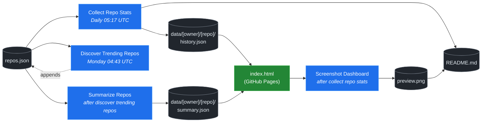

# 🚀 Rising Repos Tracker

> Automatically tracks daily GitHub stats (stars, forks, issues, velocity) for rising open source repos.

[](https://www.telosignal.com/)


**[→ View Live Dashboard](https://patrick-creates.github.io/rising-repos-tracker/)**

Built and maintained by [Telosignal](https://www.telosignal.com/).


<!-- AUTOGEN-STATS-START -->
## 📊 Current snapshot

> Auto-updated daily — last refreshed 2026-08-01

| Metric | Value |
|---|---|
| Repos tracked | **175** |
| Total stars | **8,354,278** |
| Total forks | **1,250,224** |
| Fastest growing | **ai-agent-book** (+1730.2/day) |

### 🔥 Top 5 by velocity

| # | Repo | Stars | Stars/day |
|---|---|---:|---:|
| 1 | [bojieli/ai-agent-book](https://github.com/bojieli/ai-agent-book) | 28,715 | +1730.2 |
| 2 | [DietrichGebert/ponytail](https://github.com/DietrichGebert/ponytail) | 93,209 | +1129.8 |
| 3 | [NousResearch/hermes-agent](https://github.com/NousResearch/hermes-agent) | 223,559 | +943.9 |
| 4 | [diegosouzapw/OmniRoute](https://github.com/diegosouzapw/OmniRoute) | 36,370 | +931.5 |
| 5 | [stablyai/orca](https://github.com/stablyai/orca) | 34,810 | +854.9 |

### 🆕 Recently added

- [Graphify-Labs/graphify](https://github.com/Graphify-Labs/graphify) — added 2026-07-27 — Turn any codebase, with its docs, SQL schemas, configs, and PDFs, into a queryable knowledge graph. A /graphify skill for Claude Code, Cursor, Codex, and Gemini CLI: local deterministic AST parsing, every edge explained, no vector store.
- [Imbad0202/academic-research-skills](https://github.com/Imbad0202/academic-research-skills) — added 2026-07-27 — Academic Research Skills for Claude Code: research → write → review → revise → finalize
- [Anionex/banana-slides](https://github.com/Anionex/banana-slides) — added 2026-07-27 — 一个基于nano banana pro🍌的原生AI PPT生成应用，迈向＂Vibe PPT＂; 支持上传任意模板图片，上传任意素材&智能解析，一句话/大纲/页面描述自动生成PPT，口头修改指定区域、一键导出可编辑ppt - An AI-native slides generator based on nano banana pro🍌
<!-- AUTOGEN-STATS-END -->

<!-- AUTOGEN-DIAGRAM-START -->
## 🔄 How it works


```mermaid
graph LR
    repos[("repos.json")]:::data
    history[("data/[owner]/[repo]/<br/>history.json")]:::data
    summary[("data/[owner]/[repo]/<br/>summary.json")]:::data
    readme[("README.md")]:::data
    preview[("preview.png")]:::data
    dashboard["index.html<br/>(GitHub Pages)"]:::output
    collect_yml["Collect Repo Stats<br/><i>Daily 05:17 UTC</i>"]:::workflow
    discover_yml["Discover Trending Repos<br/><i>Monday 04:43 UTC</i>"]:::workflow
    screenshot_yml["Screenshot Dashboard<br/><i>after collect repo stats</i>"]:::workflow
    summarize_yml["Summarize Repos<br/><i>after discover trending repos</i>"]:::workflow
    repos --> collect_yml
    collect_yml --> history
    collect_yml --> readme
    repos --> discover_yml
    discover_yml -.->|appends| repos
    dashboard --> screenshot_yml
    screenshot_yml --> preview
    repos --> summarize_yml
    summarize_yml --> summary
    history --> dashboard
    summary --> dashboard
    preview --> readme
    classDef workflow fill:#1f6feb,stroke:#58a6ff,color:#fff
    classDef data fill:#21262d,stroke:#7d8590,color:#e6edf3
    classDef output fill:#238636,stroke:#3fb950,color:#fff
```
<!-- AUTOGEN-DIAGRAM-END -->

<!-- AUTOGEN-WORKFLOWS-START -->
## ⚙️ Workflows

| File | Schedule | Name |
|---|---|---|
| `collect.yml` | Daily 05:17 UTC | Collect Repo Stats |
| `discover.yml` | Monday 04:43 UTC | Discover Trending Repos |
| `screenshot.yml` | After Collect Repo Stats | Screenshot Dashboard |
| `summarize.yml` | After Discover Trending Repos | Summarize Repos |

> All workflows commit results directly back to the repo. Schedules are best-effort — GitHub Actions cron can drift by a few minutes.
<!-- AUTOGEN-WORKFLOWS-END -->

<!-- AUTOGEN-REPOS-START -->
## 📋 All tracked repos

| Repo | Stars | Forks | Stars/day |
|---|---:|---:|---:|
| [openclaw/openclaw](https://github.com/openclaw/openclaw) | 384,761 | 80,862 | +166.1 |
| [obra/superpowers](https://github.com/obra/superpowers) | 264,555 | 23,613 | +724.5 |
| [affaan-m/everything-claude-code](https://github.com/affaan-m/everything-claude-code) | 236,706 | 35,984 | +695.7 |
| [affaan-m/ECC](https://github.com/affaan-m/ECC) | 236,706 | 35,984 | +654.1 |
| [NousResearch/hermes-agent](https://github.com/NousResearch/hermes-agent) | 223,559 | 43,066 | +943.9 |
| [Significant-Gravitas/AutoGPT](https://github.com/Significant-Gravitas/AutoGPT) | 185,749 | 46,057 | +18.4 |
| [microsoft/markitdown](https://github.com/microsoft/markitdown) | 170,574 | 12,374 | +594.6 |
| [f/prompts.chat](https://github.com/f/prompts.chat) | 166,587 | 21,517 | +55.2 |
| [langgenius/dify](https://github.com/langgenius/dify) | 150,955 | 23,806 | +121.6 |
| [open-webui/open-webui](https://github.com/open-webui/open-webui) | 147,495 | 21,426 | +132.5 |
| [langchain-ai/langchain](https://github.com/langchain-ai/langchain) | 143,147 | 23,842 | +81.4 |
| [github/spec-kit](https://github.com/github/spec-kit) | 124,838 | 11,151 | +337.2 |
| [farion1231/cc-switch](https://github.com/farion1231/cc-switch) | 123,042 | 8,324 | +653.3 |
| [microsoft/generative-ai-for-beginners](https://github.com/microsoft/generative-ai-for-beginners) | 113,872 | 61,153 | +39.0 |
| [nextlevelbuilder/ui-ux-pro-max-skill](https://github.com/nextlevelbuilder/ui-ux-pro-max-skill) | 112,240 | 11,990 | +429.3 |
| [Graphify-Labs/graphify](https://github.com/Graphify-Labs/graphify) | 99,868 | 9,682 | +634.0 |
| [JuliusBrussee/caveman](https://github.com/JuliusBrussee/caveman) | 94,966 | 5,444 | +446.1 |
| [DietrichGebert/ponytail](https://github.com/DietrichGebert/ponytail) | 93,209 | 5,122 | +1129.8 |
| [thedotmack/claude-mem](https://github.com/thedotmack/claude-mem) | 89,201 | 7,764 | +172.8 |
| [ChatGPTNextWeb/NextChat](https://github.com/ChatGPTNextWeb/NextChat) | 88,572 | 59,348 | +7.1 |
| [ruvnet/RuView](https://github.com/ruvnet/RuView) | 87,960 | 11,690 | +324.5 |
| [vllm-project/vllm](https://github.com/vllm-project/vllm) | 87,831 | 20,131 | +99.3 |
| [nexu-io/open-design](https://github.com/nexu-io/open-design) | 82,949 | 9,603 | +517.0 |
| [OpenHands/OpenHands](https://github.com/OpenHands/OpenHands) | 82,739 | 10,645 | +117.4 |
| [lobehub/lobehub](https://github.com/lobehub/lobehub) | 81,019 | 15,732 | +50.3 |
| [koala73/worldmonitor](https://github.com/koala73/worldmonitor) | 77,544 | 11,580 | +309.0 |
| [dair-ai/Prompt-Engineering-Guide](https://github.com/dair-ai/Prompt-Engineering-Guide) | 77,173 | 8,481 | +33.0 |
| [openai/openai-cookbook](https://github.com/openai/openai-cookbook) | 75,040 | 12,690 | +19.1 |
| [rtk-ai/rtk](https://github.com/rtk-ai/rtk) | 74,210 | 4,647 | +328.4 |
| [shareAI-lab/learn-claude-code](https://github.com/shareAI-lab/learn-claude-code) | 72,882 | 11,834 | +157.4 |
| [ComposioHQ/awesome-claude-skills](https://github.com/ComposioHQ/awesome-claude-skills) | 71,496 | 8,041 | +148.1 |
| [datawhalechina/hello-agents](https://github.com/datawhalechina/hello-agents) | 69,876 | 8,709 | +256.2 |
| [Leonxlnx/taste-skill](https://github.com/Leonxlnx/taste-skill) | 69,814 | 4,816 | +645.9 |
| [unslothai/unsloth](https://github.com/unslothai/unsloth) | 69,315 | 6,255 | +64.2 |
| [code-yeongyu/oh-my-openagent](https://github.com/code-yeongyu/oh-my-openagent) | 66,968 | 5,463 | +115.2 |
| [xtekky/gpt4free](https://github.com/xtekky/gpt4free) | 66,515 | 13,535 | +3.7 |
| [shanraisshan/claude-code-best-practice](https://github.com/shanraisshan/claude-code-best-practice) | 63,838 | 6,359 | +137.9 |
| [headroomlabs-ai/headroom](https://github.com/headroomlabs-ai/headroom) | 63,649 | 4,828 | +443.6 |
| [chopratejas/headroom](https://github.com/chopratejas/headroom) | 63,648 | 4,828 | +755.0 |
| [Panniantong/Agent-Reach](https://github.com/Panniantong/Agent-Reach) | 63,558 | 5,205 | +742.2 |
| [Fission-AI/OpenSpec](https://github.com/Fission-AI/OpenSpec) | 63,369 | 4,385 | +194.4 |
| [santifer/career-ops](https://github.com/santifer/career-ops) | 62,422 | 12,293 | +229.0 |
| [asgeirtj/system_prompts_leaks](https://github.com/asgeirtj/system_prompts_leaks) | 61,732 | 10,076 | +284.6 |
| [tw93/Pake](https://github.com/tw93/Pake) | 60,376 | 12,278 | +154.6 |
| [ZhuLinsen/daily_stock_analysis](https://github.com/ZhuLinsen/daily_stock_analysis) | 59,727 | 51,122 | +307.2 |
| [MemPalace/mempalace](https://github.com/MemPalace/mempalace) | 57,928 | 7,451 | +73.7 |
| [mvanhorn/last30days-skill](https://github.com/mvanhorn/last30days-skill) | 56,381 | 4,909 | +439.1 |
| [BerriAI/litellm](https://github.com/BerriAI/litellm) | 55,223 | 10,234 | +104.5 |
| [FlowiseAI/Flowise](https://github.com/FlowiseAI/Flowise) | 55,079 | 24,805 | +29.1 |
| [ggml-org/whisper.cpp](https://github.com/ggml-org/whisper.cpp) | 52,473 | 5,949 | +35.3 |
| [hesreallyhim/awesome-claude-code](https://github.com/hesreallyhim/awesome-claude-code) | 51,430 | 4,476 | +97.8 |
| [ChromeDevTools/chrome-devtools-mcp](https://github.com/ChromeDevTools/chrome-devtools-mcp) | 48,296 | 3,276 | +112.2 |
| [Aider-AI/aider](https://github.com/Aider-AI/aider) | 47,847 | 4,797 | +38.5 |
| [jamiepine/voicebox](https://github.com/jamiepine/voicebox) | 47,742 | 5,867 | +306.9 |
| [elder-plinius/CL4R1T4S](https://github.com/elder-plinius/CL4R1T4S) | 46,590 | 9,494 | +163.8 |
| [HKUDS/nanobot](https://github.com/HKUDS/nanobot) | 46,487 | 8,220 | +50.8 |
| [usestrix/strix](https://github.com/usestrix/strix) | 46,276 | 4,853 | +337.1 |
| [zhayujie/CowAgent](https://github.com/zhayujie/CowAgent) | 46,256 | 10,288 | +22.7 |
| [router-for-me/CLIProxyAPI](https://github.com/router-for-me/CLIProxyAPI) | 45,849 | 7,111 | +163.3 |
| [rohitg00/ai-engineering-from-scratch](https://github.com/rohitg00/ai-engineering-from-scratch) | 45,360 | 7,750 | +311.4 |
| [calesthio/OpenMontage](https://github.com/calesthio/OpenMontage) | 44,439 | 5,383 | +502.7 |
| [sickn33/antigravity-awesome-skills](https://github.com/sickn33/antigravity-awesome-skills) | 44,252 | 6,511 | +82.0 |
| [sickn33/agentic-awesome-skills](https://github.com/sickn33/agentic-awesome-skills) | 44,252 | 6,511 | +63.7 |
| [QuantumNous/new-api](https://github.com/QuantumNous/new-api) | 44,021 | 10,326 | +127.4 |
| [kepano/obsidian-skills](https://github.com/kepano/obsidian-skills) | 43,817 | 3,127 | +162.8 |
| [coreyhaines31/marketingskills](https://github.com/coreyhaines31/marketingskills) | 42,572 | 6,699 | +182.5 |
| [danny-avila/LibreChat](https://github.com/danny-avila/LibreChat) | 41,509 | 8,546 | +59.4 |
| [chatboxai/chatbox](https://github.com/chatboxai/chatbox) | 41,239 | 4,174 | +16.6 |
| [Imbad0202/academic-research-skills](https://github.com/Imbad0202/academic-research-skills) | 40,379 | 3,223 | +137.0 |
| [Hmbown/CodeWhale](https://github.com/Hmbown/CodeWhale) | 40,299 | 3,484 | +82.8 |
| [mindsdb/mindshub](https://github.com/mindsdb/mindshub) | 39,508 | 6,226 | +5.6 |
| [chatanywhere/GPT_API_free](https://github.com/chatanywhere/GPT_API_free) | 39,493 | 2,676 | +19.7 |
| [heygen-com/hyperframes](https://github.com/heygen-com/hyperframes) | 39,007 | 3,680 | +249.0 |
| [langchain-ai/langgraph](https://github.com/langchain-ai/langgraph) | 38,597 | 6,511 | +79.4 |
| [AstrBotDevs/AstrBot](https://github.com/AstrBotDevs/AstrBot) | 38,415 | 2,740 | +79.1 |
| [wshobson/agents](https://github.com/wshobson/agents) | 38,413 | 4,107 | +36.4 |
| [Yeachan-Heo/oh-my-claudecode](https://github.com/Yeachan-Heo/oh-my-claudecode) | 38,227 | 3,442 | +50.0 |
| [google/langextract](https://github.com/google/langextract) | 37,943 | 2,637 | +20.4 |
| [github/awesome-copilot](https://github.com/github/awesome-copilot) | 37,316 | 4,689 | +51.6 |
| [DeusData/codebase-memory-mcp](https://github.com/DeusData/codebase-memory-mcp) | 36,886 | 2,900 | +492.6 |
| [diegosouzapw/OmniRoute](https://github.com/diegosouzapw/OmniRoute) | 36,370 | 4,673 | +931.5 |
| [songquanpeng/one-api](https://github.com/songquanpeng/one-api) | 36,096 | 6,768 | +27.7 |
| [PDFMathTranslate/PDFMathTranslate](https://github.com/PDFMathTranslate/PDFMathTranslate) | 35,883 | 3,204 | +27.5 |
| [stablyai/orca](https://github.com/stablyai/orca) | 34,810 | 2,431 | +854.9 |
| [anthropics/claude-plugins-official](https://github.com/anthropics/claude-plugins-official) | 32,927 | 3,714 | +64.2 |
| [zeroclaw-labs/zeroclaw](https://github.com/zeroclaw-labs/zeroclaw) | 32,469 | 4,856 | +13.0 |
| [agentscope-ai/QwenPaw](https://github.com/agentscope-ai/QwenPaw) | 31,588 | 2,918 | +293.8 |
| [iOfficeAI/AionUi](https://github.com/iOfficeAI/AionUi) | 31,222 | 3,145 | +63.5 |
| [AlexsJones/llmfit](https://github.com/AlexsJones/llmfit) | 31,016 | 1,887 | +65.8 |
| [JCodesMore/ai-website-cloner-template](https://github.com/JCodesMore/ai-website-cloner-template) | 30,737 | 4,412 | +292.4 |
| [Gitlawb/openclaude](https://github.com/Gitlawb/openclaude) | 30,463 | 8,907 | +38.2 |
| [googleworkspace/cli](https://github.com/googleworkspace/cli) | 30,125 | 1,762 | +55.9 |
| [HKUDS/Vibe-Trading](https://github.com/HKUDS/Vibe-Trading) | 29,039 | 4,672 | +433.4 |
| [MadsLorentzen/ai-job-search](https://github.com/MadsLorentzen/ai-job-search) | 29,016 | 9,687 | +391.2 |
| [voideditor/void](https://github.com/voideditor/void) | 28,866 | 2,603 | +1.0 |
| [bojieli/ai-agent-book](https://github.com/bojieli/ai-agent-book) | 28,715 | 3,034 | +1730.2 |
| [esengine/DeepSeek-Reasonix](https://github.com/esengine/DeepSeek-Reasonix) | 28,343 | 1,820 | +163.3 |
| [alibaba/page-agent](https://github.com/alibaba/page-agent) | 28,332 | 2,490 | +208.0 |
| [tirth8205/code-review-graph](https://github.com/tirth8205/code-review-graph) | 27,922 | 2,583 | +200.2 |
| [volcengine/OpenViking](https://github.com/volcengine/OpenViking) | 27,706 | 2,176 | +44.0 |
| [BloopAI/vibe-kanban](https://github.com/BloopAI/vibe-kanban) | 27,607 | 2,931 | +14.7 |
| [jackwener/OpenCLI](https://github.com/jackwener/OpenCLI) | 27,536 | 2,703 | +69.2 |
| [langchain-ai/deepagents](https://github.com/langchain-ai/deepagents) | 27,177 | 3,803 | +56.0 |
| [mukul975/Anthropic-Cybersecurity-Skills](https://github.com/mukul975/Anthropic-Cybersecurity-Skills) | 27,063 | 3,279 | +223.5 |
| [jarrodwatts/claude-hud](https://github.com/jarrodwatts/claude-hud) | 26,999 | 1,252 | +42.8 |
| [p-e-w/heretic](https://github.com/p-e-w/heretic) | 26,996 | 2,922 | +56.0 |
| [rohitg00/agentmemory](https://github.com/rohitg00/agentmemory) | 26,299 | 2,219 | +82.9 |
| [zai-org/Open-AutoGLM](https://github.com/zai-org/Open-AutoGLM) | 25,928 | 4,023 | +8.6 |
| [manaflow-ai/cmux](https://github.com/manaflow-ai/cmux) | 25,451 | 2,121 | +57.6 |
| [toon-format/toon](https://github.com/toon-format/toon) | 25,042 | 1,111 | +10.1 |
| [decolua/9router](https://github.com/decolua/9router) | 24,242 | 4,193 | +141.9 |
| [iOfficeAI/OfficeCLI](https://github.com/iOfficeAI/OfficeCLI) | 23,924 | 1,609 | +597.2 |
| [ogulcancelik/herdr](https://github.com/ogulcancelik/herdr) | 23,121 | 1,581 | +412.5 |
| [winfunc/opcode](https://github.com/winfunc/opcode) | 22,332 | 1,720 | +6.1 |
| [coze-dev/coze-studio](https://github.com/coze-dev/coze-studio) | 21,301 | 3,095 | +6.5 |
| [NirDiamant/agents-towards-production](https://github.com/NirDiamant/agents-towards-production) | 21,219 | 2,812 | +10.8 |
| [can1357/oh-my-pi](https://github.com/can1357/oh-my-pi) | 20,947 | 1,989 | +173.8 |
| [mksglu/context-mode](https://github.com/mksglu/context-mode) | 19,534 | 1,392 | +44.0 |
| [steipete/CodexBar](https://github.com/steipete/CodexBar) | 19,418 | 1,628 | +105.4 |
| [Tencent/WeKnora](https://github.com/Tencent/WeKnora) | 19,221 | 2,724 | +62.3 |
| [tanweai/pua](https://github.com/tanweai/pua) | 19,144 | 1,163 | +19.1 |
| [KKKKhazix/khazix-skills](https://github.com/KKKKhazix/khazix-skills) | 18,871 | 2,092 | +117.8 |
| [datawhalechina/easy-vibe](https://github.com/datawhalechina/easy-vibe) | 18,670 | 1,771 | +36.8 |
| [jnMetaCode/agency-agents-zh](https://github.com/jnMetaCode/agency-agents-zh) | 18,611 | 3,089 | +80.1 |
| [pranshuparmar/witr](https://github.com/pranshuparmar/witr) | 18,411 | 581 | +11.5 |
| [jundot/omlx](https://github.com/jundot/omlx) | 18,357 | 1,571 | +36.7 |
| [RightNow-AI/openfang](https://github.com/RightNow-AI/openfang) | 18,073 | 2,286 | +5.3 |
| [microsoft/agent-lightning](https://github.com/microsoft/agent-lightning) | 17,431 | 1,525 | +2.6 |
| [alibaba/open-code-review](https://github.com/alibaba/open-code-review) | 17,148 | 1,166 | +275.4 |
| [danielmiessler/LifeOS](https://github.com/danielmiessler/LifeOS) | 17,112 | 2,314 | +26.1 |
| [nesquena/hermes-webui](https://github.com/nesquena/hermes-webui) | 16,796 | 2,284 | +49.0 |
| [browser-use/browser-harness](https://github.com/browser-use/browser-harness) | 16,404 | 1,551 | +28.0 |
| [cft0808/edict](https://github.com/cft0808/edict) | 16,299 | 1,710 | +5.0 |
| [MemoriLabs/Memori](https://github.com/MemoriLabs/Memori) | 15,675 | 2,887 | +8.3 |
| [Anionex/banana-slides](https://github.com/Anionex/banana-slides) | 15,359 | 1,769 | +5.2 |
| [xpzouying/xiaohongshu-mcp](https://github.com/xpzouying/xiaohongshu-mcp) | 15,010 | 2,208 | +18.1 |
| [xbtlin/ai-berkshire](https://github.com/xbtlin/ai-berkshire) | 14,823 | 2,109 | +155.6 |
| [kyegomez/OpenMythos](https://github.com/kyegomez/OpenMythos) | 14,768 | 3,299 | +15.3 |
| [1jehuang/jcode](https://github.com/1jehuang/jcode) | 14,732 | 1,623 | +338.3 |
| [yusufkaraaslan/Skill_Seekers](https://github.com/yusufkaraaslan/Skill_Seekers) | 14,672 | 1,489 | +11.2 |
| [NevaMind-AI/memU](https://github.com/NevaMind-AI/memU) | 14,218 | 1,053 | +8.0 |
| [wanshuiyin/Auto-claude-code-research-in-sleep](https://github.com/wanshuiyin/Auto-claude-code-research-in-sleep) | 14,095 | 1,255 | +40.0 |
| [t8y2/dbx](https://github.com/t8y2/dbx) | 12,871 | 1,235 | +206.8 |
| [superset-sh/superset](https://github.com/superset-sh/superset) | 12,722 | 1,147 | +17.0 |
| [XiaomiMiMo/MiMo-Code](https://github.com/XiaomiMiMo/MiMo-Code) | 12,582 | 1,284 | +47.2 |
| [sirmalloc/ccstatusline](https://github.com/sirmalloc/ccstatusline) | 12,145 | 533 | +26.2 |
| [EverMind-AI/EverOS](https://github.com/EverMind-AI/EverOS) | 11,737 | 875 | +61.3 |
| [ValueCell-ai/valuecell](https://github.com/ValueCell-ai/valuecell) | 10,952 | 1,813 | +2.4 |
| [walkinglabs/learn-harness-engineering](https://github.com/walkinglabs/learn-harness-engineering) | 10,894 | 1,183 | +38.8 |
| [aden-hive/hive](https://github.com/aden-hive/hive) | 10,828 | 5,671 | +6.5 |
| [0x4m4/hexstrike-ai](https://github.com/0x4m4/hexstrike-ai) | 10,728 | 2,236 | +21.8 |
| [MemTensor/MemOS](https://github.com/MemTensor/MemOS) | 10,525 | 965 | +15.1 |
| [Kuberwastaken/claurst](https://github.com/Kuberwastaken/claurst) | 10,167 | 7,778 | +9.1 |
| [brokermr810/QuantDinger](https://github.com/brokermr810/QuantDinger) | 10,161 | 2,134 | +33.8 |
| [OpenByteInc/QuantDinger](https://github.com/OpenByteInc/QuantDinger) | 10,161 | 2,134 | +29.9 |
| [ConardLi/garden-skills](https://github.com/ConardLi/garden-skills) | 9,967 | 1,311 | +30.2 |
| [TencentCloud/TencentDB-Agent-Memory](https://github.com/TencentCloud/TencentDB-Agent-Memory) | 9,928 | 962 | +63.7 |
| [EKKOLearnAI/hermes-studio](https://github.com/EKKOLearnAI/hermes-studio) | 9,629 | 1,179 | +29.6 |
| [frankbria/ralph-claude-code](https://github.com/frankbria/ralph-claude-code) | 9,573 | 726 | +5.8 |
| [ykdojo/claude-code-tips](https://github.com/ykdojo/claude-code-tips) | 9,500 | 752 | +18.6 |
| [iflytek/astron-agent](https://github.com/iflytek/astron-agent) | 9,278 | 873 | +25.7 |
| [getagentseal/codeburn](https://github.com/getagentseal/codeburn) | 9,072 | 712 | +23.1 |
| [EvoMap/evolver](https://github.com/EvoMap/evolver) | 8,909 | 823 | +2.1 |
| [StarTrail-org/PixelRAG](https://github.com/StarTrail-org/PixelRAG) | 8,725 | 735 | +112.6 |
| [MiroMindAI/MiroThinker](https://github.com/MiroMindAI/MiroThinker) | 8,360 | 644 | +1.3 |
| [mmulet/term.everything](https://github.com/mmulet/term.everything) | 8,055 | 192 | +1.3 |
| [modem-dev/hunk](https://github.com/modem-dev/hunk) | 7,990 | 232 | +67.6 |
| [ValueCell-ai/ClawX](https://github.com/ValueCell-ai/ClawX) | 7,557 | 1,130 | +0.8 |
| [steipete/summarize](https://github.com/steipete/summarize) | 6,502 | 439 | +4.8 |
| [opensquilla/opensquilla](https://github.com/opensquilla/opensquilla) | 6,438 | 487 | +19.1 |
| [Arthur-Ficial/apfel](https://github.com/Arthur-Ficial/apfel) | 6,235 | 238 | +6.3 |
| [microsoft/fara](https://github.com/microsoft/fara) | 6,109 | 598 | +5.8 |
| [Andyyyy64/whichllm](https://github.com/Andyyyy64/whichllm) | 6,088 | 323 | +18.4 |
| [UfoMiao/zcf](https://github.com/UfoMiao/zcf) | 6,079 | 425 | +0.5 |
| [re4/LibreCode](https://github.com/re4/LibreCode) | 77 | 4 | — |
<!-- AUTOGEN-REPOS-END -->

---

## What it does

- Collects daily snapshots of stars, forks, watchers and open issues for every tracked repo
- Discovers new trending repos automatically every Monday using the GitHub Search API
- Generates AI summaries (use cases, similar tools, tags) for each tracked repo via GitHub Models
- Stores all history as plain JSON — no database, no backend
- Renders a live dashboard via GitHub Pages — updates daily, zero maintenance

## Tracked repos

Data lives in [`data/`](./data) — one folder per repo, one `history.json` per entry.  
The full watch list is in [`repos.json`](./repos.json).

## Fork & use it for yourself

This is my personal tracker — the watch list reflects what I find interesting. If you want to track different repos, the best path is to **fork this repo and run your own**.

### Setup

1. Fork this repo to your account
2. Replace the contents of [`repos.json`](./repos.json) with the repos you want to track (or just leave one entry — `discover.yml` will auto-add more every Monday)
3. Go to **Settings → Pages** and enable GitHub Pages from the `main` branch
4. Go to **Actions** and run **Collect Repo Stats** once manually to seed your first data point
5. Your dashboard will be live at `https://YOUR-USERNAME.github.io/rising-repos-tracker/`

That's it — daily collection and weekly discovery run automatically on schedule. Zero ongoing maintenance.

### Customizing what gets discovered

Edit [`scripts/discover.js`](./scripts/discover.js) to change:

- `MIN_STARS` — minimum star threshold for candidates
- `MAX_AGE_DAYS` — how recent a repo must be
- `MAX_NEW_REPOS` — how many to add per discovery run
- The `queries` array — GitHub Search API queries that define what "trending" means to you

### Adding a repo manually

Just edit `repos.json` directly:

```json
{
  "owner": "OWNER",
  "repo": "REPO",
  "added": "YYYY-MM-DD",
  "notes": "why you're tracking this"
}
```

The next daily collect run picks it up automatically.

## Stack

- **GitHub Actions** — scheduling and automation
- **GitHub Pages** — dashboard hosting
- **GitHub API** — data source
- **GitHub Models** — free AI summaries (gpt-4o-mini)
- **Chart.js** — star growth visualization
- **Mermaid** — architecture diagram (rendered by GitHub)
- No dependencies, no build step, no database

## License

MIT
