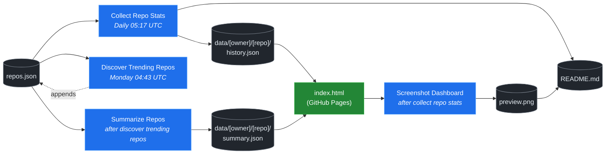

# 🚀 Rising Repos Tracker

> Automatically tracks daily GitHub stats (stars, forks, issues, velocity) for rising open source repos.

[](https://www.telosignal.com/)


**[→ View Live Dashboard](https://patrick-creates.github.io/rising-repos-tracker/)**

Built and maintained by [Telosignal](https://www.telosignal.com/).


<!-- AUTOGEN-STATS-START -->
## 📊 Current snapshot

> Auto-updated daily — last refreshed 2026-09-15

| Metric | Value |
|---|---|
| Repos tracked | **199** |
| Total stars | **9,719,907** |
| Total forks | **1,421,567** |
| Fastest growing | **VoiceStudio** (+1230.3/day) |

### 🔥 Top 5 by velocity

| # | Repo | Stars | Stars/day |
|---|---|---:|---:|
| 1 | [debpalash/VoiceStudio](https://github.com/debpalash/VoiceStudio) | 30,061 | +1230.3 |
| 2 | [DietrichGebert/ponytail](https://github.com/DietrichGebert/ponytail) | 138,900 | +1069.2 |
| 3 | [stablyai/orca](https://github.com/stablyai/orca) | 69,088 | +795.8 |
| 4 | [NousResearch/hermes-agent](https://github.com/NousResearch/hermes-agent) | 245,675 | +781.0 |
| 5 | [diegosouzapw/OmniRoute](https://github.com/diegosouzapw/OmniRoute) | 66,365 | +763.6 |

### 🆕 Recently added

- [every-app/open-seo](https://github.com/every-app/open-seo) — added 2026-09-14 — Open source alternative to Semrush and Ahrefs
- [NVIDIA/SkillSpector](https://github.com/NVIDIA/SkillSpector) — added 2026-09-14 — Security scanner for AI agent skills. Detect vulnerabilities, malicious patterns, security risks, prompt injection, data exfiltration, and supply-chain risks in Claude Code, Codex, and MCP skills before you install them.
- [AgriciDaniel/claude-seo](https://github.com/AgriciDaniel/claude-seo) — added 2026-09-14 — Universal SEO skill for Claude Code. 25 sub-skills + 18 sub-agents covering technical SEO, E-E-A-T, schema, GEO/AEO, backlinks, local SEO, maps intelligence, semantic clustering, e-commerce SEO, international SEO, Google APIs, and PDF/Excel reporting. Optional DataForSEO, Firecrawl, and Banana extensions.
<!-- AUTOGEN-STATS-END -->

<!-- AUTOGEN-DIAGRAM-START -->
## 🔄 How it works


```mermaid
graph LR
    repos[("repos.json")]:::data
    history[("data/[owner]/[repo]/<br/>history.json")]:::data
    summary[("data/[owner]/[repo]/<br/>summary.json")]:::data
    readme[("README.md")]:::data
    preview[("preview.png")]:::data
    dashboard["index.html<br/>(GitHub Pages)"]:::output
    collect_yml["Collect Repo Stats<br/><i>Daily 05:17 UTC</i>"]:::workflow
    discover_yml["Discover Trending Repos<br/><i>Monday 04:43 UTC</i>"]:::workflow
    screenshot_yml["Screenshot Dashboard<br/><i>after collect repo stats</i>"]:::workflow
    summarize_yml["Summarize Repos<br/><i>after discover trending repos</i>"]:::workflow
    repos --> collect_yml
    collect_yml --> history
    collect_yml --> readme
    repos --> discover_yml
    discover_yml -.->|appends| repos
    dashboard --> screenshot_yml
    screenshot_yml --> preview
    repos --> summarize_yml
    summarize_yml --> summary
    history --> dashboard
    summary --> dashboard
    preview --> readme
    classDef workflow fill:#1f6feb,stroke:#58a6ff,color:#fff
    classDef data fill:#21262d,stroke:#7d8590,color:#e6edf3
    classDef output fill:#238636,stroke:#3fb950,color:#fff
```
<!-- AUTOGEN-DIAGRAM-END -->

<!-- AUTOGEN-WORKFLOWS-START -->
## ⚙️ Workflows

| File | Schedule | Name |
|---|---|---|
| `collect.yml` | Daily 05:17 UTC | Collect Repo Stats |
| `discover.yml` | Monday 04:43 UTC | Discover Trending Repos |
| `screenshot.yml` | After Collect Repo Stats | Screenshot Dashboard |
| `summarize.yml` | After Discover Trending Repos | Summarize Repos |

> All workflows commit results directly back to the repo. Schedules are best-effort — GitHub Actions cron can drift by a few minutes.
<!-- AUTOGEN-WORKFLOWS-END -->

<!-- AUTOGEN-REPOS-START -->
## 📋 All tracked repos

| Repo | Stars | Forks | Stars/day |
|---|---:|---:|---:|
| [openclaw/openclaw](https://github.com/openclaw/openclaw) | 389,736 | 81,924 | +146.1 |
| [obra/superpowers](https://github.com/obra/superpowers) | 286,895 | 25,656 | +603.7 |
| [affaan-m/everything-claude-code](https://github.com/affaan-m/everything-claude-code) | 258,653 | 38,683 | +620.8 |
| [affaan-m/ECC](https://github.com/affaan-m/ECC) | 258,653 | 38,683 | +587.8 |
| [NousResearch/hermes-agent](https://github.com/NousResearch/hermes-agent) | 245,675 | 51,218 | +781.0 |
| [Significant-Gravitas/AutoGPT](https://github.com/Significant-Gravitas/AutoGPT) | 187,360 | 46,016 | +24.6 |
| [microsoft/markitdown](https://github.com/microsoft/markitdown) | 184,158 | 13,567 | +489.2 |
| [f/prompts.chat](https://github.com/f/prompts.chat) | 170,385 | 21,914 | +65.7 |
| [langgenius/dify](https://github.com/langgenius/dify) | 155,796 | 24,609 | +116.6 |
| [open-webui/open-webui](https://github.com/open-webui/open-webui) | 152,110 | 22,259 | +121.7 |
| [langchain-ai/langchain](https://github.com/langchain-ai/langchain) | 146,365 | 24,457 | +77.8 |
| [DietrichGebert/ponytail](https://github.com/DietrichGebert/ponytail) | 138,900 | 7,460 | +1069.2 |
| [github/spec-kit](https://github.com/github/spec-kit) | 136,910 | 12,271 | +312.4 |
| [farion1231/cc-switch](https://github.com/farion1231/cc-switch) | 132,960 | 9,161 | +491.0 |
| [nextlevelbuilder/ui-ux-pro-max-skill](https://github.com/nextlevelbuilder/ui-ux-pro-max-skill) | 127,736 | 13,638 | +398.7 |
| [microsoft/generative-ai-for-beginners](https://github.com/microsoft/generative-ai-for-beginners) | 119,760 | 63,060 | +72.1 |
| [Graphify-Labs/graphify](https://github.com/Graphify-Labs/graphify) | 116,859 | 11,399 | +403.2 |
| [JuliusBrussee/caveman](https://github.com/JuliusBrussee/caveman) | 105,669 | 6,117 | +368.0 |
| [nexu-io/open-design](https://github.com/nexu-io/open-design) | 96,280 | 11,191 | +434.2 |
| [ruvnet/RuView](https://github.com/ruvnet/RuView) | 94,045 | 12,443 | +249.1 |
| [thedotmack/claude-mem](https://github.com/thedotmack/claude-mem) | 93,927 | 8,265 | +148.4 |
| [vllm-project/vllm](https://github.com/vllm-project/vllm) | 91,809 | 22,218 | +95.4 |
| [ChatGPTNextWeb/NextChat](https://github.com/ChatGPTNextWeb/NextChat) | 88,763 | 59,072 | +6.0 |
| [OpenHands/OpenHands](https://github.com/OpenHands/OpenHands) | 87,967 | 11,533 | +117.0 |
| [Leonxlnx/taste-skill](https://github.com/Leonxlnx/taste-skill) | 87,278 | 5,941 | +536.5 |
| [koala73/worldmonitor](https://github.com/koala73/worldmonitor) | 86,308 | 13,098 | +266.2 |
| [lobehub/lobehub](https://github.com/lobehub/lobehub) | 82,493 | 15,888 | +44.0 |
| [Panniantong/Agent-Reach](https://github.com/Panniantong/Agent-Reach) | 81,786 | 7,113 | +589.0 |
| [rtk-ai/rtk](https://github.com/rtk-ai/rtk) | 80,444 | 5,106 | +257.2 |
| [datawhalechina/hello-agents](https://github.com/datawhalechina/hello-agents) | 79,065 | 9,821 | +236.7 |
| [dair-ai/Prompt-Engineering-Guide](https://github.com/dair-ai/Prompt-Engineering-Guide) | 78,334 | 8,604 | +30.3 |
| [shareAI-lab/learn-claude-code](https://github.com/shareAI-lab/learn-claude-code) | 76,817 | 12,345 | +131.2 |
| [unslothai/unsloth](https://github.com/unslothai/unsloth) | 76,189 | 6,945 | +97.4 |
| [openai/openai-cookbook](https://github.com/openai/openai-cookbook) | 75,985 | 12,866 | +19.8 |
| [ComposioHQ/awesome-claude-skills](https://github.com/ComposioHQ/awesome-claude-skills) | 75,061 | 8,678 | +122.3 |
| [chopratejas/headroom](https://github.com/chopratejas/headroom) | 72,240 | 5,531 | +479.1 |
| [headroomlabs-ai/headroom](https://github.com/headroomlabs-ai/headroom) | 72,240 | 5,531 | +309.8 |
| [santifer/career-ops](https://github.com/santifer/career-ops) | 71,680 | 13,521 | +220.3 |
| [career-ops-hq/career-ops](https://github.com/career-ops-hq/career-ops) | 71,680 | 13,521 | +162.3 |
| [stablyai/orca](https://github.com/stablyai/orca) | 69,088 | 4,511 | +795.8 |
| [code-yeongyu/oh-my-openagent](https://github.com/code-yeongyu/oh-my-openagent) | 69,066 | 5,684 | +89.5 |
| [Fission-AI/OpenSpec](https://github.com/Fission-AI/OpenSpec) | 68,334 | 4,693 | +162.9 |
| [asgeirtj/system_prompts_leaks](https://github.com/asgeirtj/system_prompts_leaks) | 67,068 | 10,891 | +222.4 |
| [xtekky/gpt4free](https://github.com/xtekky/gpt4free) | 66,689 | 13,510 | +3.7 |
| [diegosouzapw/OmniRoute](https://github.com/diegosouzapw/OmniRoute) | 66,365 | 9,302 | +763.6 |
| [shanraisshan/claude-code-best-practice](https://github.com/shanraisshan/claude-code-best-practice) | 65,938 | 6,542 | +103.7 |
| [ZhuLinsen/daily_stock_analysis](https://github.com/ZhuLinsen/daily_stock_analysis) | 65,094 | 54,512 | +232.3 |
| [usestrix/strix](https://github.com/usestrix/strix) | 62,527 | 6,847 | +347.3 |
| [mvanhorn/last30days-skill](https://github.com/mvanhorn/last30days-skill) | 62,067 | 5,414 | +296.9 |
| [tw93/Pake](https://github.com/tw93/Pake) | 61,431 | 12,644 | +105.4 |
| [calesthio/OpenMontage](https://github.com/calesthio/OpenMontage) | 59,229 | 7,442 | +402.3 |
| [MemPalace/mempalace](https://github.com/MemPalace/mempalace) | 59,072 | 7,555 | +55.6 |
| [BerriAI/litellm](https://github.com/BerriAI/litellm) | 58,776 | 11,452 | +94.9 |
| [FlowiseAI/Flowise](https://github.com/FlowiseAI/Flowise) | 55,460 | 25,016 | +21.3 |
| [rohitg00/ai-engineering-from-scratch](https://github.com/rohitg00/ai-engineering-from-scratch) | 54,639 | 9,567 | +266.8 |
| [hesreallyhim/awesome-claude-code](https://github.com/hesreallyhim/awesome-claude-code) | 54,087 | 4,713 | +83.3 |
| [ggml-org/whisper.cpp](https://github.com/ggml-org/whisper.cpp) | 53,675 | 6,152 | +32.1 |
| [jamiepine/voicebox](https://github.com/jamiepine/voicebox) | 53,620 | 6,712 | +232.1 |
| [ChromeDevTools/chrome-devtools-mcp](https://github.com/ChromeDevTools/chrome-devtools-mcp) | 52,023 | 3,656 | +101.2 |
| [router-for-me/CLIProxyAPI](https://github.com/router-for-me/CLIProxyAPI) | 51,861 | 7,847 | +151.5 |
| [coreyhaines31/marketingskills](https://github.com/coreyhaines31/marketingskills) | 50,386 | 7,625 | +178.8 |
| [heygen-com/hyperframes](https://github.com/heygen-com/hyperframes) | 50,226 | 4,580 | +249.1 |
| [elder-plinius/CL4R1T4S](https://github.com/elder-plinius/CL4R1T4S) | 49,861 | 10,250 | +119.2 |
| [Aider-AI/aider](https://github.com/Aider-AI/aider) | 48,965 | 4,947 | +33.4 |
| [kepano/obsidian-skills](https://github.com/kepano/obsidian-skills) | 48,363 | 3,443 | +136.6 |
| [HKUDS/nanobot](https://github.com/HKUDS/nanobot) | 48,168 | 8,514 | +45.7 |
| [Imbad0202/academic-research-skills](https://github.com/Imbad0202/academic-research-skills) | 48,128 | 3,750 | +168.7 |
| [QuantumNous/new-api](https://github.com/QuantumNous/new-api) | 48,126 | 11,531 | +113.0 |
| [bojieli/ai-agent-book](https://github.com/bojieli/ai-agent-book) | 47,399 | 5,301 | +692.0 |
| [zhayujie/CowAgent](https://github.com/zhayujie/CowAgent) | 46,980 | 10,351 | +20.2 |
| [sickn33/antigravity-awesome-skills](https://github.com/sickn33/antigravity-awesome-skills) | 46,432 | 6,765 | +68.6 |
| [sickn33/agentic-awesome-skills](https://github.com/sickn33/agentic-awesome-skills) | 46,432 | 6,765 | +53.0 |
| [K-Dense-AI/scientific-agent-skills](https://github.com/K-Dense-AI/scientific-agent-skills) | 44,999 | 4,081 | +190.4 |
| [danny-avila/LibreChat](https://github.com/danny-avila/LibreChat) | 43,601 | 9,009 | +54.3 |
| [DeusData/codebase-memory-mcp](https://github.com/DeusData/codebase-memory-mcp) | 43,303 | 3,532 | +290.7 |
| [MadsLorentzen/ai-job-search](https://github.com/MadsLorentzen/ai-job-search) | 42,830 | 14,689 | +332.0 |
| [chatanywhere/GPT_API_free](https://github.com/chatanywhere/GPT_API_free) | 42,570 | 2,721 | +39.1 |
| [chatboxai/chatbox](https://github.com/chatboxai/chatbox) | 41,769 | 4,250 | +14.8 |
| [langchain-ai/langgraph](https://github.com/langchain-ai/langgraph) | 41,685 | 7,042 | +73.7 |
| [Hmbown/CodeWhale](https://github.com/Hmbown/CodeWhale) | 40,978 | 3,561 | +55.8 |
| [Hmbown/Codewhale](https://github.com/Hmbown/Codewhale) | 40,978 | 3,561 | +7.8 |
| [AstrBotDevs/AstrBot](https://github.com/AstrBotDevs/AstrBot) | 40,523 | 2,915 | +65.4 |
| [tinyhumansai/openhuman](https://github.com/tinyhumansai/openhuman) | 39,803 | 3,922 | +39.3 |
| [mindsdb/mindshub](https://github.com/mindsdb/mindshub) | 39,735 | 6,240 | +5.2 |
| [wshobson/agents](https://github.com/wshobson/agents) | 39,675 | 4,226 | +33.1 |
| [Yeachan-Heo/oh-my-claudecode](https://github.com/Yeachan-Heo/oh-my-claudecode) | 39,175 | 3,502 | +38.5 |
| [github/awesome-copilot](https://github.com/github/awesome-copilot) | 39,023 | 4,946 | +46.2 |
| [ogulcancelik/herdr](https://github.com/ogulcancelik/herdr) | 38,625 | 2,884 | +369.4 |
| [herdrdev/herdr](https://github.com/herdrdev/herdr) | 38,625 | 2,884 | +345.0 |
| [google/langextract](https://github.com/google/langextract) | 38,578 | 2,704 | +17.9 |
| [volcengine/OpenViking](https://github.com/volcengine/OpenViking) | 37,376 | 2,874 | +121.7 |
| [PDFMathTranslate/PDFMathTranslate](https://github.com/PDFMathTranslate/PDFMathTranslate) | 36,944 | 3,321 | +25.9 |
| [songquanpeng/one-api](https://github.com/songquanpeng/one-api) | 36,900 | 6,857 | +23.8 |
| [AlexsJones/llmfit](https://github.com/AlexsJones/llmfit) | 36,603 | 2,314 | +90.6 |
| [anthropics/claude-plugins-official](https://github.com/anthropics/claude-plugins-official) | 36,306 | 4,077 | +68.8 |
| [esengine/DeepSeek-Reasonix](https://github.com/esengine/DeepSeek-Reasonix) | 35,559 | 2,398 | +161.9 |
| [agentscope-ai/QwenPaw](https://github.com/agentscope-ai/QwenPaw) | 34,965 | 3,106 | +186.8 |
| [JCodesMore/ai-website-cloner-template](https://github.com/JCodesMore/ai-website-cloner-template) | 34,427 | 5,016 | +189.5 |
| [HKUDS/Vibe-Trading](https://github.com/HKUDS/Vibe-Trading) | 33,473 | 5,463 | +240.2 |
| [Gitlawb/openclaude](https://github.com/Gitlawb/openclaude) | 33,285 | 9,086 | +48.6 |
| [iOfficeAI/AionUi](https://github.com/iOfficeAI/AionUi) | 32,850 | 3,393 | +51.9 |
| [zeroclaw-labs/zeroclaw](https://github.com/zeroclaw-labs/zeroclaw) | 32,842 | 4,942 | +11.0 |
| [mukul975/Anthropic-Cybersecurity-Skills](https://github.com/mukul975/Anthropic-Cybersecurity-Skills) | 32,795 | 3,960 | +172.6 |
| [tirth8205/code-review-graph](https://github.com/tirth8205/code-review-graph) | 31,448 | 2,855 | +140.6 |
| [p-e-w/heretic](https://github.com/p-e-w/heretic) | 31,444 | 3,522 | +75.5 |
| [can1357/oh-my-pi](https://github.com/can1357/oh-my-pi) | 31,209 | 3,262 | +202.5 |
| [googleworkspace/cli](https://github.com/googleworkspace/cli) | 31,006 | 1,832 | +40.5 |
| [virgiliojr94/book-to-skill](https://github.com/virgiliojr94/book-to-skill) | 30,730 | 3,179 | +268.2 |
| [iOfficeAI/OfficeCLI](https://github.com/iOfficeAI/OfficeCLI) | 30,602 | 2,089 | +312.7 |
| [debpalash/VoiceStudio](https://github.com/debpalash/VoiceStudio) | 30,061 | 3,625 | +1230.3 |
| [langchain-ai/deepagents](https://github.com/langchain-ai/deepagents) | 29,431 | 4,121 | +53.3 |
| [jackwener/OpenCLI](https://github.com/jackwener/OpenCLI) | 29,314 | 2,867 | +55.7 |
| [alibaba/page-agent](https://github.com/alibaba/page-agent) | 29,079 | 2,598 | +114.4 |
| [decolua/9router](https://github.com/decolua/9router) | 28,805 | 5,290 | +122.1 |
| [voideditor/void](https://github.com/voideditor/void) | 28,800 | 2,649 | — |
| [rohitg00/agentmemory](https://github.com/rohitg00/agentmemory) | 28,453 | 2,460 | +66.9 |
| [BloopAI/vibe-kanban](https://github.com/BloopAI/vibe-kanban) | 28,087 | 3,007 | +13.0 |
| [jarrodwatts/claude-hud](https://github.com/jarrodwatts/claude-hud) | 27,977 | 1,297 | +33.2 |
| [manaflow-ai/cmux](https://github.com/manaflow-ai/cmux) | 27,115 | 2,357 | +43.1 |
| [alibaba/open-code-review](https://github.com/alibaba/open-code-review) | 26,876 | 1,928 | +237.9 |
| [TencentCloud/TencentDB-Agent-Memory](https://github.com/TencentCloud/TencentDB-Agent-Memory) | 26,749 | 2,517 | +281.7 |
| [zai-org/Open-AutoGLM](https://github.com/zai-org/Open-AutoGLM) | 26,222 | 4,028 | +7.7 |
| [toon-format/toon](https://github.com/toon-format/toon) | 25,378 | 1,120 | +8.9 |
| [pascalorg/editor](https://github.com/pascalorg/editor) | 23,933 | 2,968 | +74.5 |
| [Tencent/WeKnora](https://github.com/Tencent/WeKnora) | 23,593 | 3,332 | +79.4 |
| [mksglu/context-mode](https://github.com/mksglu/context-mode) | 22,970 | 1,658 | +59.8 |
| [winfunc/opcode](https://github.com/winfunc/opcode) | 22,399 | 1,721 | +4.0 |
| [pranshuparmar/witr](https://github.com/pranshuparmar/witr) | 22,326 | 776 | +55.1 |
| [guillaumemeyer/watermarks-remover](https://github.com/guillaumemeyer/watermarks-remover) | 22,063 | 2,542 | +205.0 |
| [jundot/omlx](https://github.com/jundot/omlx) | 21,748 | 1,882 | +55.6 |
| [coze-dev/coze-studio](https://github.com/coze-dev/coze-studio) | 21,591 | 3,111 | +6.5 |
| [NirDiamant/agents-towards-production](https://github.com/NirDiamant/agents-towards-production) | 21,458 | 2,848 | +8.3 |
| [steipete/CodexBar](https://github.com/steipete/CodexBar) | 21,431 | 1,931 | +73.3 |
| [KKKKhazix/khazix-skills](https://github.com/KKKKhazix/khazix-skills) | 20,682 | 2,202 | +56.6 |
| [jnMetaCode/agency-agents-zh](https://github.com/jnMetaCode/agency-agents-zh) | 20,680 | 3,337 | +62.0 |
| [1jehuang/jcode](https://github.com/1jehuang/jcode) | 19,717 | 2,284 | +178.3 |
| [tanweai/pua](https://github.com/tanweai/pua) | 19,645 | 1,196 | +15.2 |
| [t8y2/dbx](https://github.com/t8y2/dbx) | 19,579 | 1,893 | +154.8 |
| [datawhalechina/easy-vibe](https://github.com/datawhalechina/easy-vibe) | 19,418 | 1,861 | +26.9 |
| [danielmiessler/LifeOS](https://github.com/danielmiessler/LifeOS) | 19,025 | 2,467 | +34.8 |
| [every-app/open-seo](https://github.com/every-app/open-seo) | 18,749 | 2,391 | +93.0 |
| [nesquena/hermes-webui](https://github.com/nesquena/hermes-webui) | 18,356 | 2,578 | +41.4 |
| [RightNow-AI/openfang](https://github.com/RightNow-AI/openfang) | 18,182 | 2,293 | +3.9 |
| [microsoft/agent-lightning](https://github.com/microsoft/agent-lightning) | 18,126 | 1,589 | +8.9 |
| [jlcodes99/cockpit-tools](https://github.com/jlcodes99/cockpit-tools) | 17,689 | 1,563 | +61.6 |
| [browser-use/browser-harness](https://github.com/browser-use/browser-harness) | 17,552 | 1,718 | +26.6 |
| [NVIDIA/SkillSpector](https://github.com/NVIDIA/SkillSpector) | 17,249 | 1,474 | +109.0 |
| [AgriciDaniel/claude-seo](https://github.com/AgriciDaniel/claude-seo) | 16,948 | 2,479 | +63.0 |
| [cft0808/edict](https://github.com/cft0808/edict) | 16,890 | 1,768 | +9.0 |
| [MemoriLabs/Memori](https://github.com/MemoriLabs/Memori) | 16,737 | 3,464 | +16.4 |
| [composio-community/awesome-codex-skills](https://github.com/composio-community/awesome-codex-skills) | 16,458 | 1,619 | +20.8 |
| [xbtlin/ai-berkshire](https://github.com/xbtlin/ai-berkshire) | 16,371 | 2,440 | +78.8 |
| [wanshuiyin/Auto-claude-code-research-in-sleep](https://github.com/wanshuiyin/Auto-claude-code-research-in-sleep) | 16,141 | 1,382 | +43.2 |
| [xpzouying/xiaohongshu-mcp](https://github.com/xpzouying/xiaohongshu-mcp) | 15,801 | 2,322 | +17.8 |
| [Anionex/banana-slides](https://github.com/Anionex/banana-slides) | 15,603 | 1,783 | +5.4 |
| [walkinglabs/learn-harness-engineering](https://github.com/walkinglabs/learn-harness-engineering) | 15,235 | 1,524 | +75.4 |
| [yusufkaraaslan/Skill_Seekers](https://github.com/yusufkaraaslan/Skill_Seekers) | 14,974 | 1,525 | +8.8 |
| [kyegomez/OpenMythos](https://github.com/kyegomez/OpenMythos) | 14,895 | 3,296 | +8.7 |
| [ifixai-ai/iFixAi](https://github.com/ifixai-ai/iFixAi) | 14,586 | 1,325 | +178.1 |
| [NanmiCoder/cc-haha](https://github.com/NanmiCoder/cc-haha) | 14,417 | 8,538 | +12.6 |
| [NevaMind-AI/memU](https://github.com/NevaMind-AI/memU) | 14,410 | 1,068 | +6.0 |
| [superset-sh/superset](https://github.com/superset-sh/superset) | 14,223 | 1,271 | +26.4 |
| [XiaomiMiMo/MiMo-Code](https://github.com/XiaomiMiMo/MiMo-Code) | 13,122 | 1,349 | +26.9 |
| [EverMind-AI/EverOS](https://github.com/EverMind-AI/EverOS) | 12,971 | 923 | +41.7 |
| [sirmalloc/ccstatusline](https://github.com/sirmalloc/ccstatusline) | 12,885 | 567 | +20.6 |
| [ConardLi/garden-skills](https://github.com/ConardLi/garden-skills) | 12,425 | 1,500 | +45.7 |
| [0x4m4/hexstrike-ai](https://github.com/0x4m4/hexstrike-ai) | 11,882 | 2,442 | +24.0 |
| [brokermr810/QuantDinger](https://github.com/brokermr810/QuantDinger) | 11,658 | 2,420 | +33.5 |
| [OpenByteInc/QuantDinger](https://github.com/OpenByteInc/QuantDinger) | 11,658 | 2,420 | +32.6 |
| [MemTensor/MemOS](https://github.com/MemTensor/MemOS) | 11,330 | 1,037 | +16.7 |
| [holaboss-ai/holaOS](https://github.com/holaboss-ai/holaOS) | 11,287 | 721 | +100.6 |
| [EKKOLearnAI/hermes-studio](https://github.com/EKKOLearnAI/hermes-studio) | 11,088 | 1,350 | +31.4 |
| [aden-hive/hive](https://github.com/aden-hive/hive) | 11,042 | 5,663 | +5.5 |
| [getagentseal/codeburn](https://github.com/getagentseal/codeburn) | 11,026 | 828 | +36.0 |
| [ValueCell-ai/valuecell](https://github.com/ValueCell-ai/valuecell) | 11,010 | 1,802 | +1.8 |
| [openai/codex-security](https://github.com/openai/codex-security) | 10,711 | 785 | +56.5 |
| [Kuberwastaken/claurst](https://github.com/Kuberwastaken/claurst) | 10,305 | 7,742 | +5.6 |
| [ykdojo/claude-code-tips](https://github.com/ykdojo/claude-code-tips) | 10,089 | 815 | +15.1 |
| [StarTrail-org/PixelRAG](https://github.com/StarTrail-org/PixelRAG) | 9,966 | 855 | +52.8 |
| [frankbria/ralph-claude-code](https://github.com/frankbria/ralph-claude-code) | 9,628 | 719 | +4.1 |
| [modem-dev/hunk](https://github.com/modem-dev/hunk) | 9,283 | 294 | +40.3 |
| [EvoMap/evolver](https://github.com/EvoMap/evolver) | 9,078 | 845 | +3.1 |
| [iflytek/astron-agent](https://github.com/iflytek/astron-agent) | 9,015 | 881 | +5.7 |
| [MiroMindAI/MiroThinker](https://github.com/MiroMindAI/MiroThinker) | 8,398 | 646 | +1.0 |
| [mmulet/term.everything](https://github.com/mmulet/term.everything) | 8,099 | 194 | +1.1 |
| [trailhq/Graft](https://github.com/trailhq/Graft) | 7,933 | 713 | +344.0 |
| [ValueCell-ai/ClawX](https://github.com/ValueCell-ai/ClawX) | 7,616 | 1,144 | +1.2 |
| [1weiho/open-slide](https://github.com/1weiho/open-slide) | 7,581 | 542 | +40.6 |
| [rorkai/App-Store-Connect-CLI](https://github.com/rorkai/App-Store-Connect-CLI) | 7,250 | 610 | +44.0 |
| [opensquilla/opensquilla](https://github.com/opensquilla/opensquilla) | 7,022 | 565 | +14.3 |
| [TokenRhythm/opensquilla](https://github.com/TokenRhythm/opensquilla) | 7,022 | 565 | +6.8 |
| [WenyuChiou/awesome-agentic-ai-zh](https://github.com/WenyuChiou/awesome-agentic-ai-zh) | 7,009 | 948 | +30.5 |
| [Andyyyy64/whichllm](https://github.com/Andyyyy64/whichllm) | 6,638 | 363 | +13.5 |
| [steipete/summarize](https://github.com/steipete/summarize) | 6,624 | 443 | +3.3 |
| [dataelement/dsh-desktop](https://github.com/dataelement/dsh-desktop) | 6,544 | 299 | +330.0 |
| [Arthur-Ficial/apfel](https://github.com/Arthur-Ficial/apfel) | 6,383 | 244 | +4.2 |
| [microsoft/fara](https://github.com/microsoft/fara) | 6,177 | 604 | +2.8 |
| [UfoMiao/zcf](https://github.com/UfoMiao/zcf) | 6,084 | 420 | +0.2 |
| [re4/LibreCode](https://github.com/re4/LibreCode) | 86 | 4 | — |
<!-- AUTOGEN-REPOS-END -->

---

## What it does

- Collects daily snapshots of stars, forks, watchers and open issues for every tracked repo
- Discovers new trending repos automatically every Monday using the GitHub Search API
- Generates AI summaries (use cases, similar tools, tags) for each tracked repo via GitHub Models
- Stores all history as plain JSON — no database, no backend
- Renders a live dashboard via GitHub Pages — updates daily, zero maintenance

## Tracked repos

Data lives in [`data/`](./data) — one folder per repo, one `history.json` per entry.  
The full watch list is in [`repos.json`](./repos.json).

## Fork & use it for yourself

This is my personal tracker — the watch list reflects what I find interesting. If you want to track different repos, the best path is to **fork this repo and run your own**.

### Setup

1. Fork this repo to your account
2. Replace the contents of [`repos.json`](./repos.json) with the repos you want to track (or just leave one entry — `discover.yml` will auto-add more every Monday)
3. Go to **Settings → Pages** and enable GitHub Pages from the `main` branch
4. Go to **Actions** and run **Collect Repo Stats** once manually to seed your first data point
5. Your dashboard will be live at `https://YOUR-USERNAME.github.io/rising-repos-tracker/`

That's it — daily collection and weekly discovery run automatically on schedule. Zero ongoing maintenance.

### Customizing what gets discovered

Edit [`scripts/discover.js`](./scripts/discover.js) to change:

- `MIN_STARS` — minimum star threshold for candidates
- `MAX_AGE_DAYS` — how recent a repo must be
- `MAX_NEW_REPOS` — how many to add per discovery run
- The `queries` array — GitHub Search API queries that define what "trending" means to you

### Adding a repo manually

Just edit `repos.json` directly:

```json
{
  "owner": "OWNER",
  "repo": "REPO",
  "added": "YYYY-MM-DD",
  "notes": "why you're tracking this"
}
```

The next daily collect run picks it up automatically.

## Stack

- **GitHub Actions** — scheduling and automation
- **GitHub Pages** — dashboard hosting
- **GitHub API** — data source
- **GitHub Models** — free AI summaries (gpt-4o-mini)
- **Chart.js** — star growth visualization
- **Mermaid** — architecture diagram (rendered by GitHub)
- No dependencies, no build step, no database

## License

MIT
