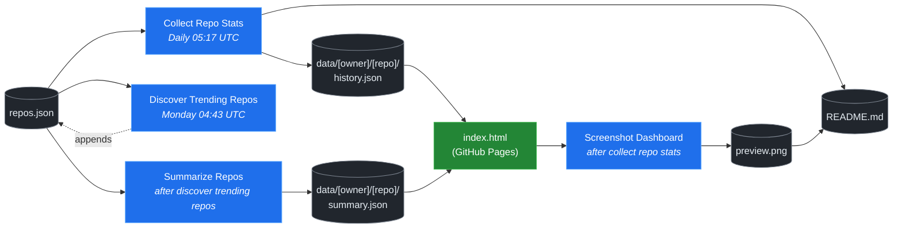

# 🚀 Rising Repos Tracker

> Automatically tracks daily GitHub stats (stars, forks, issues, velocity) for rising open source repos.

[](https://www.telosignal.com/)


**[→ View Live Dashboard](https://patrick-creates.github.io/rising-repos-tracker/)**

Built and maintained by [Telosignal](https://www.telosignal.com/).


<!-- AUTOGEN-STATS-START -->
## 📊 Current snapshot

> Auto-updated daily — last refreshed 2026-08-28

| Metric | Value |
|---|---|
| Repos tracked | **186** |
| Total stars | **9,062,708** |
| Total forks | **1,342,648** |
| Fastest growing | **ponytail** (+1001.1/day) |

### 🔥 Top 5 by velocity

| # | Repo | Stars | Stars/day |
|---|---|---:|---:|
| 1 | [DietrichGebert/ponytail](https://github.com/DietrichGebert/ponytail) | 115,090 | +1001.1 |
| 2 | [bojieli/ai-agent-book](https://github.com/bojieli/ai-agent-book) | 43,003 | +898.7 |
| 3 | [diegosouzapw/OmniRoute](https://github.com/diegosouzapw/OmniRoute) | 57,420 | +854.1 |
| 4 | [NousResearch/hermes-agent](https://github.com/NousResearch/hermes-agent) | 237,676 | +837.7 |
| 5 | [stablyai/orca](https://github.com/stablyai/orca) | 55,964 | +818.5 |

### 🆕 Recently added

- [virgiliojr94/book-to-skill](https://github.com/virgiliojr94/book-to-skill) — added 2026-08-24 — Turn any technical book PDF into a Claude Code skill — ready to study, reference, and use while you work.
- [guillaumemeyer/watermarks-remover](https://github.com/guillaumemeyer/watermarks-remover) — added 2026-08-24 — Strip multi-vendor AI provenance marks: Unicode text hygiene, statistical rewrite hooks, and C2PA/metadata from PNG/JPEG/SVG/PDF/DOCX/HTML/MD
- [holaboss-ai/holaOS](https://github.com/holaboss-ai/holaOS) — added 2026-08-17 — Open-source All in One AI agent workspace. Run any agent — Claude Code, Codex — across your tools (100+ integrations + MCP), apps, browser, and files, with shared memory. Built-in models or BYOK.
<!-- AUTOGEN-STATS-END -->

<!-- AUTOGEN-DIAGRAM-START -->
## 🔄 How it works


```mermaid
graph LR
    repos[("repos.json")]:::data
    history[("data/[owner]/[repo]/<br/>history.json")]:::data
    summary[("data/[owner]/[repo]/<br/>summary.json")]:::data
    readme[("README.md")]:::data
    preview[("preview.png")]:::data
    dashboard["index.html<br/>(GitHub Pages)"]:::output
    collect_yml["Collect Repo Stats<br/><i>Daily 05:17 UTC</i>"]:::workflow
    discover_yml["Discover Trending Repos<br/><i>Monday 04:43 UTC</i>"]:::workflow
    screenshot_yml["Screenshot Dashboard<br/><i>after collect repo stats</i>"]:::workflow
    summarize_yml["Summarize Repos<br/><i>after discover trending repos</i>"]:::workflow
    repos --> collect_yml
    collect_yml --> history
    collect_yml --> readme
    repos --> discover_yml
    discover_yml -.->|appends| repos
    dashboard --> screenshot_yml
    screenshot_yml --> preview
    repos --> summarize_yml
    summarize_yml --> summary
    history --> dashboard
    summary --> dashboard
    preview --> readme
    classDef workflow fill:#1f6feb,stroke:#58a6ff,color:#fff
    classDef data fill:#21262d,stroke:#7d8590,color:#e6edf3
    classDef output fill:#238636,stroke:#3fb950,color:#fff
```
<!-- AUTOGEN-DIAGRAM-END -->

<!-- AUTOGEN-WORKFLOWS-START -->
## ⚙️ Workflows

| File | Schedule | Name |
|---|---|---|
| `collect.yml` | Daily 05:17 UTC | Collect Repo Stats |
| `discover.yml` | Monday 04:43 UTC | Discover Trending Repos |
| `screenshot.yml` | After Collect Repo Stats | Screenshot Dashboard |
| `summarize.yml` | After Discover Trending Repos | Summarize Repos |

> All workflows commit results directly back to the repo. Schedules are best-effort — GitHub Actions cron can drift by a few minutes.
<!-- AUTOGEN-WORKFLOWS-END -->

<!-- AUTOGEN-REPOS-START -->
## 📋 All tracked repos

| Repo | Stars | Forks | Stars/day |
|---|---:|---:|---:|
| [openclaw/openclaw](https://github.com/openclaw/openclaw) | 387,926 | 81,450 | +153.8 |
| [obra/superpowers](https://github.com/obra/superpowers) | 278,964 | 24,980 | +647.6 |
| [affaan-m/everything-claude-code](https://github.com/affaan-m/everything-claude-code) | 243,916 | 36,891 | +587.6 |
| [affaan-m/ECC](https://github.com/affaan-m/ECC) | 243,916 | 36,891 | +544.1 |
| [NousResearch/hermes-agent](https://github.com/NousResearch/hermes-agent) | 237,676 | 48,240 | +837.7 |
| [Significant-Gravitas/AutoGPT](https://github.com/Significant-Gravitas/AutoGPT) | 186,962 | 46,049 | +25.1 |
| [microsoft/markitdown](https://github.com/microsoft/markitdown) | 176,822 | 12,993 | +502.9 |
| [f/prompts.chat](https://github.com/f/prompts.chat) | 168,116 | 21,686 | +55.6 |
| [langgenius/dify](https://github.com/langgenius/dify) | 153,762 | 24,305 | +117.2 |
| [open-webui/open-webui](https://github.com/open-webui/open-webui) | 150,229 | 21,933 | +124.6 |
| [langchain-ai/langchain](https://github.com/langchain-ai/langchain) | 145,194 | 24,228 | +80.0 |
| [github/spec-kit](https://github.com/github/spec-kit) | 132,021 | 11,860 | +319.3 |
| [farion1231/cc-switch](https://github.com/farion1231/cc-switch) | 129,909 | 8,911 | +547.7 |
| [nextlevelbuilder/ui-ux-pro-max-skill](https://github.com/nextlevelbuilder/ui-ux-pro-max-skill) | 122,492 | 13,111 | +416.8 |
| [microsoft/generative-ai-for-beginners](https://github.com/microsoft/generative-ai-for-beginners) | 118,701 | 62,594 | +74.3 |
| [DietrichGebert/ponytail](https://github.com/DietrichGebert/ponytail) | 115,090 | 6,289 | +1001.1 |
| [Graphify-Labs/graphify](https://github.com/Graphify-Labs/graphify) | 111,906 | 10,880 | +475.3 |
| [JuliusBrussee/caveman](https://github.com/JuliusBrussee/caveman) | 101,590 | 5,901 | +392.9 |
| [thedotmack/claude-mem](https://github.com/thedotmack/claude-mem) | 92,486 | 8,126 | +159.9 |
| [nexu-io/open-design](https://github.com/nexu-io/open-design) | 92,334 | 10,639 | +472.2 |
| [ruvnet/RuView](https://github.com/ruvnet/RuView) | 91,913 | 12,197 | +273.9 |
| [vllm-project/vllm](https://github.com/vllm-project/vllm) | 90,319 | 21,350 | +97.5 |
| [ChatGPTNextWeb/NextChat](https://github.com/ChatGPTNextWeb/NextChat) | 88,659 | 59,179 | +6.1 |
| [OpenHands/OpenHands](https://github.com/OpenHands/OpenHands) | 85,445 | 11,175 | +112.9 |
| [koala73/worldmonitor](https://github.com/koala73/worldmonitor) | 84,657 | 12,711 | +297.0 |
| [lobehub/lobehub](https://github.com/lobehub/lobehub) | 82,069 | 15,841 | +47.4 |
| [Leonxlnx/taste-skill](https://github.com/Leonxlnx/taste-skill) | 81,838 | 5,602 | +584.4 |
| [dair-ai/Prompt-Engineering-Guide](https://github.com/dair-ai/Prompt-Engineering-Guide) | 77,871 | 8,555 | +31.1 |
| [rtk-ai/rtk](https://github.com/rtk-ai/rtk) | 77,720 | 4,901 | +275.9 |
| [Panniantong/Agent-Reach](https://github.com/Panniantong/Agent-Reach) | 76,304 | 6,524 | +652.2 |
| [openai/openai-cookbook](https://github.com/openai/openai-cookbook) | 75,585 | 12,777 | +19.4 |
| [shareAI-lab/learn-claude-code](https://github.com/shareAI-lab/learn-claude-code) | 75,549 | 12,187 | +141.9 |
| [datawhalechina/hello-agents](https://github.com/datawhalechina/hello-agents) | 75,394 | 9,379 | +242.5 |
| [unslothai/unsloth](https://github.com/unslothai/unsloth) | 75,046 | 6,802 | +103.4 |
| [ComposioHQ/awesome-claude-skills](https://github.com/ComposioHQ/awesome-claude-skills) | 73,803 | 8,455 | +131.5 |
| [santifer/career-ops](https://github.com/santifer/career-ops) | 69,059 | 13,049 | +233.5 |
| [code-yeongyu/oh-my-openagent](https://github.com/code-yeongyu/oh-my-openagent) | 68,476 | 5,606 | +99.5 |
| [chopratejas/headroom](https://github.com/chopratejas/headroom) | 67,908 | 5,254 | +537.1 |
| [headroomlabs-ai/headroom](https://github.com/headroomlabs-ai/headroom) | 67,908 | 5,254 | +328.4 |
| [xtekky/gpt4free](https://github.com/xtekky/gpt4free) | 66,607 | 13,513 | +3.6 |
| [Fission-AI/OpenSpec](https://github.com/Fission-AI/OpenSpec) | 66,559 | 4,581 | +174.2 |
| [shanraisshan/claude-code-best-practice](https://github.com/shanraisshan/claude-code-best-practice) | 65,303 | 6,512 | +115.7 |
| [ZhuLinsen/daily_stock_analysis](https://github.com/ZhuLinsen/daily_stock_analysis) | 64,202 | 53,849 | +267.0 |
| [asgeirtj/system_prompts_leaks](https://github.com/asgeirtj/system_prompts_leaks) | 63,741 | 10,454 | +229.0 |
| [tw93/Pake](https://github.com/tw93/Pake) | 61,110 | 12,560 | +120.9 |
| [mvanhorn/last30days-skill](https://github.com/mvanhorn/last30days-skill) | 59,878 | 5,232 | +335.9 |
| [usestrix/strix](https://github.com/usestrix/strix) | 59,057 | 6,450 | +378.9 |
| [MemPalace/mempalace](https://github.com/MemPalace/mempalace) | 58,702 | 7,525 | +61.8 |
| [BerriAI/litellm](https://github.com/BerriAI/litellm) | 57,489 | 10,992 | +99.0 |
| [diegosouzapw/OmniRoute](https://github.com/diegosouzapw/OmniRoute) | 57,420 | 7,899 | +854.1 |
| [stablyai/orca](https://github.com/stablyai/orca) | 55,964 | 3,812 | +818.5 |
| [FlowiseAI/Flowise](https://github.com/FlowiseAI/Flowise) | 55,402 | 24,961 | +24.5 |
| [ggml-org/whisper.cpp](https://github.com/ggml-org/whisper.cpp) | 53,257 | 6,105 | +33.6 |
| [hesreallyhim/awesome-claude-code](https://github.com/hesreallyhim/awesome-claude-code) | 53,130 | 4,631 | +88.6 |
| [calesthio/OpenMontage](https://github.com/calesthio/OpenMontage) | 53,119 | 6,626 | +421.1 |
| [jamiepine/voicebox](https://github.com/jamiepine/voicebox) | 51,703 | 6,441 | +257.7 |
| [rohitg00/ai-engineering-from-scratch](https://github.com/rohitg00/ai-engineering-from-scratch) | 50,544 | 8,777 | +274.8 |
| [ChromeDevTools/chrome-devtools-mcp](https://github.com/ChromeDevTools/chrome-devtools-mcp) | 49,922 | 3,502 | +98.4 |
| [router-for-me/CLIProxyAPI](https://github.com/router-for-me/CLIProxyAPI) | 49,057 | 7,547 | +150.7 |
| [Aider-AI/aider](https://github.com/Aider-AI/aider) | 48,552 | 4,897 | +35.2 |
| [HKUDS/nanobot](https://github.com/HKUDS/nanobot) | 47,494 | 8,380 | +47.2 |
| [kepano/obsidian-skills](https://github.com/kepano/obsidian-skills) | 47,429 | 3,408 | +153.9 |
| [elder-plinius/CL4R1T4S](https://github.com/elder-plinius/CL4R1T4S) | 47,195 | 9,560 | +112.2 |
| [zhayujie/CowAgent](https://github.com/zhayujie/CowAgent) | 46,710 | 10,328 | +21.1 |
| [QuantumNous/new-api](https://github.com/QuantumNous/new-api) | 46,695 | 11,089 | +119.3 |
| [coreyhaines31/marketingskills](https://github.com/coreyhaines31/marketingskills) | 45,970 | 7,186 | +165.1 |
| [sickn33/antigravity-awesome-skills](https://github.com/sickn33/antigravity-awesome-skills) | 45,592 | 6,674 | +72.8 |
| [sickn33/agentic-awesome-skills](https://github.com/sickn33/agentic-awesome-skills) | 45,592 | 6,674 | +55.4 |
| [Imbad0202/academic-research-skills](https://github.com/Imbad0202/academic-research-skills) | 44,069 | 3,494 | +136.7 |
| [bojieli/ai-agent-book](https://github.com/bojieli/ai-agent-book) | 43,003 | 4,757 | +898.7 |
| [heygen-com/hyperframes](https://github.com/heygen-com/hyperframes) | 42,970 | 4,129 | +214.9 |
| [danny-avila/LibreChat](https://github.com/danny-avila/LibreChat) | 42,563 | 8,814 | +53.6 |
| [chatboxai/chatbox](https://github.com/chatboxai/chatbox) | 41,596 | 4,216 | +15.7 |
| [chatanywhere/GPT_API_free](https://github.com/chatanywhere/GPT_API_free) | 41,317 | 2,705 | +33.3 |
| [DeusData/codebase-memory-mcp](https://github.com/DeusData/codebase-memory-mcp) | 40,982 | 3,331 | +339.2 |
| [Hmbown/CodeWhale](https://github.com/Hmbown/CodeWhale) | 40,862 | 3,542 | +65.2 |
| [langchain-ai/langgraph](https://github.com/langchain-ai/langgraph) | 40,626 | 6,843 | +77.7 |
| [AstrBotDevs/AstrBot](https://github.com/AstrBotDevs/AstrBot) | 39,728 | 2,847 | +69.8 |
| [mindsdb/mindshub](https://github.com/mindsdb/mindshub) | 39,655 | 6,237 | +5.5 |
| [wshobson/agents](https://github.com/wshobson/agents) | 39,223 | 4,188 | +34.6 |
| [Yeachan-Heo/oh-my-claudecode](https://github.com/Yeachan-Heo/oh-my-claudecode) | 38,849 | 3,487 | +42.4 |
| [google/langextract](https://github.com/google/langextract) | 38,500 | 2,708 | +20.5 |
| [github/awesome-copilot](https://github.com/github/awesome-copilot) | 38,376 | 4,848 | +48.1 |
| [MadsLorentzen/ai-job-search](https://github.com/MadsLorentzen/ai-job-search) | 37,541 | 12,703 | +346.9 |
| [songquanpeng/one-api](https://github.com/songquanpeng/one-api) | 36,632 | 6,838 | +25.5 |
| [PDFMathTranslate/PDFMathTranslate](https://github.com/PDFMathTranslate/PDFMathTranslate) | 36,450 | 3,253 | +25.6 |
| [esengine/DeepSeek-Reasonix](https://github.com/esengine/DeepSeek-Reasonix) | 35,238 | 2,356 | +194.0 |
| [anthropics/claude-plugins-official](https://github.com/anthropics/claude-plugins-official) | 34,933 | 3,930 | +67.3 |
| [agentscope-ai/QwenPaw](https://github.com/agentscope-ai/QwenPaw) | 34,610 | 3,042 | +227.5 |
| [AlexsJones/llmfit](https://github.com/AlexsJones/llmfit) | 34,438 | 2,153 | +84.5 |
| [volcengine/OpenViking](https://github.com/volcengine/OpenViking) | 34,100 | 2,591 | +108.3 |
| [JCodesMore/ai-website-cloner-template](https://github.com/JCodesMore/ai-website-cloner-template) | 33,292 | 4,863 | +220.3 |
| [ogulcancelik/herdr](https://github.com/ogulcancelik/herdr) | 33,150 | 2,398 | +391.6 |
| [herdrdev/herdr](https://github.com/herdrdev/herdr) | 33,150 | 2,398 | +374.4 |
| [zeroclaw-labs/zeroclaw](https://github.com/zeroclaw-labs/zeroclaw) | 32,667 | 4,914 | +11.3 |
| [iOfficeAI/AionUi](https://github.com/iOfficeAI/AionUi) | 32,374 | 3,326 | +57.1 |
| [HKUDS/Vibe-Trading](https://github.com/HKUDS/Vibe-Trading) | 31,955 | 5,219 | +286.9 |
| [mukul975/Anthropic-Cybersecurity-Skills](https://github.com/mukul975/Anthropic-Cybersecurity-Skills) | 31,484 | 3,777 | +199.4 |
| [tirth8205/code-review-graph](https://github.com/tirth8205/code-review-graph) | 30,955 | 2,816 | +168.1 |
| [Gitlawb/openclaude](https://github.com/Gitlawb/openclaude) | 30,864 | 8,924 | +31.0 |
| [googleworkspace/cli](https://github.com/googleworkspace/cli) | 30,617 | 1,797 | +44.3 |
| [iOfficeAI/OfficeCLI](https://github.com/iOfficeAI/OfficeCLI) | 29,448 | 2,007 | +397.2 |
| [alibaba/page-agent](https://github.com/alibaba/page-agent) | 28,894 | 2,587 | +139.7 |
| [voideditor/void](https://github.com/voideditor/void) | 28,821 | 2,642 | +0.2 |
| [jackwener/OpenCLI](https://github.com/jackwener/OpenCLI) | 28,683 | 2,815 | +60.3 |
| [langchain-ai/deepagents](https://github.com/langchain-ai/deepagents) | 28,650 | 4,022 | +55.5 |
| [p-e-w/heretic](https://github.com/p-e-w/heretic) | 28,448 | 3,121 | +55.3 |
| [can1357/oh-my-pi](https://github.com/can1357/oh-my-pi) | 28,122 | 2,803 | +210.8 |
| [BloopAI/vibe-kanban](https://github.com/BloopAI/vibe-kanban) | 27,944 | 2,997 | +14.0 |
| [jarrodwatts/claude-hud](https://github.com/jarrodwatts/claude-hud) | 27,708 | 1,281 | +37.3 |
| [rohitg00/agentmemory](https://github.com/rohitg00/agentmemory) | 27,670 | 2,383 | +72.2 |
| [virgiliojr94/book-to-skill](https://github.com/virgiliojr94/book-to-skill) | 26,603 | 2,758 | +443.5 |
| [decolua/9router](https://github.com/decolua/9router) | 26,559 | 4,817 | +121.5 |
| [manaflow-ai/cmux](https://github.com/manaflow-ai/cmux) | 26,551 | 2,267 | +47.7 |
| [zai-org/Open-AutoGLM](https://github.com/zai-org/Open-AutoGLM) | 26,118 | 4,020 | +8.1 |
| [toon-format/toon](https://github.com/toon-format/toon) | 25,268 | 1,122 | +9.5 |
| [TencentCloud/TencentDB-Agent-Memory](https://github.com/TencentCloud/TencentDB-Agent-Memory) | 25,011 | 2,321 | +354.2 |
| [winfunc/opcode](https://github.com/winfunc/opcode) | 22,382 | 1,727 | +4.7 |
| [pascalorg/editor](https://github.com/pascalorg/editor) | 21,741 | 2,793 | +27.3 |
| [pranshuparmar/witr](https://github.com/pranshuparmar/witr) | 21,735 | 759 | +61.7 |
| [alibaba/open-code-review](https://github.com/alibaba/open-code-review) | 21,568 | 1,591 | +218.5 |
| [coze-dev/coze-studio](https://github.com/coze-dev/coze-studio) | 21,513 | 3,124 | +7.0 |
| [NirDiamant/agents-towards-production](https://github.com/NirDiamant/agents-towards-production) | 21,342 | 2,836 | +8.7 |
| [jundot/omlx](https://github.com/jundot/omlx) | 20,880 | 1,768 | +57.4 |
| [Tencent/WeKnora](https://github.com/Tencent/WeKnora) | 20,855 | 2,999 | +61.7 |
| [steipete/CodexBar](https://github.com/steipete/CodexBar) | 20,675 | 1,790 | +81.7 |
| [mksglu/context-mode](https://github.com/mksglu/context-mode) | 20,215 | 1,469 | +37.1 |
| [KKKKhazix/khazix-skills](https://github.com/KKKKhazix/khazix-skills) | 20,215 | 2,169 | +70.7 |
| [jnMetaCode/agency-agents-zh](https://github.com/jnMetaCode/agency-agents-zh) | 20,044 | 3,251 | +69.2 |
| [tanweai/pua](https://github.com/tanweai/pua) | 19,544 | 1,188 | +17.5 |
| [datawhalechina/easy-vibe](https://github.com/datawhalechina/easy-vibe) | 19,160 | 1,831 | +30.0 |
| [guillaumemeyer/watermarks-remover](https://github.com/guillaumemeyer/watermarks-remover) | 19,000 | 2,207 | +362.0 |
| [danielmiessler/LifeOS](https://github.com/danielmiessler/LifeOS) | 18,772 | 2,438 | +40.4 |
| [1jehuang/jcode](https://github.com/1jehuang/jcode) | 18,737 | 2,125 | +226.8 |
| [RightNow-AI/openfang](https://github.com/RightNow-AI/openfang) | 18,143 | 2,288 | +4.3 |
| [microsoft/agent-lightning](https://github.com/microsoft/agent-lightning) | 17,889 | 1,570 | +7.8 |
| [nesquena/hermes-webui](https://github.com/nesquena/hermes-webui) | 17,837 | 2,469 | +44.8 |
| [t8y2/dbx](https://github.com/t8y2/dbx) | 17,260 | 1,684 | +169.5 |
| [browser-use/browser-harness](https://github.com/browser-use/browser-harness) | 17,206 | 1,659 | +28.8 |
| [cft0808/edict](https://github.com/cft0808/edict) | 16,713 | 1,749 | +8.8 |
| [jlcodes99/cockpit-tools](https://github.com/jlcodes99/cockpit-tools) | 16,695 | 1,460 | +67.9 |
| [MemoriLabs/Memori](https://github.com/MemoriLabs/Memori) | 16,260 | 3,262 | +13.7 |
| [composio-community/awesome-codex-skills](https://github.com/composio-community/awesome-codex-skills) | 16,093 | 1,571 | +21.1 |
| [xbtlin/ai-berkshire](https://github.com/xbtlin/ai-berkshire) | 15,949 | 2,391 | +97.6 |
| [xpzouying/xiaohongshu-mcp](https://github.com/xpzouying/xiaohongshu-mcp) | 15,531 | 2,285 | +18.6 |
| [Anionex/banana-slides](https://github.com/Anionex/banana-slides) | 15,512 | 1,778 | +5.6 |
| [wanshuiyin/Auto-claude-code-research-in-sleep](https://github.com/wanshuiyin/Auto-claude-code-research-in-sleep) | 15,386 | 1,345 | +43.5 |
| [kyegomez/OpenMythos](https://github.com/kyegomez/OpenMythos) | 14,849 | 3,296 | +10.4 |
| [yusufkaraaslan/Skill_Seekers](https://github.com/yusufkaraaslan/Skill_Seekers) | 14,846 | 1,514 | +9.3 |
| [walkinglabs/learn-harness-engineering](https://github.com/walkinglabs/learn-harness-engineering) | 14,449 | 1,429 | +86.1 |
| [NevaMind-AI/memU](https://github.com/NevaMind-AI/memU) | 14,352 | 1,063 | +6.7 |
| [NanmiCoder/cc-haha](https://github.com/NanmiCoder/cc-haha) | 14,243 | 8,548 | +14.7 |
| [superset-sh/superset](https://github.com/superset-sh/superset) | 13,458 | 1,224 | +21.6 |
| [XiaomiMiMo/MiMo-Code](https://github.com/XiaomiMiMo/MiMo-Code) | 12,890 | 1,332 | +31.1 |
| [sirmalloc/ccstatusline](https://github.com/sirmalloc/ccstatusline) | 12,648 | 553 | +22.8 |
| [EverMind-AI/EverOS](https://github.com/EverMind-AI/EverOS) | 12,515 | 907 | +46.7 |
| [ConardLi/garden-skills](https://github.com/ConardLi/garden-skills) | 11,543 | 1,431 | +44.6 |
| [0x4m4/hexstrike-ai](https://github.com/0x4m4/hexstrike-ai) | 11,410 | 2,379 | +23.3 |
| [ifixai-ai/iFixAi](https://github.com/ifixai-ai/iFixAi) | 11,311 | 1,195 | +174.3 |
| [brokermr810/QuantDinger](https://github.com/brokermr810/QuantDinger) | 11,162 | 2,338 | +35.5 |
| [OpenByteInc/QuantDinger](https://github.com/OpenByteInc/QuantDinger) | 11,162 | 2,338 | +34.9 |
| [MemTensor/MemOS](https://github.com/MemTensor/MemOS) | 11,066 | 1,011 | +17.3 |
| [ValueCell-ai/valuecell](https://github.com/ValueCell-ai/valuecell) | 11,007 | 1,809 | +2.3 |
| [holaboss-ai/holaOS](https://github.com/holaboss-ai/holaOS) | 10,991 | 716 | +238.2 |
| [aden-hive/hive](https://github.com/aden-hive/hive) | 10,983 | 5,672 | +6.2 |
| [EKKOLearnAI/hermes-studio](https://github.com/EKKOLearnAI/hermes-studio) | 10,649 | 1,291 | +33.8 |
| [Kuberwastaken/claurst](https://github.com/Kuberwastaken/claurst) | 10,277 | 7,758 | +6.8 |
| [openai/codex-security](https://github.com/openai/codex-security) | 10,240 | 735 | +78.3 |
| [ykdojo/claude-code-tips](https://github.com/ykdojo/claude-code-tips) | 9,962 | 803 | +17.8 |
| [StarTrail-org/PixelRAG](https://github.com/StarTrail-org/PixelRAG) | 9,771 | 833 | +69.3 |
| [getagentseal/codeburn](https://github.com/getagentseal/codeburn) | 9,706 | 770 | +23.3 |
| [frankbria/ralph-claude-code](https://github.com/frankbria/ralph-claude-code) | 9,611 | 722 | +4.7 |
| [EvoMap/evolver](https://github.com/EvoMap/evolver) | 9,014 | 839 | +3.0 |
| [iflytek/astron-agent](https://github.com/iflytek/astron-agent) | 8,903 | 865 | +5.5 |
| [modem-dev/hunk](https://github.com/modem-dev/hunk) | 8,870 | 277 | +47.1 |
| [MiroMindAI/MiroThinker](https://github.com/MiroMindAI/MiroThinker) | 8,361 | 644 | +0.7 |
| [mmulet/term.everything](https://github.com/mmulet/term.everything) | 8,083 | 195 | +1.1 |
| [ValueCell-ai/ClawX](https://github.com/ValueCell-ai/ClawX) | 7,598 | 1,142 | +1.2 |
| [1weiho/open-slide](https://github.com/1weiho/open-slide) | 7,239 | 514 | +62.3 |
| [opensquilla/opensquilla](https://github.com/opensquilla/opensquilla) | 6,744 | 533 | +13.7 |
| [steipete/summarize](https://github.com/steipete/summarize) | 6,582 | 442 | +3.7 |
| [Andyyyy64/whichllm](https://github.com/Andyyyy64/whichllm) | 6,509 | 357 | +16.5 |
| [Arthur-Ficial/apfel](https://github.com/Arthur-Ficial/apfel) | 6,331 | 243 | +4.7 |
| [microsoft/fara](https://github.com/microsoft/fara) | 6,160 | 602 | +3.5 |
| [UfoMiao/zcf](https://github.com/UfoMiao/zcf) | 6,079 | 420 | +0.2 |
| [re4/LibreCode](https://github.com/re4/LibreCode) | 85 | 5 | — |
<!-- AUTOGEN-REPOS-END -->

---

## What it does

- Collects daily snapshots of stars, forks, watchers and open issues for every tracked repo
- Discovers new trending repos automatically every Monday using the GitHub Search API
- Generates AI summaries (use cases, similar tools, tags) for each tracked repo via GitHub Models
- Stores all history as plain JSON — no database, no backend
- Renders a live dashboard via GitHub Pages — updates daily, zero maintenance

## Tracked repos

Data lives in [`data/`](./data) — one folder per repo, one `history.json` per entry.  
The full watch list is in [`repos.json`](./repos.json).

## Fork & use it for yourself

This is my personal tracker — the watch list reflects what I find interesting. If you want to track different repos, the best path is to **fork this repo and run your own**.

### Setup

1. Fork this repo to your account
2. Replace the contents of [`repos.json`](./repos.json) with the repos you want to track (or just leave one entry — `discover.yml` will auto-add more every Monday)
3. Go to **Settings → Pages** and enable GitHub Pages from the `main` branch
4. Go to **Actions** and run **Collect Repo Stats** once manually to seed your first data point
5. Your dashboard will be live at `https://YOUR-USERNAME.github.io/rising-repos-tracker/`

That's it — daily collection and weekly discovery run automatically on schedule. Zero ongoing maintenance.

### Customizing what gets discovered

Edit [`scripts/discover.js`](./scripts/discover.js) to change:

- `MIN_STARS` — minimum star threshold for candidates
- `MAX_AGE_DAYS` — how recent a repo must be
- `MAX_NEW_REPOS` — how many to add per discovery run
- The `queries` array — GitHub Search API queries that define what "trending" means to you

### Adding a repo manually

Just edit `repos.json` directly:

```json
{
  "owner": "OWNER",
  "repo": "REPO",
  "added": "YYYY-MM-DD",
  "notes": "why you're tracking this"
}
```

The next daily collect run picks it up automatically.

## Stack

- **GitHub Actions** — scheduling and automation
- **GitHub Pages** — dashboard hosting
- **GitHub API** — data source
- **GitHub Models** — free AI summaries (gpt-4o-mini)
- **Chart.js** — star growth visualization
- **Mermaid** — architecture diagram (rendered by GitHub)
- No dependencies, no build step, no database

## License

MIT
