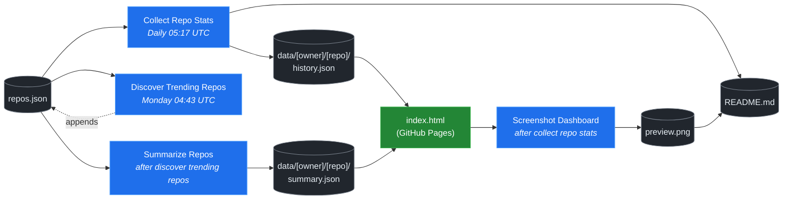

# 🚀 Rising Repos Tracker

> Automatically tracks daily GitHub stats (stars, forks, issues, velocity) for rising open source repos.

[](https://www.telosignal.com/)


**[→ View Live Dashboard](https://patrick-creates.github.io/rising-repos-tracker/)**

Built and maintained by [Telosignal](https://www.telosignal.com/).


<!-- AUTOGEN-STATS-START -->
## 📊 Current snapshot

> Auto-updated daily — last refreshed 2026-08-07

| Metric | Value |
|---|---|
| Repos tracked | **179** |
| Total stars | **8,550,000** |
| Total forks | **1,279,958** |
| Fastest growing | **ai-agent-book** (+1441.0/day) |

### 🔥 Top 5 by velocity

| # | Repo | Stars | Stars/day |
|---|---|---:|---:|
| 1 | [bojieli/ai-agent-book](https://github.com/bojieli/ai-agent-book) | 33,891 | +1441.0 |
| 2 | [DietrichGebert/ponytail](https://github.com/DietrichGebert/ponytail) | 97,626 | +1078.4 |
| 3 | [diegosouzapw/OmniRoute](https://github.com/diegosouzapw/OmniRoute) | 41,882 | +929.1 |
| 4 | [NousResearch/hermes-agent](https://github.com/NousResearch/hermes-agent) | 226,718 | +914.8 |
| 5 | [stablyai/orca](https://github.com/stablyai/orca) | 39,152 | +830.3 |

### 🆕 Recently added

- [herdrdev/herdr](https://github.com/herdrdev/herdr) — added 2026-08-03 — the runtime your coding agents live on
- [composio-community/awesome-codex-skills](https://github.com/composio-community/awesome-codex-skills) — added 2026-08-03 — A curated list of practical Codex skills for automating workflows across the Codex CLI and API.
- [NanmiCoder/cc-haha](https://github.com/NanmiCoder/cc-haha) — added 2026-08-03 — Local-first cross-platform desktop workspace for Claude Code / agents: multi-agent, Git worktrees, code diffs, skill marketplace, multi-model, Computer Use, task-aware desktop pets, with WeChat, Feishu, DingTalk, Telegram, WhatsApp and H5 access.
<!-- AUTOGEN-STATS-END -->

<!-- AUTOGEN-DIAGRAM-START -->
## 🔄 How it works


```mermaid
graph LR
    repos[("repos.json")]:::data
    history[("data/[owner]/[repo]/<br/>history.json")]:::data
    summary[("data/[owner]/[repo]/<br/>summary.json")]:::data
    readme[("README.md")]:::data
    preview[("preview.png")]:::data
    dashboard["index.html<br/>(GitHub Pages)"]:::output
    collect_yml["Collect Repo Stats<br/><i>Daily 05:17 UTC</i>"]:::workflow
    discover_yml["Discover Trending Repos<br/><i>Monday 04:43 UTC</i>"]:::workflow
    screenshot_yml["Screenshot Dashboard<br/><i>after collect repo stats</i>"]:::workflow
    summarize_yml["Summarize Repos<br/><i>after discover trending repos</i>"]:::workflow
    repos --> collect_yml
    collect_yml --> history
    collect_yml --> readme
    repos --> discover_yml
    discover_yml -.->|appends| repos
    dashboard --> screenshot_yml
    screenshot_yml --> preview
    repos --> summarize_yml
    summarize_yml --> summary
    history --> dashboard
    summary --> dashboard
    preview --> readme
    classDef workflow fill:#1f6feb,stroke:#58a6ff,color:#fff
    classDef data fill:#21262d,stroke:#7d8590,color:#e6edf3
    classDef output fill:#238636,stroke:#3fb950,color:#fff
```
<!-- AUTOGEN-DIAGRAM-END -->

<!-- AUTOGEN-WORKFLOWS-START -->
## ⚙️ Workflows

| File | Schedule | Name |
|---|---|---|
| `collect.yml` | Daily 05:17 UTC | Collect Repo Stats |
| `discover.yml` | Monday 04:43 UTC | Discover Trending Repos |
| `screenshot.yml` | After Collect Repo Stats | Screenshot Dashboard |
| `summarize.yml` | After Discover Trending Repos | Summarize Repos |

> All workflows commit results directly back to the repo. Schedules are best-effort — GitHub Actions cron can drift by a few minutes.
<!-- AUTOGEN-WORKFLOWS-END -->

<!-- AUTOGEN-REPOS-START -->
## 📋 All tracked repos

| Repo | Stars | Forks | Stars/day |
|---|---:|---:|---:|
| [openclaw/openclaw](https://github.com/openclaw/openclaw) | 385,400 | 81,016 | +162.0 |
| [obra/superpowers](https://github.com/obra/superpowers) | 268,265 | 23,969 | +710.6 |
| [affaan-m/everything-claude-code](https://github.com/affaan-m/everything-claude-code) | 238,366 | 36,202 | +666.5 |
| [affaan-m/ECC](https://github.com/affaan-m/ECC) | 238,366 | 36,202 | +623.5 |
| [NousResearch/hermes-agent](https://github.com/NousResearch/hermes-agent) | 226,718 | 44,266 | +914.8 |
| [Significant-Gravitas/AutoGPT](https://github.com/Significant-Gravitas/AutoGPT) | 186,105 | 46,055 | +21.2 |
| [microsoft/markitdown](https://github.com/microsoft/markitdown) | 172,055 | 12,538 | +570.3 |
| [f/prompts.chat](https://github.com/f/prompts.chat) | 166,827 | 21,540 | +54.1 |
| [langgenius/dify](https://github.com/langgenius/dify) | 151,632 | 23,937 | +121.0 |
| [open-webui/open-webui](https://github.com/open-webui/open-webui) | 148,096 | 21,552 | +130.3 |
| [langchain-ai/langchain](https://github.com/langchain-ai/langchain) | 143,588 | 23,925 | +80.8 |
| [github/spec-kit](https://github.com/github/spec-kit) | 125,658 | 11,218 | +323.2 |
| [farion1231/cc-switch](https://github.com/farion1231/cc-switch) | 125,241 | 8,513 | +632.1 |
| [microsoft/generative-ai-for-beginners](https://github.com/microsoft/generative-ai-for-beginners) | 116,840 | 61,754 | +70.8 |
| [nextlevelbuilder/ui-ux-pro-max-skill](https://github.com/nextlevelbuilder/ui-ux-pro-max-skill) | 114,267 | 12,233 | +423.0 |
| [Graphify-Labs/graphify](https://github.com/Graphify-Labs/graphify) | 103,635 | 10,066 | +630.6 |
| [DietrichGebert/ponytail](https://github.com/DietrichGebert/ponytail) | 97,626 | 5,363 | +1078.4 |
| [JuliusBrussee/caveman](https://github.com/JuliusBrussee/caveman) | 96,540 | 5,551 | +432.4 |
| [thedotmack/claude-mem](https://github.com/thedotmack/claude-mem) | 89,908 | 7,829 | +168.9 |
| [ruvnet/RuView](https://github.com/ruvnet/RuView) | 88,761 | 11,811 | +309.0 |
| [ChatGPTNextWeb/NextChat](https://github.com/ChatGPTNextWeb/NextChat) | 88,593 | 59,331 | +6.9 |
| [vllm-project/vllm](https://github.com/vllm-project/vllm) | 88,394 | 20,377 | +99.0 |
| [nexu-io/open-design](https://github.com/nexu-io/open-design) | 84,251 | 9,809 | +494.8 |
| [OpenHands/OpenHands](https://github.com/OpenHands/OpenHands) | 83,327 | 10,753 | +116.0 |
| [lobehub/lobehub](https://github.com/lobehub/lobehub) | 81,356 | 15,779 | +50.7 |
| [koala73/worldmonitor](https://github.com/koala73/worldmonitor) | 79,462 | 11,878 | +309.8 |
| [dair-ai/Prompt-Engineering-Guide](https://github.com/dair-ai/Prompt-Engineering-Guide) | 77,322 | 8,495 | +32.4 |
| [openai/openai-cookbook](https://github.com/openai/openai-cookbook) | 75,151 | 12,697 | +19.0 |
| [rtk-ai/rtk](https://github.com/rtk-ai/rtk) | 75,087 | 4,725 | +314.9 |
| [shareAI-lab/learn-claude-code](https://github.com/shareAI-lab/learn-claude-code) | 73,461 | 11,918 | +152.9 |
| [Leonxlnx/taste-skill](https://github.com/Leonxlnx/taste-skill) | 73,393 | 5,039 | +641.5 |
| [ComposioHQ/awesome-claude-skills](https://github.com/ComposioHQ/awesome-claude-skills) | 71,976 | 8,162 | +143.1 |
| [datawhalechina/hello-agents](https://github.com/datawhalechina/hello-agents) | 71,414 | 8,898 | +256.2 |
| [unslothai/unsloth](https://github.com/unslothai/unsloth) | 69,662 | 6,286 | +63.7 |
| [Panniantong/Agent-Reach](https://github.com/Panniantong/Agent-Reach) | 67,835 | 5,686 | +739.3 |
| [code-yeongyu/oh-my-openagent](https://github.com/code-yeongyu/oh-my-openagent) | 67,396 | 5,501 | +112.0 |
| [xtekky/gpt4free](https://github.com/xtekky/gpt4free) | 66,529 | 13,531 | +3.6 |
| [chopratejas/headroom](https://github.com/chopratejas/headroom) | 65,274 | 4,969 | +700.2 |
| [headroomlabs-ai/headroom](https://github.com/headroomlabs-ai/headroom) | 65,274 | 4,969 | +421.1 |
| [Fission-AI/OpenSpec](https://github.com/Fission-AI/OpenSpec) | 64,120 | 4,424 | +189.3 |
| [shanraisshan/claude-code-best-practice](https://github.com/shanraisshan/claude-code-best-practice) | 64,106 | 6,375 | +131.0 |
| [santifer/career-ops](https://github.com/santifer/career-ops) | 63,101 | 12,443 | +220.4 |
| [asgeirtj/system_prompts_leaks](https://github.com/asgeirtj/system_prompts_leaks) | 62,479 | 10,266 | +272.8 |
| [tw93/Pake](https://github.com/tw93/Pake) | 60,495 | 12,328 | +144.6 |
| [ZhuLinsen/daily_stock_analysis](https://github.com/ZhuLinsen/daily_stock_analysis) | 60,287 | 51,590 | +289.8 |
| [MemPalace/mempalace](https://github.com/MemPalace/mempalace) | 58,157 | 7,477 | +71.1 |
| [mvanhorn/last30days-skill](https://github.com/mvanhorn/last30days-skill) | 57,541 | 4,978 | +414.5 |
| [BerriAI/litellm](https://github.com/BerriAI/litellm) | 55,769 | 10,385 | +103.5 |
| [FlowiseAI/Flowise](https://github.com/FlowiseAI/Flowise) | 55,224 | 24,861 | +28.7 |
| [ggml-org/whisper.cpp](https://github.com/ggml-org/whisper.cpp) | 52,639 | 6,038 | +34.7 |
| [hesreallyhim/awesome-claude-code](https://github.com/hesreallyhim/awesome-claude-code) | 51,810 | 4,522 | +95.2 |
| [jamiepine/voicebox](https://github.com/jamiepine/voicebox) | 49,615 | 6,124 | +307.4 |
| [usestrix/strix](https://github.com/usestrix/strix) | 49,428 | 5,255 | +354.0 |
| [ChromeDevTools/chrome-devtools-mcp](https://github.com/ChromeDevTools/chrome-devtools-mcp) | 48,663 | 3,377 | +108.4 |
| [Aider-AI/aider](https://github.com/Aider-AI/aider) | 48,005 | 4,826 | +37.6 |
| [elder-plinius/CL4R1T4S](https://github.com/elder-plinius/CL4R1T4S) | 46,784 | 9,521 | +148.9 |
| [HKUDS/nanobot](https://github.com/HKUDS/nanobot) | 46,723 | 8,271 | +49.9 |
| [router-for-me/CLIProxyAPI](https://github.com/router-for-me/CLIProxyAPI) | 46,413 | 7,205 | +157.7 |
| [zhayujie/CowAgent](https://github.com/zhayujie/CowAgent) | 46,388 | 10,298 | +22.6 |
| [rohitg00/ai-engineering-from-scratch](https://github.com/rohitg00/ai-engineering-from-scratch) | 46,143 | 7,987 | +295.2 |
| [calesthio/OpenMontage](https://github.com/calesthio/OpenMontage) | 45,670 | 5,648 | +456.9 |
| [sickn33/antigravity-awesome-skills](https://github.com/sickn33/antigravity-awesome-skills) | 44,573 | 6,546 | +79.7 |
| [sickn33/agentic-awesome-skills](https://github.com/sickn33/agentic-awesome-skills) | 44,573 | 6,546 | +61.2 |
| [QuantumNous/new-api](https://github.com/QuantumNous/new-api) | 44,566 | 10,499 | +124.4 |
| [kepano/obsidian-skills](https://github.com/kepano/obsidian-skills) | 44,311 | 3,169 | +155.6 |
| [coreyhaines31/marketingskills](https://github.com/coreyhaines31/marketingskills) | 43,379 | 6,831 | +178.2 |
| [diegosouzapw/OmniRoute](https://github.com/diegosouzapw/OmniRoute) | 41,882 | 5,551 | +929.1 |
| [danny-avila/LibreChat](https://github.com/danny-avila/LibreChat) | 41,745 | 8,620 | +57.8 |
| [chatboxai/chatbox](https://github.com/chatboxai/chatbox) | 41,365 | 4,190 | +16.9 |
| [Imbad0202/academic-research-skills](https://github.com/Imbad0202/academic-research-skills) | 41,209 | 3,283 | +137.7 |
| [Hmbown/CodeWhale](https://github.com/Hmbown/CodeWhale) | 40,524 | 3,507 | +79.1 |
| [chatanywhere/GPT_API_free](https://github.com/chatanywhere/GPT_API_free) | 39,884 | 2,680 | +23.4 |
| [heygen-com/hyperframes](https://github.com/heygen-com/hyperframes) | 39,830 | 3,776 | +237.8 |
| [mindsdb/mindshub](https://github.com/mindsdb/mindshub) | 39,525 | 6,224 | +5.0 |
| [stablyai/orca](https://github.com/stablyai/orca) | 39,152 | 2,756 | +830.3 |
| [langchain-ai/langgraph](https://github.com/langchain-ai/langgraph) | 39,078 | 6,579 | +79.5 |
| [AstrBotDevs/AstrBot](https://github.com/AstrBotDevs/AstrBot) | 38,750 | 2,778 | +77.0 |
| [wshobson/agents](https://github.com/wshobson/agents) | 38,572 | 4,119 | +35.6 |
| [Yeachan-Heo/oh-my-claudecode](https://github.com/Yeachan-Heo/oh-my-claudecode) | 38,402 | 3,457 | +48.4 |
| [google/langextract](https://github.com/google/langextract) | 37,988 | 2,648 | +19.4 |
| [DeusData/codebase-memory-mcp](https://github.com/DeusData/codebase-memory-mcp) | 37,906 | 3,022 | +443.0 |
| [github/awesome-copilot](https://github.com/github/awesome-copilot) | 37,536 | 4,725 | +50.4 |
| [songquanpeng/one-api](https://github.com/songquanpeng/one-api) | 36,246 | 6,785 | +27.5 |
| [PDFMathTranslate/PDFMathTranslate](https://github.com/PDFMathTranslate/PDFMathTranslate) | 35,998 | 3,215 | +26.8 |
| [agentscope-ai/QwenPaw](https://github.com/agentscope-ai/QwenPaw) | 34,302 | 2,952 | +311.8 |
| [bojieli/ai-agent-book](https://github.com/bojieli/ai-agent-book) | 33,891 | 3,649 | +1441.0 |
| [anthropics/claude-plugins-official](https://github.com/anthropics/claude-plugins-official) | 33,217 | 3,755 | +62.8 |
| [esengine/DeepSeek-Reasonix](https://github.com/esengine/DeepSeek-Reasonix) | 32,624 | 2,104 | +218.3 |
| [zeroclaw-labs/zeroclaw](https://github.com/zeroclaw-labs/zeroclaw) | 32,525 | 4,878 | +12.7 |
| [iOfficeAI/AionUi](https://github.com/iOfficeAI/AionUi) | 31,627 | 3,216 | +63.9 |
| [AlexsJones/llmfit](https://github.com/AlexsJones/llmfit) | 31,211 | 1,914 | +62.8 |
| [JCodesMore/ai-website-cloner-template](https://github.com/JCodesMore/ai-website-cloner-template) | 31,134 | 4,487 | +266.8 |
| [MadsLorentzen/ai-job-search](https://github.com/MadsLorentzen/ai-job-search) | 30,589 | 10,403 | +360.2 |
| [Gitlawb/openclaude](https://github.com/Gitlawb/openclaude) | 30,548 | 8,900 | +36.0 |
| [googleworkspace/cli](https://github.com/googleworkspace/cli) | 30,247 | 1,770 | +52.7 |
| [HKUDS/Vibe-Trading](https://github.com/HKUDS/Vibe-Trading) | 30,100 | 4,851 | +393.9 |
| [tirth8205/code-review-graph](https://github.com/tirth8205/code-review-graph) | 29,147 | 2,688 | +200.6 |
| [voideditor/void](https://github.com/voideditor/void) | 28,862 | 2,606 | +0.9 |
| [alibaba/page-agent](https://github.com/alibaba/page-agent) | 28,485 | 2,517 | +187.3 |
| [volcengine/OpenViking](https://github.com/volcengine/OpenViking) | 28,030 | 2,204 | +45.0 |
| [jackwener/OpenCLI](https://github.com/jackwener/OpenCLI) | 27,839 | 2,739 | +67.3 |
| [BloopAI/vibe-kanban](https://github.com/BloopAI/vibe-kanban) | 27,692 | 2,944 | +14.7 |
| [langchain-ai/deepagents](https://github.com/langchain-ai/deepagents) | 27,454 | 3,835 | +55.0 |
| [mukul975/Anthropic-Cybersecurity-Skills](https://github.com/mukul975/Anthropic-Cybersecurity-Skills) | 27,415 | 3,317 | +202.0 |
| [jarrodwatts/claude-hud](https://github.com/jarrodwatts/claude-hud) | 27,197 | 1,265 | +41.8 |
| [p-e-w/heretic](https://github.com/p-e-w/heretic) | 27,173 | 2,940 | +53.4 |
| [rohitg00/agentmemory](https://github.com/rohitg00/agentmemory) | 26,665 | 2,264 | +80.7 |
| [iOfficeAI/OfficeCLI](https://github.com/iOfficeAI/OfficeCLI) | 26,274 | 1,770 | +558.7 |
| [zai-org/Open-AutoGLM](https://github.com/zai-org/Open-AutoGLM) | 25,958 | 4,019 | +8.3 |
| [manaflow-ai/cmux](https://github.com/manaflow-ai/cmux) | 25,708 | 2,161 | +54.1 |
| [ogulcancelik/herdr](https://github.com/ogulcancelik/herdr) | 25,273 | 1,778 | +402.4 |
| [herdrdev/herdr](https://github.com/herdrdev/herdr) | 25,273 | 1,778 | +371.0 |
| [toon-format/toon](https://github.com/toon-format/toon) | 25,100 | 1,113 | +10.1 |
| [decolua/9router](https://github.com/decolua/9router) | 24,848 | 4,392 | +137.3 |
| [can1357/oh-my-pi](https://github.com/can1357/oh-my-pi) | 22,567 | 2,138 | +186.3 |
| [winfunc/opcode](https://github.com/winfunc/opcode) | 22,360 | 1,724 | +5.9 |
| [coze-dev/coze-studio](https://github.com/coze-dev/coze-studio) | 21,382 | 3,108 | +7.2 |
| [NirDiamant/agents-towards-production](https://github.com/NirDiamant/agents-towards-production) | 21,252 | 2,818 | +10.3 |
| [steipete/CodexBar](https://github.com/steipete/CodexBar) | 19,747 | 1,658 | +98.8 |
| [mksglu/context-mode](https://github.com/mksglu/context-mode) | 19,679 | 1,413 | +41.7 |
| [Tencent/WeKnora](https://github.com/Tencent/WeKnora) | 19,486 | 2,783 | +60.3 |
| [alibaba/open-code-review](https://github.com/alibaba/open-code-review) | 19,424 | 1,343 | +294.9 |
| [KKKKhazix/khazix-skills](https://github.com/KKKKhazix/khazix-skills) | 19,327 | 2,120 | +103.8 |
| [pranshuparmar/witr](https://github.com/pranshuparmar/witr) | 19,284 | 625 | +32.1 |
| [tanweai/pua](https://github.com/tanweai/pua) | 19,273 | 1,174 | +19.4 |
| [jnMetaCode/agency-agents-zh](https://github.com/jnMetaCode/agency-agents-zh) | 18,929 | 3,112 | +76.6 |
| [datawhalechina/easy-vibe](https://github.com/datawhalechina/easy-vibe) | 18,788 | 1,787 | +34.8 |
| [jundot/omlx](https://github.com/jundot/omlx) | 18,500 | 1,597 | +35.2 |
| [RightNow-AI/openfang](https://github.com/RightNow-AI/openfang) | 18,081 | 2,283 | +4.8 |
| [microsoft/agent-lightning](https://github.com/microsoft/agent-lightning) | 17,459 | 1,529 | +2.8 |
| [danielmiessler/LifeOS](https://github.com/danielmiessler/LifeOS) | 17,193 | 2,325 | +24.5 |
| [nesquena/hermes-webui](https://github.com/nesquena/hermes-webui) | 17,053 | 2,331 | +48.2 |
| [TencentCloud/TencentDB-Agent-Memory](https://github.com/TencentCloud/TencentDB-Agent-Memory) | 16,740 | 1,506 | +320.9 |
| [browser-use/browser-harness](https://github.com/browser-use/browser-harness) | 16,544 | 1,569 | +27.3 |
| [cft0808/edict](https://github.com/cft0808/edict) | 16,335 | 1,710 | +5.2 |
| [1jehuang/jcode](https://github.com/1jehuang/jcode) | 16,245 | 1,825 | +317.6 |
| [MemoriLabs/Memori](https://github.com/MemoriLabs/Memori) | 15,683 | 2,880 | +7.4 |
| [composio-community/awesome-codex-skills](https://github.com/composio-community/awesome-codex-skills) | 15,661 | 1,517 | +24.0 |
| [Anionex/banana-slides](https://github.com/Anionex/banana-slides) | 15,413 | 1,777 | +7.3 |
| [xbtlin/ai-berkshire](https://github.com/xbtlin/ai-berkshire) | 15,139 | 2,239 | +136.3 |
| [xpzouying/xiaohongshu-mcp](https://github.com/xpzouying/xiaohongshu-mcp) | 15,113 | 2,228 | +18.0 |
| [kyegomez/OpenMythos](https://github.com/kyegomez/OpenMythos) | 14,784 | 3,294 | +13.7 |
| [yusufkaraaslan/Skill_Seekers](https://github.com/yusufkaraaslan/Skill_Seekers) | 14,717 | 1,498 | +10.7 |
| [wanshuiyin/Auto-claude-code-research-in-sleep](https://github.com/wanshuiyin/Auto-claude-code-research-in-sleep) | 14,350 | 1,273 | +40.4 |
| [NevaMind-AI/memU](https://github.com/NevaMind-AI/memU) | 14,267 | 1,055 | +8.0 |
| [NanmiCoder/cc-haha](https://github.com/NanmiCoder/cc-haha) | 13,963 | 8,532 | +21.8 |
| [t8y2/dbx](https://github.com/t8y2/dbx) | 13,566 | 1,386 | +157.2 |
| [superset-sh/superset](https://github.com/superset-sh/superset) | 12,800 | 1,163 | +16.4 |
| [XiaomiMiMo/MiMo-Code](https://github.com/XiaomiMiMo/MiMo-Code) | 12,669 | 1,293 | +42.2 |
| [sirmalloc/ccstatusline](https://github.com/sirmalloc/ccstatusline) | 12,264 | 537 | +25.2 |
| [EverMind-AI/EverOS](https://github.com/EverMind-AI/EverOS) | 11,854 | 883 | +54.8 |
| [walkinglabs/learn-harness-engineering](https://github.com/walkinglabs/learn-harness-engineering) | 11,060 | 1,199 | +36.7 |
| [ValueCell-ai/valuecell](https://github.com/ValueCell-ai/valuecell) | 10,961 | 1,813 | +2.3 |
| [aden-hive/hive](https://github.com/aden-hive/hive) | 10,878 | 5,672 | +6.8 |
| [0x4m4/hexstrike-ai](https://github.com/0x4m4/hexstrike-ai) | 10,851 | 2,271 | +21.6 |
| [MemTensor/MemOS](https://github.com/MemTensor/MemOS) | 10,636 | 982 | +15.6 |
| [brokermr810/QuantDinger](https://github.com/brokermr810/QuantDinger) | 10,334 | 2,166 | +32.8 |
| [OpenByteInc/QuantDinger](https://github.com/OpenByteInc/QuantDinger) | 10,334 | 2,166 | +29.6 |
| [Kuberwastaken/claurst](https://github.com/Kuberwastaken/claurst) | 10,184 | 7,781 | +8.2 |
| [ConardLi/garden-skills](https://github.com/ConardLi/garden-skills) | 10,120 | 1,338 | +29.3 |
| [EKKOLearnAI/hermes-studio](https://github.com/EKKOLearnAI/hermes-studio) | 9,820 | 1,206 | +30.0 |
| [frankbria/ralph-claude-code](https://github.com/frankbria/ralph-claude-code) | 9,584 | 724 | +5.5 |
| [ykdojo/claude-code-tips](https://github.com/ykdojo/claude-code-tips) | 9,560 | 760 | +17.0 |
| [StarTrail-org/PixelRAG](https://github.com/StarTrail-org/PixelRAG) | 9,303 | 791 | +108.7 |
| [iflytek/astron-agent](https://github.com/iflytek/astron-agent) | 9,248 | 873 | +19.9 |
| [getagentseal/codeburn](https://github.com/getagentseal/codeburn) | 9,176 | 720 | +22.0 |
| [openai/codex-security](https://github.com/openai/codex-security) | 9,164 | 630 | +220.5 |
| [EvoMap/evolver](https://github.com/EvoMap/evolver) | 8,944 | 829 | +2.8 |
| [MiroMindAI/MiroThinker](https://github.com/MiroMindAI/MiroThinker) | 8,367 | 645 | +1.3 |
| [modem-dev/hunk](https://github.com/modem-dev/hunk) | 8,146 | 237 | +57.6 |
| [mmulet/term.everything](https://github.com/mmulet/term.everything) | 8,059 | 192 | +1.1 |
| [ValueCell-ai/ClawX](https://github.com/ValueCell-ai/ClawX) | 7,574 | 1,132 | +1.3 |
| [opensquilla/opensquilla](https://github.com/opensquilla/opensquilla) | 6,568 | 508 | +19.9 |
| [steipete/summarize](https://github.com/steipete/summarize) | 6,527 | 440 | +4.7 |
| [Arthur-Ficial/apfel](https://github.com/Arthur-Ficial/apfel) | 6,258 | 239 | +5.7 |
| [Andyyyy64/whichllm](https://github.com/Andyyyy64/whichllm) | 6,156 | 326 | +16.1 |
| [microsoft/fara](https://github.com/microsoft/fara) | 6,128 | 599 | +5.2 |
| [UfoMiao/zcf](https://github.com/UfoMiao/zcf) | 6,075 | 425 | +0.2 |
| [re4/LibreCode](https://github.com/re4/LibreCode) | 81 | 4 | — |
<!-- AUTOGEN-REPOS-END -->

---

## What it does

- Collects daily snapshots of stars, forks, watchers and open issues for every tracked repo
- Discovers new trending repos automatically every Monday using the GitHub Search API
- Generates AI summaries (use cases, similar tools, tags) for each tracked repo via GitHub Models
- Stores all history as plain JSON — no database, no backend
- Renders a live dashboard via GitHub Pages — updates daily, zero maintenance

## Tracked repos

Data lives in [`data/`](./data) — one folder per repo, one `history.json` per entry.  
The full watch list is in [`repos.json`](./repos.json).

## Fork & use it for yourself

This is my personal tracker — the watch list reflects what I find interesting. If you want to track different repos, the best path is to **fork this repo and run your own**.

### Setup

1. Fork this repo to your account
2. Replace the contents of [`repos.json`](./repos.json) with the repos you want to track (or just leave one entry — `discover.yml` will auto-add more every Monday)
3. Go to **Settings → Pages** and enable GitHub Pages from the `main` branch
4. Go to **Actions** and run **Collect Repo Stats** once manually to seed your first data point
5. Your dashboard will be live at `https://YOUR-USERNAME.github.io/rising-repos-tracker/`

That's it — daily collection and weekly discovery run automatically on schedule. Zero ongoing maintenance.

### Customizing what gets discovered

Edit [`scripts/discover.js`](./scripts/discover.js) to change:

- `MIN_STARS` — minimum star threshold for candidates
- `MAX_AGE_DAYS` — how recent a repo must be
- `MAX_NEW_REPOS` — how many to add per discovery run
- The `queries` array — GitHub Search API queries that define what "trending" means to you

### Adding a repo manually

Just edit `repos.json` directly:

```json
{
  "owner": "OWNER",
  "repo": "REPO",
  "added": "YYYY-MM-DD",
  "notes": "why you're tracking this"
}
```

The next daily collect run picks it up automatically.

## Stack

- **GitHub Actions** — scheduling and automation
- **GitHub Pages** — dashboard hosting
- **GitHub API** — data source
- **GitHub Models** — free AI summaries (gpt-4o-mini)
- **Chart.js** — star growth visualization
- **Mermaid** — architecture diagram (rendered by GitHub)
- No dependencies, no build step, no database

## License

MIT
