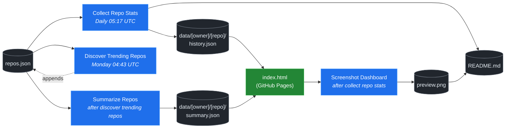

# 🚀 Rising Repos Tracker

> Automatically tracks daily GitHub stats (stars, forks, issues, velocity) for rising open source repos.

[](https://www.telosignal.com/)


**[→ View Live Dashboard](https://patrick-creates.github.io/rising-repos-tracker/)**

Built and maintained by [Telosignal](https://www.telosignal.com/).


<!-- AUTOGEN-STATS-START -->
## 📊 Current snapshot

> Auto-updated daily — last refreshed 2026-09-23

| Metric | Value |
|---|---|
| Repos tracked | **201** |
| Total stars | **9,896,999** |
| Total forks | **1,443,597** |
| Fastest growing | **ponytail** (+1039.3/day) |

### 🔥 Top 5 by velocity

| # | Repo | Stars | Stars/day |
|---|---|---:|---:|
| 1 | [DietrichGebert/ponytail](https://github.com/DietrichGebert/ponytail) | 144,676 | +1039.3 |
| 2 | [debpalash/VoiceStudio](https://github.com/debpalash/VoiceStudio) | 34,660 | +902.6 |
| 3 | [stablyai/orca](https://github.com/stablyai/orca) | 76,082 | +803.8 |
| 4 | [NousResearch/hermes-agent](https://github.com/NousResearch/hermes-agent) | 248,234 | +753.3 |
| 5 | [diegosouzapw/OmniRoute](https://github.com/diegosouzapw/OmniRoute) | 69,423 | +724.9 |

### 🆕 Recently added

- [genspark-ai/genoffice](https://github.com/genspark-ai/genoffice) — added 2026-09-21 — Free, open-source AI Office suite: Docs, Sheets, Slides, PDF, Markdown and HTML editors with a built-in AI agent, plus a `genoffice` CLI and agent skill so Claude Code, Codex and Cursor can create and edit real .docx/.xlsx/.pptx files locally. Bring your own key. macOS, Windows & Linux.
- [tech-leads-club/agent-skills](https://github.com/tech-leads-club/agent-skills) — added 2026-09-21 — The secure, validated skill registry for professional AI coding agents. Extend Antigravity, Claude Code, Cursor, Copilot and more with absolute confidence.
- [every-app/open-seo](https://github.com/every-app/open-seo) — added 2026-09-14 — Open source alternative to Semrush and Ahrefs
<!-- AUTOGEN-STATS-END -->

<!-- AUTOGEN-DIAGRAM-START -->
## 🔄 How it works


```mermaid
graph LR
    repos[("repos.json")]:::data
    history[("data/[owner]/[repo]/<br/>history.json")]:::data
    summary[("data/[owner]/[repo]/<br/>summary.json")]:::data
    readme[("README.md")]:::data
    preview[("preview.png")]:::data
    dashboard["index.html<br/>(GitHub Pages)"]:::output
    collect_yml["Collect Repo Stats<br/><i>Daily 05:17 UTC</i>"]:::workflow
    discover_yml["Discover Trending Repos<br/><i>Monday 04:43 UTC</i>"]:::workflow
    screenshot_yml["Screenshot Dashboard<br/><i>after collect repo stats</i>"]:::workflow
    summarize_yml["Summarize Repos<br/><i>after discover trending repos</i>"]:::workflow
    repos --> collect_yml
    collect_yml --> history
    collect_yml --> readme
    repos --> discover_yml
    discover_yml -.->|appends| repos
    dashboard --> screenshot_yml
    screenshot_yml --> preview
    repos --> summarize_yml
    summarize_yml --> summary
    history --> dashboard
    summary --> dashboard
    preview --> readme
    classDef workflow fill:#1f6feb,stroke:#58a6ff,color:#fff
    classDef data fill:#21262d,stroke:#7d8590,color:#e6edf3
    classDef output fill:#238636,stroke:#3fb950,color:#fff
```
<!-- AUTOGEN-DIAGRAM-END -->

<!-- AUTOGEN-WORKFLOWS-START -->
## ⚙️ Workflows

| File | Schedule | Name |
|---|---|---|
| `collect.yml` | Daily 05:17 UTC | Collect Repo Stats |
| `discover.yml` | Monday 04:43 UTC | Discover Trending Repos |
| `screenshot.yml` | After Collect Repo Stats | Screenshot Dashboard |
| `summarize.yml` | After Discover Trending Repos | Summarize Repos |

> All workflows commit results directly back to the repo. Schedules are best-effort — GitHub Actions cron can drift by a few minutes.
<!-- AUTOGEN-WORKFLOWS-END -->

<!-- AUTOGEN-REPOS-START -->
## 📋 All tracked repos

| Repo | Stars | Forks | Stars/day |
|---|---:|---:|---:|
| [openclaw/openclaw](https://github.com/openclaw/openclaw) | 390,309 | 82,104 | +141.6 |
| [obra/superpowers](https://github.com/obra/superpowers) | 290,391 | 25,982 | +589.4 |
| [affaan-m/everything-claude-code](https://github.com/affaan-m/everything-claude-code) | 265,760 | 39,717 | +636.9 |
| [affaan-m/ECC](https://github.com/affaan-m/ECC) | 265,760 | 39,717 | +607.7 |
| [NousResearch/hermes-agent](https://github.com/NousResearch/hermes-agent) | 248,234 | 52,418 | +753.3 |
| [Significant-Gravitas/AutoGPT](https://github.com/Significant-Gravitas/AutoGPT) | 187,505 | 45,998 | +24.2 |
| [microsoft/markitdown](https://github.com/microsoft/markitdown) | 186,544 | 13,749 | +477.7 |
| [f/prompts.chat](https://github.com/f/prompts.chat) | 171,073 | 21,980 | +66.9 |
| [langgenius/dify](https://github.com/langgenius/dify) | 156,943 | 24,744 | +118.2 |
| [open-webui/open-webui](https://github.com/open-webui/open-webui) | 152,887 | 22,369 | +120.3 |
| [langchain-ai/langchain](https://github.com/langchain-ai/langchain) | 146,917 | 24,574 | +77.3 |
| [DietrichGebert/ponytail](https://github.com/DietrichGebert/ponytail) | 144,676 | 7,750 | +1039.3 |
| [github/spec-kit](https://github.com/github/spec-kit) | 138,484 | 12,408 | +305.4 |
| [farion1231/cc-switch](https://github.com/farion1231/cc-switch) | 135,278 | 9,282 | +478.4 |
| [nextlevelbuilder/ui-ux-pro-max-skill](https://github.com/nextlevelbuilder/ui-ux-pro-max-skill) | 130,003 | 13,831 | +391.8 |
| [Graphify-Labs/graphify](https://github.com/Graphify-Labs/graphify) | 120,701 | 11,649 | +413.8 |
| [microsoft/generative-ai-for-beginners](https://github.com/microsoft/generative-ai-for-beginners) | 120,346 | 63,348 | +72.1 |
| [JuliusBrussee/caveman](https://github.com/JuliusBrussee/caveman) | 107,452 | 6,223 | +358.9 |
| [nexu-io/open-design](https://github.com/nexu-io/open-design) | 97,733 | 11,339 | +418.4 |
| [ruvnet/RuView](https://github.com/ruvnet/RuView) | 94,806 | 12,547 | +239.0 |
| [thedotmack/claude-mem](https://github.com/thedotmack/claude-mem) | 94,520 | 8,360 | +143.9 |
| [vllm-project/vllm](https://github.com/vllm-project/vllm) | 92,494 | 22,562 | +94.8 |
| [Leonxlnx/taste-skill](https://github.com/Leonxlnx/taste-skill) | 89,445 | 6,082 | +517.8 |
| [OpenHands/OpenHands](https://github.com/OpenHands/OpenHands) | 88,948 | 11,704 | +117.3 |
| [ChatGPTNextWeb/NextChat](https://github.com/ChatGPTNextWeb/NextChat) | 88,806 | 59,000 | +6.0 |
| [koala73/worldmonitor](https://github.com/koala73/worldmonitor) | 87,255 | 13,287 | +256.9 |
| [Panniantong/Agent-Reach](https://github.com/Panniantong/Agent-Reach) | 84,993 | 7,462 | +574.9 |
| [lobehub/lobehub](https://github.com/lobehub/lobehub) | 82,779 | 15,911 | +43.5 |
| [rtk-ai/rtk](https://github.com/rtk-ai/rtk) | 81,500 | 5,159 | +249.4 |
| [datawhalechina/hello-agents](https://github.com/datawhalechina/hello-agents) | 80,586 | 10,022 | +233.8 |
| [dair-ai/Prompt-Engineering-Guide](https://github.com/dair-ai/Prompt-Engineering-Guide) | 78,567 | 8,637 | +30.2 |
| [shareAI-lab/learn-claude-code](https://github.com/shareAI-lab/learn-claude-code) | 77,490 | 12,466 | +128.2 |
| [unslothai/unsloth](https://github.com/unslothai/unsloth) | 76,611 | 7,012 | +94.6 |
| [openai/openai-cookbook](https://github.com/openai/openai-cookbook) | 76,136 | 12,886 | +19.7 |
| [stablyai/orca](https://github.com/stablyai/orca) | 76,082 | 4,991 | +803.8 |
| [ComposioHQ/awesome-claude-skills](https://github.com/ComposioHQ/awesome-claude-skills) | 75,518 | 8,757 | +118.2 |
| [chopratejas/headroom](https://github.com/chopratejas/headroom) | 73,577 | 5,679 | +454.1 |
| [headroomlabs-ai/headroom](https://github.com/headroomlabs-ai/headroom) | 73,577 | 5,679 | +297.6 |
| [santifer/career-ops](https://github.com/santifer/career-ops) | 72,467 | 13,630 | +212.7 |
| [career-ops-hq/career-ops](https://github.com/career-ops-hq/career-ops) | 72,467 | 13,630 | +130.3 |
| [Fission-AI/OpenSpec](https://github.com/Fission-AI/OpenSpec) | 69,930 | 4,785 | +165.2 |
| [diegosouzapw/OmniRoute](https://github.com/diegosouzapw/OmniRoute) | 69,423 | 9,843 | +724.9 |
| [code-yeongyu/oh-my-openagent](https://github.com/code-yeongyu/oh-my-openagent) | 69,315 | 5,715 | +85.8 |
| [asgeirtj/system_prompts_leaks](https://github.com/asgeirtj/system_prompts_leaks) | 68,116 | 11,060 | +216.6 |
| [xtekky/gpt4free](https://github.com/xtekky/gpt4free) | 66,719 | 13,500 | +3.7 |
| [shanraisshan/claude-code-best-practice](https://github.com/shanraisshan/claude-code-best-practice) | 66,260 | 6,585 | +99.7 |
| [ZhuLinsen/daily_stock_analysis](https://github.com/ZhuLinsen/daily_stock_analysis) | 65,523 | 54,765 | +220.5 |
| [usestrix/strix](https://github.com/usestrix/strix) | 64,274 | 7,031 | +338.3 |
| [mvanhorn/last30days-skill](https://github.com/mvanhorn/last30days-skill) | 62,690 | 5,453 | +280.6 |
| [tw93/Pake](https://github.com/tw93/Pake) | 61,647 | 12,700 | +100.5 |
| [calesthio/OpenMontage](https://github.com/calesthio/OpenMontage) | 60,976 | 7,753 | +385.2 |
| [BerriAI/litellm](https://github.com/BerriAI/litellm) | 59,457 | 11,695 | +94.3 |
| [MemPalace/mempalace](https://github.com/MemPalace/mempalace) | 59,241 | 7,565 | +53.4 |
| [rohitg00/ai-engineering-from-scratch](https://github.com/rohitg00/ai-engineering-from-scratch) | 55,529 | 9,786 | +255.8 |
| [jamiepine/voicebox](https://github.com/jamiepine/voicebox) | 55,497 | 6,922 | +232.2 |
| [FlowiseAI/Flowise](https://github.com/FlowiseAI/Flowise) | 55,476 | 25,045 | +20.1 |
| [hesreallyhim/awesome-claude-code](https://github.com/hesreallyhim/awesome-claude-code) | 54,473 | 4,750 | +81.1 |
| [ggml-org/whisper.cpp](https://github.com/ggml-org/whisper.cpp) | 53,870 | 6,189 | +31.6 |
| [router-for-me/CLIProxyAPI](https://github.com/router-for-me/CLIProxyAPI) | 52,963 | 8,000 | +150.6 |
| [heygen-com/hyperframes](https://github.com/heygen-com/hyperframes) | 52,513 | 4,793 | +251.9 |
| [ChromeDevTools/chrome-devtools-mcp](https://github.com/ChromeDevTools/chrome-devtools-mcp) | 52,507 | 4,401 | +98.6 |
| [coreyhaines31/marketingskills](https://github.com/coreyhaines31/marketingskills) | 51,263 | 7,750 | +173.9 |
| [elder-plinius/CL4R1T4S](https://github.com/elder-plinius/CL4R1T4S) | 50,415 | 10,351 | +115.2 |
| [bojieli/ai-agent-book](https://github.com/bojieli/ai-agent-book) | 50,269 | 5,632 | +651.0 |
| [Imbad0202/academic-research-skills](https://github.com/Imbad0202/academic-research-skills) | 49,241 | 3,819 | +164.6 |
| [Aider-AI/aider](https://github.com/Aider-AI/aider) | 49,127 | 4,985 | +32.5 |
| [kepano/obsidian-skills](https://github.com/kepano/obsidian-skills) | 48,782 | 3,477 | +130.7 |
| [QuantumNous/new-api](https://github.com/QuantumNous/new-api) | 48,756 | 11,710 | +110.7 |
| [HKUDS/nanobot](https://github.com/HKUDS/nanobot) | 48,502 | 8,573 | +45.5 |
| [zhayujie/CowAgent](https://github.com/zhayujie/CowAgent) | 47,090 | 10,371 | +19.8 |
| [sickn33/antigravity-awesome-skills](https://github.com/sickn33/antigravity-awesome-skills) | 46,812 | 6,817 | +67.2 |
| [sickn33/agentic-awesome-skills](https://github.com/sickn33/agentic-awesome-skills) | 46,812 | 6,817 | +52.4 |
| [K-Dense-AI/scientific-agent-skills](https://github.com/K-Dense-AI/scientific-agent-skills) | 46,224 | 4,188 | +171.8 |
| [danny-avila/LibreChat](https://github.com/danny-avila/LibreChat) | 44,736 | 9,180 | +60.1 |
| [DeusData/codebase-memory-mcp](https://github.com/DeusData/codebase-memory-mcp) | 44,259 | 3,620 | +274.8 |
| [MadsLorentzen/ai-job-search](https://github.com/MadsLorentzen/ai-job-search) | 43,706 | 15,031 | +307.3 |
| [chatanywhere/GPT_API_free](https://github.com/chatanywhere/GPT_API_free) | 43,093 | 2,730 | +40.8 |
| [langchain-ai/langgraph](https://github.com/langchain-ai/langgraph) | 42,171 | 7,133 | +72.6 |
| [chatboxai/chatbox](https://github.com/chatboxai/chatbox) | 41,838 | 4,257 | +14.4 |
| [Hmbown/CodeWhale](https://github.com/Hmbown/CodeWhale) | 41,028 | 3,565 | +52.5 |
| [Hmbown/Codewhale](https://github.com/Hmbown/Codewhale) | 41,028 | 3,565 | +7.0 |
| [AstrBotDevs/AstrBot](https://github.com/AstrBotDevs/AstrBot) | 40,894 | 2,965 | +64.1 |
| [ogulcancelik/herdr](https://github.com/ogulcancelik/herdr) | 40,332 | 3,061 | +353.6 |
| [herdrdev/herdr](https://github.com/herdrdev/herdr) | 40,332 | 3,061 | +324.4 |
| [tinyhumansai/openhuman](https://github.com/tinyhumansai/openhuman) | 40,053 | 3,953 | +35.3 |
| [alibaba/open-code-review](https://github.com/alibaba/open-code-review) | 39,997 | 2,873 | +379.9 |
| [wshobson/agents](https://github.com/wshobson/agents) | 39,898 | 4,249 | +32.7 |
| [mindsdb/mindshub](https://github.com/mindsdb/mindshub) | 39,763 | 6,245 | +5.0 |
| [Yeachan-Heo/oh-my-claudecode](https://github.com/Yeachan-Heo/oh-my-claudecode) | 39,309 | 3,511 | +37.1 |
| [github/awesome-copilot](https://github.com/github/awesome-copilot) | 39,300 | 5,001 | +45.4 |
| [google/langextract](https://github.com/google/langextract) | 38,652 | 2,706 | +17.3 |
| [volcengine/OpenViking](https://github.com/volcengine/OpenViking) | 38,518 | 3,000 | +123.3 |
| [PDFMathTranslate/PDFMathTranslate](https://github.com/PDFMathTranslate/PDFMathTranslate) | 37,158 | 3,333 | +26.0 |
| [AlexsJones/llmfit](https://github.com/AlexsJones/llmfit) | 37,053 | 2,361 | +88.2 |
| [songquanpeng/one-api](https://github.com/songquanpeng/one-api) | 36,999 | 6,866 | +23.0 |
| [anthropics/claude-plugins-official](https://github.com/anthropics/claude-plugins-official) | 36,644 | 4,126 | +67.0 |
| [esengine/DeepSeek-Reasonix](https://github.com/esengine/DeepSeek-Reasonix) | 35,688 | 2,417 | +151.0 |
| [agentscope-ai/QwenPaw](https://github.com/agentscope-ai/QwenPaw) | 35,230 | 3,123 | +174.5 |
| [JCodesMore/ai-website-cloner-template](https://github.com/JCodesMore/ai-website-cloner-template) | 34,816 | 5,071 | +178.2 |
| [debpalash/VoiceStudio](https://github.com/debpalash/VoiceStudio) | 34,660 | 4,097 | +902.6 |
| [HKUDS/Vibe-Trading](https://github.com/HKUDS/Vibe-Trading) | 33,869 | 5,521 | +222.5 |
| [Gitlawb/openclaude](https://github.com/Gitlawb/openclaude) | 33,495 | 9,102 | +47.0 |
| [mukul975/Anthropic-Cybersecurity-Skills](https://github.com/mukul975/Anthropic-Cybersecurity-Skills) | 33,242 | 4,040 | +162.6 |
| [iOfficeAI/AionUi](https://github.com/iOfficeAI/AionUi) | 33,056 | 3,429 | +50.1 |
| [can1357/oh-my-pi](https://github.com/can1357/oh-my-pi) | 32,902 | 3,474 | +203.3 |
| [zeroclaw-labs/zeroclaw](https://github.com/zeroclaw-labs/zeroclaw) | 32,869 | 4,951 | +10.5 |
| [p-e-w/heretic](https://github.com/p-e-w/heretic) | 32,221 | 3,625 | +77.1 |
| [virgiliojr94/book-to-skill](https://github.com/virgiliojr94/book-to-skill) | 32,071 | 3,328 | +241.4 |
| [tirth8205/code-review-graph](https://github.com/tirth8205/code-review-graph) | 31,729 | 2,905 | +132.2 |
| [googleworkspace/cli](https://github.com/googleworkspace/cli) | 31,116 | 1,848 | +38.6 |
| [iOfficeAI/OfficeCLI](https://github.com/iOfficeAI/OfficeCLI) | 31,097 | 2,122 | +287.3 |
| [langchain-ai/deepagents](https://github.com/langchain-ai/deepagents) | 29,683 | 4,170 | +51.7 |
| [decolua/9router](https://github.com/decolua/9router) | 29,644 | 5,564 | +120.7 |
| [jackwener/OpenCLI](https://github.com/jackwener/OpenCLI) | 29,577 | 2,890 | +54.0 |
| [Tencent/WeKnora](https://github.com/Tencent/WeKnora) | 29,190 | 3,928 | +129.0 |
| [alibaba/page-agent](https://github.com/alibaba/page-agent) | 29,176 | 2,620 | +106.2 |
| [voideditor/void](https://github.com/voideditor/void) | 28,796 | 2,653 | — |
| [rohitg00/agentmemory](https://github.com/rohitg00/agentmemory) | 28,742 | 2,498 | +64.6 |
| [BloopAI/vibe-kanban](https://github.com/BloopAI/vibe-kanban) | 28,171 | 3,019 | +12.8 |
| [jarrodwatts/claude-hud](https://github.com/jarrodwatts/claude-hud) | 28,125 | 1,299 | +32.1 |
| [manaflow-ai/cmux](https://github.com/manaflow-ai/cmux) | 27,347 | 2,393 | +41.5 |
| [TencentCloud/TencentDB-Agent-Memory](https://github.com/TencentCloud/TencentDB-Agent-Memory) | 27,193 | 2,607 | +256.6 |
| [zai-org/Open-AutoGLM](https://github.com/zai-org/Open-AutoGLM) | 26,287 | 4,039 | +7.7 |
| [toon-format/toon](https://github.com/toon-format/toon) | 25,416 | 1,125 | +8.6 |
| [pascalorg/editor](https://github.com/pascalorg/editor) | 24,264 | 3,014 | +68.5 |
| [mksglu/context-mode](https://github.com/mksglu/context-mode) | 23,975 | 1,729 | +65.1 |
| [guillaumemeyer/watermarks-remover](https://github.com/guillaumemeyer/watermarks-remover) | 22,642 | 2,615 | +169.7 |
| [pranshuparmar/witr](https://github.com/pranshuparmar/witr) | 22,471 | 786 | +51.6 |
| [winfunc/opcode](https://github.com/winfunc/opcode) | 22,403 | 1,724 | +3.7 |
| [jundot/omlx](https://github.com/jundot/omlx) | 22,111 | 1,917 | +54.8 |
| [steipete/CodexBar](https://github.com/steipete/CodexBar) | 21,780 | 1,988 | +70.7 |
| [coze-dev/coze-studio](https://github.com/coze-dev/coze-studio) | 21,639 | 3,121 | +6.5 |
| [NirDiamant/agents-towards-production](https://github.com/NirDiamant/agents-towards-production) | 21,487 | 2,851 | +8.0 |
| [KKKKhazix/khazix-skills](https://github.com/KKKKhazix/khazix-skills) | 20,895 | 2,217 | +52.9 |
| [jnMetaCode/agency-agents-zh](https://github.com/jnMetaCode/agency-agents-zh) | 20,893 | 3,376 | +59.0 |
| [t8y2/dbx](https://github.com/t8y2/dbx) | 20,525 | 1,990 | +149.8 |
| [every-app/open-seo](https://github.com/every-app/open-seo) | 20,284 | 2,603 | +180.9 |
| [1jehuang/jcode](https://github.com/1jehuang/jcode) | 20,043 | 2,323 | +163.0 |
| [tanweai/pua](https://github.com/tanweai/pua) | 19,683 | 1,200 | +14.4 |
| [datawhalechina/easy-vibe](https://github.com/datawhalechina/easy-vibe) | 19,525 | 1,868 | +25.8 |
| [danielmiessler/LifeOS](https://github.com/danielmiessler/LifeOS) | 19,104 | 2,476 | +32.7 |
| [nesquena/hermes-webui](https://github.com/nesquena/hermes-webui) | 18,539 | 2,625 | +39.8 |
| [microsoft/agent-lightning](https://github.com/microsoft/agent-lightning) | 18,452 | 1,631 | +11.4 |
| [jlcodes99/cockpit-tools](https://github.com/jlcodes99/cockpit-tools) | 18,287 | 1,613 | +64.0 |
| [RightNow-AI/openfang](https://github.com/RightNow-AI/openfang) | 18,212 | 2,290 | +3.9 |
| [NVIDIA/SkillSpector](https://github.com/NVIDIA/SkillSpector) | 18,135 | 1,572 | +110.6 |
| [browser-use/browser-harness](https://github.com/browser-use/browser-harness) | 18,043 | 1,761 | +29.8 |
| [AgriciDaniel/claude-seo](https://github.com/AgriciDaniel/claude-seo) | 17,496 | 2,567 | +67.9 |
| [cft0808/edict](https://github.com/cft0808/edict) | 16,909 | 1,766 | +8.5 |
| [MemoriLabs/Memori](https://github.com/MemoriLabs/Memori) | 16,903 | 3,551 | +16.8 |
| [composio-community/awesome-codex-skills](https://github.com/composio-community/awesome-codex-skills) | 16,610 | 1,633 | +20.5 |
| [wanshuiyin/Auto-claude-code-research-in-sleep](https://github.com/wanshuiyin/Auto-claude-code-research-in-sleep) | 16,551 | 1,407 | +43.9 |
| [xbtlin/ai-berkshire](https://github.com/xbtlin/ai-berkshire) | 16,502 | 2,466 | +72.5 |
| [xpzouying/xiaohongshu-mcp](https://github.com/xpzouying/xiaohongshu-mcp) | 15,948 | 2,351 | +17.9 |
| [walkinglabs/learn-harness-engineering](https://github.com/walkinglabs/learn-harness-engineering) | 15,800 | 1,594 | +74.9 |
| [ifixai-ai/iFixAi](https://github.com/ifixai-ai/iFixAi) | 15,698 | 1,335 | +171.0 |
| [Anionex/banana-slides](https://github.com/Anionex/banana-slides) | 15,654 | 1,788 | +5.5 |
| [yusufkaraaslan/Skill_Seekers](https://github.com/yusufkaraaslan/Skill_Seekers) | 15,022 | 1,533 | +8.6 |
| [kyegomez/OpenMythos](https://github.com/kyegomez/OpenMythos) | 14,907 | 3,296 | +8.1 |
| [NanmiCoder/cc-haha](https://github.com/NanmiCoder/cc-haha) | 14,685 | 8,584 | +15.9 |
| [superset-sh/superset](https://github.com/superset-sh/superset) | 14,517 | 1,304 | +27.4 |
| [NevaMind-AI/memU](https://github.com/NevaMind-AI/memU) | 14,427 | 1,069 | +5.7 |
| [XiaomiMiMo/MiMo-Code](https://github.com/XiaomiMiMo/MiMo-Code) | 13,419 | 1,388 | +27.8 |
| [EverMind-AI/EverOS](https://github.com/EverMind-AI/EverOS) | 13,151 | 921 | +40.0 |
| [sirmalloc/ccstatusline](https://github.com/sirmalloc/ccstatusline) | 12,995 | 576 | +19.9 |
| [ConardLi/garden-skills](https://github.com/ConardLi/garden-skills) | 12,586 | 1,515 | +43.1 |
| [0x4m4/hexstrike-ai](https://github.com/0x4m4/hexstrike-ai) | 12,052 | 2,464 | +23.7 |
| [brokermr810/QuantDinger](https://github.com/brokermr810/QuantDinger) | 12,038 | 2,466 | +34.9 |
| [OpenByteInc/QuantDinger](https://github.com/OpenByteInc/QuantDinger) | 12,038 | 2,466 | +34.4 |
| [MemTensor/MemOS](https://github.com/MemTensor/MemOS) | 11,544 | 1,056 | +17.6 |
| [holaboss-ai/holaOS](https://github.com/holaboss-ai/holaOS) | 11,360 | 725 | +80.8 |
| [EKKOLearnAI/hermes-studio](https://github.com/EKKOLearnAI/hermes-studio) | 11,185 | 1,374 | +29.4 |
| [getagentseal/codeburn](https://github.com/getagentseal/codeburn) | 11,179 | 853 | +34.3 |
| [aden-hive/hive](https://github.com/aden-hive/hive) | 11,067 | 5,659 | +5.3 |
| [ValueCell-ai/valuecell](https://github.com/ValueCell-ai/valuecell) | 11,017 | 1,805 | +1.7 |
| [openai/codex-security](https://github.com/openai/codex-security) | 10,830 | 812 | +50.0 |
| [Kuberwastaken/claurst](https://github.com/Kuberwastaken/claurst) | 10,309 | 7,733 | +5.2 |
| [ykdojo/claude-code-tips](https://github.com/ykdojo/claude-code-tips) | 10,131 | 818 | +14.1 |
| [StarTrail-org/PixelRAG](https://github.com/StarTrail-org/PixelRAG) | 10,079 | 864 | +48.5 |
| [frankbria/ralph-claude-code](https://github.com/frankbria/ralph-claude-code) | 9,641 | 722 | +4.0 |
| [modem-dev/hunk](https://github.com/modem-dev/hunk) | 9,364 | 307 | +36.9 |
| [EvoMap/evolver](https://github.com/EvoMap/evolver) | 9,112 | 848 | +3.3 |
| [trailhq/Graft](https://github.com/trailhq/Graft) | 9,063 | 824 | +163.8 |
| [iflytek/astron-agent](https://github.com/iflytek/astron-agent) | 9,026 | 893 | +5.3 |
| [dataelement/dsh-desktop](https://github.com/dataelement/dsh-desktop) | 8,589 | 357 | +263.9 |
| [MiroMindAI/MiroThinker](https://github.com/MiroMindAI/MiroThinker) | 8,419 | 646 | +1.2 |
| [mmulet/term.everything](https://github.com/mmulet/term.everything) | 8,100 | 195 | +1.0 |
| [1weiho/open-slide](https://github.com/1weiho/open-slide) | 7,643 | 549 | +34.7 |
| [ValueCell-ai/ClawX](https://github.com/ValueCell-ai/ClawX) | 7,610 | 1,143 | +1.0 |
| [genspark-ai/genoffice](https://github.com/genspark-ai/genoffice) | 7,566 | 986 | +88.0 |
| [rorkai/App-Store-Connect-CLI](https://github.com/rorkai/App-Store-Connect-CLI) | 7,333 | 622 | +27.2 |
| [WenyuChiou/awesome-agentic-ai-zh](https://github.com/WenyuChiou/awesome-agentic-ai-zh) | 7,155 | 972 | +26.3 |
| [opensquilla/opensquilla](https://github.com/opensquilla/opensquilla) | 7,051 | 571 | +13.0 |
| [TokenRhythm/opensquilla](https://github.com/TokenRhythm/opensquilla) | 7,051 | 571 | +5.2 |
| [Andyyyy64/whichllm](https://github.com/Andyyyy64/whichllm) | 6,676 | 372 | +12.4 |
| [tech-leads-club/agent-skills](https://github.com/tech-leads-club/agent-skills) | 6,674 | 549 | +51.5 |
| [steipete/summarize](https://github.com/steipete/summarize) | 6,649 | 445 | +3.3 |
| [Arthur-Ficial/apfel](https://github.com/Arthur-Ficial/apfel) | 6,435 | 244 | +4.4 |
| [microsoft/fara](https://github.com/microsoft/fara) | 6,191 | 603 | +2.7 |
| [UfoMiao/zcf](https://github.com/UfoMiao/zcf) | 6,080 | 423 | +0.1 |
| [re4/LibreCode](https://github.com/re4/LibreCode) | 89 | 5 | — |
<!-- AUTOGEN-REPOS-END -->

---

## What it does

- Collects daily snapshots of stars, forks, watchers and open issues for every tracked repo
- Discovers new trending repos automatically every Monday using the GitHub Search API
- Generates AI summaries (use cases, similar tools, tags) for each tracked repo via GitHub Models
- Stores all history as plain JSON — no database, no backend
- Renders a live dashboard via GitHub Pages — updates daily, zero maintenance

## Tracked repos

Data lives in [`data/`](./data) — one folder per repo, one `history.json` per entry.  
The full watch list is in [`repos.json`](./repos.json).

## Fork & use it for yourself

This is my personal tracker — the watch list reflects what I find interesting. If you want to track different repos, the best path is to **fork this repo and run your own**.

### Setup

1. Fork this repo to your account
2. Replace the contents of [`repos.json`](./repos.json) with the repos you want to track (or just leave one entry — `discover.yml` will auto-add more every Monday)
3. Go to **Settings → Pages** and enable GitHub Pages from the `main` branch
4. Go to **Actions** and run **Collect Repo Stats** once manually to seed your first data point
5. Your dashboard will be live at `https://YOUR-USERNAME.github.io/rising-repos-tracker/`

That's it — daily collection and weekly discovery run automatically on schedule. Zero ongoing maintenance.

### Customizing what gets discovered

Edit [`scripts/discover.js`](./scripts/discover.js) to change:

- `MIN_STARS` — minimum star threshold for candidates
- `MAX_AGE_DAYS` — how recent a repo must be
- `MAX_NEW_REPOS` — how many to add per discovery run
- The `queries` array — GitHub Search API queries that define what "trending" means to you

### Adding a repo manually

Just edit `repos.json` directly:

```json
{
  "owner": "OWNER",
  "repo": "REPO",
  "added": "YYYY-MM-DD",
  "notes": "why you're tracking this"
}
```

The next daily collect run picks it up automatically.

## Stack

- **GitHub Actions** — scheduling and automation
- **GitHub Pages** — dashboard hosting
- **GitHub API** — data source
- **GitHub Models** — free AI summaries (gpt-4o-mini)
- **Chart.js** — star growth visualization
- **Mermaid** — architecture diagram (rendered by GitHub)
- No dependencies, no build step, no database

## License

MIT
