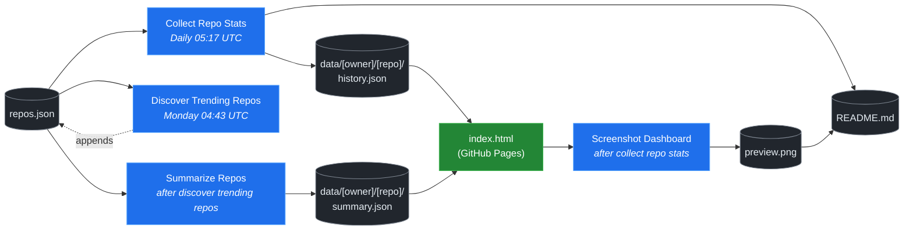

# 🚀 Rising Repos Tracker

> Automatically tracks daily GitHub stats (stars, forks, issues, velocity) for rising open source repos.

[](https://www.telosignal.com/)


**[→ View Live Dashboard](https://patrick-creates.github.io/rising-repos-tracker/)**

Built and maintained by [Telosignal](https://www.telosignal.com/).


<!-- AUTOGEN-STATS-START -->
## 📊 Current snapshot

> Auto-updated daily — last refreshed 2026-08-09

| Metric | Value |
|---|---|
| Repos tracked | **179** |
| Total stars | **8,584,904** |
| Total forks | **1,284,493** |
| Fastest growing | **ai-agent-book** (+1347.0/day) |

### 🔥 Top 5 by velocity

| # | Repo | Stars | Stars/day |
|---|---|---:|---:|
| 1 | [bojieli/ai-agent-book](https://github.com/bojieli/ai-agent-book) | 34,894 | +1347.0 |
| 2 | [DietrichGebert/ponytail](https://github.com/DietrichGebert/ponytail) | 98,900 | +1060.0 |
| 3 | [diegosouzapw/OmniRoute](https://github.com/diegosouzapw/OmniRoute) | 43,614 | +925.4 |
| 4 | [NousResearch/hermes-agent](https://github.com/NousResearch/hermes-agent) | 227,610 | +904.1 |
| 5 | [stablyai/orca](https://github.com/stablyai/orca) | 40,344 | +816.5 |

### 🆕 Recently added

- [herdrdev/herdr](https://github.com/herdrdev/herdr) — added 2026-08-03 — the runtime your coding agents live on
- [composio-community/awesome-codex-skills](https://github.com/composio-community/awesome-codex-skills) — added 2026-08-03 — A curated list of practical Codex skills for automating workflows across the Codex CLI and API.
- [NanmiCoder/cc-haha](https://github.com/NanmiCoder/cc-haha) — added 2026-08-03 — Local-first cross-platform desktop workspace for Claude Code / agents: multi-agent, Git worktrees, code diffs, skill marketplace, multi-model, Computer Use, task-aware desktop pets, with WeChat, Feishu, DingTalk, Telegram, WhatsApp and H5 access.
<!-- AUTOGEN-STATS-END -->

<!-- AUTOGEN-DIAGRAM-START -->
## 🔄 How it works


```mermaid
graph LR
    repos[("repos.json")]:::data
    history[("data/[owner]/[repo]/<br/>history.json")]:::data
    summary[("data/[owner]/[repo]/<br/>summary.json")]:::data
    readme[("README.md")]:::data
    preview[("preview.png")]:::data
    dashboard["index.html<br/>(GitHub Pages)"]:::output
    collect_yml["Collect Repo Stats<br/><i>Daily 05:17 UTC</i>"]:::workflow
    discover_yml["Discover Trending Repos<br/><i>Monday 04:43 UTC</i>"]:::workflow
    screenshot_yml["Screenshot Dashboard<br/><i>after collect repo stats</i>"]:::workflow
    summarize_yml["Summarize Repos<br/><i>after discover trending repos</i>"]:::workflow
    repos --> collect_yml
    collect_yml --> history
    collect_yml --> readme
    repos --> discover_yml
    discover_yml -.->|appends| repos
    dashboard --> screenshot_yml
    screenshot_yml --> preview
    repos --> summarize_yml
    summarize_yml --> summary
    history --> dashboard
    summary --> dashboard
    preview --> readme
    classDef workflow fill:#1f6feb,stroke:#58a6ff,color:#fff
    classDef data fill:#21262d,stroke:#7d8590,color:#e6edf3
    classDef output fill:#238636,stroke:#3fb950,color:#fff
```
<!-- AUTOGEN-DIAGRAM-END -->

<!-- AUTOGEN-WORKFLOWS-START -->
## ⚙️ Workflows

| File | Schedule | Name |
|---|---|---|
| `collect.yml` | Daily 05:17 UTC | Collect Repo Stats |
| `discover.yml` | Monday 04:43 UTC | Discover Trending Repos |
| `screenshot.yml` | After Collect Repo Stats | Screenshot Dashboard |
| `summarize.yml` | After Discover Trending Repos | Summarize Repos |

> All workflows commit results directly back to the repo. Schedules are best-effort — GitHub Actions cron can drift by a few minutes.
<!-- AUTOGEN-WORKFLOWS-END -->

<!-- AUTOGEN-REPOS-START -->
## 📋 All tracked repos

| Repo | Stars | Forks | Stars/day |
|---|---:|---:|---:|
| [openclaw/openclaw](https://github.com/openclaw/openclaw) | 385,593 | 81,055 | +160.5 |
| [obra/superpowers](https://github.com/obra/superpowers) | 269,416 | 24,072 | +705.0 |
| [affaan-m/everything-claude-code](https://github.com/affaan-m/everything-claude-code) | 238,859 | 36,276 | +656.9 |
| [affaan-m/ECC](https://github.com/affaan-m/ECC) | 238,859 | 36,276 | +613.6 |
| [NousResearch/hermes-agent](https://github.com/NousResearch/hermes-agent) | 227,610 | 44,636 | +904.1 |
| [Significant-Gravitas/AutoGPT](https://github.com/Significant-Gravitas/AutoGPT) | 186,444 | 46,068 | +24.6 |
| [microsoft/markitdown](https://github.com/microsoft/markitdown) | 172,461 | 12,560 | +562.0 |
| [f/prompts.chat](https://github.com/f/prompts.chat) | 166,904 | 21,541 | +53.8 |
| [langgenius/dify](https://github.com/langgenius/dify) | 151,813 | 23,963 | +120.3 |
| [open-webui/open-webui](https://github.com/open-webui/open-webui) | 148,269 | 21,581 | +129.3 |
| [langchain-ai/langchain](https://github.com/langchain-ai/langchain) | 143,758 | 23,945 | +80.9 |
| [github/spec-kit](https://github.com/github/spec-kit) | 125,927 | 11,248 | +318.9 |
| [farion1231/cc-switch](https://github.com/farion1231/cc-switch) | 125,778 | 8,558 | +623.3 |
| [microsoft/generative-ai-for-beginners](https://github.com/microsoft/generative-ai-for-beginners) | 117,099 | 61,853 | +72.1 |
| [nextlevelbuilder/ui-ux-pro-max-skill](https://github.com/nextlevelbuilder/ui-ux-pro-max-skill) | 114,800 | 12,294 | +419.4 |
| [Graphify-Labs/graphify](https://github.com/Graphify-Labs/graphify) | 104,405 | 10,144 | +592.8 |
| [DietrichGebert/ponytail](https://github.com/DietrichGebert/ponytail) | 98,900 | 5,438 | +1060.0 |
| [JuliusBrussee/caveman](https://github.com/JuliusBrussee/caveman) | 96,931 | 5,575 | +426.7 |
| [thedotmack/claude-mem](https://github.com/thedotmack/claude-mem) | 90,124 | 7,844 | +167.5 |
| [ruvnet/RuView](https://github.com/ruvnet/RuView) | 88,998 | 11,851 | +304.0 |
| [ChatGPTNextWeb/NextChat](https://github.com/ChatGPTNextWeb/NextChat) | 88,595 | 59,304 | +6.7 |
| [vllm-project/vllm](https://github.com/vllm-project/vllm) | 88,563 | 20,453 | +98.6 |
| [nexu-io/open-design](https://github.com/nexu-io/open-design) | 84,606 | 9,878 | +487.1 |
| [OpenHands/OpenHands](https://github.com/OpenHands/OpenHands) | 83,495 | 10,794 | +115.2 |
| [lobehub/lobehub](https://github.com/lobehub/lobehub) | 81,430 | 15,781 | +50.4 |
| [koala73/worldmonitor](https://github.com/koala73/worldmonitor) | 79,996 | 11,958 | +308.8 |
| [dair-ai/Prompt-Engineering-Guide](https://github.com/dair-ai/Prompt-Engineering-Guide) | 77,363 | 8,501 | +32.1 |
| [rtk-ai/rtk](https://github.com/rtk-ai/rtk) | 75,292 | 4,739 | +309.8 |
| [openai/openai-cookbook](https://github.com/openai/openai-cookbook) | 75,172 | 12,703 | +18.8 |
| [Leonxlnx/taste-skill](https://github.com/Leonxlnx/taste-skill) | 74,345 | 5,093 | +636.7 |
| [shareAI-lab/learn-claude-code](https://github.com/shareAI-lab/learn-claude-code) | 73,594 | 11,935 | +150.8 |
| [ComposioHQ/awesome-claude-skills](https://github.com/ComposioHQ/awesome-claude-skills) | 72,099 | 8,179 | +141.1 |
| [datawhalechina/hello-agents](https://github.com/datawhalechina/hello-agents) | 71,732 | 8,933 | +253.9 |
| [unslothai/unsloth](https://github.com/unslothai/unsloth) | 69,740 | 6,294 | +63.1 |
| [Panniantong/Agent-Reach](https://github.com/Panniantong/Agent-Reach) | 69,079 | 5,812 | +735.5 |
| [code-yeongyu/oh-my-openagent](https://github.com/code-yeongyu/oh-my-openagent) | 67,525 | 5,507 | +110.8 |
| [xtekky/gpt4free](https://github.com/xtekky/gpt4free) | 66,536 | 13,528 | +3.6 |
| [chopratejas/headroom](https://github.com/chopratejas/headroom) | 65,558 | 5,003 | +679.9 |
| [headroomlabs-ai/headroom](https://github.com/headroomlabs-ai/headroom) | 65,558 | 5,003 | +409.5 |
| [Fission-AI/OpenSpec](https://github.com/Fission-AI/OpenSpec) | 64,319 | 4,433 | +187.1 |
| [shanraisshan/claude-code-best-practice](https://github.com/shanraisshan/claude-code-best-practice) | 64,183 | 6,379 | +128.7 |
| [santifer/career-ops](https://github.com/santifer/career-ops) | 63,252 | 12,481 | +216.9 |
| [asgeirtj/system_prompts_leaks](https://github.com/asgeirtj/system_prompts_leaks) | 62,591 | 10,289 | +267.5 |
| [ZhuLinsen/daily_stock_analysis](https://github.com/ZhuLinsen/daily_stock_analysis) | 60,830 | 51,858 | +289.4 |
| [tw93/Pake](https://github.com/tw93/Pake) | 60,522 | 12,338 | +141.5 |
| [MemPalace/mempalace](https://github.com/MemPalace/mempalace) | 58,242 | 7,486 | +70.4 |
| [mvanhorn/last30days-skill](https://github.com/mvanhorn/last30days-skill) | 57,695 | 5,009 | +403.6 |
| [BerriAI/litellm](https://github.com/BerriAI/litellm) | 55,917 | 10,422 | +102.8 |
| [FlowiseAI/Flowise](https://github.com/FlowiseAI/Flowise) | 55,263 | 24,873 | +28.5 |
| [ggml-org/whisper.cpp](https://github.com/ggml-org/whisper.cpp) | 52,715 | 6,041 | +34.8 |
| [hesreallyhim/awesome-claude-code](https://github.com/hesreallyhim/awesome-claude-code) | 51,947 | 4,533 | +94.6 |
| [usestrix/strix](https://github.com/usestrix/strix) | 50,034 | 5,318 | +352.5 |
| [jamiepine/voicebox](https://github.com/jamiepine/voicebox) | 49,829 | 6,151 | +301.6 |
| [ChromeDevTools/chrome-devtools-mcp](https://github.com/ChromeDevTools/chrome-devtools-mcp) | 48,775 | 3,397 | +107.1 |
| [Aider-AI/aider](https://github.com/Aider-AI/aider) | 48,066 | 4,829 | +37.4 |
| [elder-plinius/CL4R1T4S](https://github.com/elder-plinius/CL4R1T4S) | 46,808 | 9,519 | +143.9 |
| [HKUDS/nanobot](https://github.com/HKUDS/nanobot) | 46,779 | 8,275 | +49.4 |
| [router-for-me/CLIProxyAPI](https://github.com/router-for-me/CLIProxyAPI) | 46,603 | 7,224 | +156.0 |
| [zhayujie/CowAgent](https://github.com/zhayujie/CowAgent) | 46,425 | 10,305 | +22.5 |
| [rohitg00/ai-engineering-from-scratch](https://github.com/rohitg00/ai-engineering-from-scratch) | 46,333 | 8,028 | +289.4 |
| [calesthio/OpenMontage](https://github.com/calesthio/OpenMontage) | 46,158 | 5,720 | +446.5 |
| [QuantumNous/new-api](https://github.com/QuantumNous/new-api) | 44,702 | 10,550 | +123.0 |
| [sickn33/antigravity-awesome-skills](https://github.com/sickn33/antigravity-awesome-skills) | 44,661 | 6,554 | +78.7 |
| [sickn33/agentic-awesome-skills](https://github.com/sickn33/agentic-awesome-skills) | 44,661 | 6,554 | +60.0 |
| [kepano/obsidian-skills](https://github.com/kepano/obsidian-skills) | 44,484 | 3,179 | +153.6 |
| [diegosouzapw/OmniRoute](https://github.com/diegosouzapw/OmniRoute) | 43,614 | 5,835 | +925.4 |
| [coreyhaines31/marketingskills](https://github.com/coreyhaines31/marketingskills) | 43,584 | 6,854 | +176.0 |
| [danny-avila/LibreChat](https://github.com/danny-avila/LibreChat) | 41,822 | 8,643 | +57.3 |
| [Imbad0202/academic-research-skills](https://github.com/Imbad0202/academic-research-skills) | 41,427 | 3,296 | +133.3 |
| [chatboxai/chatbox](https://github.com/chatboxai/chatbox) | 41,380 | 4,192 | +16.7 |
| [Hmbown/CodeWhale](https://github.com/Hmbown/CodeWhale) | 40,576 | 3,509 | +77.7 |
| [stablyai/orca](https://github.com/stablyai/orca) | 40,344 | 2,838 | +816.5 |
| [heygen-com/hyperframes](https://github.com/heygen-com/hyperframes) | 40,116 | 3,817 | +234.8 |
| [chatanywhere/GPT_API_free](https://github.com/chatanywhere/GPT_API_free) | 39,977 | 2,683 | +24.0 |
| [mindsdb/mindshub](https://github.com/mindsdb/mindshub) | 39,526 | 6,221 | +4.6 |
| [langchain-ai/langgraph](https://github.com/langchain-ai/langgraph) | 39,258 | 6,594 | +80.0 |
| [AstrBotDevs/AstrBot](https://github.com/AstrBotDevs/AstrBot) | 38,847 | 2,782 | +76.2 |
| [wshobson/agents](https://github.com/wshobson/agents) | 38,632 | 4,120 | +35.5 |
| [Yeachan-Heo/oh-my-claudecode](https://github.com/Yeachan-Heo/oh-my-claudecode) | 38,445 | 3,461 | +47.6 |
| [DeusData/codebase-memory-mcp](https://github.com/DeusData/codebase-memory-mcp) | 38,231 | 3,044 | +429.3 |
| [google/langextract](https://github.com/google/langextract) | 38,002 | 2,653 | +19.0 |
| [github/awesome-copilot](https://github.com/github/awesome-copilot) | 37,592 | 4,734 | +49.8 |
| [songquanpeng/one-api](https://github.com/songquanpeng/one-api) | 36,272 | 6,789 | +27.1 |
| [PDFMathTranslate/PDFMathTranslate](https://github.com/PDFMathTranslate/PDFMathTranslate) | 36,033 | 3,221 | +26.6 |
| [bojieli/ai-agent-book](https://github.com/bojieli/ai-agent-book) | 34,894 | 3,772 | +1347.0 |
| [agentscope-ai/QwenPaw](https://github.com/agentscope-ai/QwenPaw) | 34,253 | 2,963 | +299.5 |
| [anthropics/claude-plugins-official](https://github.com/anthropics/claude-plugins-official) | 33,288 | 3,759 | +62.0 |
| [esengine/DeepSeek-Reasonix](https://github.com/esengine/DeepSeek-Reasonix) | 33,240 | 2,148 | +221.2 |
| [zeroclaw-labs/zeroclaw](https://github.com/zeroclaw-labs/zeroclaw) | 32,539 | 4,883 | +12.5 |
| [iOfficeAI/AionUi](https://github.com/iOfficeAI/AionUi) | 31,732 | 3,232 | +63.5 |
| [JCodesMore/ai-website-cloner-template](https://github.com/JCodesMore/ai-website-cloner-template) | 31,317 | 4,528 | +260.4 |
| [AlexsJones/llmfit](https://github.com/AlexsJones/llmfit) | 31,262 | 1,918 | +61.8 |
| [MadsLorentzen/ai-job-search](https://github.com/MadsLorentzen/ai-job-search) | 30,847 | 10,547 | +343.1 |
| [Gitlawb/openclaude](https://github.com/Gitlawb/openclaude) | 30,581 | 8,906 | +35.4 |
| [HKUDS/Vibe-Trading](https://github.com/HKUDS/Vibe-Trading) | 30,395 | 4,892 | +381.9 |
| [googleworkspace/cli](https://github.com/googleworkspace/cli) | 30,273 | 1,772 | +51.5 |
| [tirth8205/code-review-graph](https://github.com/tirth8205/code-review-graph) | 29,490 | 2,702 | +199.6 |
| [voideditor/void](https://github.com/voideditor/void) | 28,859 | 2,616 | +0.8 |
| [alibaba/page-agent](https://github.com/alibaba/page-agent) | 28,538 | 2,525 | +181.5 |
| [volcengine/OpenViking](https://github.com/volcengine/OpenViking) | 28,103 | 2,215 | +44.8 |
| [jackwener/OpenCLI](https://github.com/jackwener/OpenCLI) | 27,947 | 2,749 | +66.9 |
| [BloopAI/vibe-kanban](https://github.com/BloopAI/vibe-kanban) | 27,712 | 2,942 | +14.5 |
| [langchain-ai/deepagents](https://github.com/langchain-ai/deepagents) | 27,535 | 3,843 | +54.5 |
| [mukul975/Anthropic-Cybersecurity-Skills](https://github.com/mukul975/Anthropic-Cybersecurity-Skills) | 27,480 | 3,327 | +195.0 |
| [jarrodwatts/claude-hud](https://github.com/jarrodwatts/claude-hud) | 27,232 | 1,265 | +41.0 |
| [p-e-w/heretic](https://github.com/p-e-w/heretic) | 27,220 | 2,948 | +52.4 |
| [iOfficeAI/OfficeCLI](https://github.com/iOfficeAI/OfficeCLI) | 26,879 | 1,822 | +543.6 |
| [rohitg00/agentmemory](https://github.com/rohitg00/agentmemory) | 26,761 | 2,278 | +79.6 |
| [ogulcancelik/herdr](https://github.com/ogulcancelik/herdr) | 26,033 | 1,839 | +401.1 |
| [herdrdev/herdr](https://github.com/herdrdev/herdr) | 26,033 | 1,839 | +374.0 |
| [zai-org/Open-AutoGLM](https://github.com/zai-org/Open-AutoGLM) | 25,969 | 4,018 | +8.2 |
| [manaflow-ai/cmux](https://github.com/manaflow-ai/cmux) | 25,808 | 2,175 | +53.8 |
| [toon-format/toon](https://github.com/toon-format/toon) | 25,116 | 1,113 | +10.0 |
| [decolua/9router](https://github.com/decolua/9router) | 25,016 | 4,443 | +135.4 |
| [can1357/oh-my-pi](https://github.com/can1357/oh-my-pi) | 23,087 | 2,192 | +189.4 |
| [winfunc/opcode](https://github.com/winfunc/opcode) | 22,363 | 1,726 | +5.8 |
| [coze-dev/coze-studio](https://github.com/coze-dev/coze-studio) | 21,414 | 3,111 | +7.5 |
| [NirDiamant/agents-towards-production](https://github.com/NirDiamant/agents-towards-production) | 21,258 | 2,817 | +10.1 |
| [pranshuparmar/witr](https://github.com/pranshuparmar/witr) | 20,164 | 663 | +52.0 |
| [steipete/CodexBar](https://github.com/steipete/CodexBar) | 19,820 | 1,667 | +96.2 |
| [alibaba/open-code-review](https://github.com/alibaba/open-code-review) | 19,750 | 1,380 | +287.1 |
| [mksglu/context-mode](https://github.com/mksglu/context-mode) | 19,731 | 1,416 | +41.1 |
| [Tencent/WeKnora](https://github.com/Tencent/WeKnora) | 19,535 | 2,795 | +59.0 |
| [KKKKhazix/khazix-skills](https://github.com/KKKKhazix/khazix-skills) | 19,390 | 2,124 | +96.6 |
| [tanweai/pua](https://github.com/tanweai/pua) | 19,301 | 1,175 | +19.2 |
| [jnMetaCode/agency-agents-zh](https://github.com/jnMetaCode/agency-agents-zh) | 19,031 | 3,124 | +75.5 |
| [datawhalechina/easy-vibe](https://github.com/datawhalechina/easy-vibe) | 18,818 | 1,794 | +34.1 |
| [jundot/omlx](https://github.com/jundot/omlx) | 18,535 | 1,600 | +34.6 |
| [TencentCloud/TencentDB-Agent-Memory](https://github.com/TencentCloud/TencentDB-Agent-Memory) | 18,366 | 1,653 | +357.3 |
| [RightNow-AI/openfang](https://github.com/RightNow-AI/openfang) | 18,089 | 2,281 | +4.8 |
| [microsoft/agent-lightning](https://github.com/microsoft/agent-lightning) | 17,461 | 1,530 | +2.7 |
| [danielmiessler/LifeOS](https://github.com/danielmiessler/LifeOS) | 17,307 | 2,338 | +25.9 |
| [nesquena/hermes-webui](https://github.com/nesquena/hermes-webui) | 17,122 | 2,342 | +47.6 |
| [browser-use/browser-harness](https://github.com/browser-use/browser-harness) | 16,596 | 1,569 | +27.2 |
| [1jehuang/jcode](https://github.com/1jehuang/jcode) | 16,510 | 1,857 | +303.9 |
| [cft0808/edict](https://github.com/cft0808/edict) | 16,340 | 1,710 | +5.1 |
| [MemoriLabs/Memori](https://github.com/MemoriLabs/Memori) | 15,724 | 2,912 | +7.9 |
| [composio-community/awesome-codex-skills](https://github.com/composio-community/awesome-codex-skills) | 15,717 | 1,531 | +25.3 |
| [Anionex/banana-slides](https://github.com/Anionex/banana-slides) | 15,427 | 1,774 | +7.2 |
| [xbtlin/ai-berkshire](https://github.com/xbtlin/ai-berkshire) | 15,257 | 2,259 | +131.8 |
| [xpzouying/xiaohongshu-mcp](https://github.com/xpzouying/xiaohongshu-mcp) | 15,142 | 2,233 | +17.8 |
| [kyegomez/OpenMythos](https://github.com/kyegomez/OpenMythos) | 14,791 | 3,295 | +13.3 |
| [yusufkaraaslan/Skill_Seekers](https://github.com/yusufkaraaslan/Skill_Seekers) | 14,729 | 1,499 | +10.5 |
| [wanshuiyin/Auto-claude-code-research-in-sleep](https://github.com/wanshuiyin/Auto-claude-code-research-in-sleep) | 14,418 | 1,281 | +40.1 |
| [NevaMind-AI/memU](https://github.com/NevaMind-AI/memU) | 14,274 | 1,054 | +7.8 |
| [NanmiCoder/cc-haha](https://github.com/NanmiCoder/cc-haha) | 14,003 | 8,530 | +21.2 |
| [t8y2/dbx](https://github.com/t8y2/dbx) | 13,745 | 1,412 | +146.8 |
| [superset-sh/superset](https://github.com/superset-sh/superset) | 12,830 | 1,174 | +16.3 |
| [XiaomiMiMo/MiMo-Code](https://github.com/XiaomiMiMo/MiMo-Code) | 12,692 | 1,298 | +40.7 |
| [sirmalloc/ccstatusline](https://github.com/sirmalloc/ccstatusline) | 12,302 | 537 | +24.9 |
| [EverMind-AI/EverOS](https://github.com/EverMind-AI/EverOS) | 11,897 | 885 | +53.2 |
| [walkinglabs/learn-harness-engineering](https://github.com/walkinglabs/learn-harness-engineering) | 11,099 | 1,204 | +35.7 |
| [ValueCell-ai/valuecell](https://github.com/ValueCell-ai/valuecell) | 10,964 | 1,814 | +2.2 |
| [0x4m4/hexstrike-ai](https://github.com/0x4m4/hexstrike-ai) | 10,891 | 2,275 | +21.5 |
| [aden-hive/hive](https://github.com/aden-hive/hive) | 10,886 | 5,672 | +6.7 |
| [MemTensor/MemOS](https://github.com/MemTensor/MemOS) | 10,653 | 987 | +15.3 |
| [brokermr810/QuantDinger](https://github.com/brokermr810/QuantDinger) | 10,405 | 2,185 | +33.0 |
| [OpenByteInc/QuantDinger](https://github.com/OpenByteInc/QuantDinger) | 10,405 | 2,185 | +30.1 |
| [Kuberwastaken/claurst](https://github.com/Kuberwastaken/claurst) | 10,207 | 7,784 | +8.3 |
| [ConardLi/garden-skills](https://github.com/ConardLi/garden-skills) | 10,171 | 1,343 | +29.1 |
| [EKKOLearnAI/hermes-studio](https://github.com/EKKOLearnAI/hermes-studio) | 9,886 | 1,216 | +30.2 |
| [frankbria/ralph-claude-code](https://github.com/frankbria/ralph-claude-code) | 9,594 | 723 | +5.5 |
| [ykdojo/claude-code-tips](https://github.com/ykdojo/claude-code-tips) | 9,576 | 760 | +16.4 |
| [StarTrail-org/PixelRAG](https://github.com/StarTrail-org/PixelRAG) | 9,374 | 797 | +103.3 |
| [openai/codex-security](https://github.com/openai/codex-security) | 9,362 | 640 | +180.0 |
| [iflytek/astron-agent](https://github.com/iflytek/astron-agent) | 9,238 | 874 | +18.5 |
| [getagentseal/codeburn](https://github.com/getagentseal/codeburn) | 9,211 | 723 | +21.8 |
| [EvoMap/evolver](https://github.com/EvoMap/evolver) | 8,957 | 830 | +3.0 |
| [MiroMindAI/MiroThinker](https://github.com/MiroMindAI/MiroThinker) | 8,368 | 644 | +1.2 |
| [modem-dev/hunk](https://github.com/modem-dev/hunk) | 8,173 | 242 | +54.4 |
| [mmulet/term.everything](https://github.com/mmulet/term.everything) | 8,060 | 192 | +1.1 |
| [ValueCell-ai/ClawX](https://github.com/ValueCell-ai/ClawX) | 7,576 | 1,133 | +1.3 |
| [opensquilla/opensquilla](https://github.com/opensquilla/opensquilla) | 6,587 | 509 | +18.9 |
| [steipete/summarize](https://github.com/steipete/summarize) | 6,533 | 441 | +4.6 |
| [Arthur-Ficial/apfel](https://github.com/Arthur-Ficial/apfel) | 6,265 | 240 | +5.6 |
| [Andyyyy64/whichllm](https://github.com/Andyyyy64/whichllm) | 6,182 | 328 | +15.8 |
| [microsoft/fara](https://github.com/microsoft/fara) | 6,137 | 599 | +5.1 |
| [UfoMiao/zcf](https://github.com/UfoMiao/zcf) | 6,076 | 425 | +0.2 |
| [re4/LibreCode](https://github.com/re4/LibreCode) | 82 | 4 | — |
<!-- AUTOGEN-REPOS-END -->

---

## What it does

- Collects daily snapshots of stars, forks, watchers and open issues for every tracked repo
- Discovers new trending repos automatically every Monday using the GitHub Search API
- Generates AI summaries (use cases, similar tools, tags) for each tracked repo via GitHub Models
- Stores all history as plain JSON — no database, no backend
- Renders a live dashboard via GitHub Pages — updates daily, zero maintenance

## Tracked repos

Data lives in [`data/`](./data) — one folder per repo, one `history.json` per entry.  
The full watch list is in [`repos.json`](./repos.json).

## Fork & use it for yourself

This is my personal tracker — the watch list reflects what I find interesting. If you want to track different repos, the best path is to **fork this repo and run your own**.

### Setup

1. Fork this repo to your account
2. Replace the contents of [`repos.json`](./repos.json) with the repos you want to track (or just leave one entry — `discover.yml` will auto-add more every Monday)
3. Go to **Settings → Pages** and enable GitHub Pages from the `main` branch
4. Go to **Actions** and run **Collect Repo Stats** once manually to seed your first data point
5. Your dashboard will be live at `https://YOUR-USERNAME.github.io/rising-repos-tracker/`

That's it — daily collection and weekly discovery run automatically on schedule. Zero ongoing maintenance.

### Customizing what gets discovered

Edit [`scripts/discover.js`](./scripts/discover.js) to change:

- `MIN_STARS` — minimum star threshold for candidates
- `MAX_AGE_DAYS` — how recent a repo must be
- `MAX_NEW_REPOS` — how many to add per discovery run
- The `queries` array — GitHub Search API queries that define what "trending" means to you

### Adding a repo manually

Just edit `repos.json` directly:

```json
{
  "owner": "OWNER",
  "repo": "REPO",
  "added": "YYYY-MM-DD",
  "notes": "why you're tracking this"
}
```

The next daily collect run picks it up automatically.

## Stack

- **GitHub Actions** — scheduling and automation
- **GitHub Pages** — dashboard hosting
- **GitHub API** — data source
- **GitHub Models** — free AI summaries (gpt-4o-mini)
- **Chart.js** — star growth visualization
- **Mermaid** — architecture diagram (rendered by GitHub)
- No dependencies, no build step, no database

## License

MIT
