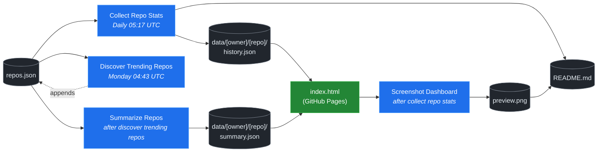

# 🚀 Rising Repos Tracker

> Automatically tracks daily GitHub stats (stars, forks, issues, velocity) for rising open source repos.

[](https://www.telosignal.com/)


**[→ View Live Dashboard](https://patrick-creates.github.io/rising-repos-tracker/)**

Built and maintained by [Telosignal](https://www.telosignal.com/).


<!-- AUTOGEN-STATS-START -->
## 📊 Current snapshot

> Auto-updated daily — last refreshed 2026-08-03

| Metric | Value |
|---|---|
| Repos tracked | **179** |
| Total stars | **8,455,661** |
| Total forks | **1,268,081** |
| Fastest growing | **ai-agent-book** (+1607.6/day) |

### 🔥 Top 5 by velocity

| # | Repo | Stars | Stars/day |
|---|---|---:|---:|
| 1 | [bojieli/ai-agent-book](https://github.com/bojieli/ai-agent-book) | 30,459 | +1607.6 |
| 2 | [DietrichGebert/ponytail](https://github.com/DietrichGebert/ponytail) | 94,379 | +1103.8 |
| 3 | [NousResearch/hermes-agent](https://github.com/NousResearch/hermes-agent) | 224,538 | +932.8 |
| 4 | [diegosouzapw/OmniRoute](https://github.com/diegosouzapw/OmniRoute) | 38,206 | +930.5 |
| 5 | [stablyai/orca](https://github.com/stablyai/orca) | 36,163 | +842.1 |

### 🆕 Recently added

- [herdrdev/herdr](https://github.com/herdrdev/herdr) — added 2026-08-03 — the runtime your coding agents live on
- [composio-community/awesome-codex-skills](https://github.com/composio-community/awesome-codex-skills) — added 2026-08-03 — A curated list of practical Codex skills for automating workflows across the Codex CLI and API.
- [NanmiCoder/cc-haha](https://github.com/NanmiCoder/cc-haha) — added 2026-08-03 — Local-first cross-platform desktop workspace for Claude Code / agents: multi-agent, Git worktrees, code diffs, skill marketplace, multi-model, Computer Use, task-aware desktop pets, with WeChat, Feishu, DingTalk, Telegram, WhatsApp and H5 access.
<!-- AUTOGEN-STATS-END -->

<!-- AUTOGEN-DIAGRAM-START -->
## 🔄 How it works


```mermaid
graph LR
    repos[("repos.json")]:::data
    history[("data/[owner]/[repo]/<br/>history.json")]:::data
    summary[("data/[owner]/[repo]/<br/>summary.json")]:::data
    readme[("README.md")]:::data
    preview[("preview.png")]:::data
    dashboard["index.html<br/>(GitHub Pages)"]:::output
    collect_yml["Collect Repo Stats<br/><i>Daily 05:17 UTC</i>"]:::workflow
    discover_yml["Discover Trending Repos<br/><i>Monday 04:43 UTC</i>"]:::workflow
    screenshot_yml["Screenshot Dashboard<br/><i>after collect repo stats</i>"]:::workflow
    summarize_yml["Summarize Repos<br/><i>after discover trending repos</i>"]:::workflow
    repos --> collect_yml
    collect_yml --> history
    collect_yml --> readme
    repos --> discover_yml
    discover_yml -.->|appends| repos
    dashboard --> screenshot_yml
    screenshot_yml --> preview
    repos --> summarize_yml
    summarize_yml --> summary
    history --> dashboard
    summary --> dashboard
    preview --> readme
    classDef workflow fill:#1f6feb,stroke:#58a6ff,color:#fff
    classDef data fill:#21262d,stroke:#7d8590,color:#e6edf3
    classDef output fill:#238636,stroke:#3fb950,color:#fff
```
<!-- AUTOGEN-DIAGRAM-END -->

<!-- AUTOGEN-WORKFLOWS-START -->
## ⚙️ Workflows

| File | Schedule | Name |
|---|---|---|
| `collect.yml` | Daily 05:17 UTC | Collect Repo Stats |
| `discover.yml` | Monday 04:43 UTC | Discover Trending Repos |
| `screenshot.yml` | After Collect Repo Stats | Screenshot Dashboard |
| `summarize.yml` | After Discover Trending Repos | Summarize Repos |

> All workflows commit results directly back to the repo. Schedules are best-effort — GitHub Actions cron can drift by a few minutes.
<!-- AUTOGEN-WORKFLOWS-END -->

<!-- AUTOGEN-REPOS-START -->
## 📋 All tracked repos

| Repo | Stars | Forks | Stars/day |
|---|---:|---:|---:|
| [openclaw/openclaw](https://github.com/openclaw/openclaw) | 384,989 | 80,917 | +164.9 |
| [obra/superpowers](https://github.com/obra/superpowers) | 265,368 | 23,717 | +709.3 |
| [affaan-m/everything-claude-code](https://github.com/affaan-m/everything-claude-code) | 237,170 | 36,054 | +684.4 |
| [affaan-m/ECC](https://github.com/affaan-m/ECC) | 237,170 | 36,054 | +642.0 |
| [NousResearch/hermes-agent](https://github.com/NousResearch/hermes-agent) | 224,538 | 43,459 | +932.8 |
| [Significant-Gravitas/AutoGPT](https://github.com/Significant-Gravitas/AutoGPT) | 185,781 | 46,051 | +18.3 |
| [microsoft/markitdown](https://github.com/microsoft/markitdown) | 170,985 | 12,430 | +585.1 |
| [f/prompts.chat](https://github.com/f/prompts.chat) | 166,660 | 21,530 | +54.7 |
| [langgenius/dify](https://github.com/langgenius/dify) | 151,169 | 23,855 | +121.3 |
| [open-webui/open-webui](https://github.com/open-webui/open-webui) | 147,686 | 21,468 | +131.6 |
| [langchain-ai/langchain](https://github.com/langchain-ai/langchain) | 143,290 | 23,868 | +81.2 |
| [github/spec-kit](https://github.com/github/spec-kit) | 125,100 | 11,182 | +332.2 |
| [farion1231/cc-switch](https://github.com/farion1231/cc-switch) | 123,799 | 8,380 | +646.2 |
| [microsoft/generative-ai-for-beginners](https://github.com/microsoft/generative-ai-for-beginners) | 115,108 | 61,358 | +53.1 |
| [nextlevelbuilder/ui-ux-pro-max-skill](https://github.com/nextlevelbuilder/ui-ux-pro-max-skill) | 112,831 | 12,065 | +426.1 |
| [Graphify-Labs/graphify](https://github.com/Graphify-Labs/graphify) | 101,352 | 9,836 | +664.9 |
| [JuliusBrussee/caveman](https://github.com/JuliusBrussee/caveman) | 95,374 | 5,468 | +439.8 |
| [DietrichGebert/ponytail](https://github.com/DietrichGebert/ponytail) | 94,379 | 5,191 | +1103.8 |
| [thedotmack/claude-mem](https://github.com/thedotmack/claude-mem) | 89,376 | 7,780 | +170.7 |
| [ChatGPTNextWeb/NextChat](https://github.com/ChatGPTNextWeb/NextChat) | 88,584 | 59,341 | +7.1 |
| [ruvnet/RuView](https://github.com/ruvnet/RuView) | 88,282 | 11,729 | +319.8 |
| [vllm-project/vllm](https://github.com/vllm-project/vllm) | 88,030 | 20,197 | +99.3 |
| [nexu-io/open-design](https://github.com/nexu-io/open-design) | 83,291 | 9,660 | +508.0 |
| [OpenHands/OpenHands](https://github.com/OpenHands/OpenHands) | 82,959 | 10,687 | +117.2 |
| [lobehub/lobehub](https://github.com/lobehub/lobehub) | 81,158 | 15,754 | +50.7 |
| [koala73/worldmonitor](https://github.com/koala73/worldmonitor) | 78,280 | 11,699 | +310.5 |
| [dair-ai/Prompt-Engineering-Guide](https://github.com/dair-ai/Prompt-Engineering-Guide) | 77,216 | 8,485 | +32.7 |
| [openai/openai-cookbook](https://github.com/openai/openai-cookbook) | 75,073 | 12,694 | +19.0 |
| [rtk-ai/rtk](https://github.com/rtk-ai/rtk) | 74,442 | 4,669 | +322.9 |
| [shareAI-lab/learn-claude-code](https://github.com/shareAI-lab/learn-claude-code) | 73,058 | 11,864 | +155.6 |
| [ComposioHQ/awesome-claude-skills](https://github.com/ComposioHQ/awesome-claude-skills) | 71,648 | 8,078 | +146.2 |
| [Leonxlnx/taste-skill](https://github.com/Leonxlnx/taste-skill) | 70,692 | 4,864 | +639.3 |
| [datawhalechina/hello-agents](https://github.com/datawhalechina/hello-agents) | 70,321 | 8,775 | +255.3 |
| [unslothai/unsloth](https://github.com/unslothai/unsloth) | 69,429 | 6,272 | +64.0 |
| [code-yeongyu/oh-my-openagent](https://github.com/code-yeongyu/oh-my-openagent) | 67,097 | 5,475 | +113.9 |
| [xtekky/gpt4free](https://github.com/xtekky/gpt4free) | 66,525 | 13,534 | +3.7 |
| [Panniantong/Agent-Reach](https://github.com/Panniantong/Agent-Reach) | 65,166 | 5,395 | +744.4 |
| [chopratejas/headroom](https://github.com/chopratejas/headroom) | 64,160 | 4,878 | +734.6 |
| [headroomlabs-ai/headroom](https://github.com/headroomlabs-ai/headroom) | 64,160 | 4,878 | +434.7 |
| [shanraisshan/claude-code-best-practice](https://github.com/shanraisshan/claude-code-best-practice) | 63,912 | 6,367 | +135.2 |
| [Fission-AI/OpenSpec](https://github.com/Fission-AI/OpenSpec) | 63,568 | 4,396 | +191.9 |
| [santifer/career-ops](https://github.com/santifer/career-ops) | 62,585 | 12,335 | +225.2 |
| [asgeirtj/system_prompts_leaks](https://github.com/asgeirtj/system_prompts_leaks) | 62,053 | 10,142 | +281.4 |
| [tw93/Pake](https://github.com/tw93/Pake) | 60,418 | 12,297 | +151.2 |
| [ZhuLinsen/daily_stock_analysis](https://github.com/ZhuLinsen/daily_stock_analysis) | 59,912 | 51,281 | +301.0 |
| [MemPalace/mempalace](https://github.com/MemPalace/mempalace) | 58,003 | 7,455 | +72.8 |
| [mvanhorn/last30days-skill](https://github.com/mvanhorn/last30days-skill) | 57,043 | 4,992 | +435.2 |
| [BerriAI/litellm](https://github.com/BerriAI/litellm) | 55,412 | 10,283 | +104.2 |
| [FlowiseAI/Flowise](https://github.com/FlowiseAI/Flowise) | 55,112 | 24,811 | +28.7 |
| [ggml-org/whisper.cpp](https://github.com/ggml-org/whisper.cpp) | 52,544 | 5,989 | +35.3 |
| [hesreallyhim/awesome-claude-code](https://github.com/hesreallyhim/awesome-claude-code) | 51,561 | 4,492 | +97.0 |
| [ChromeDevTools/chrome-devtools-mcp](https://github.com/ChromeDevTools/chrome-devtools-mcp) | 48,430 | 3,309 | +111.0 |
| [jamiepine/voicebox](https://github.com/jamiepine/voicebox) | 48,332 | 5,954 | +306.5 |
| [Aider-AI/aider](https://github.com/Aider-AI/aider) | 47,896 | 4,807 | +38.1 |
| [usestrix/strix](https://github.com/usestrix/strix) | 46,748 | 4,936 | +333.9 |
| [elder-plinius/CL4R1T4S](https://github.com/elder-plinius/CL4R1T4S) | 46,622 | 9,498 | +157.8 |
| [HKUDS/nanobot](https://github.com/HKUDS/nanobot) | 46,545 | 8,238 | +50.2 |
| [zhayujie/CowAgent](https://github.com/zhayujie/CowAgent) | 46,285 | 10,291 | +22.5 |
| [router-for-me/CLIProxyAPI](https://github.com/router-for-me/CLIProxyAPI) | 46,029 | 7,151 | +161.2 |
| [rohitg00/ai-engineering-from-scratch](https://github.com/rohitg00/ai-engineering-from-scratch) | 45,598 | 7,837 | +305.3 |
| [calesthio/OpenMontage](https://github.com/calesthio/OpenMontage) | 44,769 | 5,474 | +483.4 |
| [sickn33/antigravity-awesome-skills](https://github.com/sickn33/antigravity-awesome-skills) | 44,323 | 6,523 | +80.6 |
| [sickn33/agentic-awesome-skills](https://github.com/sickn33/agentic-awesome-skills) | 44,323 | 6,523 | +61.0 |
| [QuantumNous/new-api](https://github.com/QuantumNous/new-api) | 44,162 | 10,380 | +125.8 |
| [kepano/obsidian-skills](https://github.com/kepano/obsidian-skills) | 43,964 | 3,142 | +160.0 |
| [coreyhaines31/marketingskills](https://github.com/coreyhaines31/marketingskills) | 42,790 | 6,740 | +180.2 |
| [danny-avila/LibreChat](https://github.com/danny-avila/LibreChat) | 41,598 | 8,569 | +59.0 |
| [chatboxai/chatbox](https://github.com/chatboxai/chatbox) | 41,284 | 4,181 | +16.7 |
| [Imbad0202/academic-research-skills](https://github.com/Imbad0202/academic-research-skills) | 40,656 | 3,249 | +137.4 |
| [Hmbown/CodeWhale](https://github.com/Hmbown/CodeWhale) | 40,393 | 3,490 | +81.8 |
| [chatanywhere/GPT_API_free](https://github.com/chatanywhere/GPT_API_free) | 39,614 | 2,675 | +20.8 |
| [mindsdb/mindshub](https://github.com/mindsdb/mindshub) | 39,515 | 6,227 | +5.4 |
| [heygen-com/hyperframes](https://github.com/heygen-com/hyperframes) | 39,257 | 3,705 | +244.6 |
| [langchain-ai/langgraph](https://github.com/langchain-ai/langgraph) | 38,738 | 6,530 | +79.0 |
| [AstrBotDevs/AstrBot](https://github.com/AstrBotDevs/AstrBot) | 38,505 | 2,750 | +78.0 |
| [wshobson/agents](https://github.com/wshobson/agents) | 38,440 | 4,112 | +35.8 |
| [Yeachan-Heo/oh-my-claudecode](https://github.com/Yeachan-Heo/oh-my-claudecode) | 38,278 | 3,446 | +49.3 |
| [diegosouzapw/OmniRoute](https://github.com/diegosouzapw/OmniRoute) | 38,206 | 5,021 | +930.5 |
| [google/langextract](https://github.com/google/langextract) | 37,953 | 2,639 | +20.0 |
| [github/awesome-copilot](https://github.com/github/awesome-copilot) | 37,381 | 4,698 | +51.1 |
| [DeusData/codebase-memory-mcp](https://github.com/DeusData/codebase-memory-mcp) | 37,193 | 2,938 | +473.2 |
| [stablyai/orca](https://github.com/stablyai/orca) | 36,163 | 2,555 | +842.1 |
| [songquanpeng/one-api](https://github.com/songquanpeng/one-api) | 36,158 | 6,774 | +27.8 |
| [PDFMathTranslate/PDFMathTranslate](https://github.com/PDFMathTranslate/PDFMathTranslate) | 35,926 | 3,210 | +27.3 |
| [anthropics/claude-plugins-official](https://github.com/anthropics/claude-plugins-official) | 32,987 | 3,724 | +63.1 |
| [zeroclaw-labs/zeroclaw](https://github.com/zeroclaw-labs/zeroclaw) | 32,486 | 4,858 | +12.9 |
| [agentscope-ai/QwenPaw](https://github.com/agentscope-ai/QwenPaw) | 32,367 | 2,927 | +297.7 |
| [iOfficeAI/AionUi](https://github.com/iOfficeAI/AionUi) | 31,310 | 3,156 | +62.9 |
| [AlexsJones/llmfit](https://github.com/AlexsJones/llmfit) | 31,077 | 1,898 | +64.7 |
| [JCodesMore/ai-website-cloner-template](https://github.com/JCodesMore/ai-website-cloner-template) | 30,860 | 4,437 | +283.0 |
| [Gitlawb/openclaude](https://github.com/Gitlawb/openclaude) | 30,486 | 8,902 | +37.3 |
| [bojieli/ai-agent-book](https://github.com/bojieli/ai-agent-book) | 30,459 | 3,262 | +1607.6 |
| [googleworkspace/cli](https://github.com/googleworkspace/cli) | 30,165 | 1,762 | +54.7 |
| [esengine/DeepSeek-Reasonix](https://github.com/esengine/DeepSeek-Reasonix) | 29,455 | 1,898 | +177.3 |
| [HKUDS/Vibe-Trading](https://github.com/HKUDS/Vibe-Trading) | 29,384 | 4,735 | +418.5 |
| [MadsLorentzen/ai-job-search](https://github.com/MadsLorentzen/ai-job-search) | 29,329 | 9,866 | +368.9 |
| [voideditor/void](https://github.com/voideditor/void) | 28,864 | 2,604 | +0.9 |
| [alibaba/page-agent](https://github.com/alibaba/page-agent) | 28,383 | 2,500 | +200.5 |
| [tirth8205/code-review-graph](https://github.com/tirth8205/code-review-graph) | 28,166 | 2,611 | +197.0 |
| [volcengine/OpenViking](https://github.com/volcengine/OpenViking) | 27,787 | 2,184 | +43.9 |
| [jackwener/OpenCLI](https://github.com/jackwener/OpenCLI) | 27,640 | 2,715 | +68.6 |
| [BloopAI/vibe-kanban](https://github.com/BloopAI/vibe-kanban) | 27,632 | 2,934 | +14.6 |
| [langchain-ai/deepagents](https://github.com/langchain-ai/deepagents) | 27,256 | 3,811 | +55.4 |
| [mukul975/Anthropic-Cybersecurity-Skills](https://github.com/mukul975/Anthropic-Cybersecurity-Skills) | 27,194 | 3,293 | +216.0 |
| [p-e-w/heretic](https://github.com/p-e-w/heretic) | 27,056 | 2,930 | +55.1 |
| [jarrodwatts/claude-hud](https://github.com/jarrodwatts/claude-hud) | 27,042 | 1,256 | +42.0 |
| [rohitg00/agentmemory](https://github.com/rohitg00/agentmemory) | 26,412 | 2,230 | +81.9 |
| [zai-org/Open-AutoGLM](https://github.com/zai-org/Open-AutoGLM) | 25,944 | 4,020 | +8.6 |
| [manaflow-ai/cmux](https://github.com/manaflow-ai/cmux) | 25,513 | 2,138 | +55.1 |
| [toon-format/toon](https://github.com/toon-format/toon) | 25,056 | 1,112 | +10.0 |
| [iOfficeAI/OfficeCLI](https://github.com/iOfficeAI/OfficeCLI) | 24,529 | 1,654 | +576.1 |
| [decolua/9router](https://github.com/decolua/9router) | 24,516 | 4,268 | +141.7 |
| [herdrdev/herdr](https://github.com/herdrdev/herdr) | 23,789 | 1,638 | +185.8 |
| [ogulcancelik/herdr](https://github.com/ogulcancelik/herdr) | 23,788 | 1,638 | +406.8 |
| [winfunc/opcode](https://github.com/winfunc/opcode) | 22,343 | 1,723 | +6.0 |
| [can1357/oh-my-pi](https://github.com/can1357/oh-my-pi) | 21,431 | 2,039 | +177.0 |
| [coze-dev/coze-studio](https://github.com/coze-dev/coze-studio) | 21,320 | 3,096 | +6.6 |
| [NirDiamant/agents-towards-production](https://github.com/NirDiamant/agents-towards-production) | 21,229 | 2,814 | +10.6 |
| [mksglu/context-mode](https://github.com/mksglu/context-mode) | 19,577 | 1,398 | +43.0 |
| [steipete/CodexBar](https://github.com/steipete/CodexBar) | 19,556 | 1,633 | +103.6 |
| [Tencent/WeKnora](https://github.com/Tencent/WeKnora) | 19,282 | 2,739 | +61.0 |
| [tanweai/pua](https://github.com/tanweai/pua) | 19,166 | 1,165 | +18.8 |
| [KKKKhazix/khazix-skills](https://github.com/KKKKhazix/khazix-skills) | 18,964 | 2,097 | +107.6 |
| [jnMetaCode/agency-agents-zh](https://github.com/jnMetaCode/agency-agents-zh) | 18,712 | 3,095 | +78.7 |
| [datawhalechina/easy-vibe](https://github.com/datawhalechina/easy-vibe) | 18,710 | 1,777 | +36.1 |
| [pranshuparmar/witr](https://github.com/pranshuparmar/witr) | 18,531 | 586 | +14.3 |
| [jundot/omlx](https://github.com/jundot/omlx) | 18,400 | 1,580 | +36.1 |
| [alibaba/open-code-review](https://github.com/alibaba/open-code-review) | 18,160 | 1,220 | +291.9 |
| [RightNow-AI/openfang](https://github.com/RightNow-AI/openfang) | 18,074 | 2,285 | +5.1 |
| [microsoft/agent-lightning](https://github.com/microsoft/agent-lightning) | 17,439 | 1,526 | +2.6 |
| [danielmiessler/LifeOS](https://github.com/danielmiessler/LifeOS) | 17,136 | 2,315 | +25.5 |
| [nesquena/hermes-webui](https://github.com/nesquena/hermes-webui) | 16,874 | 2,305 | +48.5 |
| [browser-use/browser-harness](https://github.com/browser-use/browser-harness) | 16,433 | 1,554 | +27.3 |
| [cft0808/edict](https://github.com/cft0808/edict) | 16,313 | 1,710 | +5.1 |
| [MemoriLabs/Memori](https://github.com/MemoriLabs/Memori) | 15,678 | 2,881 | +8.0 |
| [composio-community/awesome-codex-skills](https://github.com/composio-community/awesome-codex-skills) | 15,565 | 1,507 | +77.1 |
| [Anionex/banana-slides](https://github.com/Anionex/banana-slides) | 15,374 | 1,771 | +5.9 |
| [1jehuang/jcode](https://github.com/1jehuang/jcode) | 15,370 | 1,700 | +336.4 |
| [xpzouying/xiaohongshu-mcp](https://github.com/xpzouying/xiaohongshu-mcp) | 15,049 | 2,210 | +18.1 |
| [xbtlin/ai-berkshire](https://github.com/xbtlin/ai-berkshire) | 14,925 | 2,161 | +148.1 |
| [kyegomez/OpenMythos](https://github.com/kyegomez/OpenMythos) | 14,766 | 3,299 | +14.5 |
| [yusufkaraaslan/Skill_Seekers](https://github.com/yusufkaraaslan/Skill_Seekers) | 14,679 | 1,488 | +10.8 |
| [NevaMind-AI/memU](https://github.com/NevaMind-AI/memU) | 14,235 | 1,055 | +8.0 |
| [wanshuiyin/Auto-claude-code-research-in-sleep](https://github.com/wanshuiyin/Auto-claude-code-research-in-sleep) | 14,156 | 1,257 | +39.5 |
| [NanmiCoder/cc-haha](https://github.com/NanmiCoder/cc-haha) | 13,876 | 8,524 | +111.9 |
| [t8y2/dbx](https://github.com/t8y2/dbx) | 13,046 | 1,285 | +172.7 |
| [superset-sh/superset](https://github.com/superset-sh/superset) | 12,749 | 1,153 | +16.8 |
| [XiaomiMiMo/MiMo-Code](https://github.com/XiaomiMiMo/MiMo-Code) | 12,608 | 1,284 | +45.3 |
| [sirmalloc/ccstatusline](https://github.com/sirmalloc/ccstatusline) | 12,190 | 533 | +26.0 |
| [EverMind-AI/EverOS](https://github.com/EverMind-AI/EverOS) | 11,782 | 878 | +59.1 |
| [TencentCloud/TencentDB-Agent-Memory](https://github.com/TencentCloud/TencentDB-Agent-Memory) | 11,524 | 1,084 | +133.6 |
| [walkinglabs/learn-harness-engineering](https://github.com/walkinglabs/learn-harness-engineering) | 10,961 | 1,188 | +38.4 |
| [ValueCell-ai/valuecell](https://github.com/ValueCell-ai/valuecell) | 10,956 | 1,812 | +2.4 |
| [aden-hive/hive](https://github.com/aden-hive/hive) | 10,835 | 5,670 | +6.4 |
| [0x4m4/hexstrike-ai](https://github.com/0x4m4/hexstrike-ai) | 10,768 | 2,246 | +21.7 |
| [MemTensor/MemOS](https://github.com/MemTensor/MemOS) | 10,554 | 968 | +15.1 |
| [brokermr810/QuantDinger](https://github.com/brokermr810/QuantDinger) | 10,210 | 2,141 | +33.1 |
| [OpenByteInc/QuantDinger](https://github.com/OpenByteInc/QuantDinger) | 10,210 | 2,141 | +29.1 |
| [Kuberwastaken/claurst](https://github.com/Kuberwastaken/claurst) | 10,176 | 7,783 | +8.9 |
| [ConardLi/garden-skills](https://github.com/ConardLi/garden-skills) | 10,012 | 1,322 | +29.7 |
| [EKKOLearnAI/hermes-studio](https://github.com/EKKOLearnAI/hermes-studio) | 9,674 | 1,187 | +29.1 |
| [frankbria/ralph-claude-code](https://github.com/frankbria/ralph-claude-code) | 9,578 | 727 | +5.7 |
| [ykdojo/claude-code-tips](https://github.com/ykdojo/claude-code-tips) | 9,525 | 755 | +18.1 |
| [iflytek/astron-agent](https://github.com/iflytek/astron-agent) | 9,283 | 873 | +24.0 |
| [getagentseal/codeburn](https://github.com/getagentseal/codeburn) | 9,112 | 714 | +22.9 |
| [StarTrail-org/PixelRAG](https://github.com/StarTrail-org/PixelRAG) | 8,936 | 754 | +112.0 |
| [EvoMap/evolver](https://github.com/EvoMap/evolver) | 8,923 | 826 | +2.4 |
| [MiroMindAI/MiroThinker](https://github.com/MiroMindAI/MiroThinker) | 8,363 | 644 | +1.3 |
| [openai/codex-security](https://github.com/openai/codex-security) | 8,282 | 559 | +413.7 |
| [mmulet/term.everything](https://github.com/mmulet/term.everything) | 8,057 | 192 | +1.2 |
| [modem-dev/hunk](https://github.com/modem-dev/hunk) | 8,041 | 234 | +63.6 |
| [ValueCell-ai/ClawX](https://github.com/ValueCell-ai/ClawX) | 7,560 | 1,131 | +0.9 |
| [steipete/summarize](https://github.com/steipete/summarize) | 6,505 | 440 | +4.5 |
| [opensquilla/opensquilla](https://github.com/opensquilla/opensquilla) | 6,478 | 492 | +19.2 |
| [Arthur-Ficial/apfel](https://github.com/Arthur-Ficial/apfel) | 6,239 | 239 | +5.9 |
| [microsoft/fara](https://github.com/microsoft/fara) | 6,111 | 598 | +5.3 |
| [Andyyyy64/whichllm](https://github.com/Andyyyy64/whichllm) | 6,107 | 325 | +17.1 |
| [UfoMiao/zcf](https://github.com/UfoMiao/zcf) | 6,078 | 425 | +0.4 |
| [re4/LibreCode](https://github.com/re4/LibreCode) | 80 | 4 | — |
<!-- AUTOGEN-REPOS-END -->

---

## What it does

- Collects daily snapshots of stars, forks, watchers and open issues for every tracked repo
- Discovers new trending repos automatically every Monday using the GitHub Search API
- Generates AI summaries (use cases, similar tools, tags) for each tracked repo via GitHub Models
- Stores all history as plain JSON — no database, no backend
- Renders a live dashboard via GitHub Pages — updates daily, zero maintenance

## Tracked repos

Data lives in [`data/`](./data) — one folder per repo, one `history.json` per entry.  
The full watch list is in [`repos.json`](./repos.json).

## Fork & use it for yourself

This is my personal tracker — the watch list reflects what I find interesting. If you want to track different repos, the best path is to **fork this repo and run your own**.

### Setup

1. Fork this repo to your account
2. Replace the contents of [`repos.json`](./repos.json) with the repos you want to track (or just leave one entry — `discover.yml` will auto-add more every Monday)
3. Go to **Settings → Pages** and enable GitHub Pages from the `main` branch
4. Go to **Actions** and run **Collect Repo Stats** once manually to seed your first data point
5. Your dashboard will be live at `https://YOUR-USERNAME.github.io/rising-repos-tracker/`

That's it — daily collection and weekly discovery run automatically on schedule. Zero ongoing maintenance.

### Customizing what gets discovered

Edit [`scripts/discover.js`](./scripts/discover.js) to change:

- `MIN_STARS` — minimum star threshold for candidates
- `MAX_AGE_DAYS` — how recent a repo must be
- `MAX_NEW_REPOS` — how many to add per discovery run
- The `queries` array — GitHub Search API queries that define what "trending" means to you

### Adding a repo manually

Just edit `repos.json` directly:

```json
{
  "owner": "OWNER",
  "repo": "REPO",
  "added": "YYYY-MM-DD",
  "notes": "why you're tracking this"
}
```

The next daily collect run picks it up automatically.

## Stack

- **GitHub Actions** — scheduling and automation
- **GitHub Pages** — dashboard hosting
- **GitHub API** — data source
- **GitHub Models** — free AI summaries (gpt-4o-mini)
- **Chart.js** — star growth visualization
- **Mermaid** — architecture diagram (rendered by GitHub)
- No dependencies, no build step, no database

## License

MIT
