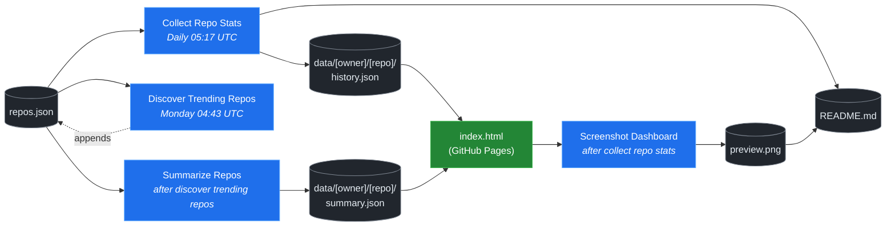

# 🚀 Rising Repos Tracker

> Automatically tracks daily GitHub stats (stars, forks, issues, velocity) for rising open source repos.

[](https://www.telosignal.com/)


**[→ View Live Dashboard](https://patrick-creates.github.io/rising-repos-tracker/)**

Built and maintained by [Telosignal](https://www.telosignal.com/).


<!-- AUTOGEN-STATS-START -->
## 📊 Current snapshot

> Auto-updated daily — last refreshed 2026-08-04

| Metric | Value |
|---|---|
| Repos tracked | **179** |
| Total stars | **8,479,222** |
| Total forks | **1,271,114** |
| Fastest growing | **ai-agent-book** (+1549.1/day) |

### 🔥 Top 5 by velocity

| # | Repo | Stars | Stars/day |
|---|---|---:|---:|
| 1 | [bojieli/ai-agent-book](https://github.com/bojieli/ai-agent-book) | 31,190 | +1549.1 |
| 2 | [DietrichGebert/ponytail](https://github.com/DietrichGebert/ponytail) | 95,318 | +1100.0 |
| 3 | [NousResearch/hermes-agent](https://github.com/NousResearch/hermes-agent) | 225,088 | +928.2 |
| 4 | [diegosouzapw/OmniRoute](https://github.com/diegosouzapw/OmniRoute) | 39,047 | +927.4 |
| 5 | [stablyai/orca](https://github.com/stablyai/orca) | 36,933 | +839.7 |

### 🆕 Recently added

- [herdrdev/herdr](https://github.com/herdrdev/herdr) — added 2026-08-03 — the runtime your coding agents live on
- [composio-community/awesome-codex-skills](https://github.com/composio-community/awesome-codex-skills) — added 2026-08-03 — A curated list of practical Codex skills for automating workflows across the Codex CLI and API.
- [NanmiCoder/cc-haha](https://github.com/NanmiCoder/cc-haha) — added 2026-08-03 — Local-first cross-platform desktop workspace for Claude Code / agents: multi-agent, Git worktrees, code diffs, skill marketplace, multi-model, Computer Use, task-aware desktop pets, with WeChat, Feishu, DingTalk, Telegram, WhatsApp and H5 access.
<!-- AUTOGEN-STATS-END -->

<!-- AUTOGEN-DIAGRAM-START -->
## 🔄 How it works


```mermaid
graph LR
    repos[("repos.json")]:::data
    history[("data/[owner]/[repo]/<br/>history.json")]:::data
    summary[("data/[owner]/[repo]/<br/>summary.json")]:::data
    readme[("README.md")]:::data
    preview[("preview.png")]:::data
    dashboard["index.html<br/>(GitHub Pages)"]:::output
    collect_yml["Collect Repo Stats<br/><i>Daily 05:17 UTC</i>"]:::workflow
    discover_yml["Discover Trending Repos<br/><i>Monday 04:43 UTC</i>"]:::workflow
    screenshot_yml["Screenshot Dashboard<br/><i>after collect repo stats</i>"]:::workflow
    summarize_yml["Summarize Repos<br/><i>after discover trending repos</i>"]:::workflow
    repos --> collect_yml
    collect_yml --> history
    collect_yml --> readme
    repos --> discover_yml
    discover_yml -.->|appends| repos
    dashboard --> screenshot_yml
    screenshot_yml --> preview
    repos --> summarize_yml
    summarize_yml --> summary
    history --> dashboard
    summary --> dashboard
    preview --> readme
    classDef workflow fill:#1f6feb,stroke:#58a6ff,color:#fff
    classDef data fill:#21262d,stroke:#7d8590,color:#e6edf3
    classDef output fill:#238636,stroke:#3fb950,color:#fff
```
<!-- AUTOGEN-DIAGRAM-END -->

<!-- AUTOGEN-WORKFLOWS-START -->
## ⚙️ Workflows

| File | Schedule | Name |
|---|---|---|
| `collect.yml` | Daily 05:17 UTC | Collect Repo Stats |
| `discover.yml` | Monday 04:43 UTC | Discover Trending Repos |
| `screenshot.yml` | After Collect Repo Stats | Screenshot Dashboard |
| `summarize.yml` | After Discover Trending Repos | Summarize Repos |

> All workflows commit results directly back to the repo. Schedules are best-effort — GitHub Actions cron can drift by a few minutes.
<!-- AUTOGEN-WORKFLOWS-END -->

<!-- AUTOGEN-REPOS-START -->
## 📋 All tracked repos

| Repo | Stars | Forks | Stars/day |
|---|---:|---:|---:|
| [openclaw/openclaw](https://github.com/openclaw/openclaw) | 385,082 | 80,946 | +164.0 |
| [obra/superpowers](https://github.com/obra/superpowers) | 265,925 | 23,778 | +705.8 |
| [affaan-m/everything-claude-code](https://github.com/affaan-m/everything-claude-code) | 237,433 | 36,090 | +679.3 |
| [affaan-m/ECC](https://github.com/affaan-m/ECC) | 237,433 | 36,090 | +636.7 |
| [NousResearch/hermes-agent](https://github.com/NousResearch/hermes-agent) | 225,088 | 43,646 | +928.2 |
| [Significant-Gravitas/AutoGPT](https://github.com/Significant-Gravitas/AutoGPT) | 185,799 | 46,054 | +18.3 |
| [microsoft/markitdown](https://github.com/microsoft/markitdown) | 171,323 | 12,462 | +582.1 |
| [f/prompts.chat](https://github.com/f/prompts.chat) | 166,713 | 21,534 | +54.7 |
| [langgenius/dify](https://github.com/langgenius/dify) | 151,282 | 23,875 | +121.2 |
| [open-webui/open-webui](https://github.com/open-webui/open-webui) | 147,789 | 21,491 | +131.3 |
| [langchain-ai/langchain](https://github.com/langchain-ai/langchain) | 143,388 | 23,883 | +81.4 |
| [github/spec-kit](https://github.com/github/spec-kit) | 125,217 | 11,192 | +329.6 |
| [farion1231/cc-switch](https://github.com/farion1231/cc-switch) | 124,129 | 8,418 | +642.1 |
| [microsoft/generative-ai-for-beginners](https://github.com/microsoft/generative-ai-for-beginners) | 115,868 | 61,483 | +61.6 |
| [nextlevelbuilder/ui-ux-pro-max-skill](https://github.com/nextlevelbuilder/ui-ux-pro-max-skill) | 113,197 | 12,110 | +425.3 |
| [Graphify-Labs/graphify](https://github.com/Graphify-Labs/graphify) | 102,031 | 9,913 | +666.6 |
| [JuliusBrussee/caveman](https://github.com/JuliusBrussee/caveman) | 95,603 | 5,488 | +437.1 |
| [DietrichGebert/ponytail](https://github.com/DietrichGebert/ponytail) | 95,318 | 5,240 | +1100.0 |
| [thedotmack/claude-mem](https://github.com/thedotmack/claude-mem) | 89,475 | 7,797 | +169.8 |
| [ChatGPTNextWeb/NextChat](https://github.com/ChatGPTNextWeb/NextChat) | 88,589 | 59,336 | +7.1 |
| [ruvnet/RuView](https://github.com/ruvnet/RuView) | 88,417 | 11,747 | +317.2 |
| [vllm-project/vllm](https://github.com/vllm-project/vllm) | 88,140 | 20,246 | +99.5 |
| [nexu-io/open-design](https://github.com/nexu-io/open-design) | 83,479 | 9,685 | +503.9 |
| [OpenHands/OpenHands](https://github.com/OpenHands/OpenHands) | 83,047 | 10,702 | +116.9 |
| [lobehub/lobehub](https://github.com/lobehub/lobehub) | 81,228 | 15,762 | +51.0 |
| [koala73/worldmonitor](https://github.com/koala73/worldmonitor) | 78,608 | 11,738 | +310.8 |
| [dair-ai/Prompt-Engineering-Guide](https://github.com/dair-ai/Prompt-Engineering-Guide) | 77,253 | 8,489 | +32.7 |
| [openai/openai-cookbook](https://github.com/openai/openai-cookbook) | 75,091 | 12,695 | +19.0 |
| [rtk-ai/rtk](https://github.com/rtk-ai/rtk) | 74,608 | 4,686 | +320.9 |
| [shareAI-lab/learn-claude-code](https://github.com/shareAI-lab/learn-claude-code) | 73,154 | 11,878 | +154.8 |
| [ComposioHQ/awesome-claude-skills](https://github.com/ComposioHQ/awesome-claude-skills) | 71,724 | 8,095 | +145.3 |
| [Leonxlnx/taste-skill](https://github.com/Leonxlnx/taste-skill) | 71,386 | 4,899 | +640.2 |
| [datawhalechina/hello-agents](https://github.com/datawhalechina/hello-agents) | 70,587 | 8,798 | +255.5 |
| [unslothai/unsloth](https://github.com/unslothai/unsloth) | 69,504 | 6,274 | +64.2 |
| [code-yeongyu/oh-my-openagent](https://github.com/code-yeongyu/oh-my-openagent) | 67,179 | 5,483 | +113.5 |
| [xtekky/gpt4free](https://github.com/xtekky/gpt4free) | 66,524 | 13,535 | +3.6 |
| [Panniantong/Agent-Reach](https://github.com/Panniantong/Agent-Reach) | 66,057 | 5,477 | +747.0 |
| [chopratejas/headroom](https://github.com/chopratejas/headroom) | 64,484 | 4,904 | +726.4 |
| [headroomlabs-ai/headroom](https://github.com/headroomlabs-ai/headroom) | 64,484 | 4,904 | +432.1 |
| [shanraisshan/claude-code-best-practice](https://github.com/shanraisshan/claude-code-best-practice) | 63,964 | 6,370 | +134.2 |
| [Fission-AI/OpenSpec](https://github.com/Fission-AI/OpenSpec) | 63,700 | 4,407 | +191.2 |
| [santifer/career-ops](https://github.com/santifer/career-ops) | 62,701 | 12,358 | +223.8 |
| [asgeirtj/system_prompts_leaks](https://github.com/asgeirtj/system_prompts_leaks) | 62,229 | 10,202 | +280.1 |
| [tw93/Pake](https://github.com/tw93/Pake) | 60,439 | 12,309 | +149.5 |
| [ZhuLinsen/daily_stock_analysis](https://github.com/ZhuLinsen/daily_stock_analysis) | 59,995 | 51,360 | +298.0 |
| [MemPalace/mempalace](https://github.com/MemPalace/mempalace) | 58,035 | 7,458 | +72.2 |
| [mvanhorn/last30days-skill](https://github.com/mvanhorn/last30days-skill) | 57,149 | 4,939 | +429.4 |
| [BerriAI/litellm](https://github.com/BerriAI/litellm) | 55,490 | 10,304 | +103.9 |
| [FlowiseAI/Flowise](https://github.com/FlowiseAI/Flowise) | 55,135 | 24,821 | +28.7 |
| [ggml-org/whisper.cpp](https://github.com/ggml-org/whisper.cpp) | 52,562 | 6,004 | +35.1 |
| [hesreallyhim/awesome-claude-code](https://github.com/hesreallyhim/awesome-claude-code) | 51,617 | 4,495 | +96.4 |
| [jamiepine/voicebox](https://github.com/jamiepine/voicebox) | 48,909 | 6,006 | +310.7 |
| [ChromeDevTools/chrome-devtools-mcp](https://github.com/ChromeDevTools/chrome-devtools-mcp) | 48,496 | 3,347 | +110.4 |
| [Aider-AI/aider](https://github.com/Aider-AI/aider) | 47,916 | 4,813 | +37.9 |
| [usestrix/strix](https://github.com/usestrix/strix) | 47,534 | 5,032 | +341.0 |
| [elder-plinius/CL4R1T4S](https://github.com/elder-plinius/CL4R1T4S) | 46,638 | 9,500 | +154.9 |
| [HKUDS/nanobot](https://github.com/HKUDS/nanobot) | 46,597 | 8,245 | +50.2 |
| [zhayujie/CowAgent](https://github.com/zhayujie/CowAgent) | 46,298 | 10,292 | +22.3 |
| [router-for-me/CLIProxyAPI](https://github.com/router-for-me/CLIProxyAPI) | 46,117 | 7,169 | +160.2 |
| [rohitg00/ai-engineering-from-scratch](https://github.com/rohitg00/ai-engineering-from-scratch) | 45,828 | 7,890 | +304.1 |
| [calesthio/OpenMontage](https://github.com/calesthio/OpenMontage) | 44,999 | 5,530 | +476.3 |
| [sickn33/antigravity-awesome-skills](https://github.com/sickn33/antigravity-awesome-skills) | 44,391 | 6,525 | +80.5 |
| [sickn33/agentic-awesome-skills](https://github.com/sickn33/agentic-awesome-skills) | 44,391 | 6,525 | +61.3 |
| [QuantumNous/new-api](https://github.com/QuantumNous/new-api) | 44,260 | 10,408 | +125.4 |
| [kepano/obsidian-skills](https://github.com/kepano/obsidian-skills) | 44,036 | 3,149 | +158.6 |
| [coreyhaines31/marketingskills](https://github.com/coreyhaines31/marketingskills) | 42,923 | 6,763 | +179.5 |
| [danny-avila/LibreChat](https://github.com/danny-avila/LibreChat) | 41,635 | 8,583 | +58.7 |
| [chatboxai/chatbox](https://github.com/chatboxai/chatbox) | 41,301 | 4,184 | +16.7 |
| [Imbad0202/academic-research-skills](https://github.com/Imbad0202/academic-research-skills) | 40,788 | 3,258 | +136.8 |
| [Hmbown/CodeWhale](https://github.com/Hmbown/CodeWhale) | 40,426 | 3,494 | +81.1 |
| [chatanywhere/GPT_API_free](https://github.com/chatanywhere/GPT_API_free) | 39,668 | 2,676 | +21.3 |
| [mindsdb/mindshub](https://github.com/mindsdb/mindshub) | 39,517 | 6,227 | +5.3 |
| [heygen-com/hyperframes](https://github.com/heygen-com/hyperframes) | 39,394 | 3,722 | +242.7 |
| [diegosouzapw/OmniRoute](https://github.com/diegosouzapw/OmniRoute) | 39,047 | 5,152 | +927.4 |
| [langchain-ai/langgraph](https://github.com/langchain-ai/langgraph) | 38,823 | 6,547 | +79.1 |
| [AstrBotDevs/AstrBot](https://github.com/AstrBotDevs/AstrBot) | 38,553 | 2,753 | +77.6 |
| [wshobson/agents](https://github.com/wshobson/agents) | 38,467 | 4,115 | +35.6 |
| [Yeachan-Heo/oh-my-claudecode](https://github.com/Yeachan-Heo/oh-my-claudecode) | 38,315 | 3,446 | +49.2 |
| [google/langextract](https://github.com/google/langextract) | 37,962 | 2,640 | +19.8 |
| [github/awesome-copilot](https://github.com/github/awesome-copilot) | 37,415 | 4,703 | +50.8 |
| [DeusData/codebase-memory-mcp](https://github.com/DeusData/codebase-memory-mcp) | 37,355 | 2,960 | +464.6 |
| [stablyai/orca](https://github.com/stablyai/orca) | 36,933 | 2,617 | +839.7 |
| [songquanpeng/one-api](https://github.com/songquanpeng/one-api) | 36,173 | 6,776 | +27.6 |
| [PDFMathTranslate/PDFMathTranslate](https://github.com/PDFMathTranslate/PDFMathTranslate) | 35,944 | 3,211 | +27.2 |
| [anthropics/claude-plugins-official](https://github.com/anthropics/claude-plugins-official) | 33,018 | 3,732 | +62.6 |
| [agentscope-ai/QwenPaw](https://github.com/agentscope-ai/QwenPaw) | 32,666 | 2,938 | +297.8 |
| [zeroclaw-labs/zeroclaw](https://github.com/zeroclaw-labs/zeroclaw) | 32,492 | 4,865 | +12.8 |
| [iOfficeAI/AionUi](https://github.com/iOfficeAI/AionUi) | 31,370 | 3,166 | +62.8 |
| [bojieli/ai-agent-book](https://github.com/bojieli/ai-agent-book) | 31,190 | 3,340 | +1549.1 |
| [AlexsJones/llmfit](https://github.com/AlexsJones/llmfit) | 31,111 | 1,904 | +64.2 |
| [JCodesMore/ai-website-cloner-template](https://github.com/JCodesMore/ai-website-cloner-template) | 30,942 | 4,452 | +279.0 |
| [Gitlawb/openclaude](https://github.com/Gitlawb/openclaude) | 30,505 | 8,900 | +37.0 |
| [esengine/DeepSeek-Reasonix](https://github.com/esengine/DeepSeek-Reasonix) | 30,291 | 1,953 | +188.9 |
| [googleworkspace/cli](https://github.com/googleworkspace/cli) | 30,183 | 1,764 | +54.1 |
| [MadsLorentzen/ai-job-search](https://github.com/MadsLorentzen/ai-job-search) | 29,522 | 9,983 | +360.9 |
| [HKUDS/Vibe-Trading](https://github.com/HKUDS/Vibe-Trading) | 29,512 | 4,759 | +410.4 |
| [voideditor/void](https://github.com/voideditor/void) | 28,860 | 2,605 | +0.9 |
| [alibaba/page-agent](https://github.com/alibaba/page-agent) | 28,406 | 2,504 | +197.0 |
| [tirth8205/code-review-graph](https://github.com/tirth8205/code-review-graph) | 28,353 | 2,626 | +196.8 |
| [volcengine/OpenViking](https://github.com/volcengine/OpenViking) | 27,869 | 2,190 | +44.6 |
| [jackwener/OpenCLI](https://github.com/jackwener/OpenCLI) | 27,686 | 2,721 | +68.2 |
| [BloopAI/vibe-kanban](https://github.com/BloopAI/vibe-kanban) | 27,658 | 2,938 | +14.8 |
| [langchain-ai/deepagents](https://github.com/langchain-ai/deepagents) | 27,293 | 3,816 | +55.1 |
| [mukul975/Anthropic-Cybersecurity-Skills](https://github.com/mukul975/Anthropic-Cybersecurity-Skills) | 27,250 | 3,297 | +212.3 |
| [p-e-w/heretic](https://github.com/p-e-w/heretic) | 27,090 | 2,932 | +54.7 |
| [jarrodwatts/claude-hud](https://github.com/jarrodwatts/claude-hud) | 27,078 | 1,258 | +41.9 |
| [rohitg00/agentmemory](https://github.com/rohitg00/agentmemory) | 26,513 | 2,244 | +82.2 |
| [zai-org/Open-AutoGLM](https://github.com/zai-org/Open-AutoGLM) | 25,948 | 4,017 | +8.5 |
| [manaflow-ai/cmux](https://github.com/manaflow-ai/cmux) | 25,560 | 2,145 | +54.7 |
| [iOfficeAI/OfficeCLI](https://github.com/iOfficeAI/OfficeCLI) | 25,101 | 1,690 | +576.0 |
| [toon-format/toon](https://github.com/toon-format/toon) | 25,063 | 1,112 | +9.9 |
| [decolua/9router](https://github.com/decolua/9router) | 24,605 | 4,308 | +140.7 |
| [ogulcancelik/herdr](https://github.com/ogulcancelik/herdr) | 24,143 | 1,670 | +405.0 |
| [herdrdev/herdr](https://github.com/herdrdev/herdr) | 24,143 | 1,670 | +354.0 |
| [winfunc/opcode](https://github.com/winfunc/opcode) | 22,350 | 1,723 | +6.1 |
| [can1357/oh-my-pi](https://github.com/can1357/oh-my-pi) | 21,674 | 2,070 | +178.6 |
| [coze-dev/coze-studio](https://github.com/coze-dev/coze-studio) | 21,322 | 3,097 | +6.6 |
| [NirDiamant/agents-towards-production](https://github.com/NirDiamant/agents-towards-production) | 21,234 | 2,814 | +10.5 |
| [mksglu/context-mode](https://github.com/mksglu/context-mode) | 19,606 | 1,401 | +42.8 |
| [steipete/CodexBar](https://github.com/steipete/CodexBar) | 19,604 | 1,636 | +102.3 |
| [Tencent/WeKnora](https://github.com/Tencent/WeKnora) | 19,324 | 2,750 | +60.6 |
| [tanweai/pua](https://github.com/tanweai/pua) | 19,183 | 1,166 | +18.7 |
| [KKKKhazix/khazix-skills](https://github.com/KKKKhazix/khazix-skills) | 19,032 | 2,102 | +104.9 |
| [jnMetaCode/agency-agents-zh](https://github.com/jnMetaCode/agency-agents-zh) | 18,750 | 3,097 | +77.8 |
| [datawhalechina/easy-vibe](https://github.com/datawhalechina/easy-vibe) | 18,734 | 1,780 | +35.9 |
| [alibaba/open-code-review](https://github.com/alibaba/open-code-review) | 18,585 | 1,250 | +296.5 |
| [pranshuparmar/witr](https://github.com/pranshuparmar/witr) | 18,578 | 589 | +15.2 |
| [jundot/omlx](https://github.com/jundot/omlx) | 18,422 | 1,582 | +35.8 |
| [RightNow-AI/openfang](https://github.com/RightNow-AI/openfang) | 18,075 | 2,284 | +5.0 |
| [microsoft/agent-lightning](https://github.com/microsoft/agent-lightning) | 17,447 | 1,527 | +2.7 |
| [danielmiessler/LifeOS](https://github.com/danielmiessler/LifeOS) | 17,143 | 2,316 | +25.0 |
| [nesquena/hermes-webui](https://github.com/nesquena/hermes-webui) | 16,923 | 2,314 | +48.5 |
| [browser-use/browser-harness](https://github.com/browser-use/browser-harness) | 16,457 | 1,560 | +27.2 |
| [cft0808/edict](https://github.com/cft0808/edict) | 16,318 | 1,711 | +5.1 |
| [MemoriLabs/Memori](https://github.com/MemoriLabs/Memori) | 15,679 | 2,881 | +7.8 |
| [1jehuang/jcode](https://github.com/1jehuang/jcode) | 15,671 | 1,726 | +334.8 |
| [composio-community/awesome-codex-skills](https://github.com/composio-community/awesome-codex-skills) | 15,587 | 1,509 | +22.0 |
| [Anionex/banana-slides](https://github.com/Anionex/banana-slides) | 15,375 | 1,773 | +5.3 |
| [xpzouying/xiaohongshu-mcp](https://github.com/xpzouying/xiaohongshu-mcp) | 15,056 | 2,212 | +17.9 |
| [xbtlin/ai-berkshire](https://github.com/xbtlin/ai-berkshire) | 14,975 | 2,190 | +144.8 |
| [kyegomez/OpenMythos](https://github.com/kyegomez/OpenMythos) | 14,773 | 3,296 | +14.4 |
| [yusufkaraaslan/Skill_Seekers](https://github.com/yusufkaraaslan/Skill_Seekers) | 14,691 | 1,488 | +10.8 |
| [NevaMind-AI/memU](https://github.com/NevaMind-AI/memU) | 14,248 | 1,056 | +8.1 |
| [wanshuiyin/Auto-claude-code-research-in-sleep](https://github.com/wanshuiyin/Auto-claude-code-research-in-sleep) | 14,208 | 1,260 | +39.8 |
| [NanmiCoder/cc-haha](https://github.com/NanmiCoder/cc-haha) | 13,900 | 8,524 | +24.0 |
| [t8y2/dbx](https://github.com/t8y2/dbx) | 13,148 | 1,320 | +163.9 |
| [superset-sh/superset](https://github.com/superset-sh/superset) | 12,763 | 1,156 | +16.8 |
| [XiaomiMiMo/MiMo-Code](https://github.com/XiaomiMiMo/MiMo-Code) | 12,627 | 1,287 | +44.5 |
| [TencentCloud/TencentDB-Agent-Memory](https://github.com/TencentCloud/TencentDB-Agent-Memory) | 12,499 | 1,182 | +171.9 |
| [sirmalloc/ccstatusline](https://github.com/sirmalloc/ccstatusline) | 12,208 | 534 | +25.8 |
| [EverMind-AI/EverOS](https://github.com/EverMind-AI/EverOS) | 11,798 | 878 | +57.9 |
| [walkinglabs/learn-harness-engineering](https://github.com/walkinglabs/learn-harness-engineering) | 10,981 | 1,192 | +37.8 |
| [ValueCell-ai/valuecell](https://github.com/ValueCell-ai/valuecell) | 10,956 | 1,812 | +2.3 |
| [aden-hive/hive](https://github.com/aden-hive/hive) | 10,844 | 5,672 | +6.4 |
| [0x4m4/hexstrike-ai](https://github.com/0x4m4/hexstrike-ai) | 10,783 | 2,246 | +21.5 |
| [MemTensor/MemOS](https://github.com/MemTensor/MemOS) | 10,578 | 974 | +15.3 |
| [brokermr810/QuantDinger](https://github.com/brokermr810/QuantDinger) | 10,230 | 2,148 | +32.7 |
| [OpenByteInc/QuantDinger](https://github.com/OpenByteInc/QuantDinger) | 10,230 | 2,148 | +28.5 |
| [Kuberwastaken/claurst](https://github.com/Kuberwastaken/claurst) | 10,178 | 7,786 | +8.7 |
| [ConardLi/garden-skills](https://github.com/ConardLi/garden-skills) | 10,035 | 1,326 | +29.4 |
| [EKKOLearnAI/hermes-studio](https://github.com/EKKOLearnAI/hermes-studio) | 9,710 | 1,193 | +29.3 |
| [frankbria/ralph-claude-code](https://github.com/frankbria/ralph-claude-code) | 9,582 | 726 | +5.7 |
| [ykdojo/claude-code-tips](https://github.com/ykdojo/claude-code-tips) | 9,537 | 755 | +17.9 |
| [iflytek/astron-agent](https://github.com/iflytek/astron-agent) | 9,284 | 873 | +23.2 |
| [getagentseal/codeburn](https://github.com/getagentseal/codeburn) | 9,124 | 717 | +22.5 |
| [StarTrail-org/PixelRAG](https://github.com/StarTrail-org/PixelRAG) | 8,999 | 766 | +109.7 |
| [EvoMap/evolver](https://github.com/EvoMap/evolver) | 8,929 | 826 | +2.6 |
| [openai/codex-security](https://github.com/openai/codex-security) | 8,448 | 581 | +166.0 |
| [MiroMindAI/MiroThinker](https://github.com/MiroMindAI/MiroThinker) | 8,362 | 644 | +1.2 |
| [modem-dev/hunk](https://github.com/modem-dev/hunk) | 8,072 | 234 | +62.1 |
| [mmulet/term.everything](https://github.com/mmulet/term.everything) | 8,057 | 192 | +1.2 |
| [ValueCell-ai/ClawX](https://github.com/ValueCell-ai/ClawX) | 7,561 | 1,132 | +0.9 |
| [steipete/summarize](https://github.com/steipete/summarize) | 6,506 | 439 | +4.4 |
| [opensquilla/opensquilla](https://github.com/opensquilla/opensquilla) | 6,503 | 493 | +19.6 |
| [Arthur-Ficial/apfel](https://github.com/Arthur-Ficial/apfel) | 6,246 | 239 | +6.0 |
| [Andyyyy64/whichllm](https://github.com/Andyyyy64/whichllm) | 6,124 | 325 | +17.1 |
| [microsoft/fara](https://github.com/microsoft/fara) | 6,116 | 598 | +5.3 |
| [UfoMiao/zcf](https://github.com/UfoMiao/zcf) | 6,078 | 425 | +0.4 |
| [re4/LibreCode](https://github.com/re4/LibreCode) | 80 | 4 | — |
<!-- AUTOGEN-REPOS-END -->

---

## What it does

- Collects daily snapshots of stars, forks, watchers and open issues for every tracked repo
- Discovers new trending repos automatically every Monday using the GitHub Search API
- Generates AI summaries (use cases, similar tools, tags) for each tracked repo via GitHub Models
- Stores all history as plain JSON — no database, no backend
- Renders a live dashboard via GitHub Pages — updates daily, zero maintenance

## Tracked repos

Data lives in [`data/`](./data) — one folder per repo, one `history.json` per entry.  
The full watch list is in [`repos.json`](./repos.json).

## Fork & use it for yourself

This is my personal tracker — the watch list reflects what I find interesting. If you want to track different repos, the best path is to **fork this repo and run your own**.

### Setup

1. Fork this repo to your account
2. Replace the contents of [`repos.json`](./repos.json) with the repos you want to track (or just leave one entry — `discover.yml` will auto-add more every Monday)
3. Go to **Settings → Pages** and enable GitHub Pages from the `main` branch
4. Go to **Actions** and run **Collect Repo Stats** once manually to seed your first data point
5. Your dashboard will be live at `https://YOUR-USERNAME.github.io/rising-repos-tracker/`

That's it — daily collection and weekly discovery run automatically on schedule. Zero ongoing maintenance.

### Customizing what gets discovered

Edit [`scripts/discover.js`](./scripts/discover.js) to change:

- `MIN_STARS` — minimum star threshold for candidates
- `MAX_AGE_DAYS` — how recent a repo must be
- `MAX_NEW_REPOS` — how many to add per discovery run
- The `queries` array — GitHub Search API queries that define what "trending" means to you

### Adding a repo manually

Just edit `repos.json` directly:

```json
{
  "owner": "OWNER",
  "repo": "REPO",
  "added": "YYYY-MM-DD",
  "notes": "why you're tracking this"
}
```

The next daily collect run picks it up automatically.

## Stack

- **GitHub Actions** — scheduling and automation
- **GitHub Pages** — dashboard hosting
- **GitHub API** — data source
- **GitHub Models** — free AI summaries (gpt-4o-mini)
- **Chart.js** — star growth visualization
- **Mermaid** — architecture diagram (rendered by GitHub)
- No dependencies, no build step, no database

## License

MIT
