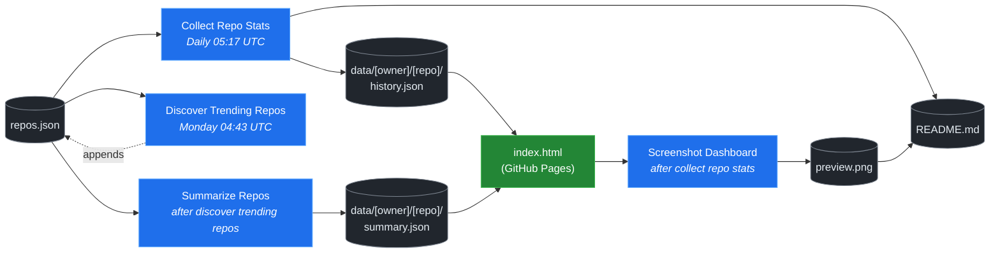

# 🚀 Rising Repos Tracker

> Automatically tracks daily GitHub stats (stars, forks, issues, velocity) for rising open source repos.

[](https://www.telosignal.com/)


**[→ View Live Dashboard](https://patrick-creates.github.io/rising-repos-tracker/)**

Built and maintained by [Telosignal](https://www.telosignal.com/).


<!-- AUTOGEN-STATS-START -->
## 📊 Current snapshot

> Auto-updated daily — last refreshed 2026-09-12

| Metric | Value |
|---|---|
| Repos tracked | **194** |
| Total stars | **9,585,093** |
| Total forks | **1,406,263** |
| Fastest growing | **ponytail** (+1074.5/day) |

### 🔥 Top 5 by velocity

| # | Repo | Stars | Stars/day |
|---|---|---:|---:|
| 1 | [DietrichGebert/ponytail](https://github.com/DietrichGebert/ponytail) | 136,130 | +1074.5 |
| 2 | [stablyai/orca](https://github.com/stablyai/orca) | 67,003 | +800.3 |
| 3 | [NousResearch/hermes-agent](https://github.com/NousResearch/hermes-agent) | 244,735 | +792.5 |
| 4 | [diegosouzapw/OmniRoute](https://github.com/diegosouzapw/OmniRoute) | 65,027 | +777.6 |
| 5 | [bojieli/ai-agent-book](https://github.com/bojieli/ai-agent-book) | 45,979 | +704.2 |

### 🆕 Recently added

- [career-ops-hq/career-ops](https://github.com/career-ops-hq/career-ops) — added 2026-09-07 — Open-source AI job search: scan job portals, evaluate listings into a structured A-H report with a global 1-5 score, tailor your CV, track applications — runs locally in your AI coding CLI (Claude Code, Codex, OpenCode, Antigravity…)
- [K-Dense-AI/scientific-agent-skills](https://github.com/K-Dense-AI/scientific-agent-skills) — added 2026-09-07 — Turn any AI agent into an AI Scientist. The #1 Agent Skills library for science, used by 190,000+ scientists worldwide. 165 ready-to-use validated skills plus 100+ scientific databases covering biology, chemistry, medicine, and drug discovery. Compatible with Cursor, Claude Code, Codex, Pi, Antigravity, and the open Agent Skills standard.
- [Hmbown/Codewhale](https://github.com/Hmbown/Codewhale) — added 2026-09-07 — Open-source coding agent for your terminal, built in Rust and on a journey of continuous community improvement. Issues and PRs welcome.
<!-- AUTOGEN-STATS-END -->

<!-- AUTOGEN-DIAGRAM-START -->
## 🔄 How it works


```mermaid
graph LR
    repos[("repos.json")]:::data
    history[("data/[owner]/[repo]/<br/>history.json")]:::data
    summary[("data/[owner]/[repo]/<br/>summary.json")]:::data
    readme[("README.md")]:::data
    preview[("preview.png")]:::data
    dashboard["index.html<br/>(GitHub Pages)"]:::output
    collect_yml["Collect Repo Stats<br/><i>Daily 05:17 UTC</i>"]:::workflow
    discover_yml["Discover Trending Repos<br/><i>Monday 04:43 UTC</i>"]:::workflow
    screenshot_yml["Screenshot Dashboard<br/><i>after collect repo stats</i>"]:::workflow
    summarize_yml["Summarize Repos<br/><i>after discover trending repos</i>"]:::workflow
    repos --> collect_yml
    collect_yml --> history
    collect_yml --> readme
    repos --> discover_yml
    discover_yml -.->|appends| repos
    dashboard --> screenshot_yml
    screenshot_yml --> preview
    repos --> summarize_yml
    summarize_yml --> summary
    history --> dashboard
    summary --> dashboard
    preview --> readme
    classDef workflow fill:#1f6feb,stroke:#58a6ff,color:#fff
    classDef data fill:#21262d,stroke:#7d8590,color:#e6edf3
    classDef output fill:#238636,stroke:#3fb950,color:#fff
```
<!-- AUTOGEN-DIAGRAM-END -->

<!-- AUTOGEN-WORKFLOWS-START -->
## ⚙️ Workflows

| File | Schedule | Name |
|---|---|---|
| `collect.yml` | Daily 05:17 UTC | Collect Repo Stats |
| `discover.yml` | Monday 04:43 UTC | Discover Trending Repos |
| `screenshot.yml` | After Collect Repo Stats | Screenshot Dashboard |
| `summarize.yml` | After Discover Trending Repos | Summarize Repos |

> All workflows commit results directly back to the repo. Schedules are best-effort — GitHub Actions cron can drift by a few minutes.
<!-- AUTOGEN-WORKFLOWS-END -->

<!-- AUTOGEN-REPOS-START -->
## 📋 All tracked repos

| Repo | Stars | Forks | Stars/day |
|---|---:|---:|---:|
| [openclaw/openclaw](https://github.com/openclaw/openclaw) | 389,481 | 81,875 | +147.6 |
| [obra/superpowers](https://github.com/obra/superpowers) | 285,536 | 25,543 | +609.3 |
| [affaan-m/everything-claude-code](https://github.com/affaan-m/everything-claude-code) | 256,731 | 38,421 | +620.4 |
| [affaan-m/ECC](https://github.com/affaan-m/ECC) | 256,731 | 38,421 | +586.4 |
| [NousResearch/hermes-agent](https://github.com/NousResearch/hermes-agent) | 244,735 | 50,747 | +792.5 |
| [Significant-Gravitas/AutoGPT](https://github.com/Significant-Gravitas/AutoGPT) | 187,277 | 46,021 | +24.6 |
| [microsoft/markitdown](https://github.com/microsoft/markitdown) | 182,825 | 13,445 | +490.3 |
| [f/prompts.chat](https://github.com/f/prompts.chat) | 170,051 | 21,865 | +64.6 |
| [langgenius/dify](https://github.com/langgenius/dify) | 155,483 | 24,559 | +116.9 |
| [open-webui/open-webui](https://github.com/open-webui/open-webui) | 151,716 | 22,197 | +121.5 |
| [langchain-ai/langchain](https://github.com/langchain-ai/langchain) | 146,176 | 24,418 | +78.2 |
| [DietrichGebert/ponytail](https://github.com/DietrichGebert/ponytail) | 136,130 | 7,300 | +1074.5 |
| [github/spec-kit](https://github.com/github/spec-kit) | 135,888 | 12,208 | +311.7 |
| [farion1231/cc-switch](https://github.com/farion1231/cc-switch) | 132,445 | 9,134 | +499.2 |
| [nextlevelbuilder/ui-ux-pro-max-skill](https://github.com/nextlevelbuilder/ui-ux-pro-max-skill) | 127,010 | 13,559 | +402.6 |
| [microsoft/generative-ai-for-beginners](https://github.com/microsoft/generative-ai-for-beginners) | 119,586 | 62,974 | +72.4 |
| [Graphify-Labs/graphify](https://github.com/Graphify-Labs/graphify) | 117,090 | 11,339 | +433.9 |
| [JuliusBrussee/caveman](https://github.com/JuliusBrussee/caveman) | 105,124 | 6,090 | +372.8 |
| [nexu-io/open-design](https://github.com/nexu-io/open-design) | 95,686 | 11,089 | +440.3 |
| [thedotmack/claude-mem](https://github.com/thedotmack/claude-mem) | 93,707 | 8,248 | +150.2 |
| [ruvnet/RuView](https://github.com/ruvnet/RuView) | 93,081 | 12,336 | +247.2 |
| [vllm-project/vllm](https://github.com/vllm-project/vllm) | 91,548 | 22,095 | +95.6 |
| [ChatGPTNextWeb/NextChat](https://github.com/ChatGPTNextWeb/NextChat) | 88,747 | 59,096 | +6.1 |
| [OpenHands/OpenHands](https://github.com/OpenHands/OpenHands) | 87,589 | 11,470 | +116.7 |
| [Leonxlnx/taste-skill](https://github.com/Leonxlnx/taste-skill) | 86,393 | 5,896 | +543.5 |
| [koala73/worldmonitor](https://github.com/koala73/worldmonitor) | 86,102 | 13,056 | +271.2 |
| [lobehub/lobehub](https://github.com/lobehub/lobehub) | 82,420 | 15,878 | +44.4 |
| [rtk-ai/rtk](https://github.com/rtk-ai/rtk) | 80,034 | 5,070 | +260.3 |
| [Panniantong/Agent-Reach](https://github.com/Panniantong/Agent-Reach) | 79,547 | 6,861 | +584.1 |
| [datawhalechina/hello-agents](https://github.com/datawhalechina/hello-agents) | 78,506 | 9,748 | +238.0 |
| [dair-ai/Prompt-Engineering-Guide](https://github.com/dair-ai/Prompt-Engineering-Guide) | 78,226 | 8,592 | +30.1 |
| [shareAI-lab/learn-claude-code](https://github.com/shareAI-lab/learn-claude-code) | 76,593 | 12,325 | +132.6 |
| [unslothai/unsloth](https://github.com/unslothai/unsloth) | 76,053 | 6,930 | +98.7 |
| [openai/openai-cookbook](https://github.com/openai/openai-cookbook) | 75,936 | 12,853 | +19.9 |
| [ComposioHQ/awesome-claude-skills](https://github.com/ComposioHQ/awesome-claude-skills) | 74,899 | 8,647 | +124.0 |
| [chopratejas/headroom](https://github.com/chopratejas/headroom) | 71,652 | 5,491 | +488.6 |
| [headroomlabs-ai/headroom](https://github.com/headroomlabs-ai/headroom) | 71,652 | 5,491 | +314.0 |
| [career-ops-hq/career-ops](https://github.com/career-ops-hq/career-ops) | 71,317 | 13,460 | +187.0 |
| [santifer/career-ops](https://github.com/santifer/career-ops) | 71,316 | 13,460 | +222.8 |
| [code-yeongyu/oh-my-openagent](https://github.com/code-yeongyu/oh-my-openagent) | 68,958 | 5,669 | +90.9 |
| [Fission-AI/OpenSpec](https://github.com/Fission-AI/OpenSpec) | 68,046 | 4,673 | +164.6 |
| [stablyai/orca](https://github.com/stablyai/orca) | 67,003 | 4,397 | +800.3 |
| [xtekky/gpt4free](https://github.com/xtekky/gpt4free) | 66,684 | 13,513 | +3.8 |
| [shanraisshan/claude-code-best-practice](https://github.com/shanraisshan/claude-code-best-practice) | 65,850 | 6,541 | +105.6 |
| [diegosouzapw/OmniRoute](https://github.com/diegosouzapw/OmniRoute) | 65,027 | 9,095 | +777.6 |
| [ZhuLinsen/daily_stock_analysis](https://github.com/ZhuLinsen/daily_stock_analysis) | 64,956 | 54,408 | +237.4 |
| [asgeirtj/system_prompts_leaks](https://github.com/asgeirtj/system_prompts_leaks) | 64,951 | 10,677 | +210.0 |
| [usestrix/strix](https://github.com/usestrix/strix) | 61,992 | 6,787 | +352.3 |
| [mvanhorn/last30days-skill](https://github.com/mvanhorn/last30days-skill) | 61,869 | 5,397 | +304.1 |
| [tw93/Pake](https://github.com/tw93/Pake) | 61,388 | 12,635 | +107.8 |
| [MemPalace/mempalace](https://github.com/MemPalace/mempalace) | 59,010 | 7,567 | +56.5 |
| [BerriAI/litellm](https://github.com/BerriAI/litellm) | 58,550 | 11,373 | +95.4 |
| [calesthio/OpenMontage](https://github.com/calesthio/OpenMontage) | 57,626 | 7,255 | +397.0 |
| [FlowiseAI/Flowise](https://github.com/FlowiseAI/Flowise) | 55,456 | 24,996 | +21.8 |
| [rohitg00/ai-engineering-from-scratch](https://github.com/rohitg00/ai-engineering-from-scratch) | 54,312 | 9,473 | +271.3 |
| [hesreallyhim/awesome-claude-code](https://github.com/hesreallyhim/awesome-claude-code) | 53,914 | 4,693 | +83.9 |
| [ggml-org/whisper.cpp](https://github.com/ggml-org/whisper.cpp) | 53,615 | 6,141 | +32.4 |
| [jamiepine/voicebox](https://github.com/jamiepine/voicebox) | 53,030 | 6,627 | +233.1 |
| [ChromeDevTools/chrome-devtools-mcp](https://github.com/ChromeDevTools/chrome-devtools-mcp) | 51,717 | 3,633 | +101.1 |
| [router-for-me/CLIProxyAPI](https://github.com/router-for-me/CLIProxyAPI) | 51,510 | 7,808 | +152.4 |
| [coreyhaines31/marketingskills](https://github.com/coreyhaines31/marketingskills) | 49,695 | 7,552 | +177.3 |
| [elder-plinius/CL4R1T4S](https://github.com/elder-plinius/CL4R1T4S) | 49,617 | 10,207 | +120.5 |
| [heygen-com/hyperframes](https://github.com/heygen-com/hyperframes) | 49,085 | 4,485 | +245.0 |
| [Aider-AI/aider](https://github.com/Aider-AI/aider) | 48,913 | 4,946 | +33.8 |
| [kepano/obsidian-skills](https://github.com/kepano/obsidian-skills) | 48,198 | 3,437 | +139.0 |
| [HKUDS/nanobot](https://github.com/HKUDS/nanobot) | 48,046 | 8,495 | +45.9 |
| [QuantumNous/new-api](https://github.com/QuantumNous/new-api) | 47,953 | 11,465 | +114.5 |
| [Imbad0202/academic-research-skills](https://github.com/Imbad0202/academic-research-skills) | 47,719 | 3,721 | +170.7 |
| [zhayujie/CowAgent](https://github.com/zhayujie/CowAgent) | 46,920 | 10,347 | +20.2 |
| [sickn33/antigravity-awesome-skills](https://github.com/sickn33/antigravity-awesome-skills) | 46,305 | 6,751 | +69.3 |
| [sickn33/agentic-awesome-skills](https://github.com/sickn33/agentic-awesome-skills) | 46,305 | 6,751 | +53.5 |
| [bojieli/ai-agent-book](https://github.com/bojieli/ai-agent-book) | 45,979 | 5,143 | +704.2 |
| [K-Dense-AI/scientific-agent-skills](https://github.com/K-Dense-AI/scientific-agent-skills) | 44,525 | 4,036 | +209.8 |
| [danny-avila/LibreChat](https://github.com/danny-avila/LibreChat) | 43,054 | 8,936 | +50.8 |
| [DeusData/codebase-memory-mcp](https://github.com/DeusData/codebase-memory-mcp) | 43,000 | 3,505 | +298.3 |
| [chatanywhere/GPT_API_free](https://github.com/chatanywhere/GPT_API_free) | 42,367 | 2,720 | +38.3 |
| [MadsLorentzen/ai-job-search](https://github.com/MadsLorentzen/ai-job-search) | 41,906 | 14,431 | +333.2 |
| [chatboxai/chatbox](https://github.com/chatboxai/chatbox) | 41,731 | 4,247 | +14.8 |
| [langchain-ai/langgraph](https://github.com/langchain-ai/langgraph) | 41,509 | 7,011 | +74.3 |
| [Hmbown/CodeWhale](https://github.com/Hmbown/CodeWhale) | 40,952 | 3,559 | +57.1 |
| [Hmbown/Codewhale](https://github.com/Hmbown/Codewhale) | 40,952 | 3,559 | +7.2 |
| [AstrBotDevs/AstrBot](https://github.com/AstrBotDevs/AstrBot) | 40,390 | 2,909 | +66.0 |
| [mindsdb/mindshub](https://github.com/mindsdb/mindshub) | 39,727 | 6,242 | +5.3 |
| [tinyhumansai/openhuman](https://github.com/tinyhumansai/openhuman) | 39,684 | 3,914 | +39.0 |
| [wshobson/agents](https://github.com/wshobson/agents) | 39,577 | 4,218 | +33.1 |
| [Yeachan-Heo/oh-my-claudecode](https://github.com/Yeachan-Heo/oh-my-claudecode) | 39,110 | 3,501 | +39.0 |
| [github/awesome-copilot](https://github.com/github/awesome-copilot) | 38,921 | 4,933 | +46.5 |
| [google/langextract](https://github.com/google/langextract) | 38,569 | 2,705 | +18.3 |
| [ogulcancelik/herdr](https://github.com/ogulcancelik/herdr) | 37,853 | 2,793 | +374.4 |
| [herdrdev/herdr](https://github.com/herdrdev/herdr) | 37,853 | 2,793 | +351.6 |
| [PDFMathTranslate/PDFMathTranslate](https://github.com/PDFMathTranslate/PDFMathTranslate) | 36,868 | 3,313 | +25.9 |
| [songquanpeng/one-api](https://github.com/songquanpeng/one-api) | 36,860 | 6,857 | +24.1 |
| [volcengine/OpenViking](https://github.com/volcengine/OpenViking) | 36,768 | 2,814 | +119.2 |
| [anthropics/claude-plugins-official](https://github.com/anthropics/claude-plugins-official) | 36,158 | 4,059 | +69.4 |
| [AlexsJones/llmfit](https://github.com/AlexsJones/llmfit) | 36,146 | 2,285 | +88.8 |
| [esengine/DeepSeek-Reasonix](https://github.com/esengine/DeepSeek-Reasonix) | 35,508 | 2,391 | +166.5 |
| [agentscope-ai/QwenPaw](https://github.com/agentscope-ai/QwenPaw) | 34,829 | 3,092 | +191.6 |
| [JCodesMore/ai-website-cloner-template](https://github.com/JCodesMore/ai-website-cloner-template) | 34,268 | 4,992 | +194.1 |
| [HKUDS/Vibe-Trading](https://github.com/HKUDS/Vibe-Trading) | 33,271 | 5,420 | +247.1 |
| [Gitlawb/openclaude](https://github.com/Gitlawb/openclaude) | 33,184 | 9,080 | +49.0 |
| [zeroclaw-labs/zeroclaw](https://github.com/zeroclaw-labs/zeroclaw) | 32,771 | 4,939 | +10.6 |
| [iOfficeAI/AionUi](https://github.com/iOfficeAI/AionUi) | 32,769 | 3,376 | +52.6 |
| [mukul975/Anthropic-Cybersecurity-Skills](https://github.com/mukul975/Anthropic-Cybersecurity-Skills) | 32,652 | 3,935 | +177.2 |
| [tirth8205/code-review-graph](https://github.com/tirth8205/code-review-graph) | 31,342 | 2,852 | +144.1 |
| [p-e-w/heretic](https://github.com/p-e-w/heretic) | 31,205 | 3,488 | +75.3 |
| [googleworkspace/cli](https://github.com/googleworkspace/cli) | 30,949 | 1,828 | +41.1 |
| [can1357/oh-my-pi](https://github.com/can1357/oh-my-pi) | 30,768 | 3,186 | +204.5 |
| [iOfficeAI/OfficeCLI](https://github.com/iOfficeAI/OfficeCLI) | 30,469 | 2,079 | +324.6 |
| [virgiliojr94/book-to-skill](https://github.com/virgiliojr94/book-to-skill) | 30,147 | 3,130 | +279.9 |
| [langchain-ai/deepagents](https://github.com/langchain-ai/deepagents) | 29,333 | 4,105 | +53.9 |
| [jackwener/OpenCLI](https://github.com/jackwener/OpenCLI) | 29,216 | 2,861 | +56.4 |
| [alibaba/page-agent](https://github.com/alibaba/page-agent) | 29,054 | 2,593 | +117.9 |
| [voideditor/void](https://github.com/voideditor/void) | 28,800 | 2,648 | — |
| [decolua/9router](https://github.com/decolua/9router) | 28,494 | 5,170 | +122.7 |
| [rohitg00/agentmemory](https://github.com/rohitg00/agentmemory) | 28,362 | 2,456 | +68.1 |
| [BloopAI/vibe-kanban](https://github.com/BloopAI/vibe-kanban) | 28,060 | 3,004 | +13.1 |
| [jarrodwatts/claude-hud](https://github.com/jarrodwatts/claude-hud) | 27,932 | 1,296 | +33.8 |
| [manaflow-ai/cmux](https://github.com/manaflow-ai/cmux) | 27,037 | 2,343 | +44.0 |
| [TencentCloud/TencentDB-Agent-Memory](https://github.com/TencentCloud/TencentDB-Agent-Memory) | 26,387 | 2,482 | +289.7 |
| [zai-org/Open-AutoGLM](https://github.com/zai-org/Open-AutoGLM) | 26,209 | 4,031 | +7.8 |
| [toon-format/toon](https://github.com/toon-format/toon) | 25,365 | 1,118 | +9.1 |
| [pascalorg/editor](https://github.com/pascalorg/editor) | 23,785 | 2,952 | +76.8 |
| [debpalash/VoiceStudio](https://github.com/debpalash/VoiceStudio) | 22,694 | 2,791 | +495.0 |
| [Tencent/WeKnora](https://github.com/Tencent/WeKnora) | 22,483 | 3,231 | +69.6 |
| [winfunc/opcode](https://github.com/winfunc/opcode) | 22,400 | 1,723 | +4.1 |
| [alibaba/open-code-review](https://github.com/alibaba/open-code-review) | 22,363 | 1,665 | +182.0 |
| [mksglu/context-mode](https://github.com/mksglu/context-mode) | 22,258 | 1,606 | +53.8 |
| [pranshuparmar/witr](https://github.com/pranshuparmar/witr) | 22,206 | 772 | +55.7 |
| [guillaumemeyer/watermarks-remover](https://github.com/guillaumemeyer/watermarks-remover) | 21,767 | 2,506 | +221.8 |
| [jundot/omlx](https://github.com/jundot/omlx) | 21,647 | 1,859 | +56.3 |
| [coze-dev/coze-studio](https://github.com/coze-dev/coze-studio) | 21,579 | 3,116 | +6.6 |
| [NirDiamant/agents-towards-production](https://github.com/NirDiamant/agents-towards-production) | 21,447 | 2,848 | +8.5 |
| [steipete/CodexBar](https://github.com/steipete/CodexBar) | 21,289 | 1,889 | +74.2 |
| [KKKKhazix/khazix-skills](https://github.com/KKKKhazix/khazix-skills) | 20,603 | 2,196 | +58.2 |
| [jnMetaCode/agency-agents-zh](https://github.com/jnMetaCode/agency-agents-zh) | 20,597 | 3,326 | +63.3 |
| [tanweai/pua](https://github.com/tanweai/pua) | 19,632 | 1,197 | +15.6 |
| [1jehuang/jcode](https://github.com/1jehuang/jcode) | 19,527 | 2,254 | +184.0 |
| [datawhalechina/easy-vibe](https://github.com/datawhalechina/easy-vibe) | 19,376 | 1,857 | +27.4 |
| [t8y2/dbx](https://github.com/t8y2/dbx) | 19,218 | 1,862 | +157.0 |
| [danielmiessler/LifeOS](https://github.com/danielmiessler/LifeOS) | 18,989 | 2,466 | +35.6 |
| [nesquena/hermes-webui](https://github.com/nesquena/hermes-webui) | 18,273 | 2,569 | +41.9 |
| [RightNow-AI/openfang](https://github.com/RightNow-AI/openfang) | 18,176 | 2,295 | +3.9 |
| [microsoft/agent-lightning](https://github.com/microsoft/agent-lightning) | 18,068 | 1,583 | +8.5 |
| [jlcodes99/cockpit-tools](https://github.com/jlcodes99/cockpit-tools) | 17,528 | 1,555 | +62.3 |
| [browser-use/browser-harness](https://github.com/browser-use/browser-harness) | 17,495 | 1,713 | +26.9 |
| [cft0808/edict](https://github.com/cft0808/edict) | 16,867 | 1,766 | +9.0 |
| [MemoriLabs/Memori](https://github.com/MemoriLabs/Memori) | 16,649 | 3,426 | +15.9 |
| [composio-community/awesome-codex-skills](https://github.com/composio-community/awesome-codex-skills) | 16,393 | 1,611 | +20.7 |
| [xbtlin/ai-berkshire](https://github.com/xbtlin/ai-berkshire) | 16,291 | 2,431 | +81.1 |
| [wanshuiyin/Auto-claude-code-research-in-sleep](https://github.com/wanshuiyin/Auto-claude-code-research-in-sleep) | 16,039 | 1,375 | +43.5 |
| [xpzouying/xiaohongshu-mcp](https://github.com/xpzouying/xiaohongshu-mcp) | 15,749 | 2,315 | +17.8 |
| [Anionex/banana-slides](https://github.com/Anionex/banana-slides) | 15,591 | 1,784 | +5.5 |
| [walkinglabs/learn-harness-engineering](https://github.com/walkinglabs/learn-harness-engineering) | 15,114 | 1,507 | +76.9 |
| [yusufkaraaslan/Skill_Seekers](https://github.com/yusufkaraaslan/Skill_Seekers) | 14,956 | 1,522 | +8.9 |
| [kyegomez/OpenMythos](https://github.com/kyegomez/OpenMythos) | 14,897 | 3,294 | +9.0 |
| [NevaMind-AI/memU](https://github.com/NevaMind-AI/memU) | 14,404 | 1,066 | +6.1 |
| [NanmiCoder/cc-haha](https://github.com/NanmiCoder/cc-haha) | 14,349 | 8,538 | +11.8 |
| [superset-sh/superset](https://github.com/superset-sh/superset) | 14,109 | 1,262 | +26.0 |
| [ifixai-ai/iFixAi](https://github.com/ifixai-ai/iFixAi) | 14,009 | 1,314 | +176.8 |
| [XiaomiMiMo/MiMo-Code](https://github.com/XiaomiMiMo/MiMo-Code) | 13,079 | 1,352 | +27.4 |
| [EverMind-AI/EverOS](https://github.com/EverMind-AI/EverOS) | 12,896 | 919 | +42.4 |
| [sirmalloc/ccstatusline](https://github.com/sirmalloc/ccstatusline) | 12,846 | 565 | +20.9 |
| [ConardLi/garden-skills](https://github.com/ConardLi/garden-skills) | 12,359 | 1,495 | +46.7 |
| [0x4m4/hexstrike-ai](https://github.com/0x4m4/hexstrike-ai) | 11,835 | 2,434 | +24.3 |
| [brokermr810/QuantDinger](https://github.com/brokermr810/QuantDinger) | 11,549 | 2,398 | +33.3 |
| [OpenByteInc/QuantDinger](https://github.com/OpenByteInc/QuantDinger) | 11,549 | 2,398 | +32.4 |
| [MemTensor/MemOS](https://github.com/MemTensor/MemOS) | 11,292 | 1,035 | +16.9 |
| [holaboss-ai/holaOS](https://github.com/holaboss-ai/holaOS) | 11,219 | 723 | +109.5 |
| [aden-hive/hive](https://github.com/aden-hive/hive) | 11,038 | 5,666 | +5.7 |
| [EKKOLearnAI/hermes-studio](https://github.com/EKKOLearnAI/hermes-studio) | 11,027 | 1,332 | +31.9 |
| [ValueCell-ai/valuecell](https://github.com/ValueCell-ai/valuecell) | 11,006 | 1,800 | +1.8 |
| [getagentseal/codeburn](https://github.com/getagentseal/codeburn) | 10,975 | 825 | +36.8 |
| [openai/codex-security](https://github.com/openai/codex-security) | 10,657 | 781 | +59.4 |
| [Kuberwastaken/claurst](https://github.com/Kuberwastaken/claurst) | 10,300 | 7,744 | +5.8 |
| [ykdojo/claude-code-tips](https://github.com/ykdojo/claude-code-tips) | 10,073 | 813 | +15.5 |
| [StarTrail-org/PixelRAG](https://github.com/StarTrail-org/PixelRAG) | 9,942 | 854 | +55.0 |
| [frankbria/ralph-claude-code](https://github.com/frankbria/ralph-claude-code) | 9,625 | 719 | +4.2 |
| [modem-dev/hunk](https://github.com/modem-dev/hunk) | 9,233 | 293 | +41.4 |
| [EvoMap/evolver](https://github.com/EvoMap/evolver) | 9,065 | 843 | +3.1 |
| [iflytek/astron-agent](https://github.com/iflytek/astron-agent) | 8,992 | 877 | +5.6 |
| [MiroMindAI/MiroThinker](https://github.com/MiroMindAI/MiroThinker) | 8,377 | 642 | +0.8 |
| [mmulet/term.everything](https://github.com/mmulet/term.everything) | 8,100 | 194 | +1.1 |
| [ValueCell-ai/ClawX](https://github.com/ValueCell-ai/ClawX) | 7,616 | 1,145 | +1.2 |
| [1weiho/open-slide](https://github.com/1weiho/open-slide) | 7,561 | 540 | +43.7 |
| [rorkai/App-Store-Connect-CLI](https://github.com/rorkai/App-Store-Connect-CLI) | 7,210 | 602 | +62.4 |
| [opensquilla/opensquilla](https://github.com/opensquilla/opensquilla) | 7,012 | 564 | +14.9 |
| [TokenRhythm/opensquilla](https://github.com/TokenRhythm/opensquilla) | 7,012 | 564 | +8.8 |
| [WenyuChiou/awesome-agentic-ai-zh](https://github.com/WenyuChiou/awesome-agentic-ai-zh) | 6,799 | 928 | +20.7 |
| [Andyyyy64/whichllm](https://github.com/Andyyyy64/whichllm) | 6,621 | 360 | +14.0 |
| [steipete/summarize](https://github.com/steipete/summarize) | 6,617 | 444 | +3.4 |
| [Arthur-Ficial/apfel](https://github.com/Arthur-Ficial/apfel) | 6,372 | 243 | +4.2 |
| [microsoft/fara](https://github.com/microsoft/fara) | 6,175 | 603 | +2.9 |
| [UfoMiao/zcf](https://github.com/UfoMiao/zcf) | 6,082 | 421 | +0.2 |
| [re4/LibreCode](https://github.com/re4/LibreCode) | 86 | 4 | — |
<!-- AUTOGEN-REPOS-END -->

---

## What it does

- Collects daily snapshots of stars, forks, watchers and open issues for every tracked repo
- Discovers new trending repos automatically every Monday using the GitHub Search API
- Generates AI summaries (use cases, similar tools, tags) for each tracked repo via GitHub Models
- Stores all history as plain JSON — no database, no backend
- Renders a live dashboard via GitHub Pages — updates daily, zero maintenance

## Tracked repos

Data lives in [`data/`](./data) — one folder per repo, one `history.json` per entry.  
The full watch list is in [`repos.json`](./repos.json).

## Fork & use it for yourself

This is my personal tracker — the watch list reflects what I find interesting. If you want to track different repos, the best path is to **fork this repo and run your own**.

### Setup

1. Fork this repo to your account
2. Replace the contents of [`repos.json`](./repos.json) with the repos you want to track (or just leave one entry — `discover.yml` will auto-add more every Monday)
3. Go to **Settings → Pages** and enable GitHub Pages from the `main` branch
4. Go to **Actions** and run **Collect Repo Stats** once manually to seed your first data point
5. Your dashboard will be live at `https://YOUR-USERNAME.github.io/rising-repos-tracker/`

That's it — daily collection and weekly discovery run automatically on schedule. Zero ongoing maintenance.

### Customizing what gets discovered

Edit [`scripts/discover.js`](./scripts/discover.js) to change:

- `MIN_STARS` — minimum star threshold for candidates
- `MAX_AGE_DAYS` — how recent a repo must be
- `MAX_NEW_REPOS` — how many to add per discovery run
- The `queries` array — GitHub Search API queries that define what "trending" means to you

### Adding a repo manually

Just edit `repos.json` directly:

```json
{
  "owner": "OWNER",
  "repo": "REPO",
  "added": "YYYY-MM-DD",
  "notes": "why you're tracking this"
}
```

The next daily collect run picks it up automatically.

## Stack

- **GitHub Actions** — scheduling and automation
- **GitHub Pages** — dashboard hosting
- **GitHub API** — data source
- **GitHub Models** — free AI summaries (gpt-4o-mini)
- **Chart.js** — star growth visualization
- **Mermaid** — architecture diagram (rendered by GitHub)
- No dependencies, no build step, no database

## License

MIT
