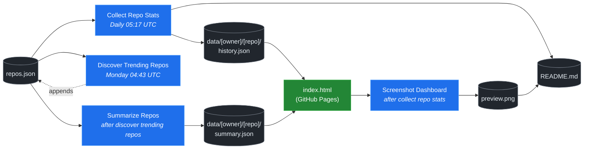

# 🚀 Rising Repos Tracker

> Automatically tracks daily GitHub stats (stars, forks, issues, velocity) for rising open source repos.

[](https://www.telosignal.com/)


**[→ View Live Dashboard](https://patrick-creates.github.io/rising-repos-tracker/)**

Built and maintained by [Telosignal](https://www.telosignal.com/).


<!-- AUTOGEN-STATS-START -->
## 📊 Current snapshot

> Auto-updated daily — last refreshed 2026-07-26

| Metric | Value |
|---|---|
| Repos tracked | **171** |
| Total stars | **8,053,626** |
| Total forks | **1,217,475** |
| Fastest growing | **ai-agent-book** (+2028.3/day) |

### 🔥 Top 5 by velocity

| # | Repo | Stars | Stars/day |
|---|---|---:|---:|
| 1 | [bojieli/ai-agent-book](https://github.com/bojieli/ai-agent-book) | 20,123 | +2028.3 |
| 2 | [DietrichGebert/ponytail](https://github.com/DietrichGebert/ponytail) | 89,469 | +1219.1 |
| 3 | [NousResearch/hermes-agent](https://github.com/NousResearch/hermes-agent) | 220,609 | +980.6 |
| 4 | [diegosouzapw/OmniRoute](https://github.com/diegosouzapw/OmniRoute) | 30,274 | +906.1 |
| 5 | [chopratejas/headroom](https://github.com/chopratejas/headroom) | 62,467 | +836.7 |

### 🆕 Recently added

- [KKKKhazix/khazix-skills](https://github.com/KKKKhazix/khazix-skills) — added 2026-07-20 — 数字生命卡兹克开源的 AI Skills 合集 | Agent Skills: neat-freak 洁癖 (docs/memory closeout), hv-analysis, khazix-writer & more — Claude Code, Codex & 40+ agents
- [OpenByteInc/QuantDinger](https://github.com/OpenByteInc/QuantDinger) — added 2026-07-20 — AI quantitative trading platform for crypto, stocks, and forex with backtesting, live trading, market data, and multi-agent research.vibe-trading ,trading-agents,ai-trader,ai-trading
- [bojieli/ai-agent-book](https://github.com/bojieli/ai-agent-book) — added 2026-07-20 — 《深入理解 AI Agent：设计原理与工程实践》（李博杰 著）开源主仓库：全书正文、编译版 PDF 与按章配套代码
<!-- AUTOGEN-STATS-END -->

<!-- AUTOGEN-DIAGRAM-START -->
## 🔄 How it works


```mermaid
graph LR
    repos[("repos.json")]:::data
    history[("data/[owner]/[repo]/<br/>history.json")]:::data
    summary[("data/[owner]/[repo]/<br/>summary.json")]:::data
    readme[("README.md")]:::data
    preview[("preview.png")]:::data
    dashboard["index.html<br/>(GitHub Pages)"]:::output
    collect_yml["Collect Repo Stats<br/><i>Daily 05:17 UTC</i>"]:::workflow
    discover_yml["Discover Trending Repos<br/><i>Monday 04:43 UTC</i>"]:::workflow
    screenshot_yml["Screenshot Dashboard<br/><i>after collect repo stats</i>"]:::workflow
    summarize_yml["Summarize Repos<br/><i>after discover trending repos</i>"]:::workflow
    repos --> collect_yml
    collect_yml --> history
    collect_yml --> readme
    repos --> discover_yml
    discover_yml -.->|appends| repos
    dashboard --> screenshot_yml
    screenshot_yml --> preview
    repos --> summarize_yml
    summarize_yml --> summary
    history --> dashboard
    summary --> dashboard
    preview --> readme
    classDef workflow fill:#1f6feb,stroke:#58a6ff,color:#fff
    classDef data fill:#21262d,stroke:#7d8590,color:#e6edf3
    classDef output fill:#238636,stroke:#3fb950,color:#fff
```
<!-- AUTOGEN-DIAGRAM-END -->

<!-- AUTOGEN-WORKFLOWS-START -->
## ⚙️ Workflows

| File | Schedule | Name |
|---|---|---|
| `collect.yml` | Daily 05:17 UTC | Collect Repo Stats |
| `discover.yml` | Monday 04:43 UTC | Discover Trending Repos |
| `screenshot.yml` | After Collect Repo Stats | Screenshot Dashboard |
| `summarize.yml` | After Discover Trending Repos | Summarize Repos |

> All workflows commit results directly back to the repo. Schedules are best-effort — GitHub Actions cron can drift by a few minutes.
<!-- AUTOGEN-WORKFLOWS-END -->

<!-- AUTOGEN-REPOS-START -->
## 📋 All tracked repos

| Repo | Stars | Forks | Stars/day |
|---|---:|---:|---:|
| [openclaw/openclaw](https://github.com/openclaw/openclaw) | 384,150 | 80,717 | +171.3 |
| [obra/superpowers](https://github.com/obra/superpowers) | 261,249 | 23,316 | +755.1 |
| [affaan-m/everything-claude-code](https://github.com/affaan-m/everything-claude-code) | 233,421 | 35,592 | +707.7 |
| [affaan-m/ECC](https://github.com/affaan-m/ECC) | 233,421 | 35,592 | +664.4 |
| [NousResearch/hermes-agent](https://github.com/NousResearch/hermes-agent) | 220,609 | 42,006 | +980.6 |
| [Significant-Gravitas/AutoGPT](https://github.com/Significant-Gravitas/AutoGPT) | 185,691 | 46,069 | +19.1 |
| [microsoft/markitdown](https://github.com/microsoft/markitdown) | 169,057 | 12,217 | +622.3 |
| [f/prompts.chat](https://github.com/f/prompts.chat) | 166,375 | 21,495 | +56.8 |
| [langgenius/dify](https://github.com/langgenius/dify) | 150,267 | 23,677 | +122.2 |
| [open-webui/open-webui](https://github.com/open-webui/open-webui) | 146,755 | 21,317 | +133.3 |
| [langchain-ai/langchain](https://github.com/langchain-ai/langchain) | 142,605 | 23,738 | +80.7 |
| [github/spec-kit](https://github.com/github/spec-kit) | 123,839 | 11,056 | +351.1 |
| [farion1231/cc-switch](https://github.com/farion1231/cc-switch) | 121,230 | 8,146 | +683.9 |
| [microsoft/generative-ai-for-beginners](https://github.com/microsoft/generative-ai-for-beginners) | 113,510 | 60,932 | +37.3 |
| [nextlevelbuilder/ui-ux-pro-max-skill](https://github.com/nextlevelbuilder/ui-ux-pro-max-skill) | 110,187 | 11,752 | +436.4 |
| [JuliusBrussee/caveman](https://github.com/JuliusBrussee/caveman) | 93,033 | 5,301 | +456.8 |
| [DietrichGebert/ponytail](https://github.com/DietrichGebert/ponytail) | 89,469 | 4,908 | +1219.1 |
| [thedotmack/claude-mem](https://github.com/thedotmack/claude-mem) | 88,579 | 7,693 | +178.4 |
| [ChatGPTNextWeb/NextChat](https://github.com/ChatGPTNextWeb/NextChat) | 88,548 | 59,371 | +7.4 |
| [vllm-project/vllm](https://github.com/vllm-project/vllm) | 87,175 | 19,869 | +98.5 |
| [ruvnet/RuView](https://github.com/ruvnet/RuView) | 86,453 | 11,502 | +331.6 |
| [OpenHands/OpenHands](https://github.com/OpenHands/OpenHands) | 82,097 | 10,509 | +118.3 |
| [nexu-io/open-design](https://github.com/nexu-io/open-design) | 81,593 | 9,432 | +542.3 |
| [lobehub/lobehub](https://github.com/lobehub/lobehub) | 80,812 | 15,700 | +51.5 |
| [dair-ai/Prompt-Engineering-Guide](https://github.com/dair-ai/Prompt-Engineering-Guide) | 76,978 | 8,460 | +33.0 |
| [openai/openai-cookbook](https://github.com/openai/openai-cookbook) | 74,902 | 12,668 | +18.7 |
| [koala73/worldmonitor](https://github.com/koala73/worldmonitor) | 74,316 | 11,156 | +289.1 |
| [rtk-ai/rtk](https://github.com/rtk-ai/rtk) | 73,272 | 4,572 | +343.4 |
| [shareAI-lab/learn-claude-code](https://github.com/shareAI-lab/learn-claude-code) | 72,235 | 11,714 | +161.7 |
| [ComposioHQ/awesome-claude-skills](https://github.com/ComposioHQ/awesome-claude-skills) | 70,743 | 7,951 | +150.1 |
| [unslothai/unsloth](https://github.com/unslothai/unsloth) | 68,904 | 6,206 | +63.8 |
| [datawhalechina/hello-agents](https://github.com/datawhalechina/hello-agents) | 68,620 | 8,545 | +260.3 |
| [Leonxlnx/taste-skill](https://github.com/Leonxlnx/taste-skill) | 67,698 | 4,688 | +677.9 |
| [code-yeongyu/oh-my-openagent](https://github.com/code-yeongyu/oh-my-openagent) | 66,604 | 5,430 | +119.9 |
| [xtekky/gpt4free](https://github.com/xtekky/gpt4free) | 66,492 | 13,529 | +3.6 |
| [shanraisshan/claude-code-best-practice](https://github.com/shanraisshan/claude-code-best-practice) | 63,504 | 6,332 | +145.0 |
| [Fission-AI/OpenSpec](https://github.com/Fission-AI/OpenSpec) | 62,583 | 4,328 | +199.9 |
| [chopratejas/headroom](https://github.com/chopratejas/headroom) | 62,467 | 4,721 | +836.7 |
| [headroomlabs-ai/headroom](https://github.com/headroomlabs-ai/headroom) | 62,467 | 4,721 | +487.2 |
| [santifer/career-ops](https://github.com/santifer/career-ops) | 61,580 | 12,133 | +236.7 |
| [Panniantong/Agent-Reach](https://github.com/Panniantong/Agent-Reach) | 60,895 | 4,935 | +779.5 |
| [asgeirtj/system_prompts_leaks](https://github.com/asgeirtj/system_prompts_leaks) | 60,543 | 9,877 | +292.1 |
| [tw93/Pake](https://github.com/tw93/Pake) | 60,221 | 12,216 | +165.8 |
| [ZhuLinsen/daily_stock_analysis](https://github.com/ZhuLinsen/daily_stock_analysis) | 58,857 | 50,490 | +322.9 |
| [MemPalace/mempalace](https://github.com/MemPalace/mempalace) | 57,745 | 7,433 | +77.5 |
| [FlowiseAI/Flowise](https://github.com/FlowiseAI/Flowise) | 54,928 | 24,760 | +29.4 |
| [BerriAI/litellm](https://github.com/BerriAI/litellm) | 54,709 | 10,072 | +106.1 |
| [mvanhorn/last30days-skill](https://github.com/mvanhorn/last30days-skill) | 53,672 | 4,657 | +437.5 |
| [ggml-org/whisper.cpp](https://github.com/ggml-org/whisper.cpp) | 52,304 | 5,892 | +35.9 |
| [hesreallyhim/awesome-claude-code](https://github.com/hesreallyhim/awesome-claude-code) | 50,953 | 4,441 | +99.4 |
| [Aider-AI/aider](https://github.com/Aider-AI/aider) | 47,703 | 4,770 | +39.7 |
| [ChromeDevTools/chrome-devtools-mcp](https://github.com/ChromeDevTools/chrome-devtools-mcp) | 47,617 | 3,209 | +112.1 |
| [jamiepine/voicebox](https://github.com/jamiepine/voicebox) | 46,800 | 5,735 | +323.2 |
| [elder-plinius/CL4R1T4S](https://github.com/elder-plinius/CL4R1T4S) | 46,266 | 9,435 | +179.9 |
| [HKUDS/nanobot](https://github.com/HKUDS/nanobot) | 46,238 | 8,182 | +51.6 |
| [zhayujie/CowAgent](https://github.com/zhayujie/CowAgent) | 46,127 | 10,276 | +22.8 |
| [router-for-me/CLIProxyAPI](https://github.com/router-for-me/CLIProxyAPI) | 44,958 | 7,011 | +164.7 |
| [usestrix/strix](https://github.com/usestrix/strix) | 44,267 | 4,600 | +337.4 |
| [sickn33/antigravity-awesome-skills](https://github.com/sickn33/antigravity-awesome-skills) | 43,918 | 6,484 | +84.5 |
| [sickn33/agentic-awesome-skills](https://github.com/sickn33/agentic-awesome-skills) | 43,918 | 6,484 | +67.4 |
| [rohitg00/ai-engineering-from-scratch](https://github.com/rohitg00/ai-engineering-from-scratch) | 43,559 | 7,300 | +312.7 |
| [QuantumNous/new-api](https://github.com/QuantumNous/new-api) | 43,423 | 10,129 | +130.1 |
| [kepano/obsidian-skills](https://github.com/kepano/obsidian-skills) | 43,310 | 3,085 | +171.4 |
| [calesthio/OpenMontage](https://github.com/calesthio/OpenMontage) | 42,333 | 5,058 | +536.4 |
| [coreyhaines31/marketingskills](https://github.com/coreyhaines31/marketingskills) | 41,722 | 6,565 | +187.0 |
| [danny-avila/LibreChat](https://github.com/danny-avila/LibreChat) | 41,284 | 8,498 | +61.5 |
| [chatboxai/chatbox](https://github.com/chatboxai/chatbox) | 41,140 | 4,160 | +16.6 |
| [Hmbown/CodeWhale](https://github.com/Hmbown/CodeWhale) | 40,119 | 3,462 | +87.9 |
| [mindsdb/mindshub](https://github.com/mindsdb/mindshub) | 39,496 | 6,224 | +7.3 |
| [chatanywhere/GPT_API_free](https://github.com/chatanywhere/GPT_API_free) | 39,005 | 2,672 | +13.7 |
| [wshobson/agents](https://github.com/wshobson/agents) | 38,235 | 4,094 | +37.1 |
| [langchain-ai/langgraph](https://github.com/langchain-ai/langgraph) | 38,154 | 6,410 | +80.4 |
| [AstrBotDevs/AstrBot](https://github.com/AstrBotDevs/AstrBot) | 38,097 | 2,698 | +82.0 |
| [Yeachan-Heo/oh-my-claudecode](https://github.com/Yeachan-Heo/oh-my-claudecode) | 38,075 | 3,433 | +52.4 |
| [google/langextract](https://github.com/google/langextract) | 37,844 | 2,625 | +20.8 |
| [heygen-com/hyperframes](https://github.com/heygen-com/hyperframes) | 37,695 | 3,556 | +252.8 |
| [github/awesome-copilot](https://github.com/github/awesome-copilot) | 37,042 | 4,644 | +52.2 |
| [songquanpeng/one-api](https://github.com/songquanpeng/one-api) | 35,951 | 6,756 | +28.1 |
| [PDFMathTranslate/PDFMathTranslate](https://github.com/PDFMathTranslate/PDFMathTranslate) | 35,796 | 3,186 | +28.7 |
| [DeusData/codebase-memory-mcp](https://github.com/DeusData/codebase-memory-mcp) | 35,404 | 2,761 | +547.2 |
| [anthropics/claude-plugins-official](https://github.com/anthropics/claude-plugins-official) | 32,673 | 3,666 | +66.6 |
| [zeroclaw-labs/zeroclaw](https://github.com/zeroclaw-labs/zeroclaw) | 32,396 | 4,843 | +13.1 |
| [iOfficeAI/AionUi](https://github.com/iOfficeAI/AionUi) | 30,858 | 3,103 | +63.8 |
| [AlexsJones/llmfit](https://github.com/AlexsJones/llmfit) | 30,642 | 1,869 | +66.2 |
| [Gitlawb/openclaude](https://github.com/Gitlawb/openclaude) | 30,355 | 8,891 | +40.4 |
| [diegosouzapw/OmniRoute](https://github.com/diegosouzapw/OmniRoute) | 30,274 | 3,948 | +906.1 |
| [JCodesMore/ai-website-cloner-template](https://github.com/JCodesMore/ai-website-cloner-template) | 30,222 | 4,345 | +322.7 |
| [googleworkspace/cli](https://github.com/googleworkspace/cli) | 30,008 | 1,753 | +59.8 |
| [stablyai/orca](https://github.com/stablyai/orca) | 29,193 | 2,075 | +830.5 |
| [voideditor/void](https://github.com/voideditor/void) | 28,876 | 2,601 | +1.3 |
| [alibaba/page-agent](https://github.com/alibaba/page-agent) | 27,844 | 2,454 | +226.5 |
| [esengine/DeepSeek-Reasonix](https://github.com/esengine/DeepSeek-Reasonix) | 27,784 | 1,784 | +172.0 |
| [HKUDS/Vibe-Trading](https://github.com/HKUDS/Vibe-Trading) | 27,644 | 4,500 | +478.0 |
| [BloopAI/vibe-kanban](https://github.com/BloopAI/vibe-kanban) | 27,513 | 2,920 | +14.6 |
| [volcengine/OpenViking](https://github.com/volcengine/OpenViking) | 27,233 | 2,139 | +39.7 |
| [jackwener/OpenCLI](https://github.com/jackwener/OpenCLI) | 27,225 | 2,681 | +71.4 |
| [agentscope-ai/QwenPaw](https://github.com/agentscope-ai/QwenPaw) | 27,058 | 2,859 | +226.3 |
| [MadsLorentzen/ai-job-search](https://github.com/MadsLorentzen/ai-job-search) | 26,955 | 8,802 | +413.2 |
| [jarrodwatts/claude-hud](https://github.com/jarrodwatts/claude-hud) | 26,808 | 1,241 | +44.1 |
| [langchain-ai/deepagents](https://github.com/langchain-ai/deepagents) | 26,808 | 3,751 | +55.3 |
| [p-e-w/heretic](https://github.com/p-e-w/heretic) | 26,755 | 2,915 | +58.0 |
| [mukul975/Anthropic-Cybersecurity-Skills](https://github.com/mukul975/Anthropic-Cybersecurity-Skills) | 26,588 | 3,222 | +249.0 |
| [tirth8205/code-review-graph](https://github.com/tirth8205/code-review-graph) | 26,458 | 2,471 | +193.8 |
| [zai-org/Open-AutoGLM](https://github.com/zai-org/Open-AutoGLM) | 25,870 | 4,012 | +8.5 |
| [rohitg00/agentmemory](https://github.com/rohitg00/agentmemory) | 25,784 | 2,144 | +82.5 |
| [manaflow-ai/cmux](https://github.com/manaflow-ai/cmux) | 25,138 | 2,078 | +60.2 |
| [toon-format/toon](https://github.com/toon-format/toon) | 24,989 | 1,109 | +10.3 |
| [decolua/9router](https://github.com/decolua/9router) | 23,587 | 3,994 | +146.7 |
| [winfunc/opcode](https://github.com/winfunc/opcode) | 22,223 | 1,713 | +4.5 |
| [iOfficeAI/OfficeCLI](https://github.com/iOfficeAI/OfficeCLI) | 22,215 | 1,493 | +690.9 |
| [coze-dev/coze-studio](https://github.com/coze-dev/coze-studio) | 21,254 | 3,086 | +6.4 |
| [NirDiamant/agents-towards-production](https://github.com/NirDiamant/agents-towards-production) | 21,178 | 2,816 | +11.3 |
| [ogulcancelik/herdr](https://github.com/ogulcancelik/herdr) | 20,883 | 1,395 | +424.3 |
| [bojieli/ai-agent-book](https://github.com/bojieli/ai-agent-book) | 20,123 | 2,006 | +2028.3 |
| [can1357/oh-my-pi](https://github.com/can1357/oh-my-pi) | 19,769 | 1,859 | +169.8 |
| [mksglu/context-mode](https://github.com/mksglu/context-mode) | 19,329 | 1,363 | +45.4 |
| [steipete/CodexBar](https://github.com/steipete/CodexBar) | 19,037 | 1,576 | +112.8 |
| [tanweai/pua](https://github.com/tanweai/pua) | 19,036 | 1,155 | +19.3 |
| [Tencent/WeKnora](https://github.com/Tencent/WeKnora) | 18,909 | 2,651 | +63.8 |
| [datawhalechina/easy-vibe](https://github.com/datawhalechina/easy-vibe) | 18,526 | 1,763 | +38.7 |
| [jnMetaCode/agency-agents-zh](https://github.com/jnMetaCode/agency-agents-zh) | 18,325 | 3,057 | +85.9 |
| [pranshuparmar/witr](https://github.com/pranshuparmar/witr) | 18,309 | 574 | +10.3 |
| [jundot/omlx](https://github.com/jundot/omlx) | 18,185 | 1,553 | +37.9 |
| [RightNow-AI/openfang](https://github.com/RightNow-AI/openfang) | 18,059 | 2,281 | +5.7 |
| [KKKKhazix/khazix-skills](https://github.com/KKKKhazix/khazix-skills) | 17,941 | 2,017 | +80.5 |
| [microsoft/agent-lightning](https://github.com/microsoft/agent-lightning) | 17,425 | 1,526 | +2.8 |
| [danielmiessler/LifeOS](https://github.com/danielmiessler/LifeOS) | 16,929 | 2,294 | +25.4 |
| [nesquena/hermes-webui](https://github.com/nesquena/hermes-webui) | 16,533 | 2,224 | +49.9 |
| [cft0808/edict](https://github.com/cft0808/edict) | 16,276 | 1,710 | +5.2 |
| [browser-use/browser-harness](https://github.com/browser-use/browser-harness) | 16,260 | 1,540 | +28.9 |
| [MemoriLabs/Memori](https://github.com/MemoriLabs/Memori) | 15,662 | 2,880 | +9.4 |
| [xpzouying/xiaohongshu-mcp](https://github.com/xpzouying/xiaohongshu-mcp) | 14,860 | 2,190 | +16.9 |
| [kyegomez/OpenMythos](https://github.com/kyegomez/OpenMythos) | 14,760 | 3,301 | +17.8 |
| [yusufkaraaslan/Skill_Seekers](https://github.com/yusufkaraaslan/Skill_Seekers) | 14,563 | 1,477 | +9.9 |
| [xbtlin/ai-berkshire](https://github.com/xbtlin/ai-berkshire) | 14,107 | 1,990 | +166.5 |
| [NevaMind-AI/memU](https://github.com/NevaMind-AI/memU) | 14,061 | 1,043 | +4.7 |
| [wanshuiyin/Auto-claude-code-research-in-sleep](https://github.com/wanshuiyin/Auto-claude-code-research-in-sleep) | 13,870 | 1,240 | +40.6 |
| [alibaba/open-code-review](https://github.com/alibaba/open-code-review) | 13,201 | 898 | +160.7 |
| [superset-sh/superset](https://github.com/superset-sh/superset) | 12,614 | 1,124 | +16.8 |
| [XiaomiMiMo/MiMo-Code](https://github.com/XiaomiMiMo/MiMo-Code) | 12,454 | 1,266 | +53.0 |
| [sirmalloc/ccstatusline](https://github.com/sirmalloc/ccstatusline) | 12,004 | 528 | +26.8 |
| [EverMind-AI/EverOS](https://github.com/EverMind-AI/EverOS) | 11,541 | 869 | +67.6 |
| [1jehuang/jcode](https://github.com/1jehuang/jcode) | 11,517 | 1,271 | +247.1 |
| [ValueCell-ai/valuecell](https://github.com/ValueCell-ai/valuecell) | 10,949 | 1,814 | +2.9 |
| [aden-hive/hive](https://github.com/aden-hive/hive) | 10,770 | 5,668 | +5.9 |
| [walkinglabs/learn-harness-engineering](https://github.com/walkinglabs/learn-harness-engineering) | 10,714 | 1,164 | +41.5 |
| [0x4m4/hexstrike-ai](https://github.com/0x4m4/hexstrike-ai) | 10,487 | 2,183 | +17.7 |
| [MemTensor/MemOS](https://github.com/MemTensor/MemOS) | 10,378 | 947 | +13.0 |
| [Kuberwastaken/claurst](https://github.com/Kuberwastaken/claurst) | 10,139 | 7,778 | +10.1 |
| [brokermr810/QuantDinger](https://github.com/brokermr810/QuantDinger) | 9,991 | 2,098 | +35.4 |
| [OpenByteInc/QuantDinger](https://github.com/OpenByteInc/QuantDinger) | 9,991 | 2,098 | +31.5 |
| [ConardLi/garden-skills](https://github.com/ConardLi/garden-skills) | 9,799 | 1,296 | +30.9 |
| [frankbria/ralph-claude-code](https://github.com/frankbria/ralph-claude-code) | 9,564 | 730 | +6.1 |
| [EKKOLearnAI/hermes-studio](https://github.com/EKKOLearnAI/hermes-studio) | 9,490 | 1,161 | +31.5 |
| [ykdojo/claude-code-tips](https://github.com/ykdojo/claude-code-tips) | 9,443 | 748 | +21.3 |
| [iflytek/astron-agent](https://github.com/iflytek/astron-agent) | 9,389 | 874 | +39.0 |
| [TencentCloud/TencentDB-Agent-Memory](https://github.com/TencentCloud/TencentDB-Agent-Memory) | 9,282 | 884 | +43.4 |
| [getagentseal/codeburn](https://github.com/getagentseal/codeburn) | 8,934 | 698 | +23.1 |
| [EvoMap/evolver](https://github.com/EvoMap/evolver) | 8,879 | 823 | +1.2 |
| [MiroMindAI/MiroThinker](https://github.com/MiroMindAI/MiroThinker) | 8,353 | 646 | +1.4 |
| [mmulet/term.everything](https://github.com/mmulet/term.everything) | 8,053 | 192 | +1.7 |
| [modem-dev/hunk](https://github.com/modem-dev/hunk) | 7,744 | 222 | +79.9 |
| [ValueCell-ai/ClawX](https://github.com/ValueCell-ai/ClawX) | 7,550 | 1,128 | +0.7 |
| [StarTrail-org/PixelRAG](https://github.com/StarTrail-org/PixelRAG) | 7,227 | 601 | +49.4 |
| [steipete/summarize](https://github.com/steipete/summarize) | 6,480 | 439 | +5.4 |
| [opensquilla/opensquilla](https://github.com/opensquilla/opensquilla) | 6,341 | 478 | +22.0 |
| [Arthur-Ficial/apfel](https://github.com/Arthur-Ficial/apfel) | 6,198 | 237 | +6.4 |
| [UfoMiao/zcf](https://github.com/UfoMiao/zcf) | 6,079 | 424 | +0.7 |
| [microsoft/fara](https://github.com/microsoft/fara) | 6,041 | 588 | +3.2 |
| [Andyyyy64/whichllm](https://github.com/Andyyyy64/whichllm) | 5,994 | 317 | +21.2 |
| [re4/LibreCode](https://github.com/re4/LibreCode) | 78 | 4 | — |
<!-- AUTOGEN-REPOS-END -->

---

## What it does

- Collects daily snapshots of stars, forks, watchers and open issues for every tracked repo
- Discovers new trending repos automatically every Monday using the GitHub Search API
- Generates AI summaries (use cases, similar tools, tags) for each tracked repo via GitHub Models
- Stores all history as plain JSON — no database, no backend
- Renders a live dashboard via GitHub Pages — updates daily, zero maintenance

## Tracked repos

Data lives in [`data/`](./data) — one folder per repo, one `history.json` per entry.  
The full watch list is in [`repos.json`](./repos.json).

## Fork & use it for yourself

This is my personal tracker — the watch list reflects what I find interesting. If you want to track different repos, the best path is to **fork this repo and run your own**.

### Setup

1. Fork this repo to your account
2. Replace the contents of [`repos.json`](./repos.json) with the repos you want to track (or just leave one entry — `discover.yml` will auto-add more every Monday)
3. Go to **Settings → Pages** and enable GitHub Pages from the `main` branch
4. Go to **Actions** and run **Collect Repo Stats** once manually to seed your first data point
5. Your dashboard will be live at `https://YOUR-USERNAME.github.io/rising-repos-tracker/`

That's it — daily collection and weekly discovery run automatically on schedule. Zero ongoing maintenance.

### Customizing what gets discovered

Edit [`scripts/discover.js`](./scripts/discover.js) to change:

- `MIN_STARS` — minimum star threshold for candidates
- `MAX_AGE_DAYS` — how recent a repo must be
- `MAX_NEW_REPOS` — how many to add per discovery run
- The `queries` array — GitHub Search API queries that define what "trending" means to you

### Adding a repo manually

Just edit `repos.json` directly:

```json
{
  "owner": "OWNER",
  "repo": "REPO",
  "added": "YYYY-MM-DD",
  "notes": "why you're tracking this"
}
```

The next daily collect run picks it up automatically.

## Stack

- **GitHub Actions** — scheduling and automation
- **GitHub Pages** — dashboard hosting
- **GitHub API** — data source
- **GitHub Models** — free AI summaries (gpt-4o-mini)
- **Chart.js** — star growth visualization
- **Mermaid** — architecture diagram (rendered by GitHub)
- No dependencies, no build step, no database

## License

MIT
