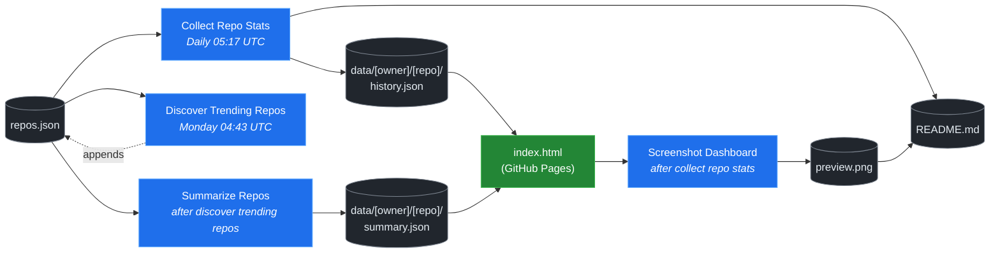

# 🚀 Rising Repos Tracker

> Automatically tracks daily GitHub stats (stars, forks, issues, velocity) for rising open source repos.

[](https://www.telosignal.com/)


**[→ View Live Dashboard](https://patrick-creates.github.io/rising-repos-tracker/)**

Built and maintained by [Telosignal](https://www.telosignal.com/).


<!-- AUTOGEN-STATS-START -->
## 📊 Current snapshot

> Auto-updated daily — last refreshed 2026-09-06

| Metric | Value |
|---|---|
| Repos tracked | **187** |
| Total stars | **9,227,708** |
| Total forks | **1,363,472** |
| Fastest growing | **ponytail** (+1058.6/day) |

### 🔥 Top 5 by velocity

| # | Repo | Stars | Stars/day |
|---|---|---:|---:|
| 1 | [DietrichGebert/ponytail](https://github.com/DietrichGebert/ponytail) | 128,470 | +1058.6 |
| 2 | [NousResearch/hermes-agent](https://github.com/NousResearch/hermes-agent) | 242,172 | +811.4 |
| 3 | [stablyai/orca](https://github.com/stablyai/orca) | 62,435 | +804.1 |
| 4 | [diegosouzapw/OmniRoute](https://github.com/diegosouzapw/OmniRoute) | 61,762 | +800.2 |
| 5 | [bojieli/ai-agent-book](https://github.com/bojieli/ai-agent-book) | 44,888 | +769.5 |

### 🆕 Recently added

- [WenyuChiou/awesome-agentic-ai-zh](https://github.com/WenyuChiou/awesome-agentic-ai-zh) — added 2026-08-31 — A trilingual (繁中 / English / 简中) learning roadmap for agentic AI: from LLM basics to multi-agent systems, with 240+ curated resources and hands-on examples. 中文 AI agent 學習地圖。
- [virgiliojr94/book-to-skill](https://github.com/virgiliojr94/book-to-skill) — added 2026-08-24 — Turn any technical book PDF into a Claude Code skill — ready to study, reference, and use while you work.
- [guillaumemeyer/watermarks-remover](https://github.com/guillaumemeyer/watermarks-remover) — added 2026-08-24 — Strip multi-vendor AI provenance marks: Unicode text hygiene, statistical rewrite hooks, and C2PA/metadata from PNG/JPEG/SVG/PDF/DOCX/HTML/MD
<!-- AUTOGEN-STATS-END -->

<!-- AUTOGEN-DIAGRAM-START -->
## 🔄 How it works


```mermaid
graph LR
    repos[("repos.json")]:::data
    history[("data/[owner]/[repo]/<br/>history.json")]:::data
    summary[("data/[owner]/[repo]/<br/>summary.json")]:::data
    readme[("README.md")]:::data
    preview[("preview.png")]:::data
    dashboard["index.html<br/>(GitHub Pages)"]:::output
    collect_yml["Collect Repo Stats<br/><i>Daily 05:17 UTC</i>"]:::workflow
    discover_yml["Discover Trending Repos<br/><i>Monday 04:43 UTC</i>"]:::workflow
    screenshot_yml["Screenshot Dashboard<br/><i>after collect repo stats</i>"]:::workflow
    summarize_yml["Summarize Repos<br/><i>after discover trending repos</i>"]:::workflow
    repos --> collect_yml
    collect_yml --> history
    collect_yml --> readme
    repos --> discover_yml
    discover_yml -.->|appends| repos
    dashboard --> screenshot_yml
    screenshot_yml --> preview
    repos --> summarize_yml
    summarize_yml --> summary
    history --> dashboard
    summary --> dashboard
    preview --> readme
    classDef workflow fill:#1f6feb,stroke:#58a6ff,color:#fff
    classDef data fill:#21262d,stroke:#7d8590,color:#e6edf3
    classDef output fill:#238636,stroke:#3fb950,color:#fff
```
<!-- AUTOGEN-DIAGRAM-END -->

<!-- AUTOGEN-WORKFLOWS-START -->
## ⚙️ Workflows

| File | Schedule | Name |
|---|---|---|
| `collect.yml` | Daily 05:17 UTC | Collect Repo Stats |
| `discover.yml` | Monday 04:43 UTC | Discover Trending Repos |
| `screenshot.yml` | After Collect Repo Stats | Screenshot Dashboard |
| `summarize.yml` | After Discover Trending Repos | Summarize Repos |

> All workflows commit results directly back to the repo. Schedules are best-effort — GitHub Actions cron can drift by a few minutes.
<!-- AUTOGEN-WORKFLOWS-END -->

<!-- AUTOGEN-REPOS-START -->
## 📋 All tracked repos

| Repo | Stars | Forks | Stars/day |
|---|---:|---:|---:|
| [openclaw/openclaw](https://github.com/openclaw/openclaw) | 388,999 | 81,735 | +151.1 |
| [obra/superpowers](https://github.com/obra/superpowers) | 282,205 | 25,280 | +613.5 |
| [affaan-m/everything-claude-code](https://github.com/affaan-m/everything-claude-code) | 250,339 | 37,662 | +597.3 |
| [affaan-m/ECC](https://github.com/affaan-m/ECC) | 250,339 | 37,662 | +558.8 |
| [NousResearch/hermes-agent](https://github.com/NousResearch/hermes-agent) | 242,172 | 49,766 | +811.4 |
| [Significant-Gravitas/AutoGPT](https://github.com/Significant-Gravitas/AutoGPT) | 187,167 | 46,043 | +24.9 |
| [microsoft/markitdown](https://github.com/microsoft/markitdown) | 178,408 | 13,148 | +477.6 |
| [f/prompts.chat](https://github.com/f/prompts.chat) | 169,446 | 21,799 | +62.7 |
| [langgenius/dify](https://github.com/langgenius/dify) | 154,582 | 24,426 | +115.1 |
| [open-webui/open-webui](https://github.com/open-webui/open-webui) | 151,085 | 22,083 | +122.4 |
| [langchain-ai/langchain](https://github.com/langchain-ai/langchain) | 145,746 | 24,347 | +78.5 |
| [github/spec-kit](https://github.com/github/spec-kit) | 133,647 | 12,026 | +308.5 |
| [farion1231/cc-switch](https://github.com/farion1231/cc-switch) | 131,266 | 9,035 | +515.5 |
| [DietrichGebert/ponytail](https://github.com/DietrichGebert/ponytail) | 128,470 | 6,883 | +1058.6 |
| [nextlevelbuilder/ui-ux-pro-max-skill](https://github.com/nextlevelbuilder/ui-ux-pro-max-skill) | 125,367 | 13,420 | +409.3 |
| [microsoft/generative-ai-for-beginners](https://github.com/microsoft/generative-ai-for-beginners) | 119,243 | 62,794 | +73.2 |
| [Graphify-Labs/graphify](https://github.com/Graphify-Labs/graphify) | 115,166 | 11,182 | +450.4 |
| [JuliusBrussee/caveman](https://github.com/JuliusBrussee/caveman) | 103,845 | 6,013 | +381.4 |
| [nexu-io/open-design](https://github.com/nexu-io/open-design) | 94,348 | 10,895 | +452.0 |
| [thedotmack/claude-mem](https://github.com/thedotmack/claude-mem) | 93,309 | 8,194 | +154.6 |
| [ruvnet/RuView](https://github.com/ruvnet/RuView) | 92,577 | 12,286 | +256.6 |
| [vllm-project/vllm](https://github.com/vllm-project/vllm) | 91,063 | 21,775 | +96.4 |
| [ChatGPTNextWeb/NextChat](https://github.com/ChatGPTNextWeb/NextChat) | 88,711 | 59,130 | +6.1 |
| [OpenHands/OpenHands](https://github.com/OpenHands/OpenHands) | 86,307 | 11,328 | +111.5 |
| [koala73/worldmonitor](https://github.com/koala73/worldmonitor) | 85,652 | 12,936 | +281.8 |
| [Leonxlnx/taste-skill](https://github.com/Leonxlnx/taste-skill) | 84,703 | 5,797 | +559.7 |
| [lobehub/lobehub](https://github.com/lobehub/lobehub) | 82,257 | 15,861 | +45.3 |
| [rtk-ai/rtk](https://github.com/rtk-ai/rtk) | 79,005 | 4,998 | +265.1 |
| [Panniantong/Agent-Reach](https://github.com/Panniantong/Agent-Reach) | 78,316 | 6,751 | +609.3 |
| [dair-ai/Prompt-Engineering-Guide](https://github.com/dair-ai/Prompt-Engineering-Guide) | 78,045 | 8,575 | +30.1 |
| [datawhalechina/hello-agents](https://github.com/datawhalechina/hello-agents) | 77,210 | 9,603 | +239.2 |
| [shareAI-lab/learn-claude-code](https://github.com/shareAI-lab/learn-claude-code) | 76,150 | 12,257 | +135.8 |
| [openai/openai-cookbook](https://github.com/openai/openai-cookbook) | 75,781 | 12,813 | +19.6 |
| [unslothai/unsloth](https://github.com/unslothai/unsloth) | 75,696 | 6,886 | +100.9 |
| [ComposioHQ/awesome-claude-skills](https://github.com/ComposioHQ/awesome-claude-skills) | 74,569 | 8,579 | +127.8 |
| [santifer/career-ops](https://github.com/santifer/career-ops) | 70,281 | 13,309 | +225.5 |
| [chopratejas/headroom](https://github.com/chopratejas/headroom) | 69,070 | 5,357 | +492.9 |
| [headroomlabs-ai/headroom](https://github.com/headroomlabs-ai/headroom) | 69,070 | 5,357 | +304.8 |
| [code-yeongyu/oh-my-openagent](https://github.com/code-yeongyu/oh-my-openagent) | 68,740 | 5,646 | +93.8 |
| [Fission-AI/OpenSpec](https://github.com/Fission-AI/OpenSpec) | 67,417 | 4,640 | +167.8 |
| [xtekky/gpt4free](https://github.com/xtekky/gpt4free) | 66,645 | 13,511 | +3.6 |
| [shanraisshan/claude-code-best-practice](https://github.com/shanraisshan/claude-code-best-practice) | 65,646 | 6,530 | +109.4 |
| [ZhuLinsen/daily_stock_analysis](https://github.com/ZhuLinsen/daily_stock_analysis) | 64,682 | 54,218 | +248.5 |
| [asgeirtj/system_prompts_leaks](https://github.com/asgeirtj/system_prompts_leaks) | 64,255 | 10,540 | +215.0 |
| [stablyai/orca](https://github.com/stablyai/orca) | 62,435 | 4,160 | +804.1 |
| [diegosouzapw/OmniRoute](https://github.com/diegosouzapw/OmniRoute) | 61,762 | 8,615 | +800.2 |
| [mvanhorn/last30days-skill](https://github.com/mvanhorn/last30days-skill) | 61,372 | 5,360 | +318.9 |
| [tw93/Pake](https://github.com/tw93/Pake) | 61,306 | 12,616 | +112.9 |
| [usestrix/strix](https://github.com/usestrix/strix) | 60,810 | 6,654 | +361.9 |
| [MemPalace/mempalace](https://github.com/MemPalace/mempalace) | 58,866 | 7,545 | +58.3 |
| [BerriAI/litellm](https://github.com/BerriAI/litellm) | 58,136 | 11,213 | +96.8 |
| [calesthio/OpenMontage](https://github.com/calesthio/OpenMontage) | 56,308 | 7,068 | +412.4 |
| [FlowiseAI/Flowise](https://github.com/FlowiseAI/Flowise) | 55,428 | 24,982 | +22.8 |
| [hesreallyhim/awesome-claude-code](https://github.com/hesreallyhim/awesome-claude-code) | 53,578 | 4,668 | +85.4 |
| [ggml-org/whisper.cpp](https://github.com/ggml-org/whisper.cpp) | 53,474 | 6,134 | +32.9 |
| [rohitg00/ai-engineering-from-scratch](https://github.com/rohitg00/ai-engineering-from-scratch) | 52,521 | 9,142 | +269.7 |
| [jamiepine/voicebox](https://github.com/jamiepine/voicebox) | 52,395 | 6,533 | +241.0 |
| [ChromeDevTools/chrome-devtools-mcp](https://github.com/ChromeDevTools/chrome-devtools-mcp) | 51,100 | 3,585 | +101.0 |
| [router-for-me/CLIProxyAPI](https://github.com/router-for-me/CLIProxyAPI) | 50,624 | 7,698 | +152.7 |
| [elder-plinius/CL4R1T4S](https://github.com/elder-plinius/CL4R1T4S) | 49,050 | 10,096 | +122.4 |
| [Aider-AI/aider](https://github.com/Aider-AI/aider) | 48,780 | 4,923 | +34.4 |
| [kepano/obsidian-skills](https://github.com/kepano/obsidian-skills) | 47,922 | 3,428 | +144.7 |
| [HKUDS/nanobot](https://github.com/HKUDS/nanobot) | 47,740 | 8,427 | +45.6 |
| [QuantumNous/new-api](https://github.com/QuantumNous/new-api) | 47,396 | 11,317 | +115.8 |
| [coreyhaines31/marketingskills](https://github.com/coreyhaines31/marketingskills) | 47,226 | 7,362 | +162.8 |
| [zhayujie/CowAgent](https://github.com/zhayujie/CowAgent) | 46,787 | 10,340 | +20.1 |
| [Imbad0202/academic-research-skills](https://github.com/Imbad0202/academic-research-skills) | 46,483 | 3,648 | +165.6 |
| [sickn33/antigravity-awesome-skills](https://github.com/sickn33/antigravity-awesome-skills) | 46,041 | 6,729 | +70.8 |
| [sickn33/agentic-awesome-skills](https://github.com/sickn33/agentic-awesome-skills) | 46,041 | 6,729 | +54.5 |
| [bojieli/ai-agent-book](https://github.com/bojieli/ai-agent-book) | 44,888 | 4,967 | +769.5 |
| [heygen-com/hyperframes](https://github.com/heygen-com/hyperframes) | 44,233 | 4,235 | +207.5 |
| [danny-avila/LibreChat](https://github.com/danny-avila/LibreChat) | 42,850 | 8,874 | +51.7 |
| [DeusData/codebase-memory-mcp](https://github.com/DeusData/codebase-memory-mcp) | 42,390 | 3,460 | +315.4 |
| [chatanywhere/GPT_API_free](https://github.com/chatanywhere/GPT_API_free) | 41,896 | 2,717 | +36.0 |
| [chatboxai/chatbox](https://github.com/chatboxai/chatbox) | 41,661 | 4,229 | +15.0 |
| [langchain-ai/langgraph](https://github.com/langchain-ai/langgraph) | 41,117 | 6,951 | +75.0 |
| [MadsLorentzen/ai-job-search](https://github.com/MadsLorentzen/ai-job-search) | 40,968 | 13,982 | +352.5 |
| [Hmbown/CodeWhale](https://github.com/Hmbown/CodeWhale) | 40,914 | 3,545 | +60.0 |
| [AstrBotDevs/AstrBot](https://github.com/AstrBotDevs/AstrBot) | 40,064 | 2,875 | +66.8 |
| [mindsdb/mindshub](https://github.com/mindsdb/mindshub) | 39,699 | 6,238 | +5.4 |
| [wshobson/agents](https://github.com/wshobson/agents) | 39,450 | 4,206 | +33.8 |
| [Yeachan-Heo/oh-my-claudecode](https://github.com/Yeachan-Heo/oh-my-claudecode) | 39,029 | 3,497 | +40.4 |
| [github/awesome-copilot](https://github.com/github/awesome-copilot) | 38,680 | 4,891 | +46.9 |
| [google/langextract](https://github.com/google/langextract) | 38,544 | 2,705 | +19.1 |
| [songquanpeng/one-api](https://github.com/songquanpeng/one-api) | 36,752 | 6,850 | +24.4 |
| [PDFMathTranslate/PDFMathTranslate](https://github.com/PDFMathTranslate/PDFMathTranslate) | 36,725 | 3,301 | +26.1 |
| [anthropics/claude-plugins-official](https://github.com/anthropics/claude-plugins-official) | 35,953 | 4,019 | +71.6 |
| [volcengine/OpenViking](https://github.com/volcengine/OpenViking) | 35,714 | 2,723 | +115.4 |
| [ogulcancelik/herdr](https://github.com/ogulcancelik/herdr) | 35,624 | 2,615 | +374.6 |
| [herdrdev/herdr](https://github.com/herdrdev/herdr) | 35,624 | 2,615 | +348.1 |
| [esengine/DeepSeek-Reasonix](https://github.com/esengine/DeepSeek-Reasonix) | 35,413 | 2,370 | +176.5 |
| [agentscope-ai/QwenPaw](https://github.com/agentscope-ai/QwenPaw) | 34,949 | 3,068 | +206.9 |
| [AlexsJones/llmfit](https://github.com/AlexsJones/llmfit) | 34,947 | 2,194 | +81.9 |
| [JCodesMore/ai-website-cloner-template](https://github.com/JCodesMore/ai-website-cloner-template) | 33,915 | 4,956 | +203.9 |
| [Gitlawb/openclaude](https://github.com/Gitlawb/openclaude) | 32,752 | 9,066 | +47.6 |
| [zeroclaw-labs/zeroclaw](https://github.com/zeroclaw-labs/zeroclaw) | 32,734 | 4,934 | +10.9 |
| [HKUDS/Vibe-Trading](https://github.com/HKUDS/Vibe-Trading) | 32,686 | 5,333 | +260.1 |
| [iOfficeAI/AionUi](https://github.com/iOfficeAI/AionUi) | 32,606 | 3,356 | +54.2 |
| [mukul975/Anthropic-Cybersecurity-Skills](https://github.com/mukul975/Anthropic-Cybersecurity-Skills) | 32,264 | 3,896 | +186.1 |
| [tirth8205/code-review-graph](https://github.com/tirth8205/code-review-graph) | 31,203 | 2,844 | +152.9 |
| [googleworkspace/cli](https://github.com/googleworkspace/cli) | 30,755 | 1,803 | +41.6 |
| [p-e-w/heretic](https://github.com/p-e-w/heretic) | 30,650 | 3,389 | +74.2 |
| [iOfficeAI/OfficeCLI](https://github.com/iOfficeAI/OfficeCLI) | 30,086 | 2,058 | +349.8 |
| [can1357/oh-my-pi](https://github.com/can1357/oh-my-pi) | 29,746 | 3,028 | +207.2 |
| [langchain-ai/deepagents](https://github.com/langchain-ai/deepagents) | 29,048 | 4,081 | +54.4 |
| [jackwener/OpenCLI](https://github.com/jackwener/OpenCLI) | 29,010 | 2,850 | +57.9 |
| [alibaba/page-agent](https://github.com/alibaba/page-agent) | 29,000 | 2,601 | +125.8 |
| [voideditor/void](https://github.com/voideditor/void) | 28,811 | 2,643 | +0.1 |
| [virgiliojr94/book-to-skill](https://github.com/virgiliojr94/book-to-skill) | 28,720 | 2,985 | +299.3 |
| [rohitg00/agentmemory](https://github.com/rohitg00/agentmemory) | 28,079 | 2,428 | +69.5 |
| [BloopAI/vibe-kanban](https://github.com/BloopAI/vibe-kanban) | 28,021 | 3,001 | +13.5 |
| [jarrodwatts/claude-hud](https://github.com/jarrodwatts/claude-hud) | 27,845 | 1,291 | +35.1 |
| [decolua/9router](https://github.com/decolua/9router) | 27,207 | 5,002 | +116.1 |
| [manaflow-ai/cmux](https://github.com/manaflow-ai/cmux) | 26,834 | 2,320 | +45.1 |
| [zai-org/Open-AutoGLM](https://github.com/zai-org/Open-AutoGLM) | 26,174 | 4,028 | +7.9 |
| [TencentCloud/TencentDB-Agent-Memory](https://github.com/TencentCloud/TencentDB-Agent-Memory) | 25,986 | 2,423 | +314.0 |
| [toon-format/toon](https://github.com/toon-format/toon) | 25,326 | 1,119 | +9.2 |
| [winfunc/opcode](https://github.com/winfunc/opcode) | 22,393 | 1,725 | +4.3 |
| [pranshuparmar/witr](https://github.com/pranshuparmar/witr) | 22,109 | 772 | +59.1 |
| [alibaba/open-code-review](https://github.com/alibaba/open-code-review) | 21,974 | 1,634 | +193.3 |
| [pascalorg/editor](https://github.com/pascalorg/editor) | 21,883 | 2,820 | +23.4 |
| [coze-dev/coze-studio](https://github.com/coze-dev/coze-studio) | 21,548 | 3,114 | +6.7 |
| [Tencent/WeKnora](https://github.com/Tencent/WeKnora) | 21,484 | 3,104 | +62.6 |
| [jundot/omlx](https://github.com/jundot/omlx) | 21,452 | 1,830 | +58.1 |
| [NirDiamant/agents-towards-production](https://github.com/NirDiamant/agents-towards-production) | 21,419 | 2,844 | +8.7 |
| [steipete/CodexBar](https://github.com/steipete/CodexBar) | 20,989 | 1,850 | +76.1 |
| [guillaumemeyer/watermarks-remover](https://github.com/guillaumemeyer/watermarks-remover) | 20,869 | 2,404 | +255.2 |
| [KKKKhazix/khazix-skills](https://github.com/KKKKhazix/khazix-skills) | 20,450 | 2,189 | +62.3 |
| [mksglu/context-mode](https://github.com/mksglu/context-mode) | 20,441 | 1,493 | +35.8 |
| [jnMetaCode/agency-agents-zh](https://github.com/jnMetaCode/agency-agents-zh) | 20,334 | 3,287 | +64.8 |
| [tanweai/pua](https://github.com/tanweai/pua) | 19,595 | 1,196 | +16.3 |
| [datawhalechina/easy-vibe](https://github.com/datawhalechina/easy-vibe) | 19,287 | 1,848 | +28.3 |
| [1jehuang/jcode](https://github.com/1jehuang/jcode) | 19,195 | 2,210 | +198.0 |
| [danielmiessler/LifeOS](https://github.com/danielmiessler/LifeOS) | 18,900 | 2,454 | +37.3 |
| [RightNow-AI/openfang](https://github.com/RightNow-AI/openfang) | 18,164 | 2,294 | +4.1 |
| [nesquena/hermes-webui](https://github.com/nesquena/hermes-webui) | 18,112 | 2,535 | +43.1 |
| [t8y2/dbx](https://github.com/t8y2/dbx) | 18,105 | 1,771 | +152.9 |
| [microsoft/agent-lightning](https://github.com/microsoft/agent-lightning) | 17,997 | 1,580 | +8.3 |
| [browser-use/browser-harness](https://github.com/browser-use/browser-harness) | 17,391 | 1,691 | +27.7 |
| [jlcodes99/cockpit-tools](https://github.com/jlcodes99/cockpit-tools) | 17,128 | 1,510 | +61.3 |
| [cft0808/edict](https://github.com/cft0808/edict) | 16,837 | 1,764 | +9.3 |
| [MemoriLabs/Memori](https://github.com/MemoriLabs/Memori) | 16,446 | 3,343 | +14.5 |
| [composio-community/awesome-codex-skills](https://github.com/composio-community/awesome-codex-skills) | 16,263 | 1,590 | +20.5 |
| [xbtlin/ai-berkshire](https://github.com/xbtlin/ai-berkshire) | 16,195 | 2,427 | +87.4 |
| [wanshuiyin/Auto-claude-code-research-in-sleep](https://github.com/wanshuiyin/Auto-claude-code-research-in-sleep) | 15,772 | 1,372 | +43.4 |
| [xpzouying/xiaohongshu-mcp](https://github.com/xpzouying/xiaohongshu-mcp) | 15,659 | 2,302 | +18.1 |
| [Anionex/banana-slides](https://github.com/Anionex/banana-slides) | 15,551 | 1,782 | +5.3 |
| [yusufkaraaslan/Skill_Seekers](https://github.com/yusufkaraaslan/Skill_Seekers) | 14,923 | 1,516 | +9.2 |
| [kyegomez/OpenMythos](https://github.com/kyegomez/OpenMythos) | 14,885 | 3,294 | +9.6 |
| [walkinglabs/learn-harness-engineering](https://github.com/walkinglabs/learn-harness-engineering) | 14,859 | 1,482 | +80.2 |
| [NevaMind-AI/memU](https://github.com/NevaMind-AI/memU) | 14,383 | 1,066 | +6.4 |
| [NanmiCoder/cc-haha](https://github.com/NanmiCoder/cc-haha) | 14,284 | 8,540 | +12.0 |
| [superset-sh/superset](https://github.com/superset-sh/superset) | 13,805 | 1,247 | +23.8 |
| [ifixai-ai/iFixAi](https://github.com/ifixai-ai/iFixAi) | 13,008 | 1,281 | +179.1 |
| [XiaomiMiMo/MiMo-Code](https://github.com/XiaomiMiMo/MiMo-Code) | 12,956 | 1,337 | +28.0 |
| [sirmalloc/ccstatusline](https://github.com/sirmalloc/ccstatusline) | 12,784 | 558 | +21.8 |
| [EverMind-AI/EverOS](https://github.com/EverMind-AI/EverOS) | 12,733 | 912 | +43.7 |
| [ConardLi/garden-skills](https://github.com/ConardLi/garden-skills) | 12,200 | 1,478 | +48.7 |
| [0x4m4/hexstrike-ai](https://github.com/0x4m4/hexstrike-ai) | 11,567 | 2,402 | +22.6 |
| [brokermr810/QuantDinger](https://github.com/brokermr810/QuantDinger) | 11,366 | 2,369 | +33.6 |
| [OpenByteInc/QuantDinger](https://github.com/OpenByteInc/QuantDinger) | 11,366 | 2,369 | +32.6 |
| [MemTensor/MemOS](https://github.com/MemTensor/MemOS) | 11,203 | 1,025 | +17.0 |
| [holaboss-ai/holaOS](https://github.com/holaboss-ai/holaOS) | 11,157 | 721 | +139.3 |
| [aden-hive/hive](https://github.com/aden-hive/hive) | 11,019 | 5,666 | +5.9 |
| [ValueCell-ai/valuecell](https://github.com/ValueCell-ai/valuecell) | 11,005 | 1,803 | +1.9 |
| [EKKOLearnAI/hermes-studio](https://github.com/EKKOLearnAI/hermes-studio) | 10,877 | 1,315 | +32.5 |
| [getagentseal/codeburn](https://github.com/getagentseal/codeburn) | 10,862 | 812 | +38.6 |
| [openai/codex-security](https://github.com/openai/codex-security) | 10,476 | 756 | +64.5 |
| [Kuberwastaken/claurst](https://github.com/Kuberwastaken/claurst) | 10,291 | 7,751 | +6.2 |
| [ykdojo/claude-code-tips](https://github.com/ykdojo/claude-code-tips) | 10,045 | 811 | +16.6 |
| [StarTrail-org/PixelRAG](https://github.com/StarTrail-org/PixelRAG) | 9,884 | 850 | +60.0 |
| [frankbria/ralph-claude-code](https://github.com/frankbria/ralph-claude-code) | 9,622 | 720 | +4.4 |
| [modem-dev/hunk](https://github.com/modem-dev/hunk) | 9,118 | 283 | +43.9 |
| [EvoMap/evolver](https://github.com/EvoMap/evolver) | 9,095 | 843 | +3.9 |
| [iflytek/astron-agent](https://github.com/iflytek/astron-agent) | 8,920 | 870 | +5.0 |
| [MiroMindAI/MiroThinker](https://github.com/MiroMindAI/MiroThinker) | 8,364 | 643 | +0.6 |
| [mmulet/term.everything](https://github.com/mmulet/term.everything) | 8,091 | 195 | +1.1 |
| [ValueCell-ai/ClawX](https://github.com/ValueCell-ai/ClawX) | 7,610 | 1,144 | +1.3 |
| [1weiho/open-slide](https://github.com/1weiho/open-slide) | 7,393 | 529 | +47.2 |
| [opensquilla/opensquilla](https://github.com/opensquilla/opensquilla) | 6,943 | 557 | +15.3 |
| [WenyuChiou/awesome-agentic-ai-zh](https://github.com/WenyuChiou/awesome-agentic-ai-zh) | 6,679 | 903 | +21.3 |
| [steipete/summarize](https://github.com/steipete/summarize) | 6,599 | 445 | +3.4 |
| [Andyyyy64/whichllm](https://github.com/Andyyyy64/whichllm) | 6,585 | 360 | +15.0 |
| [Arthur-Ficial/apfel](https://github.com/Arthur-Ficial/apfel) | 6,347 | 244 | +4.2 |
| [microsoft/fara](https://github.com/microsoft/fara) | 6,170 | 603 | +3.1 |
| [UfoMiao/zcf](https://github.com/UfoMiao/zcf) | 6,085 | 422 | +0.3 |
| [re4/LibreCode](https://github.com/re4/LibreCode) | 87 | 5 | — |
<!-- AUTOGEN-REPOS-END -->

---

## What it does

- Collects daily snapshots of stars, forks, watchers and open issues for every tracked repo
- Discovers new trending repos automatically every Monday using the GitHub Search API
- Generates AI summaries (use cases, similar tools, tags) for each tracked repo via GitHub Models
- Stores all history as plain JSON — no database, no backend
- Renders a live dashboard via GitHub Pages — updates daily, zero maintenance

## Tracked repos

Data lives in [`data/`](./data) — one folder per repo, one `history.json` per entry.  
The full watch list is in [`repos.json`](./repos.json).

## Fork & use it for yourself

This is my personal tracker — the watch list reflects what I find interesting. If you want to track different repos, the best path is to **fork this repo and run your own**.

### Setup

1. Fork this repo to your account
2. Replace the contents of [`repos.json`](./repos.json) with the repos you want to track (or just leave one entry — `discover.yml` will auto-add more every Monday)
3. Go to **Settings → Pages** and enable GitHub Pages from the `main` branch
4. Go to **Actions** and run **Collect Repo Stats** once manually to seed your first data point
5. Your dashboard will be live at `https://YOUR-USERNAME.github.io/rising-repos-tracker/`

That's it — daily collection and weekly discovery run automatically on schedule. Zero ongoing maintenance.

### Customizing what gets discovered

Edit [`scripts/discover.js`](./scripts/discover.js) to change:

- `MIN_STARS` — minimum star threshold for candidates
- `MAX_AGE_DAYS` — how recent a repo must be
- `MAX_NEW_REPOS` — how many to add per discovery run
- The `queries` array — GitHub Search API queries that define what "trending" means to you

### Adding a repo manually

Just edit `repos.json` directly:

```json
{
  "owner": "OWNER",
  "repo": "REPO",
  "added": "YYYY-MM-DD",
  "notes": "why you're tracking this"
}
```

The next daily collect run picks it up automatically.

## Stack

- **GitHub Actions** — scheduling and automation
- **GitHub Pages** — dashboard hosting
- **GitHub API** — data source
- **GitHub Models** — free AI summaries (gpt-4o-mini)
- **Chart.js** — star growth visualization
- **Mermaid** — architecture diagram (rendered by GitHub)
- No dependencies, no build step, no database

## License

MIT
