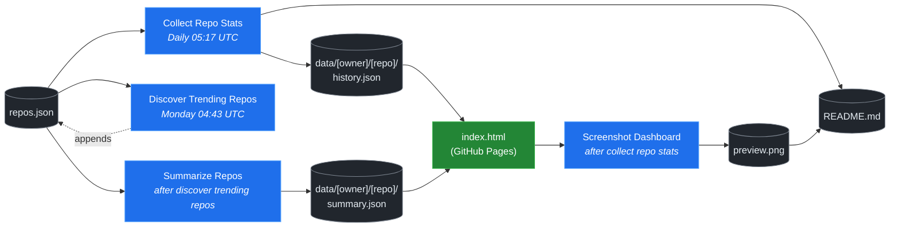

# 🚀 Rising Repos Tracker

> Automatically tracks daily GitHub stats (stars, forks, issues, velocity) for rising open source repos.

[](https://www.telosignal.com/)


**[→ View Live Dashboard](https://patrick-creates.github.io/rising-repos-tracker/)**

Built and maintained by [Telosignal](https://www.telosignal.com/).


<!-- AUTOGEN-STATS-START -->
## 📊 Current snapshot

> Auto-updated daily — last refreshed 2026-09-01

| Metric | Value |
|---|---|
| Repos tracked | **187** |
| Total stars | **9,132,620** |
| Total forks | **1,351,582** |
| Fastest growing | **ponytail** (+1002.2/day) |

### 🔥 Top 5 by velocity

| # | Repo | Stars | Stars/day |
|---|---|---:|---:|
| 1 | [DietrichGebert/ponytail](https://github.com/DietrichGebert/ponytail) | 119,178 | +1002.2 |
| 2 | [bojieli/ai-agent-book](https://github.com/bojieli/ai-agent-book) | 44,038 | +839.2 |
| 3 | [diegosouzapw/OmniRoute](https://github.com/diegosouzapw/OmniRoute) | 59,530 | +831.2 |
| 4 | [NousResearch/hermes-agent](https://github.com/NousResearch/hermes-agent) | 239,240 | +821.6 |
| 5 | [stablyai/orca](https://github.com/stablyai/orca) | 58,750 | +809.9 |

### 🆕 Recently added

- [WenyuChiou/awesome-agentic-ai-zh](https://github.com/WenyuChiou/awesome-agentic-ai-zh) — added 2026-08-31 — A trilingual (繁中 / English / 简中) learning roadmap for agentic AI: from LLM basics to multi-agent systems, with 240+ curated resources and hands-on examples. 中文 AI agent 學習地圖。
- [virgiliojr94/book-to-skill](https://github.com/virgiliojr94/book-to-skill) — added 2026-08-24 — Turn any technical book PDF into a Claude Code skill — ready to study, reference, and use while you work.
- [guillaumemeyer/watermarks-remover](https://github.com/guillaumemeyer/watermarks-remover) — added 2026-08-24 — Strip multi-vendor AI provenance marks: Unicode text hygiene, statistical rewrite hooks, and C2PA/metadata from PNG/JPEG/SVG/PDF/DOCX/HTML/MD
<!-- AUTOGEN-STATS-END -->

<!-- AUTOGEN-DIAGRAM-START -->
## 🔄 How it works


```mermaid
graph LR
    repos[("repos.json")]:::data
    history[("data/[owner]/[repo]/<br/>history.json")]:::data
    summary[("data/[owner]/[repo]/<br/>summary.json")]:::data
    readme[("README.md")]:::data
    preview[("preview.png")]:::data
    dashboard["index.html<br/>(GitHub Pages)"]:::output
    collect_yml["Collect Repo Stats<br/><i>Daily 05:17 UTC</i>"]:::workflow
    discover_yml["Discover Trending Repos<br/><i>Monday 04:43 UTC</i>"]:::workflow
    screenshot_yml["Screenshot Dashboard<br/><i>after collect repo stats</i>"]:::workflow
    summarize_yml["Summarize Repos<br/><i>after discover trending repos</i>"]:::workflow
    repos --> collect_yml
    collect_yml --> history
    collect_yml --> readme
    repos --> discover_yml
    discover_yml -.->|appends| repos
    dashboard --> screenshot_yml
    screenshot_yml --> preview
    repos --> summarize_yml
    summarize_yml --> summary
    history --> dashboard
    summary --> dashboard
    preview --> readme
    classDef workflow fill:#1f6feb,stroke:#58a6ff,color:#fff
    classDef data fill:#21262d,stroke:#7d8590,color:#e6edf3
    classDef output fill:#238636,stroke:#3fb950,color:#fff
```
<!-- AUTOGEN-DIAGRAM-END -->

<!-- AUTOGEN-WORKFLOWS-START -->
## ⚙️ Workflows

| File | Schedule | Name |
|---|---|---|
| `collect.yml` | Daily 05:17 UTC | Collect Repo Stats |
| `discover.yml` | Monday 04:43 UTC | Discover Trending Repos |
| `screenshot.yml` | After Collect Repo Stats | Screenshot Dashboard |
| `summarize.yml` | After Discover Trending Repos | Summarize Repos |

> All workflows commit results directly back to the repo. Schedules are best-effort — GitHub Actions cron can drift by a few minutes.
<!-- AUTOGEN-WORKFLOWS-END -->

<!-- AUTOGEN-REPOS-START -->
## 📋 All tracked repos

| Repo | Stars | Forks | Stars/day |
|---|---:|---:|---:|
| [openclaw/openclaw](https://github.com/openclaw/openclaw) | 388,419 | 81,537 | +152.7 |
| [obra/superpowers](https://github.com/obra/superpowers) | 280,217 | 25,113 | +628.7 |
| [affaan-m/everything-claude-code](https://github.com/affaan-m/everything-claude-code) | 245,472 | 37,064 | +580.4 |
| [affaan-m/ECC](https://github.com/affaan-m/ECC) | 245,472 | 37,064 | +537.8 |
| [NousResearch/hermes-agent](https://github.com/NousResearch/hermes-agent) | 239,240 | 48,829 | +821.6 |
| [Significant-Gravitas/AutoGPT](https://github.com/Significant-Gravitas/AutoGPT) | 187,048 | 46,042 | +24.9 |
| [microsoft/markitdown](https://github.com/microsoft/markitdown) | 177,486 | 13,054 | +490.8 |
| [f/prompts.chat](https://github.com/f/prompts.chat) | 168,382 | 21,711 | +55.9 |
| [langgenius/dify](https://github.com/langgenius/dify) | 154,076 | 24,342 | +115.8 |
| [open-webui/open-webui](https://github.com/open-webui/open-webui) | 150,556 | 21,989 | +123.1 |
| [langchain-ai/langchain](https://github.com/langchain-ai/langchain) | 145,410 | 24,261 | +79.1 |
| [github/spec-kit](https://github.com/github/spec-kit) | 132,732 | 11,938 | +314.2 |
| [farion1231/cc-switch](https://github.com/farion1231/cc-switch) | 130,494 | 8,960 | +532.5 |
| [nextlevelbuilder/ui-ux-pro-max-skill](https://github.com/nextlevelbuilder/ui-ux-pro-max-skill) | 123,702 | 13,234 | +412.7 |
| [DietrichGebert/ponytail](https://github.com/DietrichGebert/ponytail) | 119,178 | 6,476 | +1002.2 |
| [microsoft/generative-ai-for-beginners](https://github.com/microsoft/generative-ai-for-beginners) | 118,921 | 62,676 | +73.6 |
| [Graphify-Labs/graphify](https://github.com/Graphify-Labs/graphify) | 113,174 | 11,017 | +457.7 |
| [JuliusBrussee/caveman](https://github.com/JuliusBrussee/caveman) | 102,126 | 5,944 | +383.2 |
| [nexu-io/open-design](https://github.com/nexu-io/open-design) | 93,195 | 10,757 | +462.5 |
| [thedotmack/claude-mem](https://github.com/thedotmack/claude-mem) | 92,802 | 8,163 | +157.0 |
| [ruvnet/RuView](https://github.com/ruvnet/RuView) | 92,239 | 12,242 | +266.1 |
| [vllm-project/vllm](https://github.com/vllm-project/vllm) | 90,673 | 21,528 | +97.2 |
| [ChatGPTNextWeb/NextChat](https://github.com/ChatGPTNextWeb/NextChat) | 88,677 | 59,159 | +6.0 |
| [OpenHands/OpenHands](https://github.com/OpenHands/OpenHands) | 85,826 | 11,250 | +112.2 |
| [koala73/worldmonitor](https://github.com/koala73/worldmonitor) | 85,269 | 12,838 | +291.5 |
| [Leonxlnx/taste-skill](https://github.com/Leonxlnx/taste-skill) | 83,059 | 5,685 | +572.2 |
| [lobehub/lobehub](https://github.com/lobehub/lobehub) | 82,133 | 15,841 | +46.3 |
| [rtk-ai/rtk](https://github.com/rtk-ai/rtk) | 78,132 | 4,925 | +269.4 |
| [dair-ai/Prompt-Engineering-Guide](https://github.com/dair-ai/Prompt-Engineering-Guide) | 77,943 | 8,559 | +30.6 |
| [Panniantong/Agent-Reach](https://github.com/Panniantong/Agent-Reach) | 77,230 | 6,615 | +632.4 |
| [datawhalechina/hello-agents](https://github.com/datawhalechina/hello-agents) | 75,932 | 9,441 | +238.4 |
| [shareAI-lab/learn-claude-code](https://github.com/shareAI-lab/learn-claude-code) | 75,806 | 12,220 | +139.0 |
| [openai/openai-cookbook](https://github.com/openai/openai-cookbook) | 75,692 | 12,791 | +19.7 |
| [unslothai/unsloth](https://github.com/unslothai/unsloth) | 75,412 | 6,847 | +102.9 |
| [ComposioHQ/awesome-claude-skills](https://github.com/ComposioHQ/awesome-claude-skills) | 74,182 | 8,497 | +130.1 |
| [santifer/career-ops](https://github.com/santifer/career-ops) | 69,679 | 13,175 | +230.5 |
| [code-yeongyu/oh-my-openagent](https://github.com/code-yeongyu/oh-my-openagent) | 68,574 | 5,630 | +96.7 |
| [chopratejas/headroom](https://github.com/chopratejas/headroom) | 68,259 | 5,290 | +514.1 |
| [headroomlabs-ai/headroom](https://github.com/headroomlabs-ai/headroom) | 68,259 | 5,290 | +314.9 |
| [Fission-AI/OpenSpec](https://github.com/Fission-AI/OpenSpec) | 66,884 | 4,608 | +170.7 |
| [xtekky/gpt4free](https://github.com/xtekky/gpt4free) | 66,618 | 13,513 | +3.6 |
| [shanraisshan/claude-code-best-practice](https://github.com/shanraisshan/claude-code-best-practice) | 65,462 | 6,516 | +112.9 |
| [ZhuLinsen/daily_stock_analysis](https://github.com/ZhuLinsen/daily_stock_analysis) | 64,434 | 54,028 | +258.5 |
| [asgeirtj/system_prompts_leaks](https://github.com/asgeirtj/system_prompts_leaks) | 63,921 | 10,497 | +222.0 |
| [tw93/Pake](https://github.com/tw93/Pake) | 61,195 | 12,579 | +117.1 |
| [mvanhorn/last30days-skill](https://github.com/mvanhorn/last30days-skill) | 60,845 | 5,317 | +331.5 |
| [usestrix/strix](https://github.com/usestrix/strix) | 59,809 | 6,533 | +370.6 |
| [diegosouzapw/OmniRoute](https://github.com/diegosouzapw/OmniRoute) | 59,530 | 8,261 | +831.2 |
| [MemPalace/mempalace](https://github.com/MemPalace/mempalace) | 58,770 | 7,543 | +60.1 |
| [stablyai/orca](https://github.com/stablyai/orca) | 58,750 | 3,985 | +809.9 |
| [BerriAI/litellm](https://github.com/BerriAI/litellm) | 57,738 | 11,060 | +97.6 |
| [FlowiseAI/Flowise](https://github.com/FlowiseAI/Flowise) | 55,401 | 24,973 | +23.6 |
| [calesthio/OpenMontage](https://github.com/calesthio/OpenMontage) | 55,191 | 6,881 | +427.2 |
| [ggml-org/whisper.cpp](https://github.com/ggml-org/whisper.cpp) | 53,345 | 6,123 | +33.2 |
| [hesreallyhim/awesome-claude-code](https://github.com/hesreallyhim/awesome-claude-code) | 53,319 | 4,644 | +87.0 |
| [jamiepine/voicebox](https://github.com/jamiepine/voicebox) | 52,019 | 6,478 | +250.0 |
| [rohitg00/ai-engineering-from-scratch](https://github.com/rohitg00/ai-engineering-from-scratch) | 51,720 | 8,952 | +275.6 |
| [ChromeDevTools/chrome-devtools-mcp](https://github.com/ChromeDevTools/chrome-devtools-mcp) | 50,347 | 3,543 | +98.7 |
| [router-for-me/CLIProxyAPI](https://github.com/router-for-me/CLIProxyAPI) | 49,708 | 7,597 | +151.2 |
| [Aider-AI/aider](https://github.com/Aider-AI/aider) | 48,642 | 4,908 | +34.7 |
| [kepano/obsidian-skills](https://github.com/kepano/obsidian-skills) | 47,613 | 3,419 | +149.2 |
| [HKUDS/nanobot](https://github.com/HKUDS/nanobot) | 47,598 | 8,402 | +46.4 |
| [elder-plinius/CL4R1T4S](https://github.com/elder-plinius/CL4R1T4S) | 47,252 | 9,556 | +107.2 |
| [QuantumNous/new-api](https://github.com/QuantumNous/new-api) | 46,977 | 11,187 | +117.4 |
| [zhayujie/CowAgent](https://github.com/zhayujie/CowAgent) | 46,744 | 10,331 | +20.7 |
| [coreyhaines31/marketingskills](https://github.com/coreyhaines31/marketingskills) | 46,390 | 7,239 | +162.5 |
| [sickn33/antigravity-awesome-skills](https://github.com/sickn33/antigravity-awesome-skills) | 45,787 | 6,698 | +71.8 |
| [sickn33/agentic-awesome-skills](https://github.com/sickn33/agentic-awesome-skills) | 45,787 | 6,698 | +54.9 |
| [Imbad0202/academic-research-skills](https://github.com/Imbad0202/academic-research-skills) | 44,512 | 3,537 | +133.8 |
| [bojieli/ai-agent-book](https://github.com/bojieli/ai-agent-book) | 44,038 | 4,852 | +839.2 |
| [heygen-com/hyperframes](https://github.com/heygen-com/hyperframes) | 43,502 | 4,180 | +211.1 |
| [danny-avila/LibreChat](https://github.com/danny-avila/LibreChat) | 42,679 | 8,835 | +52.6 |
| [chatboxai/chatbox](https://github.com/chatboxai/chatbox) | 41,631 | 4,218 | +15.4 |
| [DeusData/codebase-memory-mcp](https://github.com/DeusData/codebase-memory-mcp) | 41,597 | 3,386 | +327.6 |
| [chatanywhere/GPT_API_free](https://github.com/chatanywhere/GPT_API_free) | 41,589 | 2,710 | +34.7 |
| [Hmbown/CodeWhale](https://github.com/Hmbown/CodeWhale) | 40,889 | 3,539 | +62.8 |
| [langchain-ai/langgraph](https://github.com/langchain-ai/langgraph) | 40,842 | 6,886 | +76.4 |
| [AstrBotDevs/AstrBot](https://github.com/AstrBotDevs/AstrBot) | 39,891 | 2,858 | +68.5 |
| [mindsdb/mindshub](https://github.com/mindsdb/mindshub) | 39,672 | 6,238 | +5.4 |
| [MadsLorentzen/ai-job-search](https://github.com/MadsLorentzen/ai-job-search) | 39,404 | 13,336 | +356.4 |
| [wshobson/agents](https://github.com/wshobson/agents) | 39,318 | 4,194 | +34.2 |
| [Yeachan-Heo/oh-my-claudecode](https://github.com/Yeachan-Heo/oh-my-claudecode) | 38,924 | 3,491 | +41.4 |
| [google/langextract](https://github.com/google/langextract) | 38,516 | 2,705 | +19.8 |
| [github/awesome-copilot](https://github.com/github/awesome-copilot) | 38,503 | 4,865 | +47.4 |
| [songquanpeng/one-api](https://github.com/songquanpeng/one-api) | 36,671 | 6,842 | +24.9 |
| [PDFMathTranslate/PDFMathTranslate](https://github.com/PDFMathTranslate/PDFMathTranslate) | 36,554 | 3,269 | +25.7 |
| [anthropics/claude-plugins-official](https://github.com/anthropics/claude-plugins-official) | 35,772 | 3,992 | +73.5 |
| [esengine/DeepSeek-Reasonix](https://github.com/esengine/DeepSeek-Reasonix) | 35,313 | 2,358 | +185.7 |
| [volcengine/OpenViking](https://github.com/volcengine/OpenViking) | 34,839 | 2,660 | +111.9 |
| [agentscope-ai/QwenPaw](https://github.com/agentscope-ai/QwenPaw) | 34,759 | 3,052 | +217.7 |
| [AlexsJones/llmfit](https://github.com/AlexsJones/llmfit) | 34,651 | 2,170 | +83.2 |
| [ogulcancelik/herdr](https://github.com/ogulcancelik/herdr) | 34,223 | 2,502 | +382.9 |
| [herdrdev/herdr](https://github.com/herdrdev/herdr) | 34,223 | 2,502 | +359.8 |
| [JCodesMore/ai-website-cloner-template](https://github.com/JCodesMore/ai-website-cloner-template) | 33,536 | 4,893 | +212.1 |
| [zeroclaw-labs/zeroclaw](https://github.com/zeroclaw-labs/zeroclaw) | 32,703 | 4,927 | +11.2 |
| [iOfficeAI/AionUi](https://github.com/iOfficeAI/AionUi) | 32,475 | 3,340 | +55.7 |
| [HKUDS/Vibe-Trading](https://github.com/HKUDS/Vibe-Trading) | 32,216 | 5,267 | +273.1 |
| [mukul975/Anthropic-Cybersecurity-Skills](https://github.com/mukul975/Anthropic-Cybersecurity-Skills) | 31,876 | 3,843 | +193.7 |
| [tirth8205/code-review-graph](https://github.com/tirth8205/code-review-graph) | 31,056 | 2,829 | +160.8 |
| [Gitlawb/openclaude](https://github.com/Gitlawb/openclaude) | 30,939 | 8,924 | +30.5 |
| [googleworkspace/cli](https://github.com/googleworkspace/cli) | 30,675 | 1,799 | +43.0 |
| [p-e-w/heretic](https://github.com/p-e-w/heretic) | 29,865 | 3,267 | +69.3 |
| [iOfficeAI/OfficeCLI](https://github.com/iOfficeAI/OfficeCLI) | 29,636 | 2,015 | +372.6 |
| [alibaba/page-agent](https://github.com/alibaba/page-agent) | 28,933 | 2,596 | +133.0 |
| [voideditor/void](https://github.com/voideditor/void) | 28,819 | 2,647 | +0.2 |
| [jackwener/OpenCLI](https://github.com/jackwener/OpenCLI) | 28,810 | 2,827 | +58.9 |
| [can1357/oh-my-pi](https://github.com/can1357/oh-my-pi) | 28,808 | 2,881 | +208.6 |
| [langchain-ai/deepagents](https://github.com/langchain-ai/deepagents) | 28,798 | 4,043 | +54.6 |
| [BloopAI/vibe-kanban](https://github.com/BloopAI/vibe-kanban) | 27,973 | 2,998 | +13.7 |
| [rohitg00/agentmemory](https://github.com/rohitg00/agentmemory) | 27,885 | 2,405 | +71.3 |
| [jarrodwatts/claude-hud](https://github.com/jarrodwatts/claude-hud) | 27,762 | 1,284 | +36.1 |
| [virgiliojr94/book-to-skill](https://github.com/virgiliojr94/book-to-skill) | 27,715 | 2,860 | +360.8 |
| [decolua/9router](https://github.com/decolua/9router) | 26,830 | 4,903 | +118.7 |
| [manaflow-ai/cmux](https://github.com/manaflow-ai/cmux) | 26,649 | 2,289 | +45.9 |
| [zai-org/Open-AutoGLM](https://github.com/zai-org/Open-AutoGLM) | 26,132 | 4,021 | +7.9 |
| [TencentCloud/TencentDB-Agent-Memory](https://github.com/TencentCloud/TencentDB-Agent-Memory) | 25,521 | 2,380 | +336.1 |
| [toon-format/toon](https://github.com/toon-format/toon) | 25,290 | 1,123 | +9.3 |
| [winfunc/opcode](https://github.com/winfunc/opcode) | 22,387 | 1,728 | +4.5 |
| [pranshuparmar/witr](https://github.com/pranshuparmar/witr) | 21,984 | 766 | +61.8 |
| [pascalorg/editor](https://github.com/pascalorg/editor) | 21,803 | 2,807 | +25.1 |
| [alibaba/open-code-review](https://github.com/alibaba/open-code-review) | 21,764 | 1,616 | +206.6 |
| [coze-dev/coze-studio](https://github.com/coze-dev/coze-studio) | 21,528 | 3,121 | +6.8 |
| [NirDiamant/agents-towards-production](https://github.com/NirDiamant/agents-towards-production) | 21,370 | 2,841 | +8.7 |
| [jundot/omlx](https://github.com/jundot/omlx) | 21,212 | 1,802 | +58.7 |
| [Tencent/WeKnora](https://github.com/Tencent/WeKnora) | 21,104 | 3,044 | +61.7 |
| [steipete/CodexBar](https://github.com/steipete/CodexBar) | 20,779 | 1,817 | +78.5 |
| [KKKKhazix/khazix-skills](https://github.com/KKKKhazix/khazix-skills) | 20,328 | 2,180 | +66.7 |
| [mksglu/context-mode](https://github.com/mksglu/context-mode) | 20,287 | 1,475 | +36.1 |
| [jnMetaCode/agency-agents-zh](https://github.com/jnMetaCode/agency-agents-zh) | 20,179 | 3,270 | +67.2 |
| [guillaumemeyer/watermarks-remover](https://github.com/guillaumemeyer/watermarks-remover) | 19,756 | 2,296 | +275.5 |
| [tanweai/pua](https://github.com/tanweai/pua) | 19,560 | 1,194 | +16.8 |
| [datawhalechina/easy-vibe](https://github.com/datawhalechina/easy-vibe) | 19,209 | 1,836 | +29.1 |
| [1jehuang/jcode](https://github.com/1jehuang/jcode) | 18,934 | 2,166 | +212.6 |
| [danielmiessler/LifeOS](https://github.com/danielmiessler/LifeOS) | 18,818 | 2,443 | +38.8 |
| [RightNow-AI/openfang](https://github.com/RightNow-AI/openfang) | 18,152 | 2,289 | +4.2 |
| [nesquena/hermes-webui](https://github.com/nesquena/hermes-webui) | 17,949 | 2,495 | +43.8 |
| [microsoft/agent-lightning](https://github.com/microsoft/agent-lightning) | 17,939 | 1,575 | +8.1 |
| [t8y2/dbx](https://github.com/t8y2/dbx) | 17,654 | 1,734 | +161.6 |
| [browser-use/browser-harness](https://github.com/browser-use/browser-harness) | 17,295 | 1,678 | +28.4 |
| [jlcodes99/cockpit-tools](https://github.com/jlcodes99/cockpit-tools) | 16,862 | 1,475 | +63.2 |
| [cft0808/edict](https://github.com/cft0808/edict) | 16,786 | 1,757 | +9.3 |
| [MemoriLabs/Memori](https://github.com/MemoriLabs/Memori) | 16,307 | 3,285 | +13.6 |
| [composio-community/awesome-codex-skills](https://github.com/composio-community/awesome-codex-skills) | 16,158 | 1,580 | +20.4 |
| [xbtlin/ai-berkshire](https://github.com/xbtlin/ai-berkshire) | 16,088 | 2,419 | +93.2 |
| [xpzouying/xiaohongshu-mcp](https://github.com/xpzouying/xiaohongshu-mcp) | 15,581 | 2,291 | +18.2 |
| [wanshuiyin/Auto-claude-code-research-in-sleep](https://github.com/wanshuiyin/Auto-claude-code-research-in-sleep) | 15,547 | 1,359 | +43.3 |
| [Anionex/banana-slides](https://github.com/Anionex/banana-slides) | 15,534 | 1,778 | +5.6 |
| [yusufkaraaslan/Skill_Seekers](https://github.com/yusufkaraaslan/Skill_Seekers) | 14,874 | 1,515 | +9.1 |
| [kyegomez/OpenMythos](https://github.com/kyegomez/OpenMythos) | 14,863 | 3,292 | +10.0 |
| [walkinglabs/learn-harness-engineering](https://github.com/walkinglabs/learn-harness-engineering) | 14,617 | 1,454 | +83.0 |
| [NevaMind-AI/memU](https://github.com/NevaMind-AI/memU) | 14,366 | 1,063 | +6.6 |
| [NanmiCoder/cc-haha](https://github.com/NanmiCoder/cc-haha) | 14,258 | 8,540 | +13.2 |
| [superset-sh/superset](https://github.com/superset-sh/superset) | 13,598 | 1,232 | +22.5 |
| [XiaomiMiMo/MiMo-Code](https://github.com/XiaomiMiMo/MiMo-Code) | 12,919 | 1,334 | +29.6 |
| [sirmalloc/ccstatusline](https://github.com/sirmalloc/ccstatusline) | 12,700 | 555 | +22.2 |
| [EverMind-AI/EverOS](https://github.com/EverMind-AI/EverOS) | 12,613 | 911 | +45.3 |
| [ifixai-ai/iFixAi](https://github.com/ifixai-ai/iFixAi) | 12,322 | 1,249 | +188.6 |
| [ConardLi/garden-skills](https://github.com/ConardLi/garden-skills) | 11,958 | 1,467 | +48.7 |
| [0x4m4/hexstrike-ai](https://github.com/0x4m4/hexstrike-ai) | 11,480 | 2,384 | +23.0 |
| [brokermr810/QuantDinger](https://github.com/brokermr810/QuantDinger) | 11,276 | 2,354 | +35.0 |
| [OpenByteInc/QuantDinger](https://github.com/OpenByteInc/QuantDinger) | 11,276 | 2,354 | +34.3 |
| [MemTensor/MemOS](https://github.com/MemTensor/MemOS) | 11,133 | 1,019 | +17.3 |
| [holaboss-ai/holaOS](https://github.com/holaboss-ai/holaOS) | 11,106 | 721 | +182.3 |
| [ValueCell-ai/valuecell](https://github.com/ValueCell-ai/valuecell) | 11,006 | 1,804 | +2.1 |
| [aden-hive/hive](https://github.com/aden-hive/hive) | 10,998 | 5,670 | +6.0 |
| [EKKOLearnAI/hermes-studio](https://github.com/EKKOLearnAI/hermes-studio) | 10,756 | 1,299 | +33.3 |
| [openai/codex-security](https://github.com/openai/codex-security) | 10,312 | 747 | +70.0 |
| [Kuberwastaken/claurst](https://github.com/Kuberwastaken/claurst) | 10,287 | 7,754 | +6.6 |
| [ykdojo/claude-code-tips](https://github.com/ykdojo/claude-code-tips) | 10,000 | 808 | +17.2 |
| [StarTrail-org/PixelRAG](https://github.com/StarTrail-org/PixelRAG) | 9,830 | 845 | +64.9 |
| [getagentseal/codeburn](https://github.com/getagentseal/codeburn) | 9,799 | 778 | +23.3 |
| [frankbria/ralph-claude-code](https://github.com/frankbria/ralph-claude-code) | 9,613 | 721 | +4.5 |
| [EvoMap/evolver](https://github.com/EvoMap/evolver) | 9,036 | 840 | +3.2 |
| [modem-dev/hunk](https://github.com/modem-dev/hunk) | 8,976 | 283 | +45.4 |
| [iflytek/astron-agent](https://github.com/iflytek/astron-agent) | 8,890 | 868 | +4.9 |
| [MiroMindAI/MiroThinker](https://github.com/MiroMindAI/MiroThinker) | 8,363 | 644 | +0.6 |
| [mmulet/term.everything](https://github.com/mmulet/term.everything) | 8,086 | 194 | +1.1 |
| [ValueCell-ai/ClawX](https://github.com/ValueCell-ai/ClawX) | 7,602 | 1,142 | +1.2 |
| [1weiho/open-slide](https://github.com/1weiho/open-slide) | 7,341 | 520 | +55.6 |
| [opensquilla/opensquilla](https://github.com/opensquilla/opensquilla) | 6,841 | 540 | +14.7 |
| [steipete/summarize](https://github.com/steipete/summarize) | 6,587 | 443 | +3.5 |
| [WenyuChiou/awesome-agentic-ai-zh](https://github.com/WenyuChiou/awesome-agentic-ai-zh) | 6,580 | 889 | +29.0 |
| [Andyyyy64/whichllm](https://github.com/Andyyyy64/whichllm) | 6,547 | 357 | +15.8 |
| [Arthur-Ficial/apfel](https://github.com/Arthur-Ficial/apfel) | 6,337 | 244 | +4.4 |
| [microsoft/fara](https://github.com/microsoft/fara) | 6,164 | 604 | +3.3 |
| [UfoMiao/zcf](https://github.com/UfoMiao/zcf) | 6,081 | 421 | +0.2 |
| [re4/LibreCode](https://github.com/re4/LibreCode) | 87 | 5 | — |
<!-- AUTOGEN-REPOS-END -->

---

## What it does

- Collects daily snapshots of stars, forks, watchers and open issues for every tracked repo
- Discovers new trending repos automatically every Monday using the GitHub Search API
- Generates AI summaries (use cases, similar tools, tags) for each tracked repo via GitHub Models
- Stores all history as plain JSON — no database, no backend
- Renders a live dashboard via GitHub Pages — updates daily, zero maintenance

## Tracked repos

Data lives in [`data/`](./data) — one folder per repo, one `history.json` per entry.  
The full watch list is in [`repos.json`](./repos.json).

## Fork & use it for yourself

This is my personal tracker — the watch list reflects what I find interesting. If you want to track different repos, the best path is to **fork this repo and run your own**.

### Setup

1. Fork this repo to your account
2. Replace the contents of [`repos.json`](./repos.json) with the repos you want to track (or just leave one entry — `discover.yml` will auto-add more every Monday)
3. Go to **Settings → Pages** and enable GitHub Pages from the `main` branch
4. Go to **Actions** and run **Collect Repo Stats** once manually to seed your first data point
5. Your dashboard will be live at `https://YOUR-USERNAME.github.io/rising-repos-tracker/`

That's it — daily collection and weekly discovery run automatically on schedule. Zero ongoing maintenance.

### Customizing what gets discovered

Edit [`scripts/discover.js`](./scripts/discover.js) to change:

- `MIN_STARS` — minimum star threshold for candidates
- `MAX_AGE_DAYS` — how recent a repo must be
- `MAX_NEW_REPOS` — how many to add per discovery run
- The `queries` array — GitHub Search API queries that define what "trending" means to you

### Adding a repo manually

Just edit `repos.json` directly:

```json
{
  "owner": "OWNER",
  "repo": "REPO",
  "added": "YYYY-MM-DD",
  "notes": "why you're tracking this"
}
```

The next daily collect run picks it up automatically.

## Stack

- **GitHub Actions** — scheduling and automation
- **GitHub Pages** — dashboard hosting
- **GitHub API** — data source
- **GitHub Models** — free AI summaries (gpt-4o-mini)
- **Chart.js** — star growth visualization
- **Mermaid** — architecture diagram (rendered by GitHub)
- No dependencies, no build step, no database

## License

MIT
