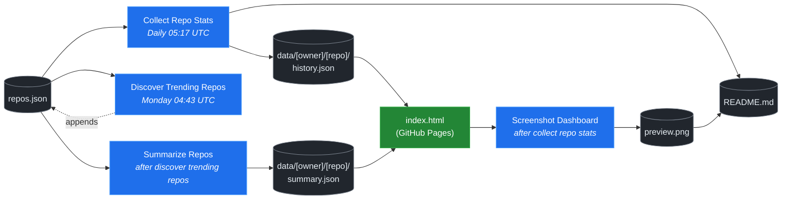

# 🚀 Rising Repos Tracker

> Automatically tracks daily GitHub stats (stars, forks, issues, velocity) for rising open source repos.

[](https://www.telosignal.com/)


**[→ View Live Dashboard](https://patrick-creates.github.io/rising-repos-tracker/)**

Built and maintained by [Telosignal](https://www.telosignal.com/).


<!-- AUTOGEN-STATS-START -->
## 📊 Current snapshot

> Auto-updated daily — last refreshed 2026-09-16

| Metric | Value |
|---|---|
| Repos tracked | **199** |
| Total stars | **9,746,687** |
| Total forks | **1,424,566** |
| Fastest growing | **VoiceStudio** (+1265.6/day) |

### 🔥 Top 5 by velocity

| # | Repo | Stars | Stars/day |
|---|---|---:|---:|
| 1 | [debpalash/VoiceStudio](https://github.com/debpalash/VoiceStudio) | 31,609 | +1265.6 |
| 2 | [DietrichGebert/ponytail](https://github.com/DietrichGebert/ponytail) | 139,816 | +1067.4 |
| 3 | [stablyai/orca](https://github.com/stablyai/orca) | 69,846 | +795.3 |
| 4 | [NousResearch/hermes-agent](https://github.com/NousResearch/hermes-agent) | 246,012 | +777.5 |
| 5 | [diegosouzapw/OmniRoute](https://github.com/diegosouzapw/OmniRoute) | 66,780 | +758.7 |

### 🆕 Recently added

- [every-app/open-seo](https://github.com/every-app/open-seo) — added 2026-09-14 — Open source alternative to Semrush and Ahrefs
- [NVIDIA/SkillSpector](https://github.com/NVIDIA/SkillSpector) — added 2026-09-14 — Security scanner for AI agent skills. Detect vulnerabilities, malicious patterns, security risks, prompt injection, data exfiltration, and supply-chain risks in Claude Code, Codex, and MCP skills before you install them.
- [AgriciDaniel/claude-seo](https://github.com/AgriciDaniel/claude-seo) — added 2026-09-14 — Universal SEO skill for Claude Code. 25 sub-skills + 18 sub-agents covering technical SEO, E-E-A-T, schema, GEO/AEO, backlinks, local SEO, maps intelligence, semantic clustering, e-commerce SEO, international SEO, Google APIs, and PDF/Excel reporting. Optional DataForSEO, Firecrawl, and Banana extensions.
<!-- AUTOGEN-STATS-END -->

<!-- AUTOGEN-DIAGRAM-START -->
## 🔄 How it works


```mermaid
graph LR
    repos[("repos.json")]:::data
    history[("data/[owner]/[repo]/<br/>history.json")]:::data
    summary[("data/[owner]/[repo]/<br/>summary.json")]:::data
    readme[("README.md")]:::data
    preview[("preview.png")]:::data
    dashboard["index.html<br/>(GitHub Pages)"]:::output
    collect_yml["Collect Repo Stats<br/><i>Daily 05:17 UTC</i>"]:::workflow
    discover_yml["Discover Trending Repos<br/><i>Monday 04:43 UTC</i>"]:::workflow
    screenshot_yml["Screenshot Dashboard<br/><i>after collect repo stats</i>"]:::workflow
    summarize_yml["Summarize Repos<br/><i>after discover trending repos</i>"]:::workflow
    repos --> collect_yml
    collect_yml --> history
    collect_yml --> readme
    repos --> discover_yml
    discover_yml -.->|appends| repos
    dashboard --> screenshot_yml
    screenshot_yml --> preview
    repos --> summarize_yml
    summarize_yml --> summary
    history --> dashboard
    summary --> dashboard
    preview --> readme
    classDef workflow fill:#1f6feb,stroke:#58a6ff,color:#fff
    classDef data fill:#21262d,stroke:#7d8590,color:#e6edf3
    classDef output fill:#238636,stroke:#3fb950,color:#fff
```
<!-- AUTOGEN-DIAGRAM-END -->

<!-- AUTOGEN-WORKFLOWS-START -->
## ⚙️ Workflows

| File | Schedule | Name |
|---|---|---|
| `collect.yml` | Daily 05:17 UTC | Collect Repo Stats |
| `discover.yml` | Monday 04:43 UTC | Discover Trending Repos |
| `screenshot.yml` | After Collect Repo Stats | Screenshot Dashboard |
| `summarize.yml` | After Discover Trending Repos | Summarize Repos |

> All workflows commit results directly back to the repo. Schedules are best-effort — GitHub Actions cron can drift by a few minutes.
<!-- AUTOGEN-WORKFLOWS-END -->

<!-- AUTOGEN-REPOS-START -->
## 📋 All tracked repos

| Repo | Stars | Forks | Stars/day |
|---|---:|---:|---:|
| [openclaw/openclaw](https://github.com/openclaw/openclaw) | 389,829 | 81,940 | +145.7 |
| [obra/superpowers](https://github.com/obra/superpowers) | 287,379 | 25,702 | +602.3 |
| [affaan-m/everything-claude-code](https://github.com/affaan-m/everything-claude-code) | 259,634 | 38,835 | +623.7 |
| [affaan-m/ECC](https://github.com/affaan-m/ECC) | 259,634 | 38,835 | +591.3 |
| [NousResearch/hermes-agent](https://github.com/NousResearch/hermes-agent) | 246,012 | 51,361 | +777.5 |
| [Significant-Gravitas/AutoGPT](https://github.com/Significant-Gravitas/AutoGPT) | 187,377 | 46,011 | +24.6 |
| [microsoft/markitdown](https://github.com/microsoft/markitdown) | 184,612 | 13,603 | +488.9 |
| [f/prompts.chat](https://github.com/f/prompts.chat) | 170,454 | 21,921 | +65.7 |
| [langgenius/dify](https://github.com/langgenius/dify) | 155,920 | 24,629 | +116.6 |
| [open-webui/open-webui](https://github.com/open-webui/open-webui) | 152,253 | 22,283 | +121.9 |
| [langchain-ai/langchain](https://github.com/langchain-ai/langchain) | 146,431 | 24,482 | +77.7 |
| [DietrichGebert/ponytail](https://github.com/DietrichGebert/ponytail) | 139,816 | 7,513 | +1067.4 |
| [github/spec-kit](https://github.com/github/spec-kit) | 137,191 | 12,284 | +312.1 |
| [farion1231/cc-switch](https://github.com/farion1231/cc-switch) | 133,138 | 9,179 | +488.4 |
| [nextlevelbuilder/ui-ux-pro-max-skill](https://github.com/nextlevelbuilder/ui-ux-pro-max-skill) | 128,032 | 13,656 | +397.9 |
| [microsoft/generative-ai-for-beginners](https://github.com/microsoft/generative-ai-for-beginners) | 119,843 | 63,095 | +72.2 |
| [Graphify-Labs/graphify](https://github.com/Graphify-Labs/graphify) | 118,169 | 11,421 | +421.0 |
| [JuliusBrussee/caveman](https://github.com/JuliusBrussee/caveman) | 105,869 | 6,127 | +366.6 |
| [nexu-io/open-design](https://github.com/nexu-io/open-design) | 96,464 | 11,208 | +432.1 |
| [ruvnet/RuView](https://github.com/ruvnet/RuView) | 94,221 | 12,466 | +248.5 |
| [thedotmack/claude-mem](https://github.com/thedotmack/claude-mem) | 94,008 | 8,282 | +147.8 |
| [vllm-project/vllm](https://github.com/vllm-project/vllm) | 91,901 | 22,267 | +95.4 |
| [ChatGPTNextWeb/NextChat](https://github.com/ChatGPTNextWeb/NextChat) | 88,768 | 59,059 | +6.0 |
| [OpenHands/OpenHands](https://github.com/OpenHands/OpenHands) | 88,107 | 11,563 | +117.1 |
| [Leonxlnx/taste-skill](https://github.com/Leonxlnx/taste-skill) | 87,542 | 5,962 | +533.9 |
| [koala73/worldmonitor](https://github.com/koala73/worldmonitor) | 86,548 | 13,119 | +266.0 |
| [lobehub/lobehub](https://github.com/lobehub/lobehub) | 82,519 | 15,893 | +43.8 |
| [Panniantong/Agent-Reach](https://github.com/Panniantong/Agent-Reach) | 82,245 | 7,169 | +587.7 |
| [rtk-ai/rtk](https://github.com/rtk-ai/rtk) | 80,648 | 5,112 | +256.8 |
| [datawhalechina/hello-agents](https://github.com/datawhalechina/hello-agents) | 79,316 | 9,859 | +236.8 |
| [dair-ai/Prompt-Engineering-Guide](https://github.com/dair-ai/Prompt-Engineering-Guide) | 78,361 | 8,618 | +30.2 |
| [shareAI-lab/learn-claude-code](https://github.com/shareAI-lab/learn-claude-code) | 76,935 | 12,371 | +131.1 |
| [unslothai/unsloth](https://github.com/unslothai/unsloth) | 76,221 | 6,945 | +96.9 |
| [openai/openai-cookbook](https://github.com/openai/openai-cookbook) | 76,005 | 12,874 | +19.8 |
| [ComposioHQ/awesome-claude-skills](https://github.com/ComposioHQ/awesome-claude-skills) | 75,179 | 8,693 | +122.2 |
| [chopratejas/headroom](https://github.com/chopratejas/headroom) | 72,383 | 5,549 | +475.5 |
| [headroomlabs-ai/headroom](https://github.com/headroomlabs-ai/headroom) | 72,383 | 5,549 | +307.9 |
| [santifer/career-ops](https://github.com/santifer/career-ops) | 71,773 | 13,537 | +219.2 |
| [career-ops-hq/career-ops](https://github.com/career-ops-hq/career-ops) | 71,773 | 13,537 | +154.6 |
| [stablyai/orca](https://github.com/stablyai/orca) | 69,846 | 4,562 | +795.3 |
| [code-yeongyu/oh-my-openagent](https://github.com/code-yeongyu/oh-my-openagent) | 69,088 | 5,686 | +88.9 |
| [Fission-AI/OpenSpec](https://github.com/Fission-AI/OpenSpec) | 68,458 | 4,706 | +162.6 |
| [asgeirtj/system_prompts_leaks](https://github.com/asgeirtj/system_prompts_leaks) | 67,292 | 10,923 | +222.4 |
| [diegosouzapw/OmniRoute](https://github.com/diegosouzapw/OmniRoute) | 66,780 | 9,376 | +758.7 |
| [xtekky/gpt4free](https://github.com/xtekky/gpt4free) | 66,693 | 13,510 | +3.7 |
| [shanraisshan/claude-code-best-practice](https://github.com/shanraisshan/claude-code-best-practice) | 65,952 | 6,545 | +102.9 |
| [ZhuLinsen/daily_stock_analysis](https://github.com/ZhuLinsen/daily_stock_analysis) | 65,135 | 54,535 | +230.7 |
| [usestrix/strix](https://github.com/usestrix/strix) | 62,887 | 6,874 | +347.4 |
| [mvanhorn/last30days-skill](https://github.com/mvanhorn/last30days-skill) | 62,119 | 5,418 | +294.5 |
| [tw93/Pake](https://github.com/tw93/Pake) | 61,452 | 12,648 | +104.7 |
| [calesthio/OpenMontage](https://github.com/calesthio/OpenMontage) | 59,437 | 7,480 | +399.8 |
| [MemPalace/mempalace](https://github.com/MemPalace/mempalace) | 59,089 | 7,558 | +55.3 |
| [BerriAI/litellm](https://github.com/BerriAI/litellm) | 58,866 | 11,492 | +94.9 |
| [FlowiseAI/Flowise](https://github.com/FlowiseAI/Flowise) | 55,465 | 25,020 | +21.2 |
| [rohitg00/ai-engineering-from-scratch](https://github.com/rohitg00/ai-engineering-from-scratch) | 54,757 | 9,599 | +265.4 |
| [hesreallyhim/awesome-claude-code](https://github.com/hesreallyhim/awesome-claude-code) | 54,143 | 4,716 | +83.0 |
| [jamiepine/voicebox](https://github.com/jamiepine/voicebox) | 54,030 | 6,768 | +233.7 |
| [ggml-org/whisper.cpp](https://github.com/ggml-org/whisper.cpp) | 53,696 | 6,159 | +32.0 |
| [ChromeDevTools/chrome-devtools-mcp](https://github.com/ChromeDevTools/chrome-devtools-mcp) | 52,108 | 3,835 | +101.0 |
| [router-for-me/CLIProxyAPI](https://github.com/router-for-me/CLIProxyAPI) | 52,052 | 7,859 | +151.8 |
| [coreyhaines31/marketingskills](https://github.com/coreyhaines31/marketingskills) | 50,539 | 7,655 | +178.5 |
| [heygen-com/hyperframes](https://github.com/heygen-com/hyperframes) | 50,536 | 4,609 | +249.8 |
| [elder-plinius/CL4R1T4S](https://github.com/elder-plinius/CL4R1T4S) | 49,914 | 10,259 | +118.5 |
| [Aider-AI/aider](https://github.com/Aider-AI/aider) | 48,989 | 4,954 | +33.3 |
| [kepano/obsidian-skills](https://github.com/kepano/obsidian-skills) | 48,414 | 3,447 | +135.8 |
| [Imbad0202/academic-research-skills](https://github.com/Imbad0202/academic-research-skills) | 48,288 | 3,763 | +168.5 |
| [QuantumNous/new-api](https://github.com/QuantumNous/new-api) | 48,219 | 11,551 | +112.8 |
| [HKUDS/nanobot](https://github.com/HKUDS/nanobot) | 48,211 | 8,521 | +45.7 |
| [bojieli/ai-agent-book](https://github.com/bojieli/ai-agent-book) | 47,894 | 5,335 | +688.6 |
| [zhayujie/CowAgent](https://github.com/zhayujie/CowAgent) | 46,999 | 10,357 | +20.2 |
| [sickn33/antigravity-awesome-skills](https://github.com/sickn33/antigravity-awesome-skills) | 46,481 | 6,777 | +68.4 |
| [sickn33/agentic-awesome-skills](https://github.com/sickn33/agentic-awesome-skills) | 46,481 | 6,777 | +52.9 |
| [K-Dense-AI/scientific-agent-skills](https://github.com/K-Dense-AI/scientific-agent-skills) | 45,155 | 4,094 | +186.6 |
| [danny-avila/LibreChat](https://github.com/danny-avila/LibreChat) | 44,036 | 9,042 | +57.6 |
| [DeusData/codebase-memory-mcp](https://github.com/DeusData/codebase-memory-mcp) | 43,478 | 3,538 | +289.2 |
| [MadsLorentzen/ai-job-search](https://github.com/MadsLorentzen/ai-job-search) | 43,042 | 14,735 | +330.1 |
| [chatanywhere/GPT_API_free](https://github.com/chatanywhere/GPT_API_free) | 42,647 | 2,721 | +39.4 |
| [chatboxai/chatbox](https://github.com/chatboxai/chatbox) | 41,782 | 4,250 | +14.8 |
| [langchain-ai/langgraph](https://github.com/langchain-ai/langgraph) | 41,752 | 7,054 | +73.6 |
| [Hmbown/CodeWhale](https://github.com/Hmbown/CodeWhale) | 40,982 | 3,561 | +55.4 |
| [Hmbown/Codewhale](https://github.com/Hmbown/Codewhale) | 40,982 | 3,561 | +7.3 |
| [AstrBotDevs/AstrBot](https://github.com/AstrBotDevs/AstrBot) | 40,569 | 2,920 | +65.2 |
| [tinyhumansai/openhuman](https://github.com/tinyhumansai/openhuman) | 39,814 | 3,922 | +36.1 |
| [mindsdb/mindshub](https://github.com/mindsdb/mindshub) | 39,738 | 6,239 | +5.2 |
| [wshobson/agents](https://github.com/wshobson/agents) | 39,706 | 4,227 | +33.1 |
| [Yeachan-Heo/oh-my-claudecode](https://github.com/Yeachan-Heo/oh-my-claudecode) | 39,194 | 3,504 | +38.3 |
| [github/awesome-copilot](https://github.com/github/awesome-copilot) | 39,062 | 4,956 | +46.1 |
| [ogulcancelik/herdr](https://github.com/ogulcancelik/herdr) | 38,861 | 2,913 | +367.6 |
| [herdrdev/herdr](https://github.com/herdrdev/herdr) | 38,861 | 2,913 | +342.5 |
| [google/langextract](https://github.com/google/langextract) | 38,584 | 2,704 | +17.8 |
| [volcengine/OpenViking](https://github.com/volcengine/OpenViking) | 37,659 | 2,907 | +123.3 |
| [PDFMathTranslate/PDFMathTranslate](https://github.com/PDFMathTranslate/PDFMathTranslate) | 36,994 | 3,321 | +26.1 |
| [songquanpeng/one-api](https://github.com/songquanpeng/one-api) | 36,910 | 6,859 | +23.7 |
| [AlexsJones/llmfit](https://github.com/AlexsJones/llmfit) | 36,651 | 2,317 | +90.2 |
| [anthropics/claude-plugins-official](https://github.com/anthropics/claude-plugins-official) | 36,394 | 4,077 | +69.0 |
| [esengine/DeepSeek-Reasonix](https://github.com/esengine/DeepSeek-Reasonix) | 35,570 | 2,399 | +160.4 |
| [agentscope-ai/QwenPaw](https://github.com/agentscope-ai/QwenPaw) | 35,008 | 3,110 | +185.3 |
| [JCodesMore/ai-website-cloner-template](https://github.com/JCodesMore/ai-website-cloner-template) | 34,479 | 5,020 | +188.0 |
| [HKUDS/Vibe-Trading](https://github.com/HKUDS/Vibe-Trading) | 33,531 | 5,470 | +237.9 |
| [Gitlawb/openclaude](https://github.com/Gitlawb/openclaude) | 33,332 | 9,088 | +48.6 |
| [iOfficeAI/AionUi](https://github.com/iOfficeAI/AionUi) | 32,878 | 3,395 | +51.7 |
| [zeroclaw-labs/zeroclaw](https://github.com/zeroclaw-labs/zeroclaw) | 32,850 | 4,942 | +11.0 |
| [mukul975/Anthropic-Cybersecurity-Skills](https://github.com/mukul975/Anthropic-Cybersecurity-Skills) | 32,843 | 3,969 | +171.2 |
| [debpalash/VoiceStudio](https://github.com/debpalash/VoiceStudio) | 31,609 | 3,746 | +1265.6 |
| [p-e-w/heretic](https://github.com/p-e-w/heretic) | 31,539 | 3,523 | +75.7 |
| [tirth8205/code-review-graph](https://github.com/tirth8205/code-review-graph) | 31,488 | 2,859 | +139.5 |
| [can1357/oh-my-pi](https://github.com/can1357/oh-my-pi) | 31,344 | 3,290 | +201.7 |
| [googleworkspace/cli](https://github.com/googleworkspace/cli) | 31,019 | 1,835 | +40.2 |
| [virgiliojr94/book-to-skill](https://github.com/virgiliojr94/book-to-skill) | 30,849 | 3,199 | +261.7 |
| [iOfficeAI/OfficeCLI](https://github.com/iOfficeAI/OfficeCLI) | 30,686 | 2,092 | +309.6 |
| [alibaba/open-code-review](https://github.com/alibaba/open-code-review) | 30,008 | 2,138 | +278.1 |
| [langchain-ai/deepagents](https://github.com/langchain-ai/deepagents) | 29,471 | 4,128 | +53.2 |
| [jackwener/OpenCLI](https://github.com/jackwener/OpenCLI) | 29,340 | 2,870 | +55.4 |
| [alibaba/page-agent](https://github.com/alibaba/page-agent) | 29,081 | 2,601 | +113.2 |
| [decolua/9router](https://github.com/decolua/9router) | 28,994 | 5,318 | +122.8 |
| [voideditor/void](https://github.com/voideditor/void) | 28,801 | 2,648 | — |
| [rohitg00/agentmemory](https://github.com/rohitg00/agentmemory) | 28,490 | 2,463 | +66.7 |
| [BloopAI/vibe-kanban](https://github.com/BloopAI/vibe-kanban) | 28,096 | 3,007 | +13.0 |
| [jarrodwatts/claude-hud](https://github.com/jarrodwatts/claude-hud) | 28,001 | 1,298 | +33.1 |
| [manaflow-ai/cmux](https://github.com/manaflow-ai/cmux) | 27,146 | 2,359 | +42.9 |
| [TencentCloud/TencentDB-Agent-Memory](https://github.com/TencentCloud/TencentDB-Agent-Memory) | 26,805 | 2,528 | +278.3 |
| [zai-org/Open-AutoGLM](https://github.com/zai-org/Open-AutoGLM) | 26,235 | 4,030 | +7.7 |
| [toon-format/toon](https://github.com/toon-format/toon) | 25,381 | 1,121 | +8.8 |
| [Tencent/WeKnora](https://github.com/Tencent/WeKnora) | 24,748 | 3,429 | +90.9 |
| [pascalorg/editor](https://github.com/pascalorg/editor) | 23,972 | 2,971 | +73.6 |
| [mksglu/context-mode](https://github.com/mksglu/context-mode) | 23,153 | 1,673 | +61.1 |
| [winfunc/opcode](https://github.com/winfunc/opcode) | 22,401 | 1,720 | +4.0 |
| [pranshuparmar/witr](https://github.com/pranshuparmar/witr) | 22,355 | 779 | +54.7 |
| [guillaumemeyer/watermarks-remover](https://github.com/guillaumemeyer/watermarks-remover) | 22,131 | 2,553 | +199.1 |
| [jundot/omlx](https://github.com/jundot/omlx) | 21,794 | 1,881 | +55.5 |
| [coze-dev/coze-studio](https://github.com/coze-dev/coze-studio) | 21,594 | 3,111 | +6.5 |
| [steipete/CodexBar](https://github.com/steipete/CodexBar) | 21,485 | 1,939 | +73.0 |
| [NirDiamant/agents-towards-production](https://github.com/NirDiamant/agents-towards-production) | 21,462 | 2,848 | +8.3 |
| [jnMetaCode/agency-agents-zh](https://github.com/jnMetaCode/agency-agents-zh) | 20,714 | 3,340 | +61.7 |
| [KKKKhazix/khazix-skills](https://github.com/KKKKhazix/khazix-skills) | 20,713 | 2,201 | +56.1 |
| [1jehuang/jcode](https://github.com/1jehuang/jcode) | 19,760 | 2,293 | +176.2 |
| [t8y2/dbx](https://github.com/t8y2/dbx) | 19,734 | 1,909 | +154.8 |
| [tanweai/pua](https://github.com/tanweai/pua) | 19,649 | 1,196 | +15.1 |
| [datawhalechina/easy-vibe](https://github.com/datawhalechina/easy-vibe) | 19,426 | 1,860 | +26.7 |
| [danielmiessler/LifeOS](https://github.com/danielmiessler/LifeOS) | 19,030 | 2,466 | +34.5 |
| [every-app/open-seo](https://github.com/every-app/open-seo) | 18,827 | 2,407 | +85.5 |
| [nesquena/hermes-webui](https://github.com/nesquena/hermes-webui) | 18,381 | 2,584 | +41.2 |
| [RightNow-AI/openfang](https://github.com/RightNow-AI/openfang) | 18,237 | 2,291 | +4.4 |
| [microsoft/agent-lightning](https://github.com/microsoft/agent-lightning) | 18,169 | 1,595 | +9.2 |
| [jlcodes99/cockpit-tools](https://github.com/jlcodes99/cockpit-tools) | 17,763 | 1,567 | +61.9 |
| [browser-use/browser-harness](https://github.com/browser-use/browser-harness) | 17,577 | 1,723 | +26.6 |
| [NVIDIA/SkillSpector](https://github.com/NVIDIA/SkillSpector) | 17,374 | 1,484 | +117.0 |
| [AgriciDaniel/claude-seo](https://github.com/AgriciDaniel/claude-seo) | 16,998 | 2,487 | +56.5 |
| [cft0808/edict](https://github.com/cft0808/edict) | 16,895 | 1,769 | +9.0 |
| [MemoriLabs/Memori](https://github.com/MemoriLabs/Memori) | 16,758 | 3,475 | +16.5 |
| [composio-community/awesome-codex-skills](https://github.com/composio-community/awesome-codex-skills) | 16,482 | 1,624 | +20.8 |
| [xbtlin/ai-berkshire](https://github.com/xbtlin/ai-berkshire) | 16,386 | 2,440 | +77.9 |
| [wanshuiyin/Auto-claude-code-research-in-sleep](https://github.com/wanshuiyin/Auto-claude-code-research-in-sleep) | 16,194 | 1,383 | +43.3 |
| [xpzouying/xiaohongshu-mcp](https://github.com/xpzouying/xiaohongshu-mcp) | 15,814 | 2,327 | +17.8 |
| [Anionex/banana-slides](https://github.com/Anionex/banana-slides) | 15,608 | 1,783 | +5.4 |
| [walkinglabs/learn-harness-engineering](https://github.com/walkinglabs/learn-harness-engineering) | 15,274 | 1,527 | +74.8 |
| [ifixai-ai/iFixAi](https://github.com/ifixai-ai/iFixAi) | 15,086 | 1,326 | +186.8 |
| [yusufkaraaslan/Skill_Seekers](https://github.com/yusufkaraaslan/Skill_Seekers) | 14,979 | 1,525 | +8.8 |
| [kyegomez/OpenMythos](https://github.com/kyegomez/OpenMythos) | 14,899 | 3,295 | +8.7 |
| [NanmiCoder/cc-haha](https://github.com/NanmiCoder/cc-haha) | 14,471 | 8,547 | +13.5 |
| [NevaMind-AI/memU](https://github.com/NevaMind-AI/memU) | 14,409 | 1,068 | +5.9 |
| [superset-sh/superset](https://github.com/superset-sh/superset) | 14,284 | 1,274 | +26.9 |
| [XiaomiMiMo/MiMo-Code](https://github.com/XiaomiMiMo/MiMo-Code) | 13,131 | 1,351 | +26.7 |
| [EverMind-AI/EverOS](https://github.com/EverMind-AI/EverOS) | 12,991 | 923 | +41.5 |
| [sirmalloc/ccstatusline](https://github.com/sirmalloc/ccstatusline) | 12,900 | 568 | +20.5 |
| [ConardLi/garden-skills](https://github.com/ConardLi/garden-skills) | 12,449 | 1,503 | +45.4 |
| [0x4m4/hexstrike-ai](https://github.com/0x4m4/hexstrike-ai) | 11,906 | 2,445 | +24.0 |
| [brokermr810/QuantDinger](https://github.com/brokermr810/QuantDinger) | 11,682 | 2,420 | +33.3 |
| [OpenByteInc/QuantDinger](https://github.com/OpenByteInc/QuantDinger) | 11,682 | 2,420 | +32.4 |
| [MemTensor/MemOS](https://github.com/MemTensor/MemOS) | 11,367 | 1,044 | +17.0 |
| [holaboss-ai/holaOS](https://github.com/holaboss-ai/holaOS) | 11,296 | 723 | +97.5 |
| [EKKOLearnAI/hermes-studio](https://github.com/EKKOLearnAI/hermes-studio) | 11,105 | 1,351 | +31.2 |
| [aden-hive/hive](https://github.com/aden-hive/hive) | 11,046 | 5,663 | +5.5 |
| [getagentseal/codeburn](https://github.com/getagentseal/codeburn) | 11,046 | 832 | +35.8 |
| [ValueCell-ai/valuecell](https://github.com/ValueCell-ai/valuecell) | 11,010 | 1,802 | +1.7 |
| [openai/codex-security](https://github.com/openai/codex-security) | 10,738 | 791 | +55.8 |
| [Kuberwastaken/claurst](https://github.com/Kuberwastaken/claurst) | 10,304 | 7,741 | +5.5 |
| [ykdojo/claude-code-tips](https://github.com/ykdojo/claude-code-tips) | 10,096 | 815 | +15.0 |
| [StarTrail-org/PixelRAG](https://github.com/StarTrail-org/PixelRAG) | 9,972 | 855 | +52.1 |
| [frankbria/ralph-claude-code](https://github.com/frankbria/ralph-claude-code) | 9,633 | 719 | +4.1 |
| [modem-dev/hunk](https://github.com/modem-dev/hunk) | 9,302 | 295 | +40.0 |
| [EvoMap/evolver](https://github.com/EvoMap/evolver) | 9,085 | 845 | +3.2 |
| [iflytek/astron-agent](https://github.com/iflytek/astron-agent) | 9,019 | 883 | +5.7 |
| [MiroMindAI/MiroThinker](https://github.com/MiroMindAI/MiroThinker) | 8,401 | 646 | +1.0 |
| [trailhq/Graft](https://github.com/trailhq/Graft) | 8,147 | 736 | +279.0 |
| [mmulet/term.everything](https://github.com/mmulet/term.everything) | 8,099 | 194 | +1.0 |
| [ValueCell-ai/ClawX](https://github.com/ValueCell-ai/ClawX) | 7,614 | 1,143 | +1.1 |
| [1weiho/open-slide](https://github.com/1weiho/open-slide) | 7,587 | 542 | +39.7 |
| [rorkai/App-Store-Connect-CLI](https://github.com/rorkai/App-Store-Connect-CLI) | 7,258 | 612 | +40.0 |
| [WenyuChiou/awesome-agentic-ai-zh](https://github.com/WenyuChiou/awesome-agentic-ai-zh) | 7,030 | 953 | +29.9 |
| [opensquilla/opensquilla](https://github.com/opensquilla/opensquilla) | 7,016 | 564 | +13.9 |
| [TokenRhythm/opensquilla](https://github.com/TokenRhythm/opensquilla) | 7,016 | 564 | +5.3 |
| [dataelement/dsh-desktop](https://github.com/dataelement/dsh-desktop) | 6,836 | 307 | +311.0 |
| [Andyyyy64/whichllm](https://github.com/Andyyyy64/whichllm) | 6,643 | 365 | +13.4 |
| [steipete/summarize](https://github.com/steipete/summarize) | 6,626 | 444 | +3.3 |
| [Arthur-Ficial/apfel](https://github.com/Arthur-Ficial/apfel) | 6,388 | 245 | +4.2 |
| [microsoft/fara](https://github.com/microsoft/fara) | 6,179 | 604 | +2.8 |
| [UfoMiao/zcf](https://github.com/UfoMiao/zcf) | 6,084 | 420 | +0.2 |
| [re4/LibreCode](https://github.com/re4/LibreCode) | 87 | 4 | — |
<!-- AUTOGEN-REPOS-END -->

---

## What it does

- Collects daily snapshots of stars, forks, watchers and open issues for every tracked repo
- Discovers new trending repos automatically every Monday using the GitHub Search API
- Generates AI summaries (use cases, similar tools, tags) for each tracked repo via GitHub Models
- Stores all history as plain JSON — no database, no backend
- Renders a live dashboard via GitHub Pages — updates daily, zero maintenance

## Tracked repos

Data lives in [`data/`](./data) — one folder per repo, one `history.json` per entry.  
The full watch list is in [`repos.json`](./repos.json).

## Fork & use it for yourself

This is my personal tracker — the watch list reflects what I find interesting. If you want to track different repos, the best path is to **fork this repo and run your own**.

### Setup

1. Fork this repo to your account
2. Replace the contents of [`repos.json`](./repos.json) with the repos you want to track (or just leave one entry — `discover.yml` will auto-add more every Monday)
3. Go to **Settings → Pages** and enable GitHub Pages from the `main` branch
4. Go to **Actions** and run **Collect Repo Stats** once manually to seed your first data point
5. Your dashboard will be live at `https://YOUR-USERNAME.github.io/rising-repos-tracker/`

That's it — daily collection and weekly discovery run automatically on schedule. Zero ongoing maintenance.

### Customizing what gets discovered

Edit [`scripts/discover.js`](./scripts/discover.js) to change:

- `MIN_STARS` — minimum star threshold for candidates
- `MAX_AGE_DAYS` — how recent a repo must be
- `MAX_NEW_REPOS` — how many to add per discovery run
- The `queries` array — GitHub Search API queries that define what "trending" means to you

### Adding a repo manually

Just edit `repos.json` directly:

```json
{
  "owner": "OWNER",
  "repo": "REPO",
  "added": "YYYY-MM-DD",
  "notes": "why you're tracking this"
}
```

The next daily collect run picks it up automatically.

## Stack

- **GitHub Actions** — scheduling and automation
- **GitHub Pages** — dashboard hosting
- **GitHub API** — data source
- **GitHub Models** — free AI summaries (gpt-4o-mini)
- **Chart.js** — star growth visualization
- **Mermaid** — architecture diagram (rendered by GitHub)
- No dependencies, no build step, no database

## License

MIT
