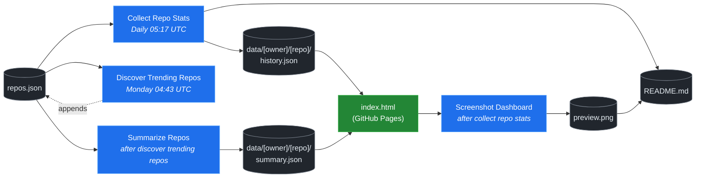

# 🚀 Rising Repos Tracker

> Automatically tracks daily GitHub stats (stars, forks, issues, velocity) for rising open source repos.

[](https://www.telosignal.com/)


**[→ View Live Dashboard](https://patrick-creates.github.io/rising-repos-tracker/)**

Built and maintained by [Telosignal](https://www.telosignal.com/).


<!-- AUTOGEN-STATS-START -->
## 📊 Current snapshot

> Auto-updated daily — last refreshed 2026-08-27

| Metric | Value |
|---|---|
| Repos tracked | **186** |
| Total stars | **9,041,808** |
| Total forks | **1,339,947** |
| Fastest growing | **ponytail** (+995.4/day) |

### 🔥 Top 5 by velocity

| # | Repo | Stars | Stars/day |
|---|---|---:|---:|
| 1 | [DietrichGebert/ponytail](https://github.com/DietrichGebert/ponytail) | 113,713 | +995.4 |
| 2 | [bojieli/ai-agent-book](https://github.com/bojieli/ai-agent-book) | 42,762 | +916.0 |
| 3 | [diegosouzapw/OmniRoute](https://github.com/diegosouzapw/OmniRoute) | 56,754 | +857.7 |
| 4 | [NousResearch/hermes-agent](https://github.com/NousResearch/hermes-agent) | 237,233 | +841.4 |
| 5 | [stablyai/orca](https://github.com/stablyai/orca) | 54,999 | +815.7 |

### 🆕 Recently added

- [virgiliojr94/book-to-skill](https://github.com/virgiliojr94/book-to-skill) — added 2026-08-24 — Turn any technical book PDF into a Claude Code skill — ready to study, reference, and use while you work.
- [guillaumemeyer/watermarks-remover](https://github.com/guillaumemeyer/watermarks-remover) — added 2026-08-24 — Strip multi-vendor AI provenance marks: Unicode text hygiene, statistical rewrite hooks, and C2PA/metadata from PNG/JPEG/SVG/PDF/DOCX/HTML/MD
- [holaboss-ai/holaOS](https://github.com/holaboss-ai/holaOS) — added 2026-08-17 — Open-source All in One AI agent workspace. Run any agent — Claude Code, Codex — across your tools (100+ integrations + MCP), apps, browser, and files, with shared memory. Built-in models or BYOK.
<!-- AUTOGEN-STATS-END -->

<!-- AUTOGEN-DIAGRAM-START -->
## 🔄 How it works


```mermaid
graph LR
    repos[("repos.json")]:::data
    history[("data/[owner]/[repo]/<br/>history.json")]:::data
    summary[("data/[owner]/[repo]/<br/>summary.json")]:::data
    readme[("README.md")]:::data
    preview[("preview.png")]:::data
    dashboard["index.html<br/>(GitHub Pages)"]:::output
    collect_yml["Collect Repo Stats<br/><i>Daily 05:17 UTC</i>"]:::workflow
    discover_yml["Discover Trending Repos<br/><i>Monday 04:43 UTC</i>"]:::workflow
    screenshot_yml["Screenshot Dashboard<br/><i>after collect repo stats</i>"]:::workflow
    summarize_yml["Summarize Repos<br/><i>after discover trending repos</i>"]:::workflow
    repos --> collect_yml
    collect_yml --> history
    collect_yml --> readme
    repos --> discover_yml
    discover_yml -.->|appends| repos
    dashboard --> screenshot_yml
    screenshot_yml --> preview
    repos --> summarize_yml
    summarize_yml --> summary
    history --> dashboard
    summary --> dashboard
    preview --> readme
    classDef workflow fill:#1f6feb,stroke:#58a6ff,color:#fff
    classDef data fill:#21262d,stroke:#7d8590,color:#e6edf3
    classDef output fill:#238636,stroke:#3fb950,color:#fff
```
<!-- AUTOGEN-DIAGRAM-END -->

<!-- AUTOGEN-WORKFLOWS-START -->
## ⚙️ Workflows

| File | Schedule | Name |
|---|---|---|
| `collect.yml` | Daily 05:17 UTC | Collect Repo Stats |
| `discover.yml` | Monday 04:43 UTC | Discover Trending Repos |
| `screenshot.yml` | After Collect Repo Stats | Screenshot Dashboard |
| `summarize.yml` | After Discover Trending Repos | Summarize Repos |

> All workflows commit results directly back to the repo. Schedules are best-effort — GitHub Actions cron can drift by a few minutes.
<!-- AUTOGEN-WORKFLOWS-END -->

<!-- AUTOGEN-REPOS-START -->
## 📋 All tracked repos

| Repo | Stars | Forks | Stars/day |
|---|---:|---:|---:|
| [openclaw/openclaw](https://github.com/openclaw/openclaw) | 387,811 | 81,414 | +154.2 |
| [obra/superpowers](https://github.com/obra/superpowers) | 278,525 | 24,930 | +650.7 |
| [affaan-m/everything-claude-code](https://github.com/affaan-m/everything-claude-code) | 243,690 | 36,844 | +591.0 |
| [affaan-m/ECC](https://github.com/affaan-m/ECC) | 243,690 | 36,844 | +547.5 |
| [NousResearch/hermes-agent](https://github.com/NousResearch/hermes-agent) | 237,233 | 48,051 | +841.4 |
| [Significant-Gravitas/AutoGPT](https://github.com/Significant-Gravitas/AutoGPT) | 186,928 | 46,048 | +25.0 |
| [microsoft/markitdown](https://github.com/microsoft/markitdown) | 176,618 | 12,969 | +505.8 |
| [f/prompts.chat](https://github.com/f/prompts.chat) | 168,072 | 21,681 | +55.7 |
| [langgenius/dify](https://github.com/langgenius/dify) | 153,677 | 24,290 | +117.5 |
| [open-webui/open-webui](https://github.com/open-webui/open-webui) | 150,111 | 21,910 | +124.7 |
| [langchain-ai/langchain](https://github.com/langchain-ai/langchain) | 145,133 | 24,210 | +80.2 |
| [github/spec-kit](https://github.com/github/spec-kit) | 131,856 | 11,844 | +320.7 |
| [farion1231/cc-switch](https://github.com/farion1231/cc-switch) | 129,740 | 8,900 | +551.4 |
| [nextlevelbuilder/ui-ux-pro-max-skill](https://github.com/nextlevelbuilder/ui-ux-pro-max-skill) | 121,774 | 13,043 | +414.0 |
| [microsoft/generative-ai-for-beginners](https://github.com/microsoft/generative-ai-for-beginners) | 118,655 | 62,571 | +74.6 |
| [DietrichGebert/ponytail](https://github.com/DietrichGebert/ponytail) | 113,713 | 6,216 | +995.4 |
| [Graphify-Labs/graphify](https://github.com/Graphify-Labs/graphify) | 111,457 | 10,846 | +476.1 |
| [JuliusBrussee/caveman](https://github.com/JuliusBrussee/caveman) | 101,378 | 5,882 | +394.7 |
| [thedotmack/claude-mem](https://github.com/thedotmack/claude-mem) | 92,128 | 8,102 | +158.0 |
| [nexu-io/open-design](https://github.com/nexu-io/open-design) | 92,007 | 10,592 | +473.6 |
| [ruvnet/RuView](https://github.com/ruvnet/RuView) | 91,821 | 12,185 | +275.8 |
| [vllm-project/vllm](https://github.com/vllm-project/vllm) | 90,228 | 21,294 | +97.6 |
| [ChatGPTNextWeb/NextChat](https://github.com/ChatGPTNextWeb/NextChat) | 88,651 | 59,186 | +6.1 |
| [OpenHands/OpenHands](https://github.com/OpenHands/OpenHands) | 85,281 | 11,161 | +112.4 |
| [koala73/worldmonitor](https://github.com/koala73/worldmonitor) | 84,518 | 12,688 | +298.5 |
| [lobehub/lobehub](https://github.com/lobehub/lobehub) | 82,036 | 15,838 | +47.5 |
| [Leonxlnx/taste-skill](https://github.com/Leonxlnx/taste-skill) | 81,398 | 5,576 | +586.0 |
| [dair-ai/Prompt-Engineering-Guide](https://github.com/dair-ai/Prompt-Engineering-Guide) | 77,831 | 8,549 | +31.0 |
| [rtk-ai/rtk](https://github.com/rtk-ai/rtk) | 77,604 | 4,880 | +277.5 |
| [Panniantong/Agent-Reach](https://github.com/Panniantong/Agent-Reach) | 75,921 | 6,494 | +655.5 |
| [openai/openai-cookbook](https://github.com/openai/openai-cookbook) | 75,577 | 12,770 | +19.5 |
| [shareAI-lab/learn-claude-code](https://github.com/shareAI-lab/learn-claude-code) | 75,465 | 12,177 | +142.5 |
| [datawhalechina/hello-agents](https://github.com/datawhalechina/hello-agents) | 75,248 | 9,353 | +243.4 |
| [unslothai/unsloth](https://github.com/unslothai/unsloth) | 74,971 | 6,793 | +103.7 |
| [ComposioHQ/awesome-claude-skills](https://github.com/ComposioHQ/awesome-claude-skills) | 73,495 | 8,429 | +129.8 |
| [santifer/career-ops](https://github.com/santifer/career-ops) | 68,805 | 13,022 | +233.3 |
| [code-yeongyu/oh-my-openagent](https://github.com/code-yeongyu/oh-my-openagent) | 68,440 | 5,599 | +100.1 |
| [chopratejas/headroom](https://github.com/chopratejas/headroom) | 67,796 | 5,233 | +542.9 |
| [headroomlabs-ai/headroom](https://github.com/headroomlabs-ai/headroom) | 67,796 | 5,233 | +331.7 |
| [xtekky/gpt4free](https://github.com/xtekky/gpt4free) | 66,610 | 13,513 | +3.7 |
| [Fission-AI/OpenSpec](https://github.com/Fission-AI/OpenSpec) | 66,429 | 4,573 | +174.7 |
| [shanraisshan/claude-code-best-practice](https://github.com/shanraisshan/claude-code-best-practice) | 65,248 | 6,499 | +116.3 |
| [ZhuLinsen/daily_stock_analysis](https://github.com/ZhuLinsen/daily_stock_analysis) | 64,113 | 53,805 | +268.9 |
| [asgeirtj/system_prompts_leaks](https://github.com/asgeirtj/system_prompts_leaks) | 63,676 | 10,435 | +230.6 |
| [tw93/Pake](https://github.com/tw93/Pake) | 61,097 | 12,553 | +122.0 |
| [mvanhorn/last30days-skill](https://github.com/mvanhorn/last30days-skill) | 59,519 | 5,208 | +335.6 |
| [usestrix/strix](https://github.com/usestrix/strix) | 58,777 | 6,412 | +380.1 |
| [MemPalace/mempalace](https://github.com/MemPalace/mempalace) | 58,682 | 7,526 | +62.2 |
| [BerriAI/litellm](https://github.com/BerriAI/litellm) | 57,406 | 10,954 | +99.2 |
| [diegosouzapw/OmniRoute](https://github.com/diegosouzapw/OmniRoute) | 56,754 | 7,797 | +857.7 |
| [FlowiseAI/Flowise](https://github.com/FlowiseAI/Flowise) | 55,399 | 24,963 | +24.7 |
| [stablyai/orca](https://github.com/stablyai/orca) | 54,999 | 3,763 | +815.7 |
| [ggml-org/whisper.cpp](https://github.com/ggml-org/whisper.cpp) | 53,230 | 6,099 | +33.7 |
| [hesreallyhim/awesome-claude-code](https://github.com/hesreallyhim/awesome-claude-code) | 53,078 | 4,630 | +88.9 |
| [calesthio/OpenMontage](https://github.com/calesthio/OpenMontage) | 52,077 | 6,534 | +410.6 |
| [jamiepine/voicebox](https://github.com/jamiepine/voicebox) | 51,616 | 6,436 | +259.7 |
| [rohitg00/ai-engineering-from-scratch](https://github.com/rohitg00/ai-engineering-from-scratch) | 49,998 | 8,696 | +271.7 |
| [ChromeDevTools/chrome-devtools-mcp](https://github.com/ChromeDevTools/chrome-devtools-mcp) | 49,811 | 3,495 | +98.3 |
| [router-for-me/CLIProxyAPI](https://github.com/router-for-me/CLIProxyAPI) | 48,975 | 7,531 | +151.4 |
| [Aider-AI/aider](https://github.com/Aider-AI/aider) | 48,532 | 4,893 | +35.4 |
| [HKUDS/nanobot](https://github.com/HKUDS/nanobot) | 47,466 | 8,377 | +47.4 |
| [kepano/obsidian-skills](https://github.com/kepano/obsidian-skills) | 47,377 | 3,402 | +155.1 |
| [elder-plinius/CL4R1T4S](https://github.com/elder-plinius/CL4R1T4S) | 47,177 | 9,554 | +113.5 |
| [zhayujie/CowAgent](https://github.com/zhayujie/CowAgent) | 46,707 | 10,327 | +21.3 |
| [QuantumNous/new-api](https://github.com/QuantumNous/new-api) | 46,595 | 11,059 | +119.6 |
| [coreyhaines31/marketingskills](https://github.com/coreyhaines31/marketingskills) | 45,846 | 7,170 | +165.6 |
| [sickn33/antigravity-awesome-skills](https://github.com/sickn33/antigravity-awesome-skills) | 45,534 | 6,664 | +72.9 |
| [sickn33/agentic-awesome-skills](https://github.com/sickn33/agentic-awesome-skills) | 45,534 | 6,664 | +55.4 |
| [Imbad0202/academic-research-skills](https://github.com/Imbad0202/academic-research-skills) | 43,939 | 3,484 | +136.9 |
| [heygen-com/hyperframes](https://github.com/heygen-com/hyperframes) | 42,852 | 4,125 | +216.1 |
| [bojieli/ai-agent-book](https://github.com/bojieli/ai-agent-book) | 42,762 | 4,723 | +916.0 |
| [danny-avila/LibreChat](https://github.com/danny-avila/LibreChat) | 42,524 | 8,815 | +53.8 |
| [chatboxai/chatbox](https://github.com/chatboxai/chatbox) | 41,584 | 4,212 | +15.7 |
| [chatanywhere/GPT_API_free](https://github.com/chatanywhere/GPT_API_free) | 41,267 | 2,706 | +33.1 |
| [DeusData/codebase-memory-mcp](https://github.com/DeusData/codebase-memory-mcp) | 40,870 | 3,318 | +343.1 |
| [Hmbown/CodeWhale](https://github.com/Hmbown/CodeWhale) | 40,865 | 3,539 | +65.9 |
| [langchain-ai/langgraph](https://github.com/langchain-ai/langgraph) | 40,560 | 6,836 | +77.9 |
| [AstrBotDevs/AstrBot](https://github.com/AstrBotDevs/AstrBot) | 39,691 | 2,846 | +70.1 |
| [mindsdb/mindshub](https://github.com/mindsdb/mindshub) | 39,650 | 6,237 | +5.5 |
| [wshobson/agents](https://github.com/wshobson/agents) | 39,191 | 4,182 | +34.6 |
| [Yeachan-Heo/oh-my-claudecode](https://github.com/Yeachan-Heo/oh-my-claudecode) | 38,819 | 3,485 | +42.5 |
| [google/langextract](https://github.com/google/langextract) | 38,496 | 2,709 | +20.6 |
| [github/awesome-copilot](https://github.com/github/awesome-copilot) | 38,311 | 4,845 | +47.9 |
| [MadsLorentzen/ai-job-search](https://github.com/MadsLorentzen/ai-job-search) | 37,144 | 12,570 | +345.8 |
| [songquanpeng/one-api](https://github.com/songquanpeng/one-api) | 36,609 | 6,832 | +25.5 |
| [PDFMathTranslate/PDFMathTranslate](https://github.com/PDFMathTranslate/PDFMathTranslate) | 36,408 | 3,251 | +25.5 |
| [esengine/DeepSeek-Reasonix](https://github.com/esengine/DeepSeek-Reasonix) | 35,217 | 2,350 | +196.1 |
| [anthropics/claude-plugins-official](https://github.com/anthropics/claude-plugins-official) | 34,571 | 3,904 | +63.9 |
| [agentscope-ai/QwenPaw](https://github.com/agentscope-ai/QwenPaw) | 34,554 | 3,040 | +229.8 |
| [AlexsJones/llmfit](https://github.com/AlexsJones/llmfit) | 34,338 | 2,147 | +84.3 |
| [volcengine/OpenViking](https://github.com/volcengine/OpenViking) | 33,812 | 2,566 | +106.0 |
| [JCodesMore/ai-website-cloner-template](https://github.com/JCodesMore/ai-website-cloner-template) | 33,242 | 4,853 | +222.6 |
| [ogulcancelik/herdr](https://github.com/ogulcancelik/herdr) | 32,857 | 2,370 | +393.5 |
| [herdrdev/herdr](https://github.com/herdrdev/herdr) | 32,857 | 2,370 | +377.8 |
| [zeroclaw-labs/zeroclaw](https://github.com/zeroclaw-labs/zeroclaw) | 32,664 | 4,915 | +11.4 |
| [iOfficeAI/AionUi](https://github.com/iOfficeAI/AionUi) | 32,341 | 3,323 | +57.4 |
| [HKUDS/Vibe-Trading](https://github.com/HKUDS/Vibe-Trading) | 31,875 | 5,195 | +290.5 |
| [mukul975/Anthropic-Cybersecurity-Skills](https://github.com/mukul975/Anthropic-Cybersecurity-Skills) | 31,361 | 3,748 | +200.6 |
| [tirth8205/code-review-graph](https://github.com/tirth8205/code-review-graph) | 30,924 | 2,813 | +170.0 |
| [Gitlawb/openclaude](https://github.com/Gitlawb/openclaude) | 30,852 | 8,921 | +31.2 |
| [googleworkspace/cli](https://github.com/googleworkspace/cli) | 30,589 | 1,794 | +44.5 |
| [iOfficeAI/OfficeCLI](https://github.com/iOfficeAI/OfficeCLI) | 29,380 | 2,004 | +403.5 |
| [alibaba/page-agent](https://github.com/alibaba/page-agent) | 28,872 | 2,585 | +141.3 |
| [voideditor/void](https://github.com/voideditor/void) | 28,822 | 2,638 | +0.2 |
| [jackwener/OpenCLI](https://github.com/jackwener/OpenCLI) | 28,644 | 2,811 | +60.5 |
| [langchain-ai/deepagents](https://github.com/langchain-ai/deepagents) | 28,588 | 4,013 | +55.4 |
| [p-e-w/heretic](https://github.com/p-e-w/heretic) | 28,182 | 3,057 | +52.6 |
| [BloopAI/vibe-kanban](https://github.com/BloopAI/vibe-kanban) | 27,939 | 2,995 | +14.1 |
| [can1357/oh-my-pi](https://github.com/can1357/oh-my-pi) | 27,876 | 2,761 | +210.3 |
| [jarrodwatts/claude-hud](https://github.com/jarrodwatts/claude-hud) | 27,672 | 1,282 | +37.3 |
| [rohitg00/agentmemory](https://github.com/rohitg00/agentmemory) | 27,597 | 2,370 | +72.2 |
| [manaflow-ai/cmux](https://github.com/manaflow-ai/cmux) | 26,519 | 2,266 | +48.1 |
| [decolua/9router](https://github.com/decolua/9router) | 26,476 | 4,786 | +122.0 |
| [virgiliojr94/book-to-skill](https://github.com/virgiliojr94/book-to-skill) | 26,122 | 2,706 | +431.0 |
| [zai-org/Open-AutoGLM](https://github.com/zai-org/Open-AutoGLM) | 26,109 | 4,019 | +8.1 |
| [toon-format/toon](https://github.com/toon-format/toon) | 25,265 | 1,121 | +9.6 |
| [TencentCloud/TencentDB-Agent-Memory](https://github.com/TencentCloud/TencentDB-Agent-Memory) | 24,842 | 2,289 | +358.3 |
| [winfunc/opcode](https://github.com/winfunc/opcode) | 22,382 | 1,729 | +4.7 |
| [pascalorg/editor](https://github.com/pascalorg/editor) | 21,729 | 2,788 | +28.2 |
| [pranshuparmar/witr](https://github.com/pranshuparmar/witr) | 21,713 | 757 | +62.4 |
| [coze-dev/coze-studio](https://github.com/coze-dev/coze-studio) | 21,511 | 3,126 | +7.0 |
| [alibaba/open-code-review](https://github.com/alibaba/open-code-review) | 21,511 | 1,586 | +221.6 |
| [NirDiamant/agents-towards-production](https://github.com/NirDiamant/agents-towards-production) | 21,339 | 2,834 | +8.8 |
| [jundot/omlx](https://github.com/jundot/omlx) | 20,816 | 1,753 | +57.3 |
| [Tencent/WeKnora](https://github.com/Tencent/WeKnora) | 20,774 | 2,986 | +61.4 |
| [steipete/CodexBar](https://github.com/steipete/CodexBar) | 20,636 | 1,785 | +82.3 |
| [mksglu/context-mode](https://github.com/mksglu/context-mode) | 20,183 | 1,466 | +37.2 |
| [KKKKhazix/khazix-skills](https://github.com/KKKKhazix/khazix-skills) | 20,149 | 2,165 | +70.8 |
| [jnMetaCode/agency-agents-zh](https://github.com/jnMetaCode/agency-agents-zh) | 20,009 | 3,247 | +69.7 |
| [tanweai/pua](https://github.com/tanweai/pua) | 19,528 | 1,187 | +17.6 |
| [datawhalechina/easy-vibe](https://github.com/datawhalechina/easy-vibe) | 19,141 | 1,833 | +30.1 |
| [danielmiessler/LifeOS](https://github.com/danielmiessler/LifeOS) | 18,760 | 2,440 | +40.8 |
| [guillaumemeyer/watermarks-remover](https://github.com/guillaumemeyer/watermarks-remover) | 18,705 | 2,176 | +384.3 |
| [1jehuang/jcode](https://github.com/1jehuang/jcode) | 18,689 | 2,114 | +230.8 |
| [RightNow-AI/openfang](https://github.com/RightNow-AI/openfang) | 18,137 | 2,287 | +4.3 |
| [microsoft/agent-lightning](https://github.com/microsoft/agent-lightning) | 17,877 | 1,570 | +7.8 |
| [nesquena/hermes-webui](https://github.com/nesquena/hermes-webui) | 17,787 | 2,459 | +44.7 |
| [browser-use/browser-harness](https://github.com/browser-use/browser-harness) | 17,184 | 1,654 | +28.9 |
| [t8y2/dbx](https://github.com/t8y2/dbx) | 16,839 | 1,660 | +161.4 |
| [cft0808/edict](https://github.com/cft0808/edict) | 16,673 | 1,747 | +8.4 |
| [jlcodes99/cockpit-tools](https://github.com/jlcodes99/cockpit-tools) | 16,639 | 1,459 | +68.6 |
| [MemoriLabs/Memori](https://github.com/MemoriLabs/Memori) | 16,253 | 3,259 | +13.8 |
| [composio-community/awesome-codex-skills](https://github.com/composio-community/awesome-codex-skills) | 16,067 | 1,570 | +20.9 |
| [xbtlin/ai-berkshire](https://github.com/xbtlin/ai-berkshire) | 15,928 | 2,385 | +99.1 |
| [xpzouying/xiaohongshu-mcp](https://github.com/xpzouying/xiaohongshu-mcp) | 15,509 | 2,284 | +18.5 |
| [Anionex/banana-slides](https://github.com/Anionex/banana-slides) | 15,505 | 1,778 | +5.5 |
| [wanshuiyin/Auto-claude-code-research-in-sleep](https://github.com/wanshuiyin/Auto-claude-code-research-in-sleep) | 15,346 | 1,343 | +43.6 |
| [yusufkaraaslan/Skill_Seekers](https://github.com/yusufkaraaslan/Skill_Seekers) | 14,842 | 1,513 | +9.3 |
| [kyegomez/OpenMythos](https://github.com/kyegomez/OpenMythos) | 14,824 | 3,293 | +10.1 |
| [walkinglabs/learn-harness-engineering](https://github.com/walkinglabs/learn-harness-engineering) | 14,358 | 1,421 | +86.0 |
| [NevaMind-AI/memU](https://github.com/NevaMind-AI/memU) | 14,355 | 1,063 | +6.9 |
| [NanmiCoder/cc-haha](https://github.com/NanmiCoder/cc-haha) | 14,239 | 8,546 | +15.1 |
| [superset-sh/superset](https://github.com/superset-sh/superset) | 13,415 | 1,222 | +21.3 |
| [XiaomiMiMo/MiMo-Code](https://github.com/XiaomiMiMo/MiMo-Code) | 12,885 | 1,328 | +31.5 |
| [sirmalloc/ccstatusline](https://github.com/sirmalloc/ccstatusline) | 12,627 | 552 | +22.8 |
| [EverMind-AI/EverOS](https://github.com/EverMind-AI/EverOS) | 12,481 | 903 | +46.9 |
| [0x4m4/hexstrike-ai](https://github.com/0x4m4/hexstrike-ai) | 11,394 | 2,376 | +23.5 |
| [ifixai-ai/iFixAi](https://github.com/ifixai-ai/iFixAi) | 11,235 | 1,152 | +180.1 |
| [ConardLi/garden-skills](https://github.com/ConardLi/garden-skills) | 11,234 | 1,405 | +39.5 |
| [brokermr810/QuantDinger](https://github.com/brokermr810/QuantDinger) | 11,132 | 2,335 | +35.6 |
| [OpenByteInc/QuantDinger](https://github.com/OpenByteInc/QuantDinger) | 11,132 | 2,335 | +35.0 |
| [MemTensor/MemOS](https://github.com/MemTensor/MemOS) | 11,038 | 1,009 | +17.1 |
| [ValueCell-ai/valuecell](https://github.com/ValueCell-ai/valuecell) | 11,006 | 1,809 | +2.3 |
| [aden-hive/hive](https://github.com/aden-hive/hive) | 10,979 | 5,672 | +6.2 |
| [holaboss-ai/holaOS](https://github.com/holaboss-ai/holaOS) | 10,953 | 715 | +258.2 |
| [EKKOLearnAI/hermes-studio](https://github.com/EKKOLearnAI/hermes-studio) | 10,629 | 1,288 | +34.0 |
| [Kuberwastaken/claurst](https://github.com/Kuberwastaken/claurst) | 10,275 | 7,759 | +6.9 |
| [openai/codex-security](https://github.com/openai/codex-security) | 10,223 | 732 | +80.9 |
| [ykdojo/claude-code-tips](https://github.com/ykdojo/claude-code-tips) | 9,956 | 803 | +18.1 |
| [StarTrail-org/PixelRAG](https://github.com/StarTrail-org/PixelRAG) | 9,754 | 831 | +70.4 |
| [getagentseal/codeburn](https://github.com/getagentseal/codeburn) | 9,689 | 769 | +23.4 |
| [frankbria/ralph-claude-code](https://github.com/frankbria/ralph-claude-code) | 9,610 | 721 | +4.7 |
| [EvoMap/evolver](https://github.com/EvoMap/evolver) | 9,011 | 839 | +3.0 |
| [iflytek/astron-agent](https://github.com/iflytek/astron-agent) | 8,901 | 864 | +5.6 |
| [modem-dev/hunk](https://github.com/modem-dev/hunk) | 8,828 | 276 | +47.2 |
| [MiroMindAI/MiroThinker](https://github.com/MiroMindAI/MiroThinker) | 8,361 | 643 | +0.7 |
| [mmulet/term.everything](https://github.com/mmulet/term.everything) | 8,083 | 195 | +1.2 |
| [ValueCell-ai/ClawX](https://github.com/ValueCell-ai/ClawX) | 7,592 | 1,142 | +1.1 |
| [1weiho/open-slide](https://github.com/1weiho/open-slide) | 7,175 | 507 | +62.2 |
| [opensquilla/opensquilla](https://github.com/opensquilla/opensquilla) | 6,709 | 531 | +13.2 |
| [steipete/summarize](https://github.com/steipete/summarize) | 6,581 | 442 | +3.8 |
| [Andyyyy64/whichllm](https://github.com/Andyyyy64/whichllm) | 6,496 | 354 | +16.6 |
| [Arthur-Ficial/apfel](https://github.com/Arthur-Ficial/apfel) | 6,326 | 243 | +4.7 |
| [microsoft/fara](https://github.com/microsoft/fara) | 6,157 | 601 | +3.5 |
| [UfoMiao/zcf](https://github.com/UfoMiao/zcf) | 6,078 | 420 | +0.2 |
| [re4/LibreCode](https://github.com/re4/LibreCode) | 85 | 5 | — |
<!-- AUTOGEN-REPOS-END -->

---

## What it does

- Collects daily snapshots of stars, forks, watchers and open issues for every tracked repo
- Discovers new trending repos automatically every Monday using the GitHub Search API
- Generates AI summaries (use cases, similar tools, tags) for each tracked repo via GitHub Models
- Stores all history as plain JSON — no database, no backend
- Renders a live dashboard via GitHub Pages — updates daily, zero maintenance

## Tracked repos

Data lives in [`data/`](./data) — one folder per repo, one `history.json` per entry.  
The full watch list is in [`repos.json`](./repos.json).

## Fork & use it for yourself

This is my personal tracker — the watch list reflects what I find interesting. If you want to track different repos, the best path is to **fork this repo and run your own**.

### Setup

1. Fork this repo to your account
2. Replace the contents of [`repos.json`](./repos.json) with the repos you want to track (or just leave one entry — `discover.yml` will auto-add more every Monday)
3. Go to **Settings → Pages** and enable GitHub Pages from the `main` branch
4. Go to **Actions** and run **Collect Repo Stats** once manually to seed your first data point
5. Your dashboard will be live at `https://YOUR-USERNAME.github.io/rising-repos-tracker/`

That's it — daily collection and weekly discovery run automatically on schedule. Zero ongoing maintenance.

### Customizing what gets discovered

Edit [`scripts/discover.js`](./scripts/discover.js) to change:

- `MIN_STARS` — minimum star threshold for candidates
- `MAX_AGE_DAYS` — how recent a repo must be
- `MAX_NEW_REPOS` — how many to add per discovery run
- The `queries` array — GitHub Search API queries that define what "trending" means to you

### Adding a repo manually

Just edit `repos.json` directly:

```json
{
  "owner": "OWNER",
  "repo": "REPO",
  "added": "YYYY-MM-DD",
  "notes": "why you're tracking this"
}
```

The next daily collect run picks it up automatically.

## Stack

- **GitHub Actions** — scheduling and automation
- **GitHub Pages** — dashboard hosting
- **GitHub API** — data source
- **GitHub Models** — free AI summaries (gpt-4o-mini)
- **Chart.js** — star growth visualization
- **Mermaid** — architecture diagram (rendered by GitHub)
- No dependencies, no build step, no database

## License

MIT
