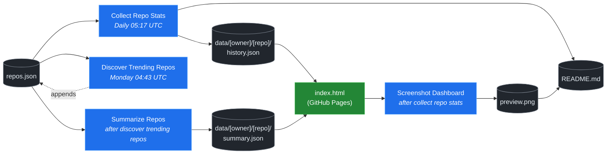

# 🚀 Rising Repos Tracker

> Automatically tracks daily GitHub stats (stars, forks, issues, velocity) for rising open source repos.

[](https://www.telosignal.com/)


**[→ View Live Dashboard](https://patrick-creates.github.io/rising-repos-tracker/)**

Built and maintained by [Telosignal](https://www.telosignal.com/).


<!-- AUTOGEN-STATS-START -->
## 📊 Current snapshot

> Auto-updated daily — last refreshed 2026-08-06

| Metric | Value |
|---|---|
| Repos tracked | **179** |
| Total stars | **8,528,974** |
| Total forks | **1,277,215** |
| Fastest growing | **ai-agent-book** (+1484.6/day) |

### 🔥 Top 5 by velocity

| # | Repo | Stars | Stars/day |
|---|---|---:|---:|
| 1 | [bojieli/ai-agent-book](https://github.com/bojieli/ai-agent-book) | 33,191 | +1484.6 |
| 2 | [DietrichGebert/ponytail](https://github.com/DietrichGebert/ponytail) | 96,992 | +1088.3 |
| 3 | [diegosouzapw/OmniRoute](https://github.com/diegosouzapw/OmniRoute) | 41,064 | +932.6 |
| 4 | [NousResearch/hermes-agent](https://github.com/NousResearch/hermes-agent) | 226,253 | +920.1 |
| 5 | [stablyai/orca](https://github.com/stablyai/orca) | 38,446 | +834.3 |

### 🆕 Recently added

- [herdrdev/herdr](https://github.com/herdrdev/herdr) — added 2026-08-03 — the runtime your coding agents live on
- [composio-community/awesome-codex-skills](https://github.com/composio-community/awesome-codex-skills) — added 2026-08-03 — A curated list of practical Codex skills for automating workflows across the Codex CLI and API.
- [NanmiCoder/cc-haha](https://github.com/NanmiCoder/cc-haha) — added 2026-08-03 — Local-first cross-platform desktop workspace for Claude Code / agents: multi-agent, Git worktrees, code diffs, skill marketplace, multi-model, Computer Use, task-aware desktop pets, with WeChat, Feishu, DingTalk, Telegram, WhatsApp and H5 access.
<!-- AUTOGEN-STATS-END -->

<!-- AUTOGEN-DIAGRAM-START -->
## 🔄 How it works


```mermaid
graph LR
    repos[("repos.json")]:::data
    history[("data/[owner]/[repo]/<br/>history.json")]:::data
    summary[("data/[owner]/[repo]/<br/>summary.json")]:::data
    readme[("README.md")]:::data
    preview[("preview.png")]:::data
    dashboard["index.html<br/>(GitHub Pages)"]:::output
    collect_yml["Collect Repo Stats<br/><i>Daily 05:17 UTC</i>"]:::workflow
    discover_yml["Discover Trending Repos<br/><i>Monday 04:43 UTC</i>"]:::workflow
    screenshot_yml["Screenshot Dashboard<br/><i>after collect repo stats</i>"]:::workflow
    summarize_yml["Summarize Repos<br/><i>after discover trending repos</i>"]:::workflow
    repos --> collect_yml
    collect_yml --> history
    collect_yml --> readme
    repos --> discover_yml
    discover_yml -.->|appends| repos
    dashboard --> screenshot_yml
    screenshot_yml --> preview
    repos --> summarize_yml
    summarize_yml --> summary
    history --> dashboard
    summary --> dashboard
    preview --> readme
    classDef workflow fill:#1f6feb,stroke:#58a6ff,color:#fff
    classDef data fill:#21262d,stroke:#7d8590,color:#e6edf3
    classDef output fill:#238636,stroke:#3fb950,color:#fff
```
<!-- AUTOGEN-DIAGRAM-END -->

<!-- AUTOGEN-WORKFLOWS-START -->
## ⚙️ Workflows

| File | Schedule | Name |
|---|---|---|
| `collect.yml` | Daily 05:17 UTC | Collect Repo Stats |
| `discover.yml` | Monday 04:43 UTC | Discover Trending Repos |
| `screenshot.yml` | After Collect Repo Stats | Screenshot Dashboard |
| `summarize.yml` | After Discover Trending Repos | Summarize Repos |

> All workflows commit results directly back to the repo. Schedules are best-effort — GitHub Actions cron can drift by a few minutes.
<!-- AUTOGEN-WORKFLOWS-END -->

<!-- AUTOGEN-REPOS-START -->
## 📋 All tracked repos

| Repo | Stars | Forks | Stars/day |
|---|---:|---:|---:|
| [openclaw/openclaw](https://github.com/openclaw/openclaw) | 385,302 | 80,998 | +162.7 |
| [obra/superpowers](https://github.com/obra/superpowers) | 267,573 | 23,913 | +711.0 |
| [affaan-m/everything-claude-code](https://github.com/affaan-m/everything-claude-code) | 238,111 | 36,162 | +671.3 |
| [affaan-m/ECC](https://github.com/affaan-m/ECC) | 238,111 | 36,162 | +628.5 |
| [NousResearch/hermes-agent](https://github.com/NousResearch/hermes-agent) | 226,253 | 44,077 | +920.1 |
| [Significant-Gravitas/AutoGPT](https://github.com/Significant-Gravitas/AutoGPT) | 185,844 | 46,051 | +18.4 |
| [microsoft/markitdown](https://github.com/microsoft/markitdown) | 171,820 | 12,506 | +574.3 |
| [f/prompts.chat](https://github.com/f/prompts.chat) | 166,800 | 21,539 | +54.4 |
| [langgenius/dify](https://github.com/langgenius/dify) | 151,507 | 23,916 | +121.0 |
| [open-webui/open-webui](https://github.com/open-webui/open-webui) | 148,002 | 21,541 | +130.7 |
| [langchain-ai/langchain](https://github.com/langchain-ai/langchain) | 143,530 | 23,918 | +81.1 |
| [github/spec-kit](https://github.com/github/spec-kit) | 125,516 | 11,212 | +325.4 |
| [farion1231/cc-switch](https://github.com/farion1231/cc-switch) | 124,931 | 8,483 | +636.1 |
| [microsoft/generative-ai-for-beginners](https://github.com/microsoft/generative-ai-for-beginners) | 116,680 | 61,676 | +69.7 |
| [nextlevelbuilder/ui-ux-pro-max-skill](https://github.com/nextlevelbuilder/ui-ux-pro-max-skill) | 113,946 | 12,193 | +424.2 |
| [Graphify-Labs/graphify](https://github.com/Graphify-Labs/graphify) | 103,170 | 10,023 | +647.2 |
| [DietrichGebert/ponytail](https://github.com/DietrichGebert/ponytail) | 96,992 | 5,325 | +1088.3 |
| [JuliusBrussee/caveman](https://github.com/JuliusBrussee/caveman) | 96,227 | 5,530 | +433.9 |
| [thedotmack/claude-mem](https://github.com/thedotmack/claude-mem) | 89,782 | 7,816 | +169.4 |
| [ruvnet/RuView](https://github.com/ruvnet/RuView) | 88,673 | 11,793 | +312.1 |
| [ChatGPTNextWeb/NextChat](https://github.com/ChatGPTNextWeb/NextChat) | 88,588 | 59,331 | +6.9 |
| [vllm-project/vllm](https://github.com/vllm-project/vllm) | 88,318 | 20,333 | +99.2 |
| [nexu-io/open-design](https://github.com/nexu-io/open-design) | 84,058 | 9,775 | +498.6 |
| [OpenHands/OpenHands](https://github.com/OpenHands/OpenHands) | 83,238 | 10,735 | +116.3 |
| [lobehub/lobehub](https://github.com/lobehub/lobehub) | 81,317 | 15,775 | +50.8 |
| [koala73/worldmonitor](https://github.com/koala73/worldmonitor) | 79,229 | 11,837 | +310.8 |
| [dair-ai/Prompt-Engineering-Guide](https://github.com/dair-ai/Prompt-Engineering-Guide) | 77,302 | 8,495 | +32.5 |
| [openai/openai-cookbook](https://github.com/openai/openai-cookbook) | 75,124 | 12,697 | +18.9 |
| [rtk-ai/rtk](https://github.com/rtk-ai/rtk) | 74,948 | 4,718 | +317.1 |
| [shareAI-lab/learn-claude-code](https://github.com/shareAI-lab/learn-claude-code) | 73,377 | 11,904 | +153.8 |
| [Leonxlnx/taste-skill](https://github.com/Leonxlnx/taste-skill) | 72,744 | 5,003 | +641.4 |
| [ComposioHQ/awesome-claude-skills](https://github.com/ComposioHQ/awesome-claude-skills) | 71,911 | 8,146 | +144.0 |
| [datawhalechina/hello-agents](https://github.com/datawhalechina/hello-agents) | 71,188 | 8,865 | +256.6 |
| [unslothai/unsloth](https://github.com/unslothai/unsloth) | 69,626 | 6,285 | +64.1 |
| [code-yeongyu/oh-my-openagent](https://github.com/code-yeongyu/oh-my-openagent) | 67,323 | 5,497 | +112.4 |
| [Panniantong/Agent-Reach](https://github.com/Panniantong/Agent-Reach) | 67,181 | 5,604 | +740.7 |
| [xtekky/gpt4free](https://github.com/xtekky/gpt4free) | 66,530 | 13,531 | +3.6 |
| [chopratejas/headroom](https://github.com/chopratejas/headroom) | 65,126 | 4,952 | +710.8 |
| [headroomlabs-ai/headroom](https://github.com/headroomlabs-ai/headroom) | 65,126 | 4,952 | +427.2 |
| [shanraisshan/claude-code-best-practice](https://github.com/shanraisshan/claude-code-best-practice) | 64,068 | 6,374 | +132.1 |
| [Fission-AI/OpenSpec](https://github.com/Fission-AI/OpenSpec) | 63,994 | 4,416 | +190.1 |
| [santifer/career-ops](https://github.com/santifer/career-ops) | 62,983 | 12,421 | +221.7 |
| [asgeirtj/system_prompts_leaks](https://github.com/asgeirtj/system_prompts_leaks) | 62,428 | 10,249 | +275.5 |
| [tw93/Pake](https://github.com/tw93/Pake) | 60,482 | 12,326 | +146.3 |
| [ZhuLinsen/daily_stock_analysis](https://github.com/ZhuLinsen/daily_stock_analysis) | 60,209 | 51,529 | +292.7 |
| [MemPalace/mempalace](https://github.com/MemPalace/mempalace) | 58,112 | 7,473 | +71.4 |
| [mvanhorn/last30days-skill](https://github.com/mvanhorn/last30days-skill) | 57,398 | 4,960 | +419.1 |
| [BerriAI/litellm](https://github.com/BerriAI/litellm) | 55,681 | 10,365 | +103.7 |
| [FlowiseAI/Flowise](https://github.com/FlowiseAI/Flowise) | 55,200 | 24,857 | +28.8 |
| [ggml-org/whisper.cpp](https://github.com/ggml-org/whisper.cpp) | 52,609 | 6,026 | +34.8 |
| [hesreallyhim/awesome-claude-code](https://github.com/hesreallyhim/awesome-claude-code) | 51,748 | 4,517 | +95.7 |
| [jamiepine/voicebox](https://github.com/jamiepine/voicebox) | 49,480 | 6,095 | +310.0 |
| [usestrix/strix](https://github.com/usestrix/strix) | 49,122 | 5,191 | +354.7 |
| [ChromeDevTools/chrome-devtools-mcp](https://github.com/ChromeDevTools/chrome-devtools-mcp) | 48,610 | 3,361 | +109.1 |
| [Aider-AI/aider](https://github.com/Aider-AI/aider) | 47,982 | 4,824 | +37.8 |
| [elder-plinius/CL4R1T4S](https://github.com/elder-plinius/CL4R1T4S) | 46,764 | 9,521 | +151.4 |
| [HKUDS/nanobot](https://github.com/HKUDS/nanobot) | 46,698 | 8,260 | +50.2 |
| [zhayujie/CowAgent](https://github.com/zhayujie/CowAgent) | 46,353 | 10,296 | +22.5 |
| [router-for-me/CLIProxyAPI](https://github.com/router-for-me/CLIProxyAPI) | 46,308 | 7,190 | +158.4 |
| [rohitg00/ai-engineering-from-scratch](https://github.com/rohitg00/ai-engineering-from-scratch) | 46,057 | 7,957 | +298.4 |
| [calesthio/OpenMontage](https://github.com/calesthio/OpenMontage) | 45,369 | 5,606 | +461.0 |
| [sickn33/antigravity-awesome-skills](https://github.com/sickn33/antigravity-awesome-skills) | 44,543 | 6,541 | +80.3 |
| [sickn33/agentic-awesome-skills](https://github.com/sickn33/agentic-awesome-skills) | 44,543 | 6,541 | +62.5 |
| [QuantumNous/new-api](https://github.com/QuantumNous/new-api) | 44,485 | 10,466 | +125.0 |
| [kepano/obsidian-skills](https://github.com/kepano/obsidian-skills) | 44,212 | 3,157 | +156.5 |
| [coreyhaines31/marketingskills](https://github.com/coreyhaines31/marketingskills) | 43,196 | 6,802 | +178.2 |
| [danny-avila/LibreChat](https://github.com/danny-avila/LibreChat) | 41,712 | 8,609 | +58.1 |
| [chatboxai/chatbox](https://github.com/chatboxai/chatbox) | 41,342 | 4,188 | +16.8 |
| [Imbad0202/academic-research-skills](https://github.com/Imbad0202/academic-research-skills) | 41,100 | 3,277 | +140.6 |
| [diegosouzapw/OmniRoute](https://github.com/diegosouzapw/OmniRoute) | 41,064 | 5,429 | +932.6 |
| [Hmbown/CodeWhale](https://github.com/Hmbown/CodeWhale) | 40,510 | 3,504 | +80.0 |
| [chatanywhere/GPT_API_free](https://github.com/chatanywhere/GPT_API_free) | 39,806 | 2,679 | +22.6 |
| [heygen-com/hyperframes](https://github.com/heygen-com/hyperframes) | 39,679 | 3,761 | +239.3 |
| [mindsdb/mindshub](https://github.com/mindsdb/mindshub) | 39,524 | 6,224 | +5.1 |
| [langchain-ai/langgraph](https://github.com/langchain-ai/langgraph) | 39,013 | 6,568 | +79.8 |
| [AstrBotDevs/AstrBot](https://github.com/AstrBotDevs/AstrBot) | 38,689 | 2,773 | +77.3 |
| [wshobson/agents](https://github.com/wshobson/agents) | 38,528 | 4,117 | +35.5 |
| [stablyai/orca](https://github.com/stablyai/orca) | 38,446 | 2,707 | +834.3 |
| [Yeachan-Heo/oh-my-claudecode](https://github.com/Yeachan-Heo/oh-my-claudecode) | 38,382 | 3,458 | +48.7 |
| [google/langextract](https://github.com/google/langextract) | 37,985 | 2,646 | +19.6 |
| [DeusData/codebase-memory-mcp](https://github.com/DeusData/codebase-memory-mcp) | 37,666 | 2,998 | +448.3 |
| [github/awesome-copilot](https://github.com/github/awesome-copilot) | 37,499 | 4,714 | +50.6 |
| [songquanpeng/one-api](https://github.com/songquanpeng/one-api) | 36,226 | 6,784 | +27.6 |
| [PDFMathTranslate/PDFMathTranslate](https://github.com/PDFMathTranslate/PDFMathTranslate) | 35,977 | 3,214 | +26.9 |
| [agentscope-ai/QwenPaw](https://github.com/agentscope-ai/QwenPaw) | 33,778 | 2,950 | +307.7 |
| [bojieli/ai-agent-book](https://github.com/bojieli/ai-agent-book) | 33,191 | 3,559 | +1484.6 |
| [anthropics/claude-plugins-official](https://github.com/anthropics/claude-plugins-official) | 33,150 | 3,746 | +62.7 |
| [zeroclaw-labs/zeroclaw](https://github.com/zeroclaw-labs/zeroclaw) | 32,522 | 4,876 | +12.8 |
| [esengine/DeepSeek-Reasonix](https://github.com/esengine/DeepSeek-Reasonix) | 31,919 | 2,061 | +210.1 |
| [iOfficeAI/AionUi](https://github.com/iOfficeAI/AionUi) | 31,557 | 3,205 | +63.8 |
| [AlexsJones/llmfit](https://github.com/AlexsJones/llmfit) | 31,162 | 1,912 | +63.0 |
| [JCodesMore/ai-website-cloner-template](https://github.com/JCodesMore/ai-website-cloner-template) | 31,073 | 4,476 | +270.8 |
| [Gitlawb/openclaude](https://github.com/Gitlawb/openclaude) | 30,534 | 8,900 | +36.3 |
| [MadsLorentzen/ai-job-search](https://github.com/MadsLorentzen/ai-job-search) | 30,352 | 10,291 | +365.4 |
| [googleworkspace/cli](https://github.com/googleworkspace/cli) | 30,225 | 1,768 | +53.1 |
| [HKUDS/Vibe-Trading](https://github.com/HKUDS/Vibe-Trading) | 29,924 | 4,821 | +399.6 |
| [voideditor/void](https://github.com/voideditor/void) | 28,861 | 2,607 | +0.8 |
| [tirth8205/code-review-graph](https://github.com/tirth8205/code-review-graph) | 28,758 | 2,669 | +197.0 |
| [alibaba/page-agent](https://github.com/alibaba/page-agent) | 28,464 | 2,514 | +190.5 |
| [volcengine/OpenViking](https://github.com/volcengine/OpenViking) | 27,992 | 2,201 | +45.2 |
| [jackwener/OpenCLI](https://github.com/jackwener/OpenCLI) | 27,777 | 2,729 | +67.4 |
| [BloopAI/vibe-kanban](https://github.com/BloopAI/vibe-kanban) | 27,680 | 2,941 | +14.7 |
| [langchain-ai/deepagents](https://github.com/langchain-ai/deepagents) | 27,392 | 3,831 | +54.9 |
| [mukul975/Anthropic-Cybersecurity-Skills](https://github.com/mukul975/Anthropic-Cybersecurity-Skills) | 27,368 | 3,308 | +205.5 |
| [jarrodwatts/claude-hud](https://github.com/jarrodwatts/claude-hud) | 27,155 | 1,262 | +41.8 |
| [p-e-w/heretic](https://github.com/p-e-w/heretic) | 27,149 | 2,935 | +53.8 |
| [rohitg00/agentmemory](https://github.com/rohitg00/agentmemory) | 26,625 | 2,258 | +81.4 |
| [iOfficeAI/OfficeCLI](https://github.com/iOfficeAI/OfficeCLI) | 25,987 | 1,744 | +567.4 |
| [zai-org/Open-AutoGLM](https://github.com/zai-org/Open-AutoGLM) | 25,957 | 4,017 | +8.4 |
| [manaflow-ai/cmux](https://github.com/manaflow-ai/cmux) | 25,662 | 2,157 | +54.4 |
| [toon-format/toon](https://github.com/toon-format/toon) | 25,094 | 1,112 | +10.1 |
| [ogulcancelik/herdr](https://github.com/ogulcancelik/herdr) | 24,795 | 1,742 | +399.9 |
| [herdrdev/herdr](https://github.com/herdrdev/herdr) | 24,795 | 1,742 | +335.3 |
| [decolua/9router](https://github.com/decolua/9router) | 24,775 | 4,361 | +138.5 |
| [winfunc/opcode](https://github.com/winfunc/opcode) | 22,353 | 1,723 | +5.9 |
| [can1357/oh-my-pi](https://github.com/can1357/oh-my-pi) | 22,270 | 2,114 | +183.9 |
| [coze-dev/coze-studio](https://github.com/coze-dev/coze-studio) | 21,367 | 3,106 | +7.1 |
| [NirDiamant/agents-towards-production](https://github.com/NirDiamant/agents-towards-production) | 21,247 | 2,817 | +10.4 |
| [steipete/CodexBar](https://github.com/steipete/CodexBar) | 19,696 | 1,650 | +99.8 |
| [mksglu/context-mode](https://github.com/mksglu/context-mode) | 19,652 | 1,403 | +42.0 |
| [Tencent/WeKnora](https://github.com/Tencent/WeKnora) | 19,434 | 2,775 | +60.4 |
| [KKKKhazix/khazix-skills](https://github.com/KKKKhazix/khazix-skills) | 19,269 | 2,116 | +106.5 |
| [tanweai/pua](https://github.com/tanweai/pua) | 19,251 | 1,172 | +19.3 |
| [alibaba/open-code-review](https://github.com/alibaba/open-code-review) | 19,248 | 1,320 | +298.7 |
| [pranshuparmar/witr](https://github.com/pranshuparmar/witr) | 19,080 | 613 | +27.6 |
| [jnMetaCode/agency-agents-zh](https://github.com/jnMetaCode/agency-agents-zh) | 18,880 | 3,107 | +77.2 |
| [datawhalechina/easy-vibe](https://github.com/datawhalechina/easy-vibe) | 18,768 | 1,785 | +35.1 |
| [jundot/omlx](https://github.com/jundot/omlx) | 18,480 | 1,591 | +35.5 |
| [RightNow-AI/openfang](https://github.com/RightNow-AI/openfang) | 18,077 | 2,282 | +4.8 |
| [microsoft/agent-lightning](https://github.com/microsoft/agent-lightning) | 17,454 | 1,529 | +2.8 |
| [danielmiessler/LifeOS](https://github.com/danielmiessler/LifeOS) | 17,175 | 2,322 | +24.6 |
| [nesquena/hermes-webui](https://github.com/nesquena/hermes-webui) | 17,010 | 2,323 | +48.3 |
| [browser-use/browser-harness](https://github.com/browser-use/browser-harness) | 16,515 | 1,566 | +27.3 |
| [cft0808/edict](https://github.com/cft0808/edict) | 16,333 | 1,711 | +5.2 |
| [1jehuang/jcode](https://github.com/1jehuang/jcode) | 16,126 | 1,796 | +325.9 |
| [MemoriLabs/Memori](https://github.com/MemoriLabs/Memori) | 15,683 | 2,879 | +7.6 |
| [composio-community/awesome-codex-skills](https://github.com/composio-community/awesome-codex-skills) | 15,639 | 1,513 | +24.7 |
| [TencentCloud/TencentDB-Agent-Memory](https://github.com/TencentCloud/TencentDB-Agent-Memory) | 15,414 | 1,397 | +279.0 |
| [Anionex/banana-slides](https://github.com/Anionex/banana-slides) | 15,399 | 1,777 | +6.6 |
| [xpzouying/xiaohongshu-mcp](https://github.com/xpzouying/xiaohongshu-mcp) | 15,101 | 2,216 | +18.1 |
| [xbtlin/ai-berkshire](https://github.com/xbtlin/ai-berkshire) | 15,075 | 2,217 | +138.6 |
| [kyegomez/OpenMythos](https://github.com/kyegomez/OpenMythos) | 14,780 | 3,295 | +13.9 |
| [yusufkaraaslan/Skill_Seekers](https://github.com/yusufkaraaslan/Skill_Seekers) | 14,711 | 1,489 | +10.8 |
| [wanshuiyin/Auto-claude-code-research-in-sleep](https://github.com/wanshuiyin/Auto-claude-code-research-in-sleep) | 14,308 | 1,263 | +40.4 |
| [NevaMind-AI/memU](https://github.com/NevaMind-AI/memU) | 14,262 | 1,055 | +8.0 |
| [NanmiCoder/cc-haha](https://github.com/NanmiCoder/cc-haha) | 13,942 | 8,528 | +22.0 |
| [t8y2/dbx](https://github.com/t8y2/dbx) | 13,444 | 1,365 | +160.7 |
| [superset-sh/superset](https://github.com/superset-sh/superset) | 12,789 | 1,161 | +16.6 |
| [XiaomiMiMo/MiMo-Code](https://github.com/XiaomiMiMo/MiMo-Code) | 12,662 | 1,293 | +43.1 |
| [sirmalloc/ccstatusline](https://github.com/sirmalloc/ccstatusline) | 12,257 | 536 | +25.7 |
| [EverMind-AI/EverOS](https://github.com/EverMind-AI/EverOS) | 11,842 | 879 | +56.0 |
| [walkinglabs/learn-harness-engineering](https://github.com/walkinglabs/learn-harness-engineering) | 11,035 | 1,196 | +37.1 |
| [ValueCell-ai/valuecell](https://github.com/ValueCell-ai/valuecell) | 10,961 | 1,812 | +2.3 |
| [aden-hive/hive](https://github.com/aden-hive/hive) | 10,867 | 5,672 | +6.7 |
| [0x4m4/hexstrike-ai](https://github.com/0x4m4/hexstrike-ai) | 10,831 | 2,260 | +21.6 |
| [MemTensor/MemOS](https://github.com/MemTensor/MemOS) | 10,620 | 977 | +15.6 |
| [brokermr810/QuantDinger](https://github.com/brokermr810/QuantDinger) | 10,299 | 2,156 | +32.8 |
| [OpenByteInc/QuantDinger](https://github.com/OpenByteInc/QuantDinger) | 10,299 | 2,156 | +29.2 |
| [Kuberwastaken/claurst](https://github.com/Kuberwastaken/claurst) | 10,180 | 7,782 | +8.3 |
| [ConardLi/garden-skills](https://github.com/ConardLi/garden-skills) | 10,085 | 1,334 | +29.2 |
| [EKKOLearnAI/hermes-studio](https://github.com/EKKOLearnAI/hermes-studio) | 9,799 | 1,204 | +30.3 |
| [frankbria/ralph-claude-code](https://github.com/frankbria/ralph-claude-code) | 9,584 | 723 | +5.6 |
| [ykdojo/claude-code-tips](https://github.com/ykdojo/claude-code-tips) | 9,552 | 758 | +17.3 |
| [StarTrail-org/PixelRAG](https://github.com/StarTrail-org/PixelRAG) | 9,258 | 788 | +111.4 |
| [iflytek/astron-agent](https://github.com/iflytek/astron-agent) | 9,246 | 873 | +20.5 |
| [getagentseal/codeburn](https://github.com/getagentseal/codeburn) | 9,159 | 719 | +22.2 |
| [EvoMap/evolver](https://github.com/EvoMap/evolver) | 8,939 | 829 | +2.7 |
| [openai/codex-security](https://github.com/openai/codex-security) | 8,915 | 619 | +211.0 |
| [MiroMindAI/MiroThinker](https://github.com/MiroMindAI/MiroThinker) | 8,367 | 644 | +1.3 |
| [modem-dev/hunk](https://github.com/modem-dev/hunk) | 8,124 | 236 | +59.1 |
| [mmulet/term.everything](https://github.com/mmulet/term.everything) | 8,058 | 192 | +1.1 |
| [ValueCell-ai/ClawX](https://github.com/ValueCell-ai/ClawX) | 7,564 | 1,131 | +1.0 |
| [opensquilla/opensquilla](https://github.com/opensquilla/opensquilla) | 6,549 | 505 | +20.0 |
| [steipete/summarize](https://github.com/steipete/summarize) | 6,525 | 439 | +4.8 |
| [Arthur-Ficial/apfel](https://github.com/Arthur-Ficial/apfel) | 6,255 | 239 | +5.8 |
| [Andyyyy64/whichllm](https://github.com/Andyyyy64/whichllm) | 6,150 | 325 | +16.6 |
| [microsoft/fara](https://github.com/microsoft/fara) | 6,125 | 599 | +5.3 |
| [UfoMiao/zcf](https://github.com/UfoMiao/zcf) | 6,075 | 424 | +0.2 |
| [re4/LibreCode](https://github.com/re4/LibreCode) | 81 | 4 | — |
<!-- AUTOGEN-REPOS-END -->

---

## What it does

- Collects daily snapshots of stars, forks, watchers and open issues for every tracked repo
- Discovers new trending repos automatically every Monday using the GitHub Search API
- Generates AI summaries (use cases, similar tools, tags) for each tracked repo via GitHub Models
- Stores all history as plain JSON — no database, no backend
- Renders a live dashboard via GitHub Pages — updates daily, zero maintenance

## Tracked repos

Data lives in [`data/`](./data) — one folder per repo, one `history.json` per entry.  
The full watch list is in [`repos.json`](./repos.json).

## Fork & use it for yourself

This is my personal tracker — the watch list reflects what I find interesting. If you want to track different repos, the best path is to **fork this repo and run your own**.

### Setup

1. Fork this repo to your account
2. Replace the contents of [`repos.json`](./repos.json) with the repos you want to track (or just leave one entry — `discover.yml` will auto-add more every Monday)
3. Go to **Settings → Pages** and enable GitHub Pages from the `main` branch
4. Go to **Actions** and run **Collect Repo Stats** once manually to seed your first data point
5. Your dashboard will be live at `https://YOUR-USERNAME.github.io/rising-repos-tracker/`

That's it — daily collection and weekly discovery run automatically on schedule. Zero ongoing maintenance.

### Customizing what gets discovered

Edit [`scripts/discover.js`](./scripts/discover.js) to change:

- `MIN_STARS` — minimum star threshold for candidates
- `MAX_AGE_DAYS` — how recent a repo must be
- `MAX_NEW_REPOS` — how many to add per discovery run
- The `queries` array — GitHub Search API queries that define what "trending" means to you

### Adding a repo manually

Just edit `repos.json` directly:

```json
{
  "owner": "OWNER",
  "repo": "REPO",
  "added": "YYYY-MM-DD",
  "notes": "why you're tracking this"
}
```

The next daily collect run picks it up automatically.

## Stack

- **GitHub Actions** — scheduling and automation
- **GitHub Pages** — dashboard hosting
- **GitHub API** — data source
- **GitHub Models** — free AI summaries (gpt-4o-mini)
- **Chart.js** — star growth visualization
- **Mermaid** — architecture diagram (rendered by GitHub)
- No dependencies, no build step, no database

## License

MIT
