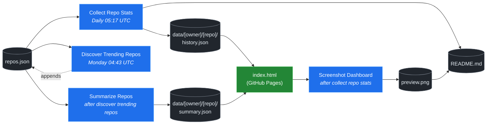

# 🚀 Rising Repos Tracker

> Automatically tracks daily GitHub stats (stars, forks, issues, velocity) for rising open source repos.

[](https://www.telosignal.com/)


**[→ View Live Dashboard](https://patrick-creates.github.io/rising-repos-tracker/)**

Built and maintained by [Telosignal](https://www.telosignal.com/).


<!-- AUTOGEN-STATS-START -->
## 📊 Current snapshot

> Auto-updated daily — last refreshed 2026-09-30

| Metric | Value |
|---|---|
| Repos tracked | **210** |
| Total stars | **10,205,126** |
| Total forks | **1,482,388** |
| Fastest growing | **VoiceStudio** (+1278.3/day) |

### 🔥 Top 5 by velocity

| # | Repo | Stars | Stars/day |
|---|---|---:|---:|
| 1 | [debpalash/VoiceStudio](https://github.com/debpalash/VoiceStudio) | 49,621 | +1278.3 |
| 2 | [DietrichGebert/ponytail](https://github.com/DietrichGebert/ponytail) | 148,573 | +1005.5 |
| 3 | [stablyai/orca](https://github.com/stablyai/orca) | 82,002 | +807.2 |
| 4 | [NousResearch/hermes-agent](https://github.com/NousResearch/hermes-agent) | 250,214 | +729.8 |
| 5 | [diegosouzapw/OmniRoute](https://github.com/diegosouzapw/OmniRoute) | 71,583 | +691.1 |

### 🆕 Recently added

- [blader/humanizer](https://github.com/blader/humanizer) — added 2026-09-28 — Agent skill that removes signs of AI-generated writing from text
- [LibreChat-AI/LibreChat](https://github.com/LibreChat-AI/LibreChat) — added 2026-09-28 — Enhanced ChatGPT Clone: Features Agents, MCP, Skills, DeepSeek, Anthropic, AWS, OpenAI, Responses API, Azure, Groq, o1, GPT-5, Mistral, OpenRouter, Vertex AI, Gemini, Artifacts, AI model switching, message search, Code Interpreter, langchain, DALL-E-3, OpenAPI Actions, Functions, Secure Multi-User Auth, Presets, open-source for self-hosting. Active
- [hypit-ai/hypit](https://github.com/hypit-ai/hypit) — added 2026-09-28 — Clone any viral video with AI agents. Not just a script, the whole workflow: swap the face, the words, the B-roll, ship 100 variants in one command, and get your 100M views.
<!-- AUTOGEN-STATS-END -->

<!-- AUTOGEN-DIAGRAM-START -->
## 🔄 How it works


```mermaid
graph LR
    repos[("repos.json")]:::data
    history[("data/[owner]/[repo]/<br/>history.json")]:::data
    summary[("data/[owner]/[repo]/<br/>summary.json")]:::data
    readme[("README.md")]:::data
    preview[("preview.png")]:::data
    dashboard["index.html<br/>(GitHub Pages)"]:::output
    collect_yml["Collect Repo Stats<br/><i>Daily 05:17 UTC</i>"]:::workflow
    discover_yml["Discover Trending Repos<br/><i>Monday 04:43 UTC</i>"]:::workflow
    screenshot_yml["Screenshot Dashboard<br/><i>after collect repo stats</i>"]:::workflow
    summarize_yml["Summarize Repos<br/><i>after discover trending repos</i>"]:::workflow
    repos --> collect_yml
    collect_yml --> history
    collect_yml --> readme
    repos --> discover_yml
    discover_yml -.->|appends| repos
    dashboard --> screenshot_yml
    screenshot_yml --> preview
    repos --> summarize_yml
    summarize_yml --> summary
    history --> dashboard
    summary --> dashboard
    preview --> readme
    classDef workflow fill:#1f6feb,stroke:#58a6ff,color:#fff
    classDef data fill:#21262d,stroke:#7d8590,color:#e6edf3
    classDef output fill:#238636,stroke:#3fb950,color:#fff
```
<!-- AUTOGEN-DIAGRAM-END -->

<!-- AUTOGEN-WORKFLOWS-START -->
## ⚙️ Workflows

| File | Schedule | Name |
|---|---|---|
| `collect.yml` | Daily 05:17 UTC | Collect Repo Stats |
| `discover.yml` | Monday 04:43 UTC | Discover Trending Repos |
| `screenshot.yml` | After Collect Repo Stats | Screenshot Dashboard |
| `summarize.yml` | After Discover Trending Repos | Summarize Repos |

> All workflows commit results directly back to the repo. Schedules are best-effort — GitHub Actions cron can drift by a few minutes.
<!-- AUTOGEN-WORKFLOWS-END -->

<!-- AUTOGEN-REPOS-START -->
## 📋 All tracked repos

| Repo | Stars | Forks | Stars/day |
|---|---:|---:|---:|
| [openclaw/openclaw](https://github.com/openclaw/openclaw) | 390,817 | 82,207 | +138.2 |
| [obra/superpowers](https://github.com/obra/superpowers) | 293,234 | 26,240 | +576.6 |
| [affaan-m/everything-claude-code](https://github.com/affaan-m/everything-claude-code) | 269,890 | 40,335 | +634.6 |
| [affaan-m/ECC](https://github.com/affaan-m/ECC) | 269,890 | 40,335 | +606.7 |
| [NousResearch/hermes-agent](https://github.com/NousResearch/hermes-agent) | 250,214 | 53,427 | +729.8 |
| [microsoft/markitdown](https://github.com/microsoft/markitdown) | 187,713 | 13,875 | +462.2 |
| [Significant-Gravitas/AutoGPT](https://github.com/Significant-Gravitas/AutoGPT) | 187,620 | 45,979 | +23.9 |
| [f/prompts.chat](https://github.com/f/prompts.chat) | 171,652 | 22,018 | +67.7 |
| [langgenius/dify](https://github.com/langgenius/dify) | 157,565 | 24,850 | +116.7 |
| [open-webui/open-webui](https://github.com/open-webui/open-webui) | 153,609 | 22,461 | +119.4 |
| [DietrichGebert/ponytail](https://github.com/DietrichGebert/ponytail) | 148,573 | 7,991 | +1005.5 |
| [langchain-ai/langchain](https://github.com/langchain-ai/langchain) | 147,308 | 24,666 | +76.2 |
| [github/spec-kit](https://github.com/github/spec-kit) | 139,492 | 12,505 | +297.4 |
| [farion1231/cc-switch](https://github.com/farion1231/cc-switch) | 139,005 | 9,383 | +481.2 |
| [nextlevelbuilder/ui-ux-pro-max-skill](https://github.com/nextlevelbuilder/ui-ux-pro-max-skill) | 131,828 | 13,989 | +385.3 |
| [Graphify-Labs/graphify](https://github.com/Graphify-Labs/graphify) | 122,626 | 11,814 | +398.9 |
| [microsoft/generative-ai-for-beginners](https://github.com/microsoft/generative-ai-for-beginners) | 120,822 | 63,549 | +71.9 |
| [JuliusBrussee/caveman](https://github.com/JuliusBrussee/caveman) | 108,498 | 6,287 | +348.0 |
| [nexu-io/open-design](https://github.com/nexu-io/open-design) | 98,853 | 11,452 | +405.0 |
| [ruvnet/RuView](https://github.com/ruvnet/RuView) | 95,657 | 12,633 | +232.5 |
| [thedotmack/claude-mem](https://github.com/thedotmack/claude-mem) | 94,982 | 8,404 | +140.0 |
| [vllm-project/vllm](https://github.com/vllm-project/vllm) | 92,983 | 22,843 | +93.6 |
| [Leonxlnx/taste-skill](https://github.com/Leonxlnx/taste-skill) | 91,408 | 6,214 | +504.1 |
| [OpenHands/OpenHands](https://github.com/OpenHands/OpenHands) | 89,591 | 11,826 | +116.0 |
| [ChatGPTNextWeb/NextChat](https://github.com/ChatGPTNextWeb/NextChat) | 88,830 | 58,956 | +5.9 |
| [koala73/worldmonitor](https://github.com/koala73/worldmonitor) | 87,613 | 13,366 | +246.3 |
| [Panniantong/Agent-Reach](https://github.com/Panniantong/Agent-Reach) | 86,279 | 7,578 | +550.9 |
| [lobehub/lobehub](https://github.com/lobehub/lobehub) | 82,918 | 15,950 | +42.3 |
| [rtk-ai/rtk](https://github.com/rtk-ai/rtk) | 82,072 | 5,205 | +240.7 |
| [stablyai/orca](https://github.com/stablyai/orca) | 82,002 | 5,324 | +807.2 |
| [datawhalechina/hello-agents](https://github.com/datawhalechina/hello-agents) | 81,407 | 10,117 | +227.8 |
| [dair-ai/Prompt-Engineering-Guide](https://github.com/dair-ai/Prompt-Engineering-Guide) | 78,739 | 8,650 | +29.9 |
| [shareAI-lab/learn-claude-code](https://github.com/shareAI-lab/learn-claude-code) | 77,835 | 12,497 | +124.1 |
| [unslothai/unsloth](https://github.com/unslothai/unsloth) | 77,071 | 7,093 | +93.1 |
| [openai/openai-cookbook](https://github.com/openai/openai-cookbook) | 76,280 | 12,897 | +19.8 |
| [ComposioHQ/awesome-claude-skills](https://github.com/ComposioHQ/awesome-claude-skills) | 75,934 | 8,864 | +115.2 |
| [chopratejas/headroom](https://github.com/chopratejas/headroom) | 74,145 | 5,730 | +429.7 |
| [headroomlabs-ai/headroom](https://github.com/headroomlabs-ai/headroom) | 74,145 | 5,730 | +282.4 |
| [santifer/career-ops](https://github.com/santifer/career-ops) | 73,106 | 13,746 | +206.4 |
| [career-ops-hq/career-ops](https://github.com/career-ops-hq/career-ops) | 73,106 | 13,746 | +118.4 |
| [diegosouzapw/OmniRoute](https://github.com/diegosouzapw/OmniRoute) | 71,583 | 10,197 | +691.1 |
| [Fission-AI/OpenSpec](https://github.com/Fission-AI/OpenSpec) | 70,746 | 4,854 | +162.7 |
| [code-yeongyu/oh-my-openagent](https://github.com/code-yeongyu/oh-my-openagent) | 69,667 | 5,732 | +84.0 |
| [asgeirtj/system_prompts_leaks](https://github.com/asgeirtj/system_prompts_leaks) | 68,644 | 11,154 | +209.3 |
| [shanraisshan/claude-code-best-practice](https://github.com/shanraisshan/claude-code-best-practice) | 66,781 | 6,666 | +98.4 |
| [xtekky/gpt4free](https://github.com/xtekky/gpt4free) | 66,734 | 13,496 | +3.7 |
| [ZhuLinsen/daily_stock_analysis](https://github.com/ZhuLinsen/daily_stock_analysis) | 65,807 | 54,920 | +210.7 |
| [usestrix/strix](https://github.com/usestrix/strix) | 65,672 | 7,201 | +330.3 |
| [mvanhorn/last30days-skill](https://github.com/mvanhorn/last30days-skill) | 63,232 | 5,504 | +268.1 |
| [calesthio/OpenMontage](https://github.com/calesthio/OpenMontage) | 61,950 | 7,894 | +366.7 |
| [rohitg00/ai-engineering-from-scratch](https://github.com/rohitg00/ai-engineering-from-scratch) | 61,949 | 10,592 | +294.1 |
| [tw93/Pake](https://github.com/tw93/Pake) | 61,814 | 12,730 | +96.6 |
| [BerriAI/litellm](https://github.com/BerriAI/litellm) | 59,917 | 11,912 | +92.8 |
| [MemPalace/mempalace](https://github.com/MemPalace/mempalace) | 59,366 | 7,563 | +51.6 |
| [jamiepine/voicebox](https://github.com/jamiepine/voicebox) | 56,037 | 6,986 | +223.3 |
| [FlowiseAI/Flowise](https://github.com/FlowiseAI/Flowise) | 55,489 | 25,053 | +19.2 |
| [hesreallyhim/awesome-claude-code](https://github.com/hesreallyhim/awesome-claude-code) | 54,840 | 4,776 | +79.6 |
| [heygen-com/hyperframes](https://github.com/heygen-com/hyperframes) | 54,389 | 4,946 | +252.9 |
| [ggml-org/whisper.cpp](https://github.com/ggml-org/whisper.cpp) | 54,036 | 6,200 | +31.2 |
| [router-for-me/CLIProxyAPI](https://github.com/router-for-me/CLIProxyAPI) | 53,620 | 8,083 | +147.5 |
| [blader/humanizer](https://github.com/blader/humanizer) | 53,012 | 4,224 | +249.5 |
| [ChromeDevTools/chrome-devtools-mcp](https://github.com/ChromeDevTools/chrome-devtools-mcp) | 52,782 | 5,272 | +95.5 |
| [coreyhaines31/marketingskills](https://github.com/coreyhaines31/marketingskills) | 51,965 | 7,833 | +169.6 |
| [bojieli/ai-agent-book](https://github.com/bojieli/ai-agent-book) | 51,877 | 5,838 | +610.1 |
| [elder-plinius/CL4R1T4S](https://github.com/elder-plinius/CL4R1T4S) | 50,812 | 10,417 | +111.4 |
| [Imbad0202/academic-research-skills](https://github.com/Imbad0202/academic-research-skills) | 49,957 | 3,858 | +157.9 |
| [debpalash/VoiceStudio](https://github.com/debpalash/VoiceStudio) | 49,621 | 5,520 | +1278.3 |
| [Aider-AI/aider](https://github.com/Aider-AI/aider) | 49,292 | 5,018 | +32.1 |
| [QuantumNous/new-api](https://github.com/QuantumNous/new-api) | 49,139 | 11,806 | +107.7 |
| [kepano/obsidian-skills](https://github.com/kepano/obsidian-skills) | 49,029 | 3,491 | +125.2 |
| [HKUDS/nanobot](https://github.com/HKUDS/nanobot) | 48,696 | 8,597 | +44.6 |
| [K-Dense-AI/scientific-agent-skills](https://github.com/K-Dense-AI/scientific-agent-skills) | 47,183 | 4,266 | +161.2 |
| [zhayujie/CowAgent](https://github.com/zhayujie/CowAgent) | 47,180 | 10,376 | +19.4 |
| [sickn33/antigravity-awesome-skills](https://github.com/sickn33/antigravity-awesome-skills) | 47,101 | 6,863 | +65.8 |
| [sickn33/agentic-awesome-skills](https://github.com/sickn33/agentic-awesome-skills) | 47,101 | 6,863 | +51.4 |
| [DeusData/codebase-memory-mcp](https://github.com/DeusData/codebase-memory-mcp) | 45,524 | 3,724 | +267.7 |
| [LibreChat-AI/LibreChat](https://github.com/LibreChat-AI/LibreChat) | 45,147 | 9,249 | +61.5 |
| [danny-avila/LibreChat](https://github.com/danny-avila/LibreChat) | 45,146 | 9,248 | +60.0 |
| [MadsLorentzen/ai-job-search](https://github.com/MadsLorentzen/ai-job-search) | 44,540 | 15,360 | +290.6 |
| [chatanywhere/GPT_API_free](https://github.com/chatanywhere/GPT_API_free) | 43,395 | 2,735 | +40.9 |
| [alibaba/open-code-review](https://github.com/alibaba/open-code-review) | 42,772 | 3,072 | +381.2 |
| [langchain-ai/langgraph](https://github.com/langchain-ai/langgraph) | 42,507 | 7,200 | +70.9 |
| [chatboxai/chatbox](https://github.com/chatboxai/chatbox) | 41,903 | 4,267 | +14.1 |
| [ogulcancelik/herdr](https://github.com/ogulcancelik/herdr) | 41,578 | 3,203 | +339.3 |
| [herdrdev/herdr](https://github.com/herdrdev/herdr) | 41,578 | 3,203 | +306.7 |
| [AstrBotDevs/AstrBot](https://github.com/AstrBotDevs/AstrBot) | 41,249 | 2,997 | +63.3 |
| [Hmbown/CodeWhale](https://github.com/Hmbown/CodeWhale) | 41,042 | 3,565 | +49.8 |
| [Hmbown/Codewhale](https://github.com/Hmbown/Codewhale) | 41,042 | 3,565 | +5.5 |
| [tinyhumansai/openhuman](https://github.com/tinyhumansai/openhuman) | 40,177 | 3,969 | +29.9 |
| [wshobson/agents](https://github.com/wshobson/agents) | 40,104 | 4,279 | +32.6 |
| [mindsdb/mindshub](https://github.com/mindsdb/mindshub) | 39,781 | 6,246 | +4.8 |
| [github/awesome-copilot](https://github.com/github/awesome-copilot) | 39,531 | 5,034 | +44.7 |
| [Yeachan-Heo/oh-my-claudecode](https://github.com/Yeachan-Heo/oh-my-claudecode) | 39,454 | 3,527 | +36.2 |
| [volcengine/OpenViking](https://github.com/volcengine/OpenViking) | 39,036 | 3,059 | +120.2 |
| [google/langextract](https://github.com/google/langextract) | 38,923 | 2,719 | +18.5 |
| [AlexsJones/llmfit](https://github.com/AlexsJones/llmfit) | 37,370 | 2,395 | +85.7 |
| [PDFMathTranslate/PDFMathTranslate](https://github.com/PDFMathTranslate/PDFMathTranslate) | 37,270 | 3,342 | +25.4 |
| [anthropics/claude-plugins-official](https://github.com/anthropics/claude-plugins-official) | 37,223 | 4,179 | +67.9 |
| [songquanpeng/one-api](https://github.com/songquanpeng/one-api) | 37,053 | 6,872 | +22.2 |
| [esengine/DeepSeek-Reasonix](https://github.com/esengine/DeepSeek-Reasonix) | 35,718 | 2,431 | +142.0 |
| [JCodesMore/ai-website-cloner-template](https://github.com/JCodesMore/ai-website-cloner-template) | 35,485 | 5,186 | +172.8 |
| [agentscope-ai/QwenPaw](https://github.com/agentscope-ai/QwenPaw) | 35,383 | 3,145 | +164.5 |
| [HKUDS/Vibe-Trading](https://github.com/HKUDS/Vibe-Trading) | 34,365 | 5,582 | +211.0 |
| [can1357/oh-my-pi](https://github.com/can1357/oh-my-pi) | 33,828 | 3,637 | +198.3 |
| [mukul975/Anthropic-Cybersecurity-Skills](https://github.com/mukul975/Anthropic-Cybersecurity-Skills) | 33,604 | 4,080 | +154.8 |
| [Gitlawb/openclaude](https://github.com/Gitlawb/openclaude) | 33,572 | 9,104 | +44.9 |
| [iOfficeAI/AionUi](https://github.com/iOfficeAI/AionUi) | 33,245 | 3,462 | +48.7 |
| [virgiliojr94/book-to-skill](https://github.com/virgiliojr94/book-to-skill) | 33,105 | 3,455 | +223.7 |
| [zeroclaw-labs/zeroclaw](https://github.com/zeroclaw-labs/zeroclaw) | 32,918 | 4,955 | +10.3 |
| [p-e-w/heretic](https://github.com/p-e-w/heretic) | 32,561 | 3,662 | +75.3 |
| [tirth8205/code-review-graph](https://github.com/tirth8205/code-review-graph) | 31,867 | 2,915 | +124.8 |
| [iOfficeAI/OfficeCLI](https://github.com/iOfficeAI/OfficeCLI) | 31,416 | 2,142 | +267.7 |
| [Tencent/WeKnora](https://github.com/Tencent/WeKnora) | 31,410 | 4,198 | +141.3 |
| [googleworkspace/cli](https://github.com/googleworkspace/cli) | 31,212 | 1,855 | +37.1 |
| [decolua/9router](https://github.com/decolua/9router) | 30,076 | 5,693 | +116.9 |
| [langchain-ai/deepagents](https://github.com/langchain-ai/deepagents) | 29,865 | 4,199 | +50.1 |
| [jackwener/OpenCLI](https://github.com/jackwener/OpenCLI) | 29,717 | 2,901 | +51.9 |
| [alibaba/page-agent](https://github.com/alibaba/page-agent) | 29,281 | 2,638 | +100.2 |
| [rohitg00/agentmemory](https://github.com/rohitg00/agentmemory) | 29,041 | 2,532 | +63.3 |
| [voideditor/void](https://github.com/voideditor/void) | 28,781 | 2,657 | — |
| [jarrodwatts/claude-hud](https://github.com/jarrodwatts/claude-hud) | 28,237 | 1,309 | +31.1 |
| [BloopAI/vibe-kanban](https://github.com/BloopAI/vibe-kanban) | 28,220 | 3,029 | +12.5 |
| [TencentCloud/TencentDB-Agent-Memory](https://github.com/TencentCloud/TencentDB-Agent-Memory) | 27,575 | 2,659 | +238.7 |
| [manaflow-ai/cmux](https://github.com/manaflow-ai/cmux) | 27,516 | 2,424 | +40.0 |
| [zai-org/Open-AutoGLM](https://github.com/zai-org/Open-AutoGLM) | 26,334 | 4,047 | +7.6 |
| [toon-format/toon](https://github.com/toon-format/toon) | 25,440 | 1,124 | +8.3 |
| [pascalorg/editor](https://github.com/pascalorg/editor) | 24,377 | 3,024 | +61.3 |
| [mksglu/context-mode](https://github.com/mksglu/context-mode) | 24,283 | 1,757 | +63.7 |
| [guillaumemeyer/watermarks-remover](https://github.com/guillaumemeyer/watermarks-remover) | 23,111 | 2,648 | +150.2 |
| [t8y2/dbx](https://github.com/t8y2/dbx) | 22,746 | 2,120 | +167.8 |
| [pranshuparmar/witr](https://github.com/pranshuparmar/witr) | 22,544 | 791 | +48.5 |
| [winfunc/opcode](https://github.com/winfunc/opcode) | 22,413 | 1,720 | +3.6 |
| [jundot/omlx](https://github.com/jundot/omlx) | 22,382 | 1,946 | +53.7 |
| [steipete/CodexBar](https://github.com/steipete/CodexBar) | 22,069 | 2,028 | +68.7 |
| [every-app/open-seo](https://github.com/every-app/open-seo) | 21,837 | 2,799 | +198.8 |
| [coze-dev/coze-studio](https://github.com/coze-dev/coze-studio) | 21,659 | 3,124 | +6.2 |
| [NirDiamant/agents-towards-production](https://github.com/NirDiamant/agents-towards-production) | 21,516 | 2,852 | +7.7 |
| [KKKKhazix/khazix-skills](https://github.com/KKKKhazix/khazix-skills) | 21,070 | 2,231 | +50.2 |
| [jnMetaCode/agency-agents-zh](https://github.com/jnMetaCode/agency-agents-zh) | 21,018 | 3,391 | +56.1 |
| [1jehuang/jcode](https://github.com/1jehuang/jcode) | 20,230 | 2,343 | +150.9 |
| [tanweai/pua](https://github.com/tanweai/pua) | 19,709 | 1,206 | +13.7 |
| [datawhalechina/easy-vibe](https://github.com/datawhalechina/easy-vibe) | 19,581 | 1,872 | +24.7 |
| [danielmiessler/LifeOS](https://github.com/danielmiessler/LifeOS) | 19,247 | 2,487 | +31.8 |
| [NVIDIA/SkillSpector](https://github.com/NVIDIA/SkillSpector) | 18,706 | 1,630 | +97.9 |
| [nesquena/hermes-webui](https://github.com/nesquena/hermes-webui) | 18,688 | 2,652 | +38.5 |
| [microsoft/agent-lightning](https://github.com/microsoft/agent-lightning) | 18,538 | 1,649 | +11.5 |
| [jlcodes99/cockpit-tools](https://github.com/jlcodes99/cockpit-tools) | 18,532 | 1,649 | +60.0 |
| [browser-use/browser-harness](https://github.com/browser-use/browser-harness) | 18,238 | 1,779 | +29.7 |
| [RightNow-AI/openfang](https://github.com/RightNow-AI/openfang) | 18,207 | 2,292 | +3.6 |
| [AgriciDaniel/claude-seo](https://github.com/AgriciDaniel/claude-seo) | 17,996 | 2,647 | +69.4 |
| [hypit-ai/hypit](https://github.com/hypit-ai/hypit) | 17,900 | 2,090 | +400.5 |
| [MemoriLabs/Memori](https://github.com/MemoriLabs/Memori) | 17,012 | 3,614 | +16.7 |
| [walkinglabs/learn-harness-engineering](https://github.com/walkinglabs/learn-harness-engineering) | 16,986 | 1,763 | +82.6 |
| [tradecatlabs/vibe-coding-cn](https://github.com/tradecatlabs/vibe-coding-cn) | 16,971 | 1,720 | +97.0 |
| [cft0808/edict](https://github.com/cft0808/edict) | 16,950 | 1,766 | +8.3 |
| [wanshuiyin/Auto-claude-code-research-in-sleep](https://github.com/wanshuiyin/Auto-claude-code-research-in-sleep) | 16,849 | 1,423 | +43.8 |
| [ifixai-ai/iFixAi](https://github.com/ifixai-ai/iFixAi) | 16,742 | 1,351 | +168.0 |
| [composio-community/awesome-codex-skills](https://github.com/composio-community/awesome-codex-skills) | 16,729 | 1,646 | +20.1 |
| [xbtlin/ai-berkshire](https://github.com/xbtlin/ai-berkshire) | 16,575 | 2,473 | +67.4 |
| [xpzouying/xiaohongshu-mcp](https://github.com/xpzouying/xiaohongshu-mcp) | 16,059 | 2,361 | +17.7 |
| [Anionex/banana-slides](https://github.com/Anionex/banana-slides) | 15,669 | 1,790 | +5.2 |
| [yusufkaraaslan/Skill_Seekers](https://github.com/yusufkaraaslan/Skill_Seekers) | 15,054 | 1,536 | +8.3 |
| [kyegomez/OpenMythos](https://github.com/kyegomez/OpenMythos) | 14,906 | 3,293 | +7.5 |
| [NanmiCoder/cc-haha](https://github.com/NanmiCoder/cc-haha) | 14,786 | 8,596 | +15.7 |
| [superset-sh/superset](https://github.com/superset-sh/superset) | 14,763 | 1,313 | +28.0 |
| [NevaMind-AI/memU](https://github.com/NevaMind-AI/memU) | 14,493 | 1,081 | +5.9 |
| [XiaomiMiMo/MiMo-Code](https://github.com/XiaomiMiMo/MiMo-Code) | 13,566 | 1,412 | +27.3 |
| [EverMind-AI/EverOS](https://github.com/EverMind-AI/EverOS) | 13,305 | 924 | +38.6 |
| [sirmalloc/ccstatusline](https://github.com/sirmalloc/ccstatusline) | 13,127 | 586 | +19.9 |
| [ConardLi/garden-skills](https://github.com/ConardLi/garden-skills) | 12,696 | 1,524 | +40.9 |
| [brokermr810/QuantDinger](https://github.com/brokermr810/QuantDinger) | 12,335 | 2,520 | +35.5 |
| [OpenByteInc/QuantDinger](https://github.com/OpenByteInc/QuantDinger) | 12,335 | 2,520 | +35.2 |
| [0x4m4/hexstrike-ai](https://github.com/0x4m4/hexstrike-ai) | 12,258 | 2,496 | +24.2 |
| [MemTensor/MemOS](https://github.com/MemTensor/MemOS) | 11,655 | 1,066 | +17.5 |
| [holaboss-ai/holaOS](https://github.com/holaboss-ai/holaOS) | 11,450 | 727 | +70.0 |
| [getagentseal/codeburn](https://github.com/getagentseal/codeburn) | 11,286 | 868 | +32.7 |
| [EKKOLearnAI/hermes-studio](https://github.com/EKKOLearnAI/hermes-studio) | 11,254 | 1,386 | +27.8 |
| [EKKOLearnAI/ekko-studio](https://github.com/EKKOLearnAI/ekko-studio) | 11,254 | 1,386 | +15.0 |
| [aden-hive/hive](https://github.com/aden-hive/hive) | 11,092 | 5,656 | +5.2 |
| [dataelement/dsh-desktop](https://github.com/dataelement/dsh-desktop) | 11,044 | 413 | +301.9 |
| [ValueCell-ai/valuecell](https://github.com/ValueCell-ai/valuecell) | 11,026 | 1,807 | +1.7 |
| [openai/codex-security](https://github.com/openai/codex-security) | 10,928 | 828 | +45.6 |
| [Kuberwastaken/claurst](https://github.com/Kuberwastaken/claurst) | 10,314 | 7,723 | +4.8 |
| [ykdojo/claude-code-tips](https://github.com/ykdojo/claude-code-tips) | 10,169 | 821 | +13.4 |
| [StarTrail-org/PixelRAG](https://github.com/StarTrail-org/PixelRAG) | 10,118 | 866 | +44.7 |
| [Companion-Inc/feynman](https://github.com/Companion-Inc/feynman) | 9,845 | 1,097 | +16.5 |
| [frankbria/ralph-claude-code](https://github.com/frankbria/ralph-claude-code) | 9,639 | 722 | +3.8 |
| [modem-dev/hunk](https://github.com/modem-dev/hunk) | 9,440 | 311 | +34.6 |
| [trailhq/Graft](https://github.com/trailhq/Graft) | 9,422 | 863 | +114.6 |
| [Nasiko-Labs/nasiko](https://github.com/Nasiko-Labs/nasiko) | 9,152 | 1,952 | +72.0 |
| [EvoMap/evolver](https://github.com/EvoMap/evolver) | 9,127 | 850 | +3.2 |
| [iflytek/astron-agent](https://github.com/iflytek/astron-agent) | 9,101 | 909 | +5.7 |
| [1weiho/open-slide](https://github.com/1weiho/open-slide) | 8,590 | 601 | +48.5 |
| [open-slide/open-slide](https://github.com/open-slide/open-slide) | 8,590 | 601 | +154.5 |
| [MiroMindAI/MiroThinker](https://github.com/MiroMindAI/MiroThinker) | 8,431 | 649 | +1.2 |
| [genspark-ai/genoffice](https://github.com/genspark-ai/genoffice) | 8,205 | 1,069 | +90.6 |
| [mmulet/term.everything](https://github.com/mmulet/term.everything) | 8,102 | 196 | +0.9 |
| [Tencent/BrowserSkill](https://github.com/Tencent/BrowserSkill) | 7,942 | 560 | +141.0 |
| [ValueCell-ai/ClawX](https://github.com/ValueCell-ai/ClawX) | 7,615 | 1,143 | +0.9 |
| [rorkai/App-Store-Connect-CLI](https://github.com/rorkai/App-Store-Connect-CLI) | 7,545 | 636 | +28.1 |
| [WenyuChiou/awesome-agentic-ai-zh](https://github.com/WenyuChiou/awesome-agentic-ai-zh) | 7,233 | 977 | +22.7 |
| [opensquilla/opensquilla](https://github.com/opensquilla/opensquilla) | 7,065 | 576 | +11.9 |
| [TokenRhythm/opensquilla](https://github.com/TokenRhythm/opensquilla) | 7,065 | 576 | +4.2 |
| [tech-leads-club/agent-skills](https://github.com/tech-leads-club/agent-skills) | 7,016 | 559 | +49.4 |
| [Andyyyy64/whichllm](https://github.com/Andyyyy64/whichllm) | 6,704 | 370 | +11.6 |
| [steipete/summarize](https://github.com/steipete/summarize) | 6,674 | 448 | +3.3 |
| [Arthur-Ficial/apfel](https://github.com/Arthur-Ficial/apfel) | 6,447 | 246 | +4.2 |
| [microsoft/fara](https://github.com/microsoft/fara) | 6,204 | 604 | +2.6 |
| [UfoMiao/zcf](https://github.com/UfoMiao/zcf) | 6,081 | 423 | +0.1 |
| [re4/LibreCode](https://github.com/re4/LibreCode) | 89 | 5 | — |
<!-- AUTOGEN-REPOS-END -->

---

## What it does

- Collects daily snapshots of stars, forks, watchers and open issues for every tracked repo
- Discovers new trending repos automatically every Monday using the GitHub Search API
- Generates AI summaries (use cases, similar tools, tags) for each tracked repo via GitHub Models
- Stores all history as plain JSON — no database, no backend
- Renders a live dashboard via GitHub Pages — updates daily, zero maintenance

## Tracked repos

Data lives in [`data/`](./data) — one folder per repo, one `history.json` per entry.  
The full watch list is in [`repos.json`](./repos.json).

## Fork & use it for yourself

This is my personal tracker — the watch list reflects what I find interesting. If you want to track different repos, the best path is to **fork this repo and run your own**.

### Setup

1. Fork this repo to your account
2. Replace the contents of [`repos.json`](./repos.json) with the repos you want to track (or just leave one entry — `discover.yml` will auto-add more every Monday)
3. Go to **Settings → Pages** and enable GitHub Pages from the `main` branch
4. Go to **Actions** and run **Collect Repo Stats** once manually to seed your first data point
5. Your dashboard will be live at `https://YOUR-USERNAME.github.io/rising-repos-tracker/`

That's it — daily collection and weekly discovery run automatically on schedule. Zero ongoing maintenance.

### Customizing what gets discovered

Edit [`scripts/discover.js`](./scripts/discover.js) to change:

- `MIN_STARS` — minimum star threshold for candidates
- `MAX_AGE_DAYS` — how recent a repo must be
- `MAX_NEW_REPOS` — how many to add per discovery run
- The `queries` array — GitHub Search API queries that define what "trending" means to you

### Adding a repo manually

Just edit `repos.json` directly:

```json
{
  "owner": "OWNER",
  "repo": "REPO",
  "added": "YYYY-MM-DD",
  "notes": "why you're tracking this"
}
```

The next daily collect run picks it up automatically.

## Stack

- **GitHub Actions** — scheduling and automation
- **GitHub Pages** — dashboard hosting
- **GitHub API** — data source
- **GitHub Models** — free AI summaries (gpt-4o-mini)
- **Chart.js** — star growth visualization
- **Mermaid** — architecture diagram (rendered by GitHub)
- No dependencies, no build step, no database

## License

MIT
