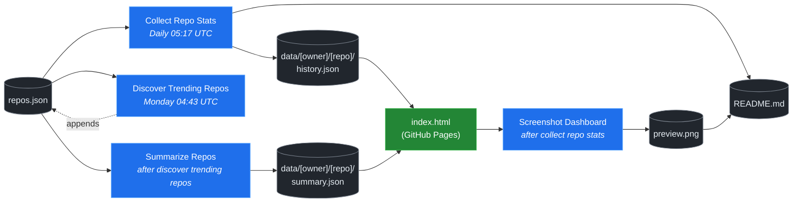

# 🚀 Rising Repos Tracker

> Automatically tracks daily GitHub stats (stars, forks, issues, velocity) for rising open source repos.

[](https://www.telosignal.com/)


**[→ View Live Dashboard](https://patrick-creates.github.io/rising-repos-tracker/)**

Built and maintained by [Telosignal](https://www.telosignal.com/).


<!-- AUTOGEN-STATS-START -->
## 📊 Current snapshot

> Auto-updated daily — last refreshed 2026-09-29

| Metric | Value |
|---|---|
| Repos tracked | **210** |
| Total stars | **10,182,517** |
| Total forks | **1,479,801** |
| Fastest growing | **VoiceStudio** (+1181.9/day) |

### 🔥 Top 5 by velocity

| # | Repo | Stars | Stars/day |
|---|---|---:|---:|
| 1 | [debpalash/VoiceStudio](https://github.com/debpalash/VoiceStudio) | 46,220 | +1181.9 |
| 2 | [DietrichGebert/ponytail](https://github.com/DietrichGebert/ponytail) | 147,858 | +1008.5 |
| 3 | [stablyai/orca](https://github.com/stablyai/orca) | 81,191 | +807.2 |
| 4 | [NousResearch/hermes-agent](https://github.com/NousResearch/hermes-agent) | 249,943 | +733.1 |
| 5 | [diegosouzapw/OmniRoute](https://github.com/diegosouzapw/OmniRoute) | 71,232 | +695.1 |

### 🆕 Recently added

- [blader/humanizer](https://github.com/blader/humanizer) — added 2026-09-28 — Agent skill that removes signs of AI-generated writing from text
- [LibreChat-AI/LibreChat](https://github.com/LibreChat-AI/LibreChat) — added 2026-09-28 — Enhanced ChatGPT Clone: Features Agents, MCP, Skills, DeepSeek, Anthropic, AWS, OpenAI, Responses API, Azure, Groq, o1, GPT-5, Mistral, OpenRouter, Vertex AI, Gemini, Artifacts, AI model switching, message search, Code Interpreter, langchain, DALL-E-3, OpenAPI Actions, Functions, Secure Multi-User Auth, Presets, open-source for self-hosting. Active
- [hypit-ai/hypit](https://github.com/hypit-ai/hypit) — added 2026-09-28 — Clone any viral video with AI agents. Not just a script, the whole workflow: swap the face, the words, the B-roll, ship 100 variants in one command, and get your 100M views.
<!-- AUTOGEN-STATS-END -->

<!-- AUTOGEN-DIAGRAM-START -->
## 🔄 How it works


```mermaid
graph LR
    repos[("repos.json")]:::data
    history[("data/[owner]/[repo]/<br/>history.json")]:::data
    summary[("data/[owner]/[repo]/<br/>summary.json")]:::data
    readme[("README.md")]:::data
    preview[("preview.png")]:::data
    dashboard["index.html<br/>(GitHub Pages)"]:::output
    collect_yml["Collect Repo Stats<br/><i>Daily 05:17 UTC</i>"]:::workflow
    discover_yml["Discover Trending Repos<br/><i>Monday 04:43 UTC</i>"]:::workflow
    screenshot_yml["Screenshot Dashboard<br/><i>after collect repo stats</i>"]:::workflow
    summarize_yml["Summarize Repos<br/><i>after discover trending repos</i>"]:::workflow
    repos --> collect_yml
    collect_yml --> history
    collect_yml --> readme
    repos --> discover_yml
    discover_yml -.->|appends| repos
    dashboard --> screenshot_yml
    screenshot_yml --> preview
    repos --> summarize_yml
    summarize_yml --> summary
    history --> dashboard
    summary --> dashboard
    preview --> readme
    classDef workflow fill:#1f6feb,stroke:#58a6ff,color:#fff
    classDef data fill:#21262d,stroke:#7d8590,color:#e6edf3
    classDef output fill:#238636,stroke:#3fb950,color:#fff
```
<!-- AUTOGEN-DIAGRAM-END -->

<!-- AUTOGEN-WORKFLOWS-START -->
## ⚙️ Workflows

| File | Schedule | Name |
|---|---|---|
| `collect.yml` | Daily 05:17 UTC | Collect Repo Stats |
| `discover.yml` | Monday 04:43 UTC | Discover Trending Repos |
| `screenshot.yml` | After Collect Repo Stats | Screenshot Dashboard |
| `summarize.yml` | After Discover Trending Repos | Summarize Repos |

> All workflows commit results directly back to the repo. Schedules are best-effort — GitHub Actions cron can drift by a few minutes.
<!-- AUTOGEN-WORKFLOWS-END -->

<!-- AUTOGEN-REPOS-START -->
## 📋 All tracked repos

| Repo | Stars | Forks | Stars/day |
|---|---:|---:|---:|
| [openclaw/openclaw](https://github.com/openclaw/openclaw) | 390,760 | 82,173 | +138.8 |
| [obra/superpowers](https://github.com/obra/superpowers) | 292,682 | 26,200 | +576.8 |
| [affaan-m/everything-claude-code](https://github.com/affaan-m/everything-claude-code) | 269,296 | 40,242 | +634.9 |
| [affaan-m/ECC](https://github.com/affaan-m/ECC) | 269,296 | 40,242 | +606.8 |
| [NousResearch/hermes-agent](https://github.com/NousResearch/hermes-agent) | 249,943 | 53,286 | +733.1 |
| [Significant-Gravitas/AutoGPT](https://github.com/Significant-Gravitas/AutoGPT) | 187,603 | 45,980 | +23.9 |
| [microsoft/markitdown](https://github.com/microsoft/markitdown) | 187,545 | 13,870 | +464.3 |
| [f/prompts.chat](https://github.com/f/prompts.chat) | 171,560 | 22,008 | +67.5 |
| [langgenius/dify](https://github.com/langgenius/dify) | 157,479 | 24,817 | +116.9 |
| [open-webui/open-webui](https://github.com/open-webui/open-webui) | 153,512 | 22,447 | +119.6 |
| [DietrichGebert/ponytail](https://github.com/DietrichGebert/ponytail) | 147,858 | 7,944 | +1008.5 |
| [langchain-ai/langchain](https://github.com/langchain-ai/langchain) | 147,243 | 24,649 | +76.3 |
| [github/spec-kit](https://github.com/github/spec-kit) | 139,345 | 12,488 | +298.4 |
| [farion1231/cc-switch](https://github.com/farion1231/cc-switch) | 138,519 | 9,365 | +481.2 |
| [nextlevelbuilder/ui-ux-pro-max-skill](https://github.com/nextlevelbuilder/ui-ux-pro-max-skill) | 131,408 | 13,964 | +385.0 |
| [Graphify-Labs/graphify](https://github.com/Graphify-Labs/graphify) | 122,265 | 11,783 | +399.5 |
| [microsoft/generative-ai-for-beginners](https://github.com/microsoft/generative-ai-for-beginners) | 120,768 | 63,515 | +72.1 |
| [JuliusBrussee/caveman](https://github.com/JuliusBrussee/caveman) | 108,284 | 6,275 | +349.0 |
| [nexu-io/open-design](https://github.com/nexu-io/open-design) | 98,604 | 11,428 | +406.2 |
| [ruvnet/RuView](https://github.com/ruvnet/RuView) | 95,408 | 12,606 | +232.4 |
| [thedotmack/claude-mem](https://github.com/thedotmack/claude-mem) | 94,888 | 8,395 | +140.3 |
| [vllm-project/vllm](https://github.com/vllm-project/vllm) | 92,919 | 22,794 | +93.8 |
| [Leonxlnx/taste-skill](https://github.com/Leonxlnx/taste-skill) | 91,087 | 6,193 | +505.6 |
| [OpenHands/OpenHands](https://github.com/OpenHands/OpenHands) | 89,476 | 11,798 | +116.0 |
| [ChatGPTNextWeb/NextChat](https://github.com/ChatGPTNextWeb/NextChat) | 88,824 | 58,961 | +5.9 |
| [koala73/worldmonitor](https://github.com/koala73/worldmonitor) | 87,546 | 13,348 | +247.6 |
| [Panniantong/Agent-Reach](https://github.com/Panniantong/Agent-Reach) | 86,101 | 7,567 | +554.2 |
| [lobehub/lobehub](https://github.com/lobehub/lobehub) | 82,885 | 15,941 | +42.4 |
| [rtk-ai/rtk](https://github.com/rtk-ai/rtk) | 81,977 | 5,200 | +241.8 |
| [datawhalechina/hello-agents](https://github.com/datawhalechina/hello-agents) | 81,261 | 10,101 | +228.4 |
| [stablyai/orca](https://github.com/stablyai/orca) | 81,191 | 5,278 | +807.2 |
| [dair-ai/Prompt-Engineering-Guide](https://github.com/dair-ai/Prompt-Engineering-Guide) | 78,707 | 8,649 | +29.9 |
| [shareAI-lab/learn-claude-code](https://github.com/shareAI-lab/learn-claude-code) | 77,791 | 12,489 | +124.7 |
| [unslothai/unsloth](https://github.com/unslothai/unsloth) | 77,008 | 7,079 | +93.3 |
| [openai/openai-cookbook](https://github.com/openai/openai-cookbook) | 76,261 | 12,895 | +19.8 |
| [ComposioHQ/awesome-claude-skills](https://github.com/ComposioHQ/awesome-claude-skills) | 75,818 | 8,841 | +115.1 |
| [chopratejas/headroom](https://github.com/chopratejas/headroom) | 74,056 | 5,720 | +433.0 |
| [headroomlabs-ai/headroom](https://github.com/headroomlabs-ai/headroom) | 74,056 | 5,720 | +284.4 |
| [career-ops-hq/career-ops](https://github.com/career-ops-hq/career-ops) | 73,040 | 13,723 | +120.8 |
| [santifer/career-ops](https://github.com/santifer/career-ops) | 73,039 | 13,723 | +207.4 |
| [diegosouzapw/OmniRoute](https://github.com/diegosouzapw/OmniRoute) | 71,232 | 10,142 | +695.1 |
| [Fission-AI/OpenSpec](https://github.com/Fission-AI/OpenSpec) | 70,639 | 4,845 | +163.1 |
| [code-yeongyu/oh-my-openagent](https://github.com/code-yeongyu/oh-my-openagent) | 69,642 | 5,733 | +84.4 |
| [asgeirtj/system_prompts_leaks](https://github.com/asgeirtj/system_prompts_leaks) | 68,581 | 11,149 | +210.4 |
| [xtekky/gpt4free](https://github.com/xtekky/gpt4free) | 66,737 | 13,496 | +3.7 |
| [shanraisshan/claude-code-best-practice](https://github.com/shanraisshan/claude-code-best-practice) | 66,593 | 6,634 | +97.7 |
| [ZhuLinsen/daily_stock_analysis](https://github.com/ZhuLinsen/daily_stock_analysis) | 65,788 | 54,905 | +212.2 |
| [usestrix/strix](https://github.com/usestrix/strix) | 65,473 | 7,188 | +331.4 |
| [mvanhorn/last30days-skill](https://github.com/mvanhorn/last30days-skill) | 63,165 | 5,500 | +269.9 |
| [calesthio/OpenMontage](https://github.com/calesthio/OpenMontage) | 61,819 | 7,881 | +369.2 |
| [tw93/Pake](https://github.com/tw93/Pake) | 61,788 | 12,727 | +97.1 |
| [rohitg00/ai-engineering-from-scratch](https://github.com/rohitg00/ai-engineering-from-scratch) | 60,781 | 10,466 | +286.8 |
| [BerriAI/litellm](https://github.com/BerriAI/litellm) | 59,852 | 11,880 | +93.0 |
| [MemPalace/mempalace](https://github.com/MemPalace/mempalace) | 59,350 | 7,560 | +51.9 |
| [jamiepine/voicebox](https://github.com/jamiepine/voicebox) | 55,954 | 6,974 | +224.4 |
| [FlowiseAI/Flowise](https://github.com/FlowiseAI/Flowise) | 55,489 | 25,053 | +19.3 |
| [hesreallyhim/awesome-claude-code](https://github.com/hesreallyhim/awesome-claude-code) | 54,787 | 4,771 | +79.8 |
| [heygen-com/hyperframes](https://github.com/heygen-com/hyperframes) | 54,058 | 4,927 | +252.2 |
| [ggml-org/whisper.cpp](https://github.com/ggml-org/whisper.cpp) | 54,001 | 6,200 | +31.2 |
| [router-for-me/CLIProxyAPI](https://github.com/router-for-me/CLIProxyAPI) | 53,496 | 8,057 | +147.7 |
| [blader/humanizer](https://github.com/blader/humanizer) | 52,784 | 4,210 | +271.0 |
| [ChromeDevTools/chrome-devtools-mcp](https://github.com/ChromeDevTools/chrome-devtools-mcp) | 52,719 | 5,216 | +95.8 |
| [coreyhaines31/marketingskills](https://github.com/coreyhaines31/marketingskills) | 51,869 | 7,822 | +170.3 |
| [bojieli/ai-agent-book](https://github.com/bojieli/ai-agent-book) | 51,691 | 5,819 | +616.0 |
| [elder-plinius/CL4R1T4S](https://github.com/elder-plinius/CL4R1T4S) | 50,799 | 10,410 | +112.3 |
| [Imbad0202/academic-research-skills](https://github.com/Imbad0202/academic-research-skills) | 49,859 | 3,849 | +158.8 |
| [Aider-AI/aider](https://github.com/Aider-AI/aider) | 49,266 | 5,014 | +32.1 |
| [QuantumNous/new-api](https://github.com/QuantumNous/new-api) | 49,070 | 11,792 | +108.0 |
| [kepano/obsidian-skills](https://github.com/kepano/obsidian-skills) | 48,998 | 3,490 | +126.0 |
| [HKUDS/nanobot](https://github.com/HKUDS/nanobot) | 48,661 | 8,599 | +44.6 |
| [zhayujie/CowAgent](https://github.com/zhayujie/CowAgent) | 47,161 | 10,377 | +19.4 |
| [K-Dense-AI/scientific-agent-skills](https://github.com/K-Dense-AI/scientific-agent-skills) | 47,084 | 4,245 | +164.0 |
| [sickn33/antigravity-awesome-skills](https://github.com/sickn33/antigravity-awesome-skills) | 47,061 | 6,855 | +66.0 |
| [sickn33/agentic-awesome-skills](https://github.com/sickn33/agentic-awesome-skills) | 47,061 | 6,855 | +51.5 |
| [debpalash/VoiceStudio](https://github.com/debpalash/VoiceStudio) | 46,220 | 5,243 | +1181.9 |
| [DeusData/codebase-memory-mcp](https://github.com/DeusData/codebase-memory-mcp) | 45,434 | 3,723 | +269.6 |
| [danny-avila/LibreChat](https://github.com/danny-avila/LibreChat) | 45,106 | 9,241 | +60.1 |
| [LibreChat-AI/LibreChat](https://github.com/LibreChat-AI/LibreChat) | 45,106 | 9,241 | +82.0 |
| [MadsLorentzen/ai-job-search](https://github.com/MadsLorentzen/ai-job-search) | 44,421 | 15,291 | +292.8 |
| [chatanywhere/GPT_API_free](https://github.com/chatanywhere/GPT_API_free) | 43,356 | 2,735 | +40.9 |
| [alibaba/open-code-review](https://github.com/alibaba/open-code-review) | 42,486 | 3,051 | +382.3 |
| [langchain-ai/langgraph](https://github.com/langchain-ai/langgraph) | 42,455 | 7,191 | +71.1 |
| [chatboxai/chatbox](https://github.com/chatboxai/chatbox) | 41,894 | 4,265 | +14.2 |
| [ogulcancelik/herdr](https://github.com/ogulcancelik/herdr) | 41,364 | 3,183 | +340.8 |
| [herdrdev/herdr](https://github.com/herdrdev/herdr) | 41,364 | 3,183 | +308.3 |
| [AstrBotDevs/AstrBot](https://github.com/AstrBotDevs/AstrBot) | 41,196 | 3,000 | +63.4 |
| [Hmbown/CodeWhale](https://github.com/Hmbown/CodeWhale) | 41,040 | 3,566 | +50.2 |
| [Hmbown/Codewhale](https://github.com/Hmbown/Codewhale) | 41,040 | 3,566 | +5.6 |
| [tinyhumansai/openhuman](https://github.com/tinyhumansai/openhuman) | 40,165 | 3,965 | +30.7 |
| [wshobson/agents](https://github.com/wshobson/agents) | 40,076 | 4,274 | +32.6 |
| [mindsdb/mindshub](https://github.com/mindsdb/mindshub) | 39,778 | 6,245 | +4.8 |
| [github/awesome-copilot](https://github.com/github/awesome-copilot) | 39,494 | 5,018 | +44.8 |
| [Yeachan-Heo/oh-my-claudecode](https://github.com/Yeachan-Heo/oh-my-claudecode) | 39,401 | 3,524 | +36.0 |
| [volcengine/OpenViking](https://github.com/volcengine/OpenViking) | 38,945 | 3,048 | +120.5 |
| [google/langextract](https://github.com/google/langextract) | 38,912 | 2,720 | +18.6 |
| [AlexsJones/llmfit](https://github.com/AlexsJones/llmfit) | 37,310 | 2,390 | +85.9 |
| [PDFMathTranslate/PDFMathTranslate](https://github.com/PDFMathTranslate/PDFMathTranslate) | 37,257 | 3,342 | +25.5 |
| [anthropics/claude-plugins-official](https://github.com/anthropics/claude-plugins-official) | 37,183 | 4,171 | +68.1 |
| [songquanpeng/one-api](https://github.com/songquanpeng/one-api) | 37,041 | 6,870 | +22.3 |
| [esengine/DeepSeek-Reasonix](https://github.com/esengine/DeepSeek-Reasonix) | 35,710 | 2,426 | +143.2 |
| [JCodesMore/ai-website-cloner-template](https://github.com/JCodesMore/ai-website-cloner-template) | 35,426 | 5,180 | +173.9 |
| [agentscope-ai/QwenPaw](https://github.com/agentscope-ai/QwenPaw) | 35,349 | 3,141 | +165.8 |
| [HKUDS/Vibe-Trading](https://github.com/HKUDS/Vibe-Trading) | 34,287 | 5,577 | +212.5 |
| [can1357/oh-my-pi](https://github.com/can1357/oh-my-pi) | 33,707 | 3,611 | +199.1 |
| [Gitlawb/openclaude](https://github.com/Gitlawb/openclaude) | 33,568 | 9,102 | +45.3 |
| [mukul975/Anthropic-Cybersecurity-Skills](https://github.com/mukul975/Anthropic-Cybersecurity-Skills) | 33,550 | 4,069 | +155.8 |
| [iOfficeAI/AionUi](https://github.com/iOfficeAI/AionUi) | 33,209 | 3,456 | +48.8 |
| [virgiliojr94/book-to-skill](https://github.com/virgiliojr94/book-to-skill) | 32,984 | 3,443 | +226.5 |
| [zeroclaw-labs/zeroclaw](https://github.com/zeroclaw-labs/zeroclaw) | 32,914 | 4,954 | +10.3 |
| [p-e-w/heretic](https://github.com/p-e-w/heretic) | 32,517 | 3,654 | +75.6 |
| [tirth8205/code-review-graph](https://github.com/tirth8205/code-review-graph) | 31,845 | 2,913 | +125.8 |
| [iOfficeAI/OfficeCLI](https://github.com/iOfficeAI/OfficeCLI) | 31,358 | 2,141 | +270.1 |
| [googleworkspace/cli](https://github.com/googleworkspace/cli) | 31,195 | 1,854 | +37.3 |
| [Tencent/WeKnora](https://github.com/Tencent/WeKnora) | 31,153 | 4,161 | +140.2 |
| [decolua/9router](https://github.com/decolua/9router) | 30,006 | 5,667 | +117.3 |
| [langchain-ai/deepagents](https://github.com/langchain-ai/deepagents) | 29,850 | 4,195 | +50.4 |
| [jackwener/OpenCLI](https://github.com/jackwener/OpenCLI) | 29,689 | 2,898 | +52.1 |
| [alibaba/page-agent](https://github.com/alibaba/page-agent) | 29,265 | 2,634 | +101.0 |
| [rohitg00/agentmemory](https://github.com/rohitg00/agentmemory) | 29,006 | 2,529 | +63.5 |
| [voideditor/void](https://github.com/voideditor/void) | 28,783 | 2,655 | — |
| [jarrodwatts/claude-hud](https://github.com/jarrodwatts/claude-hud) | 28,226 | 1,309 | +31.3 |
| [BloopAI/vibe-kanban](https://github.com/BloopAI/vibe-kanban) | 28,214 | 3,027 | +12.5 |
| [manaflow-ai/cmux](https://github.com/manaflow-ai/cmux) | 27,490 | 2,416 | +40.2 |
| [TencentCloud/TencentDB-Agent-Memory](https://github.com/TencentCloud/TencentDB-Agent-Memory) | 27,484 | 2,646 | +240.6 |
| [zai-org/Open-AutoGLM](https://github.com/zai-org/Open-AutoGLM) | 26,326 | 4,044 | +7.6 |
| [toon-format/toon](https://github.com/toon-format/toon) | 25,436 | 1,123 | +8.3 |
| [pascalorg/editor](https://github.com/pascalorg/editor) | 24,358 | 3,017 | +62.2 |
| [mksglu/context-mode](https://github.com/mksglu/context-mode) | 24,203 | 1,748 | +63.5 |
| [guillaumemeyer/watermarks-remover](https://github.com/guillaumemeyer/watermarks-remover) | 23,051 | 2,640 | +152.8 |
| [pranshuparmar/witr](https://github.com/pranshuparmar/witr) | 22,534 | 789 | +48.9 |
| [winfunc/opcode](https://github.com/winfunc/opcode) | 22,413 | 1,719 | +3.6 |
| [jundot/omlx](https://github.com/jundot/omlx) | 22,357 | 1,942 | +54.0 |
| [steipete/CodexBar](https://github.com/steipete/CodexBar) | 22,045 | 2,020 | +69.1 |
| [every-app/open-seo](https://github.com/every-app/open-seo) | 21,674 | 2,777 | +201.2 |
| [coze-dev/coze-studio](https://github.com/coze-dev/coze-studio) | 21,655 | 3,122 | +6.3 |
| [t8y2/dbx](https://github.com/t8y2/dbx) | 21,621 | 2,069 | +152.9 |
| [NirDiamant/agents-towards-production](https://github.com/NirDiamant/agents-towards-production) | 21,510 | 2,853 | +7.8 |
| [KKKKhazix/khazix-skills](https://github.com/KKKKhazix/khazix-skills) | 21,019 | 2,225 | +50.2 |
| [jnMetaCode/agency-agents-zh](https://github.com/jnMetaCode/agency-agents-zh) | 21,000 | 3,388 | +56.5 |
| [1jehuang/jcode](https://github.com/1jehuang/jcode) | 20,212 | 2,343 | +152.7 |
| [tanweai/pua](https://github.com/tanweai/pua) | 19,705 | 1,206 | +13.8 |
| [datawhalechina/easy-vibe](https://github.com/datawhalechina/easy-vibe) | 19,572 | 1,871 | +24.8 |
| [danielmiessler/LifeOS](https://github.com/danielmiessler/LifeOS) | 19,232 | 2,484 | +32.0 |
| [nesquena/hermes-webui](https://github.com/nesquena/hermes-webui) | 18,663 | 2,649 | +38.6 |
| [NVIDIA/SkillSpector](https://github.com/NVIDIA/SkillSpector) | 18,562 | 1,619 | +94.8 |
| [microsoft/agent-lightning](https://github.com/microsoft/agent-lightning) | 18,527 | 1,648 | +11.5 |
| [jlcodes99/cockpit-tools](https://github.com/jlcodes99/cockpit-tools) | 18,506 | 1,644 | +60.7 |
| [browser-use/browser-harness](https://github.com/browser-use/browser-harness) | 18,217 | 1,772 | +29.8 |
| [RightNow-AI/openfang](https://github.com/RightNow-AI/openfang) | 18,210 | 2,290 | +3.6 |
| [AgriciDaniel/claude-seo](https://github.com/AgriciDaniel/claude-seo) | 17,930 | 2,633 | +69.7 |
| [hypit-ai/hypit](https://github.com/hypit-ai/hypit) | 17,416 | 2,072 | +317.0 |
| [MemoriLabs/Memori](https://github.com/MemoriLabs/Memori) | 17,000 | 3,611 | +16.7 |
| [cft0808/edict](https://github.com/cft0808/edict) | 16,937 | 1,765 | +8.3 |
| [tradecatlabs/vibe-coding-cn](https://github.com/tradecatlabs/vibe-coding-cn) | 16,877 | 1,710 | +100.0 |
| [wanshuiyin/Auto-claude-code-research-in-sleep](https://github.com/wanshuiyin/Auto-claude-code-research-in-sleep) | 16,812 | 1,420 | +43.9 |
| [walkinglabs/learn-harness-engineering](https://github.com/walkinglabs/learn-harness-engineering) | 16,758 | 1,737 | +80.9 |
| [composio-community/awesome-codex-skills](https://github.com/composio-community/awesome-codex-skills) | 16,711 | 1,641 | +20.1 |
| [xbtlin/ai-berkshire](https://github.com/xbtlin/ai-berkshire) | 16,567 | 2,477 | +68.1 |
| [ifixai-ai/iFixAi](https://github.com/ifixai-ai/iFixAi) | 16,496 | 1,344 | +166.5 |
| [xpzouying/xiaohongshu-mcp](https://github.com/xpzouying/xiaohongshu-mcp) | 16,038 | 2,358 | +17.7 |
| [Anionex/banana-slides](https://github.com/Anionex/banana-slides) | 15,673 | 1,790 | +5.3 |
| [yusufkaraaslan/Skill_Seekers](https://github.com/yusufkaraaslan/Skill_Seekers) | 15,046 | 1,537 | +8.3 |
| [kyegomez/OpenMythos](https://github.com/kyegomez/OpenMythos) | 14,906 | 3,292 | +7.6 |
| [NanmiCoder/cc-haha](https://github.com/NanmiCoder/cc-haha) | 14,762 | 8,590 | +15.5 |
| [superset-sh/superset](https://github.com/superset-sh/superset) | 14,721 | 1,310 | +27.8 |
| [NevaMind-AI/memU](https://github.com/NevaMind-AI/memU) | 14,486 | 1,079 | +5.9 |
| [XiaomiMiMo/MiMo-Code](https://github.com/XiaomiMiMo/MiMo-Code) | 13,549 | 1,408 | +27.4 |
| [EverMind-AI/EverOS](https://github.com/EverMind-AI/EverOS) | 13,271 | 924 | +38.7 |
| [sirmalloc/ccstatusline](https://github.com/sirmalloc/ccstatusline) | 13,106 | 585 | +19.8 |
| [ConardLi/garden-skills](https://github.com/ConardLi/garden-skills) | 12,680 | 1,523 | +41.2 |
| [brokermr810/QuantDinger](https://github.com/brokermr810/QuantDinger) | 12,305 | 2,515 | +35.6 |
| [OpenByteInc/QuantDinger](https://github.com/OpenByteInc/QuantDinger) | 12,305 | 2,515 | +35.3 |
| [0x4m4/hexstrike-ai](https://github.com/0x4m4/hexstrike-ai) | 12,234 | 2,491 | +24.2 |
| [MemTensor/MemOS](https://github.com/MemTensor/MemOS) | 11,635 | 1,065 | +17.5 |
| [holaboss-ai/holaOS](https://github.com/holaboss-ai/holaOS) | 11,437 | 727 | +71.3 |
| [getagentseal/codeburn](https://github.com/getagentseal/codeburn) | 11,274 | 867 | +33.0 |
| [EKKOLearnAI/hermes-studio](https://github.com/EKKOLearnAI/hermes-studio) | 11,235 | 1,382 | +27.9 |
| [EKKOLearnAI/ekko-studio](https://github.com/EKKOLearnAI/ekko-studio) | 11,235 | 1,382 | +11.0 |
| [aden-hive/hive](https://github.com/aden-hive/hive) | 11,082 | 5,656 | +5.1 |
| [ValueCell-ai/valuecell](https://github.com/ValueCell-ai/valuecell) | 11,025 | 1,806 | +1.7 |
| [openai/codex-security](https://github.com/openai/codex-security) | 10,883 | 826 | +45.6 |
| [dataelement/dsh-desktop](https://github.com/dataelement/dsh-desktop) | 10,622 | 405 | +293.9 |
| [Kuberwastaken/claurst](https://github.com/Kuberwastaken/claurst) | 10,310 | 7,725 | +4.8 |
| [ykdojo/claude-code-tips](https://github.com/ykdojo/claude-code-tips) | 10,164 | 820 | +13.5 |
| [StarTrail-org/PixelRAG](https://github.com/StarTrail-org/PixelRAG) | 10,114 | 867 | +45.2 |
| [Companion-Inc/feynman](https://github.com/Companion-Inc/feynman) | 9,827 | 1,096 | +15.0 |
| [frankbria/ralph-claude-code](https://github.com/frankbria/ralph-claude-code) | 9,640 | 722 | +3.8 |
| [modem-dev/hunk](https://github.com/modem-dev/hunk) | 9,431 | 311 | +34.9 |
| [trailhq/Graft](https://github.com/trailhq/Graft) | 9,393 | 862 | +120.3 |
| [EvoMap/evolver](https://github.com/EvoMap/evolver) | 9,127 | 848 | +3.2 |
| [iflytek/astron-agent](https://github.com/iflytek/astron-agent) | 9,094 | 906 | +5.7 |
| [Nasiko-Labs/nasiko](https://github.com/Nasiko-Labs/nasiko) | 9,053 | 1,945 | +45.0 |
| [1weiho/open-slide](https://github.com/1weiho/open-slide) | 8,546 | 597 | +48.6 |
| [open-slide/open-slide](https://github.com/open-slide/open-slide) | 8,546 | 597 | +265.0 |
| [MiroMindAI/MiroThinker](https://github.com/MiroMindAI/MiroThinker) | 8,428 | 648 | +1.2 |
| [genspark-ai/genoffice](https://github.com/genspark-ai/genoffice) | 8,133 | 1,060 | +92.9 |
| [mmulet/term.everything](https://github.com/mmulet/term.everything) | 8,102 | 195 | +0.9 |
| [Tencent/BrowserSkill](https://github.com/Tencent/BrowserSkill) | 7,854 | 557 | +194.0 |
| [ValueCell-ai/ClawX](https://github.com/ValueCell-ai/ClawX) | 7,609 | 1,141 | +0.9 |
| [rorkai/App-Store-Connect-CLI](https://github.com/rorkai/App-Store-Connect-CLI) | 7,533 | 633 | +28.9 |
| [WenyuChiou/awesome-agentic-ai-zh](https://github.com/WenyuChiou/awesome-agentic-ai-zh) | 7,216 | 977 | +22.9 |
| [opensquilla/opensquilla](https://github.com/opensquilla/opensquilla) | 7,064 | 576 | +12.0 |
| [TokenRhythm/opensquilla](https://github.com/TokenRhythm/opensquilla) | 7,064 | 576 | +4.4 |
| [tech-leads-club/agent-skills](https://github.com/tech-leads-club/agent-skills) | 7,010 | 558 | +54.9 |
| [Andyyyy64/whichllm](https://github.com/Andyyyy64/whichllm) | 6,701 | 370 | +11.7 |
| [steipete/summarize](https://github.com/steipete/summarize) | 6,672 | 447 | +3.4 |
| [Arthur-Ficial/apfel](https://github.com/Arthur-Ficial/apfel) | 6,449 | 246 | +4.3 |
| [microsoft/fara](https://github.com/microsoft/fara) | 6,200 | 605 | +2.6 |
| [UfoMiao/zcf](https://github.com/UfoMiao/zcf) | 6,080 | 424 | +0.1 |
| [re4/LibreCode](https://github.com/re4/LibreCode) | 89 | 5 | — |
<!-- AUTOGEN-REPOS-END -->

---

## What it does

- Collects daily snapshots of stars, forks, watchers and open issues for every tracked repo
- Discovers new trending repos automatically every Monday using the GitHub Search API
- Generates AI summaries (use cases, similar tools, tags) for each tracked repo via GitHub Models
- Stores all history as plain JSON — no database, no backend
- Renders a live dashboard via GitHub Pages — updates daily, zero maintenance

## Tracked repos

Data lives in [`data/`](./data) — one folder per repo, one `history.json` per entry.  
The full watch list is in [`repos.json`](./repos.json).

## Fork & use it for yourself

This is my personal tracker — the watch list reflects what I find interesting. If you want to track different repos, the best path is to **fork this repo and run your own**.

### Setup

1. Fork this repo to your account
2. Replace the contents of [`repos.json`](./repos.json) with the repos you want to track (or just leave one entry — `discover.yml` will auto-add more every Monday)
3. Go to **Settings → Pages** and enable GitHub Pages from the `main` branch
4. Go to **Actions** and run **Collect Repo Stats** once manually to seed your first data point
5. Your dashboard will be live at `https://YOUR-USERNAME.github.io/rising-repos-tracker/`

That's it — daily collection and weekly discovery run automatically on schedule. Zero ongoing maintenance.

### Customizing what gets discovered

Edit [`scripts/discover.js`](./scripts/discover.js) to change:

- `MIN_STARS` — minimum star threshold for candidates
- `MAX_AGE_DAYS` — how recent a repo must be
- `MAX_NEW_REPOS` — how many to add per discovery run
- The `queries` array — GitHub Search API queries that define what "trending" means to you

### Adding a repo manually

Just edit `repos.json` directly:

```json
{
  "owner": "OWNER",
  "repo": "REPO",
  "added": "YYYY-MM-DD",
  "notes": "why you're tracking this"
}
```

The next daily collect run picks it up automatically.

## Stack

- **GitHub Actions** — scheduling and automation
- **GitHub Pages** — dashboard hosting
- **GitHub API** — data source
- **GitHub Models** — free AI summaries (gpt-4o-mini)
- **Chart.js** — star growth visualization
- **Mermaid** — architecture diagram (rendered by GitHub)
- No dependencies, no build step, no database

## License

MIT
