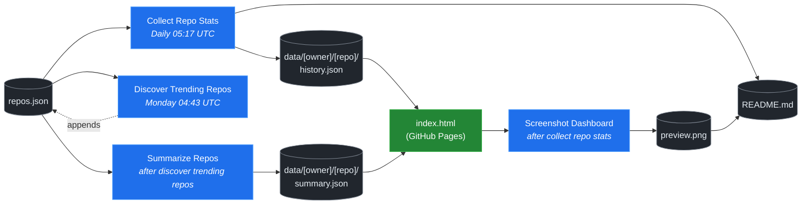

# 🚀 Rising Repos Tracker

> Automatically tracks daily GitHub stats (stars, forks, issues, velocity) for rising open source repos.

[](https://www.telosignal.com/)


**[→ View Live Dashboard](https://patrick-creates.github.io/rising-repos-tracker/)**

Built and maintained by [Telosignal](https://www.telosignal.com/).


<!-- AUTOGEN-STATS-START -->
## 📊 Current snapshot

> Auto-updated daily — last refreshed 2026-09-28

| Metric | Value |
|---|---|
| Repos tracked | **210** |
| Total stars | **10,159,929** |
| Total forks | **1,477,249** |
| Fastest growing | **VoiceStudio** (+1019.0/day) |

### 🔥 Top 5 by velocity

| # | Repo | Stars | Stars/day |
|---|---|---:|---:|
| 1 | [debpalash/VoiceStudio](https://github.com/debpalash/VoiceStudio) | 41,617 | +1019.0 |
| 2 | [DietrichGebert/ponytail](https://github.com/DietrichGebert/ponytail) | 147,194 | +1012.0 |
| 3 | [stablyai/orca](https://github.com/stablyai/orca) | 80,209 | +805.1 |
| 4 | [NousResearch/hermes-agent](https://github.com/NousResearch/hermes-agent) | 249,660 | +736.3 |
| 5 | [diegosouzapw/OmniRoute](https://github.com/diegosouzapw/OmniRoute) | 70,909 | +699.5 |

### 🆕 Recently added

- [blader/humanizer](https://github.com/blader/humanizer) — added 2026-09-28 — Agent skill that removes signs of AI-generated writing from text
- [LibreChat-AI/LibreChat](https://github.com/LibreChat-AI/LibreChat) — added 2026-09-28 — Enhanced ChatGPT Clone: Features Agents, MCP, Skills, DeepSeek, Anthropic, AWS, OpenAI, Responses API, Azure, Groq, o1, GPT-5, Mistral, OpenRouter, Vertex AI, Gemini, Artifacts, AI model switching, message search, Code Interpreter, langchain, DALL-E-3, OpenAPI Actions, Functions, Secure Multi-User Auth, Presets, open-source for self-hosting. Active
- [hypit-ai/hypit](https://github.com/hypit-ai/hypit) — added 2026-09-28 — Clone any viral video with AI agents. Not just a script, the whole workflow: swap the face, the words, the B-roll, ship 100 variants in one command, and get your 100M views.
<!-- AUTOGEN-STATS-END -->

<!-- AUTOGEN-DIAGRAM-START -->
## 🔄 How it works


```mermaid
graph LR
    repos[("repos.json")]:::data
    history[("data/[owner]/[repo]/<br/>history.json")]:::data
    summary[("data/[owner]/[repo]/<br/>summary.json")]:::data
    readme[("README.md")]:::data
    preview[("preview.png")]:::data
    dashboard["index.html<br/>(GitHub Pages)"]:::output
    collect_yml["Collect Repo Stats<br/><i>Daily 05:17 UTC</i>"]:::workflow
    discover_yml["Discover Trending Repos<br/><i>Monday 04:43 UTC</i>"]:::workflow
    screenshot_yml["Screenshot Dashboard<br/><i>after collect repo stats</i>"]:::workflow
    summarize_yml["Summarize Repos<br/><i>after discover trending repos</i>"]:::workflow
    repos --> collect_yml
    collect_yml --> history
    collect_yml --> readme
    repos --> discover_yml
    discover_yml -.->|appends| repos
    dashboard --> screenshot_yml
    screenshot_yml --> preview
    repos --> summarize_yml
    summarize_yml --> summary
    history --> dashboard
    summary --> dashboard
    preview --> readme
    classDef workflow fill:#1f6feb,stroke:#58a6ff,color:#fff
    classDef data fill:#21262d,stroke:#7d8590,color:#e6edf3
    classDef output fill:#238636,stroke:#3fb950,color:#fff
```
<!-- AUTOGEN-DIAGRAM-END -->

<!-- AUTOGEN-WORKFLOWS-START -->
## ⚙️ Workflows

| File | Schedule | Name |
|---|---|---|
| `collect.yml` | Daily 05:17 UTC | Collect Repo Stats |
| `discover.yml` | Monday 04:43 UTC | Discover Trending Repos |
| `screenshot.yml` | After Collect Repo Stats | Screenshot Dashboard |
| `summarize.yml` | After Discover Trending Repos | Summarize Repos |

> All workflows commit results directly back to the repo. Schedules are best-effort — GitHub Actions cron can drift by a few minutes.
<!-- AUTOGEN-WORKFLOWS-END -->

<!-- AUTOGEN-REPOS-START -->
## 📋 All tracked repos

| Repo | Stars | Forks | Stars/day |
|---|---:|---:|---:|
| [openclaw/openclaw](https://github.com/openclaw/openclaw) | 390,700 | 82,159 | +139.3 |
| [obra/superpowers](https://github.com/obra/superpowers) | 292,343 | 26,166 | +579.2 |
| [affaan-m/everything-claude-code](https://github.com/affaan-m/everything-claude-code) | 268,655 | 40,134 | +634.8 |
| [affaan-m/ECC](https://github.com/affaan-m/ECC) | 268,655 | 40,134 | +606.6 |
| [NousResearch/hermes-agent](https://github.com/NousResearch/hermes-agent) | 249,660 | 53,127 | +736.3 |
| [Significant-Gravitas/AutoGPT](https://github.com/Significant-Gravitas/AutoGPT) | 187,598 | 45,984 | +24.0 |
| [microsoft/markitdown](https://github.com/microsoft/markitdown) | 187,398 | 13,850 | +466.6 |
| [f/prompts.chat](https://github.com/f/prompts.chat) | 171,465 | 22,008 | +67.3 |
| [langgenius/dify](https://github.com/langgenius/dify) | 157,401 | 24,802 | +117.2 |
| [open-webui/open-webui](https://github.com/open-webui/open-webui) | 153,421 | 22,446 | +119.8 |
| [DietrichGebert/ponytail](https://github.com/DietrichGebert/ponytail) | 147,194 | 7,911 | +1012.0 |
| [langchain-ai/langchain](https://github.com/langchain-ai/langchain) | 147,190 | 24,638 | +76.5 |
| [github/spec-kit](https://github.com/github/spec-kit) | 139,217 | 12,470 | +299.7 |
| [farion1231/cc-switch](https://github.com/farion1231/cc-switch) | 137,998 | 9,351 | +480.9 |
| [nextlevelbuilder/ui-ux-pro-max-skill](https://github.com/nextlevelbuilder/ui-ux-pro-max-skill) | 131,144 | 13,943 | +385.9 |
| [Graphify-Labs/graphify](https://github.com/Graphify-Labs/graphify) | 121,998 | 11,749 | +401.6 |
| [microsoft/generative-ai-for-beginners](https://github.com/microsoft/generative-ai-for-beginners) | 120,709 | 63,490 | +72.2 |
| [JuliusBrussee/caveman](https://github.com/JuliusBrussee/caveman) | 108,138 | 6,268 | +350.6 |
| [nexu-io/open-design](https://github.com/nexu-io/open-design) | 98,436 | 11,412 | +408.0 |
| [ruvnet/RuView](https://github.com/ruvnet/RuView) | 95,259 | 12,592 | +233.1 |
| [thedotmack/claude-mem](https://github.com/thedotmack/claude-mem) | 94,818 | 8,385 | +140.9 |
| [vllm-project/vllm](https://github.com/vllm-project/vllm) | 92,855 | 22,751 | +94.0 |
| [Leonxlnx/taste-skill](https://github.com/Leonxlnx/taste-skill) | 90,779 | 6,178 | +507.3 |
| [OpenHands/OpenHands](https://github.com/OpenHands/OpenHands) | 89,363 | 11,780 | +116.0 |
| [ChatGPTNextWeb/NextChat](https://github.com/ChatGPTNextWeb/NextChat) | 88,820 | 58,964 | +5.9 |
| [koala73/worldmonitor](https://github.com/koala73/worldmonitor) | 87,493 | 13,343 | +249.1 |
| [Panniantong/Agent-Reach](https://github.com/Panniantong/Agent-Reach) | 85,899 | 7,550 | +557.3 |
| [lobehub/lobehub](https://github.com/lobehub/lobehub) | 82,873 | 15,933 | +42.6 |
| [rtk-ai/rtk](https://github.com/rtk-ai/rtk) | 81,874 | 5,193 | +242.8 |
| [datawhalechina/hello-agents](https://github.com/datawhalechina/hello-agents) | 81,108 | 10,085 | +228.9 |
| [stablyai/orca](https://github.com/stablyai/orca) | 80,209 | 5,233 | +805.1 |
| [dair-ai/Prompt-Engineering-Guide](https://github.com/dair-ai/Prompt-Engineering-Guide) | 78,687 | 8,646 | +30.0 |
| [shareAI-lab/learn-claude-code](https://github.com/shareAI-lab/learn-claude-code) | 77,728 | 12,489 | +125.2 |
| [unslothai/unsloth](https://github.com/unslothai/unsloth) | 76,895 | 7,064 | +93.2 |
| [openai/openai-cookbook](https://github.com/openai/openai-cookbook) | 76,241 | 12,893 | +19.8 |
| [ComposioHQ/awesome-claude-skills](https://github.com/ComposioHQ/awesome-claude-skills) | 75,773 | 8,826 | +115.7 |
| [chopratejas/headroom](https://github.com/chopratejas/headroom) | 73,995 | 5,714 | +436.5 |
| [headroomlabs-ai/headroom](https://github.com/headroomlabs-ai/headroom) | 73,995 | 5,714 | +286.7 |
| [santifer/career-ops](https://github.com/santifer/career-ops) | 72,963 | 13,722 | +208.4 |
| [career-ops-hq/career-ops](https://github.com/career-ops-hq/career-ops) | 72,963 | 13,722 | +122.9 |
| [diegosouzapw/OmniRoute](https://github.com/diegosouzapw/OmniRoute) | 70,909 | 10,090 | +699.5 |
| [Fission-AI/OpenSpec](https://github.com/Fission-AI/OpenSpec) | 70,548 | 4,838 | +163.6 |
| [code-yeongyu/oh-my-openagent](https://github.com/code-yeongyu/oh-my-openagent) | 69,617 | 5,730 | +84.9 |
| [asgeirtj/system_prompts_leaks](https://github.com/asgeirtj/system_prompts_leaks) | 68,519 | 11,134 | +211.5 |
| [xtekky/gpt4free](https://github.com/xtekky/gpt4free) | 66,742 | 13,496 | +3.8 |
| [shanraisshan/claude-code-best-practice](https://github.com/shanraisshan/claude-code-best-practice) | 66,484 | 6,618 | +97.6 |
| [ZhuLinsen/daily_stock_analysis](https://github.com/ZhuLinsen/daily_stock_analysis) | 65,743 | 54,882 | +213.5 |
| [usestrix/strix](https://github.com/usestrix/strix) | 65,312 | 7,166 | +332.8 |
| [mvanhorn/last30days-skill](https://github.com/mvanhorn/last30days-skill) | 63,085 | 5,489 | +271.6 |
| [tw93/Pake](https://github.com/tw93/Pake) | 61,768 | 12,722 | +97.7 |
| [calesthio/OpenMontage](https://github.com/calesthio/OpenMontage) | 61,648 | 7,847 | +371.4 |
| [rohitg00/ai-engineering-from-scratch](https://github.com/rohitg00/ai-engineering-from-scratch) | 60,024 | 10,331 | +282.9 |
| [BerriAI/litellm](https://github.com/BerriAI/litellm) | 59,775 | 11,843 | +93.1 |
| [MemPalace/mempalace](https://github.com/MemPalace/mempalace) | 59,328 | 7,561 | +52.1 |
| [jamiepine/voicebox](https://github.com/jamiepine/voicebox) | 55,890 | 6,966 | +225.8 |
| [FlowiseAI/Flowise](https://github.com/FlowiseAI/Flowise) | 55,488 | 25,048 | +19.5 |
| [hesreallyhim/awesome-claude-code](https://github.com/hesreallyhim/awesome-claude-code) | 54,735 | 4,772 | +80.0 |
| [ggml-org/whisper.cpp](https://github.com/ggml-org/whisper.cpp) | 53,980 | 6,197 | +31.2 |
| [heygen-com/hyperframes](https://github.com/heygen-com/hyperframes) | 53,772 | 4,900 | +251.9 |
| [router-for-me/CLIProxyAPI](https://github.com/router-for-me/CLIProxyAPI) | 53,397 | 8,052 | +148.0 |
| [ChromeDevTools/chrome-devtools-mcp](https://github.com/ChromeDevTools/chrome-devtools-mcp) | 52,693 | 5,109 | +96.3 |
| [blader/humanizer](https://github.com/blader/humanizer) | 52,513 | 4,192 | +207.5 |
| [coreyhaines31/marketingskills](https://github.com/coreyhaines31/marketingskills) | 51,764 | 7,810 | +170.8 |
| [bojieli/ai-agent-book](https://github.com/bojieli/ai-agent-book) | 51,466 | 5,786 | +621.6 |
| [elder-plinius/CL4R1T4S](https://github.com/elder-plinius/CL4R1T4S) | 50,753 | 10,397 | +113.0 |
| [Imbad0202/academic-research-skills](https://github.com/Imbad0202/academic-research-skills) | 49,728 | 3,845 | +159.3 |
| [Aider-AI/aider](https://github.com/Aider-AI/aider) | 49,227 | 5,005 | +32.1 |
| [QuantumNous/new-api](https://github.com/QuantumNous/new-api) | 49,007 | 11,765 | +108.3 |
| [kepano/obsidian-skills](https://github.com/kepano/obsidian-skills) | 48,966 | 3,490 | +126.7 |
| [HKUDS/nanobot](https://github.com/HKUDS/nanobot) | 48,635 | 8,595 | +44.8 |
| [zhayujie/CowAgent](https://github.com/zhayujie/CowAgent) | 47,147 | 10,374 | +19.5 |
| [sickn33/antigravity-awesome-skills](https://github.com/sickn33/antigravity-awesome-skills) | 47,019 | 6,847 | +66.2 |
| [sickn33/agentic-awesome-skills](https://github.com/sickn33/agentic-awesome-skills) | 47,019 | 6,847 | +51.6 |
| [K-Dense-AI/scientific-agent-skills](https://github.com/K-Dense-AI/scientific-agent-skills) | 46,936 | 4,235 | +164.8 |
| [DeusData/codebase-memory-mcp](https://github.com/DeusData/codebase-memory-mcp) | 45,230 | 3,708 | +270.3 |
| [danny-avila/LibreChat](https://github.com/danny-avila/LibreChat) | 45,024 | 9,228 | +60.0 |
| [LibreChat-AI/LibreChat](https://github.com/LibreChat-AI/LibreChat) | 45,024 | 9,228 | +34.0 |
| [MadsLorentzen/ai-job-search](https://github.com/MadsLorentzen/ai-job-search) | 44,299 | 15,245 | +295.0 |
| [chatanywhere/GPT_API_free](https://github.com/chatanywhere/GPT_API_free) | 43,303 | 2,735 | +40.8 |
| [langchain-ai/langgraph](https://github.com/langchain-ai/langgraph) | 42,406 | 7,176 | +71.3 |
| [alibaba/open-code-review](https://github.com/alibaba/open-code-review) | 42,123 | 3,024 | +382.6 |
| [chatboxai/chatbox](https://github.com/chatboxai/chatbox) | 41,878 | 4,262 | +14.2 |
| [debpalash/VoiceStudio](https://github.com/debpalash/VoiceStudio) | 41,617 | 4,930 | +1019.0 |
| [AstrBotDevs/AstrBot](https://github.com/AstrBotDevs/AstrBot) | 41,146 | 2,991 | +63.5 |
| [ogulcancelik/herdr](https://github.com/ogulcancelik/herdr) | 41,145 | 3,163 | +342.2 |
| [herdrdev/herdr](https://github.com/herdrdev/herdr) | 41,145 | 3,163 | +309.9 |
| [Hmbown/CodeWhale](https://github.com/Hmbown/CodeWhale) | 41,038 | 3,565 | +50.5 |
| [Hmbown/Codewhale](https://github.com/Hmbown/Codewhale) | 41,038 | 3,565 | +5.8 |
| [tinyhumansai/openhuman](https://github.com/tinyhumansai/openhuman) | 40,146 | 3,962 | +31.3 |
| [wshobson/agents](https://github.com/wshobson/agents) | 40,051 | 4,273 | +32.7 |
| [mindsdb/mindshub](https://github.com/mindsdb/mindshub) | 39,778 | 6,245 | +4.9 |
| [github/awesome-copilot](https://github.com/github/awesome-copilot) | 39,470 | 5,015 | +45.0 |
| [Yeachan-Heo/oh-my-claudecode](https://github.com/Yeachan-Heo/oh-my-claudecode) | 39,390 | 3,518 | +36.2 |
| [google/langextract](https://github.com/google/langextract) | 38,906 | 2,720 | +18.7 |
| [volcengine/OpenViking](https://github.com/volcengine/OpenViking) | 38,863 | 3,032 | +120.8 |
| [PDFMathTranslate/PDFMathTranslate](https://github.com/PDFMathTranslate/PDFMathTranslate) | 37,235 | 3,339 | +25.6 |
| [AlexsJones/llmfit](https://github.com/AlexsJones/llmfit) | 37,230 | 2,381 | +86.0 |
| [anthropics/claude-plugins-official](https://github.com/anthropics/claude-plugins-official) | 37,121 | 4,167 | +68.2 |
| [songquanpeng/one-api](https://github.com/songquanpeng/one-api) | 37,036 | 6,872 | +22.4 |
| [esengine/DeepSeek-Reasonix](https://github.com/esengine/DeepSeek-Reasonix) | 35,708 | 2,422 | +144.5 |
| [JCodesMore/ai-website-cloner-template](https://github.com/JCodesMore/ai-website-cloner-template) | 35,390 | 5,175 | +175.2 |
| [agentscope-ai/QwenPaw](https://github.com/agentscope-ai/QwenPaw) | 35,317 | 3,139 | +167.0 |
| [HKUDS/Vibe-Trading](https://github.com/HKUDS/Vibe-Trading) | 34,196 | 5,566 | +213.8 |
| [can1357/oh-my-pi](https://github.com/can1357/oh-my-pi) | 33,568 | 3,590 | +199.7 |
| [Gitlawb/openclaude](https://github.com/Gitlawb/openclaude) | 33,558 | 9,106 | +45.6 |
| [mukul975/Anthropic-Cybersecurity-Skills](https://github.com/mukul975/Anthropic-Cybersecurity-Skills) | 33,495 | 4,065 | +156.9 |
| [iOfficeAI/AionUi](https://github.com/iOfficeAI/AionUi) | 33,182 | 3,451 | +49.0 |
| [zeroclaw-labs/zeroclaw](https://github.com/zeroclaw-labs/zeroclaw) | 32,908 | 4,953 | +10.4 |
| [virgiliojr94/book-to-skill](https://github.com/virgiliojr94/book-to-skill) | 32,844 | 3,433 | +229.0 |
| [p-e-w/heretic](https://github.com/p-e-w/heretic) | 32,465 | 3,650 | +75.8 |
| [tirth8205/code-review-graph](https://github.com/tirth8205/code-review-graph) | 31,819 | 2,911 | +126.7 |
| [iOfficeAI/OfficeCLI](https://github.com/iOfficeAI/OfficeCLI) | 31,331 | 2,139 | +273.0 |
| [googleworkspace/cli](https://github.com/googleworkspace/cli) | 31,177 | 1,852 | +37.5 |
| [Tencent/WeKnora](https://github.com/Tencent/WeKnora) | 30,819 | 4,120 | +138.4 |
| [decolua/9router](https://github.com/decolua/9router) | 29,939 | 5,648 | +117.8 |
| [langchain-ai/deepagents](https://github.com/langchain-ai/deepagents) | 29,831 | 4,192 | +50.7 |
| [jackwener/OpenCLI](https://github.com/jackwener/OpenCLI) | 29,666 | 2,895 | +52.4 |
| [alibaba/page-agent](https://github.com/alibaba/page-agent) | 29,253 | 2,635 | +101.9 |
| [rohitg00/agentmemory](https://github.com/rohitg00/agentmemory) | 28,968 | 2,523 | +63.8 |
| [voideditor/void](https://github.com/voideditor/void) | 28,783 | 2,656 | — |
| [BloopAI/vibe-kanban](https://github.com/BloopAI/vibe-kanban) | 28,210 | 3,026 | +12.6 |
| [jarrodwatts/claude-hud](https://github.com/jarrodwatts/claude-hud) | 28,203 | 1,308 | +31.4 |
| [manaflow-ai/cmux](https://github.com/manaflow-ai/cmux) | 27,464 | 2,419 | +40.4 |
| [TencentCloud/TencentDB-Agent-Memory](https://github.com/TencentCloud/TencentDB-Agent-Memory) | 27,398 | 2,638 | +242.6 |
| [zai-org/Open-AutoGLM](https://github.com/zai-org/Open-AutoGLM) | 26,322 | 4,042 | +7.7 |
| [toon-format/toon](https://github.com/toon-format/toon) | 25,436 | 1,124 | +8.4 |
| [pascalorg/editor](https://github.com/pascalorg/editor) | 24,348 | 3,016 | +63.2 |
| [mksglu/context-mode](https://github.com/mksglu/context-mode) | 24,159 | 1,740 | +63.7 |
| [guillaumemeyer/watermarks-remover](https://github.com/guillaumemeyer/watermarks-remover) | 22,985 | 2,637 | +155.2 |
| [pranshuparmar/witr](https://github.com/pranshuparmar/witr) | 22,524 | 788 | +49.4 |
| [winfunc/opcode](https://github.com/winfunc/opcode) | 22,413 | 1,718 | +3.6 |
| [jundot/omlx](https://github.com/jundot/omlx) | 22,322 | 1,938 | +54.2 |
| [steipete/CodexBar](https://github.com/steipete/CodexBar) | 22,006 | 2,016 | +69.4 |
| [coze-dev/coze-studio](https://github.com/coze-dev/coze-studio) | 21,653 | 3,122 | +6.3 |
| [NirDiamant/agents-towards-production](https://github.com/NirDiamant/agents-towards-production) | 21,507 | 2,853 | +7.8 |
| [every-app/open-seo](https://github.com/every-app/open-seo) | 21,473 | 2,758 | +201.2 |
| [t8y2/dbx](https://github.com/t8y2/dbx) | 21,399 | 2,052 | +151.8 |
| [jnMetaCode/agency-agents-zh](https://github.com/jnMetaCode/agency-agents-zh) | 20,981 | 3,386 | +56.9 |
| [KKKKhazix/khazix-skills](https://github.com/KKKKhazix/khazix-skills) | 20,966 | 2,216 | +50.1 |
| [1jehuang/jcode](https://github.com/1jehuang/jcode) | 20,184 | 2,342 | +154.3 |
| [tanweai/pua](https://github.com/tanweai/pua) | 19,702 | 1,204 | +13.9 |
| [datawhalechina/easy-vibe](https://github.com/datawhalechina/easy-vibe) | 19,563 | 1,871 | +25.0 |
| [danielmiessler/LifeOS](https://github.com/danielmiessler/LifeOS) | 19,213 | 2,483 | +32.1 |
| [nesquena/hermes-webui](https://github.com/nesquena/hermes-webui) | 18,644 | 2,646 | +38.8 |
| [microsoft/agent-lightning](https://github.com/microsoft/agent-lightning) | 18,519 | 1,645 | +11.5 |
| [NVIDIA/SkillSpector](https://github.com/NVIDIA/SkillSpector) | 18,487 | 1,610 | +96.2 |
| [jlcodes99/cockpit-tools](https://github.com/jlcodes99/cockpit-tools) | 18,468 | 1,642 | +61.1 |
| [RightNow-AI/openfang](https://github.com/RightNow-AI/openfang) | 18,208 | 2,290 | +3.6 |
| [browser-use/browser-harness](https://github.com/browser-use/browser-harness) | 18,171 | 1,768 | +29.6 |
| [AgriciDaniel/claude-seo](https://github.com/AgriciDaniel/claude-seo) | 17,841 | 2,621 | +68.3 |
| [hypit-ai/hypit](https://github.com/hypit-ai/hypit) | 17,099 | 2,049 | +284.9 |
| [MemoriLabs/Memori](https://github.com/MemoriLabs/Memori) | 16,980 | 3,597 | +16.7 |
| [cft0808/edict](https://github.com/cft0808/edict) | 16,934 | 1,766 | +8.3 |
| [tradecatlabs/vibe-coding-cn](https://github.com/tradecatlabs/vibe-coding-cn) | 16,777 | 1,698 | +54.3 |
| [wanshuiyin/Auto-claude-code-research-in-sleep](https://github.com/wanshuiyin/Auto-claude-code-research-in-sleep) | 16,745 | 1,418 | +43.6 |
| [composio-community/awesome-codex-skills](https://github.com/composio-community/awesome-codex-skills) | 16,696 | 1,639 | +20.2 |
| [walkinglabs/learn-harness-engineering](https://github.com/walkinglabs/learn-harness-engineering) | 16,580 | 1,710 | +79.7 |
| [xbtlin/ai-berkshire](https://github.com/xbtlin/ai-berkshire) | 16,564 | 2,476 | +68.9 |
| [ifixai-ai/iFixAi](https://github.com/ifixai-ai/iFixAi) | 16,290 | 1,341 | +165.7 |
| [xpzouying/xiaohongshu-mcp](https://github.com/xpzouying/xiaohongshu-mcp) | 16,023 | 2,356 | +17.7 |
| [Anionex/banana-slides](https://github.com/Anionex/banana-slides) | 15,667 | 1,789 | +5.3 |
| [yusufkaraaslan/Skill_Seekers](https://github.com/yusufkaraaslan/Skill_Seekers) | 15,042 | 1,536 | +8.3 |
| [kyegomez/OpenMythos](https://github.com/kyegomez/OpenMythos) | 14,905 | 3,293 | +7.7 |
| [NanmiCoder/cc-haha](https://github.com/NanmiCoder/cc-haha) | 14,746 | 8,589 | +15.5 |
| [superset-sh/superset](https://github.com/superset-sh/superset) | 14,698 | 1,306 | +27.9 |
| [NevaMind-AI/memU](https://github.com/NevaMind-AI/memU) | 14,463 | 1,074 | +5.7 |
| [XiaomiMiMo/MiMo-Code](https://github.com/XiaomiMiMo/MiMo-Code) | 13,530 | 1,404 | +27.5 |
| [EverMind-AI/EverOS](https://github.com/EverMind-AI/EverOS) | 13,254 | 923 | +38.9 |
| [sirmalloc/ccstatusline](https://github.com/sirmalloc/ccstatusline) | 13,077 | 583 | +19.7 |
| [ConardLi/garden-skills](https://github.com/ConardLi/garden-skills) | 12,659 | 1,519 | +41.4 |
| [brokermr810/QuantDinger](https://github.com/brokermr810/QuantDinger) | 12,261 | 2,510 | +35.5 |
| [OpenByteInc/QuantDinger](https://github.com/OpenByteInc/QuantDinger) | 12,261 | 2,510 | +35.1 |
| [0x4m4/hexstrike-ai](https://github.com/0x4m4/hexstrike-ai) | 12,195 | 2,483 | +24.0 |
| [MemTensor/MemOS](https://github.com/MemTensor/MemOS) | 11,619 | 1,064 | +17.5 |
| [holaboss-ai/holaOS](https://github.com/holaboss-ai/holaOS) | 11,425 | 726 | +72.7 |
| [getagentseal/codeburn](https://github.com/getagentseal/codeburn) | 11,265 | 864 | +33.3 |
| [EKKOLearnAI/hermes-studio](https://github.com/EKKOLearnAI/hermes-studio) | 11,224 | 1,379 | +28.1 |
| [EKKOLearnAI/ekko-studio](https://github.com/EKKOLearnAI/ekko-studio) | 11,224 | 1,379 | +66.0 |
| [aden-hive/hive](https://github.com/aden-hive/hive) | 11,078 | 5,656 | +5.1 |
| [ValueCell-ai/valuecell](https://github.com/ValueCell-ai/valuecell) | 11,026 | 1,805 | +1.7 |
| [openai/codex-security](https://github.com/openai/codex-security) | 10,870 | 824 | +46.2 |
| [Kuberwastaken/claurst](https://github.com/Kuberwastaken/claurst) | 10,310 | 7,728 | +4.9 |
| [dataelement/dsh-desktop](https://github.com/dataelement/dsh-desktop) | 10,244 | 397 | +287.9 |
| [ykdojo/claude-code-tips](https://github.com/ykdojo/claude-code-tips) | 10,153 | 820 | +13.5 |
| [StarTrail-org/PixelRAG](https://github.com/StarTrail-org/PixelRAG) | 10,110 | 864 | +45.8 |
| [Companion-Inc/feynman](https://github.com/Companion-Inc/feynman) | 9,812 | 1,093 | +51.1 |
| [frankbria/ralph-claude-code](https://github.com/frankbria/ralph-claude-code) | 9,640 | 722 | +3.8 |
| [modem-dev/hunk](https://github.com/modem-dev/hunk) | 9,421 | 311 | +35.3 |
| [trailhq/Graft](https://github.com/trailhq/Graft) | 9,333 | 858 | +124.6 |
| [EvoMap/evolver](https://github.com/EvoMap/evolver) | 9,121 | 850 | +3.2 |
| [iflytek/astron-agent](https://github.com/iflytek/astron-agent) | 9,084 | 904 | +5.6 |
| [Nasiko-Labs/nasiko](https://github.com/Nasiko-Labs/nasiko) | 9,008 | 1,941 | +39.5 |
| [MiroMindAI/MiroThinker](https://github.com/MiroMindAI/MiroThinker) | 8,427 | 647 | +1.2 |
| [1weiho/open-slide](https://github.com/1weiho/open-slide) | 8,281 | 582 | +44.1 |
| [open-slide/open-slide](https://github.com/open-slide/open-slide) | 8,281 | 582 | +53.4 |
| [mmulet/term.everything](https://github.com/mmulet/term.everything) | 8,101 | 195 | +0.9 |
| [genspark-ai/genoffice](https://github.com/genspark-ai/genoffice) | 8,043 | 1,050 | +93.3 |
| [Tencent/BrowserSkill](https://github.com/Tencent/BrowserSkill) | 7,660 | 549 | +78.2 |
| [ValueCell-ai/ClawX](https://github.com/ValueCell-ai/ClawX) | 7,609 | 1,141 | +0.9 |
| [rorkai/App-Store-Connect-CLI](https://github.com/rorkai/App-Store-Connect-CLI) | 7,484 | 629 | +27.9 |
| [WenyuChiou/awesome-agentic-ai-zh](https://github.com/WenyuChiou/awesome-agentic-ai-zh) | 7,205 | 976 | +23.4 |
| [opensquilla/opensquilla](https://github.com/opensquilla/opensquilla) | 7,062 | 575 | +12.2 |
| [TokenRhythm/opensquilla](https://github.com/TokenRhythm/opensquilla) | 7,062 | 575 | +4.5 |
| [tech-leads-club/agent-skills](https://github.com/tech-leads-club/agent-skills) | 6,944 | 556 | +53.3 |
| [Andyyyy64/whichllm](https://github.com/Andyyyy64/whichllm) | 6,697 | 370 | +11.9 |
| [steipete/summarize](https://github.com/steipete/summarize) | 6,668 | 446 | +3.4 |
| [Arthur-Ficial/apfel](https://github.com/Arthur-Ficial/apfel) | 6,447 | 245 | +4.3 |
| [microsoft/fara](https://github.com/microsoft/fara) | 6,200 | 604 | +2.6 |
| [UfoMiao/zcf](https://github.com/UfoMiao/zcf) | 6,081 | 423 | +0.1 |
| [re4/LibreCode](https://github.com/re4/LibreCode) | 89 | 5 | — |
<!-- AUTOGEN-REPOS-END -->

---

## What it does

- Collects daily snapshots of stars, forks, watchers and open issues for every tracked repo
- Discovers new trending repos automatically every Monday using the GitHub Search API
- Generates AI summaries (use cases, similar tools, tags) for each tracked repo via GitHub Models
- Stores all history as plain JSON — no database, no backend
- Renders a live dashboard via GitHub Pages — updates daily, zero maintenance

## Tracked repos

Data lives in [`data/`](./data) — one folder per repo, one `history.json` per entry.  
The full watch list is in [`repos.json`](./repos.json).

## Fork & use it for yourself

This is my personal tracker — the watch list reflects what I find interesting. If you want to track different repos, the best path is to **fork this repo and run your own**.

### Setup

1. Fork this repo to your account
2. Replace the contents of [`repos.json`](./repos.json) with the repos you want to track (or just leave one entry — `discover.yml` will auto-add more every Monday)
3. Go to **Settings → Pages** and enable GitHub Pages from the `main` branch
4. Go to **Actions** and run **Collect Repo Stats** once manually to seed your first data point
5. Your dashboard will be live at `https://YOUR-USERNAME.github.io/rising-repos-tracker/`

That's it — daily collection and weekly discovery run automatically on schedule. Zero ongoing maintenance.

### Customizing what gets discovered

Edit [`scripts/discover.js`](./scripts/discover.js) to change:

- `MIN_STARS` — minimum star threshold for candidates
- `MAX_AGE_DAYS` — how recent a repo must be
- `MAX_NEW_REPOS` — how many to add per discovery run
- The `queries` array — GitHub Search API queries that define what "trending" means to you

### Adding a repo manually

Just edit `repos.json` directly:

```json
{
  "owner": "OWNER",
  "repo": "REPO",
  "added": "YYYY-MM-DD",
  "notes": "why you're tracking this"
}
```

The next daily collect run picks it up automatically.

## Stack

- **GitHub Actions** — scheduling and automation
- **GitHub Pages** — dashboard hosting
- **GitHub API** — data source
- **GitHub Models** — free AI summaries (gpt-4o-mini)
- **Chart.js** — star growth visualization
- **Mermaid** — architecture diagram (rendered by GitHub)
- No dependencies, no build step, no database

## License

MIT
