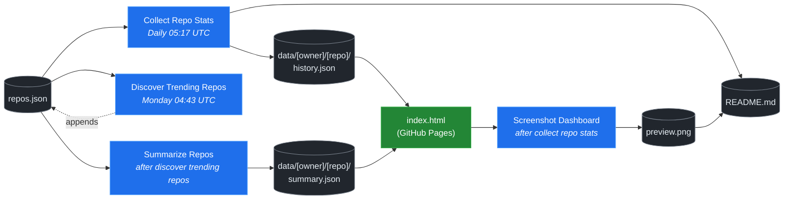

# 🚀 Rising Repos Tracker

> Automatically tracks daily GitHub stats (stars, forks, issues, velocity) for rising open source repos.

[](https://www.telosignal.com/)


**[→ View Live Dashboard](https://patrick-creates.github.io/rising-repos-tracker/)**

Built and maintained by [Telosignal](https://www.telosignal.com/).


<!-- AUTOGEN-STATS-START -->
## 📊 Current snapshot

> Auto-updated daily — last refreshed 2026-10-02

| Metric | Value |
|---|---|
| Repos tracked | **210** |
| Total stars | **10,242,765** |
| Total forks | **1,486,668** |
| Fastest growing | **VoiceStudio** (+1256.3/day) |

### 🔥 Top 5 by velocity

| # | Repo | Stars | Stars/day |
|---|---|---:|---:|
| 1 | [debpalash/VoiceStudio](https://github.com/debpalash/VoiceStudio) | 51,626 | +1256.3 |
| 2 | [DietrichGebert/ponytail](https://github.com/DietrichGebert/ponytail) | 151,094 | +1010.5 |
| 3 | [stablyai/orca](https://github.com/stablyai/orca) | 83,514 | +806.0 |
| 4 | [NousResearch/hermes-agent](https://github.com/NousResearch/hermes-agent) | 250,678 | +722.8 |
| 5 | [diegosouzapw/OmniRoute](https://github.com/diegosouzapw/OmniRoute) | 72,219 | +682.6 |

### 🆕 Recently added

- [blader/humanizer](https://github.com/blader/humanizer) — added 2026-09-28 — Agent skill that removes signs of AI-generated writing from text
- [LibreChat-AI/LibreChat](https://github.com/LibreChat-AI/LibreChat) — added 2026-09-28 — Enhanced ChatGPT Clone: Features Agents, MCP, Skills, DeepSeek, Anthropic, AWS, OpenAI, Responses API, Azure, Groq, o1, GPT-5, Mistral, OpenRouter, Vertex AI, Gemini, Artifacts, AI model switching, message search, Code Interpreter, langchain, DALL-E-3, OpenAPI Actions, Functions, Secure Multi-User Auth, Presets, open-source for self-hosting. Active
- [hypit-ai/hypit](https://github.com/hypit-ai/hypit) — added 2026-09-28 — Clone any viral video with AI agents. Not just a script, the whole workflow: swap the face, the words, the B-roll, ship 100 variants in one command, and get your 100M views.
<!-- AUTOGEN-STATS-END -->

<!-- AUTOGEN-DIAGRAM-START -->
## 🔄 How it works


```mermaid
graph LR
    repos[("repos.json")]:::data
    history[("data/[owner]/[repo]/<br/>history.json")]:::data
    summary[("data/[owner]/[repo]/<br/>summary.json")]:::data
    readme[("README.md")]:::data
    preview[("preview.png")]:::data
    dashboard["index.html<br/>(GitHub Pages)"]:::output
    collect_yml["Collect Repo Stats<br/><i>Daily 05:17 UTC</i>"]:::workflow
    discover_yml["Discover Trending Repos<br/><i>Monday 04:43 UTC</i>"]:::workflow
    screenshot_yml["Screenshot Dashboard<br/><i>after collect repo stats</i>"]:::workflow
    summarize_yml["Summarize Repos<br/><i>after discover trending repos</i>"]:::workflow
    repos --> collect_yml
    collect_yml --> history
    collect_yml --> readme
    repos --> discover_yml
    discover_yml -.->|appends| repos
    dashboard --> screenshot_yml
    screenshot_yml --> preview
    repos --> summarize_yml
    summarize_yml --> summary
    history --> dashboard
    summary --> dashboard
    preview --> readme
    classDef workflow fill:#1f6feb,stroke:#58a6ff,color:#fff
    classDef data fill:#21262d,stroke:#7d8590,color:#e6edf3
    classDef output fill:#238636,stroke:#3fb950,color:#fff
```
<!-- AUTOGEN-DIAGRAM-END -->

<!-- AUTOGEN-WORKFLOWS-START -->
## ⚙️ Workflows

| File | Schedule | Name |
|---|---|---|
| `collect.yml` | Daily 05:17 UTC | Collect Repo Stats |
| `discover.yml` | Monday 04:43 UTC | Discover Trending Repos |
| `screenshot.yml` | After Collect Repo Stats | Screenshot Dashboard |
| `summarize.yml` | After Discover Trending Repos | Summarize Repos |

> All workflows commit results directly back to the repo. Schedules are best-effort — GitHub Actions cron can drift by a few minutes.
<!-- AUTOGEN-WORKFLOWS-END -->

<!-- AUTOGEN-REPOS-START -->
## 📋 All tracked repos

| Repo | Stars | Forks | Stars/day |
|---|---:|---:|---:|
| [openclaw/openclaw](https://github.com/openclaw/openclaw) | 391,191 | 82,244 | +138.9 |
| [obra/superpowers](https://github.com/obra/superpowers) | 294,167 | 26,306 | +574.4 |
| [affaan-m/everything-claude-code](https://github.com/affaan-m/everything-claude-code) | 270,914 | 40,505 | +632.9 |
| [affaan-m/ECC](https://github.com/affaan-m/ECC) | 270,914 | 40,505 | +605.3 |
| [NousResearch/hermes-agent](https://github.com/NousResearch/hermes-agent) | 250,678 | 53,691 | +722.8 |
| [microsoft/markitdown](https://github.com/microsoft/markitdown) | 187,960 | 13,909 | +457.4 |
| [Significant-Gravitas/AutoGPT](https://github.com/Significant-Gravitas/AutoGPT) | 187,655 | 45,973 | +23.8 |
| [f/prompts.chat](https://github.com/f/prompts.chat) | 171,854 | 22,021 | +68.2 |
| [langgenius/dify](https://github.com/langgenius/dify) | 157,726 | 24,887 | +116.2 |
| [open-webui/open-webui](https://github.com/open-webui/open-webui) | 153,791 | 22,488 | +119.0 |
| [DietrichGebert/ponytail](https://github.com/DietrichGebert/ponytail) | 151,094 | 8,105 | +1010.5 |
| [langchain-ai/langchain](https://github.com/langchain-ai/langchain) | 147,380 | 24,684 | +75.7 |
| [github/spec-kit](https://github.com/github/spec-kit) | 139,771 | 12,521 | +295.1 |
| [farion1231/cc-switch](https://github.com/farion1231/cc-switch) | 139,492 | 9,406 | +477.7 |
| [nextlevelbuilder/ui-ux-pro-max-skill](https://github.com/nextlevelbuilder/ui-ux-pro-max-skill) | 132,455 | 14,048 | +384.2 |
| [Graphify-Labs/graphify](https://github.com/Graphify-Labs/graphify) | 123,190 | 11,877 | +395.4 |
| [microsoft/generative-ai-for-beginners](https://github.com/microsoft/generative-ai-for-beginners) | 120,935 | 63,601 | +71.7 |
| [JuliusBrussee/caveman](https://github.com/JuliusBrussee/caveman) | 108,825 | 6,309 | +345.4 |
| [nexu-io/open-design](https://github.com/nexu-io/open-design) | 99,131 | 11,472 | +401.1 |
| [ruvnet/RuView](https://github.com/ruvnet/RuView) | 95,932 | 12,660 | +231.1 |
| [thedotmack/claude-mem](https://github.com/thedotmack/claude-mem) | 95,166 | 8,430 | +139.3 |
| [vllm-project/vllm](https://github.com/vllm-project/vllm) | 93,059 | 22,928 | +92.8 |
| [Leonxlnx/taste-skill](https://github.com/Leonxlnx/taste-skill) | 91,920 | 6,244 | +500.1 |
| [OpenHands/OpenHands](https://github.com/OpenHands/OpenHands) | 89,791 | 11,864 | +115.8 |
| [ChatGPTNextWeb/NextChat](https://github.com/ChatGPTNextWeb/NextChat) | 88,831 | 58,949 | +5.8 |
| [Panniantong/Agent-Reach](https://github.com/Panniantong/Agent-Reach) | 87,694 | 7,734 | +553.6 |
| [koala73/worldmonitor](https://github.com/koala73/worldmonitor) | 87,676 | 13,374 | +243.1 |
| [stablyai/orca](https://github.com/stablyai/orca) | 83,514 | 5,402 | +806.0 |
| [lobehub/lobehub](https://github.com/lobehub/lobehub) | 82,957 | 15,953 | +42.0 |
| [rtk-ai/rtk](https://github.com/rtk-ai/rtk) | 82,208 | 5,216 | +238.2 |
| [datawhalechina/hello-agents](https://github.com/datawhalechina/hello-agents) | 81,522 | 10,136 | +225.3 |
| [dair-ai/Prompt-Engineering-Guide](https://github.com/dair-ai/Prompt-Engineering-Guide) | 78,779 | 8,659 | +29.8 |
| [shareAI-lab/learn-claude-code](https://github.com/shareAI-lab/learn-claude-code) | 77,907 | 12,501 | +122.8 |
| [unslothai/unsloth](https://github.com/unslothai/unsloth) | 77,137 | 7,097 | +92.2 |
| [ComposioHQ/awesome-claude-skills](https://github.com/ComposioHQ/awesome-claude-skills) | 76,346 | 8,909 | +116.5 |
| [openai/openai-cookbook](https://github.com/openai/openai-cookbook) | 76,307 | 12,904 | +19.7 |
| [chopratejas/headroom](https://github.com/chopratejas/headroom) | 74,273 | 5,748 | +423.0 |
| [headroomlabs-ai/headroom](https://github.com/headroomlabs-ai/headroom) | 74,273 | 5,748 | +278.1 |
| [career-ops-hq/career-ops](https://github.com/career-ops-hq/career-ops) | 73,279 | 13,778 | +115.9 |
| [santifer/career-ops](https://github.com/santifer/career-ops) | 73,278 | 13,778 | +204.6 |
| [diegosouzapw/OmniRoute](https://github.com/diegosouzapw/OmniRoute) | 72,219 | 10,315 | +682.6 |
| [Fission-AI/OpenSpec](https://github.com/Fission-AI/OpenSpec) | 70,902 | 4,870 | +161.4 |
| [code-yeongyu/oh-my-openagent](https://github.com/code-yeongyu/oh-my-openagent) | 69,755 | 5,744 | +83.4 |
| [asgeirtj/system_prompts_leaks](https://github.com/asgeirtj/system_prompts_leaks) | 68,757 | 11,173 | +207.1 |
| [shanraisshan/claude-code-best-practice](https://github.com/shanraisshan/claude-code-best-practice) | 66,992 | 6,698 | +98.5 |
| [xtekky/gpt4free](https://github.com/xtekky/gpt4free) | 66,749 | 13,494 | +3.7 |
| [usestrix/strix](https://github.com/usestrix/strix) | 66,040 | 7,240 | +327.9 |
| [ZhuLinsen/daily_stock_analysis](https://github.com/ZhuLinsen/daily_stock_analysis) | 65,851 | 54,951 | +207.8 |
| [mvanhorn/last30days-skill](https://github.com/mvanhorn/last30days-skill) | 63,369 | 5,520 | +264.6 |
| [rohitg00/ai-engineering-from-scratch](https://github.com/rohitg00/ai-engineering-from-scratch) | 62,558 | 10,696 | +294.3 |
| [calesthio/OpenMontage](https://github.com/calesthio/OpenMontage) | 62,273 | 7,954 | +362.3 |
| [tw93/Pake](https://github.com/tw93/Pake) | 61,869 | 12,736 | +95.5 |
| [BerriAI/litellm](https://github.com/BerriAI/litellm) | 60,035 | 11,966 | +92.3 |
| [MemPalace/mempalace](https://github.com/MemPalace/mempalace) | 59,389 | 7,566 | +51.0 |
| [jamiepine/voicebox](https://github.com/jamiepine/voicebox) | 56,144 | 7,004 | +220.5 |
| [heygen-com/hyperframes](https://github.com/heygen-com/hyperframes) | 55,569 | 5,030 | +258.7 |
| [FlowiseAI/Flowise](https://github.com/FlowiseAI/Flowise) | 55,494 | 25,058 | +18.9 |
| [hesreallyhim/awesome-claude-code](https://github.com/hesreallyhim/awesome-claude-code) | 54,937 | 4,783 | +79.1 |
| [ggml-org/whisper.cpp](https://github.com/ggml-org/whisper.cpp) | 54,095 | 6,203 | +31.2 |
| [router-for-me/CLIProxyAPI](https://github.com/router-for-me/CLIProxyAPI) | 53,810 | 8,122 | +146.7 |
| [blader/humanizer](https://github.com/blader/humanizer) | 53,496 | 4,262 | +245.8 |
| [ChromeDevTools/chrome-devtools-mcp](https://github.com/ChromeDevTools/chrome-devtools-mcp) | 52,884 | 5,304 | +94.9 |
| [coreyhaines31/marketingskills](https://github.com/coreyhaines31/marketingskills) | 52,215 | 7,869 | +168.9 |
| [bojieli/ai-agent-book](https://github.com/bojieli/ai-agent-book) | 52,069 | 5,872 | +596.2 |
| [debpalash/VoiceStudio](https://github.com/debpalash/VoiceStudio) | 51,626 | 5,755 | +1256.3 |
| [elder-plinius/CL4R1T4S](https://github.com/elder-plinius/CL4R1T4S) | 50,845 | 10,417 | +109.7 |
| [Imbad0202/academic-research-skills](https://github.com/Imbad0202/academic-research-skills) | 50,133 | 3,867 | +155.8 |
| [Aider-AI/aider](https://github.com/Aider-AI/aider) | 49,329 | 5,022 | +31.9 |
| [QuantumNous/new-api](https://github.com/QuantumNous/new-api) | 49,201 | 11,824 | +106.5 |
| [kepano/obsidian-skills](https://github.com/kepano/obsidian-skills) | 49,086 | 3,496 | +123.6 |
| [HKUDS/nanobot](https://github.com/HKUDS/nanobot) | 48,746 | 8,606 | +44.3 |
| [K-Dense-AI/scientific-agent-skills](https://github.com/K-Dense-AI/scientific-agent-skills) | 47,348 | 4,286 | +154.9 |
| [zhayujie/CowAgent](https://github.com/zhayujie/CowAgent) | 47,213 | 10,377 | +19.4 |
| [sickn33/antigravity-awesome-skills](https://github.com/sickn33/antigravity-awesome-skills) | 47,174 | 6,872 | +65.4 |
| [sickn33/agentic-awesome-skills](https://github.com/sickn33/agentic-awesome-skills) | 47,174 | 6,872 | +51.0 |
| [DeusData/codebase-memory-mcp](https://github.com/DeusData/codebase-memory-mcp) | 45,661 | 3,748 | +263.5 |
| [danny-avila/LibreChat](https://github.com/danny-avila/LibreChat) | 45,202 | 9,271 | +59.5 |
| [LibreChat-AI/LibreChat](https://github.com/LibreChat-AI/LibreChat) | 45,202 | 9,271 | +44.5 |
| [MadsLorentzen/ai-job-search](https://github.com/MadsLorentzen/ai-job-search) | 44,756 | 15,462 | +286.1 |
| [chatanywhere/GPT_API_free](https://github.com/chatanywhere/GPT_API_free) | 43,490 | 2,736 | +41.0 |
| [alibaba/open-code-review](https://github.com/alibaba/open-code-review) | 43,264 | 3,116 | +378.1 |
| [langchain-ai/langgraph](https://github.com/langchain-ai/langgraph) | 42,604 | 7,223 | +70.4 |
| [chatboxai/chatbox](https://github.com/chatboxai/chatbox) | 41,930 | 4,272 | +14.1 |
| [ogulcancelik/herdr](https://github.com/ogulcancelik/herdr) | 41,903 | 3,243 | +335.3 |
| [herdrdev/herdr](https://github.com/herdrdev/herdr) | 41,903 | 3,243 | +301.9 |
| [AstrBotDevs/AstrBot](https://github.com/AstrBotDevs/AstrBot) | 41,295 | 3,006 | +62.7 |
| [Hmbown/CodeWhale](https://github.com/Hmbown/CodeWhale) | 41,042 | 3,565 | +49.0 |
| [Hmbown/Codewhale](https://github.com/Hmbown/Codewhale) | 41,042 | 3,565 | +5.0 |
| [tinyhumansai/openhuman](https://github.com/tinyhumansai/openhuman) | 40,443 | 3,996 | +38.2 |
| [wshobson/agents](https://github.com/wshobson/agents) | 40,155 | 4,286 | +32.5 |
| [mindsdb/mindshub](https://github.com/mindsdb/mindshub) | 39,778 | 6,245 | +4.7 |
| [github/awesome-copilot](https://github.com/github/awesome-copilot) | 39,620 | 5,045 | +44.7 |
| [Yeachan-Heo/oh-my-claudecode](https://github.com/Yeachan-Heo/oh-my-claudecode) | 39,531 | 3,534 | +36.2 |
| [volcengine/OpenViking](https://github.com/volcengine/OpenViking) | 39,127 | 3,072 | +119.0 |
| [google/langextract](https://github.com/google/langextract) | 38,927 | 2,719 | +18.2 |
| [AlexsJones/llmfit](https://github.com/AlexsJones/llmfit) | 37,435 | 2,398 | +84.8 |
| [anthropics/claude-plugins-official](https://github.com/anthropics/claude-plugins-official) | 37,309 | 4,196 | +67.5 |
| [PDFMathTranslate/PDFMathTranslate](https://github.com/PDFMathTranslate/PDFMathTranslate) | 37,296 | 3,341 | +25.2 |
| [songquanpeng/one-api](https://github.com/songquanpeng/one-api) | 37,069 | 6,875 | +22.0 |
| [esengine/DeepSeek-Reasonix](https://github.com/esengine/DeepSeek-Reasonix) | 35,737 | 2,436 | +139.8 |
| [JCodesMore/ai-website-cloner-template](https://github.com/JCodesMore/ai-website-cloner-template) | 35,555 | 5,202 | +170.3 |
| [agentscope-ai/QwenPaw](https://github.com/agentscope-ai/QwenPaw) | 35,418 | 3,154 | +161.8 |
| [HKUDS/Vibe-Trading](https://github.com/HKUDS/Vibe-Trading) | 34,450 | 5,604 | +207.5 |
| [can1357/oh-my-pi](https://github.com/can1357/oh-my-pi) | 34,072 | 3,679 | +196.8 |
| [mukul975/Anthropic-Cybersecurity-Skills](https://github.com/mukul975/Anthropic-Cybersecurity-Skills) | 33,705 | 4,087 | +152.8 |
| [Gitlawb/openclaude](https://github.com/Gitlawb/openclaude) | 33,615 | 9,112 | +44.6 |
| [virgiliojr94/book-to-skill](https://github.com/virgiliojr94/book-to-skill) | 33,295 | 3,480 | +217.1 |
| [iOfficeAI/AionUi](https://github.com/iOfficeAI/AionUi) | 33,281 | 3,470 | +48.2 |
| [zeroclaw-labs/zeroclaw](https://github.com/zeroclaw-labs/zeroclaw) | 32,929 | 4,954 | +10.2 |
| [p-e-w/heretic](https://github.com/p-e-w/heretic) | 32,745 | 3,679 | +75.6 |
| [tirth8205/code-review-graph](https://github.com/tirth8205/code-review-graph) | 31,898 | 2,917 | +122.8 |
| [Tencent/WeKnora](https://github.com/Tencent/WeKnora) | 31,712 | 4,232 | +141.5 |
| [iOfficeAI/OfficeCLI](https://github.com/iOfficeAI/OfficeCLI) | 31,485 | 2,147 | +262.4 |
| [googleworkspace/cli](https://github.com/googleworkspace/cli) | 31,239 | 1,858 | +36.8 |
| [decolua/9router](https://github.com/decolua/9router) | 30,190 | 5,732 | +115.8 |
| [langchain-ai/deepagents](https://github.com/langchain-ai/deepagents) | 29,903 | 4,204 | +49.6 |
| [jackwener/OpenCLI](https://github.com/jackwener/OpenCLI) | 29,769 | 2,908 | +51.5 |
| [alibaba/page-agent](https://github.com/alibaba/page-agent) | 29,315 | 2,640 | +98.7 |
| [rohitg00/agentmemory](https://github.com/rohitg00/agentmemory) | 29,093 | 2,542 | +62.7 |
| [voideditor/void](https://github.com/voideditor/void) | 28,780 | 2,656 | — |
| [jarrodwatts/claude-hud](https://github.com/jarrodwatts/claude-hud) | 28,263 | 1,311 | +30.8 |
| [BloopAI/vibe-kanban](https://github.com/BloopAI/vibe-kanban) | 28,242 | 3,030 | +12.5 |
| [TencentCloud/TencentDB-Agent-Memory](https://github.com/TencentCloud/TencentDB-Agent-Memory) | 27,637 | 2,668 | +233.6 |
| [manaflow-ai/cmux](https://github.com/manaflow-ai/cmux) | 27,563 | 2,429 | +39.6 |
| [zai-org/Open-AutoGLM](https://github.com/zai-org/Open-AutoGLM) | 26,339 | 4,048 | +7.6 |
| [toon-format/toon](https://github.com/toon-format/toon) | 25,443 | 1,124 | +8.2 |
| [mksglu/context-mode](https://github.com/mksglu/context-mode) | 24,904 | 1,789 | +68.2 |
| [pascalorg/editor](https://github.com/pascalorg/editor) | 24,529 | 3,040 | +61.9 |
| [t8y2/dbx](https://github.com/t8y2/dbx) | 23,823 | 2,186 | +178.9 |
| [guillaumemeyer/watermarks-remover](https://github.com/guillaumemeyer/watermarks-remover) | 23,230 | 2,661 | +145.6 |
| [pranshuparmar/witr](https://github.com/pranshuparmar/witr) | 22,566 | 791 | +47.7 |
| [jundot/omlx](https://github.com/jundot/omlx) | 22,453 | 1,959 | +53.4 |
| [winfunc/opcode](https://github.com/winfunc/opcode) | 22,422 | 1,715 | +3.6 |
| [every-app/open-seo](https://github.com/every-app/open-seo) | 22,143 | 2,855 | +193.7 |
| [steipete/CodexBar](https://github.com/steipete/CodexBar) | 22,119 | 2,033 | +67.8 |
| [coze-dev/coze-studio](https://github.com/coze-dev/coze-studio) | 21,664 | 3,126 | +6.2 |
| [NirDiamant/agents-towards-production](https://github.com/NirDiamant/agents-towards-production) | 21,523 | 2,852 | +7.7 |
| [KKKKhazix/khazix-skills](https://github.com/KKKKhazix/khazix-skills) | 21,103 | 2,236 | +49.3 |
| [jnMetaCode/agency-agents-zh](https://github.com/jnMetaCode/agency-agents-zh) | 21,039 | 3,395 | +55.2 |
| [1jehuang/jcode](https://github.com/1jehuang/jcode) | 20,262 | 2,346 | +147.6 |
| [tanweai/pua](https://github.com/tanweai/pua) | 19,712 | 1,206 | +13.4 |
| [datawhalechina/easy-vibe](https://github.com/datawhalechina/easy-vibe) | 19,604 | 1,874 | +24.4 |
| [danielmiessler/LifeOS](https://github.com/danielmiessler/LifeOS) | 19,268 | 2,488 | +31.4 |
| [NVIDIA/SkillSpector](https://github.com/NVIDIA/SkillSpector) | 19,023 | 1,656 | +104.6 |
| [ifixai-ai/iFixAi](https://github.com/ifixai-ai/iFixAi) | 18,871 | 1,369 | +201.8 |
| [hypit-ai/hypit](https://github.com/hypit-ai/hypit) | 18,806 | 2,125 | +426.8 |
| [nesquena/hermes-webui](https://github.com/nesquena/hermes-webui) | 18,727 | 2,667 | +38.1 |
| [jlcodes99/cockpit-tools](https://github.com/jlcodes99/cockpit-tools) | 18,592 | 1,651 | +58.9 |
| [microsoft/agent-lightning](https://github.com/microsoft/agent-lightning) | 18,550 | 1,652 | +11.4 |
| [browser-use/browser-harness](https://github.com/browser-use/browser-harness) | 18,267 | 1,783 | +29.3 |
| [RightNow-AI/openfang](https://github.com/RightNow-AI/openfang) | 18,210 | 2,291 | +3.5 |
| [AgriciDaniel/claude-seo](https://github.com/AgriciDaniel/claude-seo) | 18,157 | 2,667 | +70.7 |
| [walkinglabs/learn-harness-engineering](https://github.com/walkinglabs/learn-harness-engineering) | 17,975 | 1,902 | +91.9 |
| [MemoriLabs/Memori](https://github.com/MemoriLabs/Memori) | 17,046 | 3,636 | +16.7 |
| [tradecatlabs/vibe-coding-cn](https://github.com/tradecatlabs/vibe-coding-cn) | 17,031 | 1,723 | +63.5 |
| [cft0808/edict](https://github.com/cft0808/edict) | 16,964 | 1,766 | +8.3 |
| [wanshuiyin/Auto-claude-code-research-in-sleep](https://github.com/wanshuiyin/Auto-claude-code-research-in-sleep) | 16,897 | 1,427 | +43.4 |
| [composio-community/awesome-codex-skills](https://github.com/composio-community/awesome-codex-skills) | 16,746 | 1,647 | +19.7 |
| [xbtlin/ai-berkshire](https://github.com/xbtlin/ai-berkshire) | 16,598 | 2,477 | +66.1 |
| [xpzouying/xiaohongshu-mcp](https://github.com/xpzouying/xiaohongshu-mcp) | 16,085 | 2,364 | +17.6 |
| [Anionex/banana-slides](https://github.com/Anionex/banana-slides) | 15,677 | 1,789 | +5.1 |
| [yusufkaraaslan/Skill_Seekers](https://github.com/yusufkaraaslan/Skill_Seekers) | 15,089 | 1,543 | +8.5 |
| [kyegomez/OpenMythos](https://github.com/kyegomez/OpenMythos) | 14,910 | 3,289 | +7.4 |
| [NanmiCoder/cc-haha](https://github.com/NanmiCoder/cc-haha) | 14,829 | 8,595 | +15.9 |
| [superset-sh/superset](https://github.com/superset-sh/superset) | 14,813 | 1,320 | +27.9 |
| [NevaMind-AI/memU](https://github.com/NevaMind-AI/memU) | 14,491 | 1,086 | +5.8 |
| [XiaomiMiMo/MiMo-Code](https://github.com/XiaomiMiMo/MiMo-Code) | 13,575 | 1,413 | +26.9 |
| [EverMind-AI/EverOS](https://github.com/EverMind-AI/EverOS) | 13,326 | 926 | +38.0 |
| [sirmalloc/ccstatusline](https://github.com/sirmalloc/ccstatusline) | 13,153 | 587 | +19.7 |
| [ConardLi/garden-skills](https://github.com/ConardLi/garden-skills) | 12,718 | 1,525 | +40.2 |
| [brokermr810/QuantDinger](https://github.com/brokermr810/QuantDinger) | 12,372 | 2,531 | +35.1 |
| [OpenByteInc/QuantDinger](https://github.com/OpenByteInc/QuantDinger) | 12,372 | 2,531 | +34.7 |
| [0x4m4/hexstrike-ai](https://github.com/0x4m4/hexstrike-ai) | 12,282 | 2,503 | +23.9 |
| [MemTensor/MemOS](https://github.com/MemTensor/MemOS) | 11,675 | 1,067 | +17.3 |
| [dataelement/dsh-desktop](https://github.com/dataelement/dsh-desktop) | 11,630 | 424 | +300.9 |
| [holaboss-ai/holaOS](https://github.com/holaboss-ai/holaOS) | 11,453 | 730 | +67.0 |
| [getagentseal/codeburn](https://github.com/getagentseal/codeburn) | 11,302 | 868 | +32.2 |
| [EKKOLearnAI/hermes-studio](https://github.com/EKKOLearnAI/hermes-studio) | 11,280 | 1,390 | +27.5 |
| [EKKOLearnAI/ekko-studio](https://github.com/EKKOLearnAI/ekko-studio) | 11,280 | 1,390 | +14.0 |
| [aden-hive/hive](https://github.com/aden-hive/hive) | 11,102 | 5,656 | +5.2 |
| [ValueCell-ai/valuecell](https://github.com/ValueCell-ai/valuecell) | 11,031 | 1,806 | +1.7 |
| [openai/codex-security](https://github.com/openai/codex-security) | 10,955 | 836 | +44.5 |
| [Kuberwastaken/claurst](https://github.com/Kuberwastaken/claurst) | 10,313 | 7,716 | +4.7 |
| [ykdojo/claude-code-tips](https://github.com/ykdojo/claude-code-tips) | 10,181 | 825 | +13.2 |
| [StarTrail-org/PixelRAG](https://github.com/StarTrail-org/PixelRAG) | 10,126 | 869 | +43.7 |
| [Companion-Inc/feynman](https://github.com/Companion-Inc/feynman) | 9,859 | 1,096 | +11.8 |
| [frankbria/ralph-claude-code](https://github.com/frankbria/ralph-claude-code) | 9,643 | 722 | +3.7 |
| [trailhq/Graft](https://github.com/trailhq/Graft) | 9,500 | 874 | +106.2 |
| [modem-dev/hunk](https://github.com/modem-dev/hunk) | 9,467 | 312 | +34.1 |
| [Nasiko-Labs/nasiko](https://github.com/Nasiko-Labs/nasiko) | 9,343 | 1,942 | +83.8 |
| [EvoMap/evolver](https://github.com/EvoMap/evolver) | 9,130 | 850 | +3.1 |
| [iflytek/astron-agent](https://github.com/iflytek/astron-agent) | 8,885 | 893 | +3.1 |
| [1weiho/open-slide](https://github.com/1weiho/open-slide) | 8,658 | 610 | +47.9 |
| [open-slide/open-slide](https://github.com/open-slide/open-slide) | 8,658 | 610 | +94.3 |
| [MiroMindAI/MiroThinker](https://github.com/MiroMindAI/MiroThinker) | 8,419 | 648 | +1.1 |
| [genspark-ai/genoffice](https://github.com/genspark-ai/genoffice) | 8,390 | 1,088 | +90.9 |
| [mmulet/term.everything](https://github.com/mmulet/term.everything) | 8,106 | 196 | +0.9 |
| [Tencent/BrowserSkill](https://github.com/Tencent/BrowserSkill) | 8,043 | 571 | +95.8 |
| [ValueCell-ai/ClawX](https://github.com/ValueCell-ai/ClawX) | 7,614 | 1,143 | +0.9 |
| [rorkai/App-Store-Connect-CLI](https://github.com/rorkai/App-Store-Connect-CLI) | 7,583 | 636 | +27.4 |
| [WenyuChiou/awesome-agentic-ai-zh](https://github.com/WenyuChiou/awesome-agentic-ai-zh) | 7,245 | 979 | +21.7 |
| [opensquilla/opensquilla](https://github.com/opensquilla/opensquilla) | 7,077 | 576 | +11.7 |
| [TokenRhythm/opensquilla](https://github.com/TokenRhythm/opensquilla) | 7,077 | 576 | +4.4 |
| [tech-leads-club/agent-skills](https://github.com/tech-leads-club/agent-skills) | 7,027 | 558 | +41.5 |
| [Andyyyy64/whichllm](https://github.com/Andyyyy64/whichllm) | 6,714 | 371 | +11.4 |
| [steipete/summarize](https://github.com/steipete/summarize) | 6,678 | 449 | +3.3 |
| [Arthur-Ficial/apfel](https://github.com/Arthur-Ficial/apfel) | 6,448 | 246 | +4.1 |
| [microsoft/fara](https://github.com/microsoft/fara) | 6,207 | 605 | +2.6 |
| [UfoMiao/zcf](https://github.com/UfoMiao/zcf) | 6,086 | 423 | +0.2 |
| [re4/LibreCode](https://github.com/re4/LibreCode) | 89 | 5 | — |
<!-- AUTOGEN-REPOS-END -->

---

## What it does

- Collects daily snapshots of stars, forks, watchers and open issues for every tracked repo
- Discovers new trending repos automatically every Monday using the GitHub Search API
- Generates AI summaries (use cases, similar tools, tags) for each tracked repo via GitHub Models
- Stores all history as plain JSON — no database, no backend
- Renders a live dashboard via GitHub Pages — updates daily, zero maintenance

## Tracked repos

Data lives in [`data/`](./data) — one folder per repo, one `history.json` per entry.  
The full watch list is in [`repos.json`](./repos.json).

## Fork & use it for yourself

This is my personal tracker — the watch list reflects what I find interesting. If you want to track different repos, the best path is to **fork this repo and run your own**.

### Setup

1. Fork this repo to your account
2. Replace the contents of [`repos.json`](./repos.json) with the repos you want to track (or just leave one entry — `discover.yml` will auto-add more every Monday)
3. Go to **Settings → Pages** and enable GitHub Pages from the `main` branch
4. Go to **Actions** and run **Collect Repo Stats** once manually to seed your first data point
5. Your dashboard will be live at `https://YOUR-USERNAME.github.io/rising-repos-tracker/`

That's it — daily collection and weekly discovery run automatically on schedule. Zero ongoing maintenance.

### Customizing what gets discovered

Edit [`scripts/discover.js`](./scripts/discover.js) to change:

- `MIN_STARS` — minimum star threshold for candidates
- `MAX_AGE_DAYS` — how recent a repo must be
- `MAX_NEW_REPOS` — how many to add per discovery run
- The `queries` array — GitHub Search API queries that define what "trending" means to you

### Adding a repo manually

Just edit `repos.json` directly:

```json
{
  "owner": "OWNER",
  "repo": "REPO",
  "added": "YYYY-MM-DD",
  "notes": "why you're tracking this"
}
```

The next daily collect run picks it up automatically.

## Stack

- **GitHub Actions** — scheduling and automation
- **GitHub Pages** — dashboard hosting
- **GitHub API** — data source
- **GitHub Models** — free AI summaries (gpt-4o-mini)
- **Chart.js** — star growth visualization
- **Mermaid** — architecture diagram (rendered by GitHub)
- No dependencies, no build step, no database

## License

MIT
