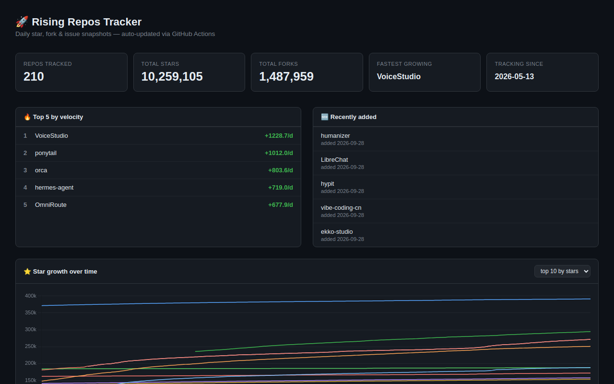
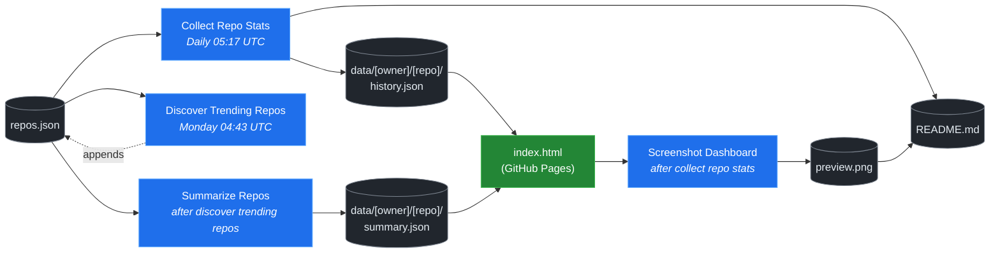

# 🚀 Rising Repos Tracker

> Automatically tracks daily GitHub stats (stars, forks, issues, velocity) for rising open source repos.

[](https://www.telosignal.com/)


**[→ View Live Dashboard](https://patrick-creates.github.io/rising-repos-tracker/)**

Built and maintained by [Telosignal](https://www.telosignal.com/).



<!-- AUTOGEN-STATS-START -->
## 📊 Current snapshot

> Auto-updated daily — last refreshed 2026-10-10

| Metric | Value |
|---|---|
| Repos tracked | **215** |
| Total stars | **10,637,432** |
| Total forks | **1,538,387** |
| Fastest growing | **VoiceStudio** (+1107.6/day) |

### 🔥 Top 5 by velocity

| # | Repo | Stars | Stars/day |
|---|---|---:|---:|
| 1 | [debpalash/VoiceStudio](https://github.com/debpalash/VoiceStudio) | 56,769 | +1107.6 |
| 2 | [DietrichGebert/ponytail](https://github.com/DietrichGebert/ponytail) | 160,061 | +1018.6 |
| 3 | [stablyai/orca](https://github.com/stablyai/orca) | 88,921 | +795.2 |
| 4 | [tt-a1i/archify](https://github.com/tt-a1i/archify) | 81,493 | +732.0 |
| 5 | [NousResearch/hermes-agent](https://github.com/NousResearch/hermes-agent) | 252,410 | +695.8 |

### 🆕 Recently added

- [tt-a1i/archify](https://github.com/tt-a1i/archify) — added 2026-10-05 — Turn any idea, plan, or codebase into a beautiful interactive diagram. An agent skill for Claude Code, Codex, and more.
- [ruvnet/ruflo](https://github.com/ruvnet/ruflo) — added 2026-10-05 — 🌊 The original agent harness. Deploy intelligent multi-player swarms, coordinate autonomous workflows, and build conversational AI systems. Features adaptive memory, self-learning intelligence, federation, vector RAG integration, and native Claude Code / Codex / Hermes and many more Integrated
- [codewhale-hq/Codewhale](https://github.com/codewhale-hq/Codewhale) — added 2026-10-05 — Open-source coding agent for your terminal, built in Rust and on a journey of continuous community improvement. Issues and PRs welcome.
<!-- AUTOGEN-STATS-END -->

<!-- AUTOGEN-DIAGRAM-START -->
## 🔄 How it works


```mermaid
graph LR
    repos[("repos.json")]:::data
    history[("data/[owner]/[repo]/<br/>history.json")]:::data
    summary[("data/[owner]/[repo]/<br/>summary.json")]:::data
    readme[("README.md")]:::data
    preview[("preview.png")]:::data
    dashboard["index.html<br/>(GitHub Pages)"]:::output
    collect_yml["Collect Repo Stats<br/><i>Daily 05:17 UTC</i>"]:::workflow
    discover_yml["Discover Trending Repos<br/><i>Monday 04:43 UTC</i>"]:::workflow
    screenshot_yml["Screenshot Dashboard<br/><i>after collect repo stats</i>"]:::workflow
    summarize_yml["Summarize Repos<br/><i>after discover trending repos</i>"]:::workflow
    repos --> collect_yml
    collect_yml --> history
    collect_yml --> readme
    repos --> discover_yml
    discover_yml -.->|appends| repos
    dashboard --> screenshot_yml
    screenshot_yml --> preview
    repos --> summarize_yml
    summarize_yml --> summary
    history --> dashboard
    summary --> dashboard
    preview --> readme
    classDef workflow fill:#1f6feb,stroke:#58a6ff,color:#fff
    classDef data fill:#21262d,stroke:#7d8590,color:#e6edf3
    classDef output fill:#238636,stroke:#3fb950,color:#fff
```
<!-- AUTOGEN-DIAGRAM-END -->

<!-- AUTOGEN-WORKFLOWS-START -->
## ⚙️ Workflows

| File | Schedule | Name |
|---|---|---|
| `collect.yml` | Daily 05:17 UTC | Collect Repo Stats |
| `discover.yml` | Monday 04:43 UTC | Discover Trending Repos |
| `screenshot.yml` | After Collect Repo Stats | Screenshot Dashboard |
| `summarize.yml` | After Discover Trending Repos | Summarize Repos |

> All workflows commit results directly back to the repo. Schedules are best-effort — GitHub Actions cron can drift by a few minutes.
<!-- AUTOGEN-WORKFLOWS-END -->

<!-- AUTOGEN-REPOS-START -->
## 📋 All tracked repos

| Repo | Stars | Forks | Stars/day |
|---|---:|---:|---:|
| [openclaw/openclaw](https://github.com/openclaw/openclaw) | 391,575 | 82,308 | +134.0 |
| [obra/superpowers](https://github.com/obra/superpowers) | 297,056 | 26,525 | +558.9 |
| [affaan-m/everything-claude-code](https://github.com/affaan-m/everything-claude-code) | 276,207 | 41,207 | +634.4 |
| [affaan-m/ECC](https://github.com/affaan-m/ECC) | 276,207 | 41,207 | +608.5 |
| [NousResearch/hermes-agent](https://github.com/NousResearch/hermes-agent) | 252,410 | 54,541 | +695.8 |
| [microsoft/markitdown](https://github.com/microsoft/markitdown) | 189,313 | 14,051 | +442.0 |
| [Significant-Gravitas/AutoGPT](https://github.com/Significant-Gravitas/AutoGPT) | 187,503 | 45,926 | +21.5 |
| [f/prompts.chat](https://github.com/f/prompts.chat) | 172,328 | 22,078 | +67.7 |
| [DietrichGebert/ponytail](https://github.com/DietrichGebert/ponytail) | 160,061 | 8,608 | +1018.6 |
| [langgenius/dify](https://github.com/langgenius/dify) | 158,074 | 24,955 | +112.3 |
| [open-webui/open-webui](https://github.com/open-webui/open-webui) | 154,180 | 22,559 | +115.3 |
| [langchain-ai/langchain](https://github.com/langchain-ai/langchain) | 147,551 | 24,758 | +72.8 |
| [farion1231/cc-switch](https://github.com/farion1231/cc-switch) | 142,276 | 9,495 | +470.6 |
| [github/spec-kit](https://github.com/github/spec-kit) | 140,661 | 12,595 | +285.3 |
| [nextlevelbuilder/ui-ux-pro-max-skill](https://github.com/nextlevelbuilder/ui-ux-pro-max-skill) | 134,362 | 14,274 | +376.5 |
| [Graphify-Labs/graphify](https://github.com/Graphify-Labs/graphify) | 125,144 | 12,079 | +379.3 |
| [microsoft/generative-ai-for-beginners](https://github.com/microsoft/generative-ai-for-beginners) | 121,094 | 63,841 | +68.9 |
| [JuliusBrussee/caveman](https://github.com/JuliusBrussee/caveman) | 110,851 | 6,424 | +340.3 |
| [nexu-io/open-design](https://github.com/nexu-io/open-design) | 100,318 | 11,572 | +387.2 |
| [thedotmack/claude-mem](https://github.com/thedotmack/claude-mem) | 99,099 | 8,677 | +158.1 |
| [ruvnet/RuView](https://github.com/ruvnet/RuView) | 97,103 | 12,757 | +226.2 |
| [Panniantong/Agent-Reach](https://github.com/Panniantong/Agent-Reach) | 95,263 | 8,332 | +578.9 |
| [Leonxlnx/taste-skill](https://github.com/Leonxlnx/taste-skill) | 94,262 | 6,414 | +487.4 |
| [vllm-project/vllm](https://github.com/vllm-project/vllm) | 93,504 | 23,208 | +90.8 |
| [OpenHands/OpenHands](https://github.com/OpenHands/OpenHands) | 90,458 | 11,973 | +114.0 |
| [stablyai/orca](https://github.com/stablyai/orca) | 88,921 | 5,685 | +795.2 |
| [ChatGPTNextWeb/NextChat](https://github.com/ChatGPTNextWeb/NextChat) | 88,834 | 58,883 | +5.5 |
| [koala73/worldmonitor](https://github.com/koala73/worldmonitor) | 88,165 | 13,459 | +233.1 |
| [lobehub/lobehub](https://github.com/lobehub/lobehub) | 83,105 | 15,966 | +40.7 |
| [rtk-ai/rtk](https://github.com/rtk-ai/rtk) | 82,830 | 5,259 | +229.3 |
| [datawhalechina/hello-agents](https://github.com/datawhalechina/hello-agents) | 82,389 | 10,222 | +218.8 |
| [tt-a1i/archify](https://github.com/tt-a1i/archify) | 81,493 | 5,503 | +732.0 |
| [dair-ai/Prompt-Engineering-Guide](https://github.com/dair-ai/Prompt-Engineering-Guide) | 78,970 | 8,667 | +29.4 |
| [shareAI-lab/learn-claude-code](https://github.com/shareAI-lab/learn-claude-code) | 78,292 | 12,544 | +118.7 |
| [unslothai/unsloth](https://github.com/unslothai/unsloth) | 77,685 | 7,170 | +90.9 |
| [ComposioHQ/awesome-claude-skills](https://github.com/ComposioHQ/awesome-claude-skills) | 76,786 | 9,013 | +113.1 |
| [openai/openai-cookbook](https://github.com/openai/openai-cookbook) | 76,534 | 12,930 | +20.2 |
| [chopratejas/headroom](https://github.com/chopratejas/headroom) | 74,883 | 5,806 | +399.3 |
| [headroomlabs-ai/headroom](https://github.com/headroomlabs-ai/headroom) | 74,883 | 5,806 | +263.5 |
| [diegosouzapw/OmniRoute](https://github.com/diegosouzapw/OmniRoute) | 74,816 | 10,802 | +652.8 |
| [ruvnet/ruflo](https://github.com/ruvnet/ruflo) | 74,236 | 8,825 | +69.0 |
| [santifer/career-ops](https://github.com/santifer/career-ops) | 73,937 | 13,875 | +197.9 |
| [career-ops-hq/career-ops](https://github.com/career-ops-hq/career-ops) | 73,937 | 13,875 | +107.7 |
| [Fission-AI/OpenSpec](https://github.com/Fission-AI/OpenSpec) | 71,530 | 4,881 | +156.8 |
| [code-yeongyu/oh-my-openagent](https://github.com/code-yeongyu/oh-my-openagent) | 69,930 | 5,745 | +80.0 |
| [asgeirtj/system_prompts_leaks](https://github.com/asgeirtj/system_prompts_leaks) | 69,302 | 11,264 | +199.4 |
| [usestrix/strix](https://github.com/usestrix/strix) | 67,675 | 7,488 | +320.3 |
| [shanraisshan/claude-code-best-practice](https://github.com/shanraisshan/claude-code-best-practice) | 67,329 | 6,727 | +95.4 |
| [xtekky/gpt4free](https://github.com/xtekky/gpt4free) | 66,779 | 13,475 | +3.7 |
| [rohitg00/ai-engineering-from-scratch](https://github.com/rohitg00/ai-engineering-from-scratch) | 66,339 | 11,615 | +305.2 |
| [ZhuLinsen/daily_stock_analysis](https://github.com/ZhuLinsen/daily_stock_analysis) | 66,141 | 55,079 | +197.8 |
| [calesthio/OpenMontage](https://github.com/calesthio/OpenMontage) | 65,982 | 8,391 | +370.2 |
| [mvanhorn/last30days-skill](https://github.com/mvanhorn/last30days-skill) | 63,877 | 5,565 | +251.7 |
| [tw93/Pake](https://github.com/tw93/Pake) | 61,976 | 12,763 | +91.0 |
| [BerriAI/litellm](https://github.com/BerriAI/litellm) | 60,864 | 12,207 | +92.9 |
| [heygen-com/hyperframes](https://github.com/heygen-com/hyperframes) | 60,070 | 5,366 | +278.3 |
| [MemPalace/mempalace](https://github.com/MemPalace/mempalace) | 59,488 | 7,563 | +48.9 |
| [jamiepine/voicebox](https://github.com/jamiepine/voicebox) | 56,782 | 7,078 | +211.9 |
| [debpalash/VoiceStudio](https://github.com/debpalash/VoiceStudio) | 56,769 | 6,368 | +1107.6 |
| [FlowiseAI/Flowise](https://github.com/FlowiseAI/Flowise) | 55,494 | 25,057 | +17.9 |
| [hesreallyhim/awesome-claude-code](https://github.com/hesreallyhim/awesome-claude-code) | 55,350 | 4,801 | +77.6 |
| [blader/humanizer](https://github.com/blader/humanizer) | 55,350 | 4,366 | +236.4 |
| [router-for-me/CLIProxyAPI](https://github.com/router-for-me/CLIProxyAPI) | 54,701 | 8,349 | +144.6 |
| [ggml-org/whisper.cpp](https://github.com/ggml-org/whisper.cpp) | 54,266 | 6,223 | +30.6 |
| [coreyhaines31/marketingskills](https://github.com/coreyhaines31/marketingskills) | 53,994 | 8,023 | +172.2 |
| [bojieli/ai-agent-book](https://github.com/bojieli/ai-agent-book) | 53,305 | 6,027 | +553.1 |
| [ChromeDevTools/chrome-devtools-mcp](https://github.com/ChromeDevTools/chrome-devtools-mcp) | 53,211 | 6,079 | +91.9 |
| [Imbad0202/academic-research-skills](https://github.com/Imbad0202/academic-research-skills) | 51,152 | 3,932 | +152.8 |
| [elder-plinius/CL4R1T4S](https://github.com/elder-plinius/CL4R1T4S) | 51,095 | 10,470 | +104.3 |
| [QuantumNous/new-api](https://github.com/QuantumNous/new-api) | 49,616 | 11,925 | +103.3 |
| [Aider-AI/aider](https://github.com/Aider-AI/aider) | 49,453 | 5,043 | +31.0 |
| [kepano/obsidian-skills](https://github.com/kepano/obsidian-skills) | 49,357 | 3,500 | +118.1 |
| [HKUDS/nanobot](https://github.com/HKUDS/nanobot) | 48,921 | 8,619 | +43.0 |
| [K-Dense-AI/scientific-agent-skills](https://github.com/K-Dense-AI/scientific-agent-skills) | 48,249 | 4,339 | +144.6 |
| [sickn33/antigravity-awesome-skills](https://github.com/sickn33/antigravity-awesome-skills) | 47,411 | 6,913 | +63.3 |
| [sickn33/agentic-awesome-skills](https://github.com/sickn33/agentic-awesome-skills) | 47,411 | 6,913 | +49.1 |
| [zhayujie/CowAgent](https://github.com/zhayujie/CowAgent) | 47,310 | 10,379 | +19.0 |
| [DeusData/codebase-memory-mcp](https://github.com/DeusData/codebase-memory-mcp) | 46,275 | 3,804 | +249.0 |
| [alibaba/open-code-review](https://github.com/alibaba/open-code-review) | 45,721 | 3,299 | +372.2 |
| [danny-avila/LibreChat](https://github.com/danny-avila/LibreChat) | 45,477 | 9,337 | +58.0 |
| [LibreChat-AI/LibreChat](https://github.com/LibreChat-AI/LibreChat) | 45,477 | 9,337 | +37.8 |
| [MadsLorentzen/ai-job-search](https://github.com/MadsLorentzen/ai-job-search) | 45,449 | 15,783 | +268.2 |
| [chatanywhere/GPT_API_free](https://github.com/chatanywhere/GPT_API_free) | 43,938 | 2,742 | +41.9 |
| [ogulcancelik/herdr](https://github.com/ogulcancelik/herdr) | 43,176 | 3,397 | +320.6 |
| [herdrdev/herdr](https://github.com/herdrdev/herdr) | 43,176 | 3,397 | +285.1 |
| [langchain-ai/langgraph](https://github.com/langchain-ai/langgraph) | 43,009 | 7,308 | +69.0 |
| [chatboxai/chatbox](https://github.com/chatboxai/chatbox) | 41,986 | 4,270 | +13.7 |
| [tinyhumansai/openhuman](https://github.com/tinyhumansai/openhuman) | 41,771 | 4,111 | +69.2 |
| [AstrBotDevs/AstrBot](https://github.com/AstrBotDevs/AstrBot) | 41,655 | 3,032 | +61.6 |
| [Hmbown/CodeWhale](https://github.com/Hmbown/CodeWhale) | 41,077 | 3,568 | +46.4 |
| [Hmbown/Codewhale](https://github.com/Hmbown/Codewhale) | 41,077 | 3,568 | +4.9 |
| [codewhale-hq/Codewhale](https://github.com/codewhale-hq/Codewhale) | 41,077 | 3,568 | +5.8 |
| [wshobson/agents](https://github.com/wshobson/agents) | 40,318 | 4,294 | +31.8 |
| [github/awesome-copilot](https://github.com/github/awesome-copilot) | 39,881 | 5,091 | +44.0 |
| [mindsdb/mindshub](https://github.com/mindsdb/mindshub) | 39,787 | 6,241 | +4.3 |
| [Yeachan-Heo/oh-my-claudecode](https://github.com/Yeachan-Heo/oh-my-claudecode) | 39,756 | 3,559 | +35.7 |
| [volcengine/OpenViking](https://github.com/volcengine/OpenViking) | 39,587 | 3,127 | +115.0 |
| [google/langextract](https://github.com/google/langextract) | 38,933 | 2,718 | +17.2 |
| [AlexsJones/llmfit](https://github.com/AlexsJones/llmfit) | 37,774 | 2,426 | +82.2 |
| [anthropics/claude-plugins-official](https://github.com/anthropics/claude-plugins-official) | 37,605 | 4,235 | +65.6 |
| [PDFMathTranslate/PDFMathTranslate](https://github.com/PDFMathTranslate/PDFMathTranslate) | 37,461 | 3,348 | +25.0 |
| [songquanpeng/one-api](https://github.com/songquanpeng/one-api) | 37,113 | 6,876 | +21.0 |
| [JCodesMore/ai-website-cloner-template](https://github.com/JCodesMore/ai-website-cloner-template) | 36,398 | 5,333 | +165.9 |
| [esengine/DeepSeek-Reasonix](https://github.com/esengine/DeepSeek-Reasonix) | 35,754 | 2,438 | +130.9 |
| [agentscope-ai/QwenPaw](https://github.com/agentscope-ai/QwenPaw) | 35,555 | 3,168 | +151.9 |
| [HKUDS/Vibe-Trading](https://github.com/HKUDS/Vibe-Trading) | 35,112 | 5,700 | +197.8 |
| [can1357/oh-my-pi](https://github.com/can1357/oh-my-pi) | 34,870 | 3,790 | +189.8 |
| [p-e-w/heretic](https://github.com/p-e-w/heretic) | 34,423 | 3,853 | +84.3 |
| [virgiliojr94/book-to-skill](https://github.com/virgiliojr94/book-to-skill) | 34,388 | 3,618 | +203.4 |
| [mukul975/Anthropic-Cybersecurity-Skills](https://github.com/mukul975/Anthropic-Cybersecurity-Skills) | 34,132 | 4,153 | +145.5 |
| [Gitlawb/openclaude](https://github.com/Gitlawb/openclaude) | 33,707 | 9,108 | +42.5 |
| [Twigpine/openclaude](https://github.com/Twigpine/openclaude) | 33,707 | 9,108 | +12.4 |
| [iOfficeAI/AionUi](https://github.com/iOfficeAI/AionUi) | 33,413 | 3,470 | +46.3 |
| [Tencent/WeKnora](https://github.com/Tencent/WeKnora) | 32,980 | 4,388 | +142.6 |
| [zeroclaw-labs/zeroclaw](https://github.com/zeroclaw-labs/zeroclaw) | 32,949 | 4,959 | +9.7 |
| [tirth8205/code-review-graph](https://github.com/tirth8205/code-review-graph) | 32,018 | 2,933 | +115.4 |
| [iOfficeAI/OfficeCLI](https://github.com/iOfficeAI/OfficeCLI) | 31,797 | 2,163 | +243.8 |
| [googleworkspace/cli](https://github.com/googleworkspace/cli) | 31,286 | 1,862 | +34.9 |
| [decolua/9router](https://github.com/decolua/9router) | 30,548 | 5,827 | +110.9 |
| [langchain-ai/deepagents](https://github.com/langchain-ai/deepagents) | 30,102 | 4,217 | +48.0 |
| [jackwener/OpenCLI](https://github.com/jackwener/OpenCLI) | 30,008 | 2,930 | +50.1 |
| [alibaba/page-agent](https://github.com/alibaba/page-agent) | 29,366 | 2,639 | +92.4 |
| [rohitg00/agentmemory](https://github.com/rohitg00/agentmemory) | 29,278 | 2,565 | +60.1 |
| [voideditor/void](https://github.com/voideditor/void) | 28,762 | 2,654 | — |
| [jarrodwatts/claude-hud](https://github.com/jarrodwatts/claude-hud) | 28,433 | 1,314 | +30.2 |
| [BloopAI/vibe-kanban](https://github.com/BloopAI/vibe-kanban) | 28,315 | 3,032 | +12.3 |
| [manaflow-ai/cmux](https://github.com/manaflow-ai/cmux) | 28,080 | 2,480 | +41.8 |
| [TencentCloud/TencentDB-Agent-Memory](https://github.com/TencentCloud/TencentDB-Agent-Memory) | 27,886 | 2,711 | +215.4 |
| [zai-org/Open-AutoGLM](https://github.com/zai-org/Open-AutoGLM) | 26,368 | 4,051 | +7.3 |
| [mksglu/context-mode](https://github.com/mksglu/context-mode) | 26,032 | 1,877 | +73.2 |
| [t8y2/dbx](https://github.com/t8y2/dbx) | 25,537 | 2,314 | +182.7 |
| [toon-format/toon](https://github.com/toon-format/toon) | 25,480 | 1,122 | +7.9 |
| [pascalorg/editor](https://github.com/pascalorg/editor) | 24,758 | 3,065 | +57.5 |
| [guillaumemeyer/watermarks-remover](https://github.com/guillaumemeyer/watermarks-remover) | 23,745 | 2,727 | +131.8 |
| [ifixai-ai/iFixAi](https://github.com/ifixai-ai/iFixAi) | 23,273 | 1,439 | +247.5 |
| [every-app/open-seo](https://github.com/every-app/open-seo) | 22,937 | 2,998 | +164.7 |
| [jundot/omlx](https://github.com/jundot/omlx) | 22,683 | 1,994 | +51.7 |
| [pranshuparmar/witr](https://github.com/pranshuparmar/witr) | 22,640 | 792 | +44.7 |
| [winfunc/opcode](https://github.com/winfunc/opcode) | 22,414 | 1,711 | +3.3 |
| [steipete/CodexBar](https://github.com/steipete/CodexBar) | 22,358 | 2,084 | +65.0 |
| [coze-dev/coze-studio](https://github.com/coze-dev/coze-studio) | 21,697 | 3,128 | +6.0 |
| [NirDiamant/agents-towards-production](https://github.com/NirDiamant/agents-towards-production) | 21,580 | 2,862 | +7.6 |
| [KKKKhazix/khazix-skills](https://github.com/KKKKhazix/khazix-skills) | 21,286 | 2,251 | +46.7 |
| [jnMetaCode/agency-agents-zh](https://github.com/jnMetaCode/agency-agents-zh) | 21,160 | 3,401 | +52.3 |
| [hypit-ai/hypit](https://github.com/hypit-ai/hypit) | 20,717 | 2,274 | +301.5 |
| [1jehuang/jcode](https://github.com/1jehuang/jcode) | 20,377 | 2,373 | +135.6 |
| [NVIDIA/SkillSpector](https://github.com/NVIDIA/SkillSpector) | 19,830 | 1,735 | +103.5 |
| [tanweai/pua](https://github.com/tanweai/pua) | 19,705 | 1,202 | +12.5 |
| [datawhalechina/easy-vibe](https://github.com/datawhalechina/easy-vibe) | 19,671 | 1,879 | +23.3 |
| [walkinglabs/learn-harness-engineering](https://github.com/walkinglabs/learn-harness-engineering) | 19,624 | 2,148 | +101.4 |
| [danielmiessler/LifeOS](https://github.com/danielmiessler/LifeOS) | 19,372 | 2,488 | +30.1 |
| [nesquena/hermes-webui](https://github.com/nesquena/hermes-webui) | 18,843 | 2,704 | +36.4 |
| [jlcodes99/cockpit-tools](https://github.com/jlcodes99/cockpit-tools) | 18,787 | 1,673 | +54.3 |
| [microsoft/agent-lightning](https://github.com/microsoft/agent-lightning) | 18,641 | 1,666 | +11.4 |
| [AgriciDaniel/claude-seo](https://github.com/AgriciDaniel/claude-seo) | 18,639 | 2,732 | +67.5 |
| [browser-use/browser-harness](https://github.com/browser-use/browser-harness) | 18,373 | 1,794 | +28.1 |
| [RightNow-AI/openfang](https://github.com/RightNow-AI/openfang) | 18,214 | 2,291 | +3.3 |
| [rocketride-org/rocketride-server](https://github.com/rocketride-org/rocketride-server) | 17,806 | 7,586 | — |
| [tradecatlabs/vibe-coding-cn](https://github.com/tradecatlabs/vibe-coding-cn) | 17,410 | 1,757 | +52.8 |
| [wanshuiyin/Auto-claude-code-research-in-sleep](https://github.com/wanshuiyin/Auto-claude-code-research-in-sleep) | 17,223 | 1,445 | +43.2 |
| [MemoriLabs/Memori](https://github.com/MemoriLabs/Memori) | 17,149 | 3,716 | +16.4 |
| [cft0808/edict](https://github.com/cft0808/edict) | 16,984 | 1,766 | +7.9 |
| [composio-community/awesome-codex-skills](https://github.com/composio-community/awesome-codex-skills) | 16,844 | 1,658 | +18.8 |
| [xbtlin/ai-berkshire](https://github.com/xbtlin/ai-berkshire) | 16,681 | 2,479 | +61.5 |
| [xpzouying/xiaohongshu-mcp](https://github.com/xpzouying/xiaohongshu-mcp) | 16,186 | 2,376 | +17.3 |
| [Anionex/banana-slides](https://github.com/Anionex/banana-slides) | 15,729 | 1,785 | +5.3 |
| [yusufkaraaslan/Skill_Seekers](https://github.com/yusufkaraaslan/Skill_Seekers) | 15,118 | 1,542 | +8.1 |
| [superset-sh/superset](https://github.com/superset-sh/superset) | 15,045 | 1,343 | +28.0 |
| [NanmiCoder/cc-haha](https://github.com/NanmiCoder/cc-haha) | 14,945 | 8,601 | +15.7 |
| [kyegomez/OpenMythos](https://github.com/kyegomez/OpenMythos) | 14,912 | 3,281 | +6.9 |
| [NevaMind-AI/memU](https://github.com/NevaMind-AI/memU) | 14,520 | 1,085 | +5.6 |
| [XiaomiMiMo/MiMo-Code](https://github.com/XiaomiMiMo/MiMo-Code) | 13,618 | 1,428 | +25.2 |
| [EverMind-AI/EverOS](https://github.com/EverMind-AI/EverOS) | 13,395 | 928 | +35.7 |
| [sirmalloc/ccstatusline](https://github.com/sirmalloc/ccstatusline) | 13,238 | 590 | +19.0 |
| [dataelement/dsh-desktop](https://github.com/dataelement/dsh-desktop) | 12,883 | 464 | +256.5 |
| [ConardLi/garden-skills](https://github.com/ConardLi/garden-skills) | 12,801 | 1,536 | +37.7 |
| [brokermr810/QuantDinger](https://github.com/brokermr810/QuantDinger) | 12,619 | 2,559 | +34.8 |
| [OpenByteInc/QuantDinger](https://github.com/OpenByteInc/QuantDinger) | 12,619 | 2,559 | +34.4 |
| [0x4m4/hexstrike-ai](https://github.com/0x4m4/hexstrike-ai) | 12,582 | 2,559 | +25.0 |
| [MemTensor/MemOS](https://github.com/MemTensor/MemOS) | 11,788 | 1,072 | +17.1 |
| [holaboss-ai/holaOS](https://github.com/holaboss-ai/holaOS) | 11,450 | 728 | +57.0 |
| [getagentseal/codeburn](https://github.com/getagentseal/codeburn) | 11,371 | 878 | +30.2 |
| [EKKOLearnAI/hermes-studio](https://github.com/EKKOLearnAI/hermes-studio) | 11,342 | 1,394 | +25.9 |
| [EKKOLearnAI/ekko-studio](https://github.com/EKKOLearnAI/ekko-studio) | 11,342 | 1,394 | +9.8 |
| [aden-hive/hive](https://github.com/aden-hive/hive) | 11,086 | 5,645 | +4.6 |
| [openai/codex-security](https://github.com/openai/codex-security) | 11,053 | 858 | +40.8 |
| [ValueCell-ai/valuecell](https://github.com/ValueCell-ai/valuecell) | 11,014 | 1,801 | +1.4 |
| [Kuberwastaken/claurst](https://github.com/Kuberwastaken/claurst) | 10,319 | 7,702 | +4.4 |
| [StarTrail-org/PixelRAG](https://github.com/StarTrail-org/PixelRAG) | 10,236 | 893 | +41.0 |
| [ykdojo/claude-code-tips](https://github.com/ykdojo/claude-code-tips) | 10,206 | 828 | +12.4 |
| [Companion-Inc/feynman](https://github.com/Companion-Inc/feynman) | 9,922 | 1,097 | +9.2 |
| [trailhq/Graft](https://github.com/trailhq/Graft) | 9,790 | 865 | +84.7 |
| [frankbria/ralph-claude-code](https://github.com/frankbria/ralph-claude-code) | 9,675 | 729 | +3.8 |
| [modem-dev/hunk](https://github.com/modem-dev/hunk) | 9,568 | 312 | +32.2 |
| [Nasiko-Labs/nasiko](https://github.com/Nasiko-Labs/nasiko) | 9,510 | 2,066 | +41.8 |
| [genspark-ai/genoffice](https://github.com/genspark-ai/genoffice) | 9,168 | 1,166 | +93.6 |
| [EvoMap/evolver](https://github.com/EvoMap/evolver) | 9,142 | 849 | +3.0 |
| [1weiho/open-slide](https://github.com/1weiho/open-slide) | 9,139 | 654 | +49.5 |
| [open-slide/open-slide](https://github.com/open-slide/open-slide) | 9,139 | 654 | +71.5 |
| [iflytek/astron-agent](https://github.com/iflytek/astron-agent) | 8,888 | 894 | +2.9 |
| [Tencent/BrowserSkill](https://github.com/Tencent/BrowserSkill) | 8,557 | 610 | +74.8 |
| [MiroMindAI/MiroThinker](https://github.com/MiroMindAI/MiroThinker) | 8,425 | 643 | +1.0 |
| [mmulet/term.everything](https://github.com/mmulet/term.everything) | 8,113 | 195 | +0.9 |
| [rorkai/App-Store-Connect-CLI](https://github.com/rorkai/App-Store-Connect-CLI) | 7,718 | 652 | +24.8 |
| [ValueCell-ai/ClawX](https://github.com/ValueCell-ai/ClawX) | 7,608 | 1,139 | +0.8 |
| [WenyuChiou/awesome-agentic-ai-zh](https://github.com/WenyuChiou/awesome-agentic-ai-zh) | 7,448 | 992 | +22.4 |
| [opensquilla/opensquilla](https://github.com/opensquilla/opensquilla) | 7,095 | 580 | +10.8 |
| [TokenRhythm/opensquilla](https://github.com/TokenRhythm/opensquilla) | 7,095 | 580 | +3.8 |
| [tech-leads-club/agent-skills](https://github.com/tech-leads-club/agent-skills) | 7,045 | 559 | +24.9 |
| [Andyyyy64/whichllm](https://github.com/Andyyyy64/whichllm) | 6,743 | 375 | +10.7 |
| [steipete/summarize](https://github.com/steipete/summarize) | 6,691 | 450 | +3.2 |
| [Arthur-Ficial/apfel](https://github.com/Arthur-Ficial/apfel) | 6,458 | 246 | +3.9 |
| [microsoft/fara](https://github.com/microsoft/fara) | 6,215 | 606 | +2.4 |
| [UfoMiao/zcf](https://github.com/UfoMiao/zcf) | 6,078 | 422 | +0.1 |
| [re4/LibreCode](https://github.com/re4/LibreCode) | 89 | 5 | — |
<!-- AUTOGEN-REPOS-END -->

---

## What it does

- Collects daily snapshots of stars, forks, watchers and open issues for every tracked repo
- Discovers new trending repos automatically every Monday using the GitHub Search API
- Generates AI summaries (use cases, similar tools, tags) for each tracked repo via GitHub Models
- Stores all history as plain JSON — no database, no backend
- Renders a live dashboard via GitHub Pages — updates daily, zero maintenance

## Tracked repos

Data lives in [`data/`](./data) — one folder per repo, one `history.json` per entry.  
The full watch list is in [`repos.json`](./repos.json).

## Fork & use it for yourself

This is my personal tracker — the watch list reflects what I find interesting. If you want to track different repos, the best path is to **fork this repo and run your own**.

### Setup

1. Fork this repo to your account
2. Replace the contents of [`repos.json`](./repos.json) with the repos you want to track (or just leave one entry — `discover.yml` will auto-add more every Monday)
3. Go to **Settings → Pages** and enable GitHub Pages from the `main` branch
4. Go to **Actions** and run **Collect Repo Stats** once manually to seed your first data point
5. Your dashboard will be live at `https://YOUR-USERNAME.github.io/rising-repos-tracker/`

That's it — daily collection and weekly discovery run automatically on schedule. Zero ongoing maintenance.

### Customizing what gets discovered

Edit [`scripts/discover.js`](./scripts/discover.js) to change:

- `MIN_STARS` — minimum star threshold for candidates
- `MAX_AGE_DAYS` — how recent a repo must be
- `MAX_NEW_REPOS` — how many to add per discovery run
- The `queries` array — GitHub Search API queries that define what "trending" means to you

### Adding a repo manually

Just edit `repos.json` directly:

```json
{
  "owner": "OWNER",
  "repo": "REPO",
  "added": "YYYY-MM-DD",
  "notes": "why you're tracking this"
}
```

The next daily collect run picks it up automatically.

## Stack

- **GitHub Actions** — scheduling and automation
- **GitHub Pages** — dashboard hosting
- **GitHub API** — data source
- **GitHub Models** — free AI summaries (gpt-4o-mini)
- **Chart.js** — star growth visualization
- **Mermaid** — architecture diagram (rendered by GitHub)
- No dependencies, no build step, no database

## License

MIT
