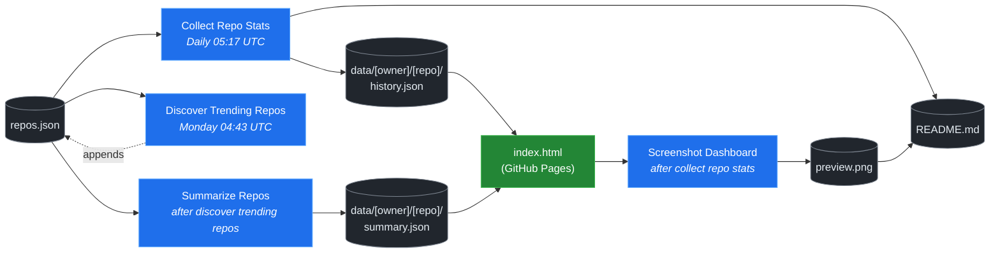

# 🚀 Rising Repos Tracker

> Automatically tracks daily GitHub stats (stars, forks, issues, velocity) for rising open source repos.

[](https://www.telosignal.com/)


**[→ View Live Dashboard](https://patrick-creates.github.io/rising-repos-tracker/)**

Built and maintained by [Telosignal](https://www.telosignal.com/).


<!-- AUTOGEN-STATS-START -->
## 📊 Current snapshot

> Auto-updated daily — last refreshed 2026-10-08

| Metric | Value |
|---|---|
| Repos tracked | **215** |
| Total stars | **10,600,892** |
| Total forks | **1,533,471** |
| Fastest growing | **VoiceStudio** (+1120.8/day) |

### 🔥 Top 5 by velocity

| # | Repo | Stars | Stars/day |
|---|---|---:|---:|
| 1 | [debpalash/VoiceStudio](https://github.com/debpalash/VoiceStudio) | 54,963 | +1120.8 |
| 2 | [DietrichGebert/ponytail](https://github.com/DietrichGebert/ponytail) | 158,120 | +1019.5 |
| 3 | [stablyai/orca](https://github.com/stablyai/orca) | 87,581 | +797.9 |
| 4 | [NousResearch/hermes-agent](https://github.com/NousResearch/hermes-agent) | 252,113 | +703.2 |
| 5 | [diegosouzapw/OmniRoute](https://github.com/diegosouzapw/OmniRoute) | 74,109 | +659.1 |

### 🆕 Recently added

- [tt-a1i/archify](https://github.com/tt-a1i/archify) — added 2026-10-05 — Turn any idea, plan, or codebase into a beautiful interactive diagram. An agent skill for Claude Code, Codex, and more.
- [ruvnet/ruflo](https://github.com/ruvnet/ruflo) — added 2026-10-05 — 🌊 The original agent harness. Deploy intelligent multi-player swarms, coordinate autonomous workflows, and build conversational AI systems. Features adaptive memory, self-learning intelligence, federation, vector RAG integration, and native Claude Code / Codex / Hermes and many more Integrated
- [codewhale-hq/Codewhale](https://github.com/codewhale-hq/Codewhale) — added 2026-10-05 — Open-source coding agent for your terminal, built in Rust and on a journey of continuous community improvement. Issues and PRs welcome.
<!-- AUTOGEN-STATS-END -->

<!-- AUTOGEN-DIAGRAM-START -->
## 🔄 How it works


```mermaid
graph LR
    repos[("repos.json")]:::data
    history[("data/[owner]/[repo]/<br/>history.json")]:::data
    summary[("data/[owner]/[repo]/<br/>summary.json")]:::data
    readme[("README.md")]:::data
    preview[("preview.png")]:::data
    dashboard["index.html<br/>(GitHub Pages)"]:::output
    collect_yml["Collect Repo Stats<br/><i>Daily 05:17 UTC</i>"]:::workflow
    discover_yml["Discover Trending Repos<br/><i>Monday 04:43 UTC</i>"]:::workflow
    screenshot_yml["Screenshot Dashboard<br/><i>after collect repo stats</i>"]:::workflow
    summarize_yml["Summarize Repos<br/><i>after discover trending repos</i>"]:::workflow
    repos --> collect_yml
    collect_yml --> history
    collect_yml --> readme
    repos --> discover_yml
    discover_yml -.->|appends| repos
    dashboard --> screenshot_yml
    screenshot_yml --> preview
    repos --> summarize_yml
    summarize_yml --> summary
    history --> dashboard
    summary --> dashboard
    preview --> readme
    classDef workflow fill:#1f6feb,stroke:#58a6ff,color:#fff
    classDef data fill:#21262d,stroke:#7d8590,color:#e6edf3
    classDef output fill:#238636,stroke:#3fb950,color:#fff
```
<!-- AUTOGEN-DIAGRAM-END -->

<!-- AUTOGEN-WORKFLOWS-START -->
## ⚙️ Workflows

| File | Schedule | Name |
|---|---|---|
| `collect.yml` | Daily 05:17 UTC | Collect Repo Stats |
| `discover.yml` | Monday 04:43 UTC | Discover Trending Repos |
| `screenshot.yml` | After Collect Repo Stats | Screenshot Dashboard |
| `summarize.yml` | After Discover Trending Repos | Summarize Repos |

> All workflows commit results directly back to the repo. Schedules are best-effort — GitHub Actions cron can drift by a few minutes.
<!-- AUTOGEN-WORKFLOWS-END -->

<!-- AUTOGEN-REPOS-START -->
## 📋 All tracked repos

| Repo | Stars | Forks | Stars/day |
|---|---:|---:|---:|
| [openclaw/openclaw](https://github.com/openclaw/openclaw) | 391,633 | 82,293 | +136.2 |
| [obra/superpowers](https://github.com/obra/superpowers) | 296,592 | 26,471 | +565.0 |
| [affaan-m/everything-claude-code](https://github.com/affaan-m/everything-claude-code) | 275,218 | 41,053 | +636.3 |
| [affaan-m/ECC](https://github.com/affaan-m/ECC) | 275,218 | 41,053 | +610.2 |
| [NousResearch/hermes-agent](https://github.com/NousResearch/hermes-agent) | 252,113 | 54,325 | +703.2 |
| [microsoft/markitdown](https://github.com/microsoft/markitdown) | 189,152 | 14,017 | +446.9 |
| [Significant-Gravitas/AutoGPT](https://github.com/Significant-Gravitas/AutoGPT) | 187,699 | 45,937 | +23.1 |
| [f/prompts.chat](https://github.com/f/prompts.chat) | 172,372 | 22,056 | +68.9 |
| [DietrichGebert/ponytail](https://github.com/DietrichGebert/ponytail) | 158,120 | 8,490 | +1019.5 |
| [langgenius/dify](https://github.com/langgenius/dify) | 158,098 | 24,941 | +114.0 |
| [open-webui/open-webui](https://github.com/open-webui/open-webui) | 154,209 | 22,540 | +117.0 |
| [langchain-ai/langchain](https://github.com/langchain-ai/langchain) | 147,577 | 24,734 | +73.9 |
| [farion1231/cc-switch](https://github.com/farion1231/cc-switch) | 141,400 | 9,462 | +471.0 |
| [github/spec-kit](https://github.com/github/spec-kit) | 140,631 | 12,577 | +289.0 |
| [nextlevelbuilder/ui-ux-pro-max-skill](https://github.com/nextlevelbuilder/ui-ux-pro-max-skill) | 133,981 | 14,205 | +379.0 |
| [Graphify-Labs/graphify](https://github.com/Graphify-Labs/graphify) | 124,825 | 12,036 | +385.3 |
| [microsoft/generative-ai-for-beginners](https://github.com/microsoft/generative-ai-for-beginners) | 121,166 | 63,787 | +70.4 |
| [JuliusBrussee/caveman](https://github.com/JuliusBrussee/caveman) | 110,499 | 6,395 | +342.6 |
| [nexu-io/open-design](https://github.com/nexu-io/open-design) | 99,977 | 11,539 | +390.2 |
| [thedotmack/claude-mem](https://github.com/thedotmack/claude-mem) | 98,061 | 8,619 | +153.3 |
| [ruvnet/RuView](https://github.com/ruvnet/RuView) | 96,873 | 12,736 | +227.8 |
| [Panniantong/Agent-Reach](https://github.com/Panniantong/Agent-Reach) | 93,832 | 8,208 | +576.7 |
| [Leonxlnx/taste-skill](https://github.com/Leonxlnx/taste-skill) | 93,678 | 6,360 | +490.4 |
| [vllm-project/vllm](https://github.com/vllm-project/vllm) | 93,383 | 23,125 | +91.2 |
| [OpenHands/OpenHands](https://github.com/OpenHands/OpenHands) | 90,266 | 11,946 | +114.2 |
| [ChatGPTNextWeb/NextChat](https://github.com/ChatGPTNextWeb/NextChat) | 88,835 | 58,911 | +5.6 |
| [koala73/worldmonitor](https://github.com/koala73/worldmonitor) | 88,033 | 13,434 | +235.4 |
| [stablyai/orca](https://github.com/stablyai/orca) | 87,581 | 5,605 | +797.9 |
| [lobehub/lobehub](https://github.com/lobehub/lobehub) | 83,057 | 15,957 | +40.9 |
| [rtk-ai/rtk](https://github.com/rtk-ai/rtk) | 82,683 | 5,253 | +231.5 |
| [datawhalechina/hello-agents](https://github.com/datawhalechina/hello-agents) | 82,015 | 10,180 | +219.3 |
| [tt-a1i/archify](https://github.com/tt-a1i/archify) | 79,627 | 5,339 | +598.0 |
| [dair-ai/Prompt-Engineering-Guide](https://github.com/dair-ai/Prompt-Engineering-Guide) | 78,897 | 8,659 | +29.3 |
| [shareAI-lab/learn-claude-code](https://github.com/shareAI-lab/learn-claude-code) | 78,171 | 12,528 | +119.5 |
| [unslothai/unsloth](https://github.com/unslothai/unsloth) | 77,459 | 7,145 | +90.6 |
| [ComposioHQ/awesome-claude-skills](https://github.com/ComposioHQ/awesome-claude-skills) | 76,699 | 8,986 | +114.1 |
| [openai/openai-cookbook](https://github.com/openai/openai-cookbook) | 76,439 | 12,926 | +19.8 |
| [chopratejas/headroom](https://github.com/chopratejas/headroom) | 74,702 | 5,785 | +404.7 |
| [headroomlabs-ai/headroom](https://github.com/headroomlabs-ai/headroom) | 74,702 | 5,785 | +266.7 |
| [ruvnet/ruflo](https://github.com/ruvnet/ruflo) | 74,113 | 8,807 | +74.0 |
| [diegosouzapw/OmniRoute](https://github.com/diegosouzapw/OmniRoute) | 74,109 | 10,662 | +659.1 |
| [santifer/career-ops](https://github.com/santifer/career-ops) | 73,770 | 13,858 | +199.5 |
| [career-ops-hq/career-ops](https://github.com/career-ops-hq/career-ops) | 73,770 | 13,858 | +109.3 |
| [Fission-AI/OpenSpec](https://github.com/Fission-AI/OpenSpec) | 71,333 | 4,879 | +157.7 |
| [code-yeongyu/oh-my-openagent](https://github.com/code-yeongyu/oh-my-openagent) | 69,892 | 5,742 | +80.9 |
| [asgeirtj/system_prompts_leaks](https://github.com/asgeirtj/system_prompts_leaks) | 69,121 | 11,234 | +201.0 |
| [shanraisshan/claude-code-best-practice](https://github.com/shanraisshan/claude-code-best-practice) | 67,263 | 6,721 | +96.3 |
| [usestrix/strix](https://github.com/usestrix/strix) | 67,211 | 7,376 | +321.7 |
| [xtekky/gpt4free](https://github.com/xtekky/gpt4free) | 66,771 | 13,479 | +3.7 |
| [ZhuLinsen/daily_stock_analysis](https://github.com/ZhuLinsen/daily_stock_analysis) | 66,037 | 55,019 | +200.0 |
| [rohitg00/ai-engineering-from-scratch](https://github.com/rohitg00/ai-engineering-from-scratch) | 65,732 | 11,376 | +305.2 |
| [calesthio/OpenMontage](https://github.com/calesthio/OpenMontage) | 65,268 | 8,279 | +370.5 |
| [mvanhorn/last30days-skill](https://github.com/mvanhorn/last30days-skill) | 63,733 | 5,556 | +254.6 |
| [tw93/Pake](https://github.com/tw93/Pake) | 61,945 | 12,757 | +92.1 |
| [BerriAI/litellm](https://github.com/BerriAI/litellm) | 60,353 | 12,137 | +90.7 |
| [MemPalace/mempalace](https://github.com/MemPalace/mempalace) | 59,463 | 7,563 | +49.4 |
| [heygen-com/hyperframes](https://github.com/heygen-com/hyperframes) | 58,901 | 5,239 | +273.3 |
| [jamiepine/voicebox](https://github.com/jamiepine/voicebox) | 56,632 | 7,058 | +214.0 |
| [FlowiseAI/Flowise](https://github.com/FlowiseAI/Flowise) | 55,493 | 25,066 | +18.1 |
| [hesreallyhim/awesome-claude-code](https://github.com/hesreallyhim/awesome-claude-code) | 55,239 | 4,794 | +77.9 |
| [debpalash/VoiceStudio](https://github.com/debpalash/VoiceStudio) | 54,963 | 6,169 | +1120.8 |
| [blader/humanizer](https://github.com/blader/humanizer) | 54,818 | 4,343 | +230.5 |
| [router-for-me/CLIProxyAPI](https://github.com/router-for-me/CLIProxyAPI) | 54,476 | 8,290 | +145.1 |
| [ggml-org/whisper.cpp](https://github.com/ggml-org/whisper.cpp) | 54,220 | 6,211 | +30.7 |
| [coreyhaines31/marketingskills](https://github.com/coreyhaines31/marketingskills) | 53,675 | 7,981 | +172.4 |
| [ChromeDevTools/chrome-devtools-mcp](https://github.com/ChromeDevTools/chrome-devtools-mcp) | 53,111 | 5,773 | +92.5 |
| [bojieli/ai-agent-book](https://github.com/bojieli/ai-agent-book) | 52,926 | 5,988 | +562.2 |
| [elder-plinius/CL4R1T4S](https://github.com/elder-plinius/CL4R1T4S) | 51,029 | 10,459 | +105.5 |
| [Imbad0202/academic-research-skills](https://github.com/Imbad0202/academic-research-skills) | 50,878 | 3,913 | +153.2 |
| [Aider-AI/aider](https://github.com/Aider-AI/aider) | 49,423 | 5,038 | +31.2 |
| [QuantumNous/new-api](https://github.com/QuantumNous/new-api) | 49,415 | 11,885 | +103.4 |
| [kepano/obsidian-skills](https://github.com/kepano/obsidian-skills) | 49,275 | 3,499 | +119.3 |
| [HKUDS/nanobot](https://github.com/HKUDS/nanobot) | 48,862 | 8,616 | +43.2 |
| [K-Dense-AI/scientific-agent-skills](https://github.com/K-Dense-AI/scientific-agent-skills) | 47,993 | 4,326 | +145.7 |
| [sickn33/antigravity-awesome-skills](https://github.com/sickn33/antigravity-awesome-skills) | 47,354 | 6,894 | +63.8 |
| [sickn33/agentic-awesome-skills](https://github.com/sickn33/agentic-awesome-skills) | 47,354 | 6,894 | +49.6 |
| [zhayujie/CowAgent](https://github.com/zhayujie/CowAgent) | 47,274 | 10,375 | +19.0 |
| [DeusData/codebase-memory-mcp](https://github.com/DeusData/codebase-memory-mcp) | 46,126 | 3,789 | +252.4 |
| [danny-avila/LibreChat](https://github.com/danny-avila/LibreChat) | 45,403 | 9,322 | +58.3 |
| [LibreChat-AI/LibreChat](https://github.com/LibreChat-AI/LibreChat) | 45,403 | 9,322 | +37.9 |
| [MadsLorentzen/ai-job-search](https://github.com/MadsLorentzen/ai-job-search) | 45,264 | 15,722 | +272.2 |
| [alibaba/open-code-review](https://github.com/alibaba/open-code-review) | 44,474 | 3,211 | +366.9 |
| [chatanywhere/GPT_API_free](https://github.com/chatanywhere/GPT_API_free) | 43,793 | 2,740 | +41.4 |
| [ogulcancelik/herdr](https://github.com/ogulcancelik/herdr) | 42,895 | 3,357 | +324.4 |
| [herdrdev/herdr](https://github.com/herdrdev/herdr) | 42,895 | 3,357 | +289.5 |
| [langchain-ai/langgraph](https://github.com/langchain-ai/langgraph) | 42,887 | 7,295 | +69.1 |
| [chatboxai/chatbox](https://github.com/chatboxai/chatbox) | 41,973 | 4,270 | +13.8 |
| [tinyhumansai/openhuman](https://github.com/tinyhumansai/openhuman) | 41,663 | 4,099 | +70.1 |
| [AstrBotDevs/AstrBot](https://github.com/AstrBotDevs/AstrBot) | 41,552 | 3,026 | +61.7 |
| [Hmbown/CodeWhale](https://github.com/Hmbown/CodeWhale) | 41,083 | 3,569 | +47.2 |
| [Hmbown/Codewhale](https://github.com/Hmbown/Codewhale) | 41,083 | 3,569 | +5.4 |
| [codewhale-hq/Codewhale](https://github.com/codewhale-hq/Codewhale) | 41,083 | 3,569 | +11.7 |
| [wshobson/agents](https://github.com/wshobson/agents) | 40,296 | 4,289 | +32.1 |
| [github/awesome-copilot](https://github.com/github/awesome-copilot) | 39,802 | 5,078 | +44.1 |
| [mindsdb/mindshub](https://github.com/mindsdb/mindshub) | 39,786 | 6,242 | +4.4 |
| [Yeachan-Heo/oh-my-claudecode](https://github.com/Yeachan-Heo/oh-my-claudecode) | 39,679 | 3,551 | +35.7 |
| [volcengine/OpenViking](https://github.com/volcengine/OpenViking) | 39,411 | 3,110 | +115.4 |
| [google/langextract](https://github.com/google/langextract) | 38,930 | 2,719 | +17.5 |
| [AlexsJones/llmfit](https://github.com/AlexsJones/llmfit) | 37,706 | 2,420 | +83.0 |
| [anthropics/claude-plugins-official](https://github.com/anthropics/claude-plugins-official) | 37,530 | 4,224 | +66.0 |
| [PDFMathTranslate/PDFMathTranslate](https://github.com/PDFMathTranslate/PDFMathTranslate) | 37,391 | 3,341 | +24.8 |
| [songquanpeng/one-api](https://github.com/songquanpeng/one-api) | 37,094 | 6,871 | +21.2 |
| [JCodesMore/ai-website-cloner-template](https://github.com/JCodesMore/ai-website-cloner-template) | 36,240 | 5,304 | +167.4 |
| [esengine/DeepSeek-Reasonix](https://github.com/esengine/DeepSeek-Reasonix) | 35,748 | 2,439 | +133.0 |
| [agentscope-ai/QwenPaw](https://github.com/agentscope-ai/QwenPaw) | 35,502 | 3,155 | +154.1 |
| [HKUDS/Vibe-Trading](https://github.com/HKUDS/Vibe-Trading) | 34,989 | 5,672 | +200.5 |
| [can1357/oh-my-pi](https://github.com/can1357/oh-my-pi) | 34,620 | 3,762 | +191.0 |
| [virgiliojr94/book-to-skill](https://github.com/virgiliojr94/book-to-skill) | 34,164 | 3,589 | +207.4 |
| [p-e-w/heretic](https://github.com/p-e-w/heretic) | 33,992 | 3,791 | +82.1 |
| [mukul975/Anthropic-Cybersecurity-Skills](https://github.com/mukul975/Anthropic-Cybersecurity-Skills) | 33,946 | 4,120 | +146.5 |
| [Gitlawb/openclaude](https://github.com/Gitlawb/openclaude) | 33,683 | 9,107 | +43.0 |
| [Twigpine/openclaude](https://github.com/Twigpine/openclaude) | 33,683 | 9,107 | +12.7 |
| [iOfficeAI/AionUi](https://github.com/iOfficeAI/AionUi) | 33,382 | 3,467 | +46.8 |
| [zeroclaw-labs/zeroclaw](https://github.com/zeroclaw-labs/zeroclaw) | 32,941 | 4,957 | +9.8 |
| [Tencent/WeKnora](https://github.com/Tencent/WeKnora) | 32,567 | 4,339 | +141.5 |
| [tirth8205/code-review-graph](https://github.com/tirth8205/code-review-graph) | 31,972 | 2,928 | +117.0 |
| [iOfficeAI/OfficeCLI](https://github.com/iOfficeAI/OfficeCLI) | 31,704 | 2,158 | +247.9 |
| [googleworkspace/cli](https://github.com/googleworkspace/cli) | 31,275 | 1,859 | +35.3 |
| [decolua/9router](https://github.com/decolua/9router) | 30,454 | 5,797 | +112.0 |
| [langchain-ai/deepagents](https://github.com/langchain-ai/deepagents) | 30,023 | 4,215 | +48.1 |
| [jackwener/OpenCLI](https://github.com/jackwener/OpenCLI) | 29,931 | 2,921 | +50.3 |
| [alibaba/page-agent](https://github.com/alibaba/page-agent) | 29,359 | 2,639 | +93.9 |
| [rohitg00/agentmemory](https://github.com/rohitg00/agentmemory) | 29,238 | 2,557 | +60.8 |
| [voideditor/void](https://github.com/voideditor/void) | 28,772 | 2,657 | — |
| [jarrodwatts/claude-hud](https://github.com/jarrodwatts/claude-hud) | 28,397 | 1,312 | +30.4 |
| [BloopAI/vibe-kanban](https://github.com/BloopAI/vibe-kanban) | 28,289 | 3,034 | +12.2 |
| [manaflow-ai/cmux](https://github.com/manaflow-ai/cmux) | 27,999 | 2,467 | +41.9 |
| [TencentCloud/TencentDB-Agent-Memory](https://github.com/TencentCloud/TencentDB-Agent-Memory) | 27,811 | 2,696 | +219.5 |
| [zai-org/Open-AutoGLM](https://github.com/zai-org/Open-AutoGLM) | 26,356 | 4,048 | +7.3 |
| [mksglu/context-mode](https://github.com/mksglu/context-mode) | 25,677 | 1,852 | +71.4 |
| [toon-format/toon](https://github.com/toon-format/toon) | 25,472 | 1,124 | +8.0 |
| [t8y2/dbx](https://github.com/t8y2/dbx) | 25,180 | 2,282 | +182.8 |
| [pascalorg/editor](https://github.com/pascalorg/editor) | 24,729 | 3,059 | +59.0 |
| [guillaumemeyer/watermarks-remover](https://github.com/guillaumemeyer/watermarks-remover) | 23,576 | 2,703 | +133.9 |
| [every-app/open-seo](https://github.com/every-app/open-seo) | 22,714 | 2,949 | +169.1 |
| [jundot/omlx](https://github.com/jundot/omlx) | 22,630 | 1,985 | +52.2 |
| [pranshuparmar/witr](https://github.com/pranshuparmar/witr) | 22,627 | 789 | +45.5 |
| [ifixai-ai/iFixAi](https://github.com/ifixai-ai/iFixAi) | 22,536 | 1,424 | +243.4 |
| [winfunc/opcode](https://github.com/winfunc/opcode) | 22,421 | 1,711 | +3.4 |
| [steipete/CodexBar](https://github.com/steipete/CodexBar) | 22,312 | 2,079 | +65.8 |
| [coze-dev/coze-studio](https://github.com/coze-dev/coze-studio) | 21,695 | 3,129 | +6.1 |
| [NirDiamant/agents-towards-production](https://github.com/NirDiamant/agents-towards-production) | 21,535 | 2,856 | +7.4 |
| [KKKKhazix/khazix-skills](https://github.com/KKKKhazix/khazix-skills) | 21,250 | 2,245 | +47.4 |
| [jnMetaCode/agency-agents-zh](https://github.com/jnMetaCode/agency-agents-zh) | 21,121 | 3,394 | +52.9 |
| [1jehuang/jcode](https://github.com/1jehuang/jcode) | 20,351 | 2,366 | +138.5 |
| [hypit-ai/hypit](https://github.com/hypit-ai/hypit) | 20,299 | 2,230 | +320.0 |
| [tanweai/pua](https://github.com/tanweai/pua) | 19,709 | 1,203 | +12.7 |
| [NVIDIA/SkillSpector](https://github.com/NVIDIA/SkillSpector) | 19,681 | 1,720 | +105.9 |
| [datawhalechina/easy-vibe](https://github.com/datawhalechina/easy-vibe) | 19,646 | 1,875 | +23.5 |
| [walkinglabs/learn-harness-engineering](https://github.com/walkinglabs/learn-harness-engineering) | 19,510 | 2,130 | +102.4 |
| [danielmiessler/LifeOS](https://github.com/danielmiessler/LifeOS) | 19,354 | 2,488 | +30.4 |
| [nesquena/hermes-webui](https://github.com/nesquena/hermes-webui) | 18,807 | 2,689 | +36.8 |
| [jlcodes99/cockpit-tools](https://github.com/jlcodes99/cockpit-tools) | 18,722 | 1,665 | +55.1 |
| [microsoft/agent-lightning](https://github.com/microsoft/agent-lightning) | 18,591 | 1,657 | +11.1 |
| [AgriciDaniel/claude-seo](https://github.com/AgriciDaniel/claude-seo) | 18,514 | 2,712 | +67.9 |
| [browser-use/browser-harness](https://github.com/browser-use/browser-harness) | 18,350 | 1,795 | +28.4 |
| [RightNow-AI/openfang](https://github.com/RightNow-AI/openfang) | 18,214 | 2,291 | +3.4 |
| [rocketride-org/rocketride-server](https://github.com/rocketride-org/rocketride-server) | 17,828 | 7,613 | — |
| [tradecatlabs/vibe-coding-cn](https://github.com/tradecatlabs/vibe-coding-cn) | 17,265 | 1,746 | +48.8 |
| [wanshuiyin/Auto-claude-code-research-in-sleep](https://github.com/wanshuiyin/Auto-claude-code-research-in-sleep) | 17,127 | 1,440 | +43.1 |
| [MemoriLabs/Memori](https://github.com/MemoriLabs/Memori) | 17,102 | 3,680 | +16.3 |
| [cft0808/edict](https://github.com/cft0808/edict) | 16,976 | 1,766 | +7.9 |
| [composio-community/awesome-codex-skills](https://github.com/composio-community/awesome-codex-skills) | 16,805 | 1,652 | +18.8 |
| [xbtlin/ai-berkshire](https://github.com/xbtlin/ai-berkshire) | 16,658 | 2,474 | +62.6 |
| [xpzouying/xiaohongshu-mcp](https://github.com/xpzouying/xiaohongshu-mcp) | 16,145 | 2,374 | +17.2 |
| [Anionex/banana-slides](https://github.com/Anionex/banana-slides) | 15,711 | 1,786 | +5.2 |
| [yusufkaraaslan/Skill_Seekers](https://github.com/yusufkaraaslan/Skill_Seekers) | 15,115 | 1,539 | +8.2 |
| [superset-sh/superset](https://github.com/superset-sh/superset) | 14,988 | 1,334 | +28.0 |
| [NanmiCoder/cc-haha](https://github.com/NanmiCoder/cc-haha) | 14,911 | 8,599 | +15.7 |
| [kyegomez/OpenMythos](https://github.com/kyegomez/OpenMythos) | 14,909 | 3,280 | +7.0 |
| [NevaMind-AI/memU](https://github.com/NevaMind-AI/memU) | 14,516 | 1,085 | +5.7 |
| [XiaomiMiMo/MiMo-Code](https://github.com/XiaomiMiMo/MiMo-Code) | 13,613 | 1,424 | +25.6 |
| [EverMind-AI/EverOS](https://github.com/EverMind-AI/EverOS) | 13,364 | 926 | +36.1 |
| [sirmalloc/ccstatusline](https://github.com/sirmalloc/ccstatusline) | 13,222 | 587 | +19.2 |
| [ConardLi/garden-skills](https://github.com/ConardLi/garden-skills) | 12,772 | 1,534 | +38.2 |
| [brokermr810/QuantDinger](https://github.com/brokermr810/QuantDinger) | 12,554 | 2,545 | +34.8 |
| [OpenByteInc/QuantDinger](https://github.com/OpenByteInc/QuantDinger) | 12,554 | 2,545 | +34.4 |
| [0x4m4/hexstrike-ai](https://github.com/0x4m4/hexstrike-ai) | 12,524 | 2,545 | +24.9 |
| [dataelement/dsh-desktop](https://github.com/dataelement/dsh-desktop) | 12,347 | 458 | +255.5 |
| [MemTensor/MemOS](https://github.com/MemTensor/MemOS) | 11,759 | 1,068 | +17.1 |
| [holaboss-ai/holaOS](https://github.com/holaboss-ai/holaOS) | 11,453 | 728 | +59.3 |
| [getagentseal/codeburn](https://github.com/getagentseal/codeburn) | 11,355 | 878 | +30.7 |
| [EKKOLearnAI/hermes-studio](https://github.com/EKKOLearnAI/hermes-studio) | 11,333 | 1,386 | +26.3 |
| [EKKOLearnAI/ekko-studio](https://github.com/EKKOLearnAI/ekko-studio) | 11,333 | 1,386 | +10.9 |
| [aden-hive/hive](https://github.com/aden-hive/hive) | 11,087 | 5,649 | +4.7 |
| [openai/codex-security](https://github.com/openai/codex-security) | 11,020 | 853 | +41.5 |
| [ValueCell-ai/valuecell](https://github.com/ValueCell-ai/valuecell) | 11,015 | 1,800 | +1.4 |
| [Kuberwastaken/claurst](https://github.com/Kuberwastaken/claurst) | 10,317 | 7,706 | +4.5 |
| [StarTrail-org/PixelRAG](https://github.com/StarTrail-org/PixelRAG) | 10,216 | 890 | +41.7 |
| [ykdojo/claude-code-tips](https://github.com/ykdojo/claude-code-tips) | 10,203 | 827 | +12.6 |
| [Companion-Inc/feynman](https://github.com/Companion-Inc/feynman) | 9,909 | 1,096 | +9.7 |
| [trailhq/Graft](https://github.com/trailhq/Graft) | 9,770 | 882 | +90.9 |
| [frankbria/ralph-claude-code](https://github.com/frankbria/ralph-claude-code) | 9,669 | 725 | +3.8 |
| [modem-dev/hunk](https://github.com/modem-dev/hunk) | 9,536 | 310 | +32.5 |
| [Nasiko-Labs/nasiko](https://github.com/Nasiko-Labs/nasiko) | 9,519 | 2,066 | +51.1 |
| [EvoMap/evolver](https://github.com/EvoMap/evolver) | 9,138 | 848 | +3.0 |
| [1weiho/open-slide](https://github.com/1weiho/open-slide) | 9,081 | 651 | +50.2 |
| [open-slide/open-slide](https://github.com/open-slide/open-slide) | 9,081 | 651 | +80.0 |
| [genspark-ai/genoffice](https://github.com/genspark-ai/genoffice) | 8,930 | 1,141 | +90.6 |
| [iflytek/astron-agent](https://github.com/iflytek/astron-agent) | 8,881 | 891 | +2.9 |
| [MiroMindAI/MiroThinker](https://github.com/MiroMindAI/MiroThinker) | 8,420 | 645 | +1.0 |
| [Tencent/BrowserSkill](https://github.com/Tencent/BrowserSkill) | 8,417 | 598 | +75.7 |
| [mmulet/term.everything](https://github.com/mmulet/term.everything) | 8,110 | 196 | +0.9 |
| [rorkai/App-Store-Connect-CLI](https://github.com/rorkai/App-Store-Connect-CLI) | 7,693 | 650 | +25.6 |
| [ValueCell-ai/ClawX](https://github.com/ValueCell-ai/ClawX) | 7,612 | 1,138 | +0.8 |
| [WenyuChiou/awesome-agentic-ai-zh](https://github.com/WenyuChiou/awesome-agentic-ai-zh) | 7,425 | 992 | +23.0 |
| [opensquilla/opensquilla](https://github.com/opensquilla/opensquilla) | 7,090 | 578 | +11.0 |
| [TokenRhythm/opensquilla](https://github.com/TokenRhythm/opensquilla) | 7,090 | 578 | +3.9 |
| [tech-leads-club/agent-skills](https://github.com/tech-leads-club/agent-skills) | 7,041 | 559 | +27.6 |
| [Andyyyy64/whichllm](https://github.com/Andyyyy64/whichllm) | 6,729 | 372 | +10.8 |
| [steipete/summarize](https://github.com/steipete/summarize) | 6,687 | 449 | +3.2 |
| [Arthur-Ficial/apfel](https://github.com/Arthur-Ficial/apfel) | 6,453 | 246 | +3.9 |
| [microsoft/fara](https://github.com/microsoft/fara) | 6,215 | 606 | +2.5 |
| [UfoMiao/zcf](https://github.com/UfoMiao/zcf) | 6,080 | 422 | +0.1 |
| [re4/LibreCode](https://github.com/re4/LibreCode) | 89 | 5 | — |
<!-- AUTOGEN-REPOS-END -->

---

## What it does

- Collects daily snapshots of stars, forks, watchers and open issues for every tracked repo
- Discovers new trending repos automatically every Monday using the GitHub Search API
- Generates AI summaries (use cases, similar tools, tags) for each tracked repo via GitHub Models
- Stores all history as plain JSON — no database, no backend
- Renders a live dashboard via GitHub Pages — updates daily, zero maintenance

## Tracked repos

Data lives in [`data/`](./data) — one folder per repo, one `history.json` per entry.  
The full watch list is in [`repos.json`](./repos.json).

## Fork & use it for yourself

This is my personal tracker — the watch list reflects what I find interesting. If you want to track different repos, the best path is to **fork this repo and run your own**.

### Setup

1. Fork this repo to your account
2. Replace the contents of [`repos.json`](./repos.json) with the repos you want to track (or just leave one entry — `discover.yml` will auto-add more every Monday)
3. Go to **Settings → Pages** and enable GitHub Pages from the `main` branch
4. Go to **Actions** and run **Collect Repo Stats** once manually to seed your first data point
5. Your dashboard will be live at `https://YOUR-USERNAME.github.io/rising-repos-tracker/`

That's it — daily collection and weekly discovery run automatically on schedule. Zero ongoing maintenance.

### Customizing what gets discovered

Edit [`scripts/discover.js`](./scripts/discover.js) to change:

- `MIN_STARS` — minimum star threshold for candidates
- `MAX_AGE_DAYS` — how recent a repo must be
- `MAX_NEW_REPOS` — how many to add per discovery run
- The `queries` array — GitHub Search API queries that define what "trending" means to you

### Adding a repo manually

Just edit `repos.json` directly:

```json
{
  "owner": "OWNER",
  "repo": "REPO",
  "added": "YYYY-MM-DD",
  "notes": "why you're tracking this"
}
```

The next daily collect run picks it up automatically.

## Stack

- **GitHub Actions** — scheduling and automation
- **GitHub Pages** — dashboard hosting
- **GitHub API** — data source
- **GitHub Models** — free AI summaries (gpt-4o-mini)
- **Chart.js** — star growth visualization
- **Mermaid** — architecture diagram (rendered by GitHub)
- No dependencies, no build step, no database

## License

MIT
