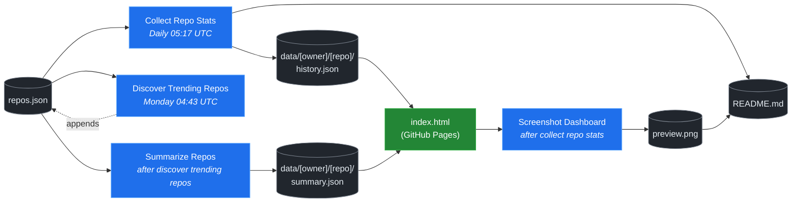

# 🚀 Rising Repos Tracker

> Automatically tracks daily GitHub stats (stars, forks, issues, velocity) for rising open source repos.

[](https://www.telosignal.com/)


**[→ View Live Dashboard](https://patrick-creates.github.io/rising-repos-tracker/)**

Built and maintained by [Telosignal](https://www.telosignal.com/).


<!-- AUTOGEN-STATS-START -->
## 📊 Current snapshot

> Auto-updated daily — last refreshed 2026-10-06

| Metric | Value |
|---|---|
| Repos tracked | **215** |
| Total stars | **10,562,323** |
| Total forks | **1,529,217** |
| Fastest growing | **VoiceStudio** (+1166.9/day) |

### 🔥 Top 5 by velocity

| # | Repo | Stars | Stars/day |
|---|---|---:|---:|
| 1 | [debpalash/VoiceStudio](https://github.com/debpalash/VoiceStudio) | 54,059 | +1166.9 |
| 2 | [DietrichGebert/ponytail](https://github.com/DietrichGebert/ponytail) | 156,395 | +1022.4 |
| 3 | [stablyai/orca](https://github.com/stablyai/orca) | 86,210 | +800.3 |
| 4 | [NousResearch/hermes-agent](https://github.com/NousResearch/hermes-agent) | 251,563 | +709.0 |
| 5 | [diegosouzapw/OmniRoute](https://github.com/diegosouzapw/OmniRoute) | 73,482 | +666.6 |

### 🆕 Recently added

- [tt-a1i/archify](https://github.com/tt-a1i/archify) — added 2026-10-05 — Turn any idea, plan, or codebase into a beautiful interactive diagram. An agent skill for Claude Code, Codex, and more.
- [ruvnet/ruflo](https://github.com/ruvnet/ruflo) — added 2026-10-05 — 🌊 The original agent harness. Deploy intelligent multi-player swarms, coordinate autonomous workflows, and build conversational AI systems. Features adaptive memory, self-learning intelligence, federation, vector RAG integration, and native Claude Code / Codex / Hermes and many more Integrated
- [codewhale-hq/Codewhale](https://github.com/codewhale-hq/Codewhale) — added 2026-10-05 — Open-source coding agent for your terminal, built in Rust and on a journey of continuous community improvement. Issues and PRs welcome.
<!-- AUTOGEN-STATS-END -->

<!-- AUTOGEN-DIAGRAM-START -->
## 🔄 How it works


```mermaid
graph LR
    repos[("repos.json")]:::data
    history[("data/[owner]/[repo]/<br/>history.json")]:::data
    summary[("data/[owner]/[repo]/<br/>summary.json")]:::data
    readme[("README.md")]:::data
    preview[("preview.png")]:::data
    dashboard["index.html<br/>(GitHub Pages)"]:::output
    collect_yml["Collect Repo Stats<br/><i>Daily 05:17 UTC</i>"]:::workflow
    discover_yml["Discover Trending Repos<br/><i>Monday 04:43 UTC</i>"]:::workflow
    screenshot_yml["Screenshot Dashboard<br/><i>after collect repo stats</i>"]:::workflow
    summarize_yml["Summarize Repos<br/><i>after discover trending repos</i>"]:::workflow
    repos --> collect_yml
    collect_yml --> history
    collect_yml --> readme
    repos --> discover_yml
    discover_yml -.->|appends| repos
    dashboard --> screenshot_yml
    screenshot_yml --> preview
    repos --> summarize_yml
    summarize_yml --> summary
    history --> dashboard
    summary --> dashboard
    preview --> readme
    classDef workflow fill:#1f6feb,stroke:#58a6ff,color:#fff
    classDef data fill:#21262d,stroke:#7d8590,color:#e6edf3
    classDef output fill:#238636,stroke:#3fb950,color:#fff
```
<!-- AUTOGEN-DIAGRAM-END -->

<!-- AUTOGEN-WORKFLOWS-START -->
## ⚙️ Workflows

| File | Schedule | Name |
|---|---|---|
| `collect.yml` | Daily 05:17 UTC | Collect Repo Stats |
| `discover.yml` | Monday 04:43 UTC | Discover Trending Repos |
| `screenshot.yml` | After Collect Repo Stats | Screenshot Dashboard |
| `summarize.yml` | After Discover Trending Repos | Summarize Repos |

> All workflows commit results directly back to the repo. Schedules are best-effort — GitHub Actions cron can drift by a few minutes.
<!-- AUTOGEN-WORKFLOWS-END -->

<!-- AUTOGEN-REPOS-START -->
## 📋 All tracked repos

| Repo | Stars | Forks | Stars/day |
|---|---:|---:|---:|
| [openclaw/openclaw](https://github.com/openclaw/openclaw) | 391,485 | 82,299 | +137.1 |
| [obra/superpowers](https://github.com/obra/superpowers) | 295,821 | 26,415 | +568.3 |
| [affaan-m/everything-claude-code](https://github.com/affaan-m/everything-claude-code) | 273,952 | 40,879 | +636.3 |
| [affaan-m/ECC](https://github.com/affaan-m/ECC) | 273,952 | 40,879 | +609.9 |
| [NousResearch/hermes-agent](https://github.com/NousResearch/hermes-agent) | 251,563 | 54,052 | +709.0 |
| [microsoft/markitdown](https://github.com/microsoft/markitdown) | 188,784 | 13,982 | +450.5 |
| [Significant-Gravitas/AutoGPT](https://github.com/Significant-Gravitas/AutoGPT) | 187,673 | 45,946 | +23.2 |
| [f/prompts.chat](https://github.com/f/prompts.chat) | 172,135 | 22,038 | +68.2 |
| [langgenius/dify](https://github.com/langgenius/dify) | 157,946 | 24,923 | +114.5 |
| [DietrichGebert/ponytail](https://github.com/DietrichGebert/ponytail) | 156,395 | 8,400 | +1022.4 |
| [open-webui/open-webui](https://github.com/open-webui/open-webui) | 154,069 | 22,514 | +117.7 |
| [langchain-ai/langchain](https://github.com/langchain-ai/langchain) | 147,494 | 24,718 | +74.4 |
| [farion1231/cc-switch](https://github.com/farion1231/cc-switch) | 140,415 | 9,428 | +470.7 |
| [github/spec-kit](https://github.com/github/spec-kit) | 140,337 | 12,554 | +290.9 |
| [nextlevelbuilder/ui-ux-pro-max-skill](https://github.com/nextlevelbuilder/ui-ux-pro-max-skill) | 133,479 | 14,145 | +380.7 |
| [Graphify-Labs/graphify](https://github.com/Graphify-Labs/graphify) | 124,201 | 11,981 | +387.4 |
| [microsoft/generative-ai-for-beginners](https://github.com/microsoft/generative-ai-for-beginners) | 121,070 | 63,713 | +70.7 |
| [JuliusBrussee/caveman](https://github.com/JuliusBrussee/caveman) | 110,099 | 6,374 | +344.6 |
| [nexu-io/open-design](https://github.com/nexu-io/open-design) | 99,644 | 11,510 | +393.4 |
| [thedotmack/claude-mem](https://github.com/thedotmack/claude-mem) | 96,874 | 8,542 | +147.2 |
| [ruvnet/RuView](https://github.com/ruvnet/RuView) | 96,657 | 12,716 | +229.6 |
| [vllm-project/vllm](https://github.com/vllm-project/vllm) | 93,261 | 23,037 | +91.6 |
| [Leonxlnx/taste-skill](https://github.com/Leonxlnx/taste-skill) | 92,989 | 6,307 | +492.7 |
| [Panniantong/Agent-Reach](https://github.com/Panniantong/Agent-Reach) | 92,348 | 8,098 | +573.9 |
| [OpenHands/OpenHands](https://github.com/OpenHands/OpenHands) | 90,089 | 11,921 | +114.6 |
| [ChatGPTNextWeb/NextChat](https://github.com/ChatGPTNextWeb/NextChat) | 88,836 | 58,924 | +5.7 |
| [koala73/worldmonitor](https://github.com/koala73/worldmonitor) | 87,877 | 13,398 | +237.7 |
| [stablyai/orca](https://github.com/stablyai/orca) | 86,210 | 5,533 | +800.3 |
| [lobehub/lobehub](https://github.com/lobehub/lobehub) | 83,015 | 15,957 | +41.2 |
| [rtk-ai/rtk](https://github.com/rtk-ai/rtk) | 82,500 | 5,250 | +233.5 |
| [datawhalechina/hello-agents](https://github.com/datawhalechina/hello-agents) | 81,780 | 10,153 | +220.7 |
| [dair-ai/Prompt-Engineering-Guide](https://github.com/dair-ai/Prompt-Engineering-Guide) | 78,850 | 8,657 | +29.4 |
| [tt-a1i/archify](https://github.com/tt-a1i/archify) | 78,428 | 5,271 | +595.0 |
| [shareAI-lab/learn-claude-code](https://github.com/shareAI-lab/learn-claude-code) | 78,061 | 12,518 | +120.5 |
| [unslothai/unsloth](https://github.com/unslothai/unsloth) | 77,259 | 7,118 | +90.5 |
| [ComposioHQ/awesome-claude-skills](https://github.com/ComposioHQ/awesome-claude-skills) | 76,579 | 8,966 | +114.8 |
| [openai/openai-cookbook](https://github.com/openai/openai-cookbook) | 76,364 | 12,916 | +19.5 |
| [chopratejas/headroom](https://github.com/chopratejas/headroom) | 74,480 | 5,765 | +409.9 |
| [headroomlabs-ai/headroom](https://github.com/headroomlabs-ai/headroom) | 74,480 | 5,765 | +269.6 |
| [ruvnet/ruflo](https://github.com/ruvnet/ruflo) | 73,973 | 8,797 | +82.0 |
| [santifer/career-ops](https://github.com/santifer/career-ops) | 73,601 | 13,825 | +201.1 |
| [career-ops-hq/career-ops](https://github.com/career-ops-hq/career-ops) | 73,601 | 13,825 | +111.0 |
| [diegosouzapw/OmniRoute](https://github.com/diegosouzapw/OmniRoute) | 73,482 | 10,547 | +666.6 |
| [Fission-AI/OpenSpec](https://github.com/Fission-AI/OpenSpec) | 71,133 | 4,874 | +158.5 |
| [code-yeongyu/oh-my-openagent](https://github.com/code-yeongyu/oh-my-openagent) | 69,843 | 5,743 | +81.7 |
| [asgeirtj/system_prompts_leaks](https://github.com/asgeirtj/system_prompts_leaks) | 69,003 | 11,209 | +203.0 |
| [shanraisshan/claude-code-best-practice](https://github.com/shanraisshan/claude-code-best-practice) | 67,171 | 6,712 | +97.0 |
| [usestrix/strix](https://github.com/usestrix/strix) | 66,786 | 7,323 | +323.4 |
| [xtekky/gpt4free](https://github.com/xtekky/gpt4free) | 66,757 | 13,480 | +3.7 |
| [ZhuLinsen/daily_stock_analysis](https://github.com/ZhuLinsen/daily_stock_analysis) | 65,952 | 54,994 | +202.3 |
| [rohitg00/ai-engineering-from-scratch](https://github.com/rohitg00/ai-engineering-from-scratch) | 65,045 | 11,204 | +304.6 |
| [calesthio/OpenMontage](https://github.com/calesthio/OpenMontage) | 64,470 | 8,163 | +369.9 |
| [mvanhorn/last30days-skill](https://github.com/mvanhorn/last30days-skill) | 63,606 | 5,537 | +257.8 |
| [tw93/Pake](https://github.com/tw93/Pake) | 61,925 | 12,747 | +93.2 |
| [BerriAI/litellm](https://github.com/BerriAI/litellm) | 60,217 | 12,057 | +91.0 |
| [MemPalace/mempalace](https://github.com/MemPalace/mempalace) | 59,428 | 7,561 | +49.8 |
| [heygen-com/hyperframes](https://github.com/heygen-com/hyperframes) | 57,604 | 5,149 | +267.0 |
| [jamiepine/voicebox](https://github.com/jamiepine/voicebox) | 56,483 | 7,038 | +216.2 |
| [FlowiseAI/Flowise](https://github.com/FlowiseAI/Flowise) | 55,488 | 25,063 | +18.4 |
| [hesreallyhim/awesome-claude-code](https://github.com/hesreallyhim/awesome-claude-code) | 55,145 | 4,790 | +78.4 |
| [router-for-me/CLIProxyAPI](https://github.com/router-for-me/CLIProxyAPI) | 54,292 | 8,256 | +145.9 |
| [blader/humanizer](https://github.com/blader/humanizer) | 54,292 | 4,307 | +222.4 |
| [ggml-org/whisper.cpp](https://github.com/ggml-org/whisper.cpp) | 54,167 | 6,206 | +30.8 |
| [debpalash/VoiceStudio](https://github.com/debpalash/VoiceStudio) | 54,059 | 6,045 | +1166.9 |
| [coreyhaines31/marketingskills](https://github.com/coreyhaines31/marketingskills) | 53,422 | 7,946 | +173.1 |
| [ChromeDevTools/chrome-devtools-mcp](https://github.com/ChromeDevTools/chrome-devtools-mcp) | 53,023 | 5,722 | +93.2 |
| [bojieli/ai-agent-book](https://github.com/bojieli/ai-agent-book) | 52,551 | 5,929 | +571.8 |
| [elder-plinius/CL4R1T4S](https://github.com/elder-plinius/CL4R1T4S) | 50,982 | 10,448 | +107.0 |
| [Imbad0202/academic-research-skills](https://github.com/Imbad0202/academic-research-skills) | 50,628 | 3,904 | +154.0 |
| [Aider-AI/aider](https://github.com/Aider-AI/aider) | 49,392 | 5,033 | +31.4 |
| [QuantumNous/new-api](https://github.com/QuantumNous/new-api) | 49,313 | 11,857 | +104.1 |
| [kepano/obsidian-skills](https://github.com/kepano/obsidian-skills) | 49,200 | 3,493 | +120.6 |
| [HKUDS/nanobot](https://github.com/HKUDS/nanobot) | 48,819 | 8,610 | +43.5 |
| [K-Dense-AI/scientific-agent-skills](https://github.com/K-Dense-AI/scientific-agent-skills) | 47,750 | 4,313 | +147.4 |
| [sickn33/antigravity-awesome-skills](https://github.com/sickn33/antigravity-awesome-skills) | 47,292 | 6,886 | +64.3 |
| [sickn33/agentic-awesome-skills](https://github.com/sickn33/agentic-awesome-skills) | 47,292 | 6,886 | +50.0 |
| [zhayujie/CowAgent](https://github.com/zhayujie/CowAgent) | 47,244 | 10,374 | +19.1 |
| [DeusData/codebase-memory-mcp](https://github.com/DeusData/codebase-memory-mcp) | 45,871 | 3,773 | +255.0 |
| [danny-avila/LibreChat](https://github.com/danny-avila/LibreChat) | 45,331 | 9,296 | +58.7 |
| [LibreChat-AI/LibreChat](https://github.com/LibreChat-AI/LibreChat) | 45,331 | 9,296 | +38.4 |
| [MadsLorentzen/ai-job-search](https://github.com/MadsLorentzen/ai-job-search) | 45,086 | 15,640 | +276.5 |
| [alibaba/open-code-review](https://github.com/alibaba/open-code-review) | 43,957 | 3,169 | +369.2 |
| [chatanywhere/GPT_API_free](https://github.com/chatanywhere/GPT_API_free) | 43,691 | 2,737 | +41.3 |
| [langchain-ai/langgraph](https://github.com/langchain-ai/langgraph) | 42,771 | 7,270 | +69.3 |
| [ogulcancelik/herdr](https://github.com/ogulcancelik/herdr) | 42,579 | 3,323 | +328.1 |
| [herdrdev/herdr](https://github.com/herdrdev/herdr) | 42,579 | 3,323 | +293.6 |
| [chatboxai/chatbox](https://github.com/chatboxai/chatbox) | 41,952 | 4,268 | +13.9 |
| [AstrBotDevs/AstrBot](https://github.com/AstrBotDevs/AstrBot) | 41,475 | 3,023 | +62.1 |
| [tinyhumansai/openhuman](https://github.com/tinyhumansai/openhuman) | 41,087 | 4,050 | +55.1 |
| [Hmbown/CodeWhale](https://github.com/Hmbown/CodeWhale) | 41,058 | 3,571 | +47.7 |
| [Hmbown/Codewhale](https://github.com/Hmbown/Codewhale) | 41,058 | 3,571 | +4.9 |
| [codewhale-hq/Codewhale](https://github.com/codewhale-hq/Codewhale) | 41,058 | 3,571 | +10.0 |
| [wshobson/agents](https://github.com/wshobson/agents) | 40,235 | 4,286 | +32.1 |
| [mindsdb/mindshub](https://github.com/mindsdb/mindshub) | 39,782 | 6,243 | +4.5 |
| [github/awesome-copilot](https://github.com/github/awesome-copilot) | 39,732 | 5,065 | +44.2 |
| [Yeachan-Heo/oh-my-claudecode](https://github.com/Yeachan-Heo/oh-my-claudecode) | 39,612 | 3,542 | +35.7 |
| [volcengine/OpenViking](https://github.com/volcengine/OpenViking) | 39,293 | 3,096 | +116.4 |
| [google/langextract](https://github.com/google/langextract) | 38,922 | 2,720 | +17.7 |
| [AlexsJones/llmfit](https://github.com/AlexsJones/llmfit) | 37,649 | 2,414 | +83.8 |
| [anthropics/claude-plugins-official](https://github.com/anthropics/claude-plugins-official) | 37,454 | 4,218 | +66.5 |
| [PDFMathTranslate/PDFMathTranslate](https://github.com/PDFMathTranslate/PDFMathTranslate) | 37,357 | 3,342 | +24.9 |
| [songquanpeng/one-api](https://github.com/songquanpeng/one-api) | 37,076 | 6,868 | +21.4 |
| [JCodesMore/ai-website-cloner-template](https://github.com/JCodesMore/ai-website-cloner-template) | 35,968 | 5,255 | +167.9 |
| [esengine/DeepSeek-Reasonix](https://github.com/esengine/DeepSeek-Reasonix) | 35,743 | 2,444 | +135.1 |
| [agentscope-ai/QwenPaw](https://github.com/agentscope-ai/QwenPaw) | 35,451 | 3,153 | +156.4 |
| [HKUDS/Vibe-Trading](https://github.com/HKUDS/Vibe-Trading) | 34,843 | 5,653 | +203.1 |
| [can1357/oh-my-pi](https://github.com/can1357/oh-my-pi) | 34,438 | 3,729 | +192.8 |
| [virgiliojr94/book-to-skill](https://github.com/virgiliojr94/book-to-skill) | 33,929 | 3,555 | +211.6 |
| [mukul975/Anthropic-Cybersecurity-Skills](https://github.com/mukul975/Anthropic-Cybersecurity-Skills) | 33,836 | 4,109 | +148.2 |
| [Gitlawb/openclaude](https://github.com/Gitlawb/openclaude) | 33,658 | 9,108 | +43.5 |
| [Twigpine/openclaude](https://github.com/Twigpine/openclaude) | 33,658 | 9,108 | +13.0 |
| [p-e-w/heretic](https://github.com/p-e-w/heretic) | 33,572 | 3,746 | +80.0 |
| [iOfficeAI/AionUi](https://github.com/iOfficeAI/AionUi) | 33,344 | 3,469 | +47.2 |
| [zeroclaw-labs/zeroclaw](https://github.com/zeroclaw-labs/zeroclaw) | 32,936 | 4,953 | +9.9 |
| [Tencent/WeKnora](https://github.com/Tencent/WeKnora) | 32,251 | 4,297 | +141.2 |
| [tirth8205/code-review-graph](https://github.com/tirth8205/code-review-graph) | 31,937 | 2,926 | +118.8 |
| [iOfficeAI/OfficeCLI](https://github.com/iOfficeAI/OfficeCLI) | 31,612 | 2,153 | +252.3 |
| [googleworkspace/cli](https://github.com/googleworkspace/cli) | 31,263 | 1,858 | +35.8 |
| [decolua/9router](https://github.com/decolua/9router) | 30,356 | 5,764 | +113.1 |
| [langchain-ai/deepagents](https://github.com/langchain-ai/deepagents) | 29,967 | 4,209 | +48.4 |
| [jackwener/OpenCLI](https://github.com/jackwener/OpenCLI) | 29,869 | 2,917 | +50.6 |
| [alibaba/page-agent](https://github.com/alibaba/page-agent) | 29,340 | 2,638 | +95.4 |
| [rohitg00/agentmemory](https://github.com/rohitg00/agentmemory) | 29,173 | 2,556 | +61.2 |
| [voideditor/void](https://github.com/voideditor/void) | 28,775 | 2,659 | — |
| [jarrodwatts/claude-hud](https://github.com/jarrodwatts/claude-hud) | 28,331 | 1,313 | +30.3 |
| [BloopAI/vibe-kanban](https://github.com/BloopAI/vibe-kanban) | 28,267 | 3,036 | +12.3 |
| [TencentCloud/TencentDB-Agent-Memory](https://github.com/TencentCloud/TencentDB-Agent-Memory) | 27,731 | 2,682 | +223.7 |
| [manaflow-ai/cmux](https://github.com/manaflow-ai/cmux) | 27,663 | 2,447 | +38.9 |
| [zai-org/Open-AutoGLM](https://github.com/zai-org/Open-AutoGLM) | 26,347 | 4,046 | +7.4 |
| [mksglu/context-mode](https://github.com/mksglu/context-mode) | 25,516 | 1,831 | +71.2 |
| [toon-format/toon](https://github.com/toon-format/toon) | 25,454 | 1,125 | +8.0 |
| [t8y2/dbx](https://github.com/t8y2/dbx) | 24,873 | 2,255 | +183.6 |
| [pascalorg/editor](https://github.com/pascalorg/editor) | 24,648 | 3,044 | +59.6 |
| [guillaumemeyer/watermarks-remover](https://github.com/guillaumemeyer/watermarks-remover) | 23,433 | 2,691 | +136.8 |
| [pranshuparmar/witr](https://github.com/pranshuparmar/witr) | 22,589 | 788 | +46.0 |
| [jundot/omlx](https://github.com/jundot/omlx) | 22,564 | 1,971 | +52.5 |
| [every-app/open-seo](https://github.com/every-app/open-seo) | 22,469 | 2,907 | +173.3 |
| [winfunc/opcode](https://github.com/winfunc/opcode) | 22,422 | 1,712 | +3.5 |
| [steipete/CodexBar](https://github.com/steipete/CodexBar) | 22,219 | 2,055 | +66.2 |
| [coze-dev/coze-studio](https://github.com/coze-dev/coze-studio) | 21,678 | 3,128 | +6.1 |
| [NirDiamant/agents-towards-production](https://github.com/NirDiamant/agents-towards-production) | 21,529 | 2,857 | +7.5 |
| [ifixai-ai/iFixAi](https://github.com/ifixai-ai/iFixAi) | 21,468 | 1,405 | +233.2 |
| [KKKKhazix/khazix-skills](https://github.com/KKKKhazix/khazix-skills) | 21,187 | 2,241 | +47.8 |
| [jnMetaCode/agency-agents-zh](https://github.com/jnMetaCode/agency-agents-zh) | 21,071 | 3,390 | +53.4 |
| [1jehuang/jcode](https://github.com/1jehuang/jcode) | 20,325 | 2,360 | +141.4 |
| [tanweai/pua](https://github.com/tanweai/pua) | 19,711 | 1,203 | +13.0 |
| [datawhalechina/easy-vibe](https://github.com/datawhalechina/easy-vibe) | 19,631 | 1,873 | +23.8 |
| [hypit-ai/hypit](https://github.com/hypit-ai/hypit) | 19,631 | 2,188 | +316.5 |
| [NVIDIA/SkillSpector](https://github.com/NVIDIA/SkillSpector) | 19,519 | 1,706 | +108.1 |
| [walkinglabs/learn-harness-engineering](https://github.com/walkinglabs/learn-harness-engineering) | 19,361 | 2,104 | +103.0 |
| [danielmiessler/LifeOS](https://github.com/danielmiessler/LifeOS) | 19,324 | 2,487 | +30.7 |
| [nesquena/hermes-webui](https://github.com/nesquena/hermes-webui) | 18,784 | 2,685 | +37.2 |
| [jlcodes99/cockpit-tools](https://github.com/jlcodes99/cockpit-tools) | 18,667 | 1,661 | +56.1 |
| [microsoft/agent-lightning](https://github.com/microsoft/agent-lightning) | 18,572 | 1,656 | +11.2 |
| [AgriciDaniel/claude-seo](https://github.com/AgriciDaniel/claude-seo) | 18,355 | 2,693 | +66.8 |
| [browser-use/browser-harness](https://github.com/browser-use/browser-harness) | 18,305 | 1,792 | +28.5 |
| [RightNow-AI/openfang](https://github.com/RightNow-AI/openfang) | 18,209 | 2,289 | +3.4 |
| [rocketride-org/rocketride-server](https://github.com/rocketride-org/rocketride-server) | 17,873 | 7,633 | — |
| [tradecatlabs/vibe-coding-cn](https://github.com/tradecatlabs/vibe-coding-cn) | 17,148 | 1,734 | +46.4 |
| [MemoriLabs/Memori](https://github.com/MemoriLabs/Memori) | 17,076 | 3,658 | +16.3 |
| [wanshuiyin/Auto-claude-code-research-in-sleep](https://github.com/wanshuiyin/Auto-claude-code-research-in-sleep) | 17,043 | 1,434 | +43.1 |
| [cft0808/edict](https://github.com/cft0808/edict) | 16,972 | 1,765 | +8.1 |
| [composio-community/awesome-codex-skills](https://github.com/composio-community/awesome-codex-skills) | 16,777 | 1,645 | +18.9 |
| [xbtlin/ai-berkshire](https://github.com/xbtlin/ai-berkshire) | 16,629 | 2,471 | +63.6 |
| [xpzouying/xiaohongshu-mcp](https://github.com/xpzouying/xiaohongshu-mcp) | 16,122 | 2,368 | +17.3 |
| [Anionex/banana-slides](https://github.com/Anionex/banana-slides) | 15,694 | 1,787 | +5.1 |
| [yusufkaraaslan/Skill_Seekers](https://github.com/yusufkaraaslan/Skill_Seekers) | 15,106 | 1,541 | +8.3 |
| [superset-sh/superset](https://github.com/superset-sh/superset) | 14,923 | 1,329 | +27.9 |
| [kyegomez/OpenMythos](https://github.com/kyegomez/OpenMythos) | 14,904 | 3,283 | +7.1 |
| [NanmiCoder/cc-haha](https://github.com/NanmiCoder/cc-haha) | 14,875 | 8,597 | +15.6 |
| [NevaMind-AI/memU](https://github.com/NevaMind-AI/memU) | 14,503 | 1,084 | +5.7 |
| [XiaomiMiMo/MiMo-Code](https://github.com/XiaomiMiMo/MiMo-Code) | 13,601 | 1,420 | +26.0 |
| [EverMind-AI/EverOS](https://github.com/EverMind-AI/EverOS) | 13,348 | 926 | +36.7 |
| [sirmalloc/ccstatusline](https://github.com/sirmalloc/ccstatusline) | 13,200 | 589 | +19.4 |
| [ConardLi/garden-skills](https://github.com/ConardLi/garden-skills) | 12,751 | 1,531 | +38.8 |
| [brokermr810/QuantDinger](https://github.com/brokermr810/QuantDinger) | 12,485 | 2,540 | +34.8 |
| [OpenByteInc/QuantDinger](https://github.com/OpenByteInc/QuantDinger) | 12,485 | 2,540 | +34.4 |
| [0x4m4/hexstrike-ai](https://github.com/0x4m4/hexstrike-ai) | 12,447 | 2,537 | +24.6 |
| [dataelement/dsh-desktop](https://github.com/dataelement/dsh-desktop) | 12,041 | 445 | +264.9 |
| [MemTensor/MemOS](https://github.com/MemTensor/MemOS) | 11,721 | 1,068 | +17.1 |
| [holaboss-ai/holaOS](https://github.com/holaboss-ai/holaOS) | 11,448 | 730 | +61.5 |
| [getagentseal/codeburn](https://github.com/getagentseal/codeburn) | 11,345 | 877 | +31.2 |
| [EKKOLearnAI/hermes-studio](https://github.com/EKKOLearnAI/hermes-studio) | 11,310 | 1,385 | +26.6 |
| [EKKOLearnAI/ekko-studio](https://github.com/EKKOLearnAI/ekko-studio) | 11,310 | 1,385 | +10.8 |
| [aden-hive/hive](https://github.com/aden-hive/hive) | 11,090 | 5,652 | +4.8 |
| [ValueCell-ai/valuecell](https://github.com/ValueCell-ai/valuecell) | 11,016 | 1,802 | +1.5 |
| [openai/codex-security](https://github.com/openai/codex-security) | 10,979 | 840 | +42.1 |
| [Kuberwastaken/claurst](https://github.com/Kuberwastaken/claurst) | 10,311 | 7,715 | +4.5 |
| [ykdojo/claude-code-tips](https://github.com/ykdojo/claude-code-tips) | 10,199 | 827 | +12.8 |
| [StarTrail-org/PixelRAG](https://github.com/StarTrail-org/PixelRAG) | 10,197 | 886 | +42.5 |
| [Companion-Inc/feynman](https://github.com/Companion-Inc/feynman) | 9,896 | 1,096 | +10.5 |
| [frankbria/ralph-claude-code](https://github.com/frankbria/ralph-claude-code) | 9,663 | 725 | +3.8 |
| [trailhq/Graft](https://github.com/trailhq/Graft) | 9,621 | 880 | +92.4 |
| [modem-dev/hunk](https://github.com/modem-dev/hunk) | 9,516 | 310 | +33.1 |
| [Nasiko-Labs/nasiko](https://github.com/Nasiko-Labs/nasiko) | 9,398 | 2,066 | +48.8 |
| [EvoMap/evolver](https://github.com/EvoMap/evolver) | 9,128 | 848 | +3.0 |
| [1weiho/open-slide](https://github.com/1weiho/open-slide) | 9,012 | 641 | +50.8 |
| [open-slide/open-slide](https://github.com/open-slide/open-slide) | 9,012 | 641 | +91.4 |
| [iflytek/astron-agent](https://github.com/iflytek/astron-agent) | 8,877 | 889 | +2.9 |
| [genspark-ai/genoffice](https://github.com/genspark-ai/genoffice) | 8,759 | 1,116 | +91.3 |
| [MiroMindAI/MiroThinker](https://github.com/MiroMindAI/MiroThinker) | 8,419 | 645 | +1.0 |
| [Tencent/BrowserSkill](https://github.com/Tencent/BrowserSkill) | 8,193 | 586 | +66.6 |
| [mmulet/term.everything](https://github.com/mmulet/term.everything) | 8,110 | 196 | +0.9 |
| [rorkai/App-Store-Connect-CLI](https://github.com/rorkai/App-Store-Connect-CLI) | 7,673 | 642 | +26.7 |
| [ValueCell-ai/ClawX](https://github.com/ValueCell-ai/ClawX) | 7,614 | 1,139 | +0.9 |
| [WenyuChiou/awesome-agentic-ai-zh](https://github.com/WenyuChiou/awesome-agentic-ai-zh) | 7,405 | 988 | +23.7 |
| [opensquilla/opensquilla](https://github.com/opensquilla/opensquilla) | 7,087 | 579 | +11.3 |
| [TokenRhythm/opensquilla](https://github.com/TokenRhythm/opensquilla) | 7,087 | 579 | +4.1 |
| [tech-leads-club/agent-skills](https://github.com/tech-leads-club/agent-skills) | 7,032 | 558 | +30.7 |
| [Andyyyy64/whichllm](https://github.com/Andyyyy64/whichllm) | 6,724 | 372 | +11.0 |
| [steipete/summarize](https://github.com/steipete/summarize) | 6,684 | 449 | +3.2 |
| [Arthur-Ficial/apfel](https://github.com/Arthur-Ficial/apfel) | 6,455 | 246 | +4.0 |
| [microsoft/fara](https://github.com/microsoft/fara) | 6,211 | 606 | +2.5 |
| [UfoMiao/zcf](https://github.com/UfoMiao/zcf) | 6,079 | 421 | +0.1 |
| [re4/LibreCode](https://github.com/re4/LibreCode) | 89 | 5 | — |
<!-- AUTOGEN-REPOS-END -->

---

## What it does

- Collects daily snapshots of stars, forks, watchers and open issues for every tracked repo
- Discovers new trending repos automatically every Monday using the GitHub Search API
- Generates AI summaries (use cases, similar tools, tags) for each tracked repo via GitHub Models
- Stores all history as plain JSON — no database, no backend
- Renders a live dashboard via GitHub Pages — updates daily, zero maintenance

## Tracked repos

Data lives in [`data/`](./data) — one folder per repo, one `history.json` per entry.  
The full watch list is in [`repos.json`](./repos.json).

## Fork & use it for yourself

This is my personal tracker — the watch list reflects what I find interesting. If you want to track different repos, the best path is to **fork this repo and run your own**.

### Setup

1. Fork this repo to your account
2. Replace the contents of [`repos.json`](./repos.json) with the repos you want to track (or just leave one entry — `discover.yml` will auto-add more every Monday)
3. Go to **Settings → Pages** and enable GitHub Pages from the `main` branch
4. Go to **Actions** and run **Collect Repo Stats** once manually to seed your first data point
5. Your dashboard will be live at `https://YOUR-USERNAME.github.io/rising-repos-tracker/`

That's it — daily collection and weekly discovery run automatically on schedule. Zero ongoing maintenance.

### Customizing what gets discovered

Edit [`scripts/discover.js`](./scripts/discover.js) to change:

- `MIN_STARS` — minimum star threshold for candidates
- `MAX_AGE_DAYS` — how recent a repo must be
- `MAX_NEW_REPOS` — how many to add per discovery run
- The `queries` array — GitHub Search API queries that define what "trending" means to you

### Adding a repo manually

Just edit `repos.json` directly:

```json
{
  "owner": "OWNER",
  "repo": "REPO",
  "added": "YYYY-MM-DD",
  "notes": "why you're tracking this"
}
```

The next daily collect run picks it up automatically.

## Stack

- **GitHub Actions** — scheduling and automation
- **GitHub Pages** — dashboard hosting
- **GitHub API** — data source
- **GitHub Models** — free AI summaries (gpt-4o-mini)
- **Chart.js** — star growth visualization
- **Mermaid** — architecture diagram (rendered by GitHub)
- No dependencies, no build step, no database

## License

MIT
