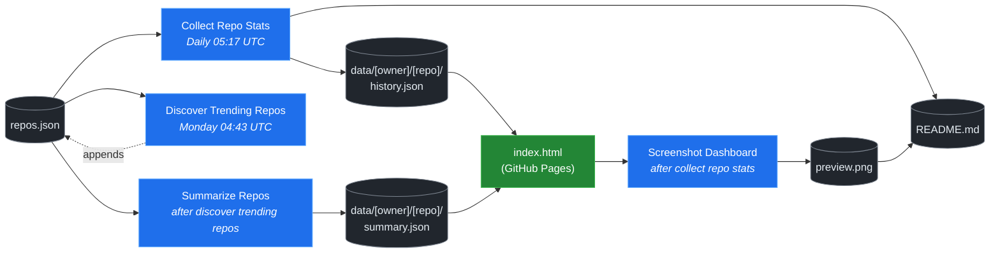

# 🚀 Rising Repos Tracker

> Automatically tracks daily GitHub stats (stars, forks, issues, velocity) for rising open source repos.

[](https://www.telosignal.com/)


**[→ View Live Dashboard](https://patrick-creates.github.io/rising-repos-tracker/)**

Built and maintained by [Telosignal](https://www.telosignal.com/).


<!-- AUTOGEN-STATS-START -->
## 📊 Current snapshot

> Auto-updated daily — last refreshed 2026-10-03

| Metric | Value |
|---|---|
| Repos tracked | **210** |
| Total stars | **10,259,105** |
| Total forks | **1,487,959** |
| Fastest growing | **VoiceStudio** (+1228.7/day) |

### 🔥 Top 5 by velocity

| # | Repo | Stars | Stars/day |
|---|---|---:|---:|
| 1 | [debpalash/VoiceStudio](https://github.com/debpalash/VoiceStudio) | 52,165 | +1228.7 |
| 2 | [DietrichGebert/ponytail](https://github.com/DietrichGebert/ponytail) | 152,254 | +1012.0 |
| 3 | [stablyai/orca](https://github.com/stablyai/orca) | 84,105 | +803.6 |
| 4 | [NousResearch/hermes-agent](https://github.com/NousResearch/hermes-agent) | 250,868 | +719.0 |
| 5 | [diegosouzapw/OmniRoute](https://github.com/diegosouzapw/OmniRoute) | 72,483 | +677.9 |

### 🆕 Recently added

- [blader/humanizer](https://github.com/blader/humanizer) — added 2026-09-28 — Agent skill that removes signs of AI-generated writing from text
- [LibreChat-AI/LibreChat](https://github.com/LibreChat-AI/LibreChat) — added 2026-09-28 — Enhanced ChatGPT Clone: Features Agents, MCP, Skills, DeepSeek, Anthropic, AWS, OpenAI, Responses API, Azure, Groq, o1, GPT-5, Mistral, OpenRouter, Vertex AI, Gemini, Artifacts, AI model switching, message search, Code Interpreter, langchain, DALL-E-3, OpenAPI Actions, Functions, Secure Multi-User Auth, Presets, open-source for self-hosting. Active
- [hypit-ai/hypit](https://github.com/hypit-ai/hypit) — added 2026-09-28 — Clone any viral video with AI agents. Not just a script, the whole workflow: swap the face, the words, the B-roll, ship 100 variants in one command, and get your 100M views.
<!-- AUTOGEN-STATS-END -->

<!-- AUTOGEN-DIAGRAM-START -->
## 🔄 How it works


```mermaid
graph LR
    repos[("repos.json")]:::data
    history[("data/[owner]/[repo]/<br/>history.json")]:::data
    summary[("data/[owner]/[repo]/<br/>summary.json")]:::data
    readme[("README.md")]:::data
    preview[("preview.png")]:::data
    dashboard["index.html<br/>(GitHub Pages)"]:::output
    collect_yml["Collect Repo Stats<br/><i>Daily 05:17 UTC</i>"]:::workflow
    discover_yml["Discover Trending Repos<br/><i>Monday 04:43 UTC</i>"]:::workflow
    screenshot_yml["Screenshot Dashboard<br/><i>after collect repo stats</i>"]:::workflow
    summarize_yml["Summarize Repos<br/><i>after discover trending repos</i>"]:::workflow
    repos --> collect_yml
    collect_yml --> history
    collect_yml --> readme
    repos --> discover_yml
    discover_yml -.->|appends| repos
    dashboard --> screenshot_yml
    screenshot_yml --> preview
    repos --> summarize_yml
    summarize_yml --> summary
    history --> dashboard
    summary --> dashboard
    preview --> readme
    classDef workflow fill:#1f6feb,stroke:#58a6ff,color:#fff
    classDef data fill:#21262d,stroke:#7d8590,color:#e6edf3
    classDef output fill:#238636,stroke:#3fb950,color:#fff
```
<!-- AUTOGEN-DIAGRAM-END -->

<!-- AUTOGEN-WORKFLOWS-START -->
## ⚙️ Workflows

| File | Schedule | Name |
|---|---|---|
| `collect.yml` | Daily 05:17 UTC | Collect Repo Stats |
| `discover.yml` | Monday 04:43 UTC | Discover Trending Repos |
| `screenshot.yml` | After Collect Repo Stats | Screenshot Dashboard |
| `summarize.yml` | After Discover Trending Repos | Summarize Repos |

> All workflows commit results directly back to the repo. Schedules are best-effort — GitHub Actions cron can drift by a few minutes.
<!-- AUTOGEN-WORKFLOWS-END -->

<!-- AUTOGEN-REPOS-START -->
## 📋 All tracked repos

| Repo | Stars | Forks | Stars/day |
|---|---:|---:|---:|
| [openclaw/openclaw](https://github.com/openclaw/openclaw) | 391,209 | 82,236 | +138.0 |
| [obra/superpowers](https://github.com/obra/superpowers) | 294,650 | 26,330 | +573.5 |
| [affaan-m/everything-claude-code](https://github.com/affaan-m/everything-claude-code) | 271,681 | 40,580 | +633.8 |
| [affaan-m/ECC](https://github.com/affaan-m/ECC) | 271,681 | 40,580 | +606.5 |
| [NousResearch/hermes-agent](https://github.com/NousResearch/hermes-agent) | 250,868 | 53,767 | +719.0 |
| [microsoft/markitdown](https://github.com/microsoft/markitdown) | 188,109 | 13,921 | +455.3 |
| [Significant-Gravitas/AutoGPT](https://github.com/Significant-Gravitas/AutoGPT) | 187,647 | 45,959 | +23.5 |
| [f/prompts.chat](https://github.com/f/prompts.chat) | 171,895 | 22,017 | +68.0 |
| [langgenius/dify](https://github.com/langgenius/dify) | 157,756 | 24,892 | +115.6 |
| [open-webui/open-webui](https://github.com/open-webui/open-webui) | 153,849 | 22,487 | +118.6 |
| [DietrichGebert/ponytail](https://github.com/DietrichGebert/ponytail) | 152,254 | 8,170 | +1012.0 |
| [langchain-ai/langchain](https://github.com/langchain-ai/langchain) | 147,398 | 24,686 | +75.3 |
| [github/spec-kit](https://github.com/github/spec-kit) | 139,916 | 12,521 | +294.1 |
| [farion1231/cc-switch](https://github.com/farion1231/cc-switch) | 139,685 | 9,403 | +475.7 |
| [nextlevelbuilder/ui-ux-pro-max-skill](https://github.com/nextlevelbuilder/ui-ux-pro-max-skill) | 132,658 | 14,065 | +383.0 |
| [Graphify-Labs/graphify](https://github.com/Graphify-Labs/graphify) | 123,415 | 11,889 | +392.9 |
| [microsoft/generative-ai-for-beginners](https://github.com/microsoft/generative-ai-for-beginners) | 120,965 | 63,623 | +71.4 |
| [JuliusBrussee/caveman](https://github.com/JuliusBrussee/caveman) | 109,275 | 6,321 | +346.1 |
| [nexu-io/open-design](https://github.com/nexu-io/open-design) | 99,244 | 11,471 | +399.1 |
| [ruvnet/RuView](https://github.com/ruvnet/RuView) | 96,068 | 12,664 | +230.3 |
| [thedotmack/claude-mem](https://github.com/thedotmack/claude-mem) | 95,216 | 8,432 | +138.7 |
| [vllm-project/vllm](https://github.com/vllm-project/vllm) | 93,094 | 22,947 | +92.4 |
| [Leonxlnx/taste-skill](https://github.com/Leonxlnx/taste-skill) | 92,175 | 6,253 | +498.1 |
| [OpenHands/OpenHands](https://github.com/OpenHands/OpenHands) | 89,846 | 11,868 | +115.3 |
| [Panniantong/Agent-Reach](https://github.com/Panniantong/Agent-Reach) | 89,273 | 7,857 | +562.4 |
| [ChatGPTNextWeb/NextChat](https://github.com/ChatGPTNextWeb/NextChat) | 88,819 | 58,928 | +5.7 |
| [koala73/worldmonitor](https://github.com/koala73/worldmonitor) | 87,692 | 13,370 | +241.5 |
| [stablyai/orca](https://github.com/stablyai/orca) | 84,105 | 5,421 | +803.6 |
| [lobehub/lobehub](https://github.com/lobehub/lobehub) | 82,959 | 15,953 | +41.7 |
| [rtk-ai/rtk](https://github.com/rtk-ai/rtk) | 82,273 | 5,225 | +236.9 |
| [datawhalechina/hello-agents](https://github.com/datawhalechina/hello-agents) | 81,574 | 10,136 | +224.0 |
| [dair-ai/Prompt-Engineering-Guide](https://github.com/dair-ai/Prompt-Engineering-Guide) | 78,799 | 8,658 | +29.7 |
| [shareAI-lab/learn-claude-code](https://github.com/shareAI-lab/learn-claude-code) | 77,937 | 12,504 | +122.2 |
| [unslothai/unsloth](https://github.com/unslothai/unsloth) | 77,160 | 7,093 | +91.7 |
| [ComposioHQ/awesome-claude-skills](https://github.com/ComposioHQ/awesome-claude-skills) | 76,398 | 8,930 | +116.0 |
| [openai/openai-cookbook](https://github.com/openai/openai-cookbook) | 76,325 | 12,906 | +19.7 |
| [chopratejas/headroom](https://github.com/chopratejas/headroom) | 74,313 | 5,746 | +419.5 |
| [headroomlabs-ai/headroom](https://github.com/headroomlabs-ai/headroom) | 74,313 | 5,746 | +275.8 |
| [santifer/career-ops](https://github.com/santifer/career-ops) | 73,356 | 13,784 | +203.7 |
| [career-ops-hq/career-ops](https://github.com/career-ops-hq/career-ops) | 73,356 | 13,784 | +114.4 |
| [diegosouzapw/OmniRoute](https://github.com/diegosouzapw/OmniRoute) | 72,483 | 10,355 | +677.9 |
| [Fission-AI/OpenSpec](https://github.com/Fission-AI/OpenSpec) | 70,950 | 4,865 | +160.6 |
| [code-yeongyu/oh-my-openagent](https://github.com/code-yeongyu/oh-my-openagent) | 69,766 | 5,738 | +82.9 |
| [asgeirtj/system_prompts_leaks](https://github.com/asgeirtj/system_prompts_leaks) | 68,796 | 11,175 | +205.9 |
| [shanraisshan/claude-code-best-practice](https://github.com/shanraisshan/claude-code-best-practice) | 67,024 | 6,700 | +98.0 |
| [xtekky/gpt4free](https://github.com/xtekky/gpt4free) | 66,755 | 13,490 | +3.7 |
| [usestrix/strix](https://github.com/usestrix/strix) | 66,259 | 7,259 | +327.0 |
| [ZhuLinsen/daily_stock_analysis](https://github.com/ZhuLinsen/daily_stock_analysis) | 65,862 | 54,942 | +206.3 |
| [mvanhorn/last30days-skill](https://github.com/mvanhorn/last30days-skill) | 63,410 | 5,520 | +262.7 |
| [rohitg00/ai-engineering-from-scratch](https://github.com/rohitg00/ai-engineering-from-scratch) | 62,795 | 10,732 | +293.8 |
| [calesthio/OpenMontage](https://github.com/calesthio/OpenMontage) | 62,552 | 7,986 | +361.5 |
| [tw93/Pake](https://github.com/tw93/Pake) | 61,887 | 12,736 | +95.0 |
| [BerriAI/litellm](https://github.com/BerriAI/litellm) | 60,076 | 11,990 | +91.9 |
| [MemPalace/mempalace](https://github.com/MemPalace/mempalace) | 59,394 | 7,561 | +50.7 |
| [jamiepine/voicebox](https://github.com/jamiepine/voicebox) | 56,213 | 6,999 | +219.3 |
| [heygen-com/hyperframes](https://github.com/heygen-com/hyperframes) | 56,086 | 5,045 | +260.9 |
| [FlowiseAI/Flowise](https://github.com/FlowiseAI/Flowise) | 55,486 | 25,055 | +18.7 |
| [hesreallyhim/awesome-claude-code](https://github.com/hesreallyhim/awesome-claude-code) | 54,988 | 4,780 | +78.9 |
| [ggml-org/whisper.cpp](https://github.com/ggml-org/whisper.cpp) | 54,103 | 6,204 | +31.0 |
| [router-for-me/CLIProxyAPI](https://github.com/router-for-me/CLIProxyAPI) | 53,948 | 8,166 | +146.6 |
| [blader/humanizer](https://github.com/blader/humanizer) | 53,668 | 4,272 | +231.0 |
| [ChromeDevTools/chrome-devtools-mcp](https://github.com/ChromeDevTools/chrome-devtools-mcp) | 52,902 | 5,421 | +94.3 |
| [coreyhaines31/marketingskills](https://github.com/coreyhaines31/marketingskills) | 52,560 | 7,886 | +170.3 |
| [debpalash/VoiceStudio](https://github.com/debpalash/VoiceStudio) | 52,165 | 5,816 | +1228.7 |
| [bojieli/ai-agent-book](https://github.com/bojieli/ai-agent-book) | 52,156 | 5,885 | +589.4 |
| [elder-plinius/CL4R1T4S](https://github.com/elder-plinius/CL4R1T4S) | 50,849 | 10,406 | +108.7 |
| [Imbad0202/academic-research-skills](https://github.com/Imbad0202/academic-research-skills) | 50,234 | 3,875 | +155.0 |
| [Aider-AI/aider](https://github.com/Aider-AI/aider) | 49,347 | 5,021 | +31.8 |
| [QuantumNous/new-api](https://github.com/QuantumNous/new-api) | 49,215 | 11,831 | +105.8 |
| [kepano/obsidian-skills](https://github.com/kepano/obsidian-skills) | 49,100 | 3,491 | +122.7 |
| [HKUDS/nanobot](https://github.com/HKUDS/nanobot) | 48,753 | 8,600 | +44.0 |
| [K-Dense-AI/scientific-agent-skills](https://github.com/K-Dense-AI/scientific-agent-skills) | 47,444 | 4,287 | +152.6 |
| [zhayujie/CowAgent](https://github.com/zhayujie/CowAgent) | 47,219 | 10,373 | +19.3 |
| [sickn33/antigravity-awesome-skills](https://github.com/sickn33/antigravity-awesome-skills) | 47,211 | 6,871 | +65.1 |
| [sickn33/agentic-awesome-skills](https://github.com/sickn33/agentic-awesome-skills) | 47,211 | 6,871 | +50.8 |
| [DeusData/codebase-memory-mcp](https://github.com/DeusData/codebase-memory-mcp) | 45,714 | 3,755 | +261.3 |
| [danny-avila/LibreChat](https://github.com/danny-avila/LibreChat) | 45,210 | 9,268 | +59.1 |
| [LibreChat-AI/LibreChat](https://github.com/LibreChat-AI/LibreChat) | 45,210 | 9,268 | +37.2 |
| [MadsLorentzen/ai-job-search](https://github.com/MadsLorentzen/ai-job-search) | 44,837 | 15,499 | +283.6 |
| [chatanywhere/GPT_API_free](https://github.com/chatanywhere/GPT_API_free) | 43,538 | 2,734 | +41.1 |
| [alibaba/open-code-review](https://github.com/alibaba/open-code-review) | 43,427 | 3,132 | +375.7 |
| [langchain-ai/langgraph](https://github.com/langchain-ai/langgraph) | 42,656 | 7,232 | +70.3 |
| [ogulcancelik/herdr](https://github.com/ogulcancelik/herdr) | 42,031 | 3,263 | +333.0 |
| [herdrdev/herdr](https://github.com/herdrdev/herdr) | 42,031 | 3,263 | +299.0 |
| [chatboxai/chatbox](https://github.com/chatboxai/chatbox) | 41,930 | 4,269 | +14.0 |
| [AstrBotDevs/AstrBot](https://github.com/AstrBotDevs/AstrBot) | 41,330 | 3,009 | +62.4 |
| [Hmbown/CodeWhale](https://github.com/Hmbown/CodeWhale) | 41,037 | 3,565 | +48.6 |
| [Hmbown/Codewhale](https://github.com/Hmbown/Codewhale) | 41,037 | 3,565 | +4.7 |
| [tinyhumansai/openhuman](https://github.com/tinyhumansai/openhuman) | 40,480 | 3,999 | +38.1 |
| [wshobson/agents](https://github.com/wshobson/agents) | 40,170 | 4,283 | +32.3 |
| [mindsdb/mindshub](https://github.com/mindsdb/mindshub) | 39,780 | 6,244 | +4.6 |
| [github/awesome-copilot](https://github.com/github/awesome-copilot) | 39,651 | 5,047 | +44.6 |
| [Yeachan-Heo/oh-my-claudecode](https://github.com/Yeachan-Heo/oh-my-claudecode) | 39,549 | 3,532 | +36.1 |
| [volcengine/OpenViking](https://github.com/volcengine/OpenViking) | 39,152 | 3,076 | +118.2 |
| [google/langextract](https://github.com/google/langextract) | 38,919 | 2,717 | +18.0 |
| [AlexsJones/llmfit](https://github.com/AlexsJones/llmfit) | 37,479 | 2,399 | +84.5 |
| [anthropics/claude-plugins-official](https://github.com/anthropics/claude-plugins-official) | 37,329 | 4,202 | +67.1 |
| [PDFMathTranslate/PDFMathTranslate](https://github.com/PDFMathTranslate/PDFMathTranslate) | 37,305 | 3,339 | +25.1 |
| [songquanpeng/one-api](https://github.com/songquanpeng/one-api) | 37,068 | 6,873 | +21.8 |
| [esengine/DeepSeek-Reasonix](https://github.com/esengine/DeepSeek-Reasonix) | 35,733 | 2,439 | +138.5 |
| [JCodesMore/ai-website-cloner-template](https://github.com/JCodesMore/ai-website-cloner-template) | 35,572 | 5,192 | +168.9 |
| [agentscope-ai/QwenPaw](https://github.com/agentscope-ai/QwenPaw) | 35,419 | 3,152 | +160.4 |
| [HKUDS/Vibe-Trading](https://github.com/HKUDS/Vibe-Trading) | 34,473 | 5,602 | +205.6 |
| [can1357/oh-my-pi](https://github.com/can1357/oh-my-pi) | 34,152 | 3,694 | +195.7 |
| [mukul975/Anthropic-Cybersecurity-Skills](https://github.com/mukul975/Anthropic-Cybersecurity-Skills) | 33,729 | 4,084 | +151.5 |
| [Gitlawb/openclaude](https://github.com/Gitlawb/openclaude) | 33,631 | 9,102 | +44.3 |
| [virgiliojr94/book-to-skill](https://github.com/virgiliojr94/book-to-skill) | 33,373 | 3,486 | +213.6 |
| [iOfficeAI/AionUi](https://github.com/iOfficeAI/AionUi) | 33,292 | 3,467 | +47.9 |
| [p-e-w/heretic](https://github.com/p-e-w/heretic) | 32,961 | 3,692 | +76.8 |
| [zeroclaw-labs/zeroclaw](https://github.com/zeroclaw-labs/zeroclaw) | 32,923 | 4,953 | +10.1 |
| [tirth8205/code-review-graph](https://github.com/tirth8205/code-review-graph) | 31,897 | 2,918 | +121.7 |
| [Tencent/WeKnora](https://github.com/Tencent/WeKnora) | 31,825 | 4,249 | +141.2 |
| [iOfficeAI/OfficeCLI](https://github.com/iOfficeAI/OfficeCLI) | 31,501 | 2,144 | +259.6 |
| [googleworkspace/cli](https://github.com/googleworkspace/cli) | 31,234 | 1,858 | +36.4 |
| [decolua/9router](https://github.com/decolua/9router) | 30,225 | 5,740 | +115.0 |
| [langchain-ai/deepagents](https://github.com/langchain-ai/deepagents) | 29,915 | 4,206 | +49.2 |
| [jackwener/OpenCLI](https://github.com/jackwener/OpenCLI) | 29,788 | 2,906 | +51.2 |
| [alibaba/page-agent](https://github.com/alibaba/page-agent) | 29,316 | 2,635 | +97.8 |
| [rohitg00/agentmemory](https://github.com/rohitg00/agentmemory) | 29,106 | 2,542 | +62.2 |
| [voideditor/void](https://github.com/voideditor/void) | 28,779 | 2,657 | — |
| [jarrodwatts/claude-hud](https://github.com/jarrodwatts/claude-hud) | 28,275 | 1,312 | +30.6 |
| [BloopAI/vibe-kanban](https://github.com/BloopAI/vibe-kanban) | 28,251 | 3,031 | +12.4 |
| [TencentCloud/TencentDB-Agent-Memory](https://github.com/TencentCloud/TencentDB-Agent-Memory) | 27,654 | 2,665 | +230.9 |
| [manaflow-ai/cmux](https://github.com/manaflow-ai/cmux) | 27,586 | 2,432 | +39.4 |
| [zai-org/Open-AutoGLM](https://github.com/zai-org/Open-AutoGLM) | 26,340 | 4,046 | +7.5 |
| [toon-format/toon](https://github.com/toon-format/toon) | 25,452 | 1,123 | +8.2 |
| [mksglu/context-mode](https://github.com/mksglu/context-mode) | 25,141 | 1,804 | +69.8 |
| [pascalorg/editor](https://github.com/pascalorg/editor) | 24,583 | 3,038 | +61.7 |
| [t8y2/dbx](https://github.com/t8y2/dbx) | 24,165 | 2,213 | +181.3 |
| [guillaumemeyer/watermarks-remover](https://github.com/guillaumemeyer/watermarks-remover) | 23,265 | 2,667 | +142.8 |
| [pranshuparmar/witr](https://github.com/pranshuparmar/witr) | 22,571 | 789 | +47.3 |
| [jundot/omlx](https://github.com/jundot/omlx) | 22,480 | 1,961 | +53.2 |
| [winfunc/opcode](https://github.com/winfunc/opcode) | 22,425 | 1,712 | +3.6 |
| [every-app/open-seo](https://github.com/every-app/open-seo) | 22,221 | 2,863 | +187.6 |
| [steipete/CodexBar](https://github.com/steipete/CodexBar) | 22,146 | 2,036 | +67.4 |
| [coze-dev/coze-studio](https://github.com/coze-dev/coze-studio) | 21,667 | 3,127 | +6.1 |
| [NirDiamant/agents-towards-production](https://github.com/NirDiamant/agents-towards-production) | 21,523 | 2,852 | +7.6 |
| [KKKKhazix/khazix-skills](https://github.com/KKKKhazix/khazix-skills) | 21,118 | 2,238 | +48.8 |
| [jnMetaCode/agency-agents-zh](https://github.com/jnMetaCode/agency-agents-zh) | 21,043 | 3,389 | +54.7 |
| [1jehuang/jcode](https://github.com/1jehuang/jcode) | 20,278 | 2,351 | +146.0 |
| [tanweai/pua](https://github.com/tanweai/pua) | 19,710 | 1,203 | +13.3 |
| [datawhalechina/easy-vibe](https://github.com/datawhalechina/easy-vibe) | 19,603 | 1,874 | +24.2 |
| [ifixai-ai/iFixAi](https://github.com/ifixai-ai/iFixAi) | 19,585 | 1,380 | +211.3 |
| [danielmiessler/LifeOS](https://github.com/danielmiessler/LifeOS) | 19,281 | 2,487 | +31.2 |
| [NVIDIA/SkillSpector](https://github.com/NVIDIA/SkillSpector) | 19,177 | 1,671 | +107.2 |
| [hypit-ai/hypit](https://github.com/hypit-ai/hypit) | 18,987 | 2,140 | +377.6 |
| [nesquena/hermes-webui](https://github.com/nesquena/hermes-webui) | 18,742 | 2,673 | +37.9 |
| [jlcodes99/cockpit-tools](https://github.com/jlcodes99/cockpit-tools) | 18,605 | 1,653 | +58.0 |
| [microsoft/agent-lightning](https://github.com/microsoft/agent-lightning) | 18,551 | 1,652 | +11.3 |
| [walkinglabs/learn-harness-engineering](https://github.com/walkinglabs/learn-harness-engineering) | 18,328 | 1,948 | +94.9 |
| [browser-use/browser-harness](https://github.com/browser-use/browser-harness) | 18,267 | 1,784 | +29.0 |
| [RightNow-AI/openfang](https://github.com/RightNow-AI/openfang) | 18,208 | 2,288 | +3.5 |
| [AgriciDaniel/claude-seo](https://github.com/AgriciDaniel/claude-seo) | 18,203 | 2,672 | +69.4 |
| [MemoriLabs/Memori](https://github.com/MemoriLabs/Memori) | 17,064 | 3,645 | +16.7 |
| [tradecatlabs/vibe-coding-cn](https://github.com/tradecatlabs/vibe-coding-cn) | 17,042 | 1,724 | +53.0 |
| [cft0808/edict](https://github.com/cft0808/edict) | 16,960 | 1,765 | +8.2 |
| [wanshuiyin/Auto-claude-code-research-in-sleep](https://github.com/wanshuiyin/Auto-claude-code-research-in-sleep) | 16,919 | 1,428 | +43.2 |
| [composio-community/awesome-codex-skills](https://github.com/composio-community/awesome-codex-skills) | 16,749 | 1,644 | +19.4 |
| [xbtlin/ai-berkshire](https://github.com/xbtlin/ai-berkshire) | 16,601 | 2,473 | +65.4 |
| [xpzouying/xiaohongshu-mcp](https://github.com/xpzouying/xiaohongshu-mcp) | 16,092 | 2,362 | +17.5 |
| [Anionex/banana-slides](https://github.com/Anionex/banana-slides) | 15,677 | 1,786 | +5.1 |
| [yusufkaraaslan/Skill_Seekers](https://github.com/yusufkaraaslan/Skill_Seekers) | 15,094 | 1,539 | +8.4 |
| [kyegomez/OpenMythos](https://github.com/kyegomez/OpenMythos) | 14,906 | 3,285 | +7.3 |
| [NanmiCoder/cc-haha](https://github.com/NanmiCoder/cc-haha) | 14,849 | 8,595 | +16.0 |
| [superset-sh/superset](https://github.com/superset-sh/superset) | 14,835 | 1,319 | +27.9 |
| [NevaMind-AI/memU](https://github.com/NevaMind-AI/memU) | 14,490 | 1,083 | +5.7 |
| [XiaomiMiMo/MiMo-Code](https://github.com/XiaomiMiMo/MiMo-Code) | 13,588 | 1,417 | +26.7 |
| [EverMind-AI/EverOS](https://github.com/EverMind-AI/EverOS) | 13,328 | 926 | +37.6 |
| [sirmalloc/ccstatusline](https://github.com/sirmalloc/ccstatusline) | 13,166 | 588 | +19.6 |
| [ConardLi/garden-skills](https://github.com/ConardLi/garden-skills) | 12,720 | 1,525 | +39.8 |
| [brokermr810/QuantDinger](https://github.com/brokermr810/QuantDinger) | 12,395 | 2,528 | +35.0 |
| [OpenByteInc/QuantDinger](https://github.com/OpenByteInc/QuantDinger) | 12,395 | 2,528 | +34.6 |
| [0x4m4/hexstrike-ai](https://github.com/0x4m4/hexstrike-ai) | 12,287 | 2,498 | +23.7 |
| [dataelement/dsh-desktop](https://github.com/dataelement/dsh-desktop) | 11,739 | 428 | +290.8 |
| [MemTensor/MemOS](https://github.com/MemTensor/MemOS) | 11,683 | 1,065 | +17.3 |
| [holaboss-ai/holaOS](https://github.com/holaboss-ai/holaOS) | 11,454 | 730 | +65.6 |
| [getagentseal/codeburn](https://github.com/getagentseal/codeburn) | 11,317 | 869 | +32.0 |
| [EKKOLearnAI/hermes-studio](https://github.com/EKKOLearnAI/hermes-studio) | 11,282 | 1,385 | +27.2 |
| [EKKOLearnAI/ekko-studio](https://github.com/EKKOLearnAI/ekko-studio) | 11,282 | 1,385 | +11.6 |
| [aden-hive/hive](https://github.com/aden-hive/hive) | 11,088 | 5,655 | +5.0 |
| [ValueCell-ai/valuecell](https://github.com/ValueCell-ai/valuecell) | 11,019 | 1,802 | +1.5 |
| [openai/codex-security](https://github.com/openai/codex-security) | 10,957 | 836 | +43.9 |
| [Kuberwastaken/claurst](https://github.com/Kuberwastaken/claurst) | 10,313 | 7,715 | +4.7 |
| [ykdojo/claude-code-tips](https://github.com/ykdojo/claude-code-tips) | 10,183 | 825 | +13.1 |
| [StarTrail-org/PixelRAG](https://github.com/StarTrail-org/PixelRAG) | 10,127 | 870 | +43.2 |
| [Companion-Inc/feynman](https://github.com/Companion-Inc/feynman) | 9,865 | 1,096 | +10.6 |
| [frankbria/ralph-claude-code](https://github.com/frankbria/ralph-claude-code) | 9,643 | 722 | +3.7 |
| [trailhq/Graft](https://github.com/trailhq/Graft) | 9,518 | 874 | +101.5 |
| [modem-dev/hunk](https://github.com/modem-dev/hunk) | 9,471 | 310 | +33.7 |
| [Nasiko-Labs/nasiko](https://github.com/Nasiko-Labs/nasiko) | 9,371 | 2,058 | +72.6 |
| [EvoMap/evolver](https://github.com/EvoMap/evolver) | 9,126 | 848 | +3.0 |
| [iflytek/astron-agent](https://github.com/iflytek/astron-agent) | 8,873 | 885 | +3.0 |
| [1weiho/open-slide](https://github.com/1weiho/open-slide) | 8,730 | 612 | +48.4 |
| [open-slide/open-slide](https://github.com/open-slide/open-slide) | 8,730 | 612 | +89.8 |
| [genspark-ai/genoffice](https://github.com/genspark-ai/genoffice) | 8,451 | 1,087 | +88.4 |
| [MiroMindAI/MiroThinker](https://github.com/MiroMindAI/MiroThinker) | 8,417 | 646 | +1.0 |
| [mmulet/term.everything](https://github.com/mmulet/term.everything) | 8,110 | 196 | +1.0 |
| [Tencent/BrowserSkill](https://github.com/Tencent/BrowserSkill) | 8,073 | 575 | +82.6 |
| [rorkai/App-Store-Connect-CLI](https://github.com/rorkai/App-Store-Connect-CLI) | 7,639 | 637 | +28.5 |
| [ValueCell-ai/ClawX](https://github.com/ValueCell-ai/ClawX) | 7,612 | 1,140 | +0.9 |
| [WenyuChiou/awesome-agentic-ai-zh](https://github.com/WenyuChiou/awesome-agentic-ai-zh) | 7,246 | 977 | +21.1 |
| [opensquilla/opensquilla](https://github.com/opensquilla/opensquilla) | 7,081 | 577 | +11.6 |
| [TokenRhythm/opensquilla](https://github.com/TokenRhythm/opensquilla) | 7,081 | 577 | +4.3 |
| [tech-leads-club/agent-skills](https://github.com/tech-leads-club/agent-skills) | 7,024 | 558 | +37.8 |
| [Andyyyy64/whichllm](https://github.com/Andyyyy64/whichllm) | 6,716 | 371 | +11.3 |
| [steipete/summarize](https://github.com/steipete/summarize) | 6,678 | 449 | +3.3 |
| [Arthur-Ficial/apfel](https://github.com/Arthur-Ficial/apfel) | 6,451 | 246 | +4.1 |
| [microsoft/fara](https://github.com/microsoft/fara) | 6,207 | 604 | +2.5 |
| [UfoMiao/zcf](https://github.com/UfoMiao/zcf) | 6,084 | 422 | +0.2 |
| [re4/LibreCode](https://github.com/re4/LibreCode) | 89 | 5 | — |
<!-- AUTOGEN-REPOS-END -->

---

## What it does

- Collects daily snapshots of stars, forks, watchers and open issues for every tracked repo
- Discovers new trending repos automatically every Monday using the GitHub Search API
- Generates AI summaries (use cases, similar tools, tags) for each tracked repo via GitHub Models
- Stores all history as plain JSON — no database, no backend
- Renders a live dashboard via GitHub Pages — updates daily, zero maintenance

## Tracked repos

Data lives in [`data/`](./data) — one folder per repo, one `history.json` per entry.  
The full watch list is in [`repos.json`](./repos.json).

## Fork & use it for yourself

This is my personal tracker — the watch list reflects what I find interesting. If you want to track different repos, the best path is to **fork this repo and run your own**.

### Setup

1. Fork this repo to your account
2. Replace the contents of [`repos.json`](./repos.json) with the repos you want to track (or just leave one entry — `discover.yml` will auto-add more every Monday)
3. Go to **Settings → Pages** and enable GitHub Pages from the `main` branch
4. Go to **Actions** and run **Collect Repo Stats** once manually to seed your first data point
5. Your dashboard will be live at `https://YOUR-USERNAME.github.io/rising-repos-tracker/`

That's it — daily collection and weekly discovery run automatically on schedule. Zero ongoing maintenance.

### Customizing what gets discovered

Edit [`scripts/discover.js`](./scripts/discover.js) to change:

- `MIN_STARS` — minimum star threshold for candidates
- `MAX_AGE_DAYS` — how recent a repo must be
- `MAX_NEW_REPOS` — how many to add per discovery run
- The `queries` array — GitHub Search API queries that define what "trending" means to you

### Adding a repo manually

Just edit `repos.json` directly:

```json
{
  "owner": "OWNER",
  "repo": "REPO",
  "added": "YYYY-MM-DD",
  "notes": "why you're tracking this"
}
```

The next daily collect run picks it up automatically.

## Stack

- **GitHub Actions** — scheduling and automation
- **GitHub Pages** — dashboard hosting
- **GitHub API** — data source
- **GitHub Models** — free AI summaries (gpt-4o-mini)
- **Chart.js** — star growth visualization
- **Mermaid** — architecture diagram (rendered by GitHub)
- No dependencies, no build step, no database

## License

MIT
