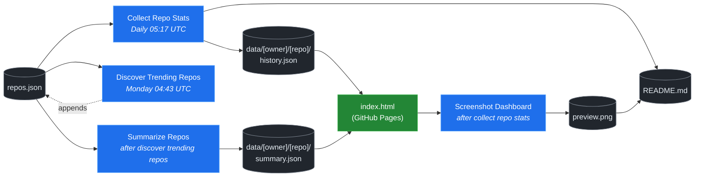

# 🚀 Rising Repos Tracker

> Automatically tracks daily GitHub stats (stars, forks, issues, velocity) for rising open source repos.

[](https://www.telosignal.com/)


**[→ View Live Dashboard](https://patrick-creates.github.io/rising-repos-tracker/)**

Built and maintained by [Telosignal](https://www.telosignal.com/).


<!-- AUTOGEN-STATS-START -->
## 📊 Current snapshot

> Auto-updated daily — last refreshed 2026-10-04

| Metric | Value |
|---|---|
| Repos tracked | **210** |
| Total stars | **10,278,100** |
| Total forks | **1,490,403** |
| Fastest growing | **VoiceStudio** (+1208.4/day) |

### 🔥 Top 5 by velocity

| # | Repo | Stars | Stars/day |
|---|---|---:|---:|
| 1 | [debpalash/VoiceStudio](https://github.com/debpalash/VoiceStudio) | 52,845 | +1208.4 |
| 2 | [DietrichGebert/ponytail](https://github.com/DietrichGebert/ponytail) | 154,130 | +1020.3 |
| 3 | [stablyai/orca](https://github.com/stablyai/orca) | 84,657 | +800.8 |
| 4 | [NousResearch/hermes-agent](https://github.com/NousResearch/hermes-agent) | 251,074 | +715.5 |
| 5 | [diegosouzapw/OmniRoute](https://github.com/diegosouzapw/OmniRoute) | 72,784 | +673.7 |

### 🆕 Recently added

- [blader/humanizer](https://github.com/blader/humanizer) — added 2026-09-28 — Agent skill that removes signs of AI-generated writing from text
- [LibreChat-AI/LibreChat](https://github.com/LibreChat-AI/LibreChat) — added 2026-09-28 — Enhanced ChatGPT Clone: Features Agents, MCP, Skills, DeepSeek, Anthropic, AWS, OpenAI, Responses API, Azure, Groq, o1, GPT-5, Mistral, OpenRouter, Vertex AI, Gemini, Artifacts, AI model switching, message search, Code Interpreter, langchain, DALL-E-3, OpenAPI Actions, Functions, Secure Multi-User Auth, Presets, open-source for self-hosting. Active
- [hypit-ai/hypit](https://github.com/hypit-ai/hypit) — added 2026-09-28 — Clone any viral video with AI agents. Not just a script, the whole workflow: swap the face, the words, the B-roll, ship 100 variants in one command, and get your 100M views.
<!-- AUTOGEN-STATS-END -->

<!-- AUTOGEN-DIAGRAM-START -->
## 🔄 How it works


```mermaid
graph LR
    repos[("repos.json")]:::data
    history[("data/[owner]/[repo]/<br/>history.json")]:::data
    summary[("data/[owner]/[repo]/<br/>summary.json")]:::data
    readme[("README.md")]:::data
    preview[("preview.png")]:::data
    dashboard["index.html<br/>(GitHub Pages)"]:::output
    collect_yml["Collect Repo Stats<br/><i>Daily 05:17 UTC</i>"]:::workflow
    discover_yml["Discover Trending Repos<br/><i>Monday 04:43 UTC</i>"]:::workflow
    screenshot_yml["Screenshot Dashboard<br/><i>after collect repo stats</i>"]:::workflow
    summarize_yml["Summarize Repos<br/><i>after discover trending repos</i>"]:::workflow
    repos --> collect_yml
    collect_yml --> history
    collect_yml --> readme
    repos --> discover_yml
    discover_yml -.->|appends| repos
    dashboard --> screenshot_yml
    screenshot_yml --> preview
    repos --> summarize_yml
    summarize_yml --> summary
    history --> dashboard
    summary --> dashboard
    preview --> readme
    classDef workflow fill:#1f6feb,stroke:#58a6ff,color:#fff
    classDef data fill:#21262d,stroke:#7d8590,color:#e6edf3
    classDef output fill:#238636,stroke:#3fb950,color:#fff
```
<!-- AUTOGEN-DIAGRAM-END -->

<!-- AUTOGEN-WORKFLOWS-START -->
## ⚙️ Workflows

| File | Schedule | Name |
|---|---|---|
| `collect.yml` | Daily 05:17 UTC | Collect Repo Stats |
| `discover.yml` | Monday 04:43 UTC | Discover Trending Repos |
| `screenshot.yml` | After Collect Repo Stats | Screenshot Dashboard |
| `summarize.yml` | After Discover Trending Repos | Summarize Repos |

> All workflows commit results directly back to the repo. Schedules are best-effort — GitHub Actions cron can drift by a few minutes.
<!-- AUTOGEN-WORKFLOWS-END -->

<!-- AUTOGEN-REPOS-START -->
## 📋 All tracked repos

| Repo | Stars | Forks | Stars/day |
|---|---:|---:|---:|
| [openclaw/openclaw](https://github.com/openclaw/openclaw) | 391,275 | 82,251 | +137.5 |
| [obra/superpowers](https://github.com/obra/superpowers) | 295,078 | 26,374 | +572.1 |
| [affaan-m/everything-claude-code](https://github.com/affaan-m/everything-claude-code) | 272,551 | 40,689 | +635.4 |
| [affaan-m/ECC](https://github.com/affaan-m/ECC) | 272,551 | 40,689 | +608.5 |
| [NousResearch/hermes-agent](https://github.com/NousResearch/hermes-agent) | 251,074 | 53,863 | +715.5 |
| [microsoft/markitdown](https://github.com/microsoft/markitdown) | 188,289 | 13,935 | +453.3 |
| [Significant-Gravitas/AutoGPT](https://github.com/Significant-Gravitas/AutoGPT) | 187,647 | 45,957 | +23.4 |
| [f/prompts.chat](https://github.com/f/prompts.chat) | 171,989 | 22,027 | +68.2 |
| [langgenius/dify](https://github.com/langgenius/dify) | 157,809 | 24,900 | +115.2 |
| [DietrichGebert/ponytail](https://github.com/DietrichGebert/ponytail) | 154,130 | 8,292 | +1020.3 |
| [open-webui/open-webui](https://github.com/open-webui/open-webui) | 153,915 | 22,501 | +118.2 |
| [langchain-ai/langchain](https://github.com/langchain-ai/langchain) | 147,426 | 24,700 | +74.9 |
| [github/spec-kit](https://github.com/github/spec-kit) | 140,063 | 12,538 | +293.1 |
| [farion1231/cc-switch](https://github.com/farion1231/cc-switch) | 139,898 | 9,415 | +473.8 |
| [nextlevelbuilder/ui-ux-pro-max-skill](https://github.com/nextlevelbuilder/ui-ux-pro-max-skill) | 132,893 | 14,079 | +381.9 |
| [Graphify-Labs/graphify](https://github.com/Graphify-Labs/graphify) | 123,654 | 11,920 | +390.7 |
| [microsoft/generative-ai-for-beginners](https://github.com/microsoft/generative-ai-for-beginners) | 120,988 | 63,653 | +71.1 |
| [JuliusBrussee/caveman](https://github.com/JuliusBrussee/caveman) | 109,700 | 6,344 | +346.7 |
| [nexu-io/open-design](https://github.com/nexu-io/open-design) | 99,362 | 11,494 | +397.0 |
| [ruvnet/RuView](https://github.com/ruvnet/RuView) | 96,234 | 12,678 | +229.9 |
| [thedotmack/claude-mem](https://github.com/thedotmack/claude-mem) | 95,828 | 8,470 | +142.0 |
| [vllm-project/vllm](https://github.com/vllm-project/vllm) | 93,151 | 22,976 | +92.1 |
| [Leonxlnx/taste-skill](https://github.com/Leonxlnx/taste-skill) | 92,448 | 6,273 | +496.3 |
| [Panniantong/Agent-Reach](https://github.com/Panniantong/Agent-Reach) | 90,257 | 7,936 | +565.9 |
| [OpenHands/OpenHands](https://github.com/OpenHands/OpenHands) | 89,947 | 11,882 | +115.2 |
| [ChatGPTNextWeb/NextChat](https://github.com/ChatGPTNextWeb/NextChat) | 88,831 | 58,929 | +5.7 |
| [koala73/worldmonitor](https://github.com/koala73/worldmonitor) | 87,740 | 13,380 | +240.1 |
| [stablyai/orca](https://github.com/stablyai/orca) | 84,657 | 5,460 | +800.8 |
| [lobehub/lobehub](https://github.com/lobehub/lobehub) | 82,979 | 15,955 | +41.5 |
| [rtk-ai/rtk](https://github.com/rtk-ai/rtk) | 82,337 | 5,239 | +235.7 |
| [datawhalechina/hello-agents](https://github.com/datawhalechina/hello-agents) | 81,641 | 10,143 | +222.9 |
| [dair-ai/Prompt-Engineering-Guide](https://github.com/dair-ai/Prompt-Engineering-Guide) | 78,816 | 8,660 | +29.6 |
| [shareAI-lab/learn-claude-code](https://github.com/shareAI-lab/learn-claude-code) | 77,978 | 12,509 | +121.6 |
| [unslothai/unsloth](https://github.com/unslothai/unsloth) | 77,186 | 7,104 | +91.3 |
| [ComposioHQ/awesome-claude-skills](https://github.com/ComposioHQ/awesome-claude-skills) | 76,459 | 8,943 | +115.6 |
| [openai/openai-cookbook](https://github.com/openai/openai-cookbook) | 76,338 | 12,909 | +19.6 |
| [chopratejas/headroom](https://github.com/chopratejas/headroom) | 74,381 | 5,751 | +416.4 |
| [headroomlabs-ai/headroom](https://github.com/headroomlabs-ai/headroom) | 74,381 | 5,751 | +273.8 |
| [santifer/career-ops](https://github.com/santifer/career-ops) | 73,435 | 13,798 | +202.8 |
| [career-ops-hq/career-ops](https://github.com/career-ops-hq/career-ops) | 73,435 | 13,798 | +113.1 |
| [diegosouzapw/OmniRoute](https://github.com/diegosouzapw/OmniRoute) | 72,784 | 10,421 | +673.7 |
| [Fission-AI/OpenSpec](https://github.com/Fission-AI/OpenSpec) | 71,016 | 4,869 | +159.9 |
| [code-yeongyu/oh-my-openagent](https://github.com/code-yeongyu/oh-my-openagent) | 69,787 | 5,745 | +82.4 |
| [asgeirtj/system_prompts_leaks](https://github.com/asgeirtj/system_prompts_leaks) | 68,859 | 11,182 | +204.8 |
| [shanraisshan/claude-code-best-practice](https://github.com/shanraisshan/claude-code-best-practice) | 67,062 | 6,703 | +97.6 |
| [xtekky/gpt4free](https://github.com/xtekky/gpt4free) | 66,756 | 13,486 | +3.7 |
| [usestrix/strix](https://github.com/usestrix/strix) | 66,409 | 7,279 | +325.6 |
| [ZhuLinsen/daily_stock_analysis](https://github.com/ZhuLinsen/daily_stock_analysis) | 65,881 | 54,959 | +204.9 |
| [mvanhorn/last30days-skill](https://github.com/mvanhorn/last30days-skill) | 63,473 | 5,529 | +261.0 |
| [rohitg00/ai-engineering-from-scratch](https://github.com/rohitg00/ai-engineering-from-scratch) | 63,456 | 10,854 | +296.7 |
| [calesthio/OpenMontage](https://github.com/calesthio/OpenMontage) | 62,797 | 8,020 | +360.3 |
| [tw93/Pake](https://github.com/tw93/Pake) | 61,904 | 12,735 | +94.4 |
| [BerriAI/litellm](https://github.com/BerriAI/litellm) | 60,118 | 12,006 | +91.6 |
| [MemPalace/mempalace](https://github.com/MemPalace/mempalace) | 59,406 | 7,560 | +50.4 |
| [heygen-com/hyperframes](https://github.com/heygen-com/hyperframes) | 56,459 | 5,071 | +261.8 |
| [jamiepine/voicebox](https://github.com/jamiepine/voicebox) | 56,322 | 7,016 | +218.4 |
| [FlowiseAI/Flowise](https://github.com/FlowiseAI/Flowise) | 55,488 | 25,059 | +18.6 |
| [hesreallyhim/awesome-claude-code](https://github.com/hesreallyhim/awesome-claude-code) | 55,044 | 4,785 | +78.8 |
| [ggml-org/whisper.cpp](https://github.com/ggml-org/whisper.cpp) | 54,123 | 6,208 | +30.9 |
| [router-for-me/CLIProxyAPI](https://github.com/router-for-me/CLIProxyAPI) | 54,083 | 8,207 | +146.5 |
| [blader/humanizer](https://github.com/blader/humanizer) | 53,854 | 4,281 | +223.5 |
| [ChromeDevTools/chrome-devtools-mcp](https://github.com/ChromeDevTools/chrome-devtools-mcp) | 52,937 | 5,577 | +93.9 |
| [debpalash/VoiceStudio](https://github.com/debpalash/VoiceStudio) | 52,845 | 5,887 | +1208.4 |
| [coreyhaines31/marketingskills](https://github.com/coreyhaines31/marketingskills) | 52,747 | 7,905 | +170.5 |
| [bojieli/ai-agent-book](https://github.com/bojieli/ai-agent-book) | 52,285 | 5,897 | +583.3 |
| [elder-plinius/CL4R1T4S](https://github.com/elder-plinius/CL4R1T4S) | 50,893 | 10,428 | +108.1 |
| [Imbad0202/academic-research-skills](https://github.com/Imbad0202/academic-research-skills) | 50,342 | 3,885 | +154.3 |
| [Aider-AI/aider](https://github.com/Aider-AI/aider) | 49,368 | 5,026 | +31.7 |
| [QuantumNous/new-api](https://github.com/QuantumNous/new-api) | 49,253 | 11,840 | +105.3 |
| [kepano/obsidian-skills](https://github.com/kepano/obsidian-skills) | 49,132 | 3,490 | +122.0 |
| [HKUDS/nanobot](https://github.com/HKUDS/nanobot) | 48,778 | 8,604 | +43.9 |
| [K-Dense-AI/scientific-agent-skills](https://github.com/K-Dense-AI/scientific-agent-skills) | 47,539 | 4,296 | +150.5 |
| [sickn33/antigravity-awesome-skills](https://github.com/sickn33/antigravity-awesome-skills) | 47,235 | 6,878 | +64.8 |
| [sickn33/agentic-awesome-skills](https://github.com/sickn33/agentic-awesome-skills) | 47,235 | 6,878 | +50.5 |
| [zhayujie/CowAgent](https://github.com/zhayujie/CowAgent) | 47,226 | 10,374 | +19.2 |
| [DeusData/codebase-memory-mcp](https://github.com/DeusData/codebase-memory-mcp) | 45,774 | 3,762 | +259.2 |
| [danny-avila/LibreChat](https://github.com/danny-avila/LibreChat) | 45,247 | 9,278 | +58.9 |
| [LibreChat-AI/LibreChat](https://github.com/LibreChat-AI/LibreChat) | 45,247 | 9,278 | +37.2 |
| [MadsLorentzen/ai-job-search](https://github.com/MadsLorentzen/ai-job-search) | 44,909 | 15,542 | +281.0 |
| [alibaba/open-code-review](https://github.com/alibaba/open-code-review) | 43,610 | 3,147 | +373.6 |
| [chatanywhere/GPT_API_free](https://github.com/chatanywhere/GPT_API_free) | 43,588 | 2,735 | +41.2 |
| [langchain-ai/langgraph](https://github.com/langchain-ai/langgraph) | 42,697 | 7,245 | +70.0 |
| [ogulcancelik/herdr](https://github.com/ogulcancelik/herdr) | 42,146 | 3,280 | +330.5 |
| [herdrdev/herdr](https://github.com/herdrdev/herdr) | 42,146 | 3,280 | +296.1 |
| [chatboxai/chatbox](https://github.com/chatboxai/chatbox) | 41,937 | 4,268 | +14.0 |
| [AstrBotDevs/AstrBot](https://github.com/AstrBotDevs/AstrBot) | 41,380 | 3,015 | +62.3 |
| [Hmbown/CodeWhale](https://github.com/Hmbown/CodeWhale) | 41,038 | 3,566 | +48.2 |
| [Hmbown/Codewhale](https://github.com/Hmbown/Codewhale) | 41,038 | 3,566 | +4.5 |
| [tinyhumansai/openhuman](https://github.com/tinyhumansai/openhuman) | 40,578 | 4,021 | +40.3 |
| [wshobson/agents](https://github.com/wshobson/agents) | 40,183 | 4,285 | +32.2 |
| [mindsdb/mindshub](https://github.com/mindsdb/mindshub) | 39,779 | 6,243 | +4.6 |
| [github/awesome-copilot](https://github.com/github/awesome-copilot) | 39,680 | 5,050 | +44.5 |
| [Yeachan-Heo/oh-my-claudecode](https://github.com/Yeachan-Heo/oh-my-claudecode) | 39,571 | 3,538 | +36.0 |
| [volcengine/OpenViking](https://github.com/volcengine/OpenViking) | 39,188 | 3,082 | +117.5 |
| [google/langextract](https://github.com/google/langextract) | 38,918 | 2,718 | +17.9 |
| [AlexsJones/llmfit](https://github.com/AlexsJones/llmfit) | 37,576 | 2,407 | +84.6 |
| [anthropics/claude-plugins-official](https://github.com/anthropics/claude-plugins-official) | 37,367 | 4,208 | +66.8 |
| [PDFMathTranslate/PDFMathTranslate](https://github.com/PDFMathTranslate/PDFMathTranslate) | 37,322 | 3,342 | +25.1 |
| [songquanpeng/one-api](https://github.com/songquanpeng/one-api) | 37,074 | 6,872 | +21.7 |
| [esengine/DeepSeek-Reasonix](https://github.com/esengine/DeepSeek-Reasonix) | 35,735 | 2,440 | +137.4 |
| [JCodesMore/ai-website-cloner-template](https://github.com/JCodesMore/ai-website-cloner-template) | 35,604 | 5,198 | +167.7 |
| [agentscope-ai/QwenPaw](https://github.com/agentscope-ai/QwenPaw) | 35,434 | 3,151 | +159.1 |
| [HKUDS/Vibe-Trading](https://github.com/HKUDS/Vibe-Trading) | 34,550 | 5,613 | +204.2 |
| [can1357/oh-my-pi](https://github.com/can1357/oh-my-pi) | 34,238 | 3,705 | +194.6 |
| [mukul975/Anthropic-Cybersecurity-Skills](https://github.com/mukul975/Anthropic-Cybersecurity-Skills) | 33,762 | 4,089 | +150.4 |
| [Gitlawb/openclaude](https://github.com/Gitlawb/openclaude) | 33,642 | 9,101 | +44.1 |
| [virgiliojr94/book-to-skill](https://github.com/virgiliojr94/book-to-skill) | 33,566 | 3,516 | +213.1 |
| [iOfficeAI/AionUi](https://github.com/iOfficeAI/AionUi) | 33,306 | 3,464 | +47.7 |
| [p-e-w/heretic](https://github.com/p-e-w/heretic) | 33,154 | 3,711 | +77.8 |
| [zeroclaw-labs/zeroclaw](https://github.com/zeroclaw-labs/zeroclaw) | 32,927 | 4,951 | +10.0 |
| [Tencent/WeKnora](https://github.com/Tencent/WeKnora) | 31,950 | 4,260 | +141.1 |
| [tirth8205/code-review-graph](https://github.com/tirth8205/code-review-graph) | 31,914 | 2,918 | +120.7 |
| [iOfficeAI/OfficeCLI](https://github.com/iOfficeAI/OfficeCLI) | 31,539 | 2,146 | +257.1 |
| [googleworkspace/cli](https://github.com/googleworkspace/cli) | 31,242 | 1,858 | +36.2 |
| [decolua/9router](https://github.com/decolua/9router) | 30,266 | 5,756 | +114.4 |
| [langchain-ai/deepagents](https://github.com/langchain-ai/deepagents) | 29,931 | 4,207 | +48.9 |
| [jackwener/OpenCLI](https://github.com/jackwener/OpenCLI) | 29,816 | 2,909 | +51.0 |
| [alibaba/page-agent](https://github.com/alibaba/page-agent) | 29,323 | 2,638 | +97.0 |
| [rohitg00/agentmemory](https://github.com/rohitg00/agentmemory) | 29,128 | 2,548 | +61.9 |
| [voideditor/void](https://github.com/voideditor/void) | 28,778 | 2,658 | — |
| [jarrodwatts/claude-hud](https://github.com/jarrodwatts/claude-hud) | 28,295 | 1,310 | +30.6 |
| [BloopAI/vibe-kanban](https://github.com/BloopAI/vibe-kanban) | 28,259 | 3,033 | +12.4 |
| [TencentCloud/TencentDB-Agent-Memory](https://github.com/TencentCloud/TencentDB-Agent-Memory) | 27,682 | 2,670 | +228.5 |
| [manaflow-ai/cmux](https://github.com/manaflow-ai/cmux) | 27,598 | 2,436 | +39.1 |
| [zai-org/Open-AutoGLM](https://github.com/zai-org/Open-AutoGLM) | 26,344 | 4,047 | +7.5 |
| [toon-format/toon](https://github.com/toon-format/toon) | 25,453 | 1,123 | +8.1 |
| [mksglu/context-mode](https://github.com/mksglu/context-mode) | 25,331 | 1,812 | +70.8 |
| [pascalorg/editor](https://github.com/pascalorg/editor) | 24,613 | 3,043 | +61.1 |
| [t8y2/dbx](https://github.com/t8y2/dbx) | 24,473 | 2,231 | +183.1 |
| [guillaumemeyer/watermarks-remover](https://github.com/guillaumemeyer/watermarks-remover) | 23,311 | 2,678 | +140.5 |
| [pranshuparmar/witr](https://github.com/pranshuparmar/witr) | 22,578 | 789 | +46.9 |
| [jundot/omlx](https://github.com/jundot/omlx) | 22,501 | 1,963 | +52.9 |
| [winfunc/opcode](https://github.com/winfunc/opcode) | 22,427 | 1,713 | +3.6 |
| [every-app/open-seo](https://github.com/every-app/open-seo) | 22,315 | 2,879 | +182.9 |
| [steipete/CodexBar](https://github.com/steipete/CodexBar) | 22,173 | 2,039 | +67.0 |
| [coze-dev/coze-studio](https://github.com/coze-dev/coze-studio) | 21,673 | 3,127 | +6.1 |
| [NirDiamant/agents-towards-production](https://github.com/NirDiamant/agents-towards-production) | 21,526 | 2,856 | +7.6 |
| [KKKKhazix/khazix-skills](https://github.com/KKKKhazix/khazix-skills) | 21,147 | 2,241 | +48.5 |
| [jnMetaCode/agency-agents-zh](https://github.com/jnMetaCode/agency-agents-zh) | 21,050 | 3,389 | +54.3 |
| [1jehuang/jcode](https://github.com/1jehuang/jcode) | 20,295 | 2,356 | +144.5 |
| [ifixai-ai/iFixAi](https://github.com/ifixai-ai/iFixAi) | 20,081 | 1,387 | +216.5 |
| [tanweai/pua](https://github.com/tanweai/pua) | 19,713 | 1,203 | +13.2 |
| [datawhalechina/easy-vibe](https://github.com/datawhalechina/easy-vibe) | 19,616 | 1,873 | +24.1 |
| [NVIDIA/SkillSpector](https://github.com/NVIDIA/SkillSpector) | 19,334 | 1,690 | +109.7 |
| [danielmiessler/LifeOS](https://github.com/danielmiessler/LifeOS) | 19,301 | 2,487 | +31.1 |
| [hypit-ai/hypit](https://github.com/hypit-ai/hypit) | 19,152 | 2,153 | +342.2 |
| [walkinglabs/learn-harness-engineering](https://github.com/walkinglabs/learn-harness-engineering) | 18,823 | 2,020 | +99.3 |
| [nesquena/hermes-webui](https://github.com/nesquena/hermes-webui) | 18,755 | 2,676 | +37.7 |
| [jlcodes99/cockpit-tools](https://github.com/jlcodes99/cockpit-tools) | 18,619 | 1,656 | +57.2 |
| [microsoft/agent-lightning](https://github.com/microsoft/agent-lightning) | 18,555 | 1,654 | +11.2 |
| [browser-use/browser-harness](https://github.com/browser-use/browser-harness) | 18,280 | 1,789 | +28.9 |
| [AgriciDaniel/claude-seo](https://github.com/AgriciDaniel/claude-seo) | 18,259 | 2,675 | +68.7 |
| [RightNow-AI/openfang](https://github.com/RightNow-AI/openfang) | 18,211 | 2,289 | +3.5 |
| [tradecatlabs/vibe-coding-cn](https://github.com/tradecatlabs/vibe-coding-cn) | 17,083 | 1,728 | +51.0 |
| [MemoriLabs/Memori](https://github.com/MemoriLabs/Memori) | 17,069 | 3,649 | +16.6 |
| [cft0808/edict](https://github.com/cft0808/edict) | 16,963 | 1,765 | +8.1 |
| [wanshuiyin/Auto-claude-code-research-in-sleep](https://github.com/wanshuiyin/Auto-claude-code-research-in-sleep) | 16,953 | 1,428 | +43.1 |
| [composio-community/awesome-codex-skills](https://github.com/composio-community/awesome-codex-skills) | 16,760 | 1,646 | +19.3 |
| [xbtlin/ai-berkshire](https://github.com/xbtlin/ai-berkshire) | 16,613 | 2,474 | +64.8 |
| [xpzouying/xiaohongshu-mcp](https://github.com/xpzouying/xiaohongshu-mcp) | 16,101 | 2,364 | +17.4 |
| [Anionex/banana-slides](https://github.com/Anionex/banana-slides) | 15,681 | 1,787 | +5.0 |
| [yusufkaraaslan/Skill_Seekers](https://github.com/yusufkaraaslan/Skill_Seekers) | 15,097 | 1,540 | +8.4 |
| [kyegomez/OpenMythos](https://github.com/kyegomez/OpenMythos) | 14,903 | 3,284 | +7.2 |
| [superset-sh/superset](https://github.com/superset-sh/superset) | 14,864 | 1,324 | +27.9 |
| [NanmiCoder/cc-haha](https://github.com/NanmiCoder/cc-haha) | 14,857 | 8,594 | +15.8 |
| [NevaMind-AI/memU](https://github.com/NevaMind-AI/memU) | 14,492 | 1,084 | +5.7 |
| [XiaomiMiMo/MiMo-Code](https://github.com/XiaomiMiMo/MiMo-Code) | 13,596 | 1,420 | +26.5 |
| [EverMind-AI/EverOS](https://github.com/EverMind-AI/EverOS) | 13,338 | 926 | +37.4 |
| [sirmalloc/ccstatusline](https://github.com/sirmalloc/ccstatusline) | 13,175 | 588 | +19.5 |
| [ConardLi/garden-skills](https://github.com/ConardLi/garden-skills) | 12,729 | 1,527 | +39.4 |
| [brokermr810/QuantDinger](https://github.com/brokermr810/QuantDinger) | 12,426 | 2,532 | +34.9 |
| [OpenByteInc/QuantDinger](https://github.com/OpenByteInc/QuantDinger) | 12,426 | 2,532 | +34.5 |
| [0x4m4/hexstrike-ai](https://github.com/0x4m4/hexstrike-ai) | 12,310 | 2,505 | +23.7 |
| [dataelement/dsh-desktop](https://github.com/dataelement/dsh-desktop) | 11,839 | 433 | +281.3 |
| [MemTensor/MemOS](https://github.com/MemTensor/MemOS) | 11,695 | 1,068 | +17.2 |
| [holaboss-ai/holaOS](https://github.com/holaboss-ai/holaOS) | 11,458 | 730 | +64.3 |
| [getagentseal/codeburn](https://github.com/getagentseal/codeburn) | 11,329 | 871 | +31.8 |
| [EKKOLearnAI/hermes-studio](https://github.com/EKKOLearnAI/hermes-studio) | 11,293 | 1,387 | +27.0 |
| [EKKOLearnAI/ekko-studio](https://github.com/EKKOLearnAI/ekko-studio) | 11,293 | 1,387 | +11.5 |
| [aden-hive/hive](https://github.com/aden-hive/hive) | 11,091 | 5,654 | +4.9 |
| [ValueCell-ai/valuecell](https://github.com/ValueCell-ai/valuecell) | 11,021 | 1,802 | +1.5 |
| [openai/codex-security](https://github.com/openai/codex-security) | 10,962 | 838 | +43.2 |
| [Kuberwastaken/claurst](https://github.com/Kuberwastaken/claurst) | 10,314 | 7,714 | +4.6 |
| [ykdojo/claude-code-tips](https://github.com/ykdojo/claude-code-tips) | 10,189 | 825 | +13.0 |
| [StarTrail-org/PixelRAG](https://github.com/StarTrail-org/PixelRAG) | 10,150 | 875 | +43.0 |
| [Companion-Inc/feynman](https://github.com/Companion-Inc/feynman) | 9,874 | 1,098 | +10.3 |
| [frankbria/ralph-claude-code](https://github.com/frankbria/ralph-claude-code) | 9,645 | 722 | +3.7 |
| [trailhq/Graft](https://github.com/trailhq/Graft) | 9,555 | 881 | +98.3 |
| [modem-dev/hunk](https://github.com/modem-dev/hunk) | 9,490 | 310 | +33.6 |
| [Nasiko-Labs/nasiko](https://github.com/Nasiko-Labs/nasiko) | 9,403 | 2,078 | +65.8 |
| [EvoMap/evolver](https://github.com/EvoMap/evolver) | 9,128 | 848 | +3.0 |
| [iflytek/astron-agent](https://github.com/iflytek/astron-agent) | 8,872 | 888 | +2.9 |
| [1weiho/open-slide](https://github.com/1weiho/open-slide) | 8,802 | 622 | +48.8 |
| [open-slide/open-slide](https://github.com/open-slide/open-slide) | 8,802 | 622 | +86.8 |
| [genspark-ai/genoffice](https://github.com/genspark-ai/genoffice) | 8,579 | 1,100 | +91.5 |
| [MiroMindAI/MiroThinker](https://github.com/MiroMindAI/MiroThinker) | 8,418 | 646 | +1.0 |
| [Tencent/BrowserSkill](https://github.com/Tencent/BrowserSkill) | 8,113 | 579 | +75.5 |
| [mmulet/term.everything](https://github.com/mmulet/term.everything) | 8,110 | 196 | +1.0 |
| [rorkai/App-Store-Connect-CLI](https://github.com/rorkai/App-Store-Connect-CLI) | 7,645 | 637 | +27.7 |
| [ValueCell-ai/ClawX](https://github.com/ValueCell-ai/ClawX) | 7,613 | 1,140 | +0.9 |
| [WenyuChiou/awesome-agentic-ai-zh](https://github.com/WenyuChiou/awesome-agentic-ai-zh) | 7,369 | 984 | +24.1 |
| [opensquilla/opensquilla](https://github.com/opensquilla/opensquilla) | 7,082 | 579 | +11.5 |
| [TokenRhythm/opensquilla](https://github.com/TokenRhythm/opensquilla) | 7,082 | 579 | +4.2 |
| [tech-leads-club/agent-skills](https://github.com/tech-leads-club/agent-skills) | 7,030 | 559 | +35.3 |
| [Andyyyy64/whichllm](https://github.com/Andyyyy64/whichllm) | 6,719 | 371 | +11.2 |
| [steipete/summarize](https://github.com/steipete/summarize) | 6,677 | 449 | +3.2 |
| [Arthur-Ficial/apfel](https://github.com/Arthur-Ficial/apfel) | 6,453 | 246 | +4.1 |
| [microsoft/fara](https://github.com/microsoft/fara) | 6,208 | 604 | +2.5 |
| [UfoMiao/zcf](https://github.com/UfoMiao/zcf) | 6,084 | 422 | +0.2 |
| [re4/LibreCode](https://github.com/re4/LibreCode) | 89 | 5 | — |
<!-- AUTOGEN-REPOS-END -->

---

## What it does

- Collects daily snapshots of stars, forks, watchers and open issues for every tracked repo
- Discovers new trending repos automatically every Monday using the GitHub Search API
- Generates AI summaries (use cases, similar tools, tags) for each tracked repo via GitHub Models
- Stores all history as plain JSON — no database, no backend
- Renders a live dashboard via GitHub Pages — updates daily, zero maintenance

## Tracked repos

Data lives in [`data/`](./data) — one folder per repo, one `history.json` per entry.  
The full watch list is in [`repos.json`](./repos.json).

## Fork & use it for yourself

This is my personal tracker — the watch list reflects what I find interesting. If you want to track different repos, the best path is to **fork this repo and run your own**.

### Setup

1. Fork this repo to your account
2. Replace the contents of [`repos.json`](./repos.json) with the repos you want to track (or just leave one entry — `discover.yml` will auto-add more every Monday)
3. Go to **Settings → Pages** and enable GitHub Pages from the `main` branch
4. Go to **Actions** and run **Collect Repo Stats** once manually to seed your first data point
5. Your dashboard will be live at `https://YOUR-USERNAME.github.io/rising-repos-tracker/`

That's it — daily collection and weekly discovery run automatically on schedule. Zero ongoing maintenance.

### Customizing what gets discovered

Edit [`scripts/discover.js`](./scripts/discover.js) to change:

- `MIN_STARS` — minimum star threshold for candidates
- `MAX_AGE_DAYS` — how recent a repo must be
- `MAX_NEW_REPOS` — how many to add per discovery run
- The `queries` array — GitHub Search API queries that define what "trending" means to you

### Adding a repo manually

Just edit `repos.json` directly:

```json
{
  "owner": "OWNER",
  "repo": "REPO",
  "added": "YYYY-MM-DD",
  "notes": "why you're tracking this"
}
```

The next daily collect run picks it up automatically.

## Stack

- **GitHub Actions** — scheduling and automation
- **GitHub Pages** — dashboard hosting
- **GitHub API** — data source
- **GitHub Models** — free AI summaries (gpt-4o-mini)
- **Chart.js** — star growth visualization
- **Mermaid** — architecture diagram (rendered by GitHub)
- No dependencies, no build step, no database

## License

MIT
