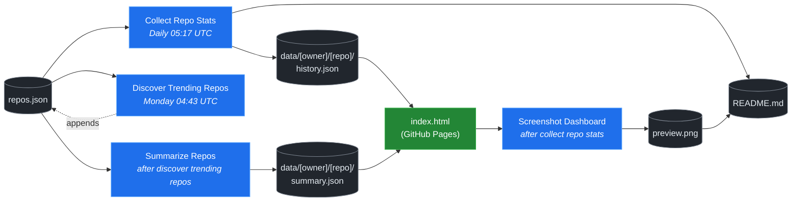

# 🚀 Rising Repos Tracker

> Automatically tracks daily GitHub stats (stars, forks, issues, velocity) for rising open source repos.

[](https://www.telosignal.com/)


**[→ View Live Dashboard](https://patrick-creates.github.io/rising-repos-tracker/)**

Built and maintained by [Telosignal](https://www.telosignal.com/).


<!-- AUTOGEN-STATS-START -->
## 📊 Current snapshot

> Auto-updated daily — last refreshed 2026-10-01

| Metric | Value |
|---|---|
| Repos tracked | **210** |
| Total stars | **10,225,307** |
| Total forks | **1,484,632** |
| Fastest growing | **VoiceStudio** (+1282.9/day) |

### 🔥 Top 5 by velocity

| # | Repo | Stars | Stars/day |
|---|---|---:|---:|
| 1 | [debpalash/VoiceStudio](https://github.com/debpalash/VoiceStudio) | 51,009 | +1282.9 |
| 2 | [DietrichGebert/ponytail](https://github.com/DietrichGebert/ponytail) | 149,729 | +1007.0 |
| 3 | [stablyai/orca](https://github.com/stablyai/orca) | 82,746 | +806.5 |
| 4 | [NousResearch/hermes-agent](https://github.com/NousResearch/hermes-agent) | 250,464 | +726.4 |
| 5 | [diegosouzapw/OmniRoute](https://github.com/diegosouzapw/OmniRoute) | 71,907 | +686.8 |

### 🆕 Recently added

- [blader/humanizer](https://github.com/blader/humanizer) — added 2026-09-28 — Agent skill that removes signs of AI-generated writing from text
- [LibreChat-AI/LibreChat](https://github.com/LibreChat-AI/LibreChat) — added 2026-09-28 — Enhanced ChatGPT Clone: Features Agents, MCP, Skills, DeepSeek, Anthropic, AWS, OpenAI, Responses API, Azure, Groq, o1, GPT-5, Mistral, OpenRouter, Vertex AI, Gemini, Artifacts, AI model switching, message search, Code Interpreter, langchain, DALL-E-3, OpenAPI Actions, Functions, Secure Multi-User Auth, Presets, open-source for self-hosting. Active
- [hypit-ai/hypit](https://github.com/hypit-ai/hypit) — added 2026-09-28 — Clone any viral video with AI agents. Not just a script, the whole workflow: swap the face, the words, the B-roll, ship 100 variants in one command, and get your 100M views.
<!-- AUTOGEN-STATS-END -->

<!-- AUTOGEN-DIAGRAM-START -->
## 🔄 How it works


```mermaid
graph LR
    repos[("repos.json")]:::data
    history[("data/[owner]/[repo]/<br/>history.json")]:::data
    summary[("data/[owner]/[repo]/<br/>summary.json")]:::data
    readme[("README.md")]:::data
    preview[("preview.png")]:::data
    dashboard["index.html<br/>(GitHub Pages)"]:::output
    collect_yml["Collect Repo Stats<br/><i>Daily 05:17 UTC</i>"]:::workflow
    discover_yml["Discover Trending Repos<br/><i>Monday 04:43 UTC</i>"]:::workflow
    screenshot_yml["Screenshot Dashboard<br/><i>after collect repo stats</i>"]:::workflow
    summarize_yml["Summarize Repos<br/><i>after discover trending repos</i>"]:::workflow
    repos --> collect_yml
    collect_yml --> history
    collect_yml --> readme
    repos --> discover_yml
    discover_yml -.->|appends| repos
    dashboard --> screenshot_yml
    screenshot_yml --> preview
    repos --> summarize_yml
    summarize_yml --> summary
    history --> dashboard
    summary --> dashboard
    preview --> readme
    classDef workflow fill:#1f6feb,stroke:#58a6ff,color:#fff
    classDef data fill:#21262d,stroke:#7d8590,color:#e6edf3
    classDef output fill:#238636,stroke:#3fb950,color:#fff
```
<!-- AUTOGEN-DIAGRAM-END -->

<!-- AUTOGEN-WORKFLOWS-START -->
## ⚙️ Workflows

| File | Schedule | Name |
|---|---|---|
| `collect.yml` | Daily 05:17 UTC | Collect Repo Stats |
| `discover.yml` | Monday 04:43 UTC | Discover Trending Repos |
| `screenshot.yml` | After Collect Repo Stats | Screenshot Dashboard |
| `summarize.yml` | After Discover Trending Repos | Summarize Repos |

> All workflows commit results directly back to the repo. Schedules are best-effort — GitHub Actions cron can drift by a few minutes.
<!-- AUTOGEN-WORKFLOWS-END -->

<!-- AUTOGEN-REPOS-START -->
## 📋 All tracked repos

| Repo | Stars | Forks | Stars/day |
|---|---:|---:|---:|
| [openclaw/openclaw](https://github.com/openclaw/openclaw) | 391,115 | 82,237 | +139.3 |
| [obra/superpowers](https://github.com/obra/superpowers) | 293,653 | 26,269 | +575.0 |
| [affaan-m/everything-claude-code](https://github.com/affaan-m/everything-claude-code) | 270,407 | 40,423 | +633.8 |
| [affaan-m/ECC](https://github.com/affaan-m/ECC) | 270,407 | 40,423 | +606.0 |
| [NousResearch/hermes-agent](https://github.com/NousResearch/hermes-agent) | 250,464 | 53,558 | +726.4 |
| [microsoft/markitdown](https://github.com/microsoft/markitdown) | 187,831 | 13,889 | +459.7 |
| [Significant-Gravitas/AutoGPT](https://github.com/Significant-Gravitas/AutoGPT) | 187,632 | 45,977 | +23.8 |
| [f/prompts.chat](https://github.com/f/prompts.chat) | 171,774 | 22,023 | +68.1 |
| [langgenius/dify](https://github.com/langgenius/dify) | 157,652 | 24,871 | +116.5 |
| [open-webui/open-webui](https://github.com/open-webui/open-webui) | 153,699 | 22,475 | +119.2 |
| [DietrichGebert/ponytail](https://github.com/DietrichGebert/ponytail) | 149,729 | 8,043 | +1007.0 |
| [langchain-ai/langchain](https://github.com/langchain-ai/langchain) | 147,347 | 24,674 | +76.0 |
| [github/spec-kit](https://github.com/github/spec-kit) | 139,661 | 12,513 | +296.5 |
| [farion1231/cc-switch](https://github.com/farion1231/cc-switch) | 139,290 | 9,394 | +479.8 |
| [nextlevelbuilder/ui-ux-pro-max-skill](https://github.com/nextlevelbuilder/ui-ux-pro-max-skill) | 132,182 | 14,021 | +385.0 |
| [Graphify-Labs/graphify](https://github.com/Graphify-Labs/graphify) | 122,919 | 11,854 | +397.3 |
| [microsoft/generative-ai-for-beginners](https://github.com/microsoft/generative-ai-for-beginners) | 120,885 | 63,577 | +71.9 |
| [JuliusBrussee/caveman](https://github.com/JuliusBrussee/caveman) | 108,653 | 6,299 | +346.6 |
| [nexu-io/open-design](https://github.com/nexu-io/open-design) | 99,002 | 11,460 | +403.1 |
| [ruvnet/RuView](https://github.com/ruvnet/RuView) | 95,786 | 12,645 | +231.7 |
| [thedotmack/claude-mem](https://github.com/thedotmack/claude-mem) | 95,063 | 8,417 | +139.6 |
| [vllm-project/vllm](https://github.com/vllm-project/vllm) | 93,010 | 22,887 | +93.1 |
| [Leonxlnx/taste-skill](https://github.com/Leonxlnx/taste-skill) | 91,659 | 6,230 | +502.0 |
| [OpenHands/OpenHands](https://github.com/OpenHands/OpenHands) | 89,698 | 11,845 | +115.9 |
| [ChatGPTNextWeb/NextChat](https://github.com/ChatGPTNextWeb/NextChat) | 88,830 | 58,953 | +5.8 |
| [koala73/worldmonitor](https://github.com/koala73/worldmonitor) | 87,642 | 13,369 | +244.7 |
| [Panniantong/Agent-Reach](https://github.com/Panniantong/Agent-Reach) | 87,054 | 7,664 | +552.8 |
| [lobehub/lobehub](https://github.com/lobehub/lobehub) | 82,941 | 15,949 | +42.1 |
| [stablyai/orca](https://github.com/stablyai/orca) | 82,746 | 5,366 | +806.5 |
| [rtk-ai/rtk](https://github.com/rtk-ai/rtk) | 82,150 | 5,213 | +239.5 |
| [datawhalechina/hello-agents](https://github.com/datawhalechina/hello-agents) | 81,459 | 10,131 | +226.5 |
| [dair-ai/Prompt-Engineering-Guide](https://github.com/dair-ai/Prompt-Engineering-Guide) | 78,759 | 8,653 | +29.8 |
| [shareAI-lab/learn-claude-code](https://github.com/shareAI-lab/learn-claude-code) | 77,864 | 12,498 | +123.4 |
| [unslothai/unsloth](https://github.com/unslothai/unsloth) | 77,106 | 7,096 | +92.7 |
| [openai/openai-cookbook](https://github.com/openai/openai-cookbook) | 76,296 | 12,901 | +19.8 |
| [ComposioHQ/awesome-claude-skills](https://github.com/ComposioHQ/awesome-claude-skills) | 76,275 | 8,886 | +116.8 |
| [chopratejas/headroom](https://github.com/chopratejas/headroom) | 74,214 | 5,739 | +426.4 |
| [headroomlabs-ai/headroom](https://github.com/headroomlabs-ai/headroom) | 74,214 | 5,739 | +280.3 |
| [santifer/career-ops](https://github.com/santifer/career-ops) | 73,190 | 13,763 | +205.5 |
| [career-ops-hq/career-ops](https://github.com/career-ops-hq/career-ops) | 73,190 | 13,763 | +117.0 |
| [diegosouzapw/OmniRoute](https://github.com/diegosouzapw/OmniRoute) | 71,907 | 10,264 | +686.8 |
| [Fission-AI/OpenSpec](https://github.com/Fission-AI/OpenSpec) | 70,833 | 4,864 | +162.1 |
| [code-yeongyu/oh-my-openagent](https://github.com/code-yeongyu/oh-my-openagent) | 69,715 | 5,736 | +83.7 |
| [asgeirtj/system_prompts_leaks](https://github.com/asgeirtj/system_prompts_leaks) | 68,703 | 11,163 | +208.2 |
| [shanraisshan/claude-code-best-practice](https://github.com/shanraisshan/claude-code-best-practice) | 66,917 | 6,688 | +98.7 |
| [xtekky/gpt4free](https://github.com/xtekky/gpt4free) | 66,737 | 13,494 | +3.6 |
| [usestrix/strix](https://github.com/usestrix/strix) | 65,858 | 7,217 | +329.1 |
| [ZhuLinsen/daily_stock_analysis](https://github.com/ZhuLinsen/daily_stock_analysis) | 65,825 | 54,935 | +209.2 |
| [mvanhorn/last30days-skill](https://github.com/mvanhorn/last30days-skill) | 63,313 | 5,511 | +266.5 |
| [rohitg00/ai-engineering-from-scratch](https://github.com/rohitg00/ai-engineering-from-scratch) | 62,259 | 10,652 | +294.2 |
| [calesthio/OpenMontage](https://github.com/calesthio/OpenMontage) | 62,076 | 7,915 | +364.1 |
| [tw93/Pake](https://github.com/tw93/Pake) | 61,849 | 12,734 | +96.1 |
| [BerriAI/litellm](https://github.com/BerriAI/litellm) | 59,980 | 11,948 | +92.6 |
| [MemPalace/mempalace](https://github.com/MemPalace/mempalace) | 59,377 | 7,563 | +51.3 |
| [jamiepine/voicebox](https://github.com/jamiepine/voicebox) | 56,087 | 6,999 | +221.8 |
| [FlowiseAI/Flowise](https://github.com/FlowiseAI/Flowise) | 55,490 | 25,058 | +19.0 |
| [heygen-com/hyperframes](https://github.com/heygen-com/hyperframes) | 55,005 | 4,998 | +256.0 |
| [hesreallyhim/awesome-claude-code](https://github.com/hesreallyhim/awesome-claude-code) | 54,881 | 4,778 | +79.3 |
| [ggml-org/whisper.cpp](https://github.com/ggml-org/whisper.cpp) | 54,067 | 6,200 | +31.2 |
| [router-for-me/CLIProxyAPI](https://github.com/router-for-me/CLIProxyAPI) | 53,681 | 8,093 | +146.8 |
| [blader/humanizer](https://github.com/blader/humanizer) | 53,255 | 4,249 | +247.3 |
| [ChromeDevTools/chrome-devtools-mcp](https://github.com/ChromeDevTools/chrome-devtools-mcp) | 52,832 | 5,276 | +95.2 |
| [coreyhaines31/marketingskills](https://github.com/coreyhaines31/marketingskills) | 52,085 | 7,851 | +169.2 |
| [bojieli/ai-agent-book](https://github.com/bojieli/ai-agent-book) | 51,983 | 5,853 | +603.2 |
| [debpalash/VoiceStudio](https://github.com/debpalash/VoiceStudio) | 51,009 | 5,654 | +1282.9 |
| [elder-plinius/CL4R1T4S](https://github.com/elder-plinius/CL4R1T4S) | 50,831 | 10,419 | +110.6 |
| [Imbad0202/academic-research-skills](https://github.com/Imbad0202/academic-research-skills) | 50,057 | 3,863 | +157.0 |
| [Aider-AI/aider](https://github.com/Aider-AI/aider) | 49,312 | 5,020 | +32.0 |
| [QuantumNous/new-api](https://github.com/QuantumNous/new-api) | 49,172 | 11,815 | +107.1 |
| [kepano/obsidian-skills](https://github.com/kepano/obsidian-skills) | 49,058 | 3,493 | +124.4 |
| [HKUDS/nanobot](https://github.com/HKUDS/nanobot) | 48,712 | 8,599 | +44.4 |
| [K-Dense-AI/scientific-agent-skills](https://github.com/K-Dense-AI/scientific-agent-skills) | 47,258 | 4,278 | +157.6 |
| [zhayujie/CowAgent](https://github.com/zhayujie/CowAgent) | 47,195 | 10,374 | +19.4 |
| [sickn33/antigravity-awesome-skills](https://github.com/sickn33/antigravity-awesome-skills) | 47,141 | 6,869 | +65.6 |
| [sickn33/agentic-awesome-skills](https://github.com/sickn33/agentic-awesome-skills) | 47,141 | 6,869 | +51.2 |
| [DeusData/codebase-memory-mcp](https://github.com/DeusData/codebase-memory-mcp) | 45,597 | 3,732 | +265.6 |
| [danny-avila/LibreChat](https://github.com/danny-avila/LibreChat) | 45,176 | 9,262 | +59.7 |
| [LibreChat-AI/LibreChat](https://github.com/LibreChat-AI/LibreChat) | 45,176 | 9,262 | +50.7 |
| [MadsLorentzen/ai-job-search](https://github.com/MadsLorentzen/ai-job-search) | 44,647 | 15,410 | +288.3 |
| [chatanywhere/GPT_API_free](https://github.com/chatanywhere/GPT_API_free) | 43,437 | 2,736 | +40.9 |
| [alibaba/open-code-review](https://github.com/alibaba/open-code-review) | 43,047 | 3,098 | +380.0 |
| [langchain-ai/langgraph](https://github.com/langchain-ai/langgraph) | 42,550 | 7,214 | +70.6 |
| [chatboxai/chatbox](https://github.com/chatboxai/chatbox) | 41,917 | 4,269 | +14.1 |
| [ogulcancelik/herdr](https://github.com/ogulcancelik/herdr) | 41,747 | 3,226 | +337.4 |
| [herdrdev/herdr](https://github.com/herdrdev/herdr) | 41,747 | 3,226 | +304.4 |
| [AstrBotDevs/AstrBot](https://github.com/AstrBotDevs/AstrBot) | 41,275 | 3,002 | +63.0 |
| [Hmbown/CodeWhale](https://github.com/Hmbown/CodeWhale) | 41,045 | 3,564 | +49.4 |
| [Hmbown/Codewhale](https://github.com/Hmbown/Codewhale) | 41,045 | 3,564 | +5.4 |
| [tinyhumansai/openhuman](https://github.com/tinyhumansai/openhuman) | 40,355 | 3,991 | +36.1 |
| [wshobson/agents](https://github.com/wshobson/agents) | 40,125 | 4,283 | +32.5 |
| [mindsdb/mindshub](https://github.com/mindsdb/mindshub) | 39,782 | 6,245 | +4.8 |
| [github/awesome-copilot](https://github.com/github/awesome-copilot) | 39,582 | 5,040 | +44.8 |
| [Yeachan-Heo/oh-my-claudecode](https://github.com/Yeachan-Heo/oh-my-claudecode) | 39,504 | 3,532 | +36.3 |
| [volcengine/OpenViking](https://github.com/volcengine/OpenViking) | 39,073 | 3,069 | +119.5 |
| [google/langextract](https://github.com/google/langextract) | 38,927 | 2,719 | +18.4 |
| [AlexsJones/llmfit](https://github.com/AlexsJones/llmfit) | 37,410 | 2,397 | +85.3 |
| [PDFMathTranslate/PDFMathTranslate](https://github.com/PDFMathTranslate/PDFMathTranslate) | 37,280 | 3,342 | +25.3 |
| [anthropics/claude-plugins-official](https://github.com/anthropics/claude-plugins-official) | 37,266 | 4,187 | +67.7 |
| [songquanpeng/one-api](https://github.com/songquanpeng/one-api) | 37,065 | 6,874 | +22.1 |
| [esengine/DeepSeek-Reasonix](https://github.com/esengine/DeepSeek-Reasonix) | 35,724 | 2,435 | +140.9 |
| [JCodesMore/ai-website-cloner-template](https://github.com/JCodesMore/ai-website-cloner-template) | 35,523 | 5,197 | +171.6 |
| [agentscope-ai/QwenPaw](https://github.com/agentscope-ai/QwenPaw) | 35,398 | 3,148 | +163.1 |
| [HKUDS/Vibe-Trading](https://github.com/HKUDS/Vibe-Trading) | 34,405 | 5,596 | +209.2 |
| [can1357/oh-my-pi](https://github.com/can1357/oh-my-pi) | 33,926 | 3,657 | +197.3 |
| [mukul975/Anthropic-Cybersecurity-Skills](https://github.com/mukul975/Anthropic-Cybersecurity-Skills) | 33,642 | 4,080 | +153.7 |
| [Gitlawb/openclaude](https://github.com/Gitlawb/openclaude) | 33,601 | 9,108 | +44.8 |
| [iOfficeAI/AionUi](https://github.com/iOfficeAI/AionUi) | 33,266 | 3,468 | +48.5 |
| [virgiliojr94/book-to-skill](https://github.com/virgiliojr94/book-to-skill) | 33,214 | 3,471 | +220.7 |
| [zeroclaw-labs/zeroclaw](https://github.com/zeroclaw-labs/zeroclaw) | 32,924 | 4,957 | +10.2 |
| [p-e-w/heretic](https://github.com/p-e-w/heretic) | 32,626 | 3,668 | +75.3 |
| [tirth8205/code-review-graph](https://github.com/tirth8205/code-review-graph) | 31,883 | 2,917 | +123.8 |
| [Tencent/WeKnora](https://github.com/Tencent/WeKnora) | 31,587 | 4,212 | +141.6 |
| [iOfficeAI/OfficeCLI](https://github.com/iOfficeAI/OfficeCLI) | 31,448 | 2,145 | +265.0 |
| [googleworkspace/cli](https://github.com/googleworkspace/cli) | 31,221 | 1,857 | +36.9 |
| [decolua/9router](https://github.com/decolua/9router) | 30,142 | 5,717 | +116.4 |
| [langchain-ai/deepagents](https://github.com/langchain-ai/deepagents) | 29,888 | 4,202 | +49.9 |
| [jackwener/OpenCLI](https://github.com/jackwener/OpenCLI) | 29,746 | 2,903 | +51.7 |
| [alibaba/page-agent](https://github.com/alibaba/page-agent) | 29,299 | 2,638 | +99.5 |
| [rohitg00/agentmemory](https://github.com/rohitg00/agentmemory) | 29,071 | 2,535 | +63.0 |
| [voideditor/void](https://github.com/voideditor/void) | 28,780 | 2,656 | — |
| [jarrodwatts/claude-hud](https://github.com/jarrodwatts/claude-hud) | 28,251 | 1,311 | +31.0 |
| [BloopAI/vibe-kanban](https://github.com/BloopAI/vibe-kanban) | 28,228 | 3,029 | +12.4 |
| [TencentCloud/TencentDB-Agent-Memory](https://github.com/TencentCloud/TencentDB-Agent-Memory) | 27,606 | 2,661 | +236.1 |
| [manaflow-ai/cmux](https://github.com/manaflow-ai/cmux) | 27,543 | 2,426 | +39.8 |
| [zai-org/Open-AutoGLM](https://github.com/zai-org/Open-AutoGLM) | 26,336 | 4,047 | +7.6 |
| [toon-format/toon](https://github.com/toon-format/toon) | 25,442 | 1,124 | +8.2 |
| [mksglu/context-mode](https://github.com/mksglu/context-mode) | 24,637 | 1,776 | +66.4 |
| [pascalorg/editor](https://github.com/pascalorg/editor) | 24,473 | 3,033 | +62.0 |
| [t8y2/dbx](https://github.com/t8y2/dbx) | 23,609 | 2,171 | +178.4 |
| [guillaumemeyer/watermarks-remover](https://github.com/guillaumemeyer/watermarks-remover) | 23,182 | 2,654 | +148.2 |
| [pranshuparmar/witr](https://github.com/pranshuparmar/witr) | 22,550 | 791 | +48.1 |
| [jundot/omlx](https://github.com/jundot/omlx) | 22,417 | 1,954 | +53.6 |
| [winfunc/opcode](https://github.com/winfunc/opcode) | 22,416 | 1,720 | +3.6 |
| [steipete/CodexBar](https://github.com/steipete/CodexBar) | 22,100 | 2,032 | +68.3 |
| [every-app/open-seo](https://github.com/every-app/open-seo) | 22,033 | 2,832 | +198.6 |
| [coze-dev/coze-studio](https://github.com/coze-dev/coze-studio) | 21,662 | 3,125 | +6.2 |
| [NirDiamant/agents-towards-production](https://github.com/NirDiamant/agents-towards-production) | 21,518 | 2,851 | +7.7 |
| [KKKKhazix/khazix-skills](https://github.com/KKKKhazix/khazix-skills) | 21,088 | 2,233 | +49.7 |
| [jnMetaCode/agency-agents-zh](https://github.com/jnMetaCode/agency-agents-zh) | 21,031 | 3,394 | +55.7 |
| [1jehuang/jcode](https://github.com/1jehuang/jcode) | 20,251 | 2,348 | +149.3 |
| [tanweai/pua](https://github.com/tanweai/pua) | 19,708 | 1,206 | +13.5 |
| [datawhalechina/easy-vibe](https://github.com/datawhalechina/easy-vibe) | 19,590 | 1,874 | +24.5 |
| [danielmiessler/LifeOS](https://github.com/danielmiessler/LifeOS) | 19,261 | 2,487 | +31.6 |
| [NVIDIA/SkillSpector](https://github.com/NVIDIA/SkillSpector) | 18,862 | 1,646 | +101.3 |
| [nesquena/hermes-webui](https://github.com/nesquena/hermes-webui) | 18,715 | 2,661 | +38.4 |
| [jlcodes99/cockpit-tools](https://github.com/jlcodes99/cockpit-tools) | 18,561 | 1,650 | +59.4 |
| [microsoft/agent-lightning](https://github.com/microsoft/agent-lightning) | 18,544 | 1,650 | +11.4 |
| [hypit-ai/hypit](https://github.com/hypit-ai/hypit) | 18,378 | 2,109 | +426.3 |
| [browser-use/browser-harness](https://github.com/browser-use/browser-harness) | 18,252 | 1,781 | +29.5 |
| [RightNow-AI/openfang](https://github.com/RightNow-AI/openfang) | 18,210 | 2,292 | +3.6 |
| [AgriciDaniel/claude-seo](https://github.com/AgriciDaniel/claude-seo) | 18,084 | 2,659 | +70.5 |
| [ifixai-ai/iFixAi](https://github.com/ifixai-ai/iFixAi) | 17,943 | 1,365 | +187.9 |
| [walkinglabs/learn-harness-engineering](https://github.com/walkinglabs/learn-harness-engineering) | 17,164 | 1,784 | +83.7 |
| [MemoriLabs/Memori](https://github.com/MemoriLabs/Memori) | 17,037 | 3,629 | +16.8 |
| [tradecatlabs/vibe-coding-cn](https://github.com/tradecatlabs/vibe-coding-cn) | 17,006 | 1,722 | +76.3 |
| [cft0808/edict](https://github.com/cft0808/edict) | 16,958 | 1,766 | +8.3 |
| [wanshuiyin/Auto-claude-code-research-in-sleep](https://github.com/wanshuiyin/Auto-claude-code-research-in-sleep) | 16,866 | 1,427 | +43.5 |
| [composio-community/awesome-codex-skills](https://github.com/composio-community/awesome-codex-skills) | 16,735 | 1,646 | +19.8 |
| [xbtlin/ai-berkshire](https://github.com/xbtlin/ai-berkshire) | 16,580 | 2,475 | +66.7 |
| [xpzouying/xiaohongshu-mcp](https://github.com/xpzouying/xiaohongshu-mcp) | 16,072 | 2,361 | +17.7 |
| [Anionex/banana-slides](https://github.com/Anionex/banana-slides) | 15,676 | 1,789 | +5.2 |
| [yusufkaraaslan/Skill_Seekers](https://github.com/yusufkaraaslan/Skill_Seekers) | 15,069 | 1,539 | +8.3 |
| [kyegomez/OpenMythos](https://github.com/kyegomez/OpenMythos) | 14,909 | 3,291 | +7.5 |
| [NanmiCoder/cc-haha](https://github.com/NanmiCoder/cc-haha) | 14,804 | 8,596 | +15.7 |
| [superset-sh/superset](https://github.com/superset-sh/superset) | 14,792 | 1,319 | +28.0 |
| [NevaMind-AI/memU](https://github.com/NevaMind-AI/memU) | 14,496 | 1,083 | +5.9 |
| [XiaomiMiMo/MiMo-Code](https://github.com/XiaomiMiMo/MiMo-Code) | 13,570 | 1,411 | +27.1 |
| [EverMind-AI/EverOS](https://github.com/EverMind-AI/EverOS) | 13,322 | 924 | +38.4 |
| [sirmalloc/ccstatusline](https://github.com/sirmalloc/ccstatusline) | 13,137 | 586 | +19.8 |
| [ConardLi/garden-skills](https://github.com/ConardLi/garden-skills) | 12,712 | 1,524 | +40.6 |
| [brokermr810/QuantDinger](https://github.com/brokermr810/QuantDinger) | 12,349 | 2,525 | +35.2 |
| [OpenByteInc/QuantDinger](https://github.com/OpenByteInc/QuantDinger) | 12,349 | 2,525 | +34.9 |
| [0x4m4/hexstrike-ai](https://github.com/0x4m4/hexstrike-ai) | 12,273 | 2,498 | +24.1 |
| [MemTensor/MemOS](https://github.com/MemTensor/MemOS) | 11,668 | 1,066 | +17.5 |
| [holaboss-ai/holaOS](https://github.com/holaboss-ai/holaOS) | 11,453 | 729 | +68.5 |
| [dataelement/dsh-desktop](https://github.com/dataelement/dsh-desktop) | 11,353 | 419 | +302.3 |
| [getagentseal/codeburn](https://github.com/getagentseal/codeburn) | 11,296 | 868 | +32.5 |
| [EKKOLearnAI/hermes-studio](https://github.com/EKKOLearnAI/hermes-studio) | 11,266 | 1,390 | +27.7 |
| [EKKOLearnAI/ekko-studio](https://github.com/EKKOLearnAI/ekko-studio) | 11,266 | 1,390 | +14.0 |
| [aden-hive/hive](https://github.com/aden-hive/hive) | 11,097 | 5,656 | +5.2 |
| [ValueCell-ai/valuecell](https://github.com/ValueCell-ai/valuecell) | 11,028 | 1,807 | +1.7 |
| [openai/codex-security](https://github.com/openai/codex-security) | 10,947 | 834 | +45.2 |
| [Kuberwastaken/claurst](https://github.com/Kuberwastaken/claurst) | 10,313 | 7,717 | +4.8 |
| [ykdojo/claude-code-tips](https://github.com/ykdojo/claude-code-tips) | 10,175 | 824 | +13.3 |
| [StarTrail-org/PixelRAG](https://github.com/StarTrail-org/PixelRAG) | 10,122 | 868 | +44.2 |
| [Companion-Inc/feynman](https://github.com/Companion-Inc/feynman) | 9,853 | 1,097 | +13.7 |
| [frankbria/ralph-claude-code](https://github.com/frankbria/ralph-claude-code) | 9,641 | 722 | +3.8 |
| [trailhq/Graft](https://github.com/trailhq/Graft) | 9,463 | 866 | +110.2 |
| [modem-dev/hunk](https://github.com/modem-dev/hunk) | 9,454 | 312 | +34.4 |
| [Nasiko-Labs/nasiko](https://github.com/Nasiko-Labs/nasiko) | 9,353 | 1,948 | +115.0 |
| [EvoMap/evolver](https://github.com/EvoMap/evolver) | 9,130 | 850 | +3.2 |
| [iflytek/astron-agent](https://github.com/iflytek/astron-agent) | 9,103 | 910 | +5.7 |
| [1weiho/open-slide](https://github.com/1weiho/open-slide) | 8,613 | 603 | +48.0 |
| [open-slide/open-slide](https://github.com/open-slide/open-slide) | 8,613 | 603 | +110.7 |
| [MiroMindAI/MiroThinker](https://github.com/MiroMindAI/MiroThinker) | 8,435 | 649 | +1.3 |
| [genspark-ai/genoffice](https://github.com/genspark-ai/genoffice) | 8,299 | 1,075 | +90.9 |
| [mmulet/term.everything](https://github.com/mmulet/term.everything) | 8,103 | 196 | +0.9 |
| [Tencent/BrowserSkill](https://github.com/Tencent/BrowserSkill) | 7,998 | 564 | +112.7 |
| [ValueCell-ai/ClawX](https://github.com/ValueCell-ai/ClawX) | 7,612 | 1,142 | +0.9 |
| [rorkai/App-Store-Connect-CLI](https://github.com/rorkai/App-Store-Connect-CLI) | 7,551 | 637 | +27.2 |
| [WenyuChiou/awesome-agentic-ai-zh](https://github.com/WenyuChiou/awesome-agentic-ai-zh) | 7,239 | 979 | +22.2 |
| [opensquilla/opensquilla](https://github.com/opensquilla/opensquilla) | 7,070 | 576 | +11.8 |
| [TokenRhythm/opensquilla](https://github.com/TokenRhythm/opensquilla) | 7,070 | 576 | +4.3 |
| [tech-leads-club/agent-skills](https://github.com/tech-leads-club/agent-skills) | 7,023 | 559 | +45.2 |
| [Andyyyy64/whichllm](https://github.com/Andyyyy64/whichllm) | 6,707 | 371 | +11.5 |
| [steipete/summarize](https://github.com/steipete/summarize) | 6,675 | 448 | +3.3 |
| [Arthur-Ficial/apfel](https://github.com/Arthur-Ficial/apfel) | 6,446 | 246 | +4.1 |
| [microsoft/fara](https://github.com/microsoft/fara) | 6,205 | 605 | +2.6 |
| [UfoMiao/zcf](https://github.com/UfoMiao/zcf) | 6,083 | 423 | +0.2 |
| [re4/LibreCode](https://github.com/re4/LibreCode) | 89 | 5 | — |
<!-- AUTOGEN-REPOS-END -->

---

## What it does

- Collects daily snapshots of stars, forks, watchers and open issues for every tracked repo
- Discovers new trending repos automatically every Monday using the GitHub Search API
- Generates AI summaries (use cases, similar tools, tags) for each tracked repo via GitHub Models
- Stores all history as plain JSON — no database, no backend
- Renders a live dashboard via GitHub Pages — updates daily, zero maintenance

## Tracked repos

Data lives in [`data/`](./data) — one folder per repo, one `history.json` per entry.  
The full watch list is in [`repos.json`](./repos.json).

## Fork & use it for yourself

This is my personal tracker — the watch list reflects what I find interesting. If you want to track different repos, the best path is to **fork this repo and run your own**.

### Setup

1. Fork this repo to your account
2. Replace the contents of [`repos.json`](./repos.json) with the repos you want to track (or just leave one entry — `discover.yml` will auto-add more every Monday)
3. Go to **Settings → Pages** and enable GitHub Pages from the `main` branch
4. Go to **Actions** and run **Collect Repo Stats** once manually to seed your first data point
5. Your dashboard will be live at `https://YOUR-USERNAME.github.io/rising-repos-tracker/`

That's it — daily collection and weekly discovery run automatically on schedule. Zero ongoing maintenance.

### Customizing what gets discovered

Edit [`scripts/discover.js`](./scripts/discover.js) to change:

- `MIN_STARS` — minimum star threshold for candidates
- `MAX_AGE_DAYS` — how recent a repo must be
- `MAX_NEW_REPOS` — how many to add per discovery run
- The `queries` array — GitHub Search API queries that define what "trending" means to you

### Adding a repo manually

Just edit `repos.json` directly:

```json
{
  "owner": "OWNER",
  "repo": "REPO",
  "added": "YYYY-MM-DD",
  "notes": "why you're tracking this"
}
```

The next daily collect run picks it up automatically.

## Stack

- **GitHub Actions** — scheduling and automation
- **GitHub Pages** — dashboard hosting
- **GitHub API** — data source
- **GitHub Models** — free AI summaries (gpt-4o-mini)
- **Chart.js** — star growth visualization
- **Mermaid** — architecture diagram (rendered by GitHub)
- No dependencies, no build step, no database

## License

MIT
