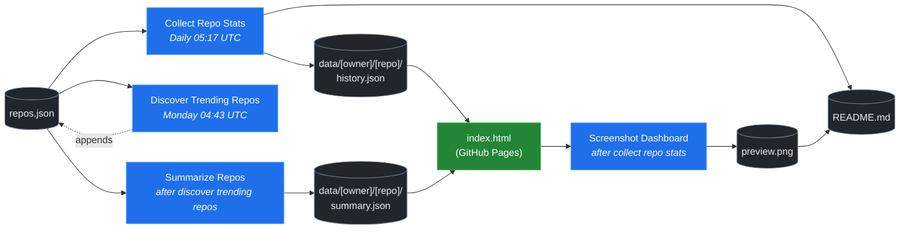

# 🚀 Rising Repos Tracker

> Automatically tracks daily GitHub stats (stars, forks, issues, velocity) for rising open source repos.

[](https://www.telosignal.com/)


**[→ View Live Dashboard](https://patrick-creates.github.io/rising-repos-tracker/)**

Built and maintained by [Telosignal](https://www.telosignal.com/).


<!-- AUTOGEN-STATS-START -->
## 📊 Current snapshot

> Auto-updated daily — last refreshed 2026-10-17

| Metric | Value |
|---|---|
| Repos tracked | **217** |
| Total stars | **11,119,226** |
| Total forks | **1,637,069** |
| Fastest growing | **rea** (+32521.0/day) |

### 🔥 Top 5 by velocity

| # | Repo | Stars | Stars/day |
|---|---|---:|---:|
| 1 | [morluto/rea](https://github.com/morluto/rea) | 296,834 | +32521.0 |
| 2 | [debpalash/VoiceStudio](https://github.com/debpalash/VoiceStudio) | 71,923 | +1292.6 |
| 3 | [DietrichGebert/ponytail](https://github.com/DietrichGebert/ponytail) | 165,429 | +1003.5 |
| 4 | [stablyai/orca](https://github.com/stablyai/orca) | 94,746 | +797.7 |
| 5 | [NousResearch/hermes-agent](https://github.com/NousResearch/hermes-agent) | 254,524 | +678.2 |

### 🆕 Recently added

- [morluto/rea](https://github.com/morluto/rea) — added 2026-10-12 — Reverse engineer anything with agents, from app behavior down to native binaries.
- [TencentCloud/Octop](https://github.com/TencentCloud/Octop) — added 2026-10-12 — A smarter, self-hosted AI assistant — multi-user, multi-agent.
- [tt-a1i/archify](https://github.com/tt-a1i/archify) — added 2026-10-05 — Turn any idea, plan, or codebase into a beautiful interactive diagram. An agent skill for Claude Code, Codex, and more.
<!-- AUTOGEN-STATS-END -->

<!-- AUTOGEN-DIAGRAM-START -->
## 🔄 How it works


```mermaid
graph LR
    repos[("repos.json")]:::data
    history[("data/[owner]/[repo]/<br/>history.json")]:::data
    summary[("data/[owner]/[repo]/<br/>summary.json")]:::data
    readme[("README.md")]:::data
    preview[("preview.png")]:::data
    dashboard["index.html<br/>(GitHub Pages)"]:::output
    collect_yml["Collect Repo Stats<br/><i>Daily 05:17 UTC</i>"]:::workflow
    discover_yml["Discover Trending Repos<br/><i>Monday 04:43 UTC</i>"]:::workflow
    screenshot_yml["Screenshot Dashboard<br/><i>after collect repo stats</i>"]:::workflow
    summarize_yml["Summarize Repos<br/><i>after discover trending repos</i>"]:::workflow
    repos --> collect_yml
    collect_yml --> history
    collect_yml --> readme
    repos --> discover_yml
    discover_yml -.->|appends| repos
    dashboard --> screenshot_yml
    screenshot_yml --> preview
    repos --> summarize_yml
    summarize_yml --> summary
    history --> dashboard
    summary --> dashboard
    preview --> readme
    classDef workflow fill:#1f6feb,stroke:#58a6ff,color:#fff
    classDef data fill:#21262d,stroke:#7d8590,color:#e6edf3
    classDef output fill:#238636,stroke:#3fb950,color:#fff
```
<!-- AUTOGEN-DIAGRAM-END -->

<!-- AUTOGEN-WORKFLOWS-START -->
## ⚙️ Workflows

| File | Schedule | Name |
|---|---|---|
| `collect.yml` | Daily 05:17 UTC | Collect Repo Stats |
| `discover.yml` | Monday 04:43 UTC | Discover Trending Repos |
| `screenshot.yml` | After Collect Repo Stats | Screenshot Dashboard |
| `summarize.yml` | After Discover Trending Repos | Summarize Repos |

> All workflows commit results directly back to the repo. Schedules are best-effort — GitHub Actions cron can drift by a few minutes.
<!-- AUTOGEN-WORKFLOWS-END -->

<!-- AUTOGEN-REPOS-START -->
## 📋 All tracked repos

| Repo | Stars | Forks | Stars/day |
|---|---:|---:|---:|
| [openclaw/openclaw](https://github.com/openclaw/openclaw) | 392,238 | 82,459 | +132.3 |
| [obra/superpowers](https://github.com/obra/superpowers) | 300,894 | 26,863 | +558.3 |
| [morluto/rea](https://github.com/morluto/rea) | 296,834 | 74,977 | +32521.0 |
| [affaan-m/everything-claude-code](https://github.com/affaan-m/everything-claude-code) | 281,822 | 41,906 | +641.9 |
| [affaan-m/ECC](https://github.com/affaan-m/ECC) | 281,822 | 41,906 | +617.9 |
| [NousResearch/hermes-agent](https://github.com/NousResearch/hermes-agent) | 254,524 | 55,305 | +678.2 |
| [microsoft/markitdown](https://github.com/microsoft/markitdown) | 190,685 | 14,177 | +431.1 |
| [Significant-Gravitas/AutoGPT](https://github.com/Significant-Gravitas/AutoGPT) | 187,620 | 45,909 | +21.3 |
| [f/prompts.chat](https://github.com/f/prompts.chat) | 173,213 | 22,160 | +70.3 |
| [DietrichGebert/ponytail](https://github.com/DietrichGebert/ponytail) | 165,429 | 8,936 | +1003.5 |
| [langgenius/dify](https://github.com/langgenius/dify) | 158,689 | 25,081 | +111.2 |
| [open-webui/open-webui](https://github.com/open-webui/open-webui) | 155,943 | 22,694 | +121.3 |
| [langchain-ai/langchain](https://github.com/langchain-ai/langchain) | 147,966 | 24,838 | +72.2 |
| [farion1231/cc-switch](https://github.com/farion1231/cc-switch) | 145,362 | 9,617 | +469.2 |
| [github/spec-kit](https://github.com/github/spec-kit) | 141,594 | 12,671 | +278.6 |
| [nextlevelbuilder/ui-ux-pro-max-skill](https://github.com/nextlevelbuilder/ui-ux-pro-max-skill) | 136,684 | 14,528 | +374.5 |
| [Graphify-Labs/graphify](https://github.com/Graphify-Labs/graphify) | 127,391 | 12,282 | +374.3 |
| [microsoft/generative-ai-for-beginners](https://github.com/microsoft/generative-ai-for-beginners) | 121,504 | 64,037 | +68.5 |
| [JuliusBrussee/caveman](https://github.com/JuliusBrussee/caveman) | 113,130 | 6,549 | +339.6 |
| [nexu-io/open-design](https://github.com/nexu-io/open-design) | 101,750 | 11,694 | +378.8 |
| [thedotmack/claude-mem](https://github.com/thedotmack/claude-mem) | 101,280 | 8,870 | +165.0 |
| [Panniantong/Agent-Reach](https://github.com/Panniantong/Agent-Reach) | 98,418 | 8,651 | +572.1 |
| [ruvnet/RuView](https://github.com/ruvnet/RuView) | 98,393 | 12,900 | +224.1 |
| [Leonxlnx/taste-skill](https://github.com/Leonxlnx/taste-skill) | 98,177 | 6,668 | +491.0 |
| [stablyai/orca](https://github.com/stablyai/orca) | 94,746 | 6,061 | +797.7 |
| [vllm-project/vllm](https://github.com/vllm-project/vllm) | 93,970 | 23,481 | +89.7 |
| [OpenHands/OpenHands](https://github.com/OpenHands/OpenHands) | 91,097 | 12,081 | +112.9 |
| [ChatGPTNextWeb/NextChat](https://github.com/ChatGPTNextWeb/NextChat) | 88,851 | 58,796 | +5.4 |
| [koala73/worldmonitor](https://github.com/koala73/worldmonitor) | 88,583 | 13,567 | +225.1 |
| [tt-a1i/archify](https://github.com/tt-a1i/archify) | 84,608 | 5,726 | +564.6 |
| [rtk-ai/rtk](https://github.com/rtk-ai/rtk) | 83,670 | 5,316 | +224.3 |
| [datawhalechina/hello-agents](https://github.com/datawhalechina/hello-agents) | 83,464 | 10,344 | +215.8 |
| [lobehub/lobehub](https://github.com/lobehub/lobehub) | 83,280 | 15,987 | +40.0 |
| [dair-ai/Prompt-Engineering-Guide](https://github.com/dair-ai/Prompt-Engineering-Guide) | 79,245 | 8,703 | +29.9 |
| [shareAI-lab/learn-claude-code](https://github.com/shareAI-lab/learn-claude-code) | 78,731 | 12,595 | +116.1 |
| [unslothai/unsloth](https://github.com/unslothai/unsloth) | 78,148 | 7,219 | +89.8 |
| [diegosouzapw/OmniRoute](https://github.com/diegosouzapw/OmniRoute) | 77,487 | 11,220 | +634.3 |
| [ComposioHQ/awesome-claude-skills](https://github.com/ComposioHQ/awesome-claude-skills) | 77,266 | 9,156 | +111.0 |
| [openai/openai-cookbook](https://github.com/openai/openai-cookbook) | 76,660 | 12,941 | +20.1 |
| [ruvnet/ruflo](https://github.com/ruvnet/ruflo) | 75,772 | 8,978 | +156.8 |
| [chopratejas/headroom](https://github.com/chopratejas/headroom) | 75,550 | 5,864 | +382.2 |
| [headroomlabs-ai/headroom](https://github.com/headroomlabs-ai/headroom) | 75,550 | 5,864 | +253.4 |
| [santifer/career-ops](https://github.com/santifer/career-ops) | 75,288 | 14,045 | +197.6 |
| [career-ops-hq/career-ops](https://github.com/career-ops-hq/career-ops) | 75,288 | 14,045 | +122.7 |
| [Fission-AI/OpenSpec](https://github.com/Fission-AI/OpenSpec) | 72,189 | 4,935 | +154.0 |
| [debpalash/VoiceStudio](https://github.com/debpalash/VoiceStudio) | 71,923 | 7,859 | +1292.6 |
| [rohitg00/ai-engineering-from-scratch](https://github.com/rohitg00/ai-engineering-from-scratch) | 70,451 | 12,393 | +319.5 |
| [code-yeongyu/oh-my-openagent](https://github.com/code-yeongyu/oh-my-openagent) | 70,120 | 5,766 | +77.6 |
| [asgeirtj/system_prompts_leaks](https://github.com/asgeirtj/system_prompts_leaks) | 69,776 | 11,340 | +193.4 |
| [usestrix/strix](https://github.com/usestrix/strix) | 69,094 | 7,669 | +314.4 |
| [calesthio/OpenMontage](https://github.com/calesthio/OpenMontage) | 68,975 | 8,862 | +373.9 |
| [shanraisshan/claude-code-best-practice](https://github.com/shanraisshan/claude-code-best-practice) | 67,659 | 6,747 | +93.2 |
| [xtekky/gpt4free](https://github.com/xtekky/gpt4free) | 66,887 | 13,473 | +4.3 |
| [ZhuLinsen/daily_stock_analysis](https://github.com/ZhuLinsen/daily_stock_analysis) | 66,503 | 55,322 | +190.8 |
| [heygen-com/hyperframes](https://github.com/heygen-com/hyperframes) | 65,535 | 5,908 | +305.1 |
| [mvanhorn/last30days-skill](https://github.com/mvanhorn/last30days-skill) | 64,532 | 5,631 | +243.2 |
| [tw93/Pake](https://github.com/tw93/Pake) | 62,143 | 12,785 | +87.9 |
| [BerriAI/litellm](https://github.com/BerriAI/litellm) | 61,418 | 12,424 | +92.3 |
| [MemPalace/mempalace](https://github.com/MemPalace/mempalace) | 59,601 | 7,562 | +47.4 |
| [jamiepine/voicebox](https://github.com/jamiepine/voicebox) | 57,763 | 7,239 | +208.3 |
| [blader/humanizer](https://github.com/blader/humanizer) | 57,659 | 4,562 | +270.8 |
| [hesreallyhim/awesome-claude-code](https://github.com/hesreallyhim/awesome-claude-code) | 55,868 | 4,828 | +77.5 |
| [FlowiseAI/Flowise](https://github.com/FlowiseAI/Flowise) | 55,510 | 25,060 | +17.2 |
| [router-for-me/CLIProxyAPI](https://github.com/router-for-me/CLIProxyAPI) | 55,487 | 8,479 | +143.1 |
| [coreyhaines31/marketingskills](https://github.com/coreyhaines31/marketingskills) | 55,164 | 8,170 | +171.9 |
| [bojieli/ai-agent-book](https://github.com/bojieli/ai-agent-book) | 54,633 | 6,238 | +524.5 |
| [ggml-org/whisper.cpp](https://github.com/ggml-org/whisper.cpp) | 54,444 | 6,263 | +30.4 |
| [ChromeDevTools/chrome-devtools-mcp](https://github.com/ChromeDevTools/chrome-devtools-mcp) | 53,698 | 6,853 | +90.9 |
| [Imbad0202/academic-research-skills](https://github.com/Imbad0202/academic-research-skills) | 52,476 | 4,021 | +155.9 |
| [K-Dense-AI/scientific-agent-skills](https://github.com/K-Dense-AI/scientific-agent-skills) | 51,825 | 4,591 | +208.7 |
| [elder-plinius/CL4R1T4S](https://github.com/elder-plinius/CL4R1T4S) | 51,323 | 10,513 | +100.3 |
| [QuantumNous/new-api](https://github.com/QuantumNous/new-api) | 50,105 | 12,071 | +101.7 |
| [kepano/obsidian-skills](https://github.com/kepano/obsidian-skills) | 49,668 | 3,523 | +114.4 |
| [Aider-AI/aider](https://github.com/Aider-AI/aider) | 49,594 | 5,064 | +30.5 |
| [HKUDS/nanobot](https://github.com/HKUDS/nanobot) | 49,114 | 8,638 | +42.3 |
| [MadsLorentzen/ai-job-search](https://github.com/MadsLorentzen/ai-job-search) | 48,995 | 16,708 | +285.5 |
| [sickn33/antigravity-awesome-skills](https://github.com/sickn33/antigravity-awesome-skills) | 47,748 | 6,968 | +62.6 |
| [sickn33/agentic-awesome-skills](https://github.com/sickn33/agentic-awesome-skills) | 47,748 | 6,968 | +49.0 |
| [alibaba/open-code-review](https://github.com/alibaba/open-code-review) | 47,516 | 3,467 | +364.4 |
| [zhayujie/CowAgent](https://github.com/zhayujie/CowAgent) | 47,440 | 10,396 | +19.0 |
| [DeusData/codebase-memory-mcp](https://github.com/DeusData/codebase-memory-mcp) | 46,738 | 3,850 | +237.3 |
| [danny-avila/LibreChat](https://github.com/danny-avila/LibreChat) | 45,844 | 9,417 | +57.8 |
| [LibreChat-AI/LibreChat](https://github.com/LibreChat-AI/LibreChat) | 45,844 | 9,417 | +43.2 |
| [ogulcancelik/herdr](https://github.com/ogulcancelik/herdr) | 44,434 | 3,526 | +311.0 |
| [herdrdev/herdr](https://github.com/herdrdev/herdr) | 44,434 | 3,526 | +275.3 |
| [chatanywhere/GPT_API_free](https://github.com/chatanywhere/GPT_API_free) | 44,345 | 2,746 | +42.7 |
| [langchain-ai/langgraph](https://github.com/langchain-ai/langgraph) | 43,388 | 7,394 | +68.1 |
| [tinyhumansai/openhuman](https://github.com/tinyhumansai/openhuman) | 42,123 | 4,156 | +65.8 |
| [chatboxai/chatbox](https://github.com/chatboxai/chatbox) | 42,040 | 4,280 | +13.4 |
| [AstrBotDevs/AstrBot](https://github.com/AstrBotDevs/AstrBot) | 42,032 | 3,076 | +61.2 |
| [Hmbown/CodeWhale](https://github.com/Hmbown/CodeWhale) | 41,091 | 3,568 | +44.3 |
| [Hmbown/Codewhale](https://github.com/Hmbown/Codewhale) | 41,091 | 3,568 | +4.4 |
| [codewhale-hq/Codewhale](https://github.com/codewhale-hq/Codewhale) | 41,091 | 3,568 | +3.6 |
| [anthropics/claude-plugins-official](https://github.com/anthropics/claude-plugins-official) | 41,009 | 4,424 | +86.9 |
| [wshobson/agents](https://github.com/wshobson/agents) | 40,941 | 4,344 | +34.5 |
| [volcengine/OpenViking](https://github.com/volcengine/OpenViking) | 40,144 | 3,201 | +113.1 |
| [github/awesome-copilot](https://github.com/github/awesome-copilot) | 40,109 | 5,145 | +43.5 |
| [Yeachan-Heo/oh-my-claudecode](https://github.com/Yeachan-Heo/oh-my-claudecode) | 39,986 | 3,585 | +35.6 |
| [mindsdb/mindshub](https://github.com/mindsdb/mindshub) | 39,798 | 6,241 | +4.1 |
| [google/langextract](https://github.com/google/langextract) | 38,963 | 2,716 | +16.6 |
| [AlexsJones/llmfit](https://github.com/AlexsJones/llmfit) | 38,005 | 2,440 | +79.7 |
| [PDFMathTranslate/PDFMathTranslate](https://github.com/PDFMathTranslate/PDFMathTranslate) | 37,612 | 3,371 | +24.8 |
| [songquanpeng/one-api](https://github.com/songquanpeng/one-api) | 37,183 | 6,889 | +20.5 |
| [JCodesMore/ai-website-cloner-template](https://github.com/JCodesMore/ai-website-cloner-template) | 36,905 | 5,428 | +160.6 |
| [esengine/DeepSeek-Reasonix](https://github.com/esengine/DeepSeek-Reasonix) | 35,823 | 2,456 | +124.4 |
| [agentscope-ai/QwenPaw](https://github.com/agentscope-ai/QwenPaw) | 35,778 | 3,187 | +145.2 |
| [can1357/oh-my-pi](https://github.com/can1357/oh-my-pi) | 35,719 | 3,916 | +185.7 |
| [HKUDS/Vibe-Trading](https://github.com/HKUDS/Vibe-Trading) | 35,672 | 5,784 | +190.3 |
| [p-e-w/heretic](https://github.com/p-e-w/heretic) | 35,577 | 4,028 | +88.6 |
| [virgiliojr94/book-to-skill](https://github.com/virgiliojr94/book-to-skill) | 35,108 | 3,695 | +190.4 |
| [mukul975/Anthropic-Cybersecurity-Skills](https://github.com/mukul975/Anthropic-Cybersecurity-Skills) | 34,591 | 4,219 | +140.8 |
| [Tencent/WeKnora](https://github.com/Tencent/WeKnora) | 34,450 | 4,592 | +146.4 |
| [Gitlawb/openclaude](https://github.com/Gitlawb/openclaude) | 33,956 | 9,165 | +42.2 |
| [Twigpine/openclaude](https://github.com/Twigpine/openclaude) | 33,956 | 9,165 | +25.9 |
| [iOfficeAI/AionUi](https://github.com/iOfficeAI/AionUi) | 33,590 | 3,489 | +45.2 |
| [zeroclaw-labs/zeroclaw](https://github.com/zeroclaw-labs/zeroclaw) | 32,983 | 4,974 | +9.5 |
| [tirth8205/code-review-graph](https://github.com/tirth8205/code-review-graph) | 32,213 | 2,982 | +110.5 |
| [iOfficeAI/OfficeCLI](https://github.com/iOfficeAI/OfficeCLI) | 32,097 | 2,187 | +230.1 |
| [googleworkspace/cli](https://github.com/googleworkspace/cli) | 31,581 | 1,941 | +35.2 |
| [decolua/9router](https://github.com/decolua/9router) | 30,943 | 6,071 | +107.8 |
| [mksglu/context-mode](https://github.com/mksglu/context-mode) | 30,366 | 2,157 | +104.0 |
| [langchain-ai/deepagents](https://github.com/langchain-ai/deepagents) | 30,351 | 4,276 | +47.3 |
| [jackwener/OpenCLI](https://github.com/jackwener/OpenCLI) | 30,349 | 2,996 | +50.0 |
| [rohitg00/agentmemory](https://github.com/rohitg00/agentmemory) | 29,604 | 2,609 | +59.4 |
| [alibaba/page-agent](https://github.com/alibaba/page-agent) | 29,460 | 2,727 | +87.9 |
| [TencentCloud/TencentDB-Agent-Memory](https://github.com/TencentCloud/TencentDB-Agent-Memory) | 29,449 | 2,883 | +215.9 |
| [ifixai-ai/iFixAi](https://github.com/ifixai-ai/iFixAi) | 28,905 | 1,567 | +304.9 |
| [voideditor/void](https://github.com/voideditor/void) | 28,751 | 2,657 | — |
| [jarrodwatts/claude-hud](https://github.com/jarrodwatts/claude-hud) | 28,604 | 1,350 | +29.9 |
| [BloopAI/vibe-kanban](https://github.com/BloopAI/vibe-kanban) | 28,379 | 3,034 | +12.1 |
| [manaflow-ai/cmux](https://github.com/manaflow-ai/cmux) | 28,226 | 2,520 | +40.3 |
| [t8y2/dbx](https://github.com/t8y2/dbx) | 27,028 | 2,449 | +185.3 |
| [zai-org/Open-AutoGLM](https://github.com/zai-org/Open-AutoGLM) | 26,417 | 4,054 | +7.3 |
| [toon-format/toon](https://github.com/toon-format/toon) | 25,507 | 1,170 | +7.7 |
| [pascalorg/editor](https://github.com/pascalorg/editor) | 24,920 | 3,095 | +54.0 |
| [guillaumemeyer/watermarks-remover](https://github.com/guillaumemeyer/watermarks-remover) | 24,285 | 2,787 | +124.7 |
| [every-app/open-seo](https://github.com/every-app/open-seo) | 23,874 | 3,189 | +158.1 |
| [hypit-ai/hypit](https://github.com/hypit-ai/hypit) | 22,917 | 2,619 | +306.2 |
| [jundot/omlx](https://github.com/jundot/omlx) | 22,878 | 2,072 | +50.4 |
| [pranshuparmar/witr](https://github.com/pranshuparmar/witr) | 22,708 | 831 | +42.5 |
| [steipete/CodexBar](https://github.com/steipete/CodexBar) | 22,584 | 2,126 | +63.1 |
| [winfunc/opcode](https://github.com/winfunc/opcode) | 22,411 | 1,764 | +3.1 |
| [coze-dev/coze-studio](https://github.com/coze-dev/coze-studio) | 21,719 | 3,130 | +5.9 |
| [NirDiamant/agents-towards-production](https://github.com/NirDiamant/agents-towards-production) | 21,719 | 2,880 | +8.3 |
| [KKKKhazix/khazix-skills](https://github.com/KKKKhazix/khazix-skills) | 21,475 | 2,295 | +45.1 |
| [jnMetaCode/agency-agents-zh](https://github.com/jnMetaCode/agency-agents-zh) | 21,329 | 3,483 | +50.6 |
| [1jehuang/jcode](https://github.com/1jehuang/jcode) | 20,953 | 2,427 | +131.8 |
| [NVIDIA/SkillSpector](https://github.com/NVIDIA/SkillSpector) | 20,398 | 1,792 | +98.7 |
| [walkinglabs/learn-harness-engineering](https://github.com/walkinglabs/learn-harness-engineering) | 20,041 | 2,259 | +98.6 |
| [datawhalechina/easy-vibe](https://github.com/datawhalechina/easy-vibe) | 19,762 | 1,886 | +22.8 |
| [tanweai/pua](https://github.com/tanweai/pua) | 19,719 | 1,203 | +11.9 |
| [danielmiessler/LifeOS](https://github.com/danielmiessler/LifeOS) | 19,481 | 2,499 | +29.2 |
| [AgriciDaniel/claude-seo](https://github.com/AgriciDaniel/claude-seo) | 19,086 | 2,781 | +66.7 |
| [jlcodes99/cockpit-tools](https://github.com/jlcodes99/cockpit-tools) | 19,048 | 1,689 | +52.6 |
| [nesquena/hermes-webui](https://github.com/nesquena/hermes-webui) | 18,980 | 2,742 | +35.4 |
| [microsoft/agent-lightning](https://github.com/microsoft/agent-lightning) | 18,732 | 1,736 | +11.5 |
| [browser-use/browser-harness](https://github.com/browser-use/browser-harness) | 18,459 | 1,858 | +27.1 |
| [RightNow-AI/openfang](https://github.com/RightNow-AI/openfang) | 18,212 | 2,343 | +3.1 |
| [rocketride-org/rocketride-server](https://github.com/rocketride-org/rocketride-server) | 17,758 | 7,531 | — |
| [tradecatlabs/vibe-coding-cn](https://github.com/tradecatlabs/vibe-coding-cn) | 17,643 | 1,812 | +45.6 |
| [wanshuiyin/Auto-claude-code-research-in-sleep](https://github.com/wanshuiyin/Auto-claude-code-research-in-sleep) | 17,605 | 1,526 | +43.9 |
| [MemoriLabs/Memori](https://github.com/MemoriLabs/Memori) | 17,152 | 3,751 | +15.5 |
| [cft0808/edict](https://github.com/cft0808/edict) | 16,993 | 1,822 | +7.5 |
| [composio-community/awesome-codex-skills](https://github.com/composio-community/awesome-codex-skills) | 16,938 | 1,707 | +18.3 |
| [xbtlin/ai-berkshire](https://github.com/xbtlin/ai-berkshire) | 16,766 | 2,537 | +58.1 |
| [xpzouying/xiaohongshu-mcp](https://github.com/xpzouying/xiaohongshu-mcp) | 16,331 | 2,452 | +17.5 |
| [Anionex/banana-slides](https://github.com/Anionex/banana-slides) | 15,768 | 1,816 | +5.3 |
| [superset-sh/superset](https://github.com/superset-sh/superset) | 15,298 | 1,360 | +28.5 |
| [yusufkaraaslan/Skill_Seekers](https://github.com/yusufkaraaslan/Skill_Seekers) | 15,168 | 1,611 | +8.1 |
| [NanmiCoder/cc-haha](https://github.com/NanmiCoder/cc-haha) | 15,040 | 8,605 | +15.5 |
| [kyegomez/OpenMythos](https://github.com/kyegomez/OpenMythos) | 14,911 | 3,277 | +6.5 |
| [dataelement/dsh-desktop](https://github.com/dataelement/dsh-desktop) | 14,739 | 516 | +258.3 |
| [NevaMind-AI/memU](https://github.com/NevaMind-AI/memU) | 14,549 | 1,092 | +5.5 |
| [XiaomiMiMo/MiMo-Code](https://github.com/XiaomiMiMo/MiMo-Code) | 13,676 | 1,473 | +24.1 |
| [EverMind-AI/EverOS](https://github.com/EverMind-AI/EverOS) | 13,456 | 962 | +34.0 |
| [sirmalloc/ccstatusline](https://github.com/sirmalloc/ccstatusline) | 13,310 | 618 | +18.5 |
| [ConardLi/garden-skills](https://github.com/ConardLi/garden-skills) | 12,944 | 1,549 | +36.5 |
| [0x4m4/hexstrike-ai](https://github.com/0x4m4/hexstrike-ai) | 12,870 | 2,671 | +26.0 |
| [brokermr810/QuantDinger](https://github.com/brokermr810/QuantDinger) | 12,855 | 2,687 | +34.7 |
| [OpenByteInc/QuantDinger](https://github.com/OpenByteInc/QuantDinger) | 12,855 | 2,687 | +34.3 |
| [MemTensor/MemOS](https://github.com/MemTensor/MemOS) | 11,902 | 1,137 | +17.0 |
| [getagentseal/codeburn](https://github.com/getagentseal/codeburn) | 11,487 | 916 | +29.3 |
| [EKKOLearnAI/hermes-studio](https://github.com/EKKOLearnAI/hermes-studio) | 11,446 | 1,412 | +25.1 |
| [holaboss-ai/holaOS](https://github.com/holaboss-ai/holaOS) | 11,446 | 803 | +50.4 |
| [EKKOLearnAI/ekko-studio](https://github.com/EKKOLearnAI/ekko-studio) | 11,446 | 1,412 | +11.7 |
| [openai/codex-security](https://github.com/openai/codex-security) | 11,121 | 898 | +37.9 |
| [aden-hive/hive](https://github.com/aden-hive/hive) | 11,107 | 5,654 | +4.5 |
| [ValueCell-ai/valuecell](https://github.com/ValueCell-ai/valuecell) | 11,023 | 1,801 | +1.4 |
| [Kuberwastaken/claurst](https://github.com/Kuberwastaken/claurst) | 10,318 | 7,724 | +4.1 |
| [StarTrail-org/PixelRAG](https://github.com/StarTrail-org/PixelRAG) | 10,291 | 908 | +38.6 |
| [trailhq/Graft](https://github.com/trailhq/Graft) | 10,279 | 899 | +81.5 |
| [ykdojo/claude-code-tips](https://github.com/ykdojo/claude-code-tips) | 10,243 | 864 | +11.9 |
| [Companion-Inc/feynman](https://github.com/Companion-Inc/feynman) | 9,979 | 1,107 | +8.8 |
| [genspark-ai/genoffice](https://github.com/genspark-ai/genoffice) | 9,871 | 1,256 | +95.4 |
| [TencentCloud/Octop](https://github.com/TencentCloud/Octop) | 9,718 | 1,234 | +176.2 |
| [frankbria/ralph-claude-code](https://github.com/frankbria/ralph-claude-code) | 9,704 | 739 | +3.8 |
| [modem-dev/hunk](https://github.com/modem-dev/hunk) | 9,618 | 316 | +30.3 |
| [Nasiko-Labs/nasiko](https://github.com/Nasiko-Labs/nasiko) | 9,479 | 2,060 | +24.8 |
| [1weiho/open-slide](https://github.com/1weiho/open-slide) | 9,279 | 667 | +46.5 |
| [open-slide/open-slide](https://github.com/open-slide/open-slide) | 9,279 | 667 | +52.5 |
| [Tencent/BrowserSkill](https://github.com/Tencent/BrowserSkill) | 9,077 | 656 | +74.6 |
| [iflytek/astron-agent](https://github.com/iflytek/astron-agent) | 8,909 | 901 | +2.9 |
| [EvoMap/evolver](https://github.com/EvoMap/evolver) | 8,689 | 840 | — |
| [MiroMindAI/MiroThinker](https://github.com/MiroMindAI/MiroThinker) | 8,420 | 647 | +0.9 |
| [mmulet/term.everything](https://github.com/mmulet/term.everything) | 8,114 | 195 | +0.9 |
| [rorkai/App-Store-Connect-CLI](https://github.com/rorkai/App-Store-Connect-CLI) | 7,950 | 679 | +26.3 |
| [WenyuChiou/awesome-agentic-ai-zh](https://github.com/WenyuChiou/awesome-agentic-ai-zh) | 7,713 | 1,014 | +24.7 |
| [ValueCell-ai/ClawX](https://github.com/ValueCell-ai/ClawX) | 7,604 | 1,144 | +0.7 |
| [opensquilla/opensquilla](https://github.com/opensquilla/opensquilla) | 7,104 | 581 | +10.1 |
| [TokenRhythm/opensquilla](https://github.com/TokenRhythm/opensquilla) | 7,104 | 581 | +3.4 |
| [tech-leads-club/agent-skills](https://github.com/tech-leads-club/agent-skills) | 7,064 | 561 | +19.0 |
| [Andyyyy64/whichllm](https://github.com/Andyyyy64/whichllm) | 6,762 | 373 | +10.1 |
| [steipete/summarize](https://github.com/steipete/summarize) | 6,717 | 451 | +3.2 |
| [Arthur-Ficial/apfel](https://github.com/Arthur-Ficial/apfel) | 6,477 | 252 | +3.8 |
| [microsoft/fara](https://github.com/microsoft/fara) | 6,220 | 603 | +2.3 |
| [UfoMiao/zcf](https://github.com/UfoMiao/zcf) | 6,080 | 426 | +0.1 |
| [re4/LibreCode](https://github.com/re4/LibreCode) | 88 | 4 | — |
<!-- AUTOGEN-REPOS-END -->

---

## What it does

- Collects daily snapshots of stars, forks, watchers and open issues for every tracked repo
- Discovers new trending repos automatically every Monday using the GitHub Search API
- Generates AI summaries (use cases, similar tools, tags) for each tracked repo via GitHub Models
- Stores all history as plain JSON — no database, no backend
- Renders a live dashboard via GitHub Pages — updates daily, zero maintenance

## Tracked repos

Data lives in [`data/`](./data) — one folder per repo, one `history.json` per entry.  
The full watch list is in [`repos.json`](./repos.json).

## Fork & use it for yourself

This is my personal tracker — the watch list reflects what I find interesting. If you want to track different repos, the best path is to **fork this repo and run your own**.

### Setup

1. Fork this repo to your account
2. Replace the contents of [`repos.json`](./repos.json) with the repos you want to track (or just leave one entry — `discover.yml` will auto-add more every Monday)
3. Go to **Settings → Pages** and enable GitHub Pages from the `main` branch
4. Go to **Actions** and run **Collect Repo Stats** once manually to seed your first data point
5. Your dashboard will be live at `https://YOUR-USERNAME.github.io/rising-repos-tracker/`

That's it — daily collection and weekly discovery run automatically on schedule. Zero ongoing maintenance.

### Customizing what gets discovered

Edit [`scripts/discover.js`](./scripts/discover.js) to change:

- `MIN_STARS` — minimum star threshold for candidates
- `MAX_AGE_DAYS` — how recent a repo must be
- `MAX_NEW_REPOS` — how many to add per discovery run
- The `queries` array — GitHub Search API queries that define what "trending" means to you

### Adding a repo manually

Just edit `repos.json` directly:

```json
{
  "owner": "OWNER",
  "repo": "REPO",
  "added": "YYYY-MM-DD",
  "notes": "why you're tracking this"
}
```

The next daily collect run picks it up automatically.

## Stack

- **GitHub Actions** — scheduling and automation
- **GitHub Pages** — dashboard hosting
- **GitHub API** — data source
- **GitHub Models** — free AI summaries (gpt-4o-mini)
- **Chart.js** — star growth visualization
- **Mermaid** — architecture diagram (rendered by GitHub)
- No dependencies, no build step, no database

## License

MIT
