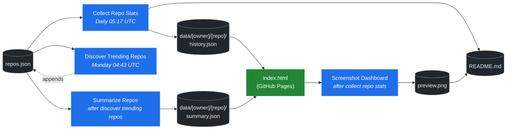

# 🚀 Rising Repos Tracker

> Automatically tracks daily GitHub stats (stars, forks, issues, velocity) for rising open source repos.

[](https://www.telosignal.com/)


**[→ View Live Dashboard](https://patrick-creates.github.io/rising-repos-tracker/)**

Built and maintained by [Telosignal](https://www.telosignal.com/).


<!-- AUTOGEN-STATS-START -->
## 📊 Current snapshot

> Auto-updated daily — last refreshed 2026-10-16

| Metric | Value |
|---|---|
| Repos tracked | **217** |
| Total stars | **11,079,943** |
| Total forks | **1,628,880** |
| Fastest growing | **rea** (+36677.8/day) |

### 🔥 Top 5 by velocity

| # | Repo | Stars | Stars/day |
|---|---|---:|---:|
| 1 | [morluto/rea](https://github.com/morluto/rea) | 280,940 | +36677.8 |
| 2 | [debpalash/VoiceStudio](https://github.com/debpalash/VoiceStudio) | 69,898 | +1273.8 |
| 3 | [DietrichGebert/ponytail](https://github.com/DietrichGebert/ponytail) | 164,772 | +1006.5 |
| 4 | [stablyai/orca](https://github.com/stablyai/orca) | 93,940 | +797.6 |
| 5 | [NousResearch/hermes-agent](https://github.com/NousResearch/hermes-agent) | 254,271 | +680.9 |

### 🆕 Recently added

- [morluto/rea](https://github.com/morluto/rea) — added 2026-10-12 — Reverse engineer anything with agents, from app behavior down to native binaries.
- [TencentCloud/Octop](https://github.com/TencentCloud/Octop) — added 2026-10-12 — A smarter, self-hosted AI assistant — multi-user, multi-agent.
- [tt-a1i/archify](https://github.com/tt-a1i/archify) — added 2026-10-05 — Turn any idea, plan, or codebase into a beautiful interactive diagram. An agent skill for Claude Code, Codex, and more.
<!-- AUTOGEN-STATS-END -->

<!-- AUTOGEN-DIAGRAM-START -->
## 🔄 How it works


```mermaid
graph LR
    repos[("repos.json")]:::data
    history[("data/[owner]/[repo]/<br/>history.json")]:::data
    summary[("data/[owner]/[repo]/<br/>summary.json")]:::data
    readme[("README.md")]:::data
    preview[("preview.png")]:::data
    dashboard["index.html<br/>(GitHub Pages)"]:::output
    collect_yml["Collect Repo Stats<br/><i>Daily 05:17 UTC</i>"]:::workflow
    discover_yml["Discover Trending Repos<br/><i>Monday 04:43 UTC</i>"]:::workflow
    screenshot_yml["Screenshot Dashboard<br/><i>after collect repo stats</i>"]:::workflow
    summarize_yml["Summarize Repos<br/><i>after discover trending repos</i>"]:::workflow
    repos --> collect_yml
    collect_yml --> history
    collect_yml --> readme
    repos --> discover_yml
    discover_yml -.->|appends| repos
    dashboard --> screenshot_yml
    screenshot_yml --> preview
    repos --> summarize_yml
    summarize_yml --> summary
    history --> dashboard
    summary --> dashboard
    preview --> readme
    classDef workflow fill:#1f6feb,stroke:#58a6ff,color:#fff
    classDef data fill:#21262d,stroke:#7d8590,color:#e6edf3
    classDef output fill:#238636,stroke:#3fb950,color:#fff
```
<!-- AUTOGEN-DIAGRAM-END -->

<!-- AUTOGEN-WORKFLOWS-START -->
## ⚙️ Workflows

| File | Schedule | Name |
|---|---|---|
| `collect.yml` | Daily 05:17 UTC | Collect Repo Stats |
| `discover.yml` | Monday 04:43 UTC | Discover Trending Repos |
| `screenshot.yml` | After Collect Repo Stats | Screenshot Dashboard |
| `summarize.yml` | After Discover Trending Repos | Summarize Repos |

> All workflows commit results directly back to the repo. Schedules are best-effort — GitHub Actions cron can drift by a few minutes.
<!-- AUTOGEN-WORKFLOWS-END -->

<!-- AUTOGEN-REPOS-START -->
## 📋 All tracked repos

| Repo | Stars | Forks | Stars/day |
|---|---:|---:|---:|
| [openclaw/openclaw](https://github.com/openclaw/openclaw) | 392,148 | 82,461 | +132.5 |
| [obra/superpowers](https://github.com/obra/superpowers) | 300,286 | 26,815 | +557.8 |
| [morluto/rea](https://github.com/morluto/rea) | 280,940 | 70,790 | +36677.8 |
| [affaan-m/ECC](https://github.com/affaan-m/ECC) | 280,771 | 41,751 | +614.9 |
| [affaan-m/everything-claude-code](https://github.com/affaan-m/everything-claude-code) | 280,770 | 41,751 | +639.2 |
| [NousResearch/hermes-agent](https://github.com/NousResearch/hermes-agent) | 254,271 | 55,220 | +680.9 |
| [microsoft/markitdown](https://github.com/microsoft/markitdown) | 190,495 | 14,157 | +432.6 |
| [Significant-Gravitas/AutoGPT](https://github.com/Significant-Gravitas/AutoGPT) | 187,607 | 45,921 | +21.3 |
| [f/prompts.chat](https://github.com/f/prompts.chat) | 173,129 | 22,152 | +70.2 |
| [DietrichGebert/ponytail](https://github.com/DietrichGebert/ponytail) | 164,772 | 8,890 | +1006.5 |
| [langgenius/dify](https://github.com/langgenius/dify) | 158,633 | 25,067 | +111.6 |
| [open-webui/open-webui](https://github.com/open-webui/open-webui) | 155,875 | 22,688 | +121.7 |
| [langchain-ai/langchain](https://github.com/langchain-ai/langchain) | 147,918 | 24,825 | +72.3 |
| [farion1231/cc-switch](https://github.com/farion1231/cc-switch) | 145,040 | 9,605 | +470.2 |
| [github/spec-kit](https://github.com/github/spec-kit) | 141,486 | 12,669 | +279.6 |
| [nextlevelbuilder/ui-ux-pro-max-skill](https://github.com/nextlevelbuilder/ui-ux-pro-max-skill) | 136,394 | 14,500 | +375.0 |
| [Graphify-Labs/graphify](https://github.com/Graphify-Labs/graphify) | 127,055 | 12,258 | +374.8 |
| [microsoft/generative-ai-for-beginners](https://github.com/microsoft/generative-ai-for-beginners) | 121,453 | 64,015 | +68.6 |
| [JuliusBrussee/caveman](https://github.com/JuliusBrussee/caveman) | 112,909 | 6,533 | +340.4 |
| [nexu-io/open-design](https://github.com/nexu-io/open-design) | 101,437 | 11,664 | +379.2 |
| [thedotmack/claude-mem](https://github.com/thedotmack/claude-mem) | 101,143 | 8,852 | +165.1 |
| [ruvnet/RuView](https://github.com/ruvnet/RuView) | 98,268 | 12,876 | +224.8 |
| [Panniantong/Agent-Reach](https://github.com/Panniantong/Agent-Reach) | 97,938 | 8,578 | +572.8 |
| [Leonxlnx/taste-skill](https://github.com/Leonxlnx/taste-skill) | 97,701 | 6,625 | +491.2 |
| [stablyai/orca](https://github.com/stablyai/orca) | 93,940 | 5,998 | +797.6 |
| [vllm-project/vllm](https://github.com/vllm-project/vllm) | 93,916 | 23,437 | +89.9 |
| [OpenHands/OpenHands](https://github.com/OpenHands/OpenHands) | 91,038 | 12,068 | +113.3 |
| [ChatGPTNextWeb/NextChat](https://github.com/ChatGPTNextWeb/NextChat) | 88,852 | 58,812 | +5.4 |
| [koala73/worldmonitor](https://github.com/koala73/worldmonitor) | 88,542 | 13,553 | +226.3 |
| [tt-a1i/archify](https://github.com/tt-a1i/archify) | 84,259 | 5,703 | +584.2 |
| [rtk-ai/rtk](https://github.com/rtk-ai/rtk) | 83,571 | 5,304 | +225.1 |
| [datawhalechina/hello-agents](https://github.com/datawhalechina/hello-agents) | 83,391 | 10,329 | +216.8 |
| [lobehub/lobehub](https://github.com/lobehub/lobehub) | 83,268 | 15,987 | +40.2 |
| [dair-ai/Prompt-Engineering-Guide](https://github.com/dair-ai/Prompt-Engineering-Guide) | 79,212 | 8,702 | +29.9 |
| [shareAI-lab/learn-claude-code](https://github.com/shareAI-lab/learn-claude-code) | 78,686 | 12,594 | +116.6 |
| [unslothai/unsloth](https://github.com/unslothai/unsloth) | 78,101 | 7,216 | +90.1 |
| [ComposioHQ/awesome-claude-skills](https://github.com/ComposioHQ/awesome-claude-skills) | 77,220 | 9,136 | +111.5 |
| [diegosouzapw/OmniRoute](https://github.com/diegosouzapw/OmniRoute) | 77,145 | 11,165 | +637.2 |
| [openai/openai-cookbook](https://github.com/openai/openai-cookbook) | 76,640 | 12,938 | +20.1 |
| [chopratejas/headroom](https://github.com/chopratejas/headroom) | 75,473 | 5,862 | +384.6 |
| [headroomlabs-ai/headroom](https://github.com/headroomlabs-ai/headroom) | 75,473 | 5,862 | +254.9 |
| [ruvnet/ruflo](https://github.com/ruvnet/ruflo) | 75,368 | 8,945 | +134.3 |
| [career-ops-hq/career-ops](https://github.com/career-ops-hq/career-ops) | 75,137 | 14,029 | +121.9 |
| [santifer/career-ops](https://github.com/santifer/career-ops) | 75,136 | 14,029 | +197.9 |
| [Fission-AI/OpenSpec](https://github.com/Fission-AI/OpenSpec) | 72,109 | 4,933 | +154.4 |
| [code-yeongyu/oh-my-openagent](https://github.com/code-yeongyu/oh-my-openagent) | 70,092 | 5,767 | +77.9 |
| [rohitg00/ai-engineering-from-scratch](https://github.com/rohitg00/ai-engineering-from-scratch) | 69,987 | 12,300 | +318.4 |
| [debpalash/VoiceStudio](https://github.com/debpalash/VoiceStudio) | 69,898 | 7,654 | +1273.8 |
| [asgeirtj/system_prompts_leaks](https://github.com/asgeirtj/system_prompts_leaks) | 69,739 | 11,332 | +194.4 |
| [usestrix/strix](https://github.com/usestrix/strix) | 68,904 | 7,637 | +315.3 |
| [calesthio/OpenMontage](https://github.com/calesthio/OpenMontage) | 68,733 | 8,808 | +375.1 |
| [shanraisshan/claude-code-best-practice](https://github.com/shanraisshan/claude-code-best-practice) | 67,627 | 6,743 | +93.6 |
| [xtekky/gpt4free](https://github.com/xtekky/gpt4free) | 66,881 | 13,476 | +4.2 |
| [ZhuLinsen/daily_stock_analysis](https://github.com/ZhuLinsen/daily_stock_analysis) | 66,452 | 55,293 | +191.8 |
| [heygen-com/hyperframes](https://github.com/heygen-com/hyperframes) | 64,879 | 5,843 | +302.4 |
| [mvanhorn/last30days-skill](https://github.com/mvanhorn/last30days-skill) | 64,465 | 5,625 | +244.6 |
| [tw93/Pake](https://github.com/tw93/Pake) | 62,126 | 12,786 | +88.4 |
| [BerriAI/litellm](https://github.com/BerriAI/litellm) | 61,370 | 12,402 | +92.6 |
| [MemPalace/mempalace](https://github.com/MemPalace/mempalace) | 59,589 | 7,564 | +47.6 |
| [jamiepine/voicebox](https://github.com/jamiepine/voicebox) | 57,638 | 7,216 | +208.9 |
| [blader/humanizer](https://github.com/blader/humanizer) | 57,428 | 4,546 | +273.1 |
| [hesreallyhim/awesome-claude-code](https://github.com/hesreallyhim/awesome-claude-code) | 55,800 | 4,828 | +77.5 |
| [FlowiseAI/Flowise](https://github.com/FlowiseAI/Flowise) | 55,507 | 25,067 | +17.3 |
| [router-for-me/CLIProxyAPI](https://github.com/router-for-me/CLIProxyAPI) | 55,406 | 8,471 | +143.5 |
| [coreyhaines31/marketingskills](https://github.com/coreyhaines31/marketingskills) | 54,991 | 8,148 | +171.9 |
| [bojieli/ai-agent-book](https://github.com/bojieli/ai-agent-book) | 54,523 | 6,221 | +529.2 |
| [ggml-org/whisper.cpp](https://github.com/ggml-org/whisper.cpp) | 54,431 | 6,259 | +30.5 |
| [ChromeDevTools/chrome-devtools-mcp](https://github.com/ChromeDevTools/chrome-devtools-mcp) | 53,639 | 6,766 | +91.1 |
| [Imbad0202/academic-research-skills](https://github.com/Imbad0202/academic-research-skills) | 52,352 | 4,007 | +156.3 |
| [elder-plinius/CL4R1T4S](https://github.com/elder-plinius/CL4R1T4S) | 51,296 | 10,512 | +100.9 |
| [K-Dense-AI/scientific-agent-skills](https://github.com/K-Dense-AI/scientific-agent-skills) | 50,979 | 4,527 | +192.4 |
| [QuantumNous/new-api](https://github.com/QuantumNous/new-api) | 50,076 | 12,053 | +102.2 |
| [kepano/obsidian-skills](https://github.com/kepano/obsidian-skills) | 49,619 | 3,523 | +114.9 |
| [Aider-AI/aider](https://github.com/Aider-AI/aider) | 49,586 | 5,063 | +30.6 |
| [HKUDS/nanobot](https://github.com/HKUDS/nanobot) | 49,078 | 8,638 | +42.4 |
| [sickn33/antigravity-awesome-skills](https://github.com/sickn33/antigravity-awesome-skills) | 47,708 | 6,961 | +62.7 |
| [sickn33/agentic-awesome-skills](https://github.com/sickn33/agentic-awesome-skills) | 47,708 | 6,961 | +49.1 |
| [MadsLorentzen/ai-job-search](https://github.com/MadsLorentzen/ai-job-search) | 47,690 | 16,477 | +274.8 |
| [alibaba/open-code-review](https://github.com/alibaba/open-code-review) | 47,462 | 3,456 | +367.4 |
| [zhayujie/CowAgent](https://github.com/zhayujie/CowAgent) | 47,427 | 10,396 | +19.0 |
| [DeusData/codebase-memory-mcp](https://github.com/DeusData/codebase-memory-mcp) | 46,688 | 3,844 | +239.1 |
| [danny-avila/LibreChat](https://github.com/danny-avila/LibreChat) | 45,789 | 9,412 | +57.8 |
| [LibreChat-AI/LibreChat](https://github.com/LibreChat-AI/LibreChat) | 45,789 | 9,412 | +42.5 |
| [chatanywhere/GPT_API_free](https://github.com/chatanywhere/GPT_API_free) | 44,294 | 2,745 | +42.6 |
| [ogulcancelik/herdr](https://github.com/ogulcancelik/herdr) | 44,294 | 3,515 | +312.7 |
| [herdrdev/herdr](https://github.com/herdrdev/herdr) | 44,294 | 3,515 | +277.1 |
| [langchain-ai/langgraph](https://github.com/langchain-ai/langgraph) | 43,353 | 7,376 | +68.4 |
| [tinyhumansai/openhuman](https://github.com/tinyhumansai/openhuman) | 42,100 | 4,150 | +66.9 |
| [chatboxai/chatbox](https://github.com/chatboxai/chatbox) | 42,032 | 4,279 | +13.5 |
| [AstrBotDevs/AstrBot](https://github.com/AstrBotDevs/AstrBot) | 41,978 | 3,073 | +61.2 |
| [Hmbown/CodeWhale](https://github.com/Hmbown/CodeWhale) | 41,093 | 3,568 | +44.6 |
| [Hmbown/Codewhale](https://github.com/Hmbown/Codewhale) | 41,093 | 3,568 | +4.5 |
| [codewhale-hq/Codewhale](https://github.com/codewhale-hq/Codewhale) | 41,093 | 3,568 | +4.1 |
| [wshobson/agents](https://github.com/wshobson/agents) | 40,888 | 4,340 | +34.4 |
| [github/awesome-copilot](https://github.com/github/awesome-copilot) | 40,070 | 5,130 | +43.5 |
| [volcengine/OpenViking](https://github.com/volcengine/OpenViking) | 40,067 | 3,187 | +113.4 |
| [Yeachan-Heo/oh-my-claudecode](https://github.com/Yeachan-Heo/oh-my-claudecode) | 39,953 | 3,582 | +35.6 |
| [mindsdb/mindshub](https://github.com/mindsdb/mindshub) | 39,800 | 6,241 | +4.2 |
| [anthropics/claude-plugins-official](https://github.com/anthropics/claude-plugins-official) | 39,671 | 4,355 | +77.8 |
| [google/langextract](https://github.com/google/langextract) | 38,961 | 2,718 | +16.7 |
| [AlexsJones/llmfit](https://github.com/AlexsJones/llmfit) | 37,977 | 2,441 | +80.1 |
| [PDFMathTranslate/PDFMathTranslate](https://github.com/PDFMathTranslate/PDFMathTranslate) | 37,596 | 3,370 | +24.9 |
| [songquanpeng/one-api](https://github.com/songquanpeng/one-api) | 37,177 | 6,888 | +20.6 |
| [JCodesMore/ai-website-cloner-template](https://github.com/JCodesMore/ai-website-cloner-template) | 36,854 | 5,420 | +161.5 |
| [esengine/DeepSeek-Reasonix](https://github.com/esengine/DeepSeek-Reasonix) | 35,818 | 2,454 | +125.3 |
| [agentscope-ai/QwenPaw](https://github.com/agentscope-ai/QwenPaw) | 35,744 | 3,184 | +146.1 |
| [can1357/oh-my-pi](https://github.com/can1357/oh-my-pi) | 35,625 | 3,901 | +186.5 |
| [HKUDS/Vibe-Trading](https://github.com/HKUDS/Vibe-Trading) | 35,614 | 5,776 | +191.5 |
| [p-e-w/heretic](https://github.com/p-e-w/heretic) | 35,485 | 4,015 | +88.6 |
| [virgiliojr94/book-to-skill](https://github.com/virgiliojr94/book-to-skill) | 35,022 | 3,682 | +192.3 |
| [mukul975/Anthropic-Cybersecurity-Skills](https://github.com/mukul975/Anthropic-Cybersecurity-Skills) | 34,531 | 4,210 | +141.5 |
| [Tencent/WeKnora](https://github.com/Tencent/WeKnora) | 34,332 | 4,582 | +146.7 |
| [Gitlawb/openclaude](https://github.com/Gitlawb/openclaude) | 33,932 | 9,138 | +42.3 |
| [Twigpine/openclaude](https://github.com/Twigpine/openclaude) | 33,932 | 9,138 | +26.1 |
| [iOfficeAI/AionUi](https://github.com/iOfficeAI/AionUi) | 33,574 | 3,488 | +45.4 |
| [zeroclaw-labs/zeroclaw](https://github.com/zeroclaw-labs/zeroclaw) | 32,984 | 4,976 | +9.5 |
| [tirth8205/code-review-graph](https://github.com/tirth8205/code-review-graph) | 32,189 | 2,955 | +111.2 |
| [iOfficeAI/OfficeCLI](https://github.com/iOfficeAI/OfficeCLI) | 32,075 | 2,185 | +232.1 |
| [googleworkspace/cli](https://github.com/googleworkspace/cli) | 31,539 | 1,912 | +35.2 |
| [decolua/9router](https://github.com/decolua/9router) | 30,899 | 5,996 | +108.4 |
| [jackwener/OpenCLI](https://github.com/jackwener/OpenCLI) | 30,329 | 2,978 | +50.2 |
| [langchain-ai/deepagents](https://github.com/langchain-ai/deepagents) | 30,328 | 4,267 | +47.5 |
| [mksglu/context-mode](https://github.com/mksglu/context-mode) | 29,966 | 2,092 | +101.6 |
| [rohitg00/agentmemory](https://github.com/rohitg00/agentmemory) | 29,573 | 2,606 | +59.6 |
| [alibaba/page-agent](https://github.com/alibaba/page-agent) | 29,456 | 2,685 | +88.6 |
| [TencentCloud/TencentDB-Agent-Memory](https://github.com/TencentCloud/TencentDB-Agent-Memory) | 29,283 | 2,856 | +216.5 |
| [voideditor/void](https://github.com/voideditor/void) | 28,752 | 2,657 | — |
| [jarrodwatts/claude-hud](https://github.com/jarrodwatts/claude-hud) | 28,571 | 1,334 | +29.9 |
| [ifixai-ai/iFixAi](https://github.com/ifixai-ai/iFixAi) | 28,490 | 1,544 | +303.2 |
| [BloopAI/vibe-kanban](https://github.com/BloopAI/vibe-kanban) | 28,377 | 3,036 | +12.2 |
| [manaflow-ai/cmux](https://github.com/manaflow-ai/cmux) | 28,206 | 2,511 | +40.5 |
| [t8y2/dbx](https://github.com/t8y2/dbx) | 26,968 | 2,441 | +186.8 |
| [zai-org/Open-AutoGLM](https://github.com/zai-org/Open-AutoGLM) | 26,409 | 4,054 | +7.3 |
| [toon-format/toon](https://github.com/toon-format/toon) | 25,506 | 1,138 | +7.8 |
| [pascalorg/editor](https://github.com/pascalorg/editor) | 24,904 | 3,093 | +54.5 |
| [guillaumemeyer/watermarks-remover](https://github.com/guillaumemeyer/watermarks-remover) | 24,231 | 2,781 | +126.0 |
| [every-app/open-seo](https://github.com/every-app/open-seo) | 23,792 | 3,168 | +160.5 |
| [jundot/omlx](https://github.com/jundot/omlx) | 22,856 | 2,039 | +50.6 |
| [hypit-ai/hypit](https://github.com/hypit-ai/hypit) | 22,727 | 2,555 | +312.7 |
| [pranshuparmar/witr](https://github.com/pranshuparmar/witr) | 22,704 | 809 | +42.9 |
| [steipete/CodexBar](https://github.com/steipete/CodexBar) | 22,564 | 2,121 | +63.5 |
| [winfunc/opcode](https://github.com/winfunc/opcode) | 22,416 | 1,730 | +3.2 |
| [coze-dev/coze-studio](https://github.com/coze-dev/coze-studio) | 21,717 | 3,130 | +5.9 |
| [NirDiamant/agents-towards-production](https://github.com/NirDiamant/agents-towards-production) | 21,711 | 2,880 | +8.3 |
| [KKKKhazix/khazix-skills](https://github.com/KKKKhazix/khazix-skills) | 21,449 | 2,274 | +45.4 |
| [jnMetaCode/agency-agents-zh](https://github.com/jnMetaCode/agency-agents-zh) | 21,315 | 3,443 | +50.9 |
| [1jehuang/jcode](https://github.com/1jehuang/jcode) | 20,909 | 2,424 | +132.7 |
| [NVIDIA/SkillSpector](https://github.com/NVIDIA/SkillSpector) | 20,336 | 1,785 | +99.9 |
| [walkinglabs/learn-harness-engineering](https://github.com/walkinglabs/learn-harness-engineering) | 19,924 | 2,205 | +98.4 |
| [datawhalechina/easy-vibe](https://github.com/datawhalechina/easy-vibe) | 19,750 | 1,886 | +22.8 |
| [tanweai/pua](https://github.com/tanweai/pua) | 19,715 | 1,202 | +11.9 |
| [danielmiessler/LifeOS](https://github.com/danielmiessler/LifeOS) | 19,464 | 2,497 | +29.3 |
| [AgriciDaniel/claude-seo](https://github.com/AgriciDaniel/claude-seo) | 19,033 | 2,773 | +67.1 |
| [jlcodes99/cockpit-tools](https://github.com/jlcodes99/cockpit-tools) | 19,029 | 1,684 | +53.1 |
| [nesquena/hermes-webui](https://github.com/nesquena/hermes-webui) | 18,956 | 2,742 | +35.5 |
| [microsoft/agent-lightning](https://github.com/microsoft/agent-lightning) | 18,723 | 1,702 | +11.5 |
| [browser-use/browser-harness](https://github.com/browser-use/browser-harness) | 18,453 | 1,831 | +27.3 |
| [RightNow-AI/openfang](https://github.com/RightNow-AI/openfang) | 18,213 | 2,305 | +3.1 |
| [rocketride-org/rocketride-server](https://github.com/rocketride-org/rocketride-server) | 17,764 | 7,536 | — |
| [tradecatlabs/vibe-coding-cn](https://github.com/tradecatlabs/vibe-coding-cn) | 17,606 | 1,784 | +46.1 |
| [wanshuiyin/Auto-claude-code-research-in-sleep](https://github.com/wanshuiyin/Auto-claude-code-research-in-sleep) | 17,568 | 1,482 | +44.0 |
| [MemoriLabs/Memori](https://github.com/MemoriLabs/Memori) | 17,152 | 3,725 | +15.6 |
| [cft0808/edict](https://github.com/cft0808/edict) | 16,992 | 1,788 | +7.6 |
| [composio-community/awesome-codex-skills](https://github.com/composio-community/awesome-codex-skills) | 16,920 | 1,689 | +18.3 |
| [xbtlin/ai-berkshire](https://github.com/xbtlin/ai-berkshire) | 16,755 | 2,515 | +58.6 |
| [xpzouying/xiaohongshu-mcp](https://github.com/xpzouying/xiaohongshu-mcp) | 16,312 | 2,418 | +17.5 |
| [Anionex/banana-slides](https://github.com/Anionex/banana-slides) | 15,766 | 1,802 | +5.3 |
| [superset-sh/superset](https://github.com/superset-sh/superset) | 15,256 | 1,358 | +28.4 |
| [yusufkaraaslan/Skill_Seekers](https://github.com/yusufkaraaslan/Skill_Seekers) | 15,159 | 1,572 | +8.0 |
| [NanmiCoder/cc-haha](https://github.com/NanmiCoder/cc-haha) | 15,026 | 8,607 | +15.5 |
| [kyegomez/OpenMythos](https://github.com/kyegomez/OpenMythos) | 14,910 | 3,277 | +6.5 |
| [NevaMind-AI/memU](https://github.com/NevaMind-AI/memU) | 14,547 | 1,091 | +5.6 |
| [dataelement/dsh-desktop](https://github.com/dataelement/dsh-desktop) | 14,488 | 512 | +258.6 |
| [XiaomiMiMo/MiMo-Code](https://github.com/XiaomiMiMo/MiMo-Code) | 13,670 | 1,448 | +24.3 |
| [EverMind-AI/EverOS](https://github.com/EverMind-AI/EverOS) | 13,445 | 941 | +34.2 |
| [sirmalloc/ccstatusline](https://github.com/sirmalloc/ccstatusline) | 13,304 | 601 | +18.6 |
| [ConardLi/garden-skills](https://github.com/ConardLi/garden-skills) | 12,929 | 1,549 | +36.7 |
| [0x4m4/hexstrike-ai](https://github.com/0x4m4/hexstrike-ai) | 12,825 | 2,629 | +25.8 |
| [brokermr810/QuantDinger](https://github.com/brokermr810/QuantDinger) | 12,822 | 2,637 | +34.7 |
| [OpenByteInc/QuantDinger](https://github.com/OpenByteInc/QuantDinger) | 12,822 | 2,637 | +34.3 |
| [MemTensor/MemOS](https://github.com/MemTensor/MemOS) | 11,888 | 1,096 | +17.1 |
| [getagentseal/codeburn](https://github.com/getagentseal/codeburn) | 11,468 | 899 | +29.4 |
| [holaboss-ai/holaOS](https://github.com/holaboss-ai/holaOS) | 11,446 | 753 | +51.3 |
| [EKKOLearnAI/hermes-studio](https://github.com/EKKOLearnAI/hermes-studio) | 11,439 | 1,412 | +25.3 |
| [EKKOLearnAI/ekko-studio](https://github.com/EKKOLearnAI/ekko-studio) | 11,439 | 1,412 | +11.9 |
| [openai/codex-security](https://github.com/openai/codex-security) | 11,114 | 877 | +38.3 |
| [aden-hive/hive](https://github.com/aden-hive/hive) | 11,108 | 5,652 | +4.6 |
| [ValueCell-ai/valuecell](https://github.com/ValueCell-ai/valuecell) | 11,023 | 1,800 | +1.4 |
| [Kuberwastaken/claurst](https://github.com/Kuberwastaken/claurst) | 10,316 | 7,707 | +4.1 |
| [StarTrail-org/PixelRAG](https://github.com/StarTrail-org/PixelRAG) | 10,285 | 907 | +38.9 |
| [ykdojo/claude-code-tips](https://github.com/ykdojo/claude-code-tips) | 10,234 | 843 | +11.9 |
| [trailhq/Graft](https://github.com/trailhq/Graft) | 10,099 | 890 | +78.4 |
| [Companion-Inc/feynman](https://github.com/Companion-Inc/feynman) | 9,975 | 1,104 | +9.1 |
| [genspark-ai/genoffice](https://github.com/genspark-ai/genoffice) | 9,804 | 1,250 | +96.6 |
| [frankbria/ralph-claude-code](https://github.com/frankbria/ralph-claude-code) | 9,702 | 737 | +3.8 |
| [TencentCloud/Octop](https://github.com/TencentCloud/Octop) | 9,637 | 1,209 | +200.0 |
| [modem-dev/hunk](https://github.com/modem-dev/hunk) | 9,612 | 315 | +30.6 |
| [Nasiko-Labs/nasiko](https://github.com/Nasiko-Labs/nasiko) | 9,481 | 2,053 | +26.3 |
| [1weiho/open-slide](https://github.com/1weiho/open-slide) | 9,264 | 666 | +47.0 |
| [open-slide/open-slide](https://github.com/open-slide/open-slide) | 9,264 | 666 | +54.6 |
| [Tencent/BrowserSkill](https://github.com/Tencent/BrowserSkill) | 9,019 | 651 | +75.5 |
| [iflytek/astron-agent](https://github.com/iflytek/astron-agent) | 8,909 | 902 | +2.9 |
| [EvoMap/evolver](https://github.com/EvoMap/evolver) | 8,688 | 840 | — |
| [MiroMindAI/MiroThinker](https://github.com/MiroMindAI/MiroThinker) | 8,420 | 646 | +0.9 |
| [mmulet/term.everything](https://github.com/mmulet/term.everything) | 8,112 | 195 | +0.9 |
| [rorkai/App-Store-Connect-CLI](https://github.com/rorkai/App-Store-Connect-CLI) | 7,942 | 678 | +26.8 |
| [WenyuChiou/awesome-agentic-ai-zh](https://github.com/WenyuChiou/awesome-agentic-ai-zh) | 7,701 | 1,014 | +25.0 |
| [ValueCell-ai/ClawX](https://github.com/ValueCell-ai/ClawX) | 7,605 | 1,143 | +0.7 |
| [opensquilla/opensquilla](https://github.com/opensquilla/opensquilla) | 7,102 | 581 | +10.1 |
| [TokenRhythm/opensquilla](https://github.com/TokenRhythm/opensquilla) | 7,102 | 581 | +3.4 |
| [tech-leads-club/agent-skills](https://github.com/tech-leads-club/agent-skills) | 7,061 | 560 | +19.6 |
| [Andyyyy64/whichllm](https://github.com/Andyyyy64/whichllm) | 6,761 | 374 | +10.2 |
| [steipete/summarize](https://github.com/steipete/summarize) | 6,716 | 451 | +3.2 |
| [Arthur-Ficial/apfel](https://github.com/Arthur-Ficial/apfel) | 6,476 | 249 | +3.8 |
| [microsoft/fara](https://github.com/microsoft/fara) | 6,220 | 604 | +2.3 |
| [UfoMiao/zcf](https://github.com/UfoMiao/zcf) | 6,079 | 423 | +0.1 |
| [re4/LibreCode](https://github.com/re4/LibreCode) | 88 | 4 | — |
<!-- AUTOGEN-REPOS-END -->

---

## What it does

- Collects daily snapshots of stars, forks, watchers and open issues for every tracked repo
- Discovers new trending repos automatically every Monday using the GitHub Search API
- Generates AI summaries (use cases, similar tools, tags) for each tracked repo via GitHub Models
- Stores all history as plain JSON — no database, no backend
- Renders a live dashboard via GitHub Pages — updates daily, zero maintenance

## Tracked repos

Data lives in [`data/`](./data) — one folder per repo, one `history.json` per entry.  
The full watch list is in [`repos.json`](./repos.json).

## Fork & use it for yourself

This is my personal tracker — the watch list reflects what I find interesting. If you want to track different repos, the best path is to **fork this repo and run your own**.

### Setup

1. Fork this repo to your account
2. Replace the contents of [`repos.json`](./repos.json) with the repos you want to track (or just leave one entry — `discover.yml` will auto-add more every Monday)
3. Go to **Settings → Pages** and enable GitHub Pages from the `main` branch
4. Go to **Actions** and run **Collect Repo Stats** once manually to seed your first data point
5. Your dashboard will be live at `https://YOUR-USERNAME.github.io/rising-repos-tracker/`

That's it — daily collection and weekly discovery run automatically on schedule. Zero ongoing maintenance.

### Customizing what gets discovered

Edit [`scripts/discover.js`](./scripts/discover.js) to change:

- `MIN_STARS` — minimum star threshold for candidates
- `MAX_AGE_DAYS` — how recent a repo must be
- `MAX_NEW_REPOS` — how many to add per discovery run
- The `queries` array — GitHub Search API queries that define what "trending" means to you

### Adding a repo manually

Just edit `repos.json` directly:

```json
{
  "owner": "OWNER",
  "repo": "REPO",
  "added": "YYYY-MM-DD",
  "notes": "why you're tracking this"
}
```

The next daily collect run picks it up automatically.

## Stack

- **GitHub Actions** — scheduling and automation
- **GitHub Pages** — dashboard hosting
- **GitHub API** — data source
- **GitHub Models** — free AI summaries (gpt-4o-mini)
- **Chart.js** — star growth visualization
- **Mermaid** — architecture diagram (rendered by GitHub)
- No dependencies, no build step, no database

## License

MIT
