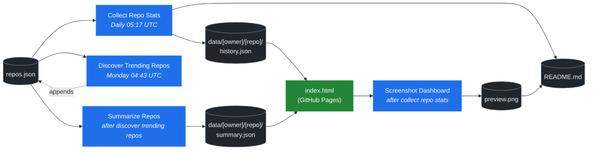

# 🚀 Rising Repos Tracker

> Automatically tracks daily GitHub stats (stars, forks, issues, velocity) for rising open source repos.

[](https://www.telosignal.com/)


**[→ View Live Dashboard](https://patrick-creates.github.io/rising-repos-tracker/)**

Built and maintained by [Telosignal](https://www.telosignal.com/).


<!-- AUTOGEN-STATS-START -->
## 📊 Current snapshot

> Auto-updated daily — last refreshed 2026-10-22

| Metric | Value |
|---|---|
| Repos tracked | **220** |
| Total stars | **11,483,168** |
| Total forks | **1,687,181** |
| Fastest growing | **rea** (+22736.2/day) |

### 🔥 Top 5 by velocity

| # | Repo | Stars | Stars/day |
|---|---|---:|---:|
| 1 | [morluto/rea](https://github.com/morluto/rea) | 361,591 | +22736.2 |
| 2 | [Ebony-Vinyl/dsh-our-free-model](https://github.com/Ebony-Vinyl/dsh-our-free-model) | 35,540 | +2997.3 |
| 3 | [debpalash/VoiceStudio](https://github.com/debpalash/VoiceStudio) | 81,006 | +1350.8 |
| 4 | [DietrichGebert/ponytail](https://github.com/DietrichGebert/ponytail) | 172,447 | +1019.9 |
| 5 | [stablyai/orca](https://github.com/stablyai/orca) | 102,030 | +828.2 |

### 🆕 Recently added

- [paperclipai/paperclip](https://github.com/paperclipai/paperclip) — added 2026-10-19 — The open-source app everyone uses to manage agents at work
- [Ebony-Vinyl/dsh-our-free-model](https://github.com/Ebony-Vinyl/dsh-our-free-model) — added 2026-10-19 — 在 dsh 里装上这个插件即可，无需登录、注册或填 API Key，就能使用包括 DeepSeek V4.1 Flash、Kimi K3 在内的前沿模型——完全免费，不限量。 All you do is install this plugin in dsh: no login, no sign-up, no API key — the frontier models are just there, DeepSeek V4.1 Flash and Kimi K3 among them. Completely free, with no usage cap.
- [trailhq/Trail-Code](https://github.com/trailhq/Trail-Code) — added 2026-10-19 — Turbocharge Claude Code, Cursor, Codex, Gemini & every coding agent: faster, cheaper, with contextual understanding specific to your codebase.
<!-- AUTOGEN-STATS-END -->

<!-- AUTOGEN-DIAGRAM-START -->
## 🔄 How it works


```mermaid
graph LR
    repos[("repos.json")]:::data
    history[("data/[owner]/[repo]/<br/>history.json")]:::data
    summary[("data/[owner]/[repo]/<br/>summary.json")]:::data
    readme[("README.md")]:::data
    preview[("preview.png")]:::data
    dashboard["index.html<br/>(GitHub Pages)"]:::output
    collect_yml["Collect Repo Stats<br/><i>Daily 05:17 UTC</i>"]:::workflow
    discover_yml["Discover Trending Repos<br/><i>Monday 04:43 UTC</i>"]:::workflow
    screenshot_yml["Screenshot Dashboard<br/><i>after collect repo stats</i>"]:::workflow
    summarize_yml["Summarize Repos<br/><i>after discover trending repos</i>"]:::workflow
    repos --> collect_yml
    collect_yml --> history
    collect_yml --> readme
    repos --> discover_yml
    discover_yml -.->|appends| repos
    dashboard --> screenshot_yml
    screenshot_yml --> preview
    repos --> summarize_yml
    summarize_yml --> summary
    history --> dashboard
    summary --> dashboard
    preview --> readme
    classDef workflow fill:#1f6feb,stroke:#58a6ff,color:#fff
    classDef data fill:#21262d,stroke:#7d8590,color:#e6edf3
    classDef output fill:#238636,stroke:#3fb950,color:#fff
```
<!-- AUTOGEN-DIAGRAM-END -->

<!-- AUTOGEN-WORKFLOWS-START -->
## ⚙️ Workflows

| File | Schedule | Name |
|---|---|---|
| `collect.yml` | Daily 05:17 UTC | Collect Repo Stats |
| `discover.yml` | Monday 04:43 UTC | Discover Trending Repos |
| `screenshot.yml` | After Collect Repo Stats | Screenshot Dashboard |
| `summarize.yml` | After Discover Trending Repos | Summarize Repos |

> All workflows commit results directly back to the repo. Schedules are best-effort — GitHub Actions cron can drift by a few minutes.
<!-- AUTOGEN-WORKFLOWS-END -->

<!-- AUTOGEN-REPOS-START -->
## 📋 All tracked repos

| Repo | Stars | Forks | Stars/day |
|---|---:|---:|---:|
| [openclaw/openclaw](https://github.com/openclaw/openclaw) | 392,728 | 82,552 | +131.2 |
| [morluto/rea](https://github.com/morluto/rea) | 361,591 | 90,745 | +22736.2 |
| [obra/superpowers](https://github.com/obra/superpowers) | 303,373 | 27,034 | +555.7 |
| [affaan-m/everything-claude-code](https://github.com/affaan-m/everything-claude-code) | 286,025 | 42,433 | +648.0 |
| [affaan-m/ECC](https://github.com/affaan-m/ECC) | 286,025 | 42,433 | +625.3 |
| [NousResearch/hermes-agent](https://github.com/NousResearch/hermes-agent) | 256,096 | 55,890 | +667.0 |
| [microsoft/markitdown](https://github.com/microsoft/markitdown) | 191,564 | 14,272 | +423.2 |
| [Significant-Gravitas/AutoGPT](https://github.com/Significant-Gravitas/AutoGPT) | 187,701 | 45,906 | +21.1 |
| [f/prompts.chat](https://github.com/f/prompts.chat) | 173,881 | 22,235 | +72.3 |
| [DietrichGebert/ponytail](https://github.com/DietrichGebert/ponytail) | 172,447 | 9,383 | +1019.9 |
| [langgenius/dify](https://github.com/langgenius/dify) | 159,234 | 25,163 | +111.2 |
| [open-webui/open-webui](https://github.com/open-webui/open-webui) | 156,425 | 22,772 | +120.6 |
| [langchain-ai/langchain](https://github.com/langchain-ai/langchain) | 148,256 | 24,884 | +71.7 |
| [farion1231/cc-switch](https://github.com/farion1231/cc-switch) | 147,512 | 9,723 | +467.9 |
| [github/spec-kit](https://github.com/github/spec-kit) | 142,376 | 12,748 | +274.8 |
| [nextlevelbuilder/ui-ux-pro-max-skill](https://github.com/nextlevelbuilder/ui-ux-pro-max-skill) | 138,719 | 14,701 | +375.5 |
| [Graphify-Labs/graphify](https://github.com/Graphify-Labs/graphify) | 132,184 | 12,677 | +407.9 |
| [microsoft/generative-ai-for-beginners](https://github.com/microsoft/generative-ai-for-beginners) | 121,879 | 64,387 | +68.7 |
| [JuliusBrussee/caveman](https://github.com/JuliusBrussee/caveman) | 114,255 | 6,587 | +335.9 |
| [paperclipai/paperclip](https://github.com/paperclipai/paperclip) | 105,898 | 17,612 | +497.3 |
| [nexu-io/open-design](https://github.com/nexu-io/open-design) | 103,215 | 11,820 | +376.1 |
| [thedotmack/claude-mem](https://github.com/thedotmack/claude-mem) | 102,225 | 9,009 | +165.7 |
| [stablyai/orca](https://github.com/stablyai/orca) | 102,030 | 6,446 | +828.2 |
| [Panniantong/Agent-Reach](https://github.com/Panniantong/Agent-Reach) | 100,810 | 8,880 | +568.6 |
| [Leonxlnx/taste-skill](https://github.com/Leonxlnx/taste-skill) | 100,809 | 6,821 | +492.3 |
| [ruvnet/RuView](https://github.com/ruvnet/RuView) | 99,116 | 12,970 | +221.5 |
| [vllm-project/vllm](https://github.com/vllm-project/vllm) | 95,089 | 23,789 | +93.9 |
| [OpenHands/OpenHands](https://github.com/OpenHands/OpenHands) | 91,545 | 12,152 | +112.2 |
| [koala73/worldmonitor](https://github.com/koala73/worldmonitor) | 89,163 | 13,684 | +221.6 |
| [ChatGPTNextWeb/NextChat](https://github.com/ChatGPTNextWeb/NextChat) | 88,883 | 58,751 | +5.4 |
| [tt-a1i/archify](https://github.com/tt-a1i/archify) | 87,341 | 5,883 | +559.3 |
| [rtk-ai/rtk](https://github.com/rtk-ai/rtk) | 84,245 | 5,359 | +220.8 |
| [datawhalechina/hello-agents](https://github.com/datawhalechina/hello-agents) | 84,157 | 10,442 | +213.4 |
| [lobehub/lobehub](https://github.com/lobehub/lobehub) | 83,410 | 16,013 | +39.6 |
| [debpalash/VoiceStudio](https://github.com/debpalash/VoiceStudio) | 81,006 | 8,942 | +1350.8 |
| [diegosouzapw/OmniRoute](https://github.com/diegosouzapw/OmniRoute) | 79,608 | 11,584 | +624.6 |
| [dair-ai/Prompt-Engineering-Guide](https://github.com/dair-ai/Prompt-Engineering-Guide) | 79,431 | 8,715 | +30.1 |
| [shareAI-lab/learn-claude-code](https://github.com/shareAI-lab/learn-claude-code) | 78,996 | 12,632 | +114.1 |
| [unslothai/unsloth](https://github.com/unslothai/unsloth) | 78,402 | 7,262 | +88.5 |
| [ruvnet/ruflo](https://github.com/ruvnet/ruflo) | 78,310 | 9,210 | +259.9 |
| [ComposioHQ/awesome-claude-skills](https://github.com/ComposioHQ/awesome-claude-skills) | 77,652 | 9,269 | +110.0 |
| [chopratejas/headroom](https://github.com/chopratejas/headroom) | 77,477 | 6,017 | +382.3 |
| [headroomlabs-ai/headroom](https://github.com/headroomlabs-ai/headroom) | 77,477 | 6,017 | +258.8 |
| [openai/openai-cookbook](https://github.com/openai/openai-cookbook) | 76,750 | 12,966 | +20.0 |
| [santifer/career-ops](https://github.com/santifer/career-ops) | 76,483 | 14,176 | +199.0 |
| [career-ops-hq/career-ops](https://github.com/career-ops-hq/career-ops) | 76,483 | 14,176 | +135.6 |
| [Fission-AI/OpenSpec](https://github.com/Fission-AI/OpenSpec) | 72,713 | 4,968 | +152.4 |
| [rohitg00/ai-engineering-from-scratch](https://github.com/rohitg00/ai-engineering-from-scratch) | 72,234 | 12,724 | +320.8 |
| [usestrix/strix](https://github.com/usestrix/strix) | 70,962 | 7,877 | +316.4 |
| [calesthio/OpenMontage](https://github.com/calesthio/OpenMontage) | 70,735 | 9,146 | +372.9 |
| [code-yeongyu/oh-my-openagent](https://github.com/code-yeongyu/oh-my-openagent) | 70,261 | 5,785 | +76.0 |
| [asgeirtj/system_prompts_leaks](https://github.com/asgeirtj/system_prompts_leaks) | 70,022 | 11,353 | +188.8 |
| [heygen-com/hyperframes](https://github.com/heygen-com/hyperframes) | 69,573 | 6,296 | +323.6 |
| [shanraisshan/claude-code-best-practice](https://github.com/shanraisshan/claude-code-best-practice) | 67,893 | 6,758 | +91.7 |
| [xtekky/gpt4free](https://github.com/xtekky/gpt4free) | 66,918 | 13,466 | +4.3 |
| [ZhuLinsen/daily_stock_analysis](https://github.com/ZhuLinsen/daily_stock_analysis) | 66,862 | 55,540 | +186.8 |
| [mvanhorn/last30days-skill](https://github.com/mvanhorn/last30days-skill) | 65,065 | 5,647 | +238.2 |
| [MadsLorentzen/ai-job-search](https://github.com/MadsLorentzen/ai-job-search) | 63,190 | 19,506 | +412.0 |
| [tw93/Pake](https://github.com/tw93/Pake) | 62,250 | 12,808 | +85.8 |
| [BerriAI/litellm](https://github.com/BerriAI/litellm) | 61,795 | 12,567 | +91.8 |
| [MemPalace/mempalace](https://github.com/MemPalace/mempalace) | 59,693 | 7,573 | +46.5 |
| [blader/humanizer](https://github.com/blader/humanizer) | 59,469 | 4,717 | +289.8 |
| [jamiepine/voicebox](https://github.com/jamiepine/voicebox) | 58,211 | 7,304 | +204.1 |
| [hesreallyhim/awesome-claude-code](https://github.com/hesreallyhim/awesome-claude-code) | 56,225 | 4,851 | +77.3 |
| [router-for-me/CLIProxyAPI](https://github.com/router-for-me/CLIProxyAPI) | 55,958 | 8,554 | +141.4 |
| [coreyhaines31/marketingskills](https://github.com/coreyhaines31/marketingskills) | 55,913 | 8,275 | +171.2 |
| [FlowiseAI/Flowise](https://github.com/FlowiseAI/Flowise) | 55,516 | 25,069 | +16.7 |
| [bojieli/ai-agent-book](https://github.com/bojieli/ai-agent-book) | 55,419 | 6,347 | +505.0 |
| [ggml-org/whisper.cpp](https://github.com/ggml-org/whisper.cpp) | 54,552 | 6,233 | +30.1 |
| [ChromeDevTools/chrome-devtools-mcp](https://github.com/ChromeDevTools/chrome-devtools-mcp) | 53,969 | 6,637 | +89.7 |
| [K-Dense-AI/scientific-agent-skills](https://github.com/K-Dense-AI/scientific-agent-skills) | 53,746 | 4,742 | +228.2 |
| [Imbad0202/academic-research-skills](https://github.com/Imbad0202/academic-research-skills) | 53,425 | 4,100 | +157.8 |
| [elder-plinius/CL4R1T4S](https://github.com/elder-plinius/CL4R1T4S) | 51,441 | 10,522 | +97.3 |
| [QuantumNous/new-api](https://github.com/QuantumNous/new-api) | 50,466 | 12,195 | +100.7 |
| [kepano/obsidian-skills](https://github.com/kepano/obsidian-skills) | 49,908 | 3,528 | +112.1 |
| [Aider-AI/aider](https://github.com/Aider-AI/aider) | 49,692 | 5,097 | +30.1 |
| [HKUDS/nanobot](https://github.com/HKUDS/nanobot) | 49,268 | 8,664 | +42.0 |
| [sickn33/antigravity-awesome-skills](https://github.com/sickn33/antigravity-awesome-skills) | 48,297 | 7,032 | +64.1 |
| [sickn33/agentic-awesome-skills](https://github.com/sickn33/agentic-awesome-skills) | 48,297 | 7,032 | +52.0 |
| [alibaba/open-code-review](https://github.com/alibaba/open-code-review) | 48,005 | 3,515 | +352.0 |
| [zhayujie/CowAgent](https://github.com/zhayujie/CowAgent) | 47,510 | 10,401 | +18.8 |
| [DeusData/codebase-memory-mcp](https://github.com/DeusData/codebase-memory-mcp) | 47,181 | 3,872 | +230.9 |
| [danny-avila/LibreChat](https://github.com/danny-avila/LibreChat) | 46,149 | 9,481 | +57.9 |
| [LibreChat-AI/LibreChat](https://github.com/LibreChat-AI/LibreChat) | 46,149 | 9,481 | +46.9 |
| [ogulcancelik/herdr](https://github.com/ogulcancelik/herdr) | 45,292 | 3,592 | +304.6 |
| [herdrdev/herdr](https://github.com/herdrdev/herdr) | 45,292 | 3,592 | +268.8 |
| [chatanywhere/GPT_API_free](https://github.com/chatanywhere/GPT_API_free) | 44,660 | 2,749 | +43.4 |
| [anthropics/claude-plugins-official](https://github.com/anthropics/claude-plugins-official) | 43,743 | 4,607 | +103.0 |
| [langchain-ai/langgraph](https://github.com/langchain-ai/langgraph) | 43,708 | 7,494 | +67.9 |
| [AstrBotDevs/AstrBot](https://github.com/AstrBotDevs/AstrBot) | 42,734 | 3,125 | +64.0 |
| [tinyhumansai/openhuman](https://github.com/tinyhumansai/openhuman) | 42,217 | 4,170 | +60.6 |
| [chatboxai/chatbox](https://github.com/chatboxai/chatbox) | 42,098 | 4,281 | +13.4 |
| [wshobson/agents](https://github.com/wshobson/agents) | 41,528 | 4,406 | +37.3 |
| [Hmbown/CodeWhale](https://github.com/Hmbown/CodeWhale) | 41,106 | 3,568 | +42.9 |
| [Hmbown/Codewhale](https://github.com/Hmbown/Codewhale) | 41,106 | 3,568 | +4.2 |
| [codewhale-hq/Codewhale](https://github.com/codewhale-hq/Codewhale) | 41,106 | 3,568 | +3.4 |
| [volcengine/OpenViking](https://github.com/volcengine/OpenViking) | 40,567 | 3,274 | +112.1 |
| [github/awesome-copilot](https://github.com/github/awesome-copilot) | 40,300 | 5,187 | +43.3 |
| [Yeachan-Heo/oh-my-claudecode](https://github.com/Yeachan-Heo/oh-my-claudecode) | 40,168 | 3,594 | +35.6 |
| [mindsdb/mindshub](https://github.com/mindsdb/mindshub) | 39,803 | 6,241 | +4.0 |
| [google/langextract](https://github.com/google/langextract) | 38,996 | 2,722 | +16.3 |
| [AlexsJones/llmfit](https://github.com/AlexsJones/llmfit) | 38,218 | 2,468 | +78.4 |
| [PDFMathTranslate/PDFMathTranslate](https://github.com/PDFMathTranslate/PDFMathTranslate) | 37,762 | 3,378 | +25.0 |
| [songquanpeng/one-api](https://github.com/songquanpeng/one-api) | 37,217 | 6,891 | +20.0 |
| [JCodesMore/ai-website-cloner-template](https://github.com/JCodesMore/ai-website-cloner-template) | 37,154 | 5,444 | +156.3 |
| [HKUDS/Vibe-Trading](https://github.com/HKUDS/Vibe-Trading) | 36,261 | 5,867 | +187.2 |
| [can1357/oh-my-pi](https://github.com/can1357/oh-my-pi) | 36,213 | 4,030 | +182.1 |
| [p-e-w/heretic](https://github.com/p-e-w/heretic) | 36,166 | 4,091 | +89.7 |
| [agentscope-ai/QwenPaw](https://github.com/agentscope-ai/QwenPaw) | 35,934 | 3,200 | +140.7 |
| [esengine/DeepSeek-Reasonix](https://github.com/esengine/DeepSeek-Reasonix) | 35,906 | 2,471 | +120.4 |
| [virgiliojr94/book-to-skill](https://github.com/virgiliojr94/book-to-skill) | 35,679 | 3,767 | +183.9 |
| [Ebony-Vinyl/dsh-our-free-model](https://github.com/Ebony-Vinyl/dsh-our-free-model) | 35,540 | 1,003 | +2997.3 |
| [Tencent/WeKnora](https://github.com/Tencent/WeKnora) | 35,048 | 4,696 | +145.4 |
| [mukul975/Anthropic-Cybersecurity-Skills](https://github.com/mukul975/Anthropic-Cybersecurity-Skills) | 34,831 | 4,231 | +137.0 |
| [Gitlawb/openclaude](https://github.com/Gitlawb/openclaude) | 34,091 | 9,130 | +41.7 |
| [Twigpine/openclaude](https://github.com/Twigpine/openclaude) | 34,091 | 9,130 | +26.2 |
| [iOfficeAI/AionUi](https://github.com/iOfficeAI/AionUi) | 33,694 | 3,499 | +44.4 |
| [zeroclaw-labs/zeroclaw](https://github.com/zeroclaw-labs/zeroclaw) | 33,024 | 4,985 | +9.4 |
| [ifixai-ai/iFixAi](https://github.com/ifixai-ai/iFixAi) | 32,565 | 1,623 | +334.1 |
| [tirth8205/code-review-graph](https://github.com/tirth8205/code-review-graph) | 32,317 | 2,953 | +107.0 |
| [iOfficeAI/OfficeCLI](https://github.com/iOfficeAI/OfficeCLI) | 32,312 | 2,202 | +221.4 |
| [googleworkspace/cli](https://github.com/googleworkspace/cli) | 31,779 | 1,947 | +35.4 |
| [mksglu/context-mode](https://github.com/mksglu/context-mode) | 31,737 | 2,187 | +110.6 |
| [decolua/9router](https://github.com/decolua/9router) | 31,203 | 6,023 | +105.7 |
| [jackwener/OpenCLI](https://github.com/jackwener/OpenCLI) | 30,530 | 2,977 | +49.5 |
| [langchain-ai/deepagents](https://github.com/langchain-ai/deepagents) | 30,505 | 4,297 | +46.7 |
| [TencentCloud/TencentDB-Agent-Memory](https://github.com/TencentCloud/TencentDB-Agent-Memory) | 29,790 | 2,890 | +208.6 |
| [rohitg00/agentmemory](https://github.com/rohitg00/agentmemory) | 29,774 | 2,630 | +58.4 |
| [alibaba/page-agent](https://github.com/alibaba/page-agent) | 29,543 | 2,643 | +85.2 |
| [jarrodwatts/claude-hud](https://github.com/jarrodwatts/claude-hud) | 28,757 | 1,321 | +29.9 |
| [voideditor/void](https://github.com/voideditor/void) | 28,741 | 2,655 | — |
| [BloopAI/vibe-kanban](https://github.com/BloopAI/vibe-kanban) | 28,427 | 3,031 | +12.0 |
| [manaflow-ai/cmux](https://github.com/manaflow-ai/cmux) | 28,343 | 2,569 | +39.5 |
| [t8y2/dbx](https://github.com/t8y2/dbx) | 27,538 | 2,457 | +180.5 |
| [zai-org/Open-AutoGLM](https://github.com/zai-org/Open-AutoGLM) | 26,451 | 4,052 | +7.3 |
| [toon-format/toon](https://github.com/toon-format/toon) | 25,547 | 1,125 | +7.7 |
| [pascalorg/editor](https://github.com/pascalorg/editor) | 25,046 | 3,117 | +52.0 |
| [hypit-ai/hypit](https://github.com/hypit-ai/hypit) | 24,710 | 2,782 | +317.1 |
| [guillaumemeyer/watermarks-remover](https://github.com/guillaumemeyer/watermarks-remover) | 24,631 | 2,825 | +120.0 |
| [every-app/open-seo](https://github.com/every-app/open-seo) | 24,492 | 3,320 | +153.6 |
| [jundot/omlx](https://github.com/jundot/omlx) | 22,990 | 2,048 | +49.3 |
| [pranshuparmar/witr](https://github.com/pranshuparmar/witr) | 22,756 | 798 | +41.1 |
| [steipete/CodexBar](https://github.com/steipete/CodexBar) | 22,740 | 2,144 | +61.8 |
| [winfunc/opcode](https://github.com/winfunc/opcode) | 22,419 | 1,711 | +3.0 |
| [coze-dev/coze-studio](https://github.com/coze-dev/coze-studio) | 21,745 | 3,134 | +5.9 |
| [NirDiamant/agents-towards-production](https://github.com/NirDiamant/agents-towards-production) | 21,742 | 2,879 | +8.1 |
| [KKKKhazix/khazix-skills](https://github.com/KKKKhazix/khazix-skills) | 21,581 | 2,271 | +43.9 |
| [jnMetaCode/agency-agents-zh](https://github.com/jnMetaCode/agency-agents-zh) | 21,496 | 3,460 | +49.9 |
| [walkinglabs/learn-harness-engineering](https://github.com/walkinglabs/learn-harness-engineering) | 21,143 | 2,364 | +104.2 |
| [1jehuang/jcode](https://github.com/1jehuang/jcode) | 21,114 | 2,450 | +126.8 |
| [NVIDIA/SkillSpector](https://github.com/NVIDIA/SkillSpector) | 20,879 | 1,832 | +98.4 |
| [datawhalechina/easy-vibe](https://github.com/datawhalechina/easy-vibe) | 20,103 | 1,945 | +24.5 |
| [tanweai/pua](https://github.com/tanweai/pua) | 19,723 | 1,201 | +11.4 |
| [AgriciDaniel/claude-seo](https://github.com/AgriciDaniel/claude-seo) | 19,636 | 2,853 | +72.4 |
| [danielmiessler/LifeOS](https://github.com/danielmiessler/LifeOS) | 19,549 | 2,500 | +28.5 |
| [jlcodes99/cockpit-tools](https://github.com/jlcodes99/cockpit-tools) | 19,226 | 1,711 | +51.4 |
| [nesquena/hermes-webui](https://github.com/nesquena/hermes-webui) | 19,100 | 2,769 | +34.9 |
| [microsoft/agent-lightning](https://github.com/microsoft/agent-lightning) | 18,785 | 1,692 | +11.4 |
| [browser-use/browser-harness](https://github.com/browser-use/browser-harness) | 18,558 | 1,828 | +26.8 |
| [RightNow-AI/openfang](https://github.com/RightNow-AI/openfang) | 18,215 | 2,286 | +3.0 |
| [wanshuiyin/Auto-claude-code-research-in-sleep](https://github.com/wanshuiyin/Auto-claude-code-research-in-sleep) | 17,888 | 1,476 | +44.5 |
| [rocketride-org/rocketride-server](https://github.com/rocketride-org/rocketride-server) | 17,720 | 7,502 | — |
| [tradecatlabs/vibe-coding-cn](https://github.com/tradecatlabs/vibe-coding-cn) | 17,713 | 1,788 | +39.0 |
| [MemoriLabs/Memori](https://github.com/MemoriLabs/Memori) | 17,148 | 3,703 | +14.8 |
| [cft0808/edict](https://github.com/cft0808/edict) | 17,009 | 1,765 | +7.3 |
| [composio-community/awesome-codex-skills](https://github.com/composio-community/awesome-codex-skills) | 16,987 | 1,701 | +17.8 |
| [xbtlin/ai-berkshire](https://github.com/xbtlin/ai-berkshire) | 16,835 | 2,470 | +56.1 |
| [xpzouying/xiaohongshu-mcp](https://github.com/xpzouying/xiaohongshu-mcp) | 16,440 | 2,408 | +17.6 |
| [dataelement/dsh-desktop](https://github.com/dataelement/dsh-desktop) | 16,115 | 547 | +260.6 |
| [Anionex/banana-slides](https://github.com/Anionex/banana-slides) | 15,823 | 1,785 | +5.6 |
| [superset-sh/superset](https://github.com/superset-sh/superset) | 15,455 | 1,365 | +28.7 |
| [yusufkaraaslan/Skill_Seekers](https://github.com/yusufkaraaslan/Skill_Seekers) | 15,199 | 1,543 | +8.0 |
| [NanmiCoder/cc-haha](https://github.com/NanmiCoder/cc-haha) | 15,110 | 8,603 | +15.4 |
| [kyegomez/OpenMythos](https://github.com/kyegomez/OpenMythos) | 14,913 | 3,272 | +6.2 |
| [NevaMind-AI/memU](https://github.com/NevaMind-AI/memU) | 14,556 | 1,087 | +5.4 |
| [XiaomiMiMo/MiMo-Code](https://github.com/XiaomiMiMo/MiMo-Code) | 13,695 | 1,444 | +23.2 |
| [EverMind-AI/EverOS](https://github.com/EverMind-AI/EverOS) | 13,558 | 944 | +33.4 |
| [sirmalloc/ccstatusline](https://github.com/sirmalloc/ccstatusline) | 13,365 | 594 | +18.1 |
| [ConardLi/garden-skills](https://github.com/ConardLi/garden-skills) | 13,136 | 1,556 | +36.6 |
| [brokermr810/QuantDinger](https://github.com/brokermr810/QuantDinger) | 13,013 | 2,648 | +34.5 |
| [OpenByteInc/QuantDinger](https://github.com/OpenByteInc/QuantDinger) | 13,013 | 2,648 | +34.2 |
| [0x4m4/hexstrike-ai](https://github.com/0x4m4/hexstrike-ai) | 13,008 | 2,643 | +26.1 |
| [MemTensor/MemOS](https://github.com/MemTensor/MemOS) | 12,024 | 1,087 | +17.4 |
| [getagentseal/codeburn](https://github.com/getagentseal/codeburn) | 11,546 | 887 | +28.5 |
| [EKKOLearnAI/hermes-studio](https://github.com/EKKOLearnAI/hermes-studio) | 11,506 | 1,421 | +24.5 |
| [EKKOLearnAI/ekko-studio](https://github.com/EKKOLearnAI/ekko-studio) | 11,506 | 1,421 | +11.8 |
| [holaboss-ai/holaOS](https://github.com/holaboss-ai/holaOS) | 11,457 | 725 | +46.8 |
| [openai/codex-security](https://github.com/openai/codex-security) | 11,171 | 878 | +36.1 |
| [aden-hive/hive](https://github.com/aden-hive/hive) | 11,111 | 5,645 | +4.3 |
| [ValueCell-ai/valuecell](https://github.com/ValueCell-ai/valuecell) | 11,027 | 1,803 | +1.3 |
| [TencentCloud/Octop](https://github.com/TencentCloud/Octop) | 10,656 | 1,360 | +181.9 |
| [trailhq/Graft](https://github.com/trailhq/Graft) | 10,626 | 939 | +79.9 |
| [trailhq/Trail-Code](https://github.com/trailhq/Trail-Code) | 10,626 | 939 | +66.7 |
| [genspark-ai/genoffice](https://github.com/genspark-ai/genoffice) | 10,432 | 1,376 | +98.1 |
| [StarTrail-org/PixelRAG](https://github.com/StarTrail-org/PixelRAG) | 10,332 | 911 | +37.1 |
| [Kuberwastaken/claurst](https://github.com/Kuberwastaken/claurst) | 10,324 | 7,685 | +4.0 |
| [ykdojo/claude-code-tips](https://github.com/ykdojo/claude-code-tips) | 10,258 | 828 | +11.5 |
| [Companion-Inc/feynman](https://github.com/Companion-Inc/feynman) | 10,016 | 1,106 | +8.5 |
| [frankbria/ralph-claude-code](https://github.com/frankbria/ralph-claude-code) | 9,710 | 730 | +3.7 |
| [modem-dev/hunk](https://github.com/modem-dev/hunk) | 9,656 | 323 | +29.2 |
| [Nasiko-Labs/nasiko](https://github.com/Nasiko-Labs/nasiko) | 9,456 | 2,039 | +18.7 |
| [Tencent/BrowserSkill](https://github.com/Tencent/BrowserSkill) | 9,382 | 672 | +71.8 |
| [1weiho/open-slide](https://github.com/1weiho/open-slide) | 9,339 | 671 | +44.1 |
| [open-slide/open-slide](https://github.com/open-slide/open-slide) | 9,339 | 671 | +44.1 |
| [iflytek/astron-agent](https://github.com/iflytek/astron-agent) | 8,921 | 904 | +2.9 |
| [EvoMap/evolver](https://github.com/EvoMap/evolver) | 8,692 | 840 | — |
| [MiroMindAI/MiroThinker](https://github.com/MiroMindAI/MiroThinker) | 8,424 | 649 | +0.9 |
| [mmulet/term.everything](https://github.com/mmulet/term.everything) | 8,116 | 195 | +0.8 |
| [rorkai/App-Store-Connect-CLI](https://github.com/rorkai/App-Store-Connect-CLI) | 8,012 | 684 | +24.8 |
| [WenyuChiou/awesome-agentic-ai-zh](https://github.com/WenyuChiou/awesome-agentic-ai-zh) | 7,843 | 1,025 | +24.8 |
| [ValueCell-ai/ClawX](https://github.com/ValueCell-ai/ClawX) | 7,603 | 1,142 | +0.6 |
| [opensquilla/opensquilla](https://github.com/opensquilla/opensquilla) | 7,081 | 583 | +9.3 |
| [TokenRhythm/opensquilla](https://github.com/TokenRhythm/opensquilla) | 7,081 | 583 | +2.5 |
| [tech-leads-club/agent-skills](https://github.com/tech-leads-club/agent-skills) | 7,079 | 562 | +16.4 |
| [Andyyyy64/whichllm](https://github.com/Andyyyy64/whichllm) | 6,780 | 373 | +9.7 |
| [steipete/summarize](https://github.com/steipete/summarize) | 6,733 | 452 | +3.2 |
| [Arthur-Ficial/apfel](https://github.com/Arthur-Ficial/apfel) | 6,512 | 247 | +3.9 |
| [microsoft/fara](https://github.com/microsoft/fara) | 6,219 | 603 | +2.2 |
| [UfoMiao/zcf](https://github.com/UfoMiao/zcf) | 6,080 | 420 | +0.1 |
| [re4/LibreCode](https://github.com/re4/LibreCode) | 88 | 4 | — |
<!-- AUTOGEN-REPOS-END -->

---

## What it does

- Collects daily snapshots of stars, forks, watchers and open issues for every tracked repo
- Discovers new trending repos automatically every Monday using the GitHub Search API
- Generates AI summaries (use cases, similar tools, tags) for each tracked repo via GitHub Models
- Stores all history as plain JSON — no database, no backend
- Renders a live dashboard via GitHub Pages — updates daily, zero maintenance

## Tracked repos

Data lives in [`data/`](./data) — one folder per repo, one `history.json` per entry.  
The full watch list is in [`repos.json`](./repos.json).

## Fork & use it for yourself

This is my personal tracker — the watch list reflects what I find interesting. If you want to track different repos, the best path is to **fork this repo and run your own**.

### Setup

1. Fork this repo to your account
2. Replace the contents of [`repos.json`](./repos.json) with the repos you want to track (or just leave one entry — `discover.yml` will auto-add more every Monday)
3. Go to **Settings → Pages** and enable GitHub Pages from the `main` branch
4. Go to **Actions** and run **Collect Repo Stats** once manually to seed your first data point
5. Your dashboard will be live at `https://YOUR-USERNAME.github.io/rising-repos-tracker/`

That's it — daily collection and weekly discovery run automatically on schedule. Zero ongoing maintenance.

### Customizing what gets discovered

Edit [`scripts/discover.js`](./scripts/discover.js) to change:

- `MIN_STARS` — minimum star threshold for candidates
- `MAX_AGE_DAYS` — how recent a repo must be
- `MAX_NEW_REPOS` — how many to add per discovery run
- The `queries` array — GitHub Search API queries that define what "trending" means to you

### Adding a repo manually

Just edit `repos.json` directly:

```json
{
  "owner": "OWNER",
  "repo": "REPO",
  "added": "YYYY-MM-DD",
  "notes": "why you're tracking this"
}
```

The next daily collect run picks it up automatically.

## Stack

- **GitHub Actions** — scheduling and automation
- **GitHub Pages** — dashboard hosting
- **GitHub API** — data source
- **GitHub Models** — free AI summaries (gpt-4o-mini)
- **Chart.js** — star growth visualization
- **Mermaid** — architecture diagram (rendered by GitHub)
- No dependencies, no build step, no database

## License

MIT
