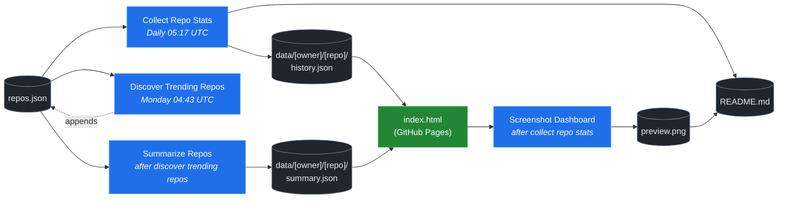

# 🚀 Rising Repos Tracker

> Automatically tracks daily GitHub stats (stars, forks, issues, velocity) for rising open source repos.

**GitHub shows a repo's star count, not how fast it is growing — this keeps a daily history so you can see which repos are actually taking off.** Runs entirely on GitHub Actions + Pages: no server, no database.

**Quick start:** 1. Fork this repo · 2. Put the repos you care about in [`repos.json`](./repos.json) · 3. Enable GitHub Pages and run **Collect Repo Stats** once. Details in [Fork & use it for yourself](#fork--use-it-for-yourself).

⭐ If the dashboard is useful to you, a star helps others find it.

[](https://www.telosignal.com/)


**[→ View Live Dashboard](https://patrick-creates.github.io/rising-repos-tracker/)**

Built and maintained by [Telosignal](https://www.telosignal.com/).


<!-- AUTOGEN-STATS-START -->
## 📊 Current snapshot

> Auto-updated daily — last refreshed 2026-10-25

| Metric | Value |
|---|---|
| Repos tracked | **220** |
| Total stars | **11,577,821** |
| Total forks | **1,700,334** |
| Fastest growing | **rea** (+18967.3/day) |

### 🔥 Top 5 by velocity

| # | Repo | Stars | Stars/day |
|---|---|---:|---:|
| 1 | [morluto/rea](https://github.com/morluto/rea) | 380,804 | +18967.3 |
| 2 | [Ebony-Vinyl/dsh-our-free-model](https://github.com/Ebony-Vinyl/dsh-our-free-model) | 42,096 | +2591.3 |
| 3 | [debpalash/VoiceStudio](https://github.com/debpalash/VoiceStudio) | 85,507 | +1360.2 |
| 4 | [DietrichGebert/ponytail](https://github.com/DietrichGebert/ponytail) | 175,759 | +1021.9 |
| 5 | [stablyai/orca](https://github.com/stablyai/orca) | 105,230 | +834.7 |

### 🆕 Recently added

- [paperclipai/paperclip](https://github.com/paperclipai/paperclip) — added 2026-10-19 — The open-source app everyone uses to manage agents at work
- [Ebony-Vinyl/dsh-our-free-model](https://github.com/Ebony-Vinyl/dsh-our-free-model) — added 2026-10-19 — 在 dsh 里装上这个插件即可，无需登录、注册或填 API Key，就能使用包括 DeepSeek V4.1 Flash、Kimi K3 在内的前沿模型——完全免费，不限量。 All you do is install this plugin in dsh: no login, no sign-up, no API key — the frontier models are just there, DeepSeek V4.1 Flash and Kimi K3 among them. Completely free, with no usage cap.
- [trailhq/Trail-Code](https://github.com/trailhq/Trail-Code) — added 2026-10-19 — Turbocharge Claude Code, Cursor, Codex, Gemini & every coding agent: faster, cheaper, with contextual understanding specific to your codebase.
<!-- AUTOGEN-STATS-END -->

<!-- AUTOGEN-DIAGRAM-START -->
## 🔄 How it works


```mermaid
graph LR
    repos[("repos.json")]:::data
    history[("data/[owner]/[repo]/<br/>history.json")]:::data
    summary[("data/[owner]/[repo]/<br/>summary.json")]:::data
    readme[("README.md")]:::data
    preview[("preview.png")]:::data
    dashboard["index.html<br/>(GitHub Pages)"]:::output
    collect_yml["Collect Repo Stats<br/><i>Daily 05:17 UTC</i>"]:::workflow
    discover_yml["Discover Trending Repos<br/><i>Monday 04:43 UTC</i>"]:::workflow
    screenshot_yml["Screenshot Dashboard<br/><i>after collect repo stats</i>"]:::workflow
    summarize_yml["Summarize Repos<br/><i>after discover trending repos</i>"]:::workflow
    repos --> collect_yml
    collect_yml --> history
    collect_yml --> readme
    repos --> discover_yml
    discover_yml -.->|appends| repos
    dashboard --> screenshot_yml
    screenshot_yml --> preview
    repos --> summarize_yml
    summarize_yml --> summary
    history --> dashboard
    summary --> dashboard
    preview --> readme
    classDef workflow fill:#1f6feb,stroke:#58a6ff,color:#fff
    classDef data fill:#21262d,stroke:#7d8590,color:#e6edf3
    classDef output fill:#238636,stroke:#3fb950,color:#fff
```
<!-- AUTOGEN-DIAGRAM-END -->

<!-- AUTOGEN-WORKFLOWS-START -->
## ⚙️ Workflows

| File | Schedule | Name |
|---|---|---|
| `collect.yml` | Daily 05:17 UTC | Collect Repo Stats |
| `discover.yml` | Monday 04:43 UTC | Discover Trending Repos |
| `screenshot.yml` | After Collect Repo Stats | Screenshot Dashboard |
| `summarize.yml` | After Discover Trending Repos | Summarize Repos |

> All workflows commit results directly back to the repo. Schedules are best-effort — GitHub Actions cron can drift by a few minutes.
<!-- AUTOGEN-WORKFLOWS-END -->

<!-- AUTOGEN-REPOS-START -->
## 📋 All tracked repos

| Repo | Stars | Forks | Stars/day |
|---|---:|---:|---:|
| [openclaw/openclaw](https://github.com/openclaw/openclaw) | 392,982 | 82,608 | +130.4 |
| [morluto/rea](https://github.com/morluto/rea) | 380,804 | 95,237 | +18967.3 |
| [obra/superpowers](https://github.com/obra/superpowers) | 304,771 | 27,148 | +553.6 |
| [affaan-m/everything-claude-code](https://github.com/affaan-m/everything-claude-code) | 288,338 | 42,749 | +650.2 |
| [affaan-m/ECC](https://github.com/affaan-m/ECC) | 288,338 | 42,749 | +628.2 |
| [NousResearch/hermes-agent](https://github.com/NousResearch/hermes-agent) | 256,898 | 56,230 | +659.7 |
| [microsoft/markitdown](https://github.com/microsoft/markitdown) | 192,040 | 14,341 | +418.4 |
| [Significant-Gravitas/AutoGPT](https://github.com/Significant-Gravitas/AutoGPT) | 187,738 | 45,893 | +21.0 |
| [DietrichGebert/ponytail](https://github.com/DietrichGebert/ponytail) | 175,759 | 9,585 | +1021.9 |
| [f/prompts.chat](https://github.com/f/prompts.chat) | 174,454 | 22,287 | +74.4 |
| [langgenius/dify](https://github.com/langgenius/dify) | 159,474 | 25,206 | +110.6 |
| [open-webui/open-webui](https://github.com/open-webui/open-webui) | 156,680 | 22,809 | +119.9 |
| [farion1231/cc-switch](https://github.com/farion1231/cc-switch) | 148,466 | 9,769 | +465.1 |
| [langchain-ai/langchain](https://github.com/langchain-ai/langchain) | 148,407 | 24,907 | +71.3 |
| [github/spec-kit](https://github.com/github/spec-kit) | 142,778 | 12,787 | +272.2 |
| [nextlevelbuilder/ui-ux-pro-max-skill](https://github.com/nextlevelbuilder/ui-ux-pro-max-skill) | 140,093 | 14,850 | +377.0 |
| [Graphify-Labs/graphify](https://github.com/Graphify-Labs/graphify) | 134,665 | 12,854 | +421.9 |
| [microsoft/generative-ai-for-beginners](https://github.com/microsoft/generative-ai-for-beginners) | 122,128 | 64,800 | +68.9 |
| [JuliusBrussee/caveman](https://github.com/JuliusBrussee/caveman) | 114,892 | 6,628 | +333.6 |
| [paperclipai/paperclip](https://github.com/paperclipai/paperclip) | 107,091 | 17,786 | +447.5 |
| [stablyai/orca](https://github.com/stablyai/orca) | 105,230 | 6,647 | +834.7 |
| [nexu-io/open-design](https://github.com/nexu-io/open-design) | 103,835 | 11,870 | +372.9 |
| [thedotmack/claude-mem](https://github.com/thedotmack/claude-mem) | 102,930 | 9,092 | +167.0 |
| [Leonxlnx/taste-skill](https://github.com/Leonxlnx/taste-skill) | 102,192 | 6,905 | +491.6 |
| [Panniantong/Agent-Reach](https://github.com/Panniantong/Agent-Reach) | 102,089 | 9,034 | +565.6 |
| [ruvnet/RuView](https://github.com/ruvnet/RuView) | 99,491 | 13,008 | +219.6 |
| [vllm-project/vllm](https://github.com/vllm-project/vllm) | 95,406 | 23,918 | +94.1 |
| [OpenHands/OpenHands](https://github.com/OpenHands/OpenHands) | 91,775 | 12,180 | +111.5 |
| [koala73/worldmonitor](https://github.com/koala73/worldmonitor) | 89,469 | 13,743 | +219.4 |
| [tt-a1i/archify](https://github.com/tt-a1i/archify) | 88,906 | 6,013 | +553.6 |
| [ChatGPTNextWeb/NextChat](https://github.com/ChatGPTNextWeb/NextChat) | 88,893 | 58,720 | +5.3 |
| [debpalash/VoiceStudio](https://github.com/debpalash/VoiceStudio) | 85,507 | 9,477 | +1360.2 |
| [rtk-ai/rtk](https://github.com/rtk-ai/rtk) | 84,503 | 5,372 | +218.3 |
| [datawhalechina/hello-agents](https://github.com/datawhalechina/hello-agents) | 84,473 | 10,483 | +211.3 |
| [lobehub/lobehub](https://github.com/lobehub/lobehub) | 83,473 | 16,013 | +39.2 |
| [diegosouzapw/OmniRoute](https://github.com/diegosouzapw/OmniRoute) | 80,912 | 11,839 | +619.5 |
| [dair-ai/Prompt-Engineering-Guide](https://github.com/dair-ai/Prompt-Engineering-Guide) | 79,502 | 8,719 | +30.0 |
| [shareAI-lab/learn-claude-code](https://github.com/shareAI-lab/learn-claude-code) | 79,192 | 12,657 | +113.2 |
| [ruvnet/ruflo](https://github.com/ruvnet/ruflo) | 79,125 | 9,289 | +261.7 |
| [unslothai/unsloth](https://github.com/unslothai/unsloth) | 78,534 | 7,284 | +87.7 |
| [ComposioHQ/awesome-claude-skills](https://github.com/ComposioHQ/awesome-claude-skills) | 77,878 | 9,319 | +109.3 |
| [chopratejas/headroom](https://github.com/chopratejas/headroom) | 77,762 | 6,042 | +375.8 |
| [headroomlabs-ai/headroom](https://github.com/headroomlabs-ai/headroom) | 77,762 | 6,042 | +254.9 |
| [santifer/career-ops](https://github.com/santifer/career-ops) | 77,110 | 14,260 | +199.2 |
| [career-ops-hq/career-ops](https://github.com/career-ops-hq/career-ops) | 77,110 | 14,260 | +140.2 |
| [openai/openai-cookbook](https://github.com/openai/openai-cookbook) | 76,802 | 12,975 | +20.0 |
| [rohitg00/ai-engineering-from-scratch](https://github.com/rohitg00/ai-engineering-from-scratch) | 73,464 | 12,882 | +322.6 |
| [Fission-AI/OpenSpec](https://github.com/Fission-AI/OpenSpec) | 72,931 | 4,981 | +150.9 |
| [usestrix/strix](https://github.com/usestrix/strix) | 71,739 | 8,012 | +315.3 |
| [calesthio/OpenMontage](https://github.com/calesthio/OpenMontage) | 71,730 | 9,301 | +371.9 |
| [heygen-com/hyperframes](https://github.com/heygen-com/hyperframes) | 71,716 | 6,473 | +332.1 |
| [code-yeongyu/oh-my-openagent](https://github.com/code-yeongyu/oh-my-openagent) | 70,326 | 5,787 | +75.0 |
| [asgeirtj/system_prompts_leaks](https://github.com/asgeirtj/system_prompts_leaks) | 70,168 | 11,367 | +186.1 |
| [shanraisshan/claude-code-best-practice](https://github.com/shanraisshan/claude-code-best-practice) | 67,994 | 6,767 | +90.6 |
| [ZhuLinsen/daily_stock_analysis](https://github.com/ZhuLinsen/daily_stock_analysis) | 67,026 | 55,621 | +184.2 |
| [xtekky/gpt4free](https://github.com/xtekky/gpt4free) | 66,924 | 13,461 | +4.3 |
| [mvanhorn/last30days-skill](https://github.com/mvanhorn/last30days-skill) | 65,372 | 5,674 | +235.3 |
| [MadsLorentzen/ai-job-search](https://github.com/MadsLorentzen/ai-job-search) | 65,224 | 20,335 | +419.6 |
| [tw93/Pake](https://github.com/tw93/Pake) | 62,303 | 12,827 | +84.5 |
| [BerriAI/litellm](https://github.com/BerriAI/litellm) | 61,997 | 12,647 | +91.3 |
| [blader/humanizer](https://github.com/blader/humanizer) | 60,393 | 4,786 | +291.9 |
| [MemPalace/mempalace](https://github.com/MemPalace/mempalace) | 59,729 | 7,576 | +45.8 |
| [jamiepine/voicebox](https://github.com/jamiepine/voicebox) | 58,488 | 7,340 | +201.8 |
| [hesreallyhim/awesome-claude-code](https://github.com/hesreallyhim/awesome-claude-code) | 56,472 | 4,864 | +77.4 |
| [coreyhaines31/marketingskills](https://github.com/coreyhaines31/marketingskills) | 56,421 | 8,341 | +171.1 |
| [router-for-me/CLIProxyAPI](https://github.com/router-for-me/CLIProxyAPI) | 56,175 | 8,583 | +140.1 |
| [bojieli/ai-agent-book](https://github.com/bojieli/ai-agent-book) | 55,773 | 6,396 | +493.0 |
| [FlowiseAI/Flowise](https://github.com/FlowiseAI/Flowise) | 55,525 | 25,083 | +16.4 |
| [ggml-org/whisper.cpp](https://github.com/ggml-org/whisper.cpp) | 54,645 | 6,237 | +30.1 |
| [K-Dense-AI/scientific-agent-skills](https://github.com/K-Dense-AI/scientific-agent-skills) | 54,496 | 4,805 | +229.6 |
| [ChromeDevTools/chrome-devtools-mcp](https://github.com/ChromeDevTools/chrome-devtools-mcp) | 54,099 | 6,277 | +88.8 |
| [Imbad0202/academic-research-skills](https://github.com/Imbad0202/academic-research-skills) | 53,796 | 4,128 | +156.7 |
| [elder-plinius/CL4R1T4S](https://github.com/elder-plinius/CL4R1T4S) | 51,492 | 10,523 | +95.5 |
| [QuantumNous/new-api](https://github.com/QuantumNous/new-api) | 50,649 | 12,248 | +99.9 |
| [kepano/obsidian-skills](https://github.com/kepano/obsidian-skills) | 50,037 | 3,539 | +110.6 |
| [Aider-AI/aider](https://github.com/Aider-AI/aider) | 49,743 | 5,104 | +29.9 |
| [HKUDS/nanobot](https://github.com/HKUDS/nanobot) | 49,339 | 8,675 | +41.6 |
| [sickn33/antigravity-awesome-skills](https://github.com/sickn33/antigravity-awesome-skills) | 48,476 | 7,049 | +64.0 |
| [sickn33/agentic-awesome-skills](https://github.com/sickn33/agentic-awesome-skills) | 48,476 | 7,049 | +52.3 |
| [alibaba/open-code-review](https://github.com/alibaba/open-code-review) | 48,228 | 3,532 | +344.5 |
| [zhayujie/CowAgent](https://github.com/zhayujie/CowAgent) | 47,567 | 10,406 | +18.8 |
| [DeusData/codebase-memory-mcp](https://github.com/DeusData/codebase-memory-mcp) | 47,438 | 3,898 | +227.2 |
| [danny-avila/LibreChat](https://github.com/danny-avila/LibreChat) | 46,274 | 9,510 | +57.5 |
| [LibreChat-AI/LibreChat](https://github.com/LibreChat-AI/LibreChat) | 46,274 | 9,510 | +46.3 |
| [ogulcancelik/herdr](https://github.com/ogulcancelik/herdr) | 45,751 | 3,638 | +300.5 |
| [herdrdev/herdr](https://github.com/herdrdev/herdr) | 45,751 | 3,638 | +264.6 |
| [chatanywhere/GPT_API_free](https://github.com/chatanywhere/GPT_API_free) | 44,812 | 2,752 | +43.5 |
| [anthropics/claude-plugins-official](https://github.com/anthropics/claude-plugins-official) | 44,431 | 4,659 | +105.6 |
| [langchain-ai/langgraph](https://github.com/langchain-ai/langgraph) | 43,861 | 7,535 | +67.5 |
| [AstrBotDevs/AstrBot](https://github.com/AstrBotDevs/AstrBot) | 43,323 | 3,180 | +66.7 |
| [tinyhumansai/openhuman](https://github.com/tinyhumansai/openhuman) | 42,322 | 4,181 | +59.0 |
| [chatboxai/chatbox](https://github.com/chatboxai/chatbox) | 42,136 | 4,289 | +13.4 |
| [Ebony-Vinyl/dsh-our-free-model](https://github.com/Ebony-Vinyl/dsh-our-free-model) | 42,096 | 1,202 | +2591.3 |
| [wshobson/agents](https://github.com/wshobson/agents) | 41,664 | 4,418 | +37.4 |
| [Hmbown/CodeWhale](https://github.com/Hmbown/CodeWhale) | 41,118 | 3,566 | +42.1 |
| [Hmbown/Codewhale](https://github.com/Hmbown/Codewhale) | 41,118 | 3,566 | +4.2 |
| [codewhale-hq/Codewhale](https://github.com/codewhale-hq/Codewhale) | 41,118 | 3,566 | +3.5 |
| [volcengine/OpenViking](https://github.com/volcengine/OpenViking) | 40,768 | 3,300 | +111.1 |
| [github/awesome-copilot](https://github.com/github/awesome-copilot) | 40,384 | 5,213 | +43.0 |
| [Yeachan-Heo/oh-my-claudecode](https://github.com/Yeachan-Heo/oh-my-claudecode) | 40,241 | 3,597 | +35.4 |
| [mindsdb/mindshub](https://github.com/mindsdb/mindshub) | 39,812 | 6,241 | +4.0 |
| [google/langextract](https://github.com/google/langextract) | 39,037 | 2,727 | +16.2 |
| [AlexsJones/llmfit](https://github.com/AlexsJones/llmfit) | 38,350 | 2,472 | +77.7 |
| [PDFMathTranslate/PDFMathTranslate](https://github.com/PDFMathTranslate/PDFMathTranslate) | 37,850 | 3,393 | +25.1 |
| [JCodesMore/ai-website-cloner-template](https://github.com/JCodesMore/ai-website-cloner-template) | 37,344 | 5,471 | +154.2 |
| [songquanpeng/one-api](https://github.com/songquanpeng/one-api) | 37,243 | 6,888 | +19.8 |
| [HKUDS/Vibe-Trading](https://github.com/HKUDS/Vibe-Trading) | 36,607 | 5,913 | +185.3 |
| [can1357/oh-my-pi](https://github.com/can1357/oh-my-pi) | 36,515 | 4,076 | +180.2 |
| [p-e-w/heretic](https://github.com/p-e-w/heretic) | 36,435 | 4,139 | +89.7 |
| [agentscope-ai/QwenPaw](https://github.com/agentscope-ai/QwenPaw) | 36,112 | 3,208 | +138.9 |
| [virgiliojr94/book-to-skill](https://github.com/virgiliojr94/book-to-skill) | 36,015 | 3,809 | +180.4 |
| [esengine/DeepSeek-Reasonix](https://github.com/esengine/DeepSeek-Reasonix) | 35,959 | 2,479 | +118.2 |
| [Tencent/WeKnora](https://github.com/Tencent/WeKnora) | 35,336 | 4,758 | +144.3 |
| [mukul975/Anthropic-Cybersecurity-Skills](https://github.com/mukul975/Anthropic-Cybersecurity-Skills) | 34,971 | 4,260 | +134.8 |
| [Gitlawb/openclaude](https://github.com/Gitlawb/openclaude) | 34,142 | 9,130 | +41.1 |
| [Twigpine/openclaude](https://github.com/Twigpine/openclaude) | 34,142 | 9,130 | +24.9 |
| [ifixai-ai/iFixAi](https://github.com/ifixai-ai/iFixAi) | 34,140 | 1,705 | +341.7 |
| [iOfficeAI/AionUi](https://github.com/iOfficeAI/AionUi) | 33,754 | 3,499 | +43.9 |
| [zeroclaw-labs/zeroclaw](https://github.com/zeroclaw-labs/zeroclaw) | 33,043 | 4,987 | +9.4 |
| [iOfficeAI/OfficeCLI](https://github.com/iOfficeAI/OfficeCLI) | 32,422 | 2,204 | +216.4 |
| [tirth8205/code-review-graph](https://github.com/tirth8205/code-review-graph) | 32,380 | 2,957 | +105.0 |
| [mksglu/context-mode](https://github.com/mksglu/context-mode) | 32,165 | 2,225 | +111.3 |
| [googleworkspace/cli](https://github.com/googleworkspace/cli) | 31,863 | 1,953 | +35.2 |
| [decolua/9router](https://github.com/decolua/9router) | 31,373 | 6,075 | +104.6 |
| [jackwener/OpenCLI](https://github.com/jackwener/OpenCLI) | 30,621 | 3,001 | +49.1 |
| [langchain-ai/deepagents](https://github.com/langchain-ai/deepagents) | 30,568 | 4,306 | +46.1 |
| [TencentCloud/TencentDB-Agent-Memory](https://github.com/TencentCloud/TencentDB-Agent-Memory) | 29,906 | 2,902 | +203.7 |
| [rohitg00/agentmemory](https://github.com/rohitg00/agentmemory) | 29,875 | 2,639 | +57.9 |
| [alibaba/page-agent](https://github.com/alibaba/page-agent) | 29,561 | 2,640 | +83.4 |
| [jarrodwatts/claude-hud](https://github.com/jarrodwatts/claude-hud) | 28,857 | 1,327 | +30.0 |
| [voideditor/void](https://github.com/voideditor/void) | 28,734 | 2,657 | — |
| [BloopAI/vibe-kanban](https://github.com/BloopAI/vibe-kanban) | 28,446 | 3,034 | +11.9 |
| [manaflow-ai/cmux](https://github.com/manaflow-ai/cmux) | 28,395 | 2,577 | +38.8 |
| [t8y2/dbx](https://github.com/t8y2/dbx) | 27,706 | 2,480 | +176.3 |
| [zai-org/Open-AutoGLM](https://github.com/zai-org/Open-AutoGLM) | 26,478 | 4,056 | +7.3 |
| [toon-format/toon](https://github.com/toon-format/toon) | 25,554 | 1,125 | +7.6 |
| [hypit-ai/hypit](https://github.com/hypit-ai/hypit) | 25,487 | 2,907 | +310.7 |
| [pascalorg/editor](https://github.com/pascalorg/editor) | 25,090 | 3,126 | +50.5 |
| [every-app/open-seo](https://github.com/every-app/open-seo) | 24,858 | 3,387 | +151.3 |
| [guillaumemeyer/watermarks-remover](https://github.com/guillaumemeyer/watermarks-remover) | 24,841 | 2,849 | +117.6 |
| [jundot/omlx](https://github.com/jundot/omlx) | 23,041 | 2,060 | +48.6 |
| [pranshuparmar/witr](https://github.com/pranshuparmar/witr) | 22,788 | 803 | +40.3 |
| [steipete/CodexBar](https://github.com/steipete/CodexBar) | 22,786 | 2,156 | +60.7 |
| [winfunc/opcode](https://github.com/winfunc/opcode) | 22,421 | 1,708 | +3.0 |
| [NirDiamant/agents-towards-production](https://github.com/NirDiamant/agents-towards-production) | 21,767 | 2,881 | +8.2 |
| [coze-dev/coze-studio](https://github.com/coze-dev/coze-studio) | 21,757 | 3,133 | +5.8 |
| [KKKKhazix/khazix-skills](https://github.com/KKKKhazix/khazix-skills) | 21,639 | 2,281 | +43.1 |
| [jnMetaCode/agency-agents-zh](https://github.com/jnMetaCode/agency-agents-zh) | 21,569 | 3,472 | +49.3 |
| [NVIDIA/SkillSpector](https://github.com/NVIDIA/SkillSpector) | 21,460 | 1,891 | +105.4 |
| [walkinglabs/learn-harness-engineering](https://github.com/walkinglabs/learn-harness-engineering) | 21,373 | 2,391 | +103.5 |
| [1jehuang/jcode](https://github.com/1jehuang/jcode) | 21,194 | 2,458 | +123.9 |
| [datawhalechina/easy-vibe](https://github.com/datawhalechina/easy-vibe) | 20,155 | 1,952 | +24.3 |
| [AgriciDaniel/claude-seo](https://github.com/AgriciDaniel/claude-seo) | 20,141 | 2,907 | +79.4 |
| [tanweai/pua](https://github.com/tanweai/pua) | 19,742 | 1,203 | +11.3 |
| [danielmiessler/LifeOS](https://github.com/danielmiessler/LifeOS) | 19,575 | 2,503 | +28.1 |
| [jlcodes99/cockpit-tools](https://github.com/jlcodes99/cockpit-tools) | 19,318 | 1,723 | +50.6 |
| [nesquena/hermes-webui](https://github.com/nesquena/hermes-webui) | 19,170 | 2,775 | +34.7 |
| [microsoft/agent-lightning](https://github.com/microsoft/agent-lightning) | 18,807 | 1,692 | +11.3 |
| [browser-use/browser-harness](https://github.com/browser-use/browser-harness) | 18,606 | 1,838 | +26.5 |
| [RightNow-AI/openfang](https://github.com/RightNow-AI/openfang) | 18,222 | 2,285 | +3.0 |
| [wanshuiyin/Auto-claude-code-research-in-sleep](https://github.com/wanshuiyin/Auto-claude-code-research-in-sleep) | 18,038 | 1,489 | +44.6 |
| [tradecatlabs/vibe-coding-cn](https://github.com/tradecatlabs/vibe-coding-cn) | 17,751 | 1,791 | +36.1 |
| [rocketride-org/rocketride-server](https://github.com/rocketride-org/rocketride-server) | 17,703 | 7,487 | — |
| [MemoriLabs/Memori](https://github.com/MemoriLabs/Memori) | 17,143 | 3,697 | +14.4 |
| [composio-community/awesome-codex-skills](https://github.com/composio-community/awesome-codex-skills) | 17,040 | 1,709 | +17.8 |
| [cft0808/edict](https://github.com/cft0808/edict) | 17,012 | 1,767 | +7.2 |
| [xbtlin/ai-berkshire](https://github.com/xbtlin/ai-berkshire) | 16,872 | 2,475 | +54.9 |
| [dataelement/dsh-desktop](https://github.com/dataelement/dsh-desktop) | 16,860 | 559 | +259.7 |
| [xpzouying/xiaohongshu-mcp](https://github.com/xpzouying/xiaohongshu-mcp) | 16,555 | 2,426 | +18.1 |
| [Anionex/banana-slides](https://github.com/Anionex/banana-slides) | 15,869 | 1,787 | +6.0 |
| [superset-sh/superset](https://github.com/superset-sh/superset) | 15,533 | 1,376 | +28.6 |
| [yusufkaraaslan/Skill_Seekers](https://github.com/yusufkaraaslan/Skill_Seekers) | 15,217 | 1,543 | +7.9 |
| [NanmiCoder/cc-haha](https://github.com/NanmiCoder/cc-haha) | 15,157 | 8,605 | +15.4 |
| [kyegomez/OpenMythos](https://github.com/kyegomez/OpenMythos) | 14,911 | 3,271 | +6.0 |
| [NevaMind-AI/memU](https://github.com/NevaMind-AI/memU) | 14,561 | 1,091 | +5.3 |
| [XiaomiMiMo/MiMo-Code](https://github.com/XiaomiMiMo/MiMo-Code) | 13,720 | 1,445 | +22.8 |
| [EverMind-AI/EverOS](https://github.com/EverMind-AI/EverOS) | 13,598 | 947 | +32.9 |
| [sirmalloc/ccstatusline](https://github.com/sirmalloc/ccstatusline) | 13,401 | 595 | +18.0 |
| [ConardLi/garden-skills](https://github.com/ConardLi/garden-skills) | 13,257 | 1,570 | +36.7 |
| [brokermr810/QuantDinger](https://github.com/brokermr810/QuantDinger) | 13,101 | 2,662 | +34.4 |
| [OpenByteInc/QuantDinger](https://github.com/OpenByteInc/QuantDinger) | 13,101 | 2,662 | +34.0 |
| [0x4m4/hexstrike-ai](https://github.com/0x4m4/hexstrike-ai) | 13,087 | 2,653 | +26.1 |
| [MemTensor/MemOS](https://github.com/MemTensor/MemOS) | 12,084 | 1,091 | +17.4 |
| [getagentseal/codeburn](https://github.com/getagentseal/codeburn) | 11,575 | 892 | +28.0 |
| [EKKOLearnAI/hermes-studio](https://github.com/EKKOLearnAI/hermes-studio) | 11,538 | 1,432 | +24.1 |
| [EKKOLearnAI/ekko-studio](https://github.com/EKKOLearnAI/ekko-studio) | 11,538 | 1,432 | +11.6 |
| [holaboss-ai/holaOS](https://github.com/holaboss-ai/holaOS) | 11,425 | 720 | +44.3 |
| [openai/codex-security](https://github.com/openai/codex-security) | 11,196 | 881 | +35.1 |
| [aden-hive/hive](https://github.com/aden-hive/hive) | 11,124 | 5,645 | +4.3 |
| [ValueCell-ai/valuecell](https://github.com/ValueCell-ai/valuecell) | 11,030 | 1,801 | +1.3 |
| [TencentCloud/Octop](https://github.com/TencentCloud/Octop) | 10,965 | 1,411 | +163.7 |
| [genspark-ai/genoffice](https://github.com/genspark-ai/genoffice) | 10,779 | 1,456 | +99.7 |
| [trailhq/Graft](https://github.com/trailhq/Graft) | 10,732 | 953 | +76.7 |
| [trailhq/Trail-Code](https://github.com/trailhq/Trail-Code) | 10,732 | 953 | +51.0 |
| [StarTrail-org/PixelRAG](https://github.com/StarTrail-org/PixelRAG) | 10,349 | 917 | +36.2 |
| [Kuberwastaken/claurst](https://github.com/Kuberwastaken/claurst) | 10,327 | 7,683 | +3.9 |
| [ykdojo/claude-code-tips](https://github.com/ykdojo/claude-code-tips) | 10,267 | 829 | +11.3 |
| [Companion-Inc/feynman](https://github.com/Companion-Inc/feynman) | 10,018 | 1,107 | +7.6 |
| [frankbria/ralph-claude-code](https://github.com/frankbria/ralph-claude-code) | 9,716 | 730 | +3.7 |
| [modem-dev/hunk](https://github.com/modem-dev/hunk) | 9,680 | 323 | +28.6 |
| [Tencent/BrowserSkill](https://github.com/Tencent/BrowserSkill) | 9,520 | 686 | +68.9 |
| [Nasiko-Labs/nasiko](https://github.com/Nasiko-Labs/nasiko) | 9,453 | 2,035 | +16.5 |
| [1weiho/open-slide](https://github.com/1weiho/open-slide) | 9,404 | 682 | +43.2 |
| [open-slide/open-slide](https://github.com/open-slide/open-slide) | 9,404 | 682 | +41.6 |
| [iflytek/astron-agent](https://github.com/iflytek/astron-agent) | 8,924 | 907 | +2.8 |
| [EvoMap/evolver](https://github.com/EvoMap/evolver) | 8,701 | 841 | — |
| [MiroMindAI/MiroThinker](https://github.com/MiroMindAI/MiroThinker) | 8,426 | 650 | +0.9 |
| [mmulet/term.everything](https://github.com/mmulet/term.everything) | 8,116 | 195 | +0.8 |
| [rorkai/App-Store-Connect-CLI](https://github.com/rorkai/App-Store-Connect-CLI) | 8,034 | 690 | +23.7 |
| [WenyuChiou/awesome-agentic-ai-zh](https://github.com/WenyuChiou/awesome-agentic-ai-zh) | 7,988 | 1,032 | +26.1 |
| [ValueCell-ai/ClawX](https://github.com/ValueCell-ai/ClawX) | 7,603 | 1,140 | +0.6 |
| [tech-leads-club/agent-skills](https://github.com/tech-leads-club/agent-skills) | 7,091 | 563 | +15.3 |
| [opensquilla/opensquilla](https://github.com/opensquilla/opensquilla) | 7,082 | 583 | +9.0 |
| [TokenRhythm/opensquilla](https://github.com/TokenRhythm/opensquilla) | 7,082 | 583 | +2.4 |
| [Andyyyy64/whichllm](https://github.com/Andyyyy64/whichllm) | 6,786 | 372 | +9.5 |
| [steipete/summarize](https://github.com/steipete/summarize) | 6,745 | 454 | +3.2 |
| [Arthur-Ficial/apfel](https://github.com/Arthur-Ficial/apfel) | 6,523 | 247 | +3.9 |
| [microsoft/fara](https://github.com/microsoft/fara) | 6,221 | 603 | +2.1 |
| [UfoMiao/zcf](https://github.com/UfoMiao/zcf) | 6,080 | 420 | +0.1 |
| [re4/LibreCode](https://github.com/re4/LibreCode) | 88 | 4 | — |
<!-- AUTOGEN-REPOS-END -->

---

## What it does

- Collects daily snapshots of stars, forks, watchers and open issues for every tracked repo
- Discovers new trending repos automatically every Monday using the GitHub Search API
- Generates AI summaries (use cases, similar tools, tags) for each tracked repo via GitHub Models
- Stores all history as plain JSON — no database, no backend
- Renders a live dashboard via GitHub Pages — updates daily, zero maintenance

## Tracked repos

Data lives in [`data/`](./data) — one folder per repo, one `history.json` per entry.  
The full watch list is in [`repos.json`](./repos.json).

## Fork & use it for yourself

This is my personal tracker — the watch list reflects what I find interesting. If you want to track different repos, the best path is to **fork this repo and run your own**.

### Setup

1. Fork this repo to your account
2. Replace the contents of [`repos.json`](./repos.json) with the repos you want to track (or just leave one entry — `discover.yml` will auto-add more every Monday)
3. Go to **Settings → Pages** and enable GitHub Pages from the `main` branch
4. Go to **Actions**, enable workflows (GitHub disables them on forks by default) and run **Collect Repo Stats** once manually to seed your first data point
5. Your dashboard will be live at `https://YOUR-USERNAME.github.io/rising-repos-tracker/`

That's it — daily collection and weekly discovery run automatically on schedule. Zero ongoing maintenance.

### Customizing what gets discovered

Edit [`scripts/discover.js`](./scripts/discover.js) to change:

- `MIN_STARS` — minimum star threshold for candidates
- `MAX_AGE_DAYS` — how recent a repo must be
- `MAX_NEW_REPOS` — how many to add per discovery run
- The `queries` array — GitHub Search API queries that define what "trending" means to you

### Adding a repo manually

Just edit `repos.json` directly:

```json
{
  "owner": "OWNER",
  "repo": "REPO",
  "added": "YYYY-MM-DD",
  "notes": "why you're tracking this"
}
```

The next daily collect run picks it up automatically.

## Stack

- **GitHub Actions** — scheduling and automation
- **GitHub Pages** — dashboard hosting
- **GitHub API** — data source
- **GitHub Models** — free AI summaries (gpt-4o-mini)
- **Chart.js** — star growth visualization
- **Mermaid** — architecture diagram (rendered by GitHub)
- No dependencies, no build step, no database

## License

MIT
