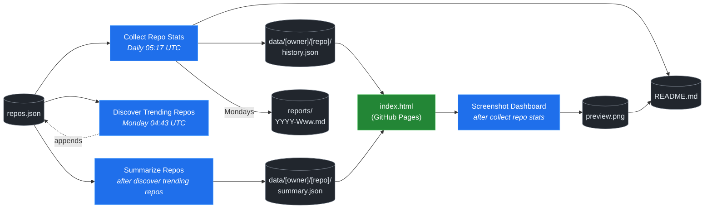

# 🚀 Rising Repos Tracker

> Automatically tracks daily GitHub stats (stars, forks, issues, velocity) for rising open source repos.

**GitHub shows a repo's star count, not how fast it is growing — this keeps a daily history so you can see which repos are actually taking off.** Runs entirely on GitHub Actions + Pages: no server, no database.

**Quick start:** 1. Fork this repo · 2. Delete my `data/` and `reports/`, put the repos you care about in [`repos.json`](./repos.json) · 3. Enable GitHub Pages and run **Collect Repo Stats** once. Details in [Fork & use it for yourself](#fork--use-it-for-yourself).

⭐ If the dashboard is useful to you, a star helps others find it.

[](https://www.telosignal.com/)


**[→ View Live Dashboard](https://patrick-creates.github.io/rising-repos-tracker/)** · **[→ Weekly reports](./reports/README.md)**

Built and maintained by [Telosignal](https://www.telosignal.com/).


<!-- AUTOGEN-STATS-START -->
## 📊 Current snapshot

> Auto-updated daily — last refreshed 2026-11-04

| Metric | Value |
|---|---|
| Repos tracked | **213** |
| Total stars | **11,336,053** |
| Total forks | **1,653,705** |
| Fastest growing | **rea** (+12827.4/day) |

### 🔥 Top 5 by velocity

| # | Repo | Stars | Stars/day |
|---|---|---:|---:|
| 1 | [morluto/rea](https://github.com/morluto/rea) | 429,259 | +12827.4 |
| 2 | [Ebony-Vinyl/dsh-our-free-model](https://github.com/Ebony-Vinyl/dsh-our-free-model) | 60,180 | +2102.0 |
| 3 | [debpalash/VoiceStudio](https://github.com/debpalash/VoiceStudio) | 100,578 | +1385.5 |
| 4 | [DietrichGebert/ponytail](https://github.com/DietrichGebert/ponytail) | 184,176 | +1008.6 |
| 5 | [pbakaus/impeccable](https://github.com/pbakaus/impeccable) | 102,049 | +1002.5 |

### 🆕 Recently added

- [pbakaus/impeccable](https://github.com/pbakaus/impeccable) — added 2026-11-02 — The design vocabulary for your coding agent. Steer with polish and bolder, review with critique and audit, catch AI slop before it ships.
- [Tracer-Cloud/opensre](https://github.com/Tracer-Cloud/opensre) — added 2026-11-02 — The open-source agent for CI/CD reliability.
- [makecindy/cindy](https://github.com/makecindy/cindy) — added 2026-11-02 — Consider it done. The open-source AI agent that works out of the box · 想到，就能做到。开源、开箱即用的 AI Agent。
<!-- AUTOGEN-STATS-END -->

<!-- AUTOGEN-DIAGRAM-START -->
## 🔄 How it works


```mermaid
graph LR
    repos[("repos.json")]:::data
    history[("data/[owner]/[repo]/<br/>history.json")]:::data
    summary[("data/[owner]/[repo]/<br/>summary.json")]:::data
    readme[("README.md")]:::data
    reports[("reports/<br/>YYYY-Www.md")]:::data
    preview[("preview.png")]:::data
    dashboard["index.html<br/>(GitHub Pages)"]:::output
    collect_yml["Collect Repo Stats<br/><i>Daily 05:17 UTC</i>"]:::workflow
    discover_yml["Discover Trending Repos<br/><i>Monday 04:43 UTC</i>"]:::workflow
    screenshot_yml["Screenshot Dashboard<br/><i>after collect repo stats</i>"]:::workflow
    summarize_yml["Summarize Repos<br/><i>after discover trending repos</i>"]:::workflow
    repos --> collect_yml
    collect_yml --> history
    collect_yml --> readme
    collect_yml -->|Mondays| reports
    repos --> discover_yml
    discover_yml -.->|appends| repos
    dashboard --> screenshot_yml
    screenshot_yml --> preview
    repos --> summarize_yml
    summarize_yml --> summary
    history --> dashboard
    summary --> dashboard
    preview --> readme
    classDef workflow fill:#1f6feb,stroke:#58a6ff,color:#fff
    classDef data fill:#21262d,stroke:#7d8590,color:#e6edf3
    classDef output fill:#238636,stroke:#3fb950,color:#fff
```
<!-- AUTOGEN-DIAGRAM-END -->

<!-- AUTOGEN-WORKFLOWS-START -->
## ⚙️ Workflows

| File | Schedule | Name |
|---|---|---|
| `collect.yml` | Daily 05:17 UTC | Collect Repo Stats |
| `discover.yml` | Monday 04:43 UTC | Discover Trending Repos |
| `screenshot.yml` | After Collect Repo Stats | Screenshot Dashboard |
| `summarize.yml` | After Discover Trending Repos | Summarize Repos |

> All workflows commit results directly back to the repo. Schedules are best-effort — GitHub Actions cron can drift by a few minutes.
<!-- AUTOGEN-WORKFLOWS-END -->

<!-- AUTOGEN-REPOS-START -->
## 📋 All tracked repos

| Repo | Stars | Forks | Stars/day |
|---|---:|---:|---:|
| [morluto/rea](https://github.com/morluto/rea) | 429,259 | 106,765 | +12827.4 |
| [openclaw/openclaw](https://github.com/openclaw/openclaw) | 393,877 | 82,781 | +128.0 |
| [obra/superpowers](https://github.com/obra/superpowers) | 312,172 | 27,767 | +567.4 |
| [affaan-m/ECC](https://github.com/affaan-m/ECC) | 296,885 | 43,892 | +661.9 |
| [NousResearch/hermes-agent](https://github.com/NousResearch/hermes-agent) | 260,427 | 57,396 | +642.2 |
| [microsoft/markitdown](https://github.com/microsoft/markitdown) | 193,831 | 14,550 | +404.7 |
| [Significant-Gravitas/AutoGPT](https://github.com/Significant-Gravitas/AutoGPT) | 187,896 | 45,901 | +20.7 |
| [DietrichGebert/ponytail](https://github.com/DietrichGebert/ponytail) | 184,176 | 10,160 | +1008.6 |
| [f/prompts.chat](https://github.com/f/prompts.chat) | 175,764 | 22,424 | +77.7 |
| [langgenius/dify](https://github.com/langgenius/dify) | 160,390 | 25,367 | +109.5 |
| [open-webui/open-webui](https://github.com/open-webui/open-webui) | 157,740 | 22,941 | +119.1 |
| [farion1231/cc-switch](https://github.com/farion1231/cc-switch) | 151,753 | 9,971 | +457.1 |
| [langchain-ai/langchain](https://github.com/langchain-ai/langchain) | 149,001 | 25,050 | +70.7 |
| [github/spec-kit](https://github.com/github/spec-kit) | 146,948 | 13,184 | +280.5 |
| [nextlevelbuilder/ui-ux-pro-max-skill](https://github.com/nextlevelbuilder/ui-ux-pro-max-skill) | 145,026 | 15,338 | +383.6 |
| [Graphify-Labs/graphify](https://github.com/Graphify-Labs/graphify) | 142,143 | 13,586 | +454.4 |
| [microsoft/generative-ai-for-beginners](https://github.com/microsoft/generative-ai-for-beginners) | 122,962 | 65,884 | +69.8 |
| [JuliusBrussee/caveman](https://github.com/JuliusBrussee/caveman) | 117,391 | 6,812 | +328.7 |
| [stablyai/orca](https://github.com/stablyai/orca) | 115,026 | 7,268 | +846.6 |
| [thedotmack/claude-mem](https://github.com/thedotmack/claude-mem) | 112,452 | 9,774 | +211.8 |
| [paperclipai/paperclip](https://github.com/paperclipai/paperclip) | 110,987 | 18,382 | +411.3 |
| [Leonxlnx/taste-skill](https://github.com/Leonxlnx/taste-skill) | 109,799 | 7,383 | +508.9 |
| [Panniantong/Agent-Reach](https://github.com/Panniantong/Agent-Reach) | 108,638 | 9,693 | +571.6 |
| [nexu-io/open-design](https://github.com/nexu-io/open-design) | 105,861 | 12,055 | +362.9 |
| [ruvnet/RuView](https://github.com/ruvnet/RuView) | 102,331 | 13,293 | +223.5 |
| [pbakaus/impeccable](https://github.com/pbakaus/impeccable) | 102,049 | 6,016 | +1002.5 |
| [debpalash/VoiceStudio](https://github.com/debpalash/VoiceStudio) | 100,578 | 11,137 | +1385.5 |
| [vllm-project/vllm](https://github.com/vllm-project/vllm) | 96,293 | 24,397 | +93.8 |
| [tt-a1i/archify](https://github.com/tt-a1i/archify) | 93,328 | 6,363 | +516.5 |
| [OpenHands/OpenHands](https://github.com/OpenHands/OpenHands) | 92,623 | 12,359 | +109.9 |
| [koala73/worldmonitor](https://github.com/koala73/worldmonitor) | 90,139 | 13,929 | +210.4 |
| [ChatGPTNextWeb/NextChat](https://github.com/ChatGPTNextWeb/NextChat) | 88,937 | 58,629 | +5.3 |
| [datawhalechina/hello-agents](https://github.com/datawhalechina/hello-agents) | 86,014 | 10,720 | +208.0 |
| [rtk-ai/rtk](https://github.com/rtk-ai/rtk) | 85,534 | 5,476 | +211.5 |
| [cheaper-inference/OmniRoute](https://github.com/cheaper-inference/OmniRoute) | 84,428 | 12,679 | +597.3 |
| [lobehub/lobehub](https://github.com/lobehub/lobehub) | 83,838 | 16,046 | +39.1 |
| [ruvnet/ruflo](https://github.com/ruvnet/ruflo) | 80,839 | 9,489 | +231.6 |
| [career-ops-hq/career-ops](https://github.com/career-ops-hq/career-ops) | 80,035 | 14,733 | +204.6 |
| [shareAI-lab/learn-claude-code](https://github.com/shareAI-lab/learn-claude-code) | 79,863 | 12,785 | +110.5 |
| [dair-ai/Prompt-Engineering-Guide](https://github.com/dair-ai/Prompt-Engineering-Guide) | 79,796 | 8,763 | +30.0 |
| [unslothai/unsloth](https://github.com/unslothai/unsloth) | 79,045 | 7,353 | +85.6 |
| [headroomlabs-ai/headroom](https://github.com/headroomlabs-ai/headroom) | 78,814 | 6,158 | +356.7 |
| [ComposioHQ/awesome-claude-skills](https://github.com/ComposioHQ/awesome-claude-skills) | 78,712 | 9,536 | +107.8 |
| [heygen-com/hyperframes](https://github.com/heygen-com/hyperframes) | 78,675 | 7,243 | +356.5 |
| [openai/openai-cookbook](https://github.com/openai/openai-cookbook) | 76,947 | 13,038 | +19.6 |
| [rohitg00/ai-engineering-from-scratch](https://github.com/rohitg00/ai-engineering-from-scratch) | 76,796 | 13,593 | +323.3 |
| [calesthio/OpenMontage](https://github.com/calesthio/OpenMontage) | 76,244 | 10,110 | +378.1 |
| [Fission-AI/OpenSpec](https://github.com/Fission-AI/OpenSpec) | 73,898 | 5,063 | +147.7 |
| [usestrix/strix](https://github.com/usestrix/strix) | 73,684 | 8,298 | +307.5 |
| [asgeirtj/system_prompts_leaks](https://github.com/asgeirtj/system_prompts_leaks) | 70,745 | 11,449 | +178.6 |
| [code-yeongyu/oh-my-openagent](https://github.com/code-yeongyu/oh-my-openagent) | 70,691 | 5,831 | +72.7 |
| [ai-job-search-dev/ai-job-search](https://github.com/ai-job-search-dev/ai-job-search) | 69,494 | 22,320 | +420.3 |
| [shanraisshan/claude-code-best-practice](https://github.com/shanraisshan/claude-code-best-practice) | 68,536 | 6,821 | +88.5 |
| [ZhuLinsen/daily_stock_analysis](https://github.com/ZhuLinsen/daily_stock_analysis) | 67,542 | 55,893 | +176.1 |
| [xtekky/gpt4free](https://github.com/xtekky/gpt4free) | 67,003 | 13,464 | +4.5 |
| [mvanhorn/last30days-skill](https://github.com/mvanhorn/last30days-skill) | 66,561 | 5,824 | +227.4 |
| [blader/humanizer](https://github.com/blader/humanizer) | 64,657 | 5,099 | +328.2 |
| [tw93/Pake](https://github.com/tw93/Pake) | 62,807 | 12,925 | +82.5 |
| [BerriAI/litellm](https://github.com/BerriAI/litellm) | 62,681 | 13,000 | +90.0 |
| [MemPalace/mempalace](https://github.com/MemPalace/mempalace) | 60,352 | 7,644 | +46.8 |
| [Ebony-Vinyl/dsh-our-free-model](https://github.com/Ebony-Vinyl/dsh-our-free-model) | 60,180 | 1,635 | +2102.0 |
| [jamiepine/voicebox](https://github.com/jamiepine/voicebox) | 59,393 | 7,443 | +194.7 |
| [coreyhaines31/marketingskills](https://github.com/coreyhaines31/marketingskills) | 58,436 | 8,577 | +173.1 |
| [router-for-me/CLIProxyAPI](https://github.com/router-for-me/CLIProxyAPI) | 57,476 | 8,805 | +139.5 |
| [hesreallyhim/awesome-claude-code](https://github.com/hesreallyhim/awesome-claude-code) | 57,222 | 4,906 | +77.2 |
| [bojieli/ai-agent-book](https://github.com/bojieli/ai-agent-book) | 57,123 | 6,594 | +459.5 |
| [K-Dense-AI/scientific-agent-skills](https://github.com/K-Dense-AI/scientific-agent-skills) | 56,061 | 4,928 | +217.0 |
| [FlowiseAI/Flowise](https://github.com/FlowiseAI/Flowise) | 55,546 | 25,082 | +15.6 |
| [Imbad0202/academic-research-skills](https://github.com/Imbad0202/academic-research-skills) | 55,315 | 4,217 | +156.2 |
| [ggml-org/whisper.cpp](https://github.com/ggml-org/whisper.cpp) | 54,915 | 6,274 | +29.9 |
| [ChromeDevTools/chrome-devtools-mcp](https://github.com/ChromeDevTools/chrome-devtools-mcp) | 54,769 | 5,254 | +87.6 |
| [elder-plinius/CL4R1T4S](https://github.com/elder-plinius/CL4R1T4S) | 51,743 | 10,550 | +90.5 |
| [QuantumNous/new-api](https://github.com/QuantumNous/new-api) | 51,340 | 12,466 | +98.1 |
| [kepano/obsidian-skills](https://github.com/kepano/obsidian-skills) | 50,732 | 3,586 | +108.0 |
| [Aider-AI/aider](https://github.com/Aider-AI/aider) | 49,939 | 5,134 | +29.3 |
| [HKUDS/nanobot](https://github.com/HKUDS/nanobot) | 49,819 | 8,712 | +42.0 |
| [alibaba/open-code-review](https://github.com/alibaba/open-code-review) | 49,406 | 3,624 | +325.8 |
| [sickn33/agentic-awesome-skills](https://github.com/sickn33/agentic-awesome-skills) | 49,131 | 7,133 | +64.1 |
| [DeusData/codebase-memory-mcp](https://github.com/DeusData/codebase-memory-mcp) | 48,097 | 3,963 | +214.6 |
| [herdrdev/herdr](https://github.com/herdrdev/herdr) | 48,011 | 3,851 | +294.3 |
| [zhayujie/CowAgent](https://github.com/zhayujie/CowAgent) | 47,785 | 10,414 | +19.0 |
| [LibreChat-AI/LibreChat](https://github.com/LibreChat-AI/LibreChat) | 46,724 | 9,611 | +56.8 |
| [anthropics/claude-plugins-official](https://github.com/anthropics/claude-plugins-official) | 46,059 | 4,791 | +109.3 |
| [AstrBotDevs/AstrBot](https://github.com/AstrBotDevs/AstrBot) | 45,946 | 3,375 | +79.2 |
| [chatanywhere/GPT_API_free](https://github.com/chatanywhere/GPT_API_free) | 45,397 | 2,760 | +44.4 |
| [langchain-ai/langgraph](https://github.com/langchain-ai/langgraph) | 44,448 | 7,644 | +66.9 |
| [ifixai-ai/iFixAi](https://github.com/ifixai-ai/iFixAi) | 43,365 | 1,783 | +409.2 |
| [tinyhumansai/openhuman](https://github.com/tinyhumansai/openhuman) | 42,533 | 4,209 | +52.5 |
| [chatboxai/chatbox](https://github.com/chatboxai/chatbox) | 42,254 | 4,307 | +13.3 |
| [wshobson/agents](https://github.com/wshobson/agents) | 42,181 | 4,456 | +38.3 |
| [volcengine/OpenViking](https://github.com/volcengine/OpenViking) | 41,512 | 3,386 | +108.6 |
| [codewhale-hq/Codewhale](https://github.com/codewhale-hq/Codewhale) | 41,159 | 3,569 | +39.8 |
| [github/awesome-copilot](https://github.com/github/awesome-copilot) | 40,785 | 5,284 | +42.8 |
| [Yeachan-Heo/oh-my-claudecode](https://github.com/Yeachan-Heo/oh-my-claudecode) | 40,557 | 3,634 | +35.2 |
| [mindsdb/mindshub](https://github.com/mindsdb/mindshub) | 39,835 | 6,232 | +3.8 |
| [google/langextract](https://github.com/google/langextract) | 39,262 | 2,753 | +16.6 |
| [p-e-w/heretic](https://github.com/p-e-w/heretic) | 39,192 | 4,419 | +102.1 |
| [AlexsJones/llmfit](https://github.com/AlexsJones/llmfit) | 38,640 | 2,498 | +74.6 |
| [JCodesMore/ai-website-cloner-template](https://github.com/JCodesMore/ai-website-cloner-template) | 38,583 | 5,729 | +152.0 |
| [PDFMathTranslate/PDFMathTranslate](https://github.com/PDFMathTranslate/PDFMathTranslate) | 38,190 | 3,424 | +25.6 |
| [can1357/oh-my-pi](https://github.com/can1357/oh-my-pi) | 37,751 | 4,256 | +176.0 |
| [HKUDS/Vibe-Trading](https://github.com/HKUDS/Vibe-Trading) | 37,619 | 6,086 | +178.8 |
| [agentscope-ai/QwenPaw](https://github.com/agentscope-ai/QwenPaw) | 37,340 | 3,258 | +137.8 |
| [songquanpeng/one-api](https://github.com/songquanpeng/one-api) | 37,334 | 6,886 | +19.2 |
| [virgiliojr94/book-to-skill](https://github.com/virgiliojr94/book-to-skill) | 36,930 | 3,914 | +168.1 |
| [Tencent/WeKnora](https://github.com/Tencent/WeKnora) | 36,461 | 4,982 | +142.0 |
| [esengine/DeepSeek-Reasonix](https://github.com/esengine/DeepSeek-Reasonix) | 36,072 | 2,503 | +111.0 |
| [mukul975/Anthropic-Cybersecurity-Skills](https://github.com/mukul975/Anthropic-Cybersecurity-Skills) | 35,556 | 4,333 | +129.1 |
| [Twigpine/openclaude](https://github.com/Twigpine/openclaude) | 34,270 | 9,129 | +39.3 |
| [iOfficeAI/AionUi](https://github.com/iOfficeAI/AionUi) | 34,029 | 3,554 | +42.8 |
| [mksglu/context-mode](https://github.com/mksglu/context-mode) | 33,430 | 2,303 | +112.4 |
| [zeroclaw-labs/zeroclaw](https://github.com/zeroclaw-labs/zeroclaw) | 33,123 | 4,998 | +9.3 |
| [iOfficeAI/OfficeCLI](https://github.com/iOfficeAI/OfficeCLI) | 33,029 | 2,249 | +203.6 |
| [tirth8205/code-review-graph](https://github.com/tirth8205/code-review-graph) | 32,586 | 2,964 | +99.1 |
| [googleworkspace/cli](https://github.com/googleworkspace/cli) | 32,102 | 1,983 | +34.5 |
| [decolua/9router](https://github.com/decolua/9router) | 31,925 | 6,228 | +101.1 |
| [langchain-ai/deepagents](https://github.com/langchain-ai/deepagents) | 30,976 | 4,356 | +45.8 |
| [jackwener/OpenCLI](https://github.com/jackwener/OpenCLI) | 30,869 | 3,034 | +47.4 |
| [TencentCloud/TencentDB-Agent-Memory](https://github.com/TencentCloud/TencentDB-Agent-Memory) | 30,431 | 2,959 | +190.5 |
| [rohitg00/agentmemory](https://github.com/rohitg00/agentmemory) | 30,129 | 2,667 | +55.7 |
| [alibaba/page-agent](https://github.com/alibaba/page-agent) | 29,628 | 2,642 | +78.0 |
| [yetone/magpie](https://github.com/yetone/magpie) | 29,563 | 2,539 | +821.2 |
| [jarrodwatts/claude-hud](https://github.com/jarrodwatts/claude-hud) | 29,097 | 1,331 | +29.6 |
| [t8y2/dbx](https://github.com/t8y2/dbx) | 29,053 | 2,651 | +172.2 |
| [voideditor/void](https://github.com/voideditor/void) | 28,720 | 2,659 | — |
| [manaflow-ai/cmux](https://github.com/manaflow-ai/cmux) | 28,682 | 2,621 | +37.9 |
| [BloopAI/vibe-kanban](https://github.com/BloopAI/vibe-kanban) | 28,590 | 3,051 | +12.1 |
| [hypit-ai/hypit](https://github.com/hypit-ai/hypit) | 27,908 | 3,222 | +292.1 |
| [zai-org/Open-AutoGLM](https://github.com/zai-org/Open-AutoGLM) | 26,538 | 4,065 | +7.2 |
| [AgriciDaniel/claude-seo](https://github.com/AgriciDaniel/claude-seo) | 26,514 | 3,446 | +188.8 |
| [every-app/open-seo](https://github.com/every-app/open-seo) | 26,320 | 3,619 | +150.3 |
| [guillaumemeyer/watermarks-remover](https://github.com/guillaumemeyer/watermarks-remover) | 26,229 | 2,989 | +120.5 |
| [toon-format/toon](https://github.com/toon-format/toon) | 25,608 | 1,123 | +7.5 |
| [pascalorg/editor](https://github.com/pascalorg/editor) | 25,317 | 3,148 | +47.3 |
| [NVIDIA/SkillSpector](https://github.com/NVIDIA/SkillSpector) | 24,300 | 2,093 | +140.4 |
| [jundot/omlx](https://github.com/jundot/omlx) | 23,344 | 2,093 | +47.3 |
| [walkinglabs/learn-harness-engineering](https://github.com/walkinglabs/learn-harness-engineering) | 23,127 | 2,644 | +109.4 |
| [steipete/CodexBar](https://github.com/steipete/CodexBar) | 22,979 | 2,195 | +57.6 |
| [pranshuparmar/witr](https://github.com/pranshuparmar/witr) | 22,922 | 811 | +38.2 |
| [winfunc/opcode](https://github.com/winfunc/opcode) | 22,434 | 1,704 | +2.9 |
| [KKKKhazix/khazix-skills](https://github.com/KKKKhazix/khazix-skills) | 21,937 | 2,307 | +41.9 |
| [jnMetaCode/agency-agents-zh](https://github.com/jnMetaCode/agency-agents-zh) | 21,853 | 3,515 | +47.8 |
| [NirDiamant/agents-towards-production](https://github.com/NirDiamant/agents-towards-production) | 21,820 | 2,889 | +8.0 |
| [coze-dev/coze-studio](https://github.com/coze-dev/coze-studio) | 21,805 | 3,137 | +5.8 |
| [1jehuang/jcode](https://github.com/1jehuang/jcode) | 21,462 | 2,503 | +115.4 |
| [datawhalechina/easy-vibe](https://github.com/datawhalechina/easy-vibe) | 20,337 | 1,965 | +23.9 |
| [rocketride-org/rocketride-server](https://github.com/rocketride-org/rocketride-server) | 19,839 | 8,625 | +64.8 |
| [tanweai/pua](https://github.com/tanweai/pua) | 19,796 | 1,203 | +10.9 |
| [jlcodes99/cockpit-tools](https://github.com/jlcodes99/cockpit-tools) | 19,708 | 1,772 | +49.3 |
| [danielmiessler/LifeOS](https://github.com/danielmiessler/LifeOS) | 19,696 | 2,514 | +26.9 |
| [nesquena/hermes-webui](https://github.com/nesquena/hermes-webui) | 19,389 | 2,817 | +33.7 |
| [xerj-org/xerj](https://github.com/xerj-org/xerj) | 19,019 | 1,460 | +367.8 |
| [microsoft/agent-lightning](https://github.com/microsoft/agent-lightning) | 18,896 | 1,706 | +11.2 |
| [browser-use/browser-harness](https://github.com/browser-use/browser-harness) | 18,858 | 1,861 | +26.4 |
| [wanshuiyin/Auto-claude-code-research-in-sleep](https://github.com/wanshuiyin/Auto-claude-code-research-in-sleep) | 18,627 | 1,519 | +45.7 |
| [RightNow-AI/openfang](https://github.com/RightNow-AI/openfang) | 18,244 | 2,287 | +2.9 |
| [tradecatlabs/vibe-coding-cn](https://github.com/tradecatlabs/vibe-coding-cn) | 17,751 | 1,791 | +36.1 |
| [MemoriLabs/Memori](https://github.com/MemoriLabs/Memori) | 17,403 | 3,854 | +15.3 |
| [dataelement/dsh-desktop](https://github.com/dataelement/dsh-desktop) | 17,244 | 599 | +216.3 |
| [composio-community/awesome-codex-skills](https://github.com/composio-community/awesome-codex-skills) | 17,193 | 1,739 | +17.5 |
| [cft0808/edict](https://github.com/cft0808/edict) | 17,049 | 1,769 | +7.0 |
| [xbtlin/ai-berkshire](https://github.com/xbtlin/ai-berkshire) | 17,009 | 2,497 | +51.5 |
| [xpzouying/xiaohongshu-mcp](https://github.com/xpzouying/xiaohongshu-mcp) | 16,889 | 2,477 | +19.3 |
| [Anionex/banana-slides](https://github.com/Anionex/banana-slides) | 15,941 | 1,794 | +6.1 |
| [ParadevAI/Paradev](https://github.com/ParadevAI/Paradev) | 15,895 | 1,418 | +29.2 |
| [NanmiCoder/cc-haha](https://github.com/NanmiCoder/cc-haha) | 15,300 | 8,608 | +15.3 |
| [yusufkaraaslan/Skill_Seekers](https://github.com/yusufkaraaslan/Skill_Seekers) | 15,275 | 1,551 | +7.8 |
| [kyegomez/OpenMythos](https://github.com/kyegomez/OpenMythos) | 14,925 | 3,268 | +5.7 |
| [NevaMind-AI/memU](https://github.com/NevaMind-AI/memU) | 14,600 | 1,096 | +5.2 |
| [EverMind-AI/EverOS](https://github.com/EverMind-AI/EverOS) | 13,802 | 962 | +31.9 |
| [ConardLi/garden-skills](https://github.com/ConardLi/garden-skills) | 13,785 | 1,617 | +38.0 |
| [XiaomiMiMo/MiMo-Code](https://github.com/XiaomiMiMo/MiMo-Code) | 13,748 | 1,466 | +21.3 |
| [sirmalloc/ccstatusline](https://github.com/sirmalloc/ccstatusline) | 13,518 | 606 | +17.5 |
| [OpenByteInc/QuantDinger](https://github.com/OpenByteInc/QuantDinger) | 13,508 | 2,755 | +34.9 |
| [0x4m4/hexstrike-ai](https://github.com/0x4m4/hexstrike-ai) | 13,339 | 2,696 | +26.0 |
| [Tracer-Cloud/opensre](https://github.com/Tracer-Cloud/opensre) | 12,698 | 1,864 | +20.0 |
| [MemTensor/MemOS](https://github.com/MemTensor/MemOS) | 12,250 | 1,105 | +17.4 |
| [Nasiko-Labs/nasiko](https://github.com/Nasiko-Labs/nasiko) | 11,715 | 3,159 | +73.2 |
| [genspark-ai/genoffice](https://github.com/genspark-ai/genoffice) | 11,704 | 1,614 | +98.0 |
| [getagentseal/codeburn](https://github.com/getagentseal/codeburn) | 11,679 | 909 | +26.5 |
| [EKKOLearnAI/ekko-studio](https://github.com/EKKOLearnAI/ekko-studio) | 11,679 | 1,456 | +23.3 |
| [TencentCloud/Octop](https://github.com/TencentCloud/Octop) | 11,618 | 1,556 | +120.9 |
| [holaboss-ai/holaOS](https://github.com/holaboss-ai/holaOS) | 11,446 | 720 | +38.9 |
| [openai/codex-security](https://github.com/openai/codex-security) | 11,301 | 902 | +32.5 |
| [aden-hive/hive](https://github.com/aden-hive/hive) | 11,141 | 5,639 | +4.1 |
| [trailhq/Trail-Code](https://github.com/trailhq/Trail-Code) | 11,074 | 986 | +68.3 |
| [ValueCell-ai/valuecell](https://github.com/ValueCell-ai/valuecell) | 11,041 | 1,804 | +1.3 |
| [StarTrail-org/PixelRAG](https://github.com/StarTrail-org/PixelRAG) | 10,851 | 981 | +37.4 |
| [Kuberwastaken/claurst](https://github.com/Kuberwastaken/claurst) | 10,336 | 7,665 | +3.7 |
| [ykdojo/claude-code-tips](https://github.com/ykdojo/claude-code-tips) | 10,302 | 826 | +10.6 |
| [MakazhanAlpamys/Soup](https://github.com/MakazhanAlpamys/Soup) | 10,137 | 1,671 | +50.8 |
| [Companion-Inc/feynman](https://github.com/Companion-Inc/feynman) | 10,071 | 1,107 | +7.0 |
| [Tencent/BrowserSkill](https://github.com/Tencent/BrowserSkill) | 10,003 | 720 | +63.3 |
| [modem-dev/hunk](https://github.com/modem-dev/hunk) | 9,754 | 327 | +26.7 |
| [frankbria/ralph-claude-code](https://github.com/frankbria/ralph-claude-code) | 9,721 | 730 | +3.5 |
| [open-slide/open-slide](https://github.com/open-slide/open-slide) | 9,630 | 706 | +40.8 |
| [makecindy/cindy](https://github.com/makecindy/cindy) | 9,230 | 1,124 | +121.0 |
| [iflytek/astron-agent](https://github.com/iflytek/astron-agent) | 8,943 | 909 | +2.8 |
| [EvoMap/evolver](https://github.com/EvoMap/evolver) | 8,716 | 847 | — |
| [WenyuChiou/awesome-agentic-ai-zh](https://github.com/WenyuChiou/awesome-agentic-ai-zh) | 8,500 | 1,062 | +30.0 |
| [MiroMindAI/MiroThinker](https://github.com/MiroMindAI/MiroThinker) | 8,434 | 648 | +0.9 |
| [rorkai/App-Store-Connect-CLI](https://github.com/rorkai/App-Store-Connect-CLI) | 8,244 | 721 | +23.2 |
| [mmulet/term.everything](https://github.com/mmulet/term.everything) | 8,124 | 196 | +0.8 |
| [ValueCell-ai/ClawX](https://github.com/ValueCell-ai/ClawX) | 7,598 | 1,141 | +0.5 |
| [tech-leads-club/agent-skills](https://github.com/tech-leads-club/agent-skills) | 7,129 | 566 | +12.7 |
| [TokenRhythm/opensquilla](https://github.com/TokenRhythm/opensquilla) | 7,102 | 588 | +8.3 |
| [ZSeven-W/openpencil](https://github.com/ZSeven-W/openpencil) | 7,057 | 607 | +40.3 |
| [Andyyyy64/whichllm](https://github.com/Andyyyy64/whichllm) | 6,819 | 376 | +8.9 |
| [steipete/summarize](https://github.com/steipete/summarize) | 6,785 | 453 | +3.3 |
| [Arthur-Ficial/apfel](https://github.com/Arthur-Ficial/apfel) | 6,549 | 250 | +3.8 |
| [microsoft/fara](https://github.com/microsoft/fara) | 6,243 | 604 | +2.1 |
| [UfoMiao/zcf](https://github.com/UfoMiao/zcf) | 6,072 | 419 | +0.0 |
| [re4/LibreCode](https://github.com/re4/LibreCode) | 88 | 4 | — |
<!-- AUTOGEN-REPOS-END -->

---

## What it does

- Collects daily snapshots of stars, forks, watchers and open issues for every tracked repo
- Discovers new trending repos automatically every Monday using the GitHub Search API
- Generates AI summaries (use cases, similar tools, tags) for each tracked repo via GitHub Models
- Writes a weekly report every Monday to [`reports/`](./reports/README.md): top 10 by stars gained, top 10 by growth rate, newly tracked repos; unusual jumps (over 50% in a week or 25% in a day) are marked ⚠️
- Stores all history as plain JSON — no database, no backend
- Renders a live dashboard via GitHub Pages — updates daily, zero maintenance

Star counts come from the GitHub API as they are. A viral launch, bulk starring or a repo rename can all show up as a jump; check the repo before quoting a number.

## Tracked repos

Data lives in [`data/`](./data) — one folder per repo, one `history.json` per entry.  
The full watch list is in [`repos.json`](./repos.json).

## Fork & use it for yourself

This is my personal tracker — the watch list reflects what I find interesting. If you want to track different repos, the best path is to **fork this repo and run your own**.

### Setup

1. Fork this repo to your account
2. Clear my data and set your own watch list. The fork brings my full history (one folder per repo in `data/`, plus `reports/`), which would mix into your charts:
   ```bash
   git rm -r -q data reports
   ```
   Then replace the contents of [`repos.json`](./repos.json) with the repos you want to track (or leave one entry — `discover.yml` auto-adds more every Monday) and commit.
3. Go to **Settings → Pages** and enable GitHub Pages from the `main` branch
4. Go to **Actions**, enable workflows (GitHub disables them on forks by default) and run **Collect Repo Stats** once manually to seed your first data point
5. Your dashboard will be live at `https://YOUR-USERNAME.github.io/rising-repos-tracker/`

That's it — daily collection, weekly discovery and the Monday report run automatically on schedule. Zero ongoing maintenance.

### AI summaries (optional)

After each discovery run, `summarize.yml` writes a short summary per repo with [GitHub Models](https://docs.github.com/en/github-models) (`gpt-4o-mini`), using the workflow's own `GITHUB_TOKEN` — no API key needed. GitHub Models has a free tier with rate limits; if a call fails, the job logs the error for that repo and moves on, and the dashboard shows "No AI summary available" for it. Everything else keeps working.

To switch it off, add a repository variable `SUMMARIES` with the value `off` under **Settings → Secrets and variables → Actions → Variables**.

### Customizing what gets discovered

Edit [`scripts/discover.js`](./scripts/discover.js) to change:

- `MIN_STARS` — minimum star threshold for candidates
- `MAX_AGE_DAYS` — how recent a repo must be
- `MAX_NEW_REPOS` — how many to add per discovery run
- The `queries` array — GitHub Search API queries that define what "trending" means to you

### Adding a repo manually

Just edit `repos.json` directly:

```json
{
  "owner": "OWNER",
  "repo": "REPO",
  "added": "YYYY-MM-DD",
  "notes": "why you're tracking this",
  "created_at": "YYYY-MM-DD"
}
```

`created_at` (the repo's creation date) is optional; without it the repo only shows under "all ages" in the dashboard's age filter. The next daily collect run picks it up automatically.

## Stack

- **GitHub Actions** — scheduling and automation
- **GitHub Pages** — dashboard hosting
- **GitHub API** — data source
- **GitHub Models** — free AI summaries (gpt-4o-mini)
- **Chart.js** — star growth visualization
- **Mermaid** — architecture diagram (rendered by GitHub)
- Collecting, reports and README use Node built-ins only; the screenshot workflow installs Puppeteer. No build step, no database

## License

MIT
